# Statistisches Hypothesentesten

## Einführung

In diesem Modul beginnen wir heraus zu finden, wie wir Fragestellungen in der Sozialwissenschaft beantworten bzw. wie wir Hypothesen testen. Wir werden in diesem Modul lernen, dass wir nie in der Lage sind, Hypothesen zu bestätigen, sondern Hypothesen nur widerlegen können. Bei jedem Test in prüfen wir daher, ob eine Hypothese gegeben den Daten, die wir erheben, unwahrscheinlich ist. Ob wir eine Hypothese widerlegen oder nicht, hängt davon ab wie groß diese Wahrscheinlichkeit ist. Ist die Wahrscheinlichkeit sehr gering, widerlegen wir die Hypothese. Ist die Wahrscheinlichkeit nicht sehr unwahrscheinlich, behalten wir die Hypothese vorerst. Um zu diesen statistischen Entscheidungen zu kommen, verwenden wir Stichprobenkennwertverteilungen. Ebenso wirst du in diesem Modul lernen, dass wir Fehler in diesen Entscheidungen machen. Diese Themen werden wir in diesem Modul kennen lernen, indem wir versuchen werden, folgende Fragestellung zu beantworten:

> Lesen Studenten und Studentinnen mehr als 10 Bücher pro Jahr?

Wir werden diese Fragestellung beantworten, indem wir einen *t*-Test für eine Stichprobe berechnen. Anhand folgende Submodule beantworten wir diese Fragestellung:

-   **Falsifikation als Ziel wissenschaftlichen Fortschritts**: In diesem Submodul lernst du, dass man in der Statistik Hypothesen nur widerlegen und nicht prüfen kann.

-   **Strichprobenkennwertverteilungen:** In diesem Submodul lernst du, was Stichprobenkennwertverteilungen sind.

-   **Prozess des statistischen Hypothesentestens**: In diesem Submodul lernst du, wie wir Fragestellungen in der Sozialforschung statistisch beantworten.

-   **Alpha- und Betafehler und Power:** In diesem Submodul lernst du, welche Fehler wir in statistischen Entscheidungen für oder gegen eine Hypothese machen können.

-   **Die Effektstärke Cohen's *d***: In diesem Submodul lernst du, was eine Effektstärke am Beispiel der Effektstärke Cohen's *d* ist.

-   **Quiz statistisches Hypothesentesten:** In diesem Quiz wiederholst du die Inhalte dieses Moduls.

## Falsifikation als Ziel wissenschaftlichen Fortschritts

### Wissenschaftliche Fragestellungen

Das wichtigste Ziel für Bildungswissenschaftler\*innen ist es, Lernumgebungen zu schaffen, in denen Lernende etwas lernen. Nur, woher wissen wir, wie wir zu diesem Ziel kommen? Meinungen über wirksames Lernen gibt es zur Genüge: Manche denken, man müsse eine Lernumgebung [dem Lerntyp der Lernenden](https://www.iflw.de/blog/lernen/welche-lerntypen-gibt-es/) anpassen. Andere widersprechen dieser Idee und sagen, Lerntypen gibt es nicht ([Pasher et al., 2009](https://journals.sagepub.com/doi/full/10.1111/j.1539-6053.2009.01038.x)). Ebenso gibt es die Meinung, dass Motivation der entscheidende Prädiktor für Lernen ist. Oder stimmt es wirklich, dass es wirksam ist, das Lehrbuch nachts unter das Kopfkissen zu legen? Ist es in der Tat weniger lernförderlich auf dem Laptop einen Text zu lesen als auf einem ausgedruckten Papier? 

Dies sind nur ein paar wenige Fragestellungen, mit denen sich Bildungswissenschaftler\*innen in ihrer täglichen Arbeit beschäftigen. In der praktischen Arbeit, müssen wir als Lernende und Lehrende viele dieser Fragen beantworten, in der Hoffnung, durch unsere Entscheidungen effektiver zu lernen beziehungsweise zu lehren. Nur, welche Entscheidung ist die korrekte? Diese Frage bringt uns an das Herz der Wissenschaft und der Frage, wie wir Dinge in der Welt überhaupt wissen können.

### Logischer Positivismus und die Induktion

Zunächst gehen wir davon aus, dass wir überhaupt im Stande sind, etwas zu wissen. Nicht jede Fragestellung ist nämlich prüfbar. Sollten Esspflanzen genetisch manipuliert werden? Ist die Todesstrafe moralisch vertretbar? Dies sind moralische Fragestellungen, die sich einer klaren Antwort entziehen. Der logische Positivismus stellt sich gegen solche Fragestellungen. Nach dem logischen Positivismus sind wissenschaftliche Fragestellungen nur sinnvoll, solange sie verifizierbar sind. Wenn ich behaupte, dass die Erde einen Durchmesser von 12742 Kilometer hat, kann ich dir die Schritte beschreiben, die mich zu diesem Schluss führen. Die Behauptung, dass Esspflanzen nicht genetisch manipuliert werden sollten, lässt sich zwar begründen, allerdings nicht verifizieren. Es gibt keine eindeutige Antwort auf diese Frage. 

Andere Behauptungen wiederum sind prüfbar. Die Behauptung, mein Neffe kommt aus Österreich, kann ich direkt prüfen. Generelle Behauptungen, wie beispielsweise Lernumgebungen sind wirksamer, wenn sie den Lerntypen der Lernenden angepasst werden, lassen sich hingegen nicht durch eine einzige Beobachtung verifizieren. Vielmehr unterliegen sie dem Problem der Induktion. Induktion ist ein Prozess, bei dem aus einer Fülle an Einzelbeobachtungen allgemeine Schlüsse gezogen werden. Beispielsweise hast du seit deiner Geburt die Beobachtung gemacht, dass die Sonne morgens aufgeht. Du hast daher eine sehr starke Überzeugung darüber, dass auch morgen die Sonne morgens aufgehen wird:

Induktion als Prozess verlangt, dass wir empirische, das heißt, auf Grundlage von Beobachtungen, Aussagen sammeln und durch diese zu Schlussfolgerungen gelangen. Diese empirischen Aussagen helfen uns, in der Idee des logischen Positivismus, unsere Behauptungen zu verifizieren. Der logische Positivismus hat also die Hoffnung, zu sicherem Wissen über die Welt zu gelangen.

### Das Problem der Induktion

Einer der wichtigsten Kritiker des logischen Positivismus war [Karl Popper](https://de.wikipedia.org/wiki/Karl_Popper). Karl Popper lebte zu Beginn des zwanzigsten Jahrhunderts in Wien und war von den damaligen politischen und wissenschaftlichen Einflüssen beeinflusst. Unter anderem erlebte er, wie die Newton'schen Gesetze auf dem Hintergrund der allgemeinen Relativitätstheorie von Einstein bröckelten. Popper hatte ein Problem mit der Idee der Induktion und der Hoffnung, durch die Induktion zu sicheren Wissen zu gelangen. Selbst wenn tausende Beobachtungen zu der Feststellung führen, dass morgen die Sonne aufgeht, können wir uns morgen doch nicht sicher sein, dass sie wirklich aufgeht. Tatsächlich wird die Sonne [in etwa sechs Milliarden Jahren nicht mehr aufgehen](https://www.zeit.de/zeit-wissen/2010/02/Dossier-Kosmos/seite-4). Die scheinbare Sicherheit der Induktion ist demnach keine Sicherheit, da wir nie zu allgemeingültigen Aussagen auf Grundlage der Induktion kommen können.

Ein sehr gutes Beispiel für dieses Phänomen lässt sich in der Debatte finden, ob die Welt in den letzten Jahrzehnten besser geworden ist und dieser Fortschrtt in den nächsten Jahrzehnten anhalten wird. In [Munk Debatte mit Steven Pinker, Matt Ridley, Malcolm Gladwell und Alain de Botton](https://www.youtube.com/watch?v=eUmBWB54riE&t=3811s) beispielsweise gab es zwei Lager. Steven Pinker und Matt Ridley behaupteten, dass die Welt in den letzten Jahrzehnten Fortschritte gemacht hat. Malcom Gladwell und Alain de Botton behaupteten, dass der bisherige Fortschritt kein Garant für die zukünftige Weiterentwicklung der Welt ist. Gladwell beispielsweise behauptete, dass eine gezielte Cyberattacke auf westliche Staaten sehr schnell den Fortschritt der Welt stoppen könnte. Kurzum: Wir können uns unserer bisherigen Erfolge nicht sicher sein und auf Grundlage der hart gewonnenen empirischen Fakten der Vergangenheit keine Garantie für den zukünftigen Fortschritt der Menschheit aussprechen. 

Popper sah dieses Problem sehr deutlich in der Physik. Über mehrere Jahrhunderte konnten unzählige empirische Beobachtungen die Theorie von Newton bestätigen. Die Newton'schen Gravitationsgesetze waren ebendas, ein Gesetz. Bis Einstein zeigte, dass die Gesetze für den atomaren und subatomaren Bereich nicht mehr gelten. Die Quantenphysik zeigt uns bis heute, dass wir noch keine allgemeine Erklärung der Physik haben und die Newton'schen Gesetze eben keine Gesetze sind. Popper war daher klar: Wir können nie Klarheit über die Welt gewinnen, geschweige denn eine wahre Theorie der Welt aufstellen. Die Findung von Wahrheit ist nicht das Ziel der Wissenschaft. Die Theorie bleibt immer nur ein aktuelles Bild unseres Denkens oder unsere beste Schätzung. Induktion ist zum Scheitern verurteilt, wenn sie gesichertes Wissen finden möchte.

### Die Rolle der Falsifikation und der kritischen Diskussion

Wenn wir also nicht behaupten können, dass eine Theorie wahr ist, was bleibt übrig? Stell dir erneut die Theorie der Lerntypen vor. Wir können nach Popper die Theorie nicht bestätigen. Was wir allerdings können, ist diese Theorie zu falsifizieren. Der Duden definiert falsifizieren als "[(eine wissenschaftliche Aussage, eine Behauptung) durch empirische Beobachtung, durch einen logischen Beweis widerlegen](https://www.duden.de/rechtschreibung/falsifizieren)". Wir können also feststellen, dass eine Theorie **nicht** stimmt. 

Eine Analogie hilft an dieser Stelle: [Norman Borlaug](https://de.wikipedia.org/wiki/Norman_Borlaug) war einer der wichtigsten Figuren der Agrarwissenschaft in der Weltgeschichte. Durch die Züchtung resistenter Weizen- und Maissorten verhinderte er den Tod von Millionen Menschen. Borlaugs Aufgabe war es, Nutzpflanzen zu erzeugen, die gegenüber verschiedenen Schädlingen resistent waren. Beispielsweise fand Borlaug eine resistente Weizensorte, die sowohl schwere Ähren tragen konnte und zudem nicht durch die Schwere der Ähre abknickte. Diese Weizensorte ist analog zu einer wissenschaftlichen Theorie. Immer wieder konnte Borlaug zeigen, dass diese Weizensorte, einen guten Ertrag erwirtschaftete. In anderen Worten, die Weizensorte war der Falsifikation stabil, indem sie immer wieder zeigte, dass sie stabile und ertragreiche Ähren liefert. Andere Weizensorten bestanden den Test der Zeit nicht. Sie knickten ab oder wurden von schädlingen Befallen. Wenn wir die anderen Weizensorten als Theorien verstehen, könnten wir sagen, sie wurden falsifiziert.

Da wir zwar nicht verifzieren, aber falsifizieren können, ist die kritische Diskussion ein Herzstück der Wissenschaft bis heute. "Haben Sie nicht X bedacht" oder "könnte man es nicht so sehen" sind typische Fragen von Wissenschaftler\*innen. Die Fragen drücken genau diese Idee von Popper aus: Finde ich Wege, eine Theorie zu widerlegen. Die Theorie der Lernstile beispielsweise liese sich durch Experimente falsifizieren. Ich könnten Lernende bitten, sich in verschiedene Lerntypen einordnen zu lassen. Nehmen wir einmal zur Einfachhheit visuelle und auditive Lerntypen. Eine Gruppe der visuellen Lernenden erhält visuelles Lernmaterial, die andere Gruppe der visuellen Lernenden auditives Lernmaterial. Ich achte zudem sehr genau darauf, dass die Inhalte der Lernmaterialen gleich sind. Das gleiche mache ich für auditive Lernende. Wenn ich nun feststelle, dass visuelle und auditive Lernende sowohl mit ihrer bevorzugten Darbietungsform als auch mit der nicht-bevorzugten Darbietungsform gleich gut lernen, habe ich die Theorie der Lerntypen widerlegt. Zeigen viele Experimente das gleiche Bild, habe ich gute Evidenz dafür, dass die Theorie der Lerntypen nicht haltbar ist (in der Tat findet man genau diesen Befund in der Forschung, siehe [Pashler et al., 2009](https://journals.sagepub.com/doi/full/10.1111/j.1539-6053.2009.01038.x)). 

Eine solche offene kritische Diskussion ist nicht üblich in der Menschheitsgeschichte. [David Deutsch behauptet gar](https://www.youtube.com/watch?v=folTvNDL08A), dass lediglich in der Renaissanz in Florenz, in Plato's Akademie des goldenen Zeitalters in Athen als auch in unserer Zeit eine solche kritische Diskussion möglich war (siehe auch [The Beginning of Infinity](https://www.thebeginningofinfinity.com/)). Wissenschaftliches Arbeiten wie es sich Popper vorstellt, ist daher eine ungewöhnliche und neue Form der Erkenntnisgewinnung. Wir sollten dabei nicht vergessen, dass kritische Diskussion auch eine psychologische Komponente hat. Kritik wird meist persönlich aufgenommen und muss von den Empfängern der Kritik verarbeitet werden. Dabei ist es wichtig zu betonen, dass in der wissenschaftlichen Debatte die Ideen und nicht die Personen kritisiert werden.

### Wissenschaft als Korrektiv des Denkens

Poppers Idee der Falsifikation führt dazu, dass die wesentliche Aufgabe der Wissenschaft darin besteht, Theorien mit der Realität abzugleichen. Und Theorien gibt es zu Hauf. Ebenso sind Theorie nie neutral, sondern gefärbt von den Personen, die die Theorien entwerfen. Allein die Theorien des menschlichen Gedächtnisses sind erkennbar an der Metapher des Computers angelehnt. Das Dreikomponentenmodell von [Atkinson und Shiffrin ](https://books.google.de/books?hl=de&lr=&id=SVxyXuG73wwC&oi=fnd&pg=PA89&dq=atkinson+shiffrin+memory+model&ots=CzP8wuMV8s&sig=VGufYpRAq2QCaYgpxvq-zMfF59Q&redir_esc=y#v=onepage&q=atkinson%20shiffrin%20memory%20model&f=false)beispielsweise umfasst mindestens zwei Komponenten, die wir auch in modernen Computern finden. Einen zentralen Kurzzeitspeicher, der Informationen hält, die wir aktuell verarbeiten und eine Langzeitspeicherkomponente, die wir hinzufügen können. Ebenso ist die Idee der Informationsverarbeitung an die Computermetapher angelegt. Kurzum: In welcher Welt wir leben, beeinflusst die Theorien, welche wir aufstellen. Für Popper ist es daher gar nicht so entscheidend, wer die Theorien aufstellt und was die Theorien besagen, vielmehr sollen empirische Beobachtungen die Gültigkeit dieser Theorien prüfen. 

Genau weil Theorien subjektiv sind und Menschen gerne recht haben mit ihren Theorien, erlaubt uns die Falsifikation dieser Theorien, unser Denken zu "korrigieren". Gut umgesetzte Experimente können uns vor Augen halten, dass unsere Theorie nicht korrekt ist. Selbst wenn ich ein glühender Verfechter der Lerntypentheorie bin, muss ich feststellen, dass eine Vielzahl an Studien diese Theorie falsifiziert hat. Solange ich den wissenschaftlichen Prozess anerkenne, zwingen mich diese Befunde, meine Annahme über die Lerntheorien zu korrigieren. Ungeachtet dessen, ob ich ein Fan dieser Theorie bin oder nicht. 

**Nur manche Theorien lassen sich nicht falsifizieren**

Selbst wenn es viele Theorien gibt, werden nicht alle den Test der Zeit bestehen. Durch die Falsifikation von Popper werden mit der Zeit, diejenigen Theorien, die sich als falsch erweisen, verschwinden. Nur diejenigen Theorien, die sich nicht falsizieren lassen, bleiben bestehen. Beispielsweise ist die [Cognitive Load Theory](https://www.tandfonline.com/doi/abs/10.1207/s1532690xci0804_5) bis heute nocht nicht umfassend falsifiziert worden.

Eine Theorie, die sich nicht falsifizieren konnte, ist aber nicht korrekt! Wir können eine Theorie nie prüfen, sondern lediglich widerlegen. Dieser Punkt ist wichtig, da wir wir später feststellen werden, dass die Falsifikation und nicht die Verifikation das Kernelement empirischer Studien sind (mehr dazu im Modul zum statistischen Hypothesentesten).

### Wissenschaftliche und nicht-wissenschaftliche Theorien

Der Unterschied zwischen der Verifikation und der Falsifikation ist sehr deutlich, wenn Menschen im Alltag über Lernen sprechen. Stell dir vor, du sagst einer Freundin, dass massiertes Lernen (oder Bulimielernen) wenig lernförderlich ist. Die Freundin entgegnet dir sofort: "Nein, das kann nicht sein, da ich mich auch Wochen danach an den Lernstoff erinnere". Deine Freundin hat eine rudimentäre Theorie über Lernen, die besagt, dass intensives, kurzes Lernen lernförderlich ist. Sie versucht mit der Aussage ihre Theorie zu verifizieren. Genau das zeichnet wissenschaftliches Denken allerdings nicht aus. Auch aus dem Grund, dass es sehr einfach ist, Dinge zu verifizieren. Wenn ich glaube, dass Gewalttaten in der Regel von Tätern begangen werden, die einen geringen Selbstwert haben, werde ich eine Fülle an Beispielen finden, die diese Theorie bestätigen (siehe [Baumeister, 2000](https://www.abebooks.de/9780805071658/Evil-Human-Violence-Cruelty-Baumeister-0805071652/plp)). Der Mobber / die Mobberin aus meiner Schule beispielsweise, der mit sich nicht zufrieden war. Der Terrorist, der sich geringer als die reichen Westler fühlt. Ebenso werde ich in Fragen der Psychologie viele Bestätigungen subjektiver Theorien finden können. Selbst Theorien, die unserem Weltverständnis völlig entgegen wirken, finden Formen der Verifikation. Daryl Bem beispielsweise, ein bekannter Psychologe, hat [eine Studie veröffentlicht](https://psycnet.apa.org/buy/2011-01894-001), in der er scheinbar zeigen konnte, dass Menschen die Zukunft voraus sagen können. Sogenannte präkognitiven Vorgänge sind nicht mit unserem Verständnis von der Welt vereinbar, dennoch könnte ich diese Studie heranziehen, um dir glaubhaft zu machen, dass es Präkognition gibt. 

Nein, nach Popper müssen wissenschaftliche Theorien falsifizierbar sein, um das wissenschaftliche Theorien gelten zu können. Genau deswegen sagt Popper ist die Psychoanalyse keine wissenschaftliche Theorie. Die Psychoanalyse kann nicht widerlegt werden. Jeder Traum beispielsweise kann in verschiedenen Formen erklärt werden. Wenn nun eine Analystin eine Interpretation für den Traum findet und der Patient die Interpretation als korrekt einstuft, liegt der Analyst richtig. Wenn der Patient allerdings die Interpretation vehement ablehnt, kann die Analysten behaupten, dass genau diese Ablehnung ein psychologischer Prozess ist, die Wahrheit der Interpretation zu verdrängen. Die Analystin hat demnach immer recht (es sollte allerdings angemerkt werden, dass es Beispiele gibt, die zeigen, dass die Psychoanalyse falsifzierbar wäre, siehe [Grünbaum, 1984](https://books.google.de/books?hl=de&lr=&id=M6IwDwAAQBAJ&oi=fnd&pg=PR11&dq=gr%C3%BCnbaum+1984+psychoanalysis&ots=n-XhLy100z&sig=DIf5OfclNgqPmHJQfUJXkrZT8-U&redir_esc=y#v=onepage&q=gr%C3%BCnbaum%201984%20psychoanalysis&f=false)). Und genau solche Theorien sind daher keine wissenschaftlichen Theorien. Sie entziehen sich der Falsifikation. 

Wissenschaftler\*innen sollten sich daher immer fragen: "Unter welchen Bedingungen muss ich zugeben, dass meine Theorie unhaltbar ist?". Nur dann kann Fortschritt in der Erkenntnisgewinnung erzielt werden.

### Der Grad der Falsifikation

Nehmen wir an, du überlegst dir sehr gut vor einem Experiment, wie deine Theorie falsifiziert werden könnte. Du glaubst, dass es eine Korrelation zwischen der Anzahl der Bücher gibt, die Menschen lesen und dem Umfang des Vokabulars von Menschen gibt. Korrelationen bewegen sich zwischen -1 und 1. Du kommst zu dem Schluss, dass eine Korrelation von 0 deine Theorie falsifizieren würde. Mit diesem Schluss hast du allerdings keinen strengen Test, um deine Hypothese zu prüfen. Warum? Da deine Theorie fasst alle Beobachtungen mit einschließt. Du behauptest, dass es eine Korrelation gibt, nicht welche Korrelation es gibt. Folgende Ergebnisse wären daher mit deiner Theorie konform:

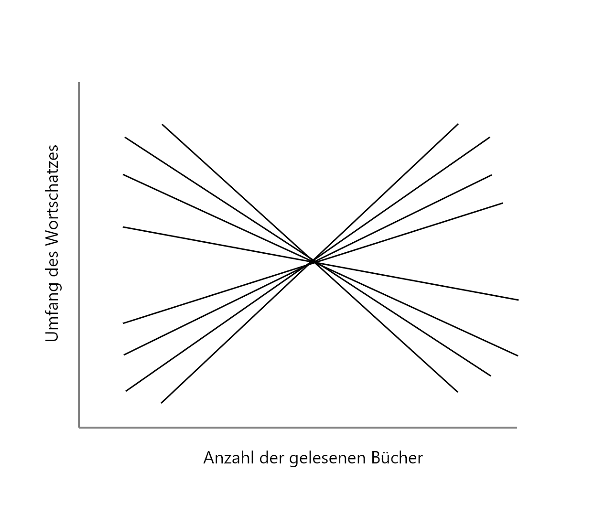

**Theorie, dass es eine Korrelation gibt**

Wenn deine Theorie besagt, dass es eine Korrelation zwischen zwei Variablen gibt, sind alle Korrelationen außer 0 mit deiner Theorie konform.

Ein einziger Befund würde deine Theorie falsizifieren: Die Nulkorrelation. In der Praxis tritt eine Korrelation von 0 allerdings so gut wie nie auf, da zwei Variablen immer in einer gewissen Weise miteinander korrelieren:

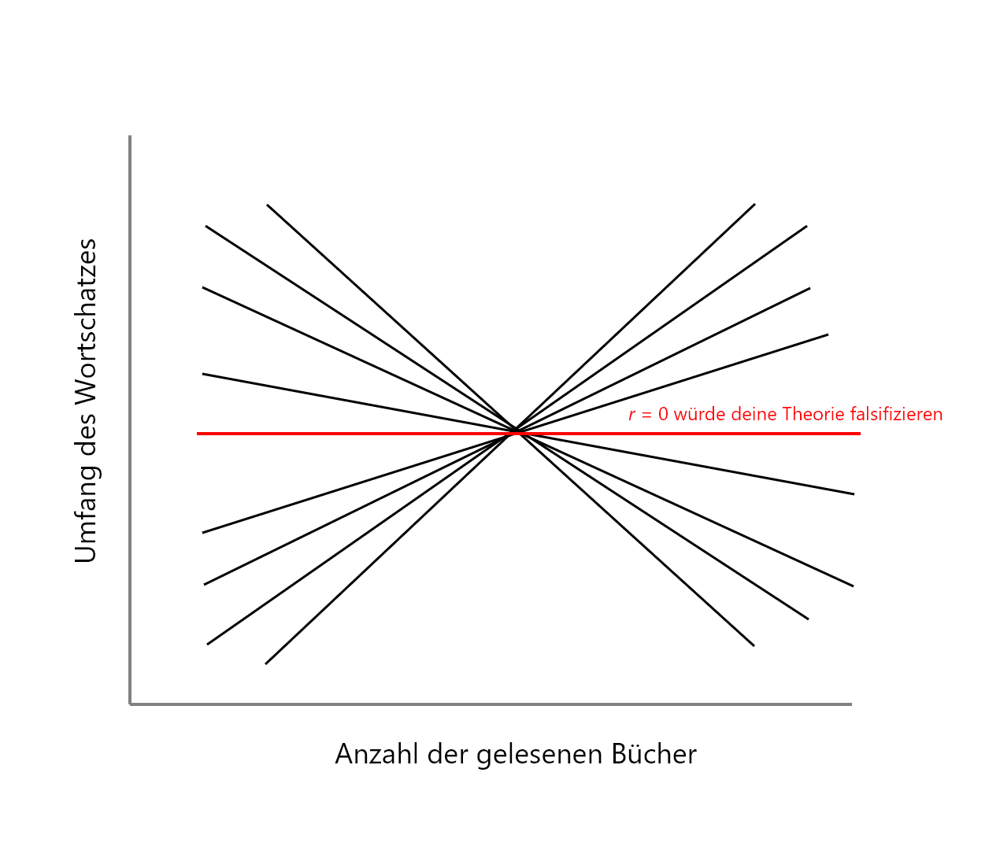

**Die Nullkorrelation als Falsifikation deiner Hypothese**

Lediglich die rote Korrelation (*r* = 0) würde deine Hypothese falsifizieren. Dein Test wäre daher schwach, da fast alle Beobachtungen konform zu deiner Theorie sind. Der Grad deiner Falsifikation wäre zu klein.

Ein besserer Test wäre es, spezifische Aussagen zu machen. Indem du beispielsweise behauptest, es gibt eine positive Korrelation (bzw. positiver Zusammenhang) zwischen der Anzahl der gelesenen Bücher und dem Umfang des Wortschatzes von Personen gibt, schließt du bereits 50% der Korrelationen aus und erhöhst dadurch die Falsifikation deiner Hypothese:

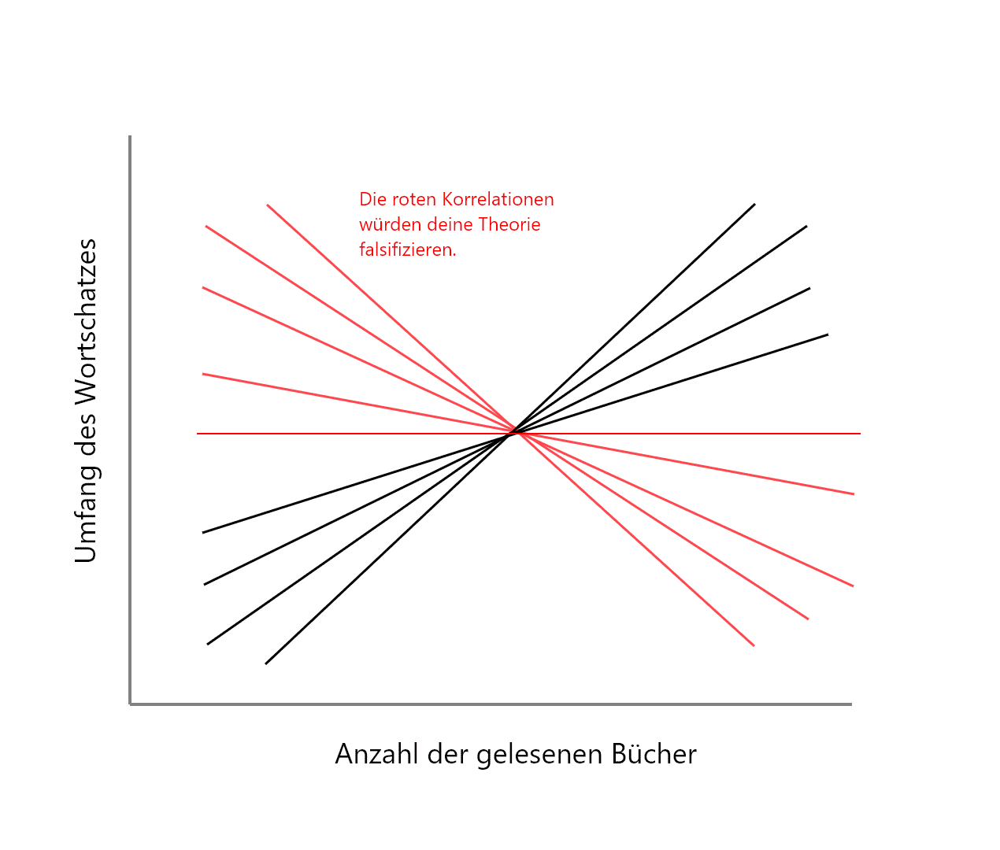

**Die gerichtete Hypothese ist falsifizierbarer als die ungerichtete Hypothese**

Indem du von einer positiven Korrelation ausgehst, erhöhst du den Grad der Falsifikation, da 50% der Werte deine Theorie falsifizieren würden (*r* \< 0).

Noch besser wäre es, würden wir noch genauere Aussagen über die Korrelation treffen können. Beispielsweise, die Korrelation ist größer als *r* \> .30. Diese Annahme würde 80% der möglichen Korrelationen ausschließen und die Falsifizierbarkeit deiner Annahme noch weiter erhöhen. Die Falsifikation können wir noch weiter steigern, indem wir Aussagen über die Reichweite unserer Theorie treffen. Gehen wir beispielsweise davon aus, dass unsere Korrelation nur für "hohe Literatur" gilt, kann unsere Theorie spezifischer getestet und damit falsifiziert werden. 

In psychologischen Fachartikeln finden wir immer wieder Hypothesen mit einer geringen Falsifizierbarkeit. Wenn ich beispielsweise teste, ob sich zwei Versuchsgruppen voneinander unterscheiden, erlaube ich, dass sowohl Gruppe A als auch Gruppe B höhere Werte haben darf als die andere Gruppe. Wenn ich allerdings sage, dass Gruppe A höhere Werte als Gruppe B haben sollte, habe ich meine Falsifizierbarkeit erhöht. Als geübte Leser\*in wissenschaftlicher Artikel solltest du daher lernen, den Grad der Falsifizierbarkeit einer Hypothese oder einer Theorie einzuschätzen. Ist die Falsifizierbarkeit gering, wird der Artikel weniger gut geeignet sein, eine Theorie zu testen als wenn die Falsifizierbarkeit hoch ist.

### Das Problem der Falsifikation

Falsifikation fördert die kritische Diskussion, sie ist allerdings selbst Gegenstand von Kritik. Wir hatten gesagt, dass Falsifikation durch empirische Beobachtungen geschieht. Widerlegen die Beobachtungen unsere Theorie, müssen wir unsere Theorie auf Dauer überdenken. Allerdings kann man sich diesem Prozess entziehen, indem man die empirische Beobachtung selbst anzweifelt. Nehmen wir die Intelligenz als Beispiel. Stell dir vor, deine Theorie besagt dass Intelligenz den Wohlstand von Menschen vorhersagt. Je intelligenter Personen sind, desto größeren Wohlstand besitzen sie. Intelligenz testest du mit dem [Raven's Progressive Matrices Test](http://eyeonsociety.co.uk/resources/RPMChangeAndStability.pdf). Nun könnte man dich für die Wahl dieses Tests kritisieren. Es kann ja sein, dass dieser Test nur bestimmte Aspekte der Intelligenz testet bzw. nicht Intelligenz, sondern ein anderes Konstrukt testet. Wäre dem so, ist dein Test nicht geeignet, deine Theorie zu falsifizieren. Noch mehr, der Test selbst müsste der Falsifikation stand halten. 

Das Beispiel zeigt uns sehr deutlich, dass Wissenschaftler\*innen einen Konsens finden müssen, unter welchen Bedingungen sie Falsifikation erlaubt. Dieser Konsens ist ausgehandelt und ebenso wenig "wahr" wie die Theorie selbst. Vielmehr ist sowohl die Theorie als auch die Methodik zur Beanwortung statistischer Fragestellungen immer Gegenstand eines kritischen Austausches, der nie zu Ende gehen wird.

### Inwieweit sind Theorien der Lehr- und Lernforschung falsifizierbar?

Theorien in der Lehr- und Lernforschung sind meist probabilistisch, das heißt, sie machen Aussagen über eine Population an Menschen und besagen, dass ein Befund wahrscheinlich eintreten wird und nicht auf jeden Fall eintreten wird. Das Gegenstand zur Probabilistik ist der Determinismus. Deterministische Aussagen treffen immer zu. Wenn ich beispielsweise deterministisch behaupten würde, verteiltes Lernen ist lernwirksamer als massiertes Lernen, würde bereits *ein* Gegenbefund, meine Hypothese widerlegen. Theorien der Lehr- und Lernforschung sind allerdings nicht deterministisch, sondern probabilistisch. Du kennst diesen Unterschied aus deinem Alltag. Wenn du behauptest, dass Rauchen krebserregend ist, gibt es immer wieder Personen, die einen Onkel kennen, der zwar ein Leben lang geraucht hat, aber nie Krebs bekommen hat. Diese Kritik ist allerdings unangebracht, da die Aussage probabilistisch gemeint war. Also, Rauchen erhöht die Wahrscheinlichkeit Krebs zu bekommen. Wer raucht muss nicht zwangsläufig Krebs bekommen. 

Wenn nun einzelne empirische Beobachtungen unsere Theorie nicht falsifizieren können, ist die Lehr- und Lernforschung überhaupt eine Wissenschaft? Ja, da nicht einzelne Beobachtungen Theorien der Lehr- und Lernforschung falsifizieren, sondern viele solcher Beobachtungen. Stell dir das Würfeln einer Münze vor. Du gehst davon aus, dass die Münze fair ist, das heißt Kopf und Zahl kommen mit einer Wahrscheinlichkeit von 50% dran. Hättest du diese Annahme widerlegt, wenn deine Münze fünf mal am Stück Kopf ist? Oder 100 mal? Nein, da solche Ereignisse zwar ungewöhnlich, aber nicht unmöglich sind. Wenn nun aber Kopf immer wieder häufiger auftritt, wirst du mit der Zeit genügend Evidenz haben, die Annahme der fairen Münze aufzugeben. 

Genau weil die Falsifikation in der Lehr- und Lernforschung nur über einen längeren Zeitraum und viele Untersuchungen gelingt, können Wissenschaftler\*innen eine Theorie als auch einen Befund gegen diese Theorie akzeptieren. Selbst wenn eine Studie zeigt, dass beispielsweise eine hohe extrinsische Belastung lernförderlich ist, wird diese Studie dich nicht dazu bringen, die Cognitive Load Theory umzuschmeißen. Erst eine Fülle an Untersuchungen, die ebenda zeigen, dass extrinsische Belastungen lernförderlich sind, würden dich an der Theorie zweifeln lassen.

### Zusammenfassung

Wir haben in diesem Submodul gesehen, dass die Falsifikation das Herz des wissenschaftlichen Erkenntnisgewinns ist. Zwar können wir auf Grundlage der Induktion keine Theorien bestätigen, wir können sie allerdings falsifizieren. Präzise Hypothesen erhöhen die Falsifikation und sollten gesucht werden. Sind Aussagen nicht präzise ist es teils nicht mehr möglich, eine Theorie zu falsifizieren. Ebenso haben wir gesehen, dass einzelne empirische Beobachtungen in probabilistischen Disziplinen wie der Lehr- und Lernforschung nicht genügen, um Theorien zu falsifizieren. Erst die Sammlung einer Vielzahl an Evidenz bringt uns dazu, Theorien über Bord zu werfen. Wir werden im nächsten Submodul sehen, dass die Idee der Falsifikation mit den Konzepten des p-Wertes und der Power verknüpft werden kann.

## Stichprobenkennwertverteilungen

In diesem Submodul lernst du, was Stichprobenkennwertverteilungen sind. Dieses Submodul ist Grundlage der nächsten Submodule. Der Zweck von Stichprobenkennwertverteilungen wird sich erst nach den nächsten beiden Submodulen für dich erschließen. Wir müssen allerdings das Konzept gemeinsam verstehen, damit du den nächsten Submodulen folgen kannst. Das Submodul ist wie folgt aufgebaut:

-   Skalenniveaus und diskrete/stetige Verteilungen

-   Was ist eine Stichprobenkennwertverteilung?

-   Normalverteilung

-   Standardnormalverteilung

-   *t*-Verteilung(en)

### Skalenniveaus und diskrete/stetige Verteilungen

#### Skalenniveaus

Stell dir vor, du nimmst an einem Experiment teil, bei dem dein Intelligenzquotient ermittelt wird. Du erhältst einen Wert von 105. Ebenso wirst du bei dem Experiment nach deinem Geschlecht, deinem Alter und deinem höchsten Bildungsabschluss befragt. Die Forschenden sammeln die Werte dieser Variablen bei 40 Versuchspersonen und tragen die Werte in eine Excel-Tabelle ein:

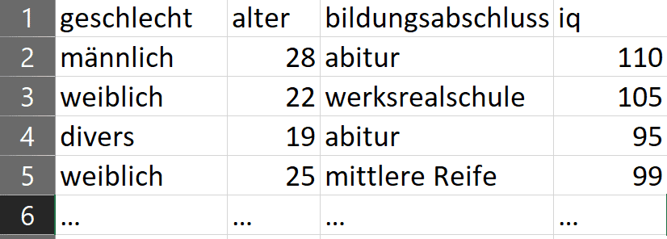

Die Excel-Tabelle enthält vier Variablen. Das Geschlecht, das Alter, den Bildungsabschluss und den IQ der Versuchspersonen.

Wie würdest du diese vier Variablen voneinander unterscheiden? Versuche im Folgenden jeder Variable eine zentrale Eigenschaft zuzuordnen:

TODO: interaktive Zuordnung auf Rise, wusste nicht wie ich sowas hier erstelle. "Ordne den Variablen ihre zentrale Eigenschaft zu:"

Diese Unterschiede in Variablen bezeichnen wir als Skalenniveaus. Es gibt insgesamt vier Skalenniveaus:

TODO: Tabs zu Nominalskala, Ordinalskala, Intervallskala, Verhältnisskala

Nominalskalierte Variablen haben keine Werte zwischen Ausprägungen. Beispielsweise kommt man entweder aus Bayern oder aus Hessen. Einen Wert dazwischen gibt es nicht.

Ordinalskalierte Variablen haben eine Hierarchie von niedrig zu hoch oder von einfach zu schwer. Das Bildungsniveau ist ein klassisches Beispiel für eine ordinalskalierte Variable. Abitur wird als höher eingeschätzt als eine mittlere Reife.

Intervallskallierte Variablen haben Werte zwischen Ausprägungen. Beispielsweise gibt es unendlich viele Werte zwischen einem Intelligenzquotienten von 100 und 110. Intervallskalierte haben allerdings keinen Nullpunkt. Zum Beispiel gibt es keinen Intelligenzquotienten von 0.

Verhältnisskalierte Variablen haben ebenso unendlich viele Ausprägungen zwischen Variablen und ebenso einen Nullpunkt. Das Alter ist ein Beispiel für eine verhältnisskalierte Variable.

#### Diskrete und stetige Verteilungen

Diskrete Wahrscheinlichkeiten zeichnen sich dadurch aus, dass sie auf Grundlage von nominalskalierten und ordinalskalierten Daten berechnet werden. Beispielsweise können wir die Wahrscheinlichkeit berechnen, beim Würfeln die Augenzahl 5 zu würfen (1/6). Die Augenzahl ist eine ordinalskalierte Variable. Wir werden allerdings in diesem Kurs wenige Hypothesen auf Grundlage diskreter Stichprobenkennwertverteilungen testen. Relevant sind diskrete Stichprobenkennwertverteilungen, wenn du beispielsweise testen möchtest, ob in einer Gruppe mehr Frauen als Männer sind. 

Im Unterschied dazu werden stetige Wahrscheinlichkeiten bei Variablen berechnet, die **metrisch** (intervallskaliert oder verhälnisskaliert) vorliegen. Beispielsweise können wir die Wahrscheinlichkeit berechnen, größer als 1,80 Meter zu sein. Die Wahrscheinlichkeit einzelner Ereignisse, z.B. die Größe 182,331243433454 cm geht gegen Null, da es unendliche viele Ausprägungen zwischen Variablen gibt. Beispiele für stetige Verteilungen sind die Normalverteilung, die Standardnormalverteilung und die t-Verteilung, welche wir gleich kennen lernen werden.

### Was ist eine Stichprobenkennwertverteilung?

Der Begriff Stichprobenkennwertverteilung umfasst drei Unterbegriffe: Stichprobe, Kennwert und Verteilung. Gehen wir die drei Begriffe zunächst durch:

1.  **Stichprobe**: Eine Stichprobe ist eine Teilmenge aus einer Grundgesamtheit. Zum Beispiel werden Wahlvorhersagen werden auf Grundlage von Stichproben gezogen, da es mühselig wäre, alle Menschen einer Population (die Grundgesamtheit) zu befragen. Daher erheben wir immer nur einen kleinen Anteil der Population und versuchen auf Grundlage dieser Stichprobe auf die Population zu schließen.

2.  **Kennwert**: Statistische Kennwerte fassen Datenpunkte zusammen. Du kennst bereits mehrere dieser Kennwerte: Der Mittelwert, die Standardabweichung, die Varianz oder der z-Wert. Der Mittelwert gibt den typischen Wert einer Verteilung an, die Varianz gibt an, wie weit Werte um einen Mittelwert streuen.

3.  **Verteilung**: Eine Verteilung ist eine grafische Darstellung des Auftretens einzelner Ausprägung einer Variable. Beispielsweise kennst du unimodale Verteilungen mit nur einem Gipfel, bimodale Verteilungen mit zwei Gipfeln und stetige Verteilungen.

> Eine Stichprobenkennwertverteilung ist eine grafische Verteilung von Kennwerten, die aus mehreren Stichproben gewonnen werden.

Aus dieser Definition können wir ein paar Beispiele für Stichprobenkennwertverteilungen finden: 

-   Die Verteilung von Mittelwerten, die aus mehreren Stichproben berechnet werden.

-   Die Verteilung von Mittelwertsdifferenzen, die aus mehreren Stichproben berechnet werden.

-   Die Verteilung von Varianzen, die aus mehreren Stichproben berechnet werden.

#### Simulation einer Stichprobenkennwertverteilung des Mittelwerts

Um Stichprobenkennwertverteilungen besser zu verstehen, hilft es diese zu simulieren. Stell dir vor, du ziehst eine Stichprobe von 20 Personen aus der Grundgesamtheit aller Menschen in Deutschland. Jede Person lässt du einen Intelligenztest durchführen. Aus den Intelligenzquotienten der zwanzig Personen erstellst du ein Histogram:

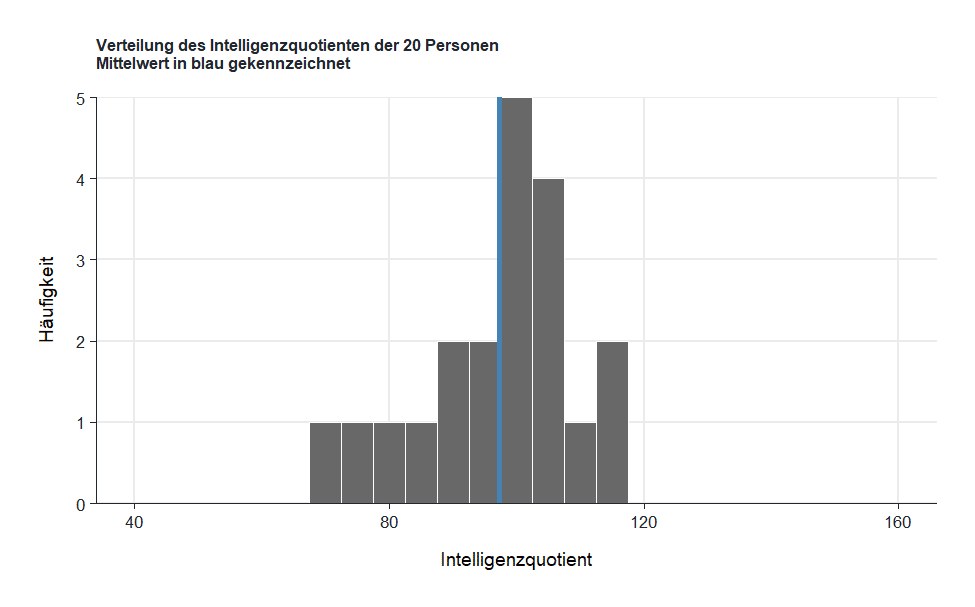

Der Mittelwert deiner Stichproben, sprich dein Kennwert, beträgt 97.32. Stell dir als nächstes vor, du wiederholst dieses Vorgehen und ermittelst erneut den Mittelwert aus einer neuen Stichprobe. Stell dir vor, du hast Superkräfte und bist in der Lage insgesamt 10.000 Mittelwerte als Kennwerte zu ermitteln. So würden sich deine Mittelwerte über die Zeit verteilen:

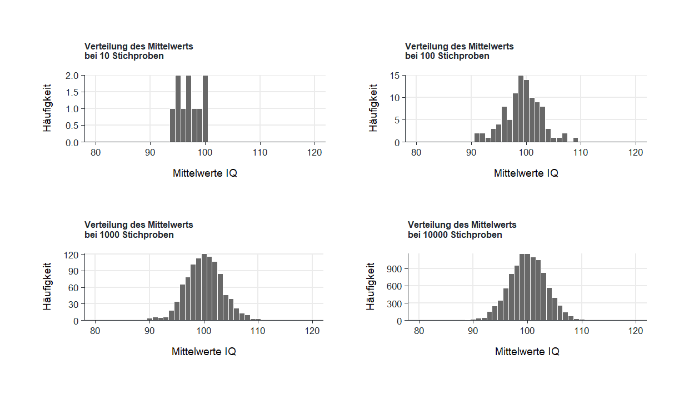

Drei Dinge fallen uns auf:

1.  Erstens, je mehr Kennwerte ich sammle, desto unimodaler wird die Verteilung. Bei einer Kennwertgröße von 10000 Stichproben (Kennwerten) erhalte ich eine fast perfekt unimodale Verteilung. Dieses Phänomen wird als [zentrales Grenzwerttheorem](https://de.wikipedia.org/wiki/Zentraler_Grenzwertsatz) bezeichnet.

2.  Zweitens, die Kennwerte streuen. Selbst wenn der wahre Mittelwert der Population bei 100 liegt, erhalten wir deskriptive Unterschiede des Kennwerts in den Stichproben. Beispielsweise einen Mittelwert von 95.

3.  Drittens sehen wir, dass manche Mittelwerte wahrscheinlicher sind als andere. Ein Mittelwerte von etwa 100 ist sehr wahrscheinlich, ein Mittelwerte von etwa 90 ist sehr unwahrscheinlich.

Eine solche Verteilung bezeichnen wir als Stichprobenkennwertverteilung. Stichprobenkennwertverteilungen visualisieren die Verteilung von Kennwerten aus Stichproben. In unserem Fall visualisieren wir die Verteilung von Mittelwerten aus einer Population aus 10.000 Stichproben mit 20 Personen.

#### **Visualisierung der Stichprobenkennwertverteilung des Mittelwerts bei 10000 Kennwerten und variierenden Stichprobengrößen**

Versuchen wir etwas anderes als nächstes. Stell dir vor, du bestimmst erneut 10.000 Mittelwerte aus der Population. Nur diesmal variierst du, wie viele Versuchspersonen pro Experiment getestet werden. Genauer testest du jeweils 20, 50, 100 und 500 Personen pro Erhebung. Im Folgenden siehst du, wie sich die Kennwerte in diesen vier Versuchsreihen verteilen würden:

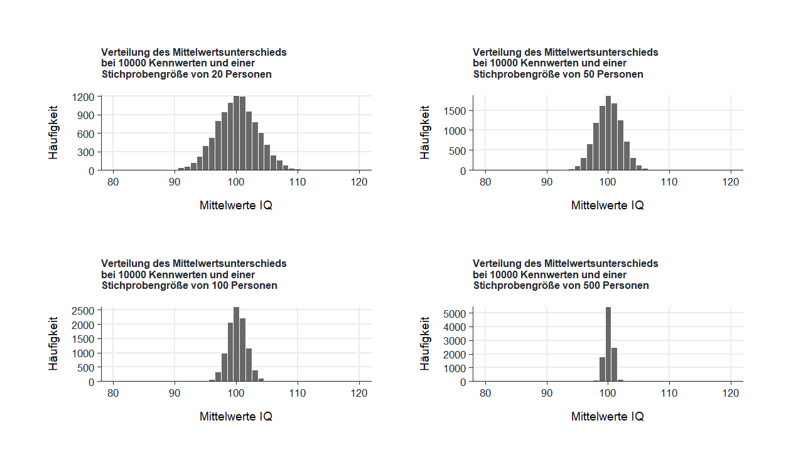

Offensichtlich wird die Verteilung steiler, wenn du mehr Versuchspersonen pro Erhebung verwendest. Warum? Ich gebe dir zwei Antworten. Erstens bist du mit einer größeren Stichprobe eher in der Lage, den exakten Mittelwert der Population zu ermitteln. Stell dir ein Extrem vor: Du erhebst aus den 82 Millionen Menschen in Deutschland 81 Millionen Menschen. Der Mittelwert der Intelligenz dieser riesigen Stichprobe wird ziemlich sicher ähnlich zu dem Mittelwert der Population sein. Wenn du allerdings nur 100 Personen testest, wirst du vermutlich einen Mittelwert finden, der stärker von dem Populationsmittelwert abweicht. Die zweite Antwort erklärt sich durch das Konzept des Standardfehlers:

#### Der Standardfehler

Der Standardfehler ist definiert als die Standardabweichung einer Stichprobenkennwertverteilung. Die Standardabweichung kennst du bereits:

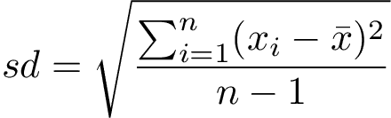

**Formel des Standardabweichung**

Der **Standardabweichung** ist ein Maß der Streuung. Er ist ein standardisierter Wert, der angibt, wie stark Werte in einer Verteilung voneinander streuen. Je größer die Standardabweichung, desto größer ist die Streuung einer Variable. Die Standardabweichung wird sowohl mit *s* als auch mit *sd* gekennzeichnet.

Du kennst die Standardabweichung vermutlich mit einem *n* im Nenner. Dies ist korrekt, sofern man die Standardabweichung einer Stichprobe angeben möchte. Will man hingegen die Standardaweichung der Variable in der Population messen, verwendet man *n - 1*. Dies wird auch als [Bessel's correction](https://en.wikipedia.org/wiki/Bessel%27s_correction) bezeichnet.

Der **Standardfehler** ist eine besondere Form der Standardabweichung. Er gibt an, wie stark die Kennwerte in einer Stichprobenkennwertverteilung streuen. Nehmen wir unser Intelligenzbeispiel erneut zur Hand:

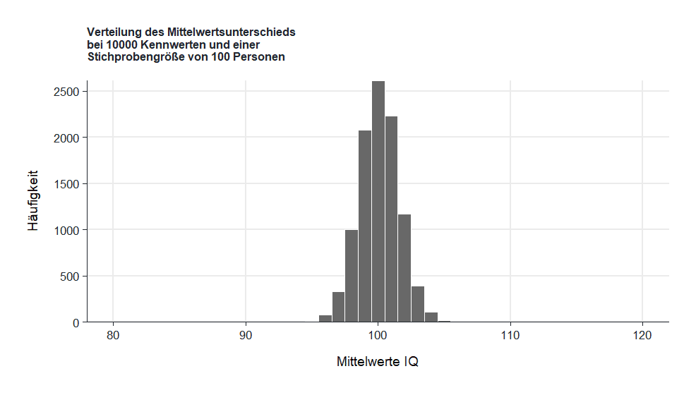

Das Bild stellt die Stichprobenkennwertverteilung der Mittelwerte der Intelligenzquotienten bei einer Stichprobengröße von 100 und 10.000 Erhebungen dar. Du siehst, dass es eine Verteilung ist, sprich, es herrscht eine Streuung in den Werten. Diese Streuung beschreiben wir durch den Standardfehler.

Es gibt zwei Formeln, um den Standardfehler für eine Stichprobenkennwertverteilung zu beschreiben. Eine, die exakt ist und nur zu berechnen ist, wenn man die Standardabweichung der Population kennt und eine, die auf Grundlage der Standardabweichung der Stichprobe geschätzt wird. Beginnen wir mit der exakten Formel:

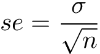

**Exakter Standardfehler**

Im Zähler steht die Standardabweichung der Variable in der Population. Diesen Werten nennt man Sigma. Im Nenner steht die Wurzel aus der Stichprobengröße. Mit dieser Formel verstehst du nun, warum in unserer vorherigen Simulation der Standardfehler mit steigender Stichprobengröße immer kleiner wurde. Nehmen wir an, Sigma ist 2 und deine Stichprobengröße sind 10 Personen. Dann wäre der Standardfehler: 2 / Wurzel aus 10 = 0.63. Erhebst du hingegen 50 Personen, wäre der Standardfehler: 2 / Wurzel aus 50 = 0.28. Du siehst daran, dass der Standardfehler eine Funktion der Stichprobengröße ist. Mit steigender Stichprobe sinkt der Standardfehler, sprich die Strichprobenkennwertverteilung des Mittelwertes wird schmaler.

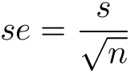

**Geschätzer Standardfehler**

Wir kennen allerdings fast nie die Standardabweichung einer Variable in der Population. Da wir fast nie die gesamte Population erheben können und somit auch nicht die Standardabweichung der Population kennen, ziehen wir die Standardabweichung der Stichprobe zur Hilfe, indem wir den Standardfehler auf Grundlage der Standardabweichung der Stichprobe (*s*) schätzen. Dieser Wert wird nicht exakt gleich sein mit dem echten Wert, allerdings eine gute Annährung.

#### Unterschied Populationsverteilung und Stichprobenkennwertverteilung

Vergleicht man die Verteilung einer Variable und der Stichprobenkennwertverteilung dieser Variable in der Population, fällt einem ein Unterschied auf:

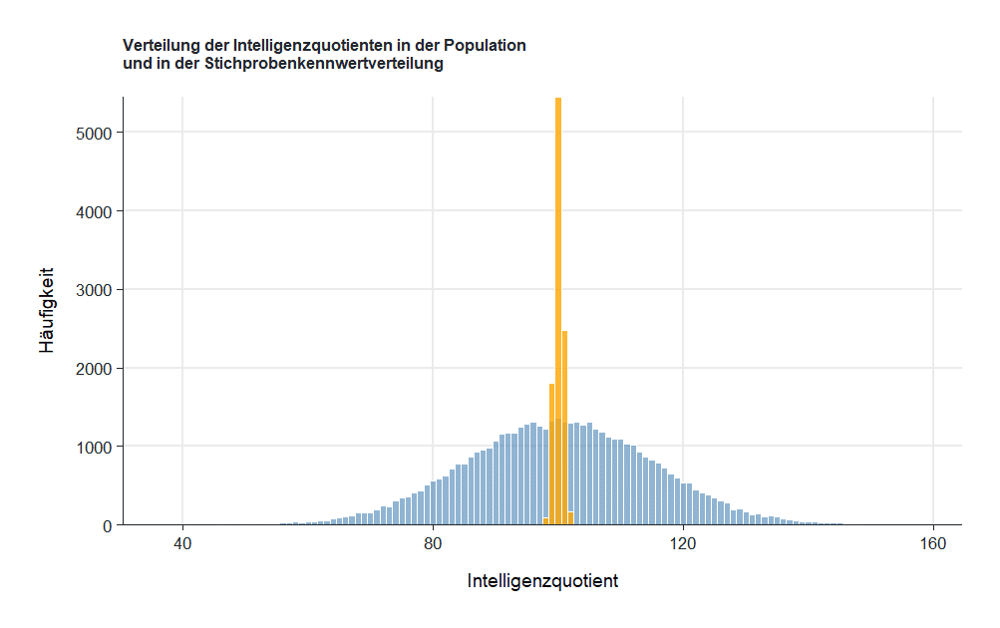

Die Streuung in der Variable ist immer größer als die Streuung in der Stichprobenkennwertverteilung. Im linken Bild ist orange die Stichprobenkennwertverteilung und blau die Populationsverteilung dargestellt. Wie du siehst ist die Streuung in der Populationsverteilung größer.

Wir haben nun etabliert was eine Stichprobenkennwertverteilung ist. Im nächsten Schritt lernen wir ein paar bekannte Stichprobenverteilungen kennen: Die Normalverteilung und die Standardnormalverteilung.

### Normalverteilung

Die wohl bekanntesten Verteilungen sind die Normalverteilung und die Standardnormalverteilung/z-Verteilung. Beide Verteilungen sind unimodal, das heißt sie haben nur einen Gipfel und beide Verteilung haben die Eigenschaft, dass ihre Fläche genau 1 ist. Dieser Eigenschaft machen wir uns später zunutze, um Wahrscheinlichkeiten zu berechnen.

Obwohl wir später weder eine Normalverteilung noch eine Standardnormalverteilung zur Prüfung von Hypothesen verwenden, ist es sinnvoll, diese zunächst zu behandeln. Erstens, da wir auf Grundlage dieser Verteilungen bereits die Idee der Wahrscheinlichkeitsrechnung vorweg nehmen können, die wir später benötigen, um unsere Hypothesen zu testen. Zudem stehen diese Verteilungen in Beziehungen zueinander. Beispielsweise werden wir feststellen, dass die *t*-Verteilung eine besondere Form der Standardnormalverteilung ist.

Normalverteilungen treten häufig in der Natur auf. Beispielsweise entspricht die Intelligenz von Personen in der Regel einer Normalverteilung. Ebenso entspricht die Größe von Personen oder der Blutdruck von Personen einer Normalverteilung. Normalverteilungen sehen ungefähr so aus. Achte darauf, dass wir von mehreren Verteilungen sprechen.

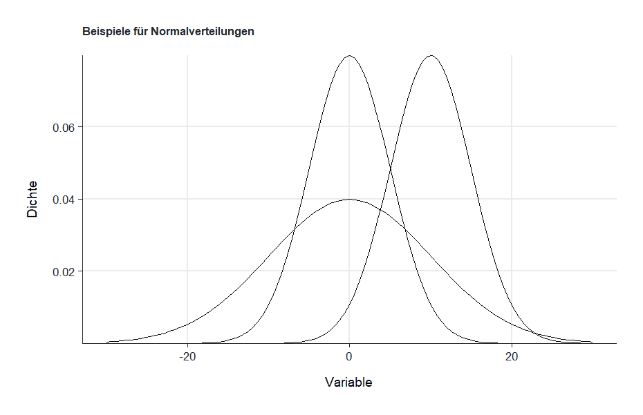

Normalverteilungen zeichnen sich durch folgende Eigenschaften aus:

-   Sie sind unimodal, dass heißt, sie haben nur einen Gipfel. 

-   Zudem sind Normalverteilungen immer symmetrisch um das Zentrum der Verteilung. Da die Normalverteilung symmetrisch ist, ist der Mittelwert, der Median und der Modus immer gleich.

Eine weitere interessante Eigenschaft der Normalverteilung ist, dass die die Fläche der Verteilung links und rechts um den Mittelwert bei einer Standardabweichung genau 68% beträgt. Bei zwei Standardabweichungen um den Mittelwert beträgt die Fläche \~ 95% und bei drei Standardabweichungen um den Mittelwert \~ 97.5%:

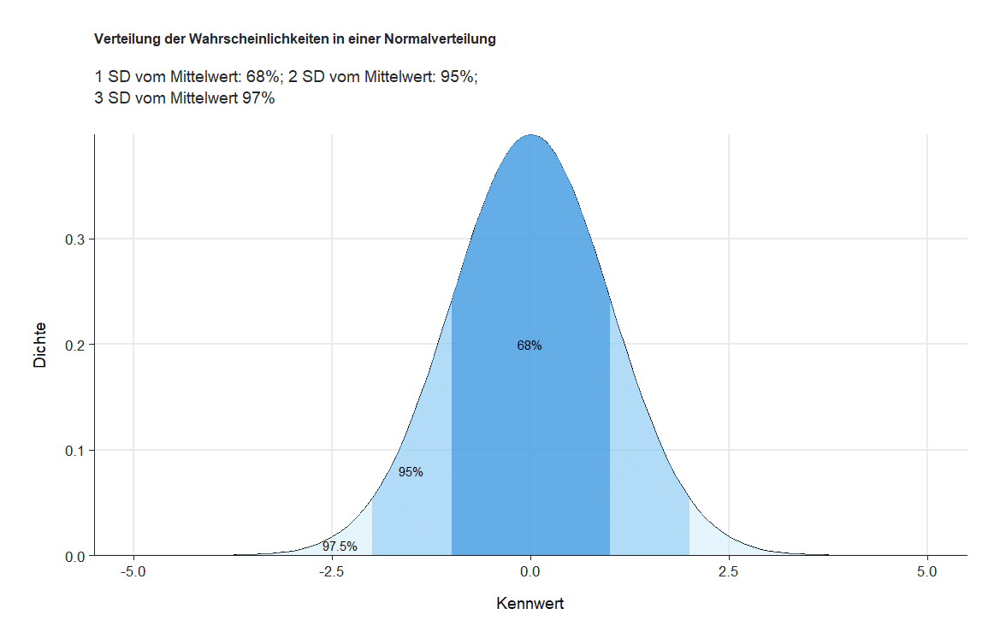

### Standardnormalverteilung

Die Standardnormalverteilung ist eine besondere Normalverteilung, für die Folgendes gilt: Der Mittelwert der Standardnormalverteilung ist immer 0 und die Standardabweichung der Standardnormalverteilung ist immer 1. Die Standardnormalverteilung wird auch z-Verteilung genannt, Kennwerte in der Standardnormalverteilung werden als z-Werte dargestellt.

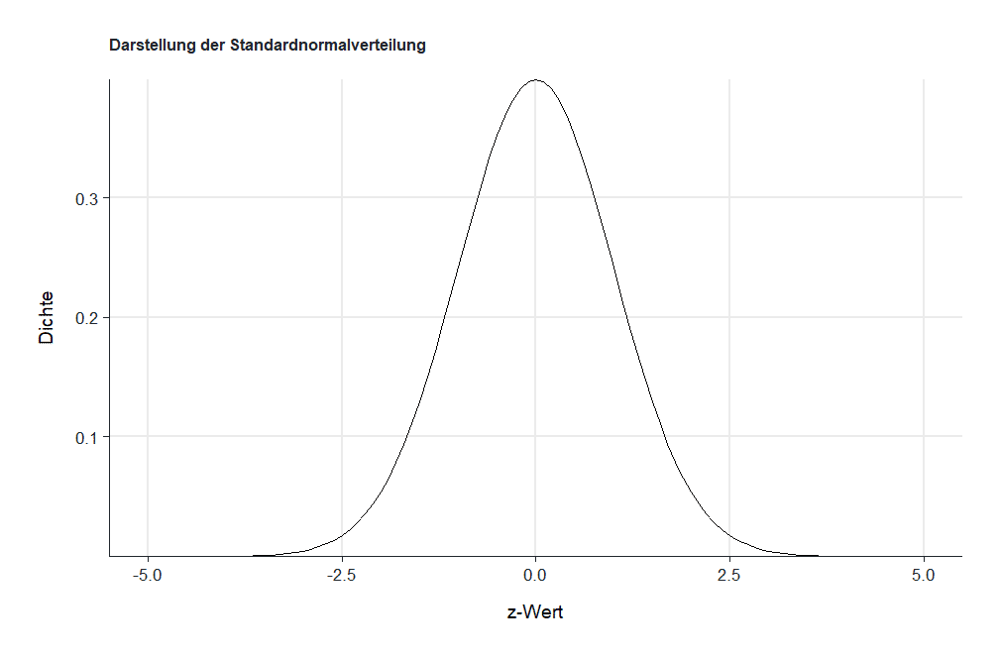

#### Wahrscheinlichkeitsberechungen auf Grundlage der Standardnormalverteilung

Du fragst dich an dieser Stelle vielleicht was wir mit diesen Verteilungen anfangen sollen? Um eine Antwort auf diese Frage zu bekommen, stell dir folgendes Szenario vor: Du möchtest wissen, ob du und deine vier Freunde intelligenter im Vergleich zur Gesamtbevölkerung seid? Du weißt, dass der Mittelwert der Population 100 ist, da dieser immer fest definiert wird. Die Standardabweichung der Intelligenzverteilung in der Population beträgt 15. Nun stellt ihr fest, dass ihr im Schnitt einen Intelligenzquotienten von 110 habt, also höher als der Durchschnitt. Die Frage ist, wie viel intelligenter seid ihr als die Gesamtbevölkerung? Hierzu können wir euren Mittelwert der Intelligenz zunächst in einen z-Wert umrechnen:

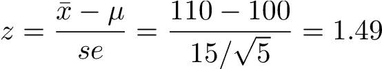

Mit dieser Berechnung versuchen wir den Mittelwert deiner Stichprobe zu standardisieren. Achte darauf, dass wir nicht den z-Wert einer Person anhand der der Populationsvariable berechnen, sondern deiner Stichprobe. Daher teilen wir durch den Standardfehler und nicht durch die Standardabweichung. Unser z-Wert ergibt 1.49. Das heißt, die Intelligenz euer Gruppe ist 1.49 Standardabweichungen größer als im Durchschnitt.

Diesen z-Wert können wir nun an der Standardnormalverteilung abtragen, um heraus zu finden, wie wahrscheinlich es ist bei der Größe eurer Stichprobe einen so hohen Intelligenzquotienten zu erhalten. Es stellt sich heraus, dass ein solcher Intelligenzmittelwert oder größer bei einer Stichprobe von 5 Personen in nur 6.81% der Fälle auftritt. Sprich, euer Mittelwert ist relativ unwahrscheinlich, wenn man annimmt, dass der Mittelwert der Stichprobenkennwertverteilung der Intelligenz 100 beträgt.

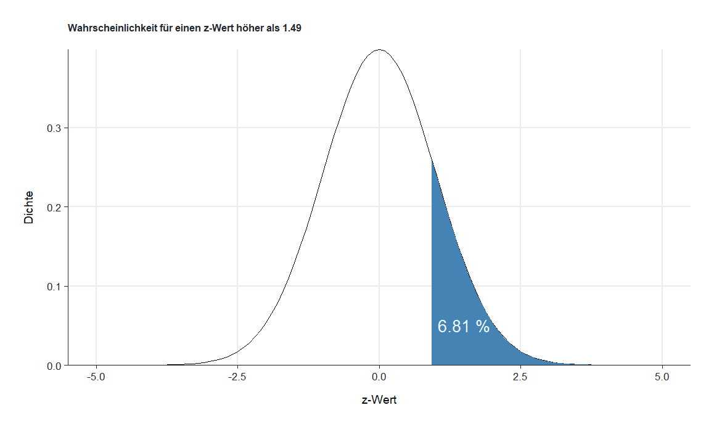

Wir könnten uns ebenso fragen, wie wahrscheinlich es ist, einen Mittelwert kleiner als 110 bei einer Stichprobengröße von 5 Personen zu erhalten? Hierfür müssten wir die Fläche links des z-Wertes abtragen:

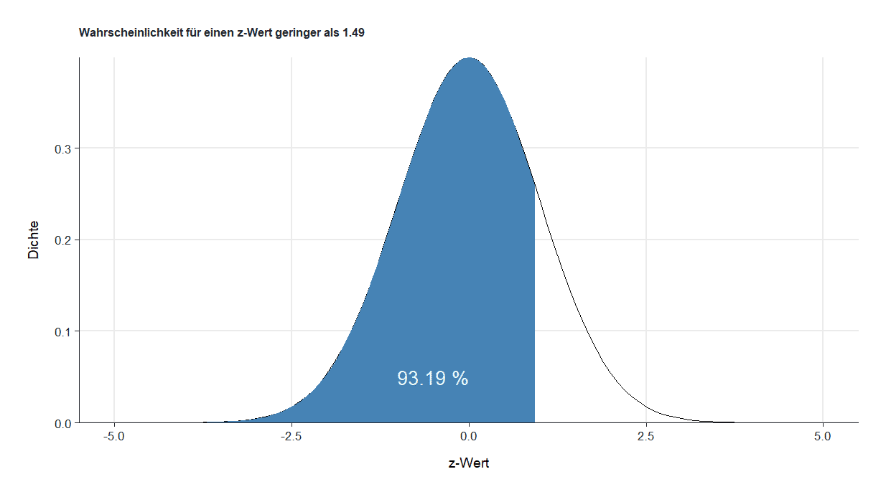

Wie du siehst, ist diese Wahrscheinlichkeit das Komplement der anderen Wahrscheinlichkeit. Die Wahrscheinlichkeit für einen z-Wert kleiner als 1.49 liegt bei 93.19%. Rechnen wir beide Wahrscheinlichkeiten zusammen, erhalten wir 100%: 93.19 + 6.81 = 100%.

### Zentrale Eigenschaften der Wahrscheinlichkeitsrechung

Versuchen wir an dieser Stelle einen allgemeineren Blick auf die Berechnungen von Wahrscheinlichkeiten durch Stichprobenkennwertverteilungen zu werfen. 

-   Die Wahrscheinlichkeit für ein einziges Ereignis in einer stetigen Stichprobenkennwertverteilung liegt bei 0%. Ein z-Wert von exakt 1.49 beispielsweise tritt nie auf, da es unendlich viele Nachkommastellen gibt.

-   Die Wahrscheinlichkeit für irgendein Ereignis beträgt 100%. Wir haben eben gesehen, dass beide Wahrscheinlichkeiten 100% ergeben. Damit haben wir gezeigt, dass die Fläche unter einer Stichprobenkennwertverteilung immer 100% oder 1 beträgt. 

-   Wir berechnen die Fläche unter einer Stichprobenkennwertverteilung durch ein Integral. 

Diese drei Regel gelten für alle Stichprobenkennwertverteilungen. Sie erlauben uns später Aussagen über die Wahrscheinlichkeiten von Ereignissen zu geben. Üben wir diesen Idee als nächstes an ein zwei Beispielen:

TODO: Interaktive Frage einfügen?

Wie wahrscheinlich ist es einen z-Wert kleiner als 0 zu erhalten? (10%/50%/100%)

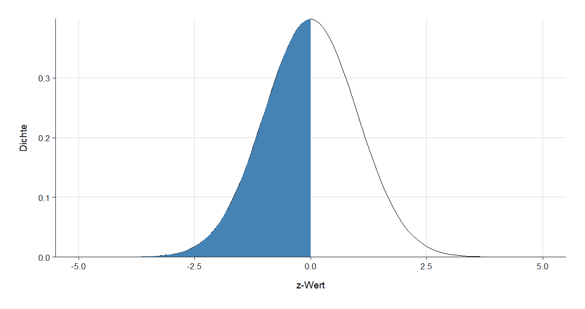

Wie wahrscheinlich ist es einen z-Wert zwischen -1 und 2 zu erhalten? (22%/82%/42%/12%)

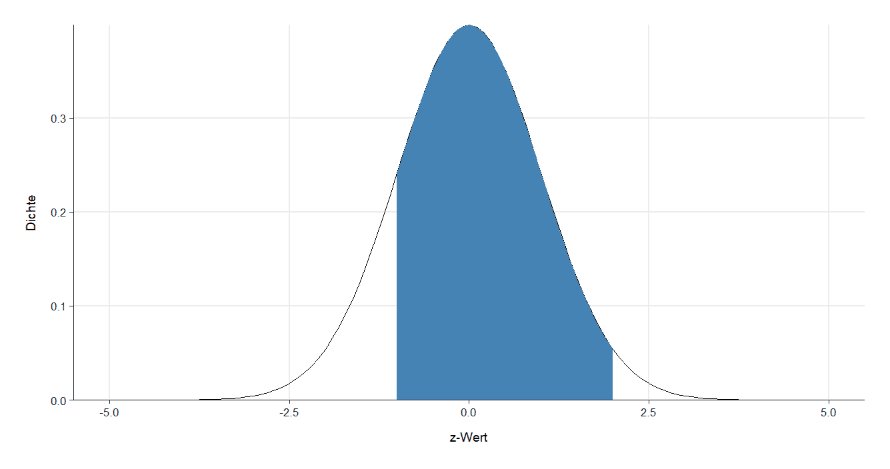

### t-Verteilung(en)

Eine besondere Gruppe an Stichprobenkennwertverteilung, die mit der Standardnormalverteilung verwandt sind, nennt man *t*-Verteilungen. **Wir verwenden eine *t*-Verteilung anstatt einer Standardnormalverteilung zur Überprüfung von Hypothesen, wenn wir die Standardabweichung der Population nicht kennen.** Dies ist meistens der Fall, daher werden in der Sozialforschung selten die Populationsparameter kennen (z.B. Mittelwert und Standardabweichung). Während es nur eine Standardnormalverteilung gibt, gibt es mehrere *t*-Verteilungen. Die *t*-Verteilungen ergeben sich aus der Größe der Stichprobe. Im Folgenden siehst du verschiedene *t*-Verteilungen, welche sich offensichtlich in ihrer Breite und Höhe unterscheiden:

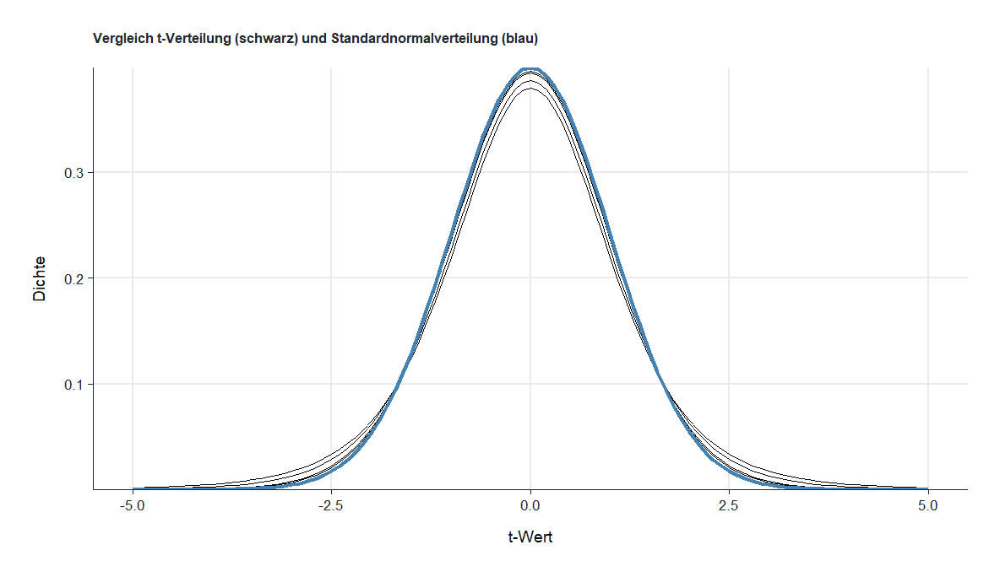

#### Simulation einer t-Verteilung auf Grundlage einer Stichprobe

Eine logische und berechtigte Frage ist, wie kommt man zu einer solchen *t*-Verteilung? Stell dir erneut vor, du möchtest überprüfen, wie wahrscheinlich es ist, in einer Gruppe von 5 Personen einen Intelligenzquotienten von 110 zu erhalten? **Diesmal kennst du allerdings nicht die Standardabweichung der Intelligenz in der Population**. Um den Mittelwert des Intelligenzquotienten eurer Gruppe zu standardisieren, musst du daher den Standardfehler auf Grundlage der Stichprobenstandardabweichung schätzen:

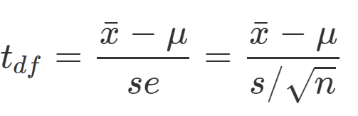

Der einzige Unterschied in der Berechnung des z-Wertes und des *t*-Wertes ist, dass du anstatt der Standardabweichung der Population die Standardabweichung der Stichprobe verwendest (hier s). Alle anderen Werte sind äquivalent zum z-Wert.

Stell dir als nächstes folgende Simulation vor: Du ziehst 10 mal, 100 mal, 1000 mal und 10.000 mal eine Stichprobe mit 10 Personen aus der Population, berechnest ihren durchschnittlichen Intelligenzquotienten und rechnest diesen Mittelwert in einen *t*-Wert um. Deine t-Werte würden sich wie folgt verteilen:

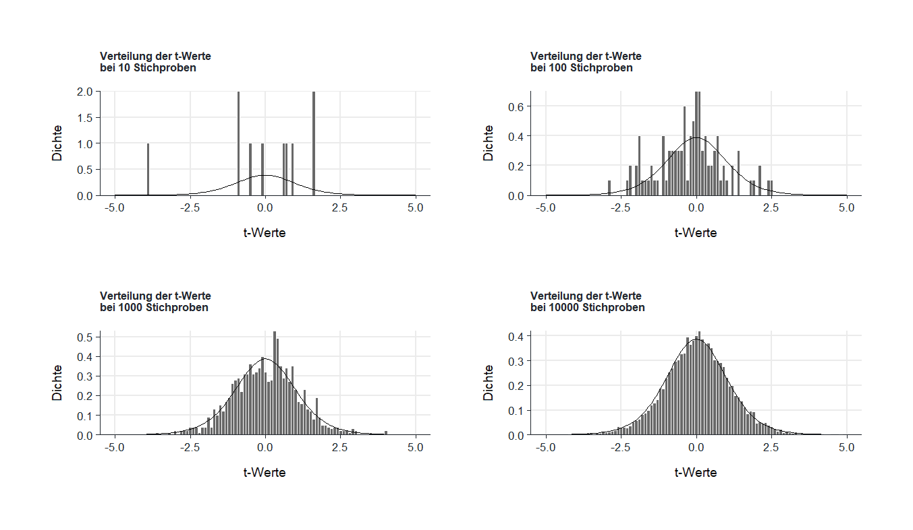

Du siehst an der Simulation, dass sich die *t*-Werte auf deiner Simulation mit steigener Stichprobengröße einer *t*-Verteilung annähern. In anderen Worten, *t*-Verteilungen stellen nichts anderes dar als die *t*-standardisierte Verteilung von Mittelwerten aus einer Population. Um zu verstehen, weshalb wir bei einer Stichprobe von 10 Personen gerade diese *t*-Verteilung verwenden, vergleichen wir die simulierte *t*-Verteilung bei 10.000 Stichproben mit einer *t*-Verteilung, welche aus einer Stichprobe mit 30 Personen:

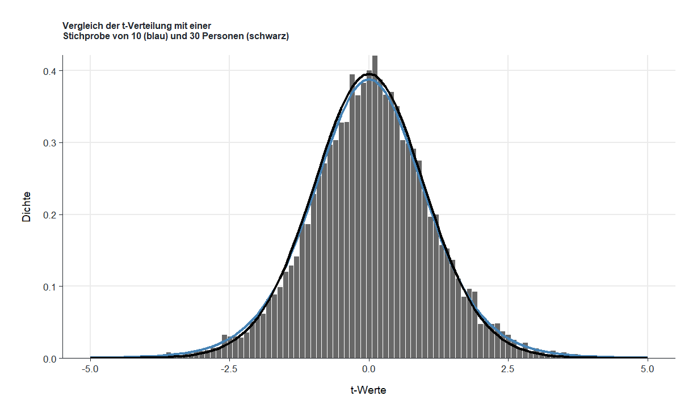

Wie du siehst, sind beide *t*-Verteilungen relativ ähnlich. Allerdings ist die *t*-Verteilung bei einer Stichprobe von 10 Personen (blau) etwas breiter als die *t*-Verteilung bei einer Stichprobe von 30 Personen (schwarz). Die passendere Verteilung ist offensichtlich die *t*-Verteilung mit 10 Personen, wenn auch nur minimal. Um daher die Wahrscheinlichkeit von Mittelwerten auf Grundlage einer *t*-Verteilung korrekt zu bestimmen, ist es notwendig, dass man die richtige *t*-Verteilung in Abhängigkeit der Stichprobengröße bestimmt.

#### Simulation einer t-Verteilung auf Grundlage von zwei Stichproben

Wir haben gerade gesehen, dass wir t-Verteilungen und Standardnormalverteilungen verwenden können, um die Wahrscheinlichkeit einzelner Mittelwerte anhand eines Populationsmittelwertes zu testen. Zum Beispiel, indem wir fragen, wie wahrscheinlich es ist, einen Intelligenzquotienten größer als 110 in einer Stichprobe zu erhalten.

*t*-Verteilungen können wir allerdings auch verwenden, um heraus zu finden, wie wahrscheinlich der Abstand zweier Stichprobenmittelwerte ist. Zum Beispiel könnten wir uns fragen, wie wahrscheinlich es ist, dass sich der Intelligenzquotient zweier Stichproben um 20 Punkte unterscheidet. Um diese Frage zu beantworten, können wir erneut t-Verteilungen verwenden. **Wir müssen allerdings die *t*-Werte anders berechnen**.

Stell dir dazu vor, du ziehst zwei Stichproben aus der Population und berechnest den Intelligenzquotienten dieser beider Gruppen. Der *t*-Wert bei zwei Stichproben ist nichts anderes als der standardisierte Mittelwertsunterschied dieser Stichproben. Standardisiert anhand des Standardfehlers.

TODO: Interaktive Formel

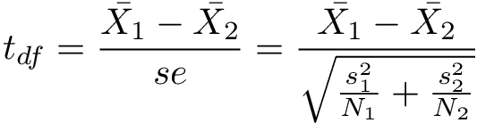

Erneut ziehen wir 10 mal, 100 mal, 1000 mal und 10.000 zwei Stichproben mit je 10 Personen aus der Population. Danach berechnen wir den *t*-Wert dieser Stichprobenpaaren und visualisieren diese t-Werte als Histogramme:

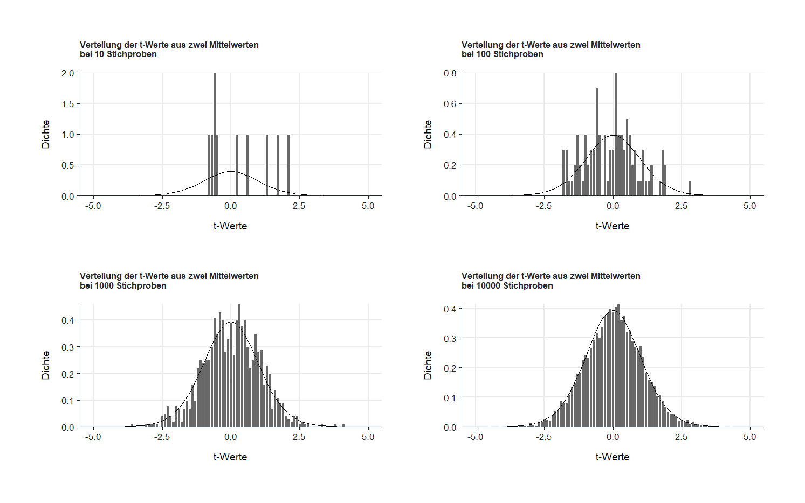

Erneut erkennst du anhand der Simulation, dass sich die *t*-Werte bei zwei Stichproben einer *t*-Verteilung annähern. Diese Verteilung zeigt uns, wie wahrscheinlich zwei Mittelwerte voneinander entfernt liegen, **sofern sie aus der gleichen Population stammen**. Zum Beispiel können wir aufgrund dieser Verteilung berechnen, wie wahrscheinlich es ist, dass der Intelligenzquotienten aus zwei Stichproben mehr als eine Standardabweichug voneinander abweichen. Wir können dies berechnen, indem wir die Fläche rechts und links des *t*-Wertes -1 und 1 abtragen und zusammen zählen:

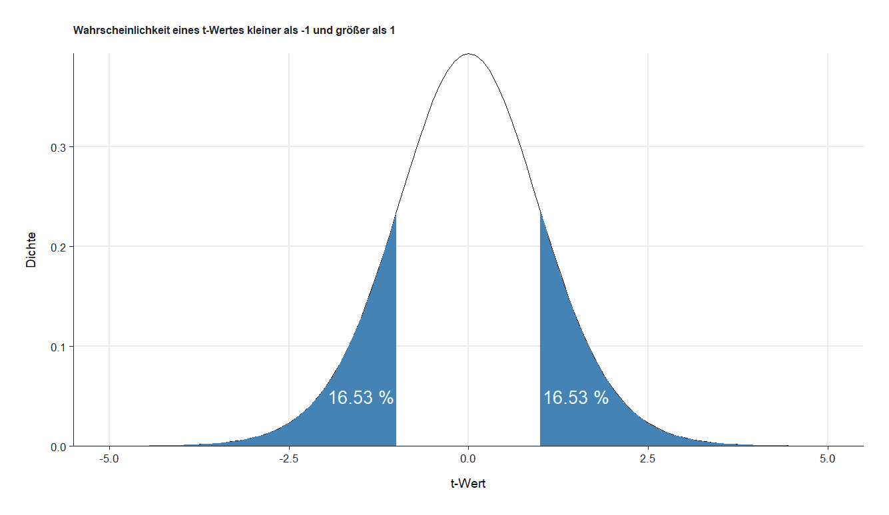

Wie du siehst, liegt die Wahrscheinlichkeit bei etwa 33%. Es ist also nicht äußerst unwahrscheinlich, aber auch nicht sehr wahrscheinlich, einen solch großen Unterschied aus einer Population zu finden.

### Zusammenfassung

In diesem Submodul haben wir gelernt, was Stichprobenkennwertverteilungen sind. Zunächst haben wir gelernt, dass Variablen in unterschiedlichen Skalenniveaus vorliegen können. Liegen Variablen als nominalskalierte oder ordinalskalierte Verteilungen dar, können wir sie durch diskrete Verteilungen darstellen. Liegen Variablen metrisch vor (intervall- oder verhältnisskaliert), können wir sie durch stetige Verteilungen darstellen. Diese stetigen Verteilungen bildeten den Rest dieses Submoduls. Wir haben gesehen, dass Stichprobenkennwertverteilungen genau das sind, was das Wort andeutet: Die Verteilung von Kennwerten aus Stichproben. Dabei haben wir erkannt, dass die Stichprobenkennwertverteilung des Mittelwerts immer eine Normalverteilung annimmt (zentrales Grenzwerttheorem). Die Standardnormalverteilung ist eine besondere Form der Normalverteilung, da sie immer einen Mittelwert von 0 und eine Standardabweichung von 1 hat. Wir haben ebenso gelernt, dass wir die Wahrscheinlichkeit von Kennwerten in stetigen Verteilungen wie der Standardnormalverteilung anhand des Integrals unter der Fläche der Verteilungen berechnen können. Diese Berechnungen sind Kern des restlichen Seminars, da wir durch Stichprobenkennwertverteilungen Hypothesen testen können. Zuletzt haben wir die *t*-Verteilungen kennen gelernt. *t*-Verteilungen sind eine besondere Form der Standardnormalverteilungen, in denen der Standardfehler der t-Werte anders berechnet wird als der Standardfehler der z-Werte. Im nächsten Modul werden wir sehen, wie Stichprobenkennwertverteilungen genutzt werden, um Hypothesen zu testen.

## Prozesse des statistischen Hypothesentestens

In diesem Submodul wirst du verstehen, wie Stichprobenkennwertverteilungen verwendet werden um Hypothesen in der Bildungsforschung zu testen. Wir werden hierzu jeden einzelnen Schritt von der Hypothese bis zu der statistischen Entscheidung kennen lernen. Dieses Verfahren wird uns das ganze Semester begleiten, indem wir für jede Hypothese den gleichen Prozess durchlaufen. Folgende Inhalte behandelt dieses Submodul:

-   Überblick über den Prozess des statistischen Hypothesentestens

-   Hypothesenpaar aufstellen

-   Statistische Modellierung des Hypothesenpaares

-   Kennwerte berechnen

-   Wahrscheinlichkeit des Kennwertes unter der H~0~: *P*(D\|H~0~)

-   Statistische Entscheidungen

-   Ausführliches Beispiel: *t*-test für eine Stichprobe

-   Zusammenfassung

### Überblick über den Prozess des statistischen Hypothesentestens

Beginnen wir mit einem Überblick über den Prozess des statistischen Hypothesentestens (siehe Bild oben). Am Anfang eines jeden Experiments steht die Hypothese. Genauer ein Hypothesenpaar. Schau dir beispielsweise folgende drei Hypothesen aus drei verschiedenen Fachartikeln an:

TODO: Hypothesen aus drei verschiedenen Fachartikeln in Tabs einfügen

Stull & Mayer (2017): In der folgenden Studie haben sich die Wissenschaftler gefragt, ob Lernende aus Lehrbüchern mehr lernen, wenn sie Grafiken teilweise selbst erstellen oder wenn die Grafiken vorgegeben werden. 

[Stull, A. T., & Mayer, R. E. (2007). Learning by doing versus learning by viewing: Three experimental comparisons of learner-generated versus author-provided graphic organizers. Journal of Educational Psychology, 99(4), 808--820. https://doi.org/10.1037/0022-0663.99.4.808](https://psycnet.apa.org/record/2007-17712-009?doi=1)

Müller & Oppenheimer (2014): In dieser Studie hatten die Wissenschaftler die Hypothese, dass es lernwirksamer ist in einer Vorlesung per Hand als mit dem Laptop mitzuschreiben.

\
[Mueller, P. A., & Oppenheimer, D. M. (2014). The pen is mightier than the keyboard: Advantages of longhand over laptop note taking. Psychological Science, 25(6), 1159-1168. \<https://doi.org/10.1177/0956797614524581\> ](https://journals.sagepub.com/doi/full/10.1177/0956797614524581)

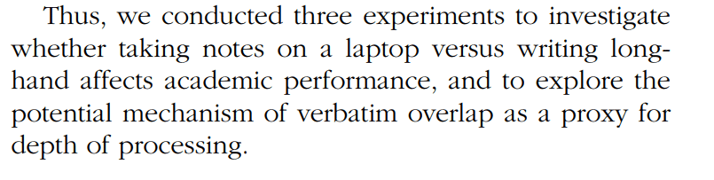

Hoggerheide et al. (2019): In dieser Studie untersuchten die Wissenschaftler\*innen, ob es lernwirksamer ist, anderen etwas zu erklären, als Lernmaterial wiederholt zu lernen.

[Hoogerheide, V., Renkl, A., Fiorella, L., Paas, F., & van Gog, T. (2019). Enhancing example-based learning: Teaching on video increases arousal and improves problem-solving performance. Journal of Educational Psychology, 111(1), 45--56. \<https://doi.org/10.1037/edu0000272\>](https://psycnet.apa.org/record/2018-14245-001)

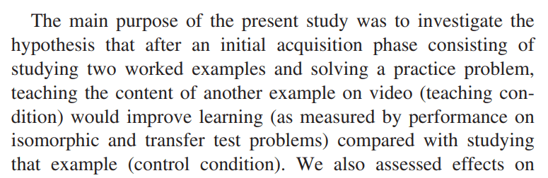

Müller und Oppenheimer (2014) beispielsweise glaubten, dass es lernwirksamer ist, Informationen aus einer Vorlesung mit der Hand aufzuschreiben als mit einem Laptop. Die Hypothese, welche man testen bzw. falsifizieren möchte, nennt man **Alternativhypothese**. Die **Nullhypothese** ist das Gegenstück der Alternativhypothese. Am Beispiel von Müller und Oppenheimer (2014) wäre die Nullhypothese, dass das Medium mit welchem man mitschreibt, keinen Einfluss auf das Lernen hat. Die Null- und Alternativhypothese bezeichnen wir als **Hypothesenpaar**.

Dieses Hypothesenpaar übersetzen wir als nächstes in statistische Modelle. Wir werden statistische Modell im nächsten Modul kennen lernen. Im Kern übersetzen wir bei der statistischen Modellierung unsere sprachlichen Hypothesen in eine mathematische Form.

Im Anschluss bestimmen wir Kennwerte auf Grundlage der statistischen Modellierung. Mit Kennwerten meinen wir *t*-Werte, *z*-Werte als auch *F*-Werte. Im letzten Submodul haben wir beispielsweise gesehen, dass der *t*-Wert genutzt werden kann, um heraus zu finden wie wahrscheinlich ein Mittelwert gegeben eines bestimmten Populationsmittelwerts ist.

Diese Kennwerte tragen wir an ihren Stichprobenkennwertverteilungen ab (z.B. *t*-Verteilung). Stichprobenkennwertverteilungen geben an, wie sich Kennwerte verteilen, wenn die Nullhypothese korrekt ist. Zum Beispiel: Wie würden sich die Mittelwerte zweier Stichproben unterscheiden, wenn Studierende, die per Hand schreiben genau so gut lernen wie Studierende, die mit dem Laptop mitschreiben. Dieser Schritt ist wird häufig von Studierenden missverstanden. **Wir bestimmen immer wie wahrscheinlich die Daten unter Annahme der Nullhypothese sind (P(D\|H)), nicht wie wahrscheinlich die Alternativhypothese gegeben der Daten ist (P(H\|D)).** Wir kommen gleich ausführlicher auf diese Idee zu sprechen. 

Zuletzt treffen wir eine statistische Entscheidung auf Grundlage dieser Wahrscheinlichkeit. Ist die Wahrscheinlichkeit für einen Kennwert sehr gering unter Annahme der Nullhypothese (ermittelt anhand der Stichprobenkennwertverteilung) entscheiden wir uns gegen die Nullhypothese. Ist die Wahrscheinlichkeit für einen Kennwert oder größer groß, entscheiden wir uns für die Nullhypothese. An dieser Stelle kommt die Idee der Falsifikation zum Tragen. Die Entscheidung betrifft vordergründig der Ablehnung einer Hypothese. Beispielsweise könnten wir auf Grundlage eines Experiments die Alternativhypothese ablehnen. Wir können die Alternativhypothese allerdings nie annehmen.

Zuletzt berichten wir den Prozess des statistischen Hypothesentestens, indem wir den Kennwert, die Wahrscheinlichkeit für den Kennwert und unsere statistische Entscheidung berichten. Als nächstes besprechen wir diese Schritte ausführlicher.

### Hypothesenpaar aufstellen

Beginnen wir mit einer Hypothese. Nehmen wir an, du glaubst an die [Lerntypentheorie](https://de.wikipedia.org/wiki/Lerntyp). Du behauptest, dass Lernende, die von sich behaupten visuell bzw. auditiv zu lernen mit ihrem präferiertem Medium besser lernen als mit ihrem nicht-präferiertem Medium. Zwar stellst du nur eine Hypothese auf (die Unterschiedshypothese), du nimmst allerdings implizit zwei Hypothesen an: Eine **Nullhypothese (H0)**, die von keinem Unterschied zwischen den beiden Gruppen ausgeht und eine **Alternativhypothese (H1)**, die von einem Unterschied ausgeht. Vor dem Experiment weißt du nicht, welche der Hypothesen korrekt ist. 

Solche Hypothesenpaare sind immer der erste Schritt beim statistischen Hypothesentesten. Die Alternativhypothese ist diejenige Hypothese, von der du glaubst, dass sie der Falsifikation stand hält. Die Nullhypothese ist diejenige Hypothese, welche die Alternativhypothese falsifzieren würde. 

Es gibt verschiedene Typen an Hypothesen:

> **Unterschiedshypothese:** Mit einer Unterschiedshypothese testest du in der Regel, ob sich Gruppen in einer Variable voneinander unterscheiden. Beispielsweise, lernen Lernende, die mehr als 7 Stunden schlafen mehr als Lernende die weniger als 7 Stunden schlafen. Oder, ist es wirksamer per Hand oder mit dem Laptop in einer Vorlesung mitzuschreiben. In der Mitte des Seminars werden wir vor allem Unterschiedshypothesen prüfen.

> **Zusammenhangshypothese:** Mit einer Zusammenhangshypothese testest du, ob mehrere Variablen in einer Beziehung miteinander stehen. Zum Beispiel: Führt eine höhere Motivation zu mehr Lernen? Oder, steigt der Verkauf von Eis mit dem Anstieg der Temperatur? Zusammenhangshypothesen lernen wir in den nächsten Modulen kennen.

> **Veränderungshypothese:** Mit einer Verändurungshypothese testest du, ob sich eine Variable über die Zeit verändert. Zum Beispiel: Verringert Entspannungstraining über die Zeit die Aggression von Menschen? Oder, kann man sich durch wiederholtes Meditieren besser konzentrieren. Wir prüfen in diesem Seminar allerdings keine Veränderungshypothesen.

Für jede Art von Hypothese wird eine Null- und Alternativhypothese aufgestellt. Nimmst du beispielsweise an, dass eine höhere Motivation zu mehr Lernen führt (Alternativhypothese), stellst du ebenso die Nullhypothese auf, dass Motivation und Lernen in keinem Zusammenhang zueinander stehen.

#### Eigenschaften von Hypothese

Für jede Hypothese gilt, dass sie allgemeingültig und probabilistisch ist. 

**Allgemeingültig** bedeutet, dass Hypothesen Aussagen über eine Population treffen, nicht über eine Stichprobe. Wenn ich beispielsweise in einem Experiment heraus finde, dass das Mitschreiben mit der Hand lernwirksamer ist als das Mitschreiben mit dem Laptop, treffe ich eine Aussage über eine gesamte Population und nicht über die Stichprobe. Stichproben beschreibt man anhand deskriptiver Daten. Aussagen über die Population macht man anhand der Inferenzstatistik, welche wir in diesem Kurs kennen lernen.

Ebenso sind Hypothesen **probabilistisch**. Das bedeutet, wir machen Aussagen über die Tendenz von Gruppen, aber nicht über Einzelwerte von Gruppen. Beispielsweise kann ich auf Grundlage von Experimenten behaupten, dass es lernwirksamer per Hand als mit dem Laptop mitzuschreiben. Ich sage damit allerdings nicht, dass es ausgeschlossen ist, dass eine Perosn, die per Laptop schreibt mehr lernt als eine Person, die mit per Hand schreibt. Dieser Unterschied tritt häufig in der Kommunikation mit statistischen Laien auf. Du sagst zum Beispiel, dass langes Schlafen dem Lernen hilft, deine Freundin kennt aber den Onkel Harald, der nur fünf Stunden schläft und trotzdem gut lernt. Onkel Harald ist allerdings ein Einzelfall und kann durchaus trotz wenig Schlaf gut lernen. Onkel Harald falsifiziert in anderen Worten deine Hypothese nicht.

### Statistische Modellierung des Hypothesenpaares

Sobald wir unser Hypothesenpaar bestimmt haben, müssen wir diese Hypothesen statistisch modellieren. Wir werden im nächsten Modul die statistische Modellierung ausführlicher besprechen, an dieser Stelle genügt ein kleines Beispiel, um die statistische Modellierung im Groben zu verstehen.

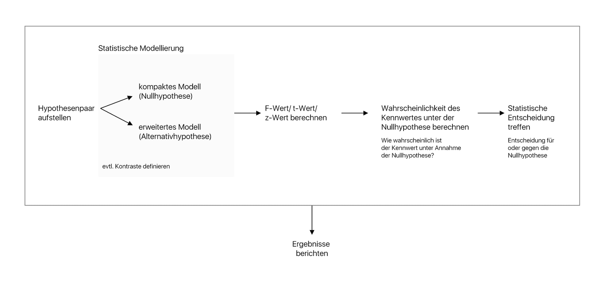

Stell dir vor, du glaubst, dass Studierende im Schnitt mehr als 10 Bücher pro Jahr lesen. Deine Null- und Alternativhypothese würde in diesem Fall wie folgt lauten:

-   **Nullhypothese**: Der Populationsmittelwert ist gleich 10 Bücher pro Jahr

-   **Alternativhypothese**: Der Populationsmittelwert ist größer als 10 Bücher pro Jahr

Statistisch können wir diese beiden Hypothesen wie folgt darstellen:

Ein statistisches Modell wird nun genutzt, um Werte vorherzusagen. Für jedes Hypothesenpaar erstellen wir zwei Modelle: Das kompakte Modell (MODEL~A~) und das erweiterte Modell (MODEL~C~).

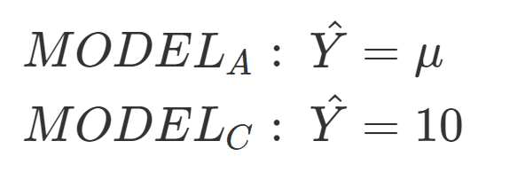

-   **Kompaktes Modell (MODEL~C~):** In unserem Fall besagt das kompakte Modell: Die Anzahl der Bücher für jede Person beträgt 10. Diese Annahme entspricht unserer Nullhypothese (H~0~). Y-Dach steht für den Wert, welchen das Modell vorhersagt.

-   **Erweitertes Modell (MODEL~A~)**: Das Modell für die Alternativhypothese müsste lauten: Die Anzahl der Bücher entspricht dem Mittelwert der Population (μ). Wir gehen davon aus, dass dieser Mittelwert größer als 10 ist. In der Grafik ist der Populationsmittelwert durch das Symbol μ (ausgesprochen mü) gekennzeichnet.

### Kennwerte berechnen

Auf Grundlage dieser beiden Modelle berechnen wir als nächstes Kennwerte. In diesem Kurs werden wir vor allem *t*- und *F*-Werte kennen lernen. Im Verlauf des Kurses werden wir sehen, dass *t*- und *F*-Werte miteinander verwandt sind. Wir werden daher vor allem *F*-Werte berechnen. Folgende Verallgemeinerung können wir an dieser Stelle bezüglich der Kennwerte treffen: 

-   ***t*****-Wert**: Wie viele Standardabweichungen sind zwei Werte (z.B. Mittelwerte) voneinander entfernt? Zum Beispiel: Wie viele Standardabweichung sind zwei Mittelwerte voneinander entfernt? Wie viele Standardabweichungen ist ein Korrelationskoeffizient von 0 entfernt? Wie viele Standardabweichung lesen Studierende mehr als 10 Bücher?

-   ***F*****-Wert**: Das kompakte Modell macht Fehler in seiner Vorhersagen. Das erweiterte Modell kann bessere Vorhersagen machen, da es Informationen aus mehr Variablen umfasst als das kompakte Modell. Der *F*-Wert gibt an, wie viel besser diese zusätzlichen Variablen die abhängige Variable aufklären als willkürliche andere Variablen. Wenn du diese Ausführungen an der Stelle nicht verstehst, nicht schlimm, wir werden es ausführlich in den nächsten Kapitel aufbauen.

### **Wahrscheinlichkeit des Kennwertes unter der H0: *P*(D\|H~0~)**

Als nächstes überprüfen wir wie wahrscheinlich solche Kennwerte sind, unter der Annahme, dass die Nullhypothese korrekt ist. Diese Wahrscheinlichkeit bezeichnen wir als *P*(D\|H~0~). Zum Beispiel: Wie wahrscheinlich ist es, dass sich zwei Gruppen um zwei Standardardabweichungen unterscheiden, wenn beide Gruppen aus der gleichen Population stammen? Oder, wie wahrscheinlich ist es, dass der Korrelationskoeffizient zweier Variablen bei *r* = .80 liegt, wenn diese beiden Variablen in Wirklichkeit gar nicht miteinander korrelieren? Oder, wie wahrscheinlich ist es, dass der Intelligenzquotient einer Stichprobe 120 beträgt, während der echte Populationsmittelwert bei 100 liegt? 

In anderen Worten, wir fragen uns immer, ob die Kennwerte unter Annahme der Nullhypothese wahrscheinlich oder unwahrscheinlich sind. Genau diese Feststellung ist mit der Idee der Falsifikation vereinbar. Indem wir sagen, dass ein Kennwert unwahrscheinlich ist, können wir eine Hypothese teilweise falsifizieren. Das heißt aber auch, dass wir keine Aussagen darüber machen, wie wahrscheinlich die Hypothese gegeben den Daten ist: *P*(H\|D). Warum? Da *P*(H\|D) die inverse Wahrscheinlichkeit von *P*(D\|H) ist. Dieser Unterschied wird von Forschenden und Studenten häufig verwechselt. Um zu akzeptieren, dass diese beiden Wahrscheinlichkeiten invers sind, ein Beispiel: Wie hoch ist die Wahrscheinlichkeit innerhalb von zwei Jahren zu sterben, wenn Menschen von einem Krokodil der Kopf abgerissen wird: *P*('in zwei Jahren sterben' \| 'Kopf von Krokodil abgebissen')? Diese Wahrscheinlichkeit liegt bei 1. Jede Person, der der Kopf von einem Krokodil abgebissen wird, stribt sofort. Wie hoch ist wiederum die Wahrscheinlichkeit, dass man von einem Krokodil den Kopf abgerissen bekommen hat, gegeben dass man innerhalb der letzten zwei Jahre gestorben ist: *P*( 'Kopf von Krokodil abgebissen'\|'in den letzten zwei Jahren gestorben')? Du siehst also, dass diese Wahrscheinlichkeiten unterschiedlich sind. Wir sollten daher beide voneinander unterscheiden. In der Statistik fragen wir uns immer, wie wahrscheinlich die Daten unter Annahme der Nullhypothese sind: *P*(D\|H~0~).

> ***P*****(D\|H~0~)** bezeichnet die **Wahrscheinlichkeit eines Kennwertes unter Annahme der Nullhypothese. *P*(D\|H~0~)** wird auch als **p-Wert** bezeichnet.

### Statistische Entscheidungen

Zu Beginn dieses Moduls haben wir gesagt, dass die Falsifikation das Herzstück der Statistik ist. Wir können keine Hypothesen bestätigen, sie allerdings widerlegen. Genau das machen wir durch statistische Entscheidungen. Genauer lehnen wir die Nullhypothese ab, wenn der Kennwert unter Annahme der Nullhypothese sehr unwahrscheinlich ist. Ebenso lehnen wir die Alternativhypothese ab, wenn der Kennwert unter Annahme der der Nullhypothese wahrscheinlich ist. Diese Form einer binären Entscheidungen geht auf die Statistiker, [Jerzy Neyman](https://de.wikipedia.org/wiki/Jerzy_Neyman) und [Egon Pearson](https://de.wikipedia.org/wiki/Egon_Pearson) zurück. Sie sagten, dass man die Nullhypothese bei einer Wahrscheinlichkeit von unter 5% ablehnen (**das Alpha-Niveau**) sollte und die Nullhypothese bei einer Wahrscheinlichkeit von über 5% vorläufig annehmen sollte:

Bei einer Wahrscheinlichkeit eines Kennwertes unter 5% spricht man von einem **signifikanten Ereignis**. Warum 5%? Der 5% Werte oder das **Alpha-Niveau** wurde willkürlich von [Sir Ronald Fisher](https://de.wikipedia.org/wiki/Ronald_Aylmer_Fisher) gewählt. **Signifikanz bedeutet allerdings nicht, dass ein Ergebnis bedeutsam ist, sondern, dass ein Ereignis unter Annahme der Nullhypothese unwahrscheinlich ist.**

> **Signifikant** bedeutet, dass ein Kennwert unter Annahme der Nullhypothese **unwahrscheinlich** ist; **nicht**, dass ein Ergebnis bedeutsam ist.

Die Entscheidung für oder gegen die Nullhypothese hilft der Theoriebildung folgendermaßen: Stell dir vor, es werden 100 Experimente zu der Frage durchgeführt, ob die Mitschrift per Hand lernwirksamer ist als die Mitschrift mit dem Laptop. In 80 Experimenten entscheiden sich die Forschenden dafür, die Nullhypothese abzulehnen. Das heißt, in 80% der Fälle lehnen die Forschenden die Aussage ab, dass es keinen Unterschied zwischen diesen beiden Gruppen gibt. Diese Vielzahl an Experimenten deuten also darauf hin, dass die Mitschrift per Hand in der Tat lernwirksamer ist as die Mitschrift mit dem Laptop. Damit haben die Forschenden relativ überzeugend die Hypothese falsifiziert, dass beide Techniken äquivalent sind.

Dieses Beispiel zeigt uns, dass statistische Entscheidungen auf lange Sicht helfen, eine Theorie zu falsifizieren. Im Grunde versuchen wir bei jedem Experiment einen Test zu entwickeln, der uns hilft dieser Schlussfolgerung näher zu kommen. Die Erkenntnis liegt bei diesem Vorgehen nicht in einem Experiment, sondern in vielen Experimenten. Daher wir diese Art der Statistik auch als [Frequentistischer Wahrscheinlichkeitsbegriff](https://de.wikipedia.org/wiki/Frequentistischer_Wahrscheinlichkeitsbegriff) bezeichnet. Dieser Ansatz eignet sich, wenn wir für unser Handeln Entscheidungen treffen müssen. Zum Beispiel, sollten Lernende mit ihrem präferiertem Lernmaterial lernen oder nicht? Ist es besser einen Text wiederholt zu lesen, oder sein Wissen frei abzufragen? Stellen wir beispielsweise wiederholt fest, dass die die Annahme wiederholtes Lesen sei gleich effektiv wie die freie Wissensabfrage widerlegt wird, können wir auf Dauer eine Entscheidung treffen, Lernende zu empfehlen, eine bestimmte Lerntechnik einer anderen vorzuziehen. Der frequentistische Wahrscheinlichkeitsbegriff entwickelt Erkentnisse daher erst nach einer Fülle an Experimenten.

### Ausführliches Beispiel: t-Test für eine Stichprobe

Stell dir vor, du glaubst, dass Studierende pro Jahr mehr als 10 Bücher lesen. Um deine Hypothese zu prüfen, befragst du 30 Studierende willkürlich an deiner Universität, wie viel Bücher sie im letzten Jahr gelesen haben. Im Schnitt stellst du fest, dass deine Stichprobe 12.45 Bücher (Mittelwert) im letzten Jahr gelesen hat:

Deskriptiv sind es also bereits mehr als 10 Bücher. Allerdings weißt du nicht, ob das unwahrscheinlich mehr Bücher sind als man unter der Nullhypothese (10 Bücher pro Jahr) annehmen würde. Folgendes Hypothesenpaar stellst du auf:

-   **Nullhypothese**: Die Studierenden lesen 10 Bücher pro Jahr

-   **Alternativhypothese**: Die Studierenden lesen mehr als 10 Bücher pro Jahr

Die Frage lautet nun, kannst du deine Nullhypothese falsifizieren? In anderen Worten, ist es unwahrscheinlich, dass die Studierenden 12.45 Bücher pro Jahr lesen, wenn sie in Wirklichkeit im Mittel 10 Bücher pro Jahr lesen?

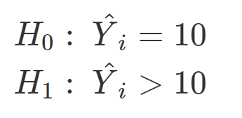

**Statistische Modellierung deiner Hypothese**

Deine Null- und Alternativhypothese lassen sich wie folgt modellieren. Das Modell der Nullhypothese (bzw. das kompakte Modell) nimmt an, dass Studierende im Schnitt 10 Bücher pro Jahr lesen. Das heißt, das Modell schätzt für jede Person, dass er oder sie 10 Bücher pro Jahr liest. Das Modell der Alternativhypothese (bzw. das erweiterte Modell) sagt voraus, dass eine Person mehr als 10 Bücher pro Jahr liest. Du erwartest daher, dass der Populationsmittelwert größer als 10 ist.

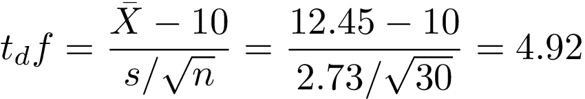

**Bestimmung des Kennwertes**

Im nächsten Schritt bestimmst du den Kennwert. Für den *t*-Test mit einer Stichprobe können wir einen *t*-Wert berechnen. Der *t*-Wert gibt uns an, wie viele Standardabweichungen der *t*-Wert vom Mittelwert der Nullhypothese entfernt liegt. Wir erhalten einen empirischen *t*-Wert von 4.92.

Grafisch können wir den (empirischen) *t*-Wert in der *t*-Verteilung darstellen:

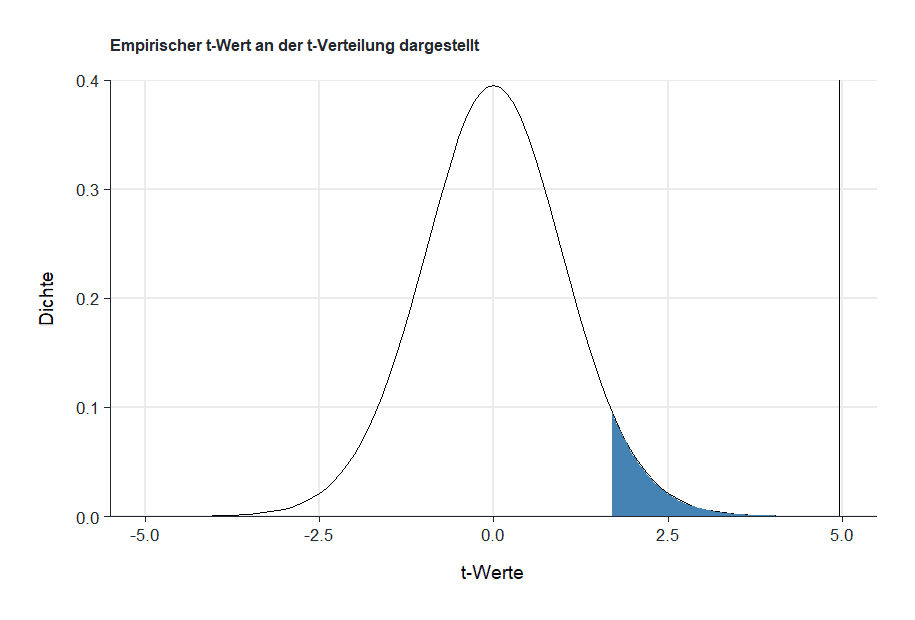

**Wahrscheinlichkeit des Kennwertes unter der Nullhypothese: P(D\|H~0~)**

Als nächstes fragen wir uns, wie wahrscheinlich der *t*-Wert ist, wenn in Wirklichkeit Studierende 10 Bücher pro Jahr lesen. Erinnere dich, dass die *t*-Verteilung die Verteilung von Mittelwerten aus Stichproben beschreibt, die aus einer Population gewonnen werden, in denen die Nullhypothese gilt (Studierende lesen 10 Bücher pro Jahr).

Zunächst siehst du, dass der *t*-Wert weit vom Gipfel der *t*-Verteilung entfernt liegt. Damit wissen wir, dass der von uns gefundene empirische *t*-Wert (4.92) sehr unwahrscheinlich ist, wenn der Mittelwert der Population bei 10 liegt. Genauer ist die Wahrscheinlichkeit für einen solchen empirischen *t*-Wert geringer als 1%.\
Da dieser empirische *t*-Wert innerhalb des kritischen Bereichs (blau dargestellt) liegt, sprechen wir von einem **signifikanten Ereignis**.

**Statistische Entscheidung**

Da es sich um ein signifikantes Ereignis handelt, lehnen wir die Nullhypothese zu Gunsten der Alternativhypothese ab. Wir entscheiden uns demnach auf Grundlage unseres Experiments dafür, die Annahme, dass Studierende 10 Bücher pro Jahr lesen, inkorrekt ist.

**Ergebnis berichten**

Zuletzt berichten wir unser Ergebnis. Hierfür formulieren wir folgenden Textabschnitt:

> "Um zu prüfen, ob Studierende pro Jahr mehr als 10 Bücher pro Jahr lesen, wurde ein *t*-Test für eine Stichprobe berechnet. Der *t*-Test ergab einen signifikanten Effekt, *t*(29) = 4.91, *p* \< .001, *d* = 0.90 (großer Effekt), was darauf hinweist, dass Studierende mehr als 10 Bücher pro Jahr lesen."

Wie die Ergebnisse berichtet werden, lernen wir im Verlaufe des Seminars ausführlich kennen.

### Zusammenfassung

In diesem Submodul haben wir gelernt, wie man von einer Hypothese zu einem Ergebnis in einer Studie kommt. Dieser Prozess umfasst verschiedene Schritte, die wir in diesem Kurs immer wieder wiederholen werden. Zu Beginn einer jeden Forschungsfrage steht eine Hypothese, die wir als Hypothesenpaar formulieren. Dieses Hypothesenpaar werden wir statistisch modellieren. Dieser Schritt ist an dieser Stelle vermutlich noch unklar, er wird dir allerdings klarer, wenn wir uns mit dem *F*-Wert beschäftigen, da der *F*-Wert aus diesen statistischen Modellen berechnet wird. Sobald wir den Kennwert haben, berechnen wir die Wahrscheinlichkeit für den Kennwert unter der Nullhypothese. Kennwerte machen Aussagen über unsere Hypothesen. Ein *t*-Wert beispielsweise kann eine Aussage über den Mittelwertsunterschied zwischen Gruppen machen. Ein *t*-Wert kann aber auch sagen, wie viele Standardabweichung eine Korrelation von 0 entfernt ist. Indem wir die Wahrscheinlichkeit dieser Kennwerte unter der Nullhypothese berechnen, geben wir an, wie unwahrscheinlich ein Mittelwertsunterschied oder ein standardsierter Unterschied eine Korrelation von 0 ist, wenn es zum Beispiel keinen Mittelwertsunterschied zwischen Gruppen gibt oder wenn es keine Korrelation zwischen zwei Variablen gibt. Auf Grundlage dieser Wahrscheinlichkeit treffen wir eine binäre statistische Entscheidung: Wir lehnen die Nullhypothese ab oder behalten sie. Liegt die Wahrscheinlichkeit für den Kennwert unter 5%, lehnen wir die Nullhypothese ab, liegt die Wahrscheinlichkeit über 5%, akzeptieren wir die Nullhypothese vorläufig. Am Ende dieses Prozess berichten wir das Ergebnis des Tests.

## Alpha- und Betafehler und Power

In diesem Submodul lernen wir weitere wichtige Begriffe der Statistik kennen, die wir im Verlaufe des ganzen Kurses verwenden werden. Wir werden in diesem Submodul lernen, dass die statistischen Entscheidungen, welche wir auf Grundlage des *p*-Wertes ermitteln, falsch sein können und, dass wir diese Entscheidungen nur auf dem Hintergrund der Power einer Studie interpretiert sollten. Genauer werden wir lernen, dass wir die Stichprobengröße vor einem Experiment mit Bedacht wählen sollten, um in der langen Sicht zu richtigen Entscheidungen zu kommen.

### Alpha- und Betafehler

In unserem letzten Modul haben wir gezeigt, dass wir in der Statistik binäre Entscheidungen treffen. Entweder lehnen wir die Nullhypothese ab oder wir behalten sie vorläufig. Ist die Wahrscheinlichkeit eines Kennwertes unter Annahme der Nullhypothese geringer als 5% lehnen wir die Nullhypothese ab, ist die Wahrscheinlichkeit unter Annahme der Nullhypothese höher, akzeptieren wir die Nullhypothese vorläufig. Dieser 5%-Wert ist ein Beispiel für ein **Alpha-Niveau**. Das Alpha-Niveau gibt an, unter welcher Wahrscheinlichkeit wir die Nullhypothese verwerfen, unter der Bedingung, dass es keinen Effekt in der Population gibt. 

Grafisch dargestellt können wir das Alpha-Niveau bei einer gerichteten und ungerichteten Hypothese an einer *t*-Verteilung darstellen. Im unteren Bild siehst du links eine gerichtete Hypothese (M1 \> M2), im rechten Bild eine ungerichtete Hypothese (M1 = M2). Wie du siehst, wird das Alpha-Niveau bei einer ungerichteten Hypothese auf zwei Seiten geteilt. Der Kennwert könnte entweder unwahrscheinlich kleiner oder größer gegeben der Nullhypothese sein. Die Summe der beiden Flächen ergibt wiederum 5% (2.5% + 2.5%). Bei der gerichteten Hypothese tragen wir das Alpha-Niveau auf nur einer Seite der *t*-Verteilung ab. In diesem Fall gehen wir davon aus, dass der Mittelwert M1 größer ist als der Mittelwert M2. Daher tragen wir das Alpha-Niveau rechts vom Mittelwert der *t*-Verteilung ab.

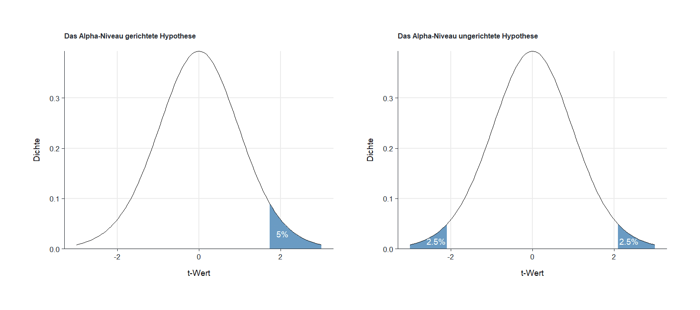

Was passiert nun, wenn die Nullhypothese in der Population korrekt ist, aber unser Kennwert innerhalb des Alpha-Niveaus fällt? In diesem Fall entscheiden wir uns gegen die Nullhypothese und machen damit einen statistischen Fehler. Wir entscheiden uns gegen die Nullhypothese obwohl die Nullhypothese korrekt ist. Diesen Fehler nennen wir **Alpha-Fehler.** Das Gegenstück zum Alpha-Fehler ist der Beta-Fehler. Der Beta-Fehler tritt auf, wenn wir uns für die Nullhypothese entscheiden, diese allerdings inkorrekt ist.

### Die Welt der Nullhypothese: Der Alpha-Fehler

Um diese beiden Fehler besser zu verstehen, gehen wir von zwei Welten aus. In der einen Welt ist die Nullhypothese korrekt (z.B. es gibt keinen Mittelwertsunterschied zwischen zwei Gruppen). In der anderen Welt ist die Nullhypothese falsch (z.B. es gibt einen Mittelwertsunterschied). Die Welt, in der wir uns gerade befinden, stelle ich als durchängige Verteilung dar. Die andere Welt, stelle ich als gestrichelte Verteilung dar.

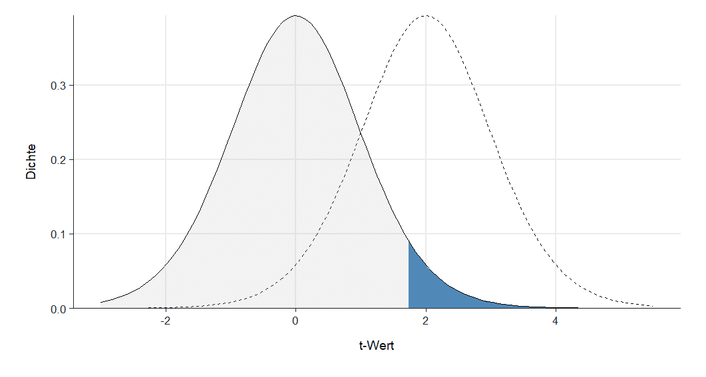

In der Welt der Nullhypothese (leicht graue Verteilung mit durchgängigem Rand) führt jeder empirisch ermittelte *t*-Wert, der innerhalb des blauen Bereichs fällt zu einer fälschlichen Ablehnung der Nullhypothese. In anderen Worten, immer wenn der empirische *t*-Wert in den blauen Bereich fällt, begehen wir einen Alpha-Fehler. Da wir das Alpha-Niveau vorab bestimmt haben, wissen wir, dass wir in 5% der Fälle einen solchen Fehler machen, selbst wenn die Nullhypothese korrekt ist. Oder, in 95% der Fälle treffen wir auf lange Sicht die richtige Entscheidung, wenn die Nullhypothese korrekt ist. Sagen wir beispielsweise du wiederholst ein Experiment 100 mal. Stimmt deine Nullhypothese, solltest du in etwa 95 Fällen kein signifikantes Ergebnis erhalten. In etwa 5 Fällen allerdings solltest du ein signifikantes Ergebnis erhalten und damit einen Alpha-Fehler begehen. Alpha-Fehler sind demnach nicht vermeidbar, selbst wenn die Nullhypothese korrekt ist.

Wir können den Alpha-Fehler aber auch in einer anderen Art und Weise visualisieren. Stell dir vor, es gibt keinen Unterschied zwischen den Gruppen und du wiederholst das gleiche Experiment in vier Versuchsreihen 20000 mal. Die vier Versuchsreihen unterscheiden sich in ihrer Stichprobengröße. Du führst je eine Reihe mit 5, 10, 50 und 200 Versuchspersonen pro Experiment durch. Im Folgenden siehst du wie sich die p-Werte bei diesen vier Versuchsreihen in den 20000 Experimenten verteilen. Auf der x-Achse siehst du die p-Werte auf der y-Achse die Häufigkeit dieser p-Werte.

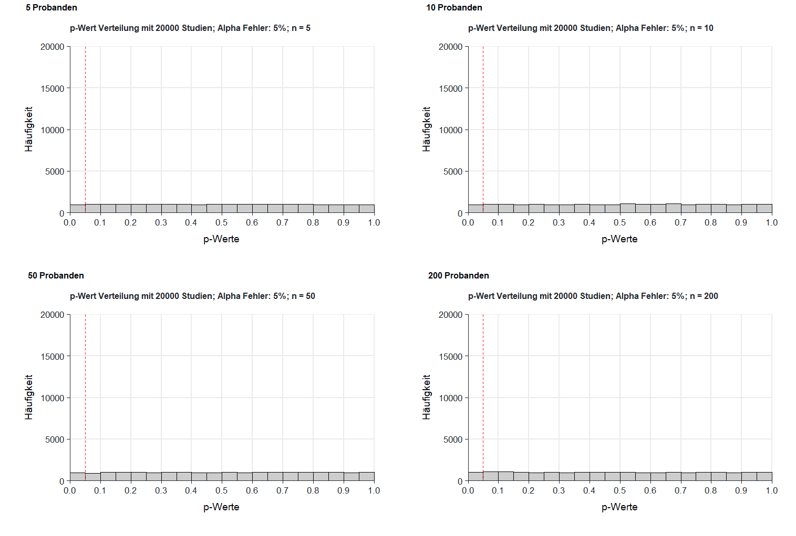

Wie du erkennst, sehen die Verteilungen gleich aus. Sie sind stetig. Die Botschaft dieser Visualisierung ist, dass der Alpha-Fehler von der Stichprobengröße unabhängig ist. In der Welt der Nullhypothese machen wir immer mit einer Wahrscheinlichkeit von 5% einen Alpha-Fehler. Egal, wie groß die Stichprobe ist.

### Die Welt der Alternativhypothese: Beta-Fehler

In der Welt der Alternativhypothese gehen wir davon aus, dass die Nullhypothese inkorrekt ist. Das heißt, wir nehmen beispielsweise an, dass es einen Mittelwertsunterschied zwischen zwei Gruppen gib (beispielsweise einen Mittelwertsunterschied von 1 bei einer Standardabweichung von 2.1 zwischen zwei Gruppen in der Population). Auch in dieser Welt können wir einen Fehler machen. Diesen Fehler nennen wir **Beta-Fehler**. Der Beta-Fehler tritt auf, wenn wir die Nullhypothese annehmen, obwohl sie inkorrekt ist. Oder, wenn wir die Alternativhypothese ablehnen, obwohl sie korrekt ist.

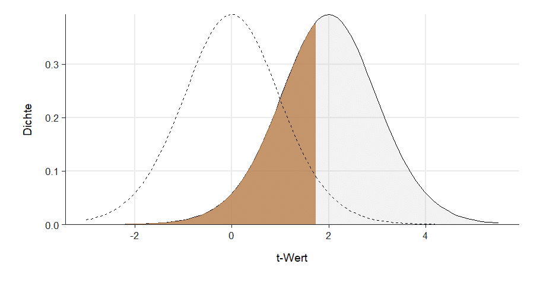

In der obigen Visualisierung ist der Betafehler geringer als 50% (braune Fläche) aber nicht viel geringer (daran zu erkennen, dass die braune Fläche nahe am Gipfel der Verteilung liegt). Ein solches Experiment wäre nicht sonderlich sensitiv. Gäbe es einen Mittelwertsunterschied in der Population und würden wir diesen Effekt mit einer kleinen Stichprobe (\~ 20 Versuchspersonen) testen, würden wir in \~40% der Fälle eine falsche statistische Entscheidung treffen, selbst wenn unsere Alternativhypothese korrekt ist. Als Folge könnte es beispielsweise sein, dass wir eine Lernmethode nicht empfehlen, obwohl diese wirksam ist.

In der Regel möchten wir, dass der Beta-Fehler geringer als 20% ist. Das heißt, wir wollen sicher stellen, dass wir auf lange Sicht nicht zu oft eine falsche statistische Entscheidung treffen, sofern unsere Alternativhypothese korrekt ist. Nur, wir machen wir das? Indem wir die Größe der Stichprobe bestimmen. 

In der folgenden Visualisierung siehst du den Beta-Fehler unter vier Bedingungen. Stell dir wieder ein einziges Experiment vor. In diesem Experiment möchtest du testen, ob visuell Lernende besser mit visuellem als mit auditivem Lernmaterial lernen. Du glaubst, Lernende, die sich als visuelle Lerner bezeichnen lernen mehr durch visuelles als mitauditivem Lernmaterial. Gehen wir weiterhin davon aus, dass der wirkliche Mittelwertsunterschied dieser beiden Gruppen in der Population 1 Punkt beträgt (gemessen durch den Test des Experiments). Zudem liegt die Standardabweichung der beiden Gruppen bei 2.1. Stell dir nun vor, du wiederholst das Experiment mit 5, 10, 50 und 200 Versuchspersonen. In der Visualisierung siehst du in braun die Wahrscheinlichkeit mit der du bei diesen vier Experimenten einen Beta-Fehler machen würdest.

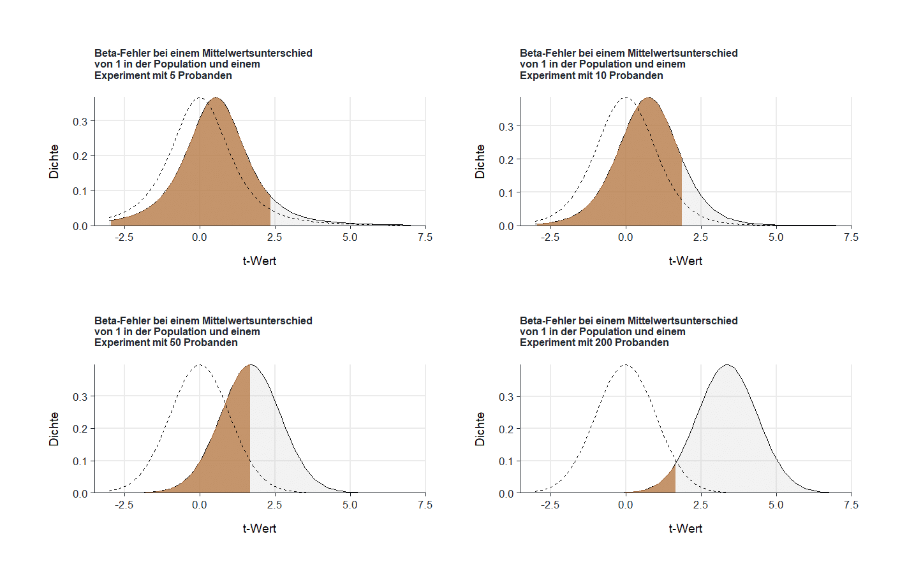

Offensichtlich ändert sich die Wahrscheinlichkeit für einen Beta-Fehler abhängig der Stichprobe. Je größer die Stichprobe ist, desto unwahrscheinlicher tritt ein Beta-Fehler auf. Bei 5 Versuchspersonen machst du mit ziemlicher Sicherheit einen Beta-Fehler, selbst wenn es einen Unterschied zwischen den Gruppen in der Population gibt. Liegt die Stichprobengröße bei 200 Versuchspersonen wirst du selten einen Beta-Fehler machen. 

Die gleiche Botschaft können wir durch eine *p*-Wert-Verteilung darstellen. Erneut simulieren wir 20.000 Experimente mit unterschiedlichen Stichproben. Du siehst, dass sich die Verteilung der *p*-Werte ändert, sofern die Alternativhypothese korrekt ist bzw. ein Effekt in der Population besteht. Mit steigender Stichprobengröße verringert sich der Beta-Fehler (daran zu erkennen, dass es weniger Balken rechts des roten Strichs gibt):

Zur besseren Verständlichkeit können wir beide Visualisierungen miteinander kombinieren und zeigen, dass die Beta-Fehler in der *t*-Verteilung äquivalent zu den Beta-Fehlern in der *p*-Verteilung sind:

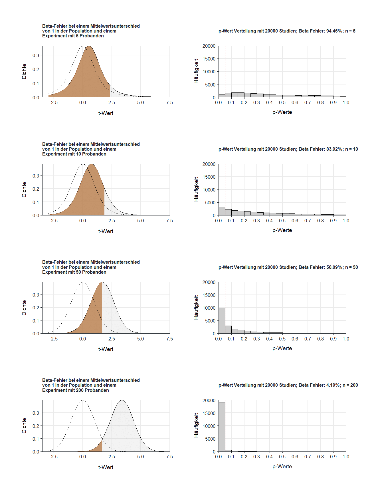

### Vergleich von Alpha- und Betafehler

Sowohl in der Welt der Nullhypothese als auch in der Welt der Alternativhypothese können wir statistische Fehlentscheidungen treffen. Wir nennen diese Fehlentscheidungen Alpha- und Beta-Fehler. Die beiden Fehler werden als Wahrscheinlichkeiten angegeben und geben uns Hinweise darauf, mit welcher Wahrscheinlichkeit wir falsche statistische Entscheidungen treffen. Welche Welt die korrekte ist, wissen wir meist nicht. Wir führen Studien durch, um diese Frage zu beantworten. Wiederholen wir viele Studien mit dem gleichen Versuchsaufbau werden wir auf lange Sicht mit einer bestimmten Wahrscheinlichkeit Fehler machen. 

Wir haben gesehen, dass die Wahrscheinlichkeit für einen Alpha-Fehler immer bei 5% liegt. Die Wahrscheinlichkeit für einen Beta-Fehler varriiert abhängig der Stichprobe. Je größer die Stichprobe, desto kleiner die Wahrscheinlichkeit für einen Beta-Fehler. Für uns als Wissenschaftler\*innen bedeutet dies, dass wir die Stichprobengröße bei einem Experiment mit Bedacht wählen sollten, da wir ansonsten Gefahr laufen, zu häufig einen Beta-Fehler zu machen. Stell dir vor, du führst ein aufwändiges Experiment durch, welches allerdings mit einer Wahrscheinlichkeit von 80% einen Beta-Fehler macht (das weißt du natürlich vorher nicht). In nur 20% der Fälle würdest du korrekt schließen, dass es einen Effekt gibt. In den meisten Fällen würdest du allerdings fälschlicherweise annehmen, dass es keinen Effekt gibt.

### Power (Teststärke)

Power oder Teststärke ist das Gegenstück zum Beta-Fehler. Liegt der Beta-Fehler bei 40%, liegt die Power bei 60%. Liegt der Beta-Fehler bei 20%, liegt die Power bei 80%. Kurzum, Power errechnet sich durch 100%- Beta-Fehler. 

In der folgenden Visualisierung beispielsweise siehst du in grün dargestellt die Power eines Experiments. Die rechte Verteilung stellt die Alternativhypothese dar, die linke die Nullhypothese. Du kannst aus der Visualisierung erkennen, dass die Power dieser Studie unter 50% liegt. In anderen Worten, sollte es einen Effekt in der Population geben, wirst du diesen mit einer Wahrscheinlichkeit geringer als 50% in einem Experiment finden. Deine Studie hätte eine geringe Power.

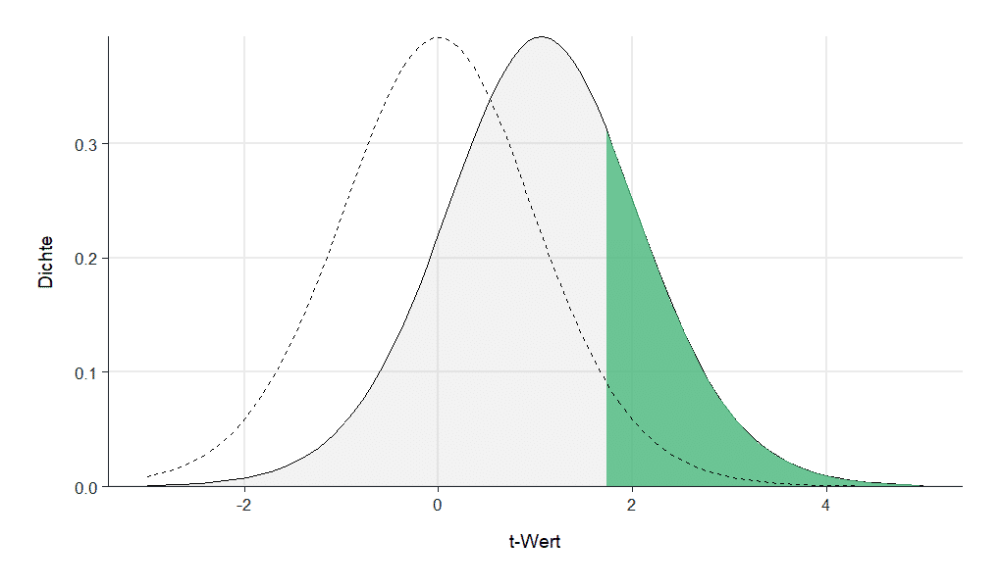

> **Power** ist die Wahrscheinlichkeit mit der wir bei **Korrektheit der Alternativhypothese** ein **signifikantes Ergebnis** erziehen

Ganz ähnlich wie bei dem Beta-Fehler können wir uns ansehen, wie sich die Power mit steigender Stichprobengröße verändert. Hierfür visualisieren wir uns die Power erneut mit einer Stichprobe von 5, 10, 50 und 200 Personen pro Gruppe:

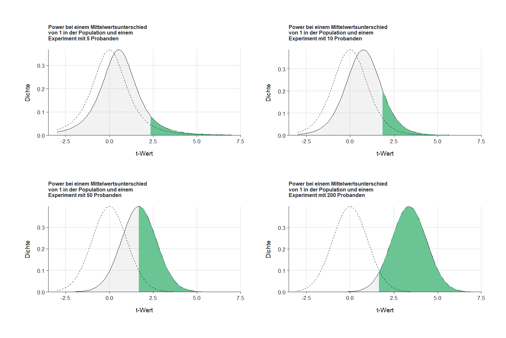

Du siehst, dass die Power mit steigender Stichprobengröße steigt. In anderen Worten, je mehr Versuchspersonen du bei einem Experiment erhebst, desto wahrscheinlicher erhältst du ein signifikantes Ergebnis. Erneut erkennen wir also, dass die Power keine feste Größe wie der Alpha-Fehler ist, sondern von der Stichprobengröße in einem Experiment abhängt. Da die Power varriabel ist, sollten wir uns Gedanken machen, wie groß die Power sein sollte. 

In der Regel versucht man in einer Studie eine **hohe** Power zu erzielen. Eine Richtgröße ist eine Power von über 80%. Wir wollen Experimente erstellen, in denen wir - bei einem bestehenden Effekt - mit einer Wahrscheinlichkeit von über 80% die richtige statistische Entscheidung fällen. Nämlich, dass wir die Nullhypothese ablehnen, da sie inkorrekt ist. Im Umkehrschluss bedeutet dies, dass jeder Effekt bei genügend großer Stichprobe signifikant wird. Selbst wenn es einen minimalen Effekt zwischen zwei Gruppen gibt, kannst du mit einer großen Stichprobe zeigen, dass der Unterschied zwischen den Gruppen signifikant ist. Aus diesem Grund sollte die Stichprobengröße bei einem Experiment nicht willkürlich gewählt werden. Ist deine Power zu klein, hast du geringe Chance, einen Effekt zu erzielen. Wir lernen mit geringer Power quasi gar nichts, da unser Test nicht sensitiv genug ist, einen Effekt zu finden. Liegt deine Power bei 100%, wirst du selbst bei trivialen Unterschieden zu signifikanten Ergebnissen kommen.

### Power-Analysen: Ein Exkurs

Gehen wir zurück zu unserem ursprünglichen Experiment. Du hast geglaubt, dass visuelle Lernende besser mit visuellem als mit auditivem Lernmaterial lernen. Um diese Hypothese zu prüfen, entscheidest du dich pro Gruppe (visuelle Lerner mit visuellem Material und visuelle Lerner mit auditivem Material) 20 Personen zu testen, ohne vorab eine Power-Analyse zu machen. Was du nicht weißt, ist, dass der Effekt sehr sehr klein ist. Genauer gibt es folgende Kennwerte in der Population: Würde man alle Lernende die Tests durchführen lassen, würde die Gruppe mit dem präferiertem Lernmaterial 6.1 Punkte bei einer Standardabweichung von 1.6 bekommen und die Gruppe mit dem nicht-präferiertem Lernmaterial 6.0 Punkte bei einer Standardabweichung von 1.6. Die Frage ist nun, wie hoch ist deine Power bei einer Stichprobengröße von 20 Personen pro Gruppe? 

Ein cleveres Tool für die Analyse von Power ist [G\*Power](https://www.psychologie.hhu.de/arbeitsgruppen/allgemeine-psychologie-und-arbeitspsychologie/gpower.html). G\*Power wird von zahlreichen Wissenschaftlern verwendet, um **vor** einem Experiment die Stichprobengröße für das Experiment zu bestimmen. Zunächst ermittelst du die Größe des Effekts durch G\*Power:

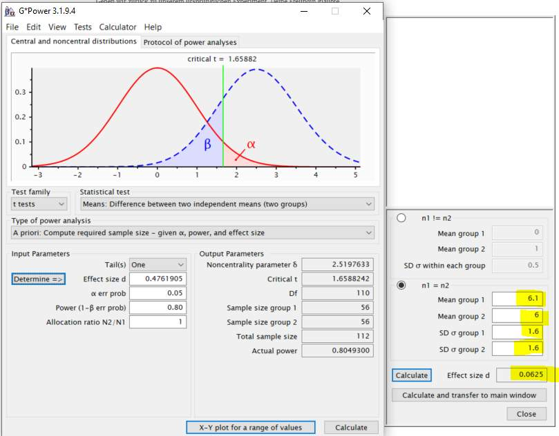

**Größe des Effekts bestimmen**

Du erkennst, dass auf der rechten Seite die deskriptiven Daten der Population eingegeben werden. G\*Power sagt dir, dass in der Population ein Effekt von *d* = 0.06 besteht. Wir bezeichnen einen solchen Effekt als klein. Der Effekt ist so klein, dass man davon ausgehen kann, dass die Gruppen faktisch identisch sind.

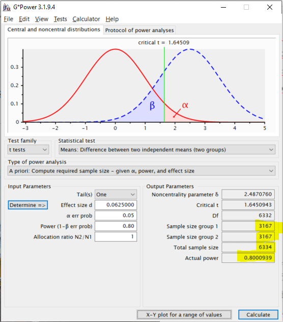

**Stichprobengröße für eine Power von 80%**

G\*Power sagt uns nun, dass wir 6334 Versuchspersonen erheben müssten, um eine Power von 80% zu erzielen. Der Effekt ist so klein, dass wir eben erst mit ganz vielen Versuchspersonen zu signifikanten Ergebnissen kommen würden. Das heißt, euer Experiment mit 20 Personen wird sogut wie nie einen signifikanten Effekt erzielen. Ihr werdet fast immer nicht-signifikante Ergebnisse erzielen. Das liegt daran, dass ihr entweder einen zu großen Effekt erwartet oder eine zu kleine Stichprobe für den minimalen Effekt gewählt habt.

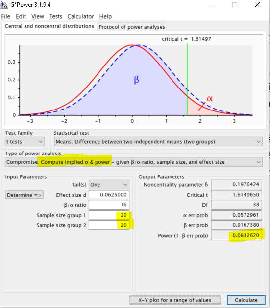

**Power bei einer Stichprobe von insgesamt 40 Versuchspersonen**

Wir können ebenso die tatsächliche Power deines Experiments bestimmen. Diese liegt bei 20 Personen pro Gruppe bei 8%. Somit wirst du in nur 8% der Fälle (solltet ihr das Experiment häufig wiederholen) ein signifikantes Ergebnis erzielen. Du wirst demnach mit ziemlicher Sicherheit zu dem Schluss kommen, dass es keinen Unterschied zwischen den Gruppen gibt. Dies Feststellung ist auch korrekt, da der Unterschied minimal und damit zu vernachlässigen ist.

### Zusammenfassung

In diesem Submodul haben wir uns ausführlicher mit Fehlschlüssen in statistischen Entscheidungen befasst. Aus dem letzten Submodul haben wir erfahren, dass wir in der Statistik binäre Entscheidungen treffen. Wir entscheiden uns für oder gegen die Nullhypothese. In diesem Submodul haben wir gelernt, dass wir für diese beiden Entscheidungen Fehler machen können. (1) Wir können uns gegen die Nullhypothese entscheiden, obwohl diese korrekt ist (Alpha-Fehler); und (2) wir können uns für die Nullhypothese entscheiden, obwohl sie inkorrekt ist (Beta-Fehler). Der Alpha-Fehler ist fixiert, das heißt er wird per Konvention auf einen bestimmten Wert definiert. In der Lehr- und Lernforschung verwendet man ein Alpha-Niveau von 5%. Der Beta-Fehler ist varriabel und hängt unter anderem von der Stichprobengröße ab. Beide Fehler werden als Wahrscheinlichkeiten angegeben. Wiederholt man das gleiche Experiment hunderte Male, wird man diese Wahrscheinlichkeiten erhalten. Das Gegenstück vom Beta-Fehler ist die Power. Die Power kennzeichnet die Wahrscheinlichkeit ein signifikantes Ergebnis zu erzielen. In der Regel versucht man durch die richtige Wahl der Stichprobengröße die Power auf über 80% zu halten.

## Die Effektstärke Cohen's d

### Was sagen uns Signifikanztests?

Bevor wir das Modul abschließen, ist es noch wichtig, dass wir den Begriff der Effektstärken und insbesondere die Effektstärke Cohen's *d* kennen lernen. Wir haben mittlerweile etabliert, dass wir bei dem statistischen Hypothesentesten prüfen, ob ein Kennwert unter der Annahme der Nullhypothese unwahrscheinlich ist. Dieser Prozess hilft uns auf die lange Sicht, Entscheidungen zu treffen. Zum Beispiel, ob wir eine Lernmethode einer anderen bevorzugen sollen. Oder, ob zwei Variablen miteinander korrelieren (z.B. Rauchen und Lungenkrebs). Das bedeutet Signifikanztests zeigen uns, wie wir handeln sollen.

> **Signifikanztests** geben an, wie wir **handeln** sollten; **Effektstärken** zeigen, wie groß ein Effekt ist und ob er **praktisch nützlich** ist.

### Was sagen uns Effektstärken?

Effektstärken wiederum beantworten uns eine andere Frage. Effektstärken geben uns an, wie groß ein Effekt ist. Beispielsweise mag es sein, dass eine Lernmethode effektiver ist als eine andere, aber wie viel effektiver ist sie? Ebenso mag es sein, dass zwei Variablen miteinander korrelieren, aber wie hoch korrelieren diese beiden Variablen miteinander? Während uns Signifikanztests auf Dauer helfen, Entscheidungen zu treffen, helfen uns Effektstärken einzuschätzen, ob Entscheidungen praktisch nützlich sind. Stell dir beispielsweise vor, du findest dass eine Lernmethode A minimal besser ist als eine andere Lernmethode B. Lernmethode A ist allerdings deutlich teurer. In diesem Fall macht es viellicht Sinn trotz des minimalen Vorteils der Lernmethode A, sich für Lernmethode B zu entscheiden. Andererseits kann es sein, dass ein Deliktinterventionsprogramm bei Jugendlichen minimal wirksam ist (siehe [Wilson et al., 2003](https://journals.sagepub.com/doi/abs/10.1177/1049731502238754)). Wenn aber nur 3 aus 100 Jugendlichen aufgrund dieses Programms keine Straftat begehen, werden weniger Menschen verletzt, oder gar umgebracht. Der geringe Effekt hat demnach eine praktische Bedeutsamkeit, da selbst der minimal Effekt fundamentale Auswirkungen auf wenige Menschen hat.

Wir werden in diesem Kurs verschiedene Effektstärken kennen lernen (PRE, R-Quadrat, Eta-Quadrat, partielles Eta-Quadrat und Cohen's *d*). Da wir bisher lediglich Tests kennen gelernt haben, mit der man Mittelwertsunterschiede zwischen einer Gruppe und einem festen Wert bzw. zwischen zwei Gruppen testen kann, beschäftigen wir uns in diesem Submodul mit der Effektstärke Cohen's *d*, welche für solche Mittelwertsunterschiede verwendet wird.

### Cohen's d

Cohen's *d* gibt an, wie viele Standardabweichungen zwei Mittelwerte voneinander entfernt liegen. Die Formel für Cohen's *d* lautet wie folgt:

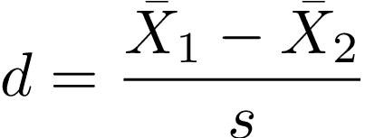

#### Cohens' d bei nur einer Stichprobe

Stell dir beispielsweise vor, du möchtest die Effektstärke bei einem *t*-Test für eine Stichprobe testen. In diesem Fall hast du nur eine Stichprobe und damit auch nur einen Mittelwert. Im letzten Modul beispielsweise haben wir getestet, ob Studierende mehr als 10 Bücher pro Jahr lesen. Der Mittelwert der Stichprobe betrug 12.49. Nehmen wir nun an, dass die Standardabweichung der Stichprobe der 30 Studierenden bei 3 lag.

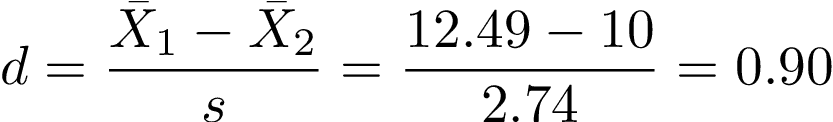

In diesem Fall berechnet sich Cohen's *d* wie folgt: Du ziehst den erwarteten Mittelwert (10 von deinem empirischen Mittelwert ab. Diese Differenz teilst du durch die Standardaweichung deiner Stichprobe. Cohen's d beträgt demnach 0.90.

#### Cohens' d bei zwei Stichproben

Stell dir nun vor, du vergleichst den Mittelwert von zwei Gruppen miteinander. Du möchtest wissen, ob Studierende, die eine Concept-Map erstellen mehr lernen als Studierende, die einen Text erneut lesen. Dein Test hat maximal 10 Punkte. Folgende deskriptive Daten erhälst du:

Cohen's *d* berechnet sich nun aus dem Mittelwertsunterschied dieser beiden Gruppen durch die gepoolte Standardabweichung der beiden Gruppen. Die gepoolte Standardabweichung berechnet sich wie folgt:

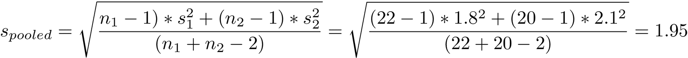

**Gepoolte Standardabweichung**

Die genaue Berechnung der gepoolten Standardabweichung ist an dieser Stelle nicht so wichtig. Entscheidend ist, was dieser Wert bedeutet. Die gepoolte Standardabweichung ist eine Art Mittelwert der Standardabweichungen der beiden Gruppen. Der Mittelwert ist an die  Stichprobengröße der Stichproben adjustiert. Du siehst, dass die gepoolte Standardabweichung bei diesem Beispiel 1.95 beträgt.

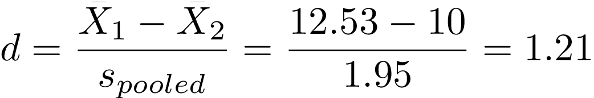

**Cohen's d zwei Stichproben**

Cohen's *d* berechnet sich nun aus dem Mittelwertsunterschied der beiden Gruppen und der gepoolten Standardabweichung. Du siehst, dass wir in diesem Fall ein Cohen's *d* von 1.21 erhalten.

### Einordnung der Größe von Cohen's d

Jede Effektsgröße wird normalerweise in Größen eingeteilt. Man spricht dann von einem kleinen, mittleren und großen Effekt. Folgende Einteilung hat sich für Cohen's *d* etabliert.

Unser obiger Effekt von 1.21 kann daher als großer Effekt bezeichnet werden. Zwar werden Effekte häufig mit der praktischen Bedeutsamkeit gleichgesetzt, allerdings sollte die Effektstärke immer auf dem Hintergrund der jeweiligen Disziplin gedeutet werden.
