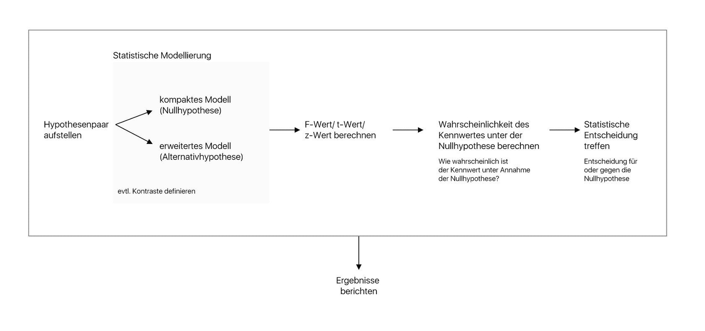
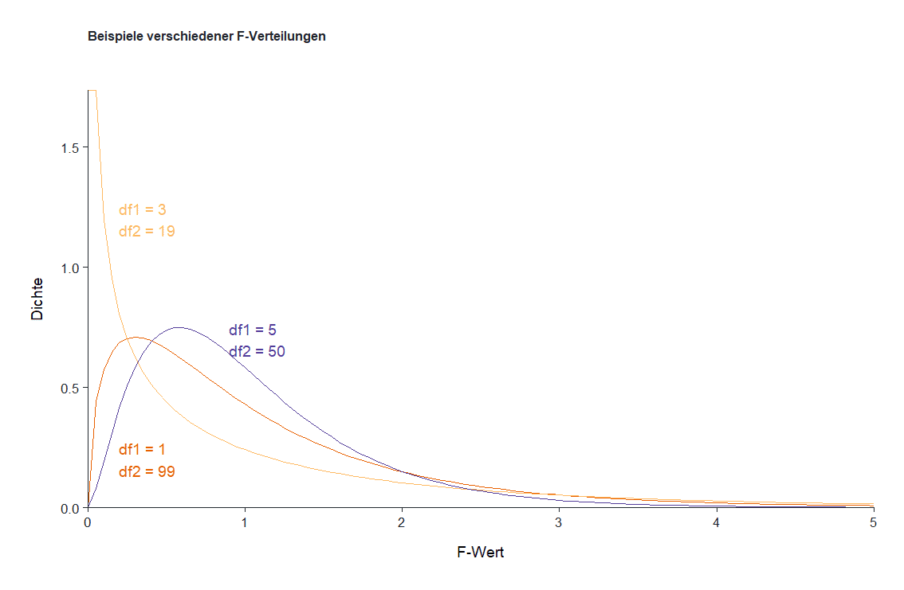

# Statistische Modellierung

## Einführung 

Dieses Modul beschäftigt sich ausführlicher mit der statistischen Modellierung im Prozess des statistischen Hypothesentestens. Du wirst in diesem Modul lernen, wie du die Null- und Alternativhypothese in mathematische Modelle übertragen kannst und wie diese Modelle genutzt werden, um Hypothesen zu testen. Erneut werden wir uns mit Konzepten beschäftigen, die uns das ganze Semester begleiten werden. Je solider dieses Fundament sitzt, desto einfacher werden für dich die nächsten Module. Und erneut testen wir in diesem Modul die Fragestellung aus dem letzten Modul:

> Lesen Studierende mehr als 10 Bücher pro Jahr?

Genauer werden wir in diesem Modul den *t*-Test für eine Stichprobe, welche wir im vorherigen Modul berechnet haben, anhand der statistischen Modellierung durchführen. In diesem Modul werden wir zeigen, wie wir diese Hypothese statistisch modellieren können und anhand des *F*-Wertes prüfen können. Im Verlaufe dieses Prozesses werden wir uns mit folgenden zentralen Konzepten beschäftigen:

-   **Statistische Modelle**: Wie können sprachliche Hypothesen in mathematische Modelle übertragen werden?

-   **Freiheitsgrade**: Wir werden lernen, dass Freiheitsgrade anzeigen, wie viele Parameter noch in ein Modell hinzugefügt werden können.

-   **Fehler in Modellen**: Wir werden die Konzepte SSE~A~, SSE~C~ und SSR einführen, welche die Fehler beschreiben, die unsere Modelle noch in der Vorhersage der wahren Werte machen. Wir werden lernen, dass wir Fehler quadrieren, da dies vorteilhafte Eigenschaften hat.

-   **PRE (Proportional Reduction in Error)**: PRE ist ein Maß der Effektstärke. Wir werden lernen, dass PRE angibt, wie viele Prozent der Fehler des kompakten statistischen Modells das erweiterte Modell vorhersagt. 

-   ***F*****-Wert**: Der *F*-Wert ist eine Erweiterung von PRE und gibt an, wie viel besser die Parameter des erweiterten Modells im Vergleich zu willkürlichen Parametern sind, die keinen Beitrag zur Vorhersage der abhängigen Variable leisten.

-   **Äquivalenz F und *t***: Wir werden lernen, dass der *F*-Wert und der *t*-Wert nah verwandt sind und am Beispiel des *t*-Test für eine Stichprobe diese Äquivalenz aufzeigen.

-   **Tabelle der Ergebnisse**: Wir werden lernen, wie all diese zentralen Konzepte in der Regel tabellarisch in Statistiksoftwares ausgegeben werden. Dies hilft uns später, den Output von Jamovi bzw. anderen Softwares besser zu verstehen.

-   **Notation statistische Modelle**: Zum Schluss werden wir das Vokabular der statistischen Modellierung vertiefen, indem wir lernen, welche Symbole für was stehen.

## Übersicht statistische Modellierung und Prozess des statistischen Hypothesentestens 

In drei Videos versuche ich, dir zwei zentrale Ideen dieses Kurses zu erklären: Wie wir Hypothesen statistisch modellieren und wir diese Modelle nutzen, um Hypothesen zu testen.

### Statistische Modellierung 

TODO: Einfügen Video

TODO: Einfügen Datei: statistical_models.pdf

TODO: Einfügen Video

### Statistische Modellierung 

TODO: Einfügen Video

TODO: Einfügen Datei: statistisches_hypothenthesten.pdf

## Statistische Modellierung der Null- und Alternativhypothese 

### Fragestellung dieses Moduls 

Im letzten Modul hatten wir die Fragestellung getestet, ob Studierende mehr als 10 Bücher pro Jahr lesen. Hierzu hatten wir 30 Studierende willkürlich gefragt, wie viele Bücher sie letztes Jahr gelesen haben. Wir fanden einen signifkanten Effekt und konnten damit zeigen, dass die Annahme, Studierende lesen 10 Bücher pro Jahr gegeben der Daten sehr unwahrscheinlich ist. Daher hatten wir die Nullhypothese abgelehnt. In diesem Modul wiederholen wir den gleichen Test, nur dass wir diesemal statistische Modelle verwenden, um die Hypothese zu beantworten. Am Ende des Moduls werden wir zeigen, dass wir mit diesem Verfahren zu den gleichen Ergebnissen wie mit dem *t*-Test für eine Stichprobe kommen. Zur Erinnerung, dies war das Ergebnis unseres Tests:

> "Um zu prüfen, ob Studierende pro Jahr mehr als 10 Bücher pro Jahr lesen, wurde ein *t*-Test für eine Stichprobe berechnet. Der *t*-Test ergab einen signifikanten Effekt, *t*(**29**) = 4.91, *p* \< .001, *d* = 0.90 (großer Effekt), was darauf hinweist, dass Studierende mehr als 10 Bücher pro Jahr lesen."

Achte darauf, dass wir momentan noch nicht wissen, was die Zahl 29 in diesem Output bedeutet. Wir werden am Ende dieses Submoduls nochmal darauf zu sprechen kommen.

### Null- und Alternativhypothese der Fragestellung 

Zu Beginn eines jeden statistischen Tests müssen wir eine Null- und Alternativhypothese aufstellen. Bei unserer Hypothese handelt es sich zunächst um eine *Unterschiedshypothese*. Wir glauben, dass Studierende mehr als 10 Bücher pro Jahr lesen. Die Null- und Alternativhypothese lauten folgendermaßen:

-   **Nullhypothese**: Der Populationsmittelwert ist *gleich* 10 Bücher pro Jahr

-   **Alternativhypothese**: Der Populationsmittelwert ist *größer als* 10 Bücher pro Jahr

### DATA = MODEL + ERROR 

Die statistische Modellierung kann in einem Satz zusammen gefasst werden: DATA = MODEL + ERROR. In anderen Worten, die wahren Werte setzten sich immer aus unserem mathematischen Modell und den Fehlern, die dieses Model macht, zusammen.

Mit **DATA** bezeichnen wir die **abhängige Variable**, jene Werte, die wir vorhersagen möchten. Mit **MODEL** bezeichnen wir das mathematische Modell auf Grundlage dessen wir die abhängige Variable vorhersagen möchten.

Da mathematische Modelle nie perfekt sind, gibt es immer Fehler in der Vorhersage. Diese Fehler nennen wir **ERROR**. Wenige Studierende lesen exakt 10 Bücher pro Jahr. In anderen Worten ist die abhängige Variable immer die Kombination aus einem mathematischen Modell und dem Fehler, den wir mit diesem Modell machen.

### Statistische Modellierung der Null- und Alternativhypothese 

Das Ziel der statistischen Modellierung ist es, das sprachliche Hypothesenpaar in ein mathematisches Hypothesenpaar zu überführen. Beginnen wir mit der Frage, wie das kompakte und das erweiterte Modell statistisch modelliert werden.

> Wir nennen das statistische Modell der **Nullhypothese** das **kompakte Modell** und das statistische Modell der **Alternativhypothese** das **erweiterte Modell.**

#### **Statistisches Modell der Nullhypothese: Das kompakte Modelle**

Die Nullhypothese besagt, dass Studierende pro Jahr 10 Bücher lesen. Wir werden im Folgenden verschiedene Möglichkeiten beschreiben, diese Nullhypothese als kompaktes Modell statistisch darzustellen:

**Geschätze Anzahl der Bücher pro Jahr**

Dieses Modell gibt an, dass jede Person pro Jahr 10 Bücher liest. Das *Y* mit dem Dach kennzeichnet einen *geschätzten Wert*. Wir nennen diesen Wert **abhängige Variable**. Das statistische Modell ist rechts des = Zeichens. Unser Modell besagt, dass jede Person exakt 10 Bücher pro Jahr liest.

**Tatsächliche Anzahl der Bücher pro Jahr**

Dieses Modell gibt an, wie viele Bücher jede Person pro Jahr *tatsächlich* liest. Achte darauf, dass die abhängige Variable kein Dach mehr hat. Damit sagen wir, dass dies der reale Wert der Anzahl der Bücher ist. Den realen Wert können wir nur korrekt schätzen, da wir ɛ (Epsilon) am Ende des Modells hinzufügen. ɛ steht für den Fehler (ERROR), den wir in der Schätzung der Anzahl der Bücher für jede Person machen. Wenn zum Beispiel Hans 12 Bücher pro Jahr liest, müsste ɛ den Wert 2 haben, damit wir für Hans exakt 12 Bücher pro Jahr vorhersagen.

**Tatsächliche Anzahl der Bücher pro Jahr**

Dieses Modell ist äquivalent zum vorherigen, nur dass wir anstatt von 10 *B~0~* schreiben. Ein großes *B* steht immer für Werte, welche wir nicht auf Grundlage der Daten berechnen, sondern vorgeben. Die Aussage dieses Modells bleibt die gleiche: Der reale Wert setzt sich aus dem Modell und dem Fehler zusammen, den wir mit dem Modell machen.

**Annahme *B~0~* und *β~0~***

Bei der Nullhypothese nehmen wir an, dass der vorgegebene Wert 10 oder *B~0~* dem Populationsmittelwert *β~0~* entspricht. In anderen Worten, wir glauben bei der Nullhypothese, dass alle Studierenden (die Population) im Schnitt 10 Bücher pro Jahr lesen. *β*steht daher immer für Kennwerte der Population. In diesem Fall den Gruppenmittelwert der Population.

#### **Statistisches Modell der Alternativhypothese: Das erweiterte Modelle**

Die Alternativhypothese besagt, dass Studierende mehr als 10 Bücher pro Jahr lesen. Wie viel mehr? Das sagt uns der Mittelwert der Stichprobe.

**Geschätzte Anzahl der Bücher auf Grundlage des erweiterten Modells**

Das erweiterte Modell schätzt, dass jede Person 12.45 Bücher pro Jahr liest. 12.45, da dies der Mittelwert der Stichprobe der 30 Studierenden ist. Erneut ist dieses Modell natürlich nicht absolut genau, da manche Personen mehr oder weniger Bücher lesen. Genau deswegen sprechen wir von *Y*-Dach, um zu sagen, dass die abhängige Variable auf Grundlage des Modells geschätzt wird.

**Geschätzte Anzahl der Bücher auf Grundlage des erweiterten Modells**

Dieses Modell ist exakt gleich zum vorherigen Modell. Nur, in diesem Fall sprechen wir von *b~0~* und nicht von 12.45. Ein kleines *b* steht immer für **Parameter**, die wir auf Grundlage der Daten schätzen. In unserem Fall ist der Parameter der Mittelwert der Stichprobe.

**Tatsächliche Anzahl der Bücher auf Grundlage des erweiterten Modells**

Dieses Modell gibt die tatsächliche Anzahl der Bücher an, die jede Person pro Jahr gelesen hat. Du siehst, dass *Y* kein Dach mehr hat und dass wir einen Fehlerterm hinzugefügt haben (*e~i~*). Wir verwenden ein kleines *e* bei Fehlern, wenn wir die Fehler auf Grundlage unserer geschätzten und nicht der wahren Parameter verwenden. In unserem Fall haben wir *b~0~* geschätzt und verwenden daher *e~i~*.

### Freiheitsgrade 

An dieser Stelle müssen wir einen neuen Begriff einführen. Den Begriff der Freiheitsgrade. Um zu verstehen, was ein Freiheitsgrad ist, müssen wir zwei Feststellungen treffen:

#### **1. Feststellung: Jedes Modell kann so viele Parameter aufnehmen, wie es Datenpunkte gibt**

Ein **Parameter** ist ein Koeffizient in einem statistischen Modell, welchen wir auf Grundlage der Daten schätzen und in die Modelle integrieren. Zum Beispiel:

Dieses Modell hat beispielsweise **einen Parameter** *β~0~*. **Wir kürzen die Parameter des erweiterten Modells ab sofort mit *PA* ab.** In unserem Beispiel steht *β~0~* für die Anzahl der Bücher, die die Population der Studierenden pro Jahr liest. Als **Faustregel: Alle Koeffizenten, die entweder mit einem *β* oder einem kleinen *b* geschrieben werden, sind Parameter. Alle Koeffizienten, die mit einem großen *B* geschrieben werden, sind keine Parameter.**

Zum Vergleich: Das kompakte Modell, welches wir aus unserer Nullhypothese generiert haben, hat keine Parameter, da wir *B~0~* nicht schätzen, sondern vorgegeben haben. **Wir kürzen die Parameter des kompakten Modells ab sofort mit *PC* ab.**

Nun, da wir wissen was Parameter sind, können wir zu unserer ersten Feststellung kommen: Es können nur so viele Parameter in ein Modell integriert werden, wie es Datenpunkte gibt. In unserem Fall haben wir 30 Datenpunkt bzw. Personen in den Daten. Das größtmöglichste Modell hätte daher maximal 30 Parameter. Warum? Da wir durch ein solches Modell die abhängige Variable perfekt vorhersagen könnten (wie das geht, besprechen wir an dieser Stelle nicht; die Lösung wäre, indem wir eine Dummykodierung verwenden - siehe einfaktorielle Varianzanalyse).

#### **2. Feststellung: Wir können nur so viele Parameter hinzufügen, bis die maximale Anzahl an Parametern ausgeschöpft ist.**

Stell dir dazu erneut unsere Modelle bei 30 Versuchspersonen vor:

**Erweitertes Modell**

Das Modell hat **einen Parameter** bei 30 Versuchspersonen. Das bedeutet, wir können noch 29 Parameter hinzufügen.

**Kompaktes Modell**

Das kompakte Modell hat **keine Parameter** bei 30 Versuchspersonen. Das bedeutet, wir können noch 30 Parameter hinzufügen.

Wir haben gezeigt, dass das erweiterte Modell einen Parameter mehr hat als das kompakte Modell. Das wird im folgenden immer der Fall sein. Daher gilt:

> Das **erweiterte Modell** heißt erweitertes Modell, da es **mehr Parameter** hat als das **kompakte Modell**.

Fassen wir dieses Ergebnis zusammen:

> Die **Anzahl der Parameter**, welche wir **noch** in ein Modell **integrieren können**, nennen wir **Freiheitsgrade**. Freiheitsgrade sind daher immer **abhängig** von der Anzahl der **Datenpunkte** in einem Datensatz.

Nun können wir auflösen, was die **Zahl 29** in unserem Output bedeutet. Die Zahl 29 steht innerhalb der Klammer des *t*-Wertes. Die Zahl steht für den Freiheitsgrad des erweiterten Modells. Bei einem *t*-Test berichten wir immer nur den Freiheitsgrad des erweiterten Modells. Später bei dem *F*-Test, werden wir zwei Freiheitgrade in der Klammer berichten.

> "Um zu prüfen, ob Studierende pro Jahr mehr als 10 Bücher pro Jahr lesen, wurde ein *t*-Test für eine Stichprobe berechnet. Der *t*-Test ergab einen signifikanten Effekt, *t*(**29**) = 4.91, *p* \< .001, *d* = 0.90 (großer Effekt), was darauf hinweist, dass Studierende mehr als 10 Bücher pro Jahr lesen."

### Zusammenfassung 

Wir haben nun etabliert, in welchen unterschiedlichen Formen statistische Modelle aufgeschrieben werden können. Wir haben gelernt, dass die Nullhypothese in ein kompaktes Modell und die Alternativhypothese in ein erweitertes Modell übersetzt wird. Das erweiterte Modell heißt so, da es immer mehr Parameter hat als das kompakte Modell. Ebenso haben wir erfahren, dass der Begriff Freiheitsgrad angibt, wie viele Parameter noch in ein Modell hinzufügt werden können. Im nächsten Submodul werden wir diese beiden Modelle visualisieren und was man in diesen Modellen unter Fehlern versteht.

## Fehler in statistischen Modellen: SSE_A, SSE_C, SSR und PRE 

Wir haben im letzten Modul bereits angedeutet, dass unsere Modelle nicht perfekt sind. Wenn wir vorhersagen, dass alle Studierende 10 Bücher pro Jahr liest, werden wir selten richtig liegen. Manche werden mehr lesen, manche werden weniger lesen. Ebenso haben wir gelernt, dass jedes Modell in der Formel DATA = MODEL + ERROR beschrieben werden kann. In diesem Submodul werden wir uns genauer mit dem Begriff des ERRORs auseinandersetzen und lernen, dass wir die Fehler berechnen, indem wir die quadrierte Abweichung der Fehler berechnen.

### Fehler im kompakten Modell 

Beginnen wir mit einer Visualisierung. In der folgenden Visualisierung siehst du für alle Studierende, wie akkurat das kompakte Modell die Anzahl der gelesenen Bücher geschätzt hat. Für die Studentin mit der ID 2 beispielsweise hat das kompakte Modell 10 Bücher geschätzt, die Studentin hat aber in Wirklichkeit 15 Bücher gelesen (siehe y-Achse).

Das Problem mit einem solchen Fehlerterm ist allerdings, dass sich positive und negative Werte aufheben können. Stell dir vor, es gibt nur zwei Versuchspersonen. Der Fehler der ersten Person ist 10 und der Fehler der zweiten Person ist -10. Die Summe dieser beiden Fehler wäre 0. Dieser Art von Fehler ist daher nicht zufriedenstellend. 

Stattdessen werden wir die quadrierte Abweichung der geschätzten und der realen Werte berechnen. Grafisch können wir uns die quadrierte Abweichung wie folgt vorstellen:

Du siehst anhand der Visualisierung, dass wir im kompakten Modell die Anzahl der gelesenen Bücher im Schnitt unterschätzen (das kompakte Modell liegt meist unter den realen Punkten). Bei Person 22 beispielsweise ist der quadrierte Fehler am größten (das Quadrat ist am größten). Für andere Personen schätzen wir die Anzahl der gelesenen Bücher hingegen perfekt. Person 27 beispielsweise liest 10 Bücher pro Jahr, genauso viele, wie wir vorhergesagt haben.

**SSE~C~**

Die Fehler des kompakten Modells definieren wir daher als die Summe der quadrierten Abweichungen der realen Werte von den geschätzten Werten des kompakten Modells. Im Bilde der obigen Visualisierung gesprochen, summieren wir die Fläche der blauen Quadrate (der Fehler) auf.

### Fehler im erweiterten Modell 

Das Gegenstück der Fehler im kompakten Modell ist der Fehler im erweiterten Modell. Erinnere dich, dass das erweiterte Modell vorhergesagt hat, dass jede studierende Person jeweils 12.45 Bücher pro Jahr liest. Im unteren Bild haben wir dieses Modell als orangene Linie dargestellt. Die real gelesenen Bücher pro Person sind als orangener Punkt dargestellt. Die orangenen Flächen kennzeichnen die quadrierten Fehler für jede Person:

Wie du siehst, macht auch das erweiterte Modell Fehler. Die Berechnung der Fehler des erweiterten Modells ist ähnlich zur der Berechnung der Fehler des kompakten Modells:

**SSE~A~**

Die Fehler des erweiterten Modells definieren wir daher als die Summe der quadrierten Abweichungen der realen Werte von den geschätzten Werten des erweiterten Modells. Im Bilde der obigen Visualisierung gesprochen,summieren wir die Fläche der orangenen Quadrate (der Fehler) auf.

### SSR: Reduktion des Fehlers 

Legen wir nun beide Fehler übereinander und vergleichen diese miteinander. Uns fällt auf, dass das kompakte Modell größere Fehler macht als das erweiterte Modell. Beispielsweise ist der Fehler im kompakten Modell bei Person 2, 7, 9, 12 und 14 größer als im erweiterten Modell (die blauen Quadrate sind größer als die orangenen Quadrate)

Tatsächlich wird der Fehler im kompakten Modell immer größer sein als der Fehler im erweiterten Modell. Dies liegt daran, dass wir mit mehr Parametern immer eine bessere Vorhersage der abhängigen Variable treffen können. Da das erweiterte Modell immer mehr Parameter hat als das kompakte Modell, werden die Fehler des erweiterten Modells immer kleiner sein als die Fehler des kompakten Modells.

Wir können daher einen neuen Term etablieren: SSR. SSR gibt an, welcher Anteil der Fehler des kompakten Modells durch das erweiterte Modell aufgeklärt wurde:

SSR berechnet sich aus der Differenz zwischen den Fehlern des kompakten Modells und den Fehlern des erweiterten Modells. SSE~C~ steht immer vor SSE~A~, da SSE~C~ immer größer ist als SSE~A~.

Je größer SSR ist, desto genauer bildet das erweiterte Modell die echten Daten ab, oder, desto besser kann das erweiterte Modell die Daten im Vergleich zum kompakten Modell vorhersagen. Beachte allerdings, dass bei gleichem SSR ein erweitertetes Modell mit wenigen Parametern beeindruckender ist als ein erweitertes Modell mit vielen Parametern. Wir wissen, das mehr Parameter zu einer besseren Vorhersage der abhängigen Variable führen. Wenn also ein Modell mit einem weiteren Parameter die Fehler gleich stark reduziert wie ein Modell mit fünf weiteren Parametern, werden wir das erweiterte Modell mit weniger Parametern bevorzugen, da es einfacher ist als das komplexere Modell.

### PRE (Proportional Reduction in Error) 

Als nächstes lernen wir den Begriff PRE kennen, welcher uns im Verlaufe des Seminars in anderen Worten immer wieder über den Weg laufen wird. PRE steht für Proportional Reduction in Error und ist ein Maß, welches angibt, wie viel Prozent der Fehler des kompakten Modells durch das erweiterte Modell aufgeklärt werden. Beispielsweise könnte PRE den Wert .80 annehmen. Dieser Wert würde bedeutet, dass das erweiterte Modell 80% der Fehler des kompakten Modells reduziert. Berechnet wird PRE wie folgt:

PRE berechnet sich aus dem Quotienten aus SSR und SSE~C~. In anderen Worten standardisieren wir die Fehler, des erweiterten Modell durch die Fehler des kompakten Modells.

Zwei Dinge sind bei der Berechnung von PRE wichtig. Erstens, wir müssen SSE~A~ von SSE~C~ abziehen und nicht umgekehrt, da wir wissen, dass der Fehler des erweiterten Modells immer kleiner ist als der Fehler des kompakten Modells (da das erweiterte Modell mehr Parameter als das kompakte Modell hat), ansonsten würden wir einen negativen Wert erhalten. Zweitens teilen wir das Resultat aus der Subtraktion von SSE~A~ − SSE~C~ durch SSE~C~, um ein relatives Maß zu erhalten. Relativ abhängig vom kompakten Modell. 

PRE kann Werte zwischen 0 und 1 annehmen. 1 würde bedeuten, dass das erweiterte Modell alle Fehler des kompakten Modells erklärt. Nicht jedes PRE ist jedoch gleich beeindruckend. Nehmen wir an, du erhältst ein PRE von .02. Das erweiterte Modell hat fünf Parameter mehr als das kompakte Modell. Welches Modell ist nun besser? Wir gehen davon aus, dass das Modell, welches mit den wenigsten Parametern ähnliche Ergebnisse erzielt und daher sparsamer ist, besser ist. Aus diesem Grund würden wir in diesem Beispiel sagen, dass das kompakte Modell besser ist, schließlich hat es deutlich weniger Parameter als das erweitertes Modell und wir erhalten ein geringes PRE. Nur, ab welchem Wert ist PRE groß genug oder klein genug? Dies hängt von mehreren Faktoren ab. Wenn PRE substantiell durch nur einen Parameter reduziert wird, ist dies besser, als wenn PRE durch mehrere Parameter reduziert wird. Schließlich suchen wir sparsame Modelle mit wenigen Parametern.

### Tabellarische Darstellung der Ergebnisse 

Fassen wir zum Schluss dieses Submoduls unsere Ergebnisse zusammen. Ich habe die Werte für dich berechnet. In der ersten Spalte stehen die drei verschiedenen Arten von Fehlern. SSR steht für die Fehler des kompakten Modells, welche durch das erweiterte Modell reduziert werden. Ebenso gibt es die Fehler, die das erweiterte Modell noch macht, SSE~A~. Zum Schluss, die Fehler, die das kompakte Modell macht. Zudem haben wir einen Freiheitsgrad, der sich aus PA - PC berechnet. Dieser Wert gibt an, wie viele Parameter das erweiterte Modell mehr hat als das kompakte Modell. PRE beläuft sich bei unserem Beispiel auf 0.45. Das heißt, das erweiterte Modell klärt 45% der Fehler im kompakten Modell auf.

## Zusammenfassung

In diesem Submodul haben wir die Begriffe SSE~C~, SSE~A~, SSR und PRE etabliert. Fortan bezeichnen wir mit diesen Begriffen die Fehler, welche das kompakte und das erweiterte Modell machen. Mit SSR bezeichnen wir die Reduzierung der Fehler des kompakten Modells durch das erweiterte Modell.

## F-Wert und F-Verteilungen 

Im letzten Modul haben wir verschiedene Fehler des kompakten und erweiterten Modells kennen gelernt. In unserem Prozess des statistischen Hypothesentestens müssen wir als nächstes einen Kennwert aus diesen Modellen berechnen. Wir werden fortan *F*- und *t*-Werte für unsere Hypothesen berechnen und sehen, dass beide äquivalent zueinander sind. In diesem Submodul werden unsere bisherige Bücherhypothese anhand der F-Verteilung prüfen. Das heißt, wir vollziehen den kompletten Prozess des statistischen Hypothesentestens und treffen eine statistische Entscheidung für oder gegen die Nullhypothese.

### Die Größe der Fehler abhängig der Parameter des Modells 

Bisher haben wir die quadrierten Fehler des kompakten Modells (SSE~C~) und die quadrierten Fehler des erweiterten Modells (SSE~A~) beschrieben. Zudem haben wir SSR als ein Maß definiert, welches angibt, wie viel Fehler des kompakten Modells durch das erweiterte Modell aufgeklärt werden. 

Versuchen wir ein Gedankenexperiment. Stell dir vor, dein erweitertes Modell hat fünf Parameter mehr als das kompakte Modell und es reduziert die Fehler des kompakten Modells um den Wert 30. Stell dir ebenso ein erweitertes Modell mit nur einem weiteren Parameter als das kompakte Modell vor und stell dir vor, dass dieses Modell ebenso die Fehler des kompakten Modells um den Wert 30 reduziert. Welches Modell würden wir bevorzugen? Das sparsamere Modell mit nur einem Parameter mehr. Dieser eine Parameter ermöglicht eine deutlich bessere Vorhersage als das Modell mit den fünf weiteren Parametern. Wie beeindruckend die Fehlerreduktion ist hängt daher von der Anzahl der Parameter ab, die das erweiterte Modell zusätzlich hat.

Aus diesem Grund ist es sinnvoll, SSR nach der Anzahl der Parameter zu standardisieren. Diesen Fehlerterm nennen wir MSR:

MSR gibt an, wie viele Fehler die zusätzlichen Parameter des erweiterten Modells im Schnitt von den Fehlern des kompakten Modells aufklären. Bei nur einem SSR von 30 beispielsweise und nur einem Parameter beläuft sich MSR auf 30. Bei fünf weiteren Parametern auf 30/5 = 6. Die durchschnittliche Fehlerreduktion bei dem erweiterten Modell mit nur einem weiteren Parameter ist daher größer als mit dem erweiterte Modell mit fünf weiteren Parametern.

In unserer Bücherstudie belief sich SSR auf 180.63. Das erweiterte Modell hatte einen Parameter mehr als das kompakte Modell (1). Das heißt, dieser weitere Parameter klärte den Wert 180.63 der Fehler im kompakten Modell auf.

MSR sagt uns also, wie viele Fehler die zusätzlichen Parameter im Durchschnitt reduzieren. Wir haben allerdings noch die restlichen Fehler des erweiterten Modells (SSE~A~). Auch diesen Fehler können wir standarisieren. Wir tun dies, indem wir SSE~A~ durch die Anzahl der Parameter teilen, die wir noch in das erweiterte Modell hinzufügen können.

MSE gibt uns folgende Aussage: Wie viele Fehler klären die restlichen Parameter, die wir noch in das erweiterte Modell hinzufügen können, durchschnittlich auf?

Unser bisheriges erweitertes Modell hatte noch 29 Parameter, die wir in das Modell hinzufügen können. SSE~A~ belief sich auf **217.38**. MSE läge daher bei **7.5**. Das heißt, bei einem willkürlichen weiteren Parameter würden wir erwarten, dass dieser den Wert 7.5 der Fehler im kompakten Modell aufklärt.

### Der F-Wert

Nun kommen wir zu unserem eigentlichen Kennwert, dem *F*-Wert. Der *F*-Wert hat folgende Definition:

> **Definition F-Wert:**
>
> Wie viel besser klären die **zusätzlichen** **Parameter** des erweiterten Modells die Fehler des kompakten Modells auf als **willkürliche Parameter**, die noch in das erweiterte Modell hinzugefügt werden können.

Lass uns diese Definition Stück für Stück aufschlüsseln. Zunächst müssen wir uns die Formel des *F*-Wertes ansehen:

In unserem Beispiel klärt der zusätzliche Parameter des erweiterten Modells die Fehler des kompakten Modells 24 mal besser auf als willkürliche Parameter. Das heißt, der Parameter ermöglicht eine deutlich bessere Vorhersage als wir für irgendeinen Parameter erwarten würden.

Der *F*-Wert ergibt sich aus dem Quotienten von MSR und MSE. In anderen Worten, wie gut ist dieser Parameter im Vergleich zu anderen willkürlichen Parametern? Ein Wert über eins sagt uns, dass dieser Parameter mehr Fehler aufklären als willkürliche Parameter. Ein Wert geringer als 1 sagt uns, dass diese Parameter weniger Fehler aufklären als willkürliche Parameter.

Zusammengefasst können wir die Ergebnisse in einer Tabelle festhalten:

### F-Verteilung 

Um diesen Wert von einer anderen Sichtweise zu verstehen, lass uns zurück zu unserer Hypothese gehen. Unsere Nullhypothese besagt, dass Studierende im Schnitt 10 Bücher pro Jahr lesen. Versuchen wir an dieser Stelle eine Simulation. Stell dir vor, es gibt wirklich keinen Effekt und Studierende lesen 10 Bücher pro Jahr. Dein erweitertes Modell würde in diesem Fall in den meisten Fällen *b~0~* um die 10 bestimmen (ungefähr der Mittelwert der Population). In diesem Fall wäre dein erweitertes Modell fast identisch mit dem kompakten Modell. Das erweiterte Modell sollte von daher die Fehler des kompakten Modells nicht viel besser aufklären können als das kompakte Modell. In jedem Fall wird es die Fehler besser aufklären können, da das erweiterte Modell einen Parameter mehr hat als das kompakte Modell. Wir würden allerdings keinen großen *F*-Wert erwarten. Aus folgendem Grund: 

Der *F*-Wert kann auch folgendermaßen verstanden werden: **Wie ist das Verhältnis zwischen den Fehlern, die das erweiterte Modell aufklären konnte und den Fehlern, die noch bleiben?** Da beide Modelle in unserem Gedankenspiel fast identisch sind, sollte dieses Verhältnis gering sein. Das erweiterte Modell wird, da es fast identisch ist, die Fehler des kompakten Modells nicht deutlich aufklären. Und genau das zeigt sich, wenn wir *F*-Werte simulieren.

Bleiben wir bei der Idee, dass es keinen Effekt gibt: Wir wiederholen die gleiche Studie (wir befragen 30 Studierende danach, wie viel Bücher sie pro Jahr lesen) unterschiedlich oft. 10 mal, 100 mal, 1000 mal und 10000 mal. Jedes Mal berechnen wir den *F*-Wert. Folgende Verteilungen ergeben sich daraus:

Du siehst, dass wir mit steigender Anzahl an Studierenden eine rechtschiefe Verteilung erhalten. Diese Verteilung nennen wir *F*-Verteilung. Die *F*-Verteilung zeigt uns an, wie das Verhältnis zwischen den aufgeklärten Fehlern und den übrigen Fehlern im kompakten Modell wäre, sollte die Nullhypothese stimmen. Du siehst an der Verteilung, dass wir in der Regel Werte zwischen 0 und 1 erwarten würden. Das heißt, der zusätzliche Parameter im erweiterten Modell sollte meist nicht besser sein als ein Parameter, der keinen Beitrag zur Fehleraufklärung leistet. Ganz selten erhalten wir *F*-Wete größer als 4 oder 5. In anderen Worten, *F*-Werte über 5 sind sehr ungewöhnlich, die Parameter leisten einen besseren Beitrag zur Fehlerreduktion als wir erwarten würden.

### Beispiele F-Verteilungen 

Ganz ähnlich zu der *t*-Verteilung gibt es unterschiedliche *F*-Verteilungen. Wie die *F*-Verteilung aussieht, hängt mit den beiden Freiheitsgraden des kompakten und des erweiterten Modells zusammen. In der nächsten Visualisierung siehst du beispielsweise drei verschiedene *F*-Verteilungen, welche sich in ihren Freiheitsgraden unterscheiden:

Wie du siehst, sind alle Verteilungen rechtsschief, das heißt, *F*-Werte über 4 sind in der Regel sehr selten. Wie diese *F*-Verteilungen aussehen, ist für diesen Kurs nicht so wichtig, entscheidend ist allerdings, dass du verstehst, dass diese *F*-Verteilungen eine Stichprobenkennwertverteilung darstellen, anhand derer wir die Wahrscheinlichkeit des *F*-Wertes unter Annahme der Nullhypothese testen können.

### **Ermittlung von *P*(D\|H~0~) auf Grundlage von *F***

Wir haben nun unseren Kennwert *F*. Als nächstes müssen wir uns fragen, wie wahrscheinlich dieser *F*-Wert unter Annahme der Nullhypothese (10 Bücher pro Jahr) ist. Unser *F*-Wert beträgt 24.01.

Wenn wir nun unseren empirischen *F*-Wert in der *F*-Verteilung abtragen, sehen wir, dass ein solcher *F*-Wert unter der Annahme der Nullhypothese äußerst unwahrscheinlich ist. Wir sprechen daher von einem signifikanten Ereignis und lehnen die Nullhypothese ab.

Die Wahrscheinlichkeit für einen solchen Kennwert ist verschwindent gering. Erinnere dich daran, dass wir die Wahrscheinlichkeit als die Fläche unter dem Kennwert und größer als dem Kennwert berechnet haben. In unserem Fall ist diese Wahrscheinlichkeit deutlich unter 1%. Der p-Wert ist daher \< .001. Auf Grundlage dieses Ergebnisses lehnen wir daher die Annahme ab, dass Studierende 10 Bücher pro Jahr lesen. Vermutlich lesen sie mehr.

An dieser Stelle führen wir einen weiteren neuen Begriff ein: Eta-Quadrat (*η*^2^). Eta-Quadrat ist ein Effektstärkenmaß und ist identisch mit PRE:

In unserem Fall belief sich PRE auf 0.45. Das heißt, das erweiterte Modell war in der Lage, 45% der Fehler im kompaten Modell aufzuklären.

### Tabellarische Darstellung der Ergebnisse 

Wir sind damit an das Ende unseres Tests gekommen. Begonnen haben wir mit der Frage, ob Studierende mehr als 10 Bücher pro Jahr lesen. Mit Hilfe der statistischen Modellierung haben wir den *F*-Wert berechnet und sind zu dem Schluss gekommen, dass der Kennwert unter der Nullhypothese sehr unwahrscheinlich und damit signifikant ist. Wir verwerfen daher die Nullhypothese und gehen davon aus, dass Studierende mehr als 10 Bücher pro Jahr lesen. Fassen wir die Ergebnisse in einer Tabelle zusammen:

### Zusammenfassung 

Wir haben in diesem Submodul den *F*-Wert und die *F*-Verteilung kennen gelernt. Fortan werden wir für alle Hypothesen einen *F*-Test rechnen und die gleichen Berechnungen mit ein paar Unterschieden ausführen. Den F-Wert haben wir in diesem Submodul als einen Wert kennen gelernt, der das Verhältnis zwischen den aufklärten Fehlern durch die weiteren Parameter und den restlichen Fehlern des kompakten Modells angibt. Hohe *F*-Werte sind unter der Annahme der Nullhypothese unwahrscheinlich. *F*-Werte unter 1 bedeuten, dass die zusätzlichen Parameter nicht viel besser sind als willkürliche Parameter, die keinen wesentlichen Beitrag zur Fehlerreduzierung leisten. Im nächsten Submodul werden wir zeigen, dass der *F*-Wert und der *t*-Wert äquivalent sind.

## Äquivalenz F und t 

TODO: Das war vorher schon drin?

## Konfidenzintervalle

anhand der Parameter erklären und was sie bedeuten

-   <https://thenewstatistics.com/itns/2020/07/04/3-easy-ways-to-obtain-cohens-d-and-its-ci/>
-   <http://www.tqmp.org/RegularArticles/vol14-4/p242/p242.pdf>
