# Einfache lineare Regression

## Einführung

In diesem Modul beschäftigen wir uns mit der Frage, wie wir Zusammenhangshypothesen testen können. Genauer werden wir in diesem Modul folgende Fragestellung zu beantworten versuchen:

> **Erinnern sich Studierende mehr an die Inhalte eines Vortrages, je mehr Worte sie während des Vortrags mitschreiben?**

Solche eine Zusammenhangshypothese können wir anhand eines erweiterten Modells testen, dass wir gemeinhin als **einfache lineare Regression** bezeichnen. Eine Besonderheit dieser Modelle zum bisherigen Modell des *t*-Tests für eine Stichprobe ist, dass dieses Modell einen **Prädiktor** umfasst. Prädiktoren sind Variablen, die wir in die statistischen Modelle einfügen und uns individuelle Informationen über Versuchspersonengeben. In unserem Beispiel ist der Prädiktor die Anzahl der Wörter, die Studierende in ihren Notizen während der Vorlesung aufschreiben. Der restliche Verlauf des statistischen Hypothesentestens bleibt so, wie wir es in den letzten beiden Modulen kennen gelernt haben.

### **Datensatz dieses Moduls**

Wir werden in diesem Modul einen echten Datensatz verwenden, der in der Studie von [Morehead, Dunlosky und Rawson (2014) ](https://link.springer.com/article/10.1007/s10648-019-09468-2)erhoben wurde. In dieser Studie wiederholten Morehead und Kollegen eine Studie, die ursprünglich von [Mueller und Oppenheimer (2014)](https://journals.sagepub.com/doi/abs/10.1177/0956797614524581) durchgeführt wurde. In beiden Studien wurde untersucht, ob die Mitschrift einer Vorlesung mit verschiedenen Medien einen Einfluss auf die Erinnerungsleistung von Studierenden hat. Mueller und Oppenheimer führten die erste Studie durch und fanden, dass Studierende, die Notizen mit dem Laptop anfertigten, ein geringeres konzeptuelles Wissen erwarben als Studierende, die die Mitschrift per Hand anfertigten. Ebenso schrieben Studierende, die per Laptop mitschrieben, mehr wörtliche Zitate aus der Vorlesung auf als Studierende, die per Hand mitschrieben. 

Morehead und Kollegen wollten diese Hypothese genauer prüfen und führten eine [Replikation ](https://dorsch.hogrefe.com/stichwort/replikationsstudie)dieser Studie durch. In dieser Studie prüften sie die Studierenden nicht nur direkt nachdem sie die Notizen aufschrieben, sie testeten die Studierenden ebenso zwei Tage später, um zu testen, ob der Effekte des Schreibmediums von Dauer ist. Ebenso liesen sie Studierende mit einem digitalen Medium (eWriter) schreiben, welches Mueller und Oppenheimer nicht prüften. Ihre Ergebnisse zeigten, dass das Medium keinen Einfluss auf die Erinnerungsleistung der Studierenden hatte. Damit stellten sie die von Mueller und Oppenheimer gefunden Ergebnisse in Frage und erweiterten die Diskussion um den Einfluss von Schreibmedien auf das Lernen.

### **Hypothese und Datensatz dieses Moduls**

Wir werden in diesem Modul die Daten der Studie von Morehead und Kollegen verwenden, um heraus zu finden, ob Studierende mehr aus einer Vorlesung lernen, je mehr sie während der Vorlesung mitschreiben. Morehead und Kollegen haben die Ergebnisse in ihrer Studie [online auf der Plattform OSF](https://osf.io/dyga5/) zur Verfügung gestellt. In diesem Datensatz gibt es zwei Variablen, die wir für dieses Modul verwenden werden:

-   **wordcount**: Die Anzahl der Wörter der Mitschrift der Studierenden.

-   **test1tot**: Prozentueller Anteil der korrekten Fragen des Tests direkt nach dem Aufschreiben der Notizen.

Den folgenden Datensatz habe ich für unsere Zwecke aus dem originalen Datensatz von Morehead und Kollegen ein wenig gereinigt. Beispielsweise umfasst der Datensatz nur die Daten des ersten Experiments von Morehead und Kollegen. Ebenso umfasst der Datensatz nur Versuchspersonen, die Notizen während des Betrachtens der Vorlesungen angefertigt haben und Versuchspersonen, die sowohl den sofortigen als auch den Tests zwei Tage nach dem Experiment durchführten. Insgesamt gibt es 84 Versuchspersonenin dem Datensatz. Lade dir den Datensatz am besten direkt herunter. Wir werden später in Jamovi die Ergebnisse unserer Tests mit diesem Datensatz berechnen.

TODO: Einfügen Datei morehead_experiment1.csv

Der Datensatz umfasst zudem sehr viele Variablen. Wenn du einen Überblick haben möchtest (ich erwarte das nicht von dir in diesem Modul), schau dir folgende Datei mit den Variablen im Detail an.

TODO: Einfügen Doc variablen.docx

Im folgenden Modul werden wir die Fragestellung ausführlich testen und die uns bekannten Methoden verwenden, um diese Hypothese zu testen.

## Das statistische Modell der einfachen linearen Regression

### Darstellung der Regressionsgeraden der einfachen linearen Regression

Beginnen wir mit einem Streudiagram. In folgendem Bild siehst du ein Streudiagram, bei dem auf der x-Achse die Anzahl der Wörter abgetragen sind, die die Studierenden in der Vorlesung mitgeschrieben haben und bei der auf der y-Achse die Anzahl der Punkte im Test direkt nach der Mitschrift der Vorlesung dargestellt sind.

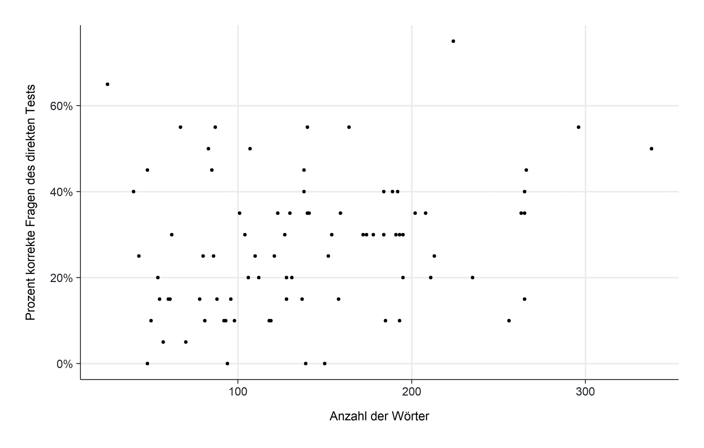

Wie würdest du den Zusammenhang dieser beiden Variablen beschreiben? Ich erkenne beispielsweise einen leichten Trend, dass Studierende, die mehr schreiben, besser im Test abschneiden. Ich erkenne diesen Trend, da es wenige Studierende gibt, die viel schreiben und schlecht im Test abschneiden. Es gibt hingegen deutlich mehr Studierende, die wenig mitschreiben und wenig Punkte im Test hatten. 

Eine Möglichkeit, diesen Zusammenhang mathematisch zu beschreiben, ist die Regressionsgerade. Diese sieht in unserem Fall so aus:

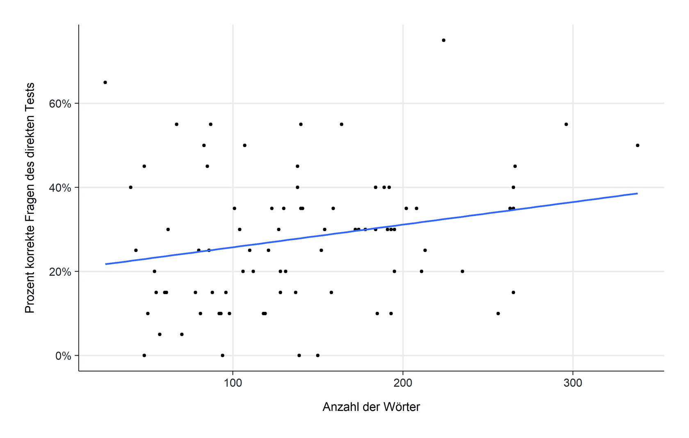

Die Regressionsgerade stellt grafisch dar, was wir gerade sprachlich versucht haben zu beschreiben. Sie beschreibt den Zusammenhang zweier Variablen x und y. In diesem Fall ist die Steigung der Geraden positiv. Die Regressionsgerade zeigt damit an, dass Studierende *besser* im Test abschnitten, je *mehr* Wörter sie mitschreiben. Allerdings nur bedingt. Erstens ist die Vorhersage der Punktzahl auf Grundlage der Anzahl der Wörter nicht perfekt. Fast alle Punkte liegen **nicht** auf der Regressionsgerade. Eine Regressionsgerade stellt nämlich nie einen deterministischen ("so wird es auf jeden Fall sein"), sondern einen probabilistischen Zusammenhang ("so wird es wahrscheinlich sein") dar.

### Vorhersagen auf Grundlage der Regressionsgeraden

Alle statistischen Modelle, so auch die Regressionsgerade, erlauben uns Vorhersagen für abhängige Variablen (das Kriterium) zu machen. Beispielsweise können wir auf Grundlage der Anzahl der Wörter, die eine Studentin während einer Vorlesung aufschreibt vorher sagen, wie gut diese Person in einem Test abschneiden wird. Nehmen wir einmal an, eine Studentin schreibt 200 Wörter während der Vorlesung auf. Unser Modell besagt, dass diese Studentin 31.1% der Punkte im Test erreichen wird. Um diese Vorhersage zu erhalten, suchen wir uns der x-Achse den Wert 200 und schauen, auf welcher Höhe die Gerade an dieser Stelle auf der y-Achse liegt:

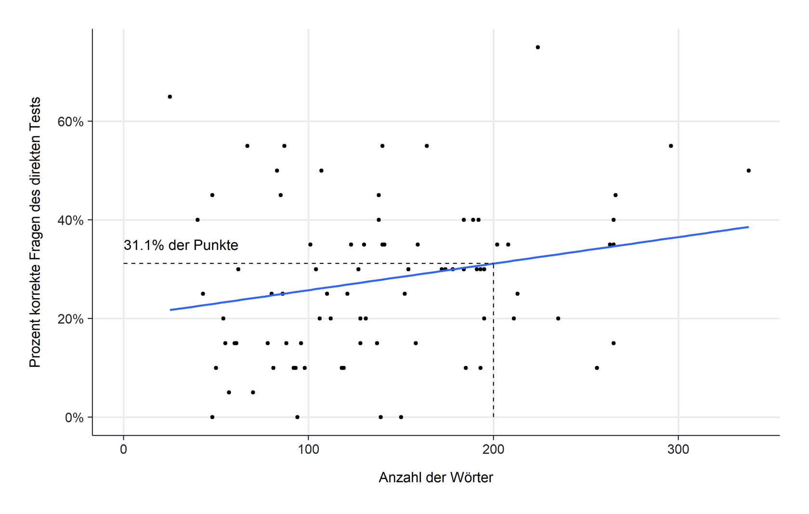

Wird diese Person wirklich 31.1% der Punkte im Test erreichen? Nein, da es ein probabilistisches Modell ist. Genau deswegen sprechen wir von einem Modell. Wir versuchen damit, die Daten so gut wir können zu beschreiben.

### **Vergleich des Modells der einfachen linearen Regression mit dem Mittelwert der abhängigen Variable als Modell**

Vergleichen wir als nächstes das Modell der einfachen linearen Regression mit dem erweiterten Modell, welches wir im letzten Modul beim *t*-Test für eine Stichprobe kennen gelernt haben. Erinnere dich, dass das erweiterte Modell beim *t*-Test für eine Stichprobe die abhängige Variable einer Person auf Grundlage des Mittelwerts dieser abhängigen Variable vorhergesagt hat.

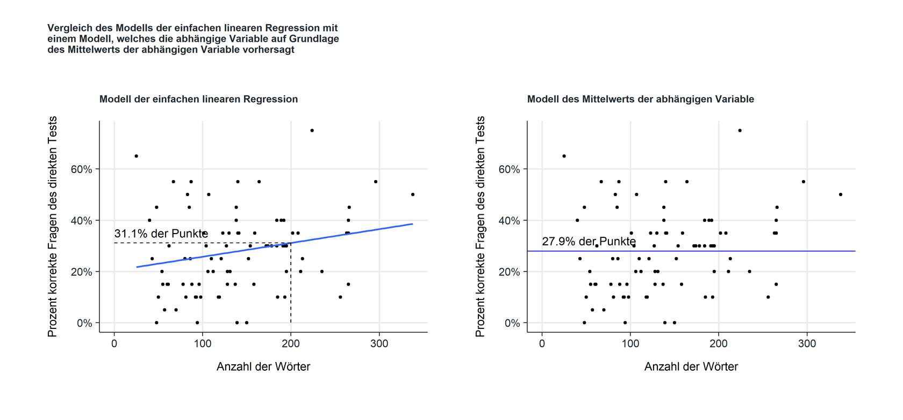

Du siehst, dass beide Modelle unterschiedliche Vorhersagen bei einer Person machen, die 200 Wörter während der Vorlesung mitgeschrieben hat. Das Modell der einfachen linearen Regression sagt voraus, dass eine solche Person 31.1% der Punkte erreichen wird, das Modell mit dem Mittelwert der abhängigen Variable sagt voraus, dass eine solche Person 27.9% der Punkte erreichen wird. Dieses Beispiel zeigt, dass die Wahl des Modells zu unterschiedlichen Vorhersagen führt. Ich zeige dir diesen Vergleich, da wir ihn im nächsten Submodul benötigen werden. Genauer werden wir im nächsten Modul sehen, dass wir zum Testen von Zusammenhangshypothesen das Modell der einfachen linearen Regression als erweitertes Modell und das Modell des Mittelwerts der abhängigen Variable als kompaktes Modell verwenden werden.

### **Statistisches Modell der einfachen linearen Regression**

Bisher haben wir das Modell der einfachen linearen Regression grafisch als Linie dargestellt. Als nächstes werden wir diese Linie als statistisches Modell darstellen. Und so sieht das Modell für unsere Daten aus:

Um das Modell zu verstehen, beginnen wir mit dem **Prädiktor** *X~i~*: Und wir stellen uns erneut unsere Studentin vor, die 200 Wörter während der Vorlesung aufgeschrieben hat. Für diese Studentin würden wir für den **Prädiktor** *X~i~* die Zahl 200 einsetzen. Für diese Studentin würden wir eine Punktzahl von ungefähr 31% vorhersagen.

Wir haben eben einen neuen Begriff etabliert: Den Begriff **Prädiktor**. Auch dieser Begriff wird uns immer wieder begegnen, wir müssen ihn zudem vom Begriff des Parameters unterscheiden.

> **Parameter** (bzw. Koeffizienten) werden in statistischen Modellen als *ß* oder *b* dargestellt. Sie werden auf Grundlage der Daten berechnet. **Prädiktoren** werden in statistischen Modellen als *X* dargestellt und werden auch als **unabhängige Variablen** bezeichnet.

Das Modell der einfachen linearen Regression hat daher einen Prädiktor und zwei Parameter. Nun, da wir Prädiktoren von Parametern unterscheiden können, müssen wir die beiden anderen Parameter im Modell der einfachen linearen Regression verstehen.

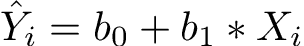

**Allgemeine Darstellung des Modells**

Die beiden Parameter im Modell nennen wir *b~0~* und *b~1~*. Da es kleine *b*s sind, meinen wir damit die Parameter, die wir auf Grundlage unserer Daten ermittelt haben. Nicht die Parameter, die sich aus der gesamten Population ergeben. Achte ebenso darauf, dass wir bei diesem Modell ein *Y* mit einem Dach verwenden. Damit meinen wir die Werte, welche wir auf Grundlage des Modells schätzen. Nicht die tatsächlichen Werte einer jeden Person.

Beginnen wir mit dem Parameter *b~1~. b~1~* bezeichnen wir als Steigungskoeffizienten. Dieser Parameter gibt an, wie steil die Regressionsgerade ist. In unserem berechneten Modell beläuft sich der Steigungskoeffizient auf 0.0005387. Das bedeutet, für jedes weitere Wort, welches eine Person aufschreibt, sollte diese Person 0.05% mehr Punkte im Test erhalten (0.05%, da der Wert 0.0005387 mal 100 berechnet werden muss, um Prozente zu erhalten). Grafisch können wir uns diese Steigung folgendermaßen vorstellen (siehe nächste Grafik). Schreibt eine Person 100 Worte mehr im Test, erwarten wir, dass diese Person 5.387% mehr Punkte im Test erhält. 5.387%, da wir 0.0005387 mal 100 rechnen müssen (= 0.05387) um den prozentuellen Anteil zu erhalten und nochmal mal 100 rechnen müssen um die Prozentangabe zu erhalten (=5.387%).

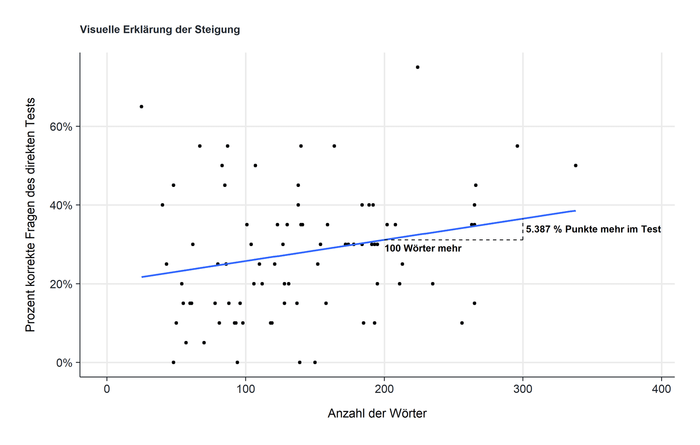

*b*~0~ wiederum kennzeichnet den y-Achsenabschnitt. Der y-Achsenabschnitt ist die Stelle, bei welcher die y-Achse durch die Regressionsgerade abgeschnitten wird. Bei unserer Regressionsgerade liegt dieser Wert bei 0.2037:

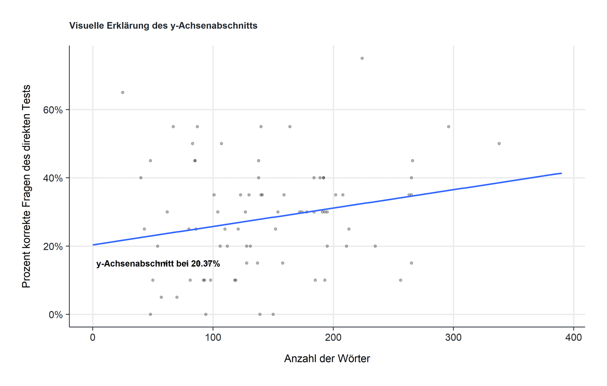

Wir haben damit etabliert, wie das statistische Modell der einfachen linearen Regression aussieht. Das Modell umfasst einen Prädiktor (*X~i~*) und zwei Parameter (*b*~0~ und *b*~1~). Dieses Modell können wir als Gerade darstellen.

### **Berechnung der Regressionsgeraden**

Nun, warum ist diese blaue Gerade die "richtige" Regressionsgerade? Ich hätte unendlich viele solcher Regressionsgeraden wählen können. Beispielsweise folgende:

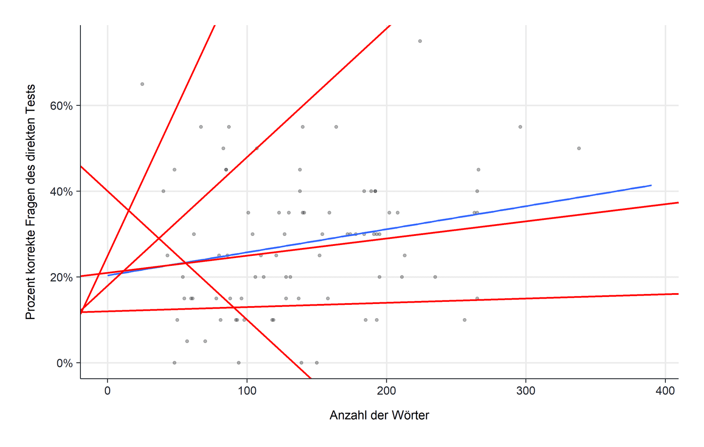

Manche der roten Geraden bilden die Daten besser ab als andere. Dennoch, die blaue Gerade ist die "beste", da sie eine Eigenschaft hat, die die anderen Geraden nicht haben: Die blaue Regresssionsgerade minimiert die quadrierten Abweichungen der einzelnen Punkte von der Regressionsgerade.

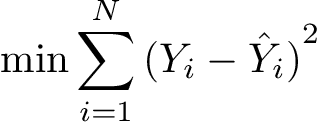

**Ordinal Least Squares**

In einer Formel dargestellt, suchen wir daher diejenige Gerade, welche die quadrierten Fehler zwischen dem echten Wert (*Y~i~*) und dem vorhergesagten Wert (*Y*-Dach*i*) maximal minimiert. Wir nennen diesen Prozess [Ordinal Least Squares](https://en.wikipedia.org/wiki/Ordinary_least_squares) Methode.

Die beste Regressionsgeraden sagt *Y*~i~ allerdings nicht perfekt voraus. Es ist schlicht die beste aller möglichen Regressionsgeraden. 

Es gibt nun verschiedene Methoden, diese beste Gerade zu finden. Nehmen wir zwei. Wir können die Gerade entweder in R berechnen oder anhand der Korrelation und der Standardabweichungen der beiden Variablen berechnen. In R können wir die Funktion lm verwenden, um die Gerade direkt zu erhalten:

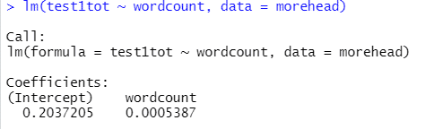

Linksder Tilde \~ tragen wir die abhängige Variable ein, rechts der Tilde den Prädiktor. Zusätzlich müssen wir angeben, aus welchem Datensatz wir die Variablen ziehen. Wie du siehst, erhält man mit der Funktion das gleiche Modell, welches wir weiter oben beschrieben haben.

Eine weitere Möglichkeit zur Berechnung der Parameter bei einer einfachen linearen Regression liefern folgende Formeln:

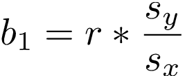

*b~1~* können wir berechnen, indem wir den Quotienten der Standardaweichung der abhängigen Variable (*s~y~*) und der unabhängigen Variable (*s~x~*) mit der Korrelation der beiden Variablen (*r*) multiplizieren.

*b~1~* können wir anhand dieser Formel beispielsweise selbst in R berechnen:

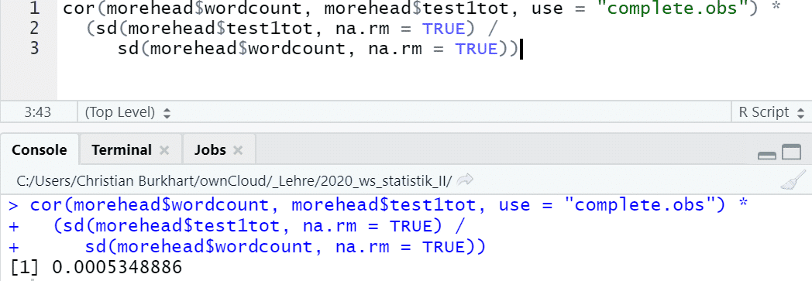

*b~0~* können wir berechnen, indem wir das Produkt aus b1 und dem Mittelwert des Prädiktors von dem Mittelwert der abhängigen Variable abziehen.

Erneut können wir den Koeffizienten in R berechnen und erhalten das gleiche Ergebnis, das wir weiter oben dargestellt haben:

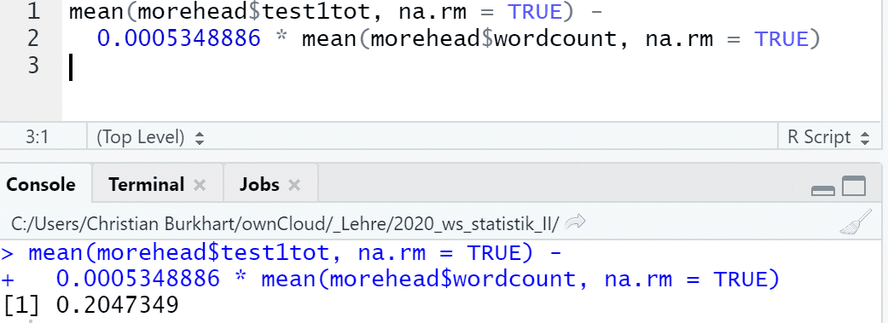

### Zusammenfassung

In diesem Submodul haben wir gezeigt, wie das statistische Modell der einfachen linearen Regression aussieht und wie es berechnet wird. Das Modell kann als Gerade in einem Koordinatensystem dargestellt werden. Die Koeffizienten oder Parameter des Modells kennzeichnen den y-Achsenabschnitt und die Steigung der Gerade (auch Intercept genannt). Der erste Parameter *b~0~* kennzeichnet die Stelle, an der die Regressionsgrade die y-Achse schneidet. Der Parameter *b~1~* kennzeichnet die Steigung der Regressionsgeraden. *X~i~* im Modell kennzeichnet die unabhängige Variable oder das Kriterium, die wir in das Modell für jeden Datenpunkt einfügen. Die Regressionsgerade wird ermittelt, indem man diejenige Gerade findet, welche die geringsten Quadrierten Abweichungen der echten Punkte und der vorhergesagten Punkte hat. Diese Methode nennt man Ordinal Least Squares Methode. Zuletzt haben wir gesehen, wie diese Parameter berechnet werden können. Als nächstes werden wir statistische Hypothesen auf Grundlage dieses Modells testen.

## Statistisches Hypothesentesten

In diesem Modul werden wir die Fragestellung prüfen, ob Studierende, die mehr in einer Vorlesung aufschreiben, auch mehr aus dieser Vorlesung lernen. Wir werden hierfür den Datensatz von [Morehead, Dunlosky und Rawson (2014)](https://link.springer.com/article/10.1007/s10648-019-09468-2) verwenden, wie wir ihn zu Beginn dieses Moduls vorgestellt haben. Der Datensatz umfasst Daten von 84 Studierenden. Folgendermaßen werden wir vorgehen: Wir werden zunächst anhand einer Poweranalyse untersuchen, wie sensitiv unser Test ist, sprich, welche Effekte wir überhaupt durch die Größe unserer Stichprobe finden können. Anschließend werden wir unsere Hypothese statistisch modellieren und ein kompaktes und erweitertes Modell aufstellen. Von dort werden wir den empirischen *F*-Wert berechnen und prüfen, ob wir die Nullhypothese auf Grundlage der Daten ablehnen oder nicht. In diesem Zug werden wir ebenso zeigen, dass wir diese Fragestellung mit einem *t*-Test prüfen können und erklären warum. Zuletzt zeigen wir, wie die Ergebnisse des Tests in einem Fachartikel berichtet werden können.

### Poweranalyse

Mit Power haben wir die Wahrscheinlichkeit bezeichnet, mit der wir bei einem Test die Nullhypothese korrekterweise ablehnen werden, sollte die Alternativhypothese gelten. Wir haben ebenso gesagt, dass wir in der Regel versuchen, eine Power größer als 80% in einem Test zu erzielen. Das bedeutet, sollte die Alternativhypothese stimmen, möchten wir in 80% der Fälle die richtige statistische Entscheidung treffen und die Nullhypothese zu Gunsten der Alternativhypothese ablehnen. In der Regel überlegen wir uns daher auf Grundlage vorheriger Forschung, welchen Effekt wir erwarten und bestimmen anschließend die Größe der Stichprobe. In unserem Fall ist die Stichprobengröße bereits bestimmt (84 Studierende). Wir können allerdings die Fragestellung umdrehen und uns überlegen, für welche Effekte, sprich Korrelationskoeffizienten, wir eine Power von 80% erreichen werden. Hierdurch können wir herausfinden, wie sensitiv unser Test ist, um bestimmte Zusammenhänge zwischen zwei Variablen zu prüfen. Ein Test der nämlich eine zu geringe Power hat, kann uns keine Aufschlüsse über unsere Hypothesen geben.

### Poweranalyse mit G\*Power

In G\*Power können wir die Sensitivität unseres Tests bestimmen, indem wir unter Test *Family: Exact*, unter *Statistical Test Correlation: Bivariate normal model* und unter *Type of Power analysis: Sensitivity* eingeben. Folgendermaßen sieht die Eingabe in G\*Power aus:

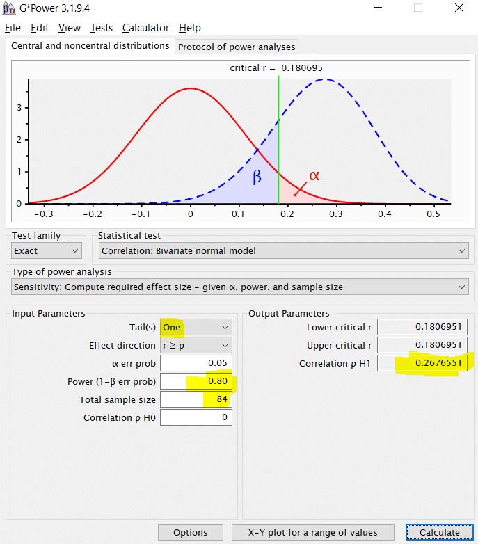

Das Ergebnis dieser Poweranalyse sagt uns nun folgendes: Nur bei einem Korrelationskoeffizienten von *r* = .268 oder größer in der Population werden wir bei einer Stichprobengröße von 84 Personen eine Power von 80% erzielen. In anderen Worten, ist der Korrelationskoeffizient in der Population geringer als *r* = .268, schwindet unsere Power zunehmend. Bei einem Korrelationskoeffizienten von *r* = .11 beispielsweise in der Population würden wir lediglich eine Power von 46% erzielen. Unsere Studie wäre in diesem Fall nicht sensitiv genug, den Effekt durch unser Verfahren des frequentistischen Wahrscheinlichkeitsbegriffs zu finden. Oder, wir könnten aus unserem Test nichts über die Gültigkeit unserer Nullhypothese lernen. Das heißt wiederum, dass unser Test mit 84 Personen nur zur Erkenntnisgewinnung hilfreich ist, sofern der Korrelationskoeffizient der beiden Variablen in der Population größer als .268 ist. Das allerdings wissen wir nicht.

### **Statistische Modellierung der Hypothesen**

Bevor wir unsere Fragestellung statistisch testen, beginnen wir mit einer Grafik. Im folgenden siehst du die statistischen Verfahren, die wir in diesem Kurs kennenlernen werden. Bisher haben wir den *t*-Test für eine Stichprobe kennengelernt. Die Grafik besagt, dass das statistische Modell (sprich das erweiterte Modell) bei diesem Test keine Prädiktoren umfasst (*X*). Ebenso kannst du erkennen, dass wir bei der einfachen linearen Regression ein erweitertes Modell mit einem kontinuierlichem Prädiktor definieren. Kontinuierlich bedeutet, dass wir für *X* in dem Modell metrische (intervall- und verhältnisskalierte) Variablen einsetzen. In unserem Fall wird *X* die Anzahl der Wörter sein, die die Studierenden während der Vorlesung aufschreiben.

Das erweiterte Modell bei der einfachen linearen Regression haben wir im letzten Submodul bereits beschrieben. Wiederholen wir es an dieser Stelle erneut.

**Erweitertes Modell (augmented)**

Das erweiterte Modell, welches wir annehmen, umfasst einen Prädiktor *X~i~* und zwei Parameter (hier Populationsparameter *ß~0~* und *ß~1~*). Genauer beschreibt der Parameter *ß~1~* denZusammenhang der beiden Variablen.

**Kompaktes Modell (compact)**

Das kompakte Modell der Nullhypothese umfasst keinen Prädiktor. Wir nennen es Nullhypothese, da die Parameter, die wir prüfen möchten, in dem dazugehörigen Modell auf Null gesetzt werden. In diesem Fall nehmen wir im kompakten Modell an, dass die Korrelation der beiden Variablen, welche durch *ß~1~* kodiert ist, 0 beträgt. Das kompakte Modell schätzt daher die abhängige Variable auf Grundlage des Mittelwerts der abhängigen Variable (*ß~0~*).

Um diesen Vergleich noch einmal genauer darzustellen, vergleichen wir das erweiterte und das kompakte Modell grafisch. Links siehst du das aus den Daten berechnete erweiterte Modell in blau dargestellt. Rechts siehst du das berechnete kompakte Modell in blau dargestellt. Du siehst, dass wir für jeden Wert *X* im kompakten Modell die gleiche Vorhersage für *Y* machen. Diese Idee ist konform mit unserem oben dargestellten kompakten Modell, da wir dort den Prädiktor *X* aus der Gleichung entfernt haben, indem wir *ß~1~* auf 0 gesetzt haben.

Eine solche horizontale Linie, wie sie durch das kompakte Modell dargestellt ist, beschreibt eine nicht-existierende Korrelation zwischen zwei Variablen. Schau dir dazu [folgende Simulation von Kristoffer Magnussen](https://rpsychologist.com/d3/correlation/) an.

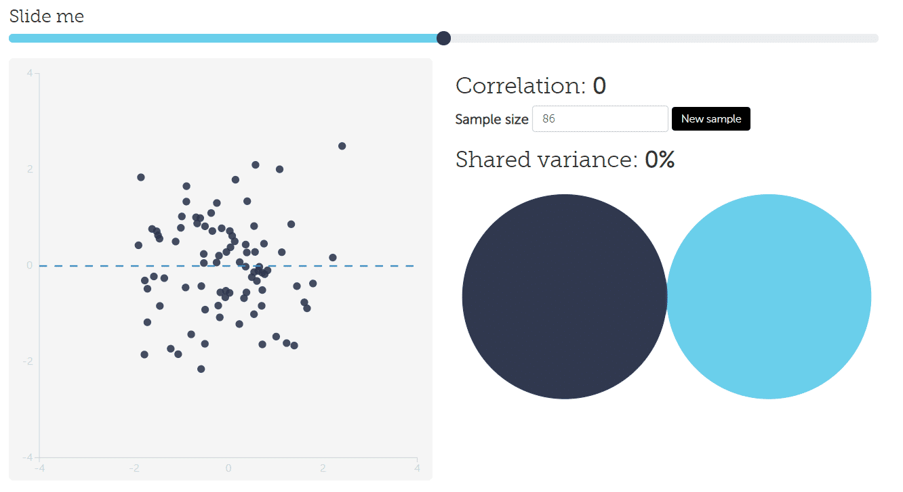

Besteht eine Korrelation von 0 zwischen zwei Variablen, ist die abhängige Variable unbeeinflusst vom Prädiktor X. Oder, das Wissen um die unabhängige Variable gibt uns keine Informationen über die abhängige Variable. Oder: Wie viel Worte einer Person in einer Vorlesung mitschreibt, hat keinen Einfluss auf das Abschneiden im späteren Test dieser Person.

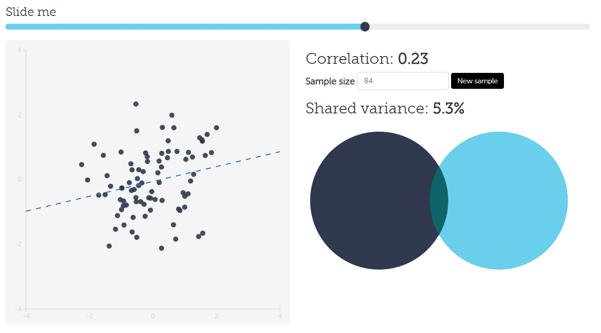

Besteht jedoch eine Korrelation zwischen zwei Variablen, sprich ist der Steigungskoeffizient nicht null, gibt uns die unabhängige Variable *X* Informationen über die abhängige Variable *Y*. In unserem Fall zeigt die Korrelation der beiden Variablen, dass das Abschneiden in dem Test teils durch die Anzahl der Wörter, die Studierende bei einer Vorlesung mitschreiben, erklärt werden kann. Wir werden später erklären, wofür die Prozentzahl 5.3 in der Grafik links steht.

Wir haben nun auf verschiedenen Wegen gezeigt, dass das kompakte Modell und das erweiterte Modell unsere Annahmen über die Null- und Alternativhypothese darstellen. Wir haben damit einen formalen Weg gefunden, unsere Hypothesen in statistische Modelle zu übertragen. Als nächstes können wir den empirischen *F*-Wert berechnen, auf Grundlage dessen wir unsere Hypothese testen.

### **Empirischer *F*-Wert ermitteln**

Als nächstes werden wir den empirischen *F*-Wert ermitteln. Der *F*-Wert wird uns zeigen, wie viel besser der Parameter *b~1~* ist als willkürliche weitere Parameter, die keinen substantiellen Beitrag leisten, *Y* aufzuklären. Hierzu müssen wir die entsprechenden Werte in der folgenden Tabelle finden. Beginnen wir mit den Freiheitsgraden der beiden Modelle. Das erweiterte Modell hat insgesamt 2 Parameter bei 84 Datenpunkten. Das heißt, in dieses Modell können noch 84 - 2 = 82 Parameter hinzugefügt werden. Das kompakte Modell hat insgesamt 1 Parameter bei 84 Datenpunkten (*df*~2~). Das heißt, in das kompakte Modell können noch 84 - 1  = 83 Parameter hinzugefügt werden. Zuletzt können wir feststellen, dass das erweiterte Modell einen Parameter mehr hat als das kompakte Modell (*df*~1~).

+-----------------------------------------------+--------------------+------------------------------+----------+---------+---------+---------+
| **Source**                                    | **Sum of Squares** | ***df***                     | ***MS*** | ***F*** | ***p*** | **PRE** |
+===============================================+====================+==============================+==========+=========+=========+=========+
| Reduktion der Fehler durch erweitertes Modell | \-                 | df~1~ = PA - PC = 1          | \-       | \-      | \-      | \-      |
+-----------------------------------------------+--------------------+------------------------------+----------+---------+---------+---------+
| Restliche Fehler des erweiterten Modells      | \-                 | df~2~ = n - PA = 84 - 2 = 82 | \-       | \-      | \-      | \-      |
+-----------------------------------------------+--------------------+------------------------------+----------+---------+---------+---------+
| Fehler kompaktes Modell\                      | \-                 | n - PC = 84 - 1 = 83\        | \-       | \-      | \-      | \-      |
+-----------------------------------------------+--------------------+------------------------------+----------+---------+---------+---------+

Als nächstes müssen wir die Fehler in beiden Modellen ermitteln und berechnen, wie viel mehr Fehler das kompakte Modell im Vergleich zum erweiterten Modell macht. Beginnen wir mit SSE~C~ und SSE~A~. 

### ***SSE~C~***

Zunächst müssen wir die Fehler ermitteln, die das kompakte Modell macht. Im nächsten Bild sind diese Fehler als Quadrate für jede Person dargestellt. Die Summe dieser Quadrate kennzeichnet *SSE~C~*.

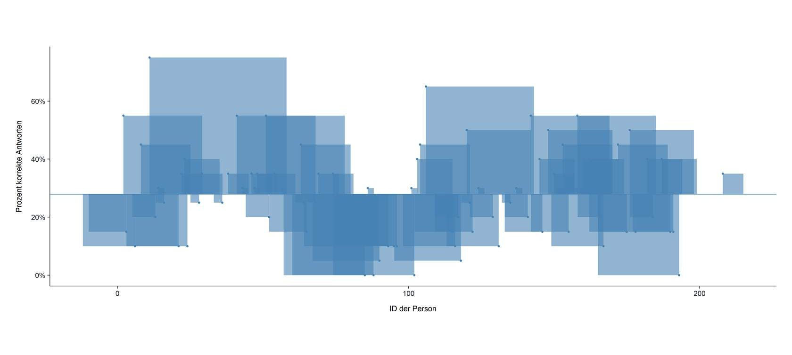

Die Summe dieser Quadrate und damit die Fehler dieses kompakten Modells belaufen sich auf *SSE~C~ =* 2.136042.

### ***SSE~A~***

Ebenso macht das erweiterte Modell Fehler. Da das erweiterte Modell allerdings einen Prädiktor mehr hat als das kompakte Modell, wird dieses Modell insgesamt weniger Fehler machen als das kompakte Modell. Visuell können wir uns die Fehler erneut als den quadrierten Abstand der realen Werte von den vorhergesagten Werten des Modells vorstellen:

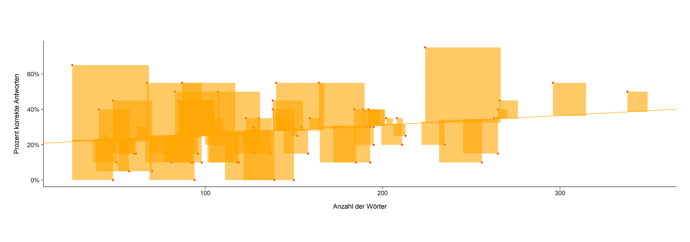

Die Fehler belaufen sich auf ingesamt 2.026016 und sind damit wie erwartet kleiner als beim kompakten Modell.

### ***SSR, PRE*** **und tabellarische Darstellung**

Für *SSR* ergibt sich daher folgender Wert:

\

Das erweiterte Modell reduziert daher 0.11 der Fehler des kompakten Modells. Nun, da wir *SSR* kennen, können wir ebenso berechnen, wie viel Prozent der Fehler des kompakten Modells das erweiterte Modell reduziert:

*PRE* liegt bei 5.15%. Das bedeutet, das erweiterte Modell reduziert 5.15% der Fehler des kompakten Modells. Beachte, dass *PRE* im Kontext der einfachen und multiplen linearen Regression auch als *R*^2^ bezeichnet wird. In der Berechnung ist es allerdings nichts anderes als *PRE*. Ebenso werden wir später sehen, dass die Effektgröße *η*^2^ nichts anderes ist als *PRE*.

Unsere Ergebnisse können wir nun tabellarisch zusammenfassen:

+-----------------------------------------------+--------------------+--------+--------+-------+-------+---------+
| **Source**                                    | **Sum of Squares** | **df** | **MS** | **F** | **p** | **PRE** |
+===============================================+====================+========+========+=======+=======+=========+
| Reduktion der Fehler durch erweitertes Modell | 0.11               | 1      | \-     | \-    | \-    | 0.0515\ |
+-----------------------------------------------+--------------------+--------+--------+-------+-------+---------+
| Restliche Fehler des erweiterten Modells      | 2.026              | 82     | \-     | \-    | \-    | \-      |
+-----------------------------------------------+--------------------+--------+--------+-------+-------+---------+
| Fehler kompaktes Modell\                      | 2.136              | 83\    | \-     | \-    | \-    | \-      |
+-----------------------------------------------+--------------------+--------+--------+-------+-------+---------+

### ***F*****-Wert und Wahrscheinlichkeit für *F* berechnen**

Nun, da wir die Fehlerwerte kennen, sind wir im Stande *MSR*, *MSE* und *F* zu berechnen. Erneut fragen wir uns, wie viel besser unser Parameter *b*~1~ ist als ein willkürlicher Parameter, welchen wir noch in das erweiterte Modell hinzufügen könnten?

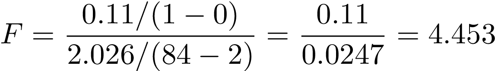

Es zeigt sich, dass der Parameter *b*~1~, welcher für den Zusammenhang der beiden Variablen steht, 4.45 mal besser ist als wir bei einem willkürlichen Parameter erwarten würden. Als Faustregel gilt, liegt der empirische F-Wert zwischen 4 und 5, wird der Test in der Regel signifikant. Prüfen wir dies als nächstes:

In R können wir die Wahrscheinlichkeit für diesen Kennwert relativ schnell durch die Funktion [pf](https://stat.ethz.ch/R-manual/R-patched/library/stats/html/Fdist.html) ermitteln. Wir müssen hierfür lediglich den empirischen *F*-Wert sowie die beiden Freiheitsgrade eingeben. Um die Fläche rechts des empirischen *F*-Wertes zu erhalten, müssen wir das Ganze von 1 abziehen:

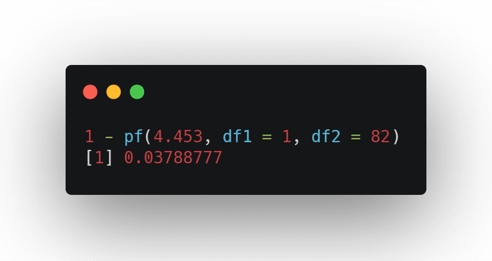

Wir sehen, dass die Wahrscheinlichkeit für einen solchen Kennwert bei 3.78% liegt. Wir erhalten damit ein signifikantes Ergebnis. Die Annahme, dass es keinen Zusammenhang zwischen diesen beiden Variablen gibt, muss daher widerlegt werden. Wir müssen in anbetracht von *R*^2^ allerdings auch sagen, dass der Effekt der Anzahl der Wörter auf die Lernleistung relativ gering ist. Er klärt lediglich 5% der Varianz im kompakten Modell auf. Es müssen daher andere Faktoren deutlich besser die Leistung in dem Test erklären können als lediglich die Anzahl der Worte in der Mitschrift. Fassen wir die Ergebnisse zusammen:

+-----------------------------------------------+--------------------+----------+----------+---------+---------+------------------+
| **Source**                                    | **Sum of Squares** | ***df*** | ***MS*** | ***F*** | ***p*** | ***PRE / R^2^*** |
+===============================================+====================+==========+==========+=========+=========+==================+
| Reduktion der Fehler durch erweitertes Modell | 0.11               | 1        | 0.11     | 4.45    | .038    | 0.0515\          |
+-----------------------------------------------+--------------------+----------+----------+---------+---------+------------------+
| Restliche Fehler des erweiterten Modells      | 2.026              | 82       | 0.0247   | \-      | \-      | \-               |
+-----------------------------------------------+--------------------+----------+----------+---------+---------+------------------+
| Fehler kompaktes Modell\                      | 2.136              | 83\      | \-       | \-      | \-      | \-               |
+-----------------------------------------------+--------------------+----------+----------+---------+---------+------------------+

### **Äquivalenz zum *t*-Test**

Selten wird bei einer Korrelation ein *F*-Test berichtet. Viel häufiger ist der *t*-Test. Wir wissen allerdings jetzt, dass der *F*-Test und der *t*-Test die gleichen Ergebnisse liefern (zumindest für ungerichtete Hypothesen). Nichtsdestotroz sollten wir dies an dieser Stelle noch einmal zeigen.

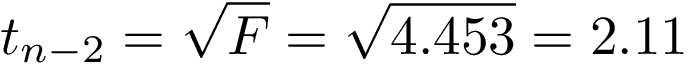

**t-Wert auf Grundlage von F ermitteln**

Zunächst ist der *t*-Wert nichts anderes als die Wurzel aus *F*. Der *t*-Wert ist daher 2.11.

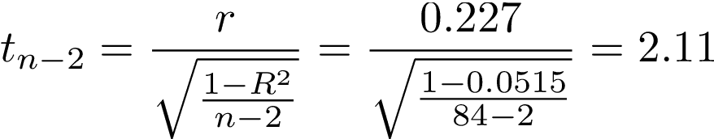

**t-Wert auf Grundlage des Korrelationskoeffizienten der beiden Variablen**

Ebenso können wir die Korrelation der beiden Variablen verwenden und erhalten den gleichen *t*-Wert.

### **Effektgröße Cohen's *d* berechnen**

Wir haben bereits mit *R*^2^ eine Effektgröße kennen gelernt, die wir für diesen Test berichten können. Allerdings wird bei einem *t*-Test eher die Effektgröße Cohen's *d* berichtet. Wir haben die Formel für Cohen's *d* bereits in vorherigen Modul kennen gelernt. Allerdings ist diese Formel geeignet, um Cohen's *d* aus Mittelwerten zu ermitteln. Für die einfache lineare Regression kann folgende Formel verwendet werden (siehe [Rosnow et al., 2003](https://psycnet.apa.org/doiLanding?doi=10.1037/h0087427)):

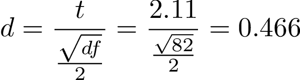

Wie du siehst, berechnet sich Cohen's *d* aus dem empirischen *t*-Wert und dem Quotienten aus der Wurzel des Freiheitsgrades des erweiterten Modells und der Zahl 2. In unserem Fall handelt es sich bei uns um einen kleinen Effekt (siehe auch [hier](https://www.psychometrica.de/effect_size.html)).

### Ergebnis berichten

Nun haben wir alle Ergebnisse zusammen und können die Ergebnisse unseres Tests berichten:

> "Um unsere Hypothese zu prüfen, wurde eine einfache lineare Regression berechnet. Als abhängige Variable wurde die Punktzahl der Probanden im Test direkt nach der Mitschrift und als unabhängige Variable die Anzahl der Wörter in der Mitschrift verwendet. Wir fanden eine signifikante Korrelation, *t*(82) = 2.11, *p* = .038, *d* = 0.47 (kleiner Effekt), was darauf hindeutet, dass die Anzahl der Wörter in einem positiven Zusammenhang mit der Punktzahl im Test steht."

### Zusammenfassung

Wir haben in diesem Submodul statistisch getestet, ob zwei Variablen miteinander korrelieren. Zunächst haben wir die Sensitivität unseres Tests gegeben der Stichprobe von 84 Probanden ermittelt. Wir fanden dabei heraus, dass wir bei dieser Stichprobengröße erst eine Power von 80% erzielen, wenn die wahre Korrelation der beiden Variablen bei 0.268 liegt. Danach haben wir unseren *F*-Test berechnet und herausgefunden, dass die Korrelation der beiden Variablen signifikant ist. Das bedeutet, die Annahme, beide Variablen korrelieren nicht miteinander, ist unter Anbetracht unserer Daten nicht zu halten. Wir verwerfen in diesem Fall die Nullhypothese. Zuletzt haben wir gezeigt, dass der *F*-Test auch als *t*-Test dargestellt werden kann und gezeigt, wie wir die Ergebnisse des Tests in einem Fachartikel berichten können.

## Konfidenzintervalle bei der einfachen linearen Regression

Signifikanztest erlauben uns Aussagen darüber, wie unwahrscheinlich bestimmte Daten unter Annahme der Nullhypothese sind: P(D\|H0). Finden wir in vielen Experimenten häufig, dass ein Ergebnis unter Annahme der Nullhypothese unwahrscheinlich ist, haben wir guten Grund zu denken, dass beispielsweise zwei Variablen miteinander korrelieren. Was wir allerdings meist wissen möchten ist, wie stark diese Werte miteinander korrelieren? Konfidenzintervalle helfen uns, dieser Frage näher zu kommen und erweitern damit unseren statistischen Werkzeugkasten. Folgende Information liefert uns ein Konfidenzintervall:

> In 95 von 100 Fällen befindet sich der **wahre Populationsparameter** innerhalb des Konfidenzintervalls.

Konfidenzintervalle sagen damit **nicht**, dass sich der Populationsparameter zu 95% innerhalb des Konfidenzintervalls befinden. Diese Wahrscheinlichkeit ist entweder 0 oder 1. Zudem habe ich gerade willkürlich bestimmt, dass der Wert 95% festgeschrieben wird. Genausogut gibt es 99%ige oder 90%ige Konfidenzintervalle.

### **Simulation von Konfidenzintervallen**

Versuchen wir Konfidenzintervalle an einem Beispiel genauer zu beschreiben. In der nächsten Visualisierung siehst du 100 Konfidenzintervalle. Stell dir vor, wir wiederholen die gleiche Studie, welche wir in diesem Modul untersucht haben, 100 mal. Jedes Mal werden wir ein leicht anderes erweitertes und kompaktes Modell erhalten. Für jede Studie werden wir zudem ein anderes Konfidenzintervall erhalten. In der folgenden Visualisierung sind die Konfidenzintervalle als schwarze und rote Striche gekennzeichnet. Der blaue vertikale Strich kennzeichnet den wahren Populationsparameter *ß~1~*. Zudem liegt die wahre Korrelation der beiden Variablen bei *r* = 0.27. Bei einem 95%-igen Konfidenzintervall sollten wir in 95% der Fälle erwarten, dass der wahre Populationsparameter innerhalb des Intervalls liegt. In 5% der Fälle allerdings erwarten wir, dass der Populationsparameter außerhalb des Intervalls liegt. Rote Striche kennzeichnen daher Konfidenzintervalle, bei denen der wahre Populationsparameter nicht im Konfidenzintervall liegt. Sobald zudem einer der schwarzen Linien die schwarze gestrichelete Linie beim Wert 0 umschließt, begehen wir einen Betafehler und nehmen fälschlicherweise die Nullhypothese an. Beginnen wir mit einer Simulation von 100 Studien mit je einer Stichprobengröße von 84 Personen:

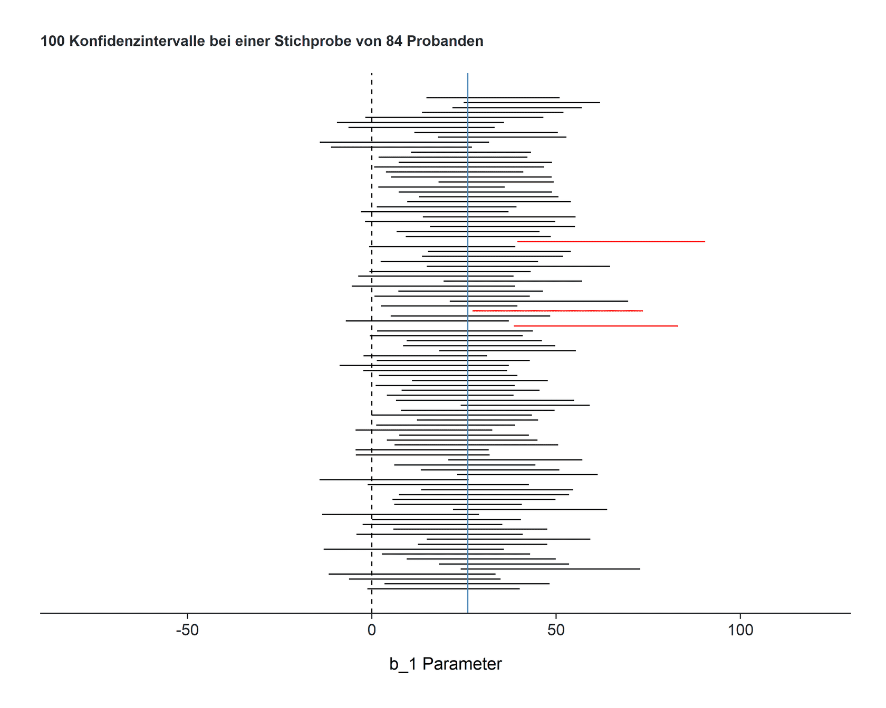

Folgendes erkennen wir aus der Simulation. In drei Fällen liegt der wahre Populationsparameter außerhalb des Konfidenzintervalls. Würden wir unendlich viele Studien erhalten, würde dies in 5% der Fälle passieren. In unserer Simulation tritt dies in 3% der Fälle auf. Wir sehen zudem, dass wir in 25 von 100 Fällen einen Beta-Fehler begehen, da das Konfidenzintervall den Wert 0 umschließt. Auf Grundlage dieser Simulation müssten wir daher davon ausgehen, dass unsere Studie mit 84 Probanden eine Power von etwa 75% hat. 

Variieren wir als nächstes die Stichprobengröße, um zu sehen, wie sich die Konfidenzintervalle mit einer unterschiedlichen Stichprobengröße verändern. Und simulieren wir eine Stichprobe von 30, 100, 200 und 300 Probanden:

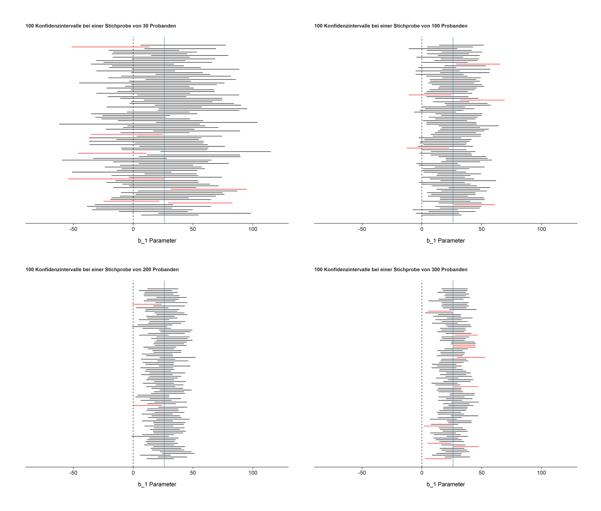

Je größer die Stichprobe wird, desto schmaller wird das Konfidenzintervall. Das heißt, mit steigender Stichprobengröße können wir den wahren Populationsparameter genauer erahnen. Zudem sehen wir, dass wir mit steigender Stichprobengröße weniger Beta-Fehler machen, sprich eine größere Power erhalten. Das sehen wir, da die Konfidenzintervalle mit steigender Stichprobengröße immer seltener den Wert 0 (keine Korrelation der beiden Variablen) schneiden. Bei einer Stichprobengröße von 300 und einem wahren Korrelationskoeffizient von *r* = 0.27 hätten wir damit fast eine Power von 100%. Ebenso sehen wir, dass bei einem 95%-igen Konfidenzintervall der wahre Populationsparameter in der Tat in etwa 95% der Fälle innerhalb des Intervalls liegt. Insgesamt haben wir 400 Konfidenzintervalle in dieser Simulation berechnet. In 24 der Fälle liegt der Populationsparameter außerhalb des Konfidenzintervalls. Das entspricht 6% der Fälle und kommt der 5%-Marke sehr nahe.

### **Berechnung des Konfidenzintervalls bei der einfachen linearen Regression**

Berechnet wird das Konfidenzintervall bei einer einfachen linearen Regression durch folgende Formel:

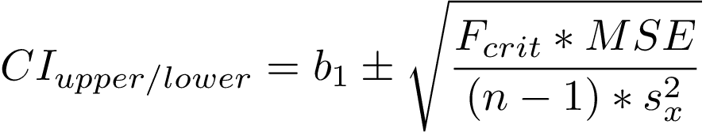

Wir erhalten durch die Formel das untere und obere Ende des Konfidenzintervalls (upper/lower). Zum Verständnis der Formel, hilft es, die einzelnen Komponenten zu klären:

-   *b*~1~: Der Steigungskoeffizient der unabhängigen Variable *x*~1~

-   *F~crit~*: Der kritische *F*-Wert, welcher zu einem signifikanten Ergebnis führt. Diesen kann man mit der Funktion qf in R berechnen: qf(0.95, df1 = 1, df2 = 84) = 3.95

-   *MSE*: Die Fehler des erweiterten Modells, die die weiteren Parameter des erweiterten Modells durchschnittlich aufklären

-   *n*: Die Anzahl der Untersuchungsobjekte

-   *s*~x~^2^: Die Varianz der unabhängigen Variable *X*

Setzen wir diese Werte in die Formel ein, erhalten wir folgende Konfidenzintervalle:

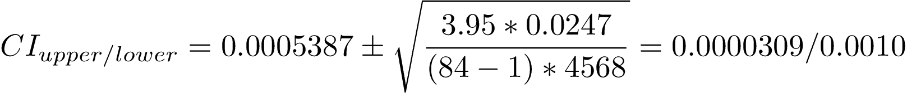

Wir haben daher eine starke Annahme, dass der wahre Populationsparameter *ß~1~* zwischen den Werten 0.0000309 und 0.0010 liegt. Da das Konfidenzintervall den Wert 0 nicht schneidet, wissen wir zudem, dass das Ergebnis unseres Tests signifikant ist.

Da *b~1~* nichts anderes ist als der Steigungskoeffizient der einfachen linearen Regression, können wir das Konfidenzintervall ebenso grafisch darstellen. Im folgenden ist in grau das obere und untere Konfidenzintervall dargestellt.

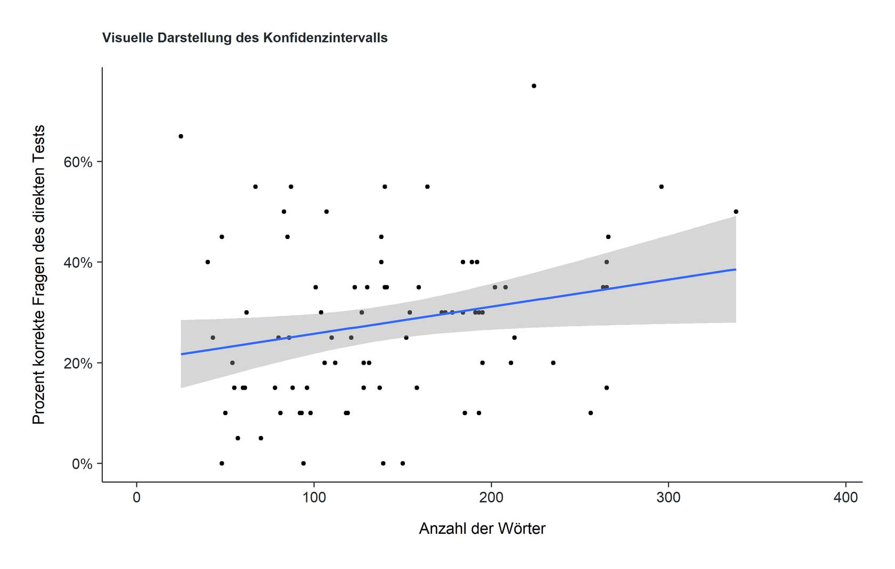

Die Visualisierung zeigt uns damit, in welchem Bereich sich der Zusammenhang in der Population vermutlich befinden wird.

### **Standardisiertes Konfidenzintervall**

Wie aber können wir diese Werte interpretieren? Die haben keinen Bezug zu Werten, die wir kennen. Um daher das Konfidenzintervall besser zu verstehen, können wir die abhängige und unabhängige Variable z-standardisieren.

Indem wir die beiden Variablen standardisieren, erhalten wir folgendes erweitertes Modell. Der Koeffizient *b~1~* ist hierdurch der Korrelationskoeffizient der beiden Variablen.

Ein Konfidenzintervall von *b~1~* hilft uns daher zu sagen, was der wahre Korrelationskoeffizient in der Population ist. Berechnen wir erneut einen *F*-Test mit den standardisierten Daten, erhalten wir folgenden Korrelationskoeffizienten:

Die Korrelation der beiden Variablen bewegt sich daher vermutlich zwischen *r* = 0.013 und *r* = 0.441. Die Spannweite des Konfidenzintervalls ist noch relativ weit. Würden wir allerdings deutlich mehr Probanden erheben, würde sich die Breite des Konfidenzintervalls schmälern und wir könnten eine besser Aussage über *ß~1~* treffen.

### Zusammenfassung

In diesem Submodul haben wir zum ersten Mal Konfidenzintervalle kennengelernt. Wir haben gelernt, dass Konfidenzintervalle Aussagen über den wahren Populationsparameter machen können. Bei einem 95%-igen Konfidenzintervall liegt in 95% der Fälle der wahre Populationsparameter innerhalb des Intervalls. Ebenso haben wir gesehen, dass Konfidenzintervalle genutzt werden können, um Hypothesen zu testen. Liegt wie in unserem Fall der Wert 0 innerhalb des Intervalls, handelt es sich um ein nicht-signifikantes Ereignis. Konfidenzintervalle liefern daher die gleichen Informationen wie der *F*-Test. Dann haben wir gesehen, wie ein Konfidenzintervall bei einer einfachen linearen Regression berechnet werden kann. Wir haben ebenso gesehen, dass wir durch die Standardisierung der Variablen heraus finden können, in welchem Bereich die wahre Korrelation der beiden Variablen vermutlich liegt.

## Berechnung in Jamovi

Zum Ende des Moduls zeige ich dir, wie die einfache lineare Regression in Jamovi berechnet wird. Du wirst gleich sehen, dass alle Ergebnisse in Jamovi identisch mit den Werten sind, die wir in diesem Modul berechnet haben. Falls du den Datensatz nochmal brauchst, du findest ihn hier:

TODO: Einfügen Datei morehead_experiment1.csv

TODO: Einfügen Video

## Weitere Ressourcen

-   <https://www.r-bloggers.com/2020/12/robust-regression/>
