# Multiple lineare Regression

## Einführung 

Im letzten Modul haben wir herausgefunden, dass sich Studierende besser an die Inhalte eines Vortrags erinnern können, je mehr sie während des Vortrags mitschreiben. Wir haben allerdings auch heraus gefunden, dass der Effekt klein ist, da er nur 5% der Varianz in der Erinnerungsfähigkeit aufklären konnte. Nun möchten wir zwei Zusammenhangsypothesen testen. Du hast beobachtet, dass viele deiner Kommilitonen eine wortwörtliche Mitschrift des Vortrags anfertigen. Sie kopieren sozusagen die Worte der Professorin exakt so ab wie die Professorin spricht. Du hast allerdings gehört, dass Organisations- und Elaborationsstrategien hilfreich sind, um sich viel aus einer Vorlesung zu merken. Indem man zum Beispiel das neue Wissen mit dem bestehenden Wissen verbinden (Elaboration) oder die Konzepte für sich strukturiert (Organisation). Du glaubst daher, dass die wörtliche Überlappung der Mitschrift einen negativen Einfluss auf die Erinnerungsfähigkeit aus der Vorlesung haben sollte. Oder in anderen Worten, je mehr Überlappung es gibt, desto schlechter sollten Studierende bei einem späteren Test abschneiden. Nun könntest du erneut eine einfache lineare Regression mit der Überlappung als Prädiktor testen. Besser wäre es jedoch beide Fragestellungen gleichzeitig in einem Modell zu kodieren und zu testen. Und dies sind die Fragestellungen, die wir in diesem Modul testen werden:

> **Lernen Studierende mehr aus einem Vortrag je mehr Worte sie während dem Vortrag aufschreiben *und* je weniger sie den Wortlaut der vortragenden Person in ihrer Mitschrift übernehmen?**

Die Lösung, um diese beiden Fragestellungen statistisch zu modellieren, ist die **multiple lineare Regression**. Die multiple lineare Regression ist sehr ähnlich zur einfachen linearen Regression, allerdings mit ein paar zentralen Besonderheiten. Wir werden beispielsweise sehen, dass die Koeffizienten bei einer multiplen linearen Regression eine andere Bedeutung haben. Ebenso werden wir sehen, dass wir bei einer multiplen linearen Regression mehrere *F*-Tests berechnen müssen. Bei der einfachen linearen Regression mussten wir nur einen *F*-Test berechnen. 

Erneut verwenden wir in diesem Modul die Studie von [Morehead, Dunlosky und Rawson (2014)](https://link.springer.com/article/10.1007/s10648-019-09468-2) aus dem letzten Modul. Diesmal interessieren uns drei Variablen des Datensatzes:

-   **wordcount**: Die Anzahl der Wörter der Mitschrift der Studierenden.

-   **overlap**: Anteil wörtliche Überlappung zwischen Notizen und dem Vortrag

-   **test1tot**: Prozentueller Anteil der korrekten Fragen des Tests direkt nach dem Aufschreiben der Notizen.

Den Datensatz findest du hier:

TODO: Einfügen Datei morehead_experiment1.csv

Die Erklärung der Variablen findest du hier:

TODO: Einfügen Doc variablen.dox

## Statistisches Modell der multiplen Regression 

Im letzten Modul haben wir das Modell der einfachen linearen Regression kennen gelernt. Der Parameter *ß~1~* des Modells kodierte die Korrelation der abhängigen und unabhängigen Variable. Zudem hatte das Modell einen metrischen Prädiktor *X~1.~*

Durch dieses Modell können wir prüfen, ob zwei Variablen miteinander korrelieren. Zum Beispiel hat die Lernzeit von Schülerinnen und Schülern einen Einfluss auf deren Schulnote? Haben intelligente Eltern intelligente Kinder? Sind Studierende, die mehr schlafen, weniger gestresst? 

Oder: Lernen Studierende weniger aus einem Vortrag, je mehr sie wörtlich aus dem Vortrag mitschreiben? Beziehungsweise, lernen Studierende mehr aus einem Vortrag, je mehr sie während des Vortrags mitschreiben? Um diese beiden Fragestellungen zu beantworten, könnten wir zwei einfache Regressionsmodelle berechnen. Die multiple lineare Regression erlaubt uns allerdings beide Fragestellungen gleichzeitig zu testen, indem wir *mehrere* metrische Prädiktoren in das Modell einfügen. Im Prinzip könnten wir unendlich viele Prädiktoren in das Modell einpflegen. Im nächsten Bild siehst du allgemeine Formel der multiplen linearen Regression:

*Y~i~* steht erneut für die abhängige Variable und *ϵ~i~* steht für die Fehler, welche unser Modell nicht erklären kann. *X~i~* steht für die Werte unserer metrischen abhängigen Variablen, beispielsweise Anzahl der Wörter in der Mitschrift. *β~i~* steht für die partiellen Regressionskoeffizienten. Wir werden später ausführlich darüber reden, weshalb diese Koeffizienten partiell heißen. Für jetzt genügt es zu wissen, dass diese partiellen Regressionskoeffizienten von den anderen Prädiktoren abhängig sind und sich abhängig davon ändern, welche und wie viele andere Parameter im Modell sind. 

Nun möchten wir zwei Zusammenhänge testen: Steht die wörtliche Überlappung und die Anzahl der Wörter in einem Zusammenhang mit der Erinnerungsfähigkeit aus dem Vortrag? Um diese Fragestellungen zu testen, benötigen wir eine multiple lineare Regression mit zwei Prädiktoren.

*X1* steht für die Variable *wordcount* und gibt die Anzahl der Wörter in der Mitschrift an. *X2* steht für die Variable *overlap* und gibt die wörtliche Überlappung der Mitschrift mit dem Vortrag an.

Im Unterschied zur einfachen lineraen Regression können wir uns dieses Modell nicht mehr als Linie vorstellen. Bei zwei Prädiktoren kann man das Modell hingegen als eine Fläche darstellen. Bei mehr als zwei Prädiktoren lässt sich die multiple lineare Regression nicht mehr grafisch darstellen.

### Berechnung des Modells 

Für die Berechnung der Regressionskoeffizienten gilt erneut, dass wir das Modell mit den Parametern suchen, welches die quadrierten Fehler maximal reduziert:

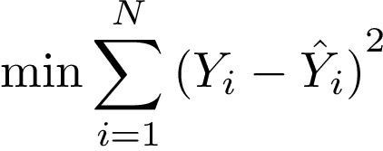

Ich werde an dieser Stelle nicht erklären, wie diese Koeffizienten berechnet werden, da wir hierfür Verfahren der linearen Algebra verwenden müssten (wenn es dich interessiert, wie es funktioniert, schaue [hier](https://medium.com/@andrew.chamberlain/the-linear-algebra-view-of-least-squares-regression-f67044b7f39b)). Eines sollten wir an dieser Stelle nochmal klären: Egal, welches statistische Modell wir in diesem Kurs formulieren werden, *Y*-Dach steht in der Formel immer für dieses Modell. Wir könnten die Logik der Ordinal-Least-Squares Methode daher ebenso wie folgt für unser Zwei-Prädiktor-Modell formulieren:

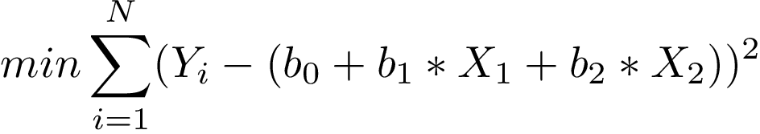

In anderen Worten fragen wir uns erneut, welche unterschiedlichen Vorhersagen macht unser Modell im Vergleich zu den tatsächlichen Daten der abhängigen Variable. Das Modell, welches auf Grundlage der zwei Prädiktoren die besten Vorhersagen macht, ist folgendes:

Du kannst du Parameter des Modells sehr schnell berechnen, indem du folgendem Code in R folgst:

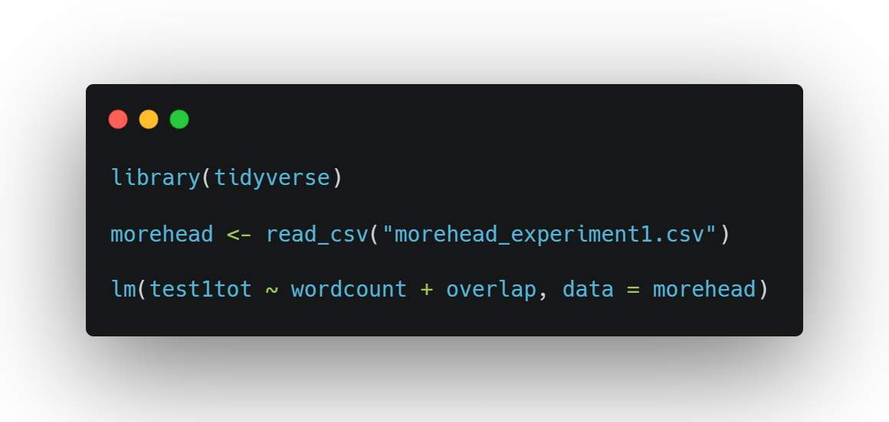

Wir haben nun etabliert, was die multiple Regression von der einfachen linearen Regression unterscheidet. Als nächstes werden wir heraus finden, wie wir die Koeffzienten dieses Modells interpretieren können.

## Partielle Regressionskoeffizienten 

### ***b~1~*** **der einfachen Regression ist nicht *b~1~* der multiplen Regression mit dem gleichen Prädiktor**

Würden wir der Logik der einfachen linearen Regression aus dem letzten Modul folgen, müssten wir die Parameter in unserem Modell der multiplen linearen Regression in etwa wie folgt interpretieren: Durch jedes weitere Wort in der Mitschrift steigt die Punktzahl in dem Test um 0.00061 Prozenpunkte. Und, durch jedes Prozent weitere Überlappung der Mitschrift mit dem Vortrag steigt die Erinnerungsleistung aus dem Vortrag um 0.061134%.

Diese Interpretation der Parameter ist allerdings **falsch**. Der Grund hierfür ist, dass die Parameter oder Koeffizienten bei der multiplen linearen Regression *partiell* sind. Nun was heißt das? Stell dir vor, du möchtest den Parameter der Variable *wordcount* interpretieren*.* Bei einer einfachen linearen Regression erhältst du für den Parameter *b~1~* den Wert 0.0005387:

Wie du siehst, bekommst du bei der einfachen linearen Regression den Parameter 0.0005387 und bei der multiplen linearen Regression den Parameter 0.00061. Offensichtlich sind beide Parameter unterschiedlich. Die Interpretation, dass die Punktzahl bei jedem weiteren Wort um 0.00053% steigt, gilt daher nicht mehr für die multiple lineare Regression.

### Bedeutung **von *b~1~*** und ***b~2~*** bei der multiplen linearen Regression

Was bedeutet dann allerdings *b~1~* in der multiplen linearen Regression? Wir müssen die Regressionskoeffizienten bei der multiplen linearen Regression immer in Abhängigkeit der anderen Prädiktoren interpretieren. Für *b~1~* gilt folgende Aussage:

> Für jedes ***Wort***, welches eine Studentin **in Anbetracht der Überlappung ihrer Mitschrift** mehr schreibt, erwarten wir, dass diese Studentin **0.00061 Prozentpunkte** besser im Test abschneidet **als man für die Überlappung ihrer Mitschrift erwarten würde**.

Stellen wir uns zum besseren Verständnis eine Studentin mit dem Namen Simone vor. Simone hat 40 Worte aufgeschrieben und 18% ihrer Mitschrift ist identisch mit dem Vortrag. In der folgenden Visualisierung siehst du den Regressionskoeffizienten *b~1~* der multiplen linearen Regression als einfache lineare Regression dargestellt. Die Visualisierung sagt folgendes: Simone schreibt in etwa 37 Worte weniger auf *als man für die Überlappung in ihrem Text erwarten würde*. Ebenso schneidet Simone in etwa um 8%-Punkte besser ab *als man für die Überlappung in ihrem Text erwarten würde*. Achte darauf, dass sowohl die unabhängige Variable (Anzahl der Worte) als auch die abhängige Variable (Prozentzahl im Test) in Abhängigkeit des anderen Prädiktors definiert wird.

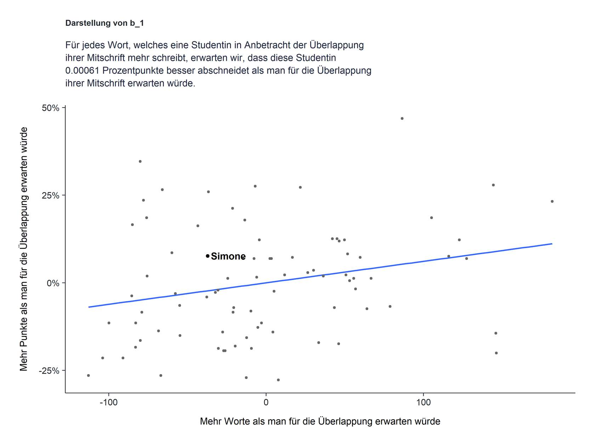

Der Regressionskoeffizient *b~1~* der multiplen linearen Regression ist demnach nichts anderes als der Steigungskoeffizient einer linearen Regression welche das Verhältnis zwischen der Anzahl der Worte in der Mitschrift und der Punktzahl im Test in Abhängigkeit davon angibt, was man in Anbetracht der Überlappung der Mitschrift erwarten würde. 

Ebenso müssen wir *b~2~* in Abhängigkeit der anderen Variable definieren. Diese würden wir wie folgt definieren: Für jedes Prozent Überlappung, welches eine Studentin in Anbetracht der Worte ihrer Mitschrift mehr hat, erwarten wir, dass diese Studentin 0.061134 Prozentpunkte besser abschneidet als man für die Anzahl der Wörter in der Mitschrift erwarten würde.

### Zusammenfassung 

Wir haben in diesem Submodul gezeigt, dass der Regressionskoeffizient einer einfachen linearen Regression bei dem gleichen Prädiktor nicht mit dem Regressionskoeffizient einer multiplen linearen Regression gleichzusetzen ist. Dies liegt darin, dass Prädiktoren in der Regel miteinander korrelieren und daher einen Teil der Varianz in der abhängigen Variable gemeinsam aufklären. Was wir in der multiplen linearen Regression erhalten sind partielle Regressionskoeffizienten. Das bedeutet, die Regressionskoeffizienten in der multiplen linearen Regression werden immer in Abhängigkeit des anderen Prädiktors definiert. Im statistischen Sprachgebrauch würden wir auch sagen, wir *kontrollieren für einen anderen Prädiktor*. Das heißt, wir fragen uns, welchen Einfluss ein Prädiktor auf die abhängige Variable hat, wenn der andere Prädiktor gleich gehalten wird. Für die Interpretation der statistischen Tests macht diese veränderte Definition der Koeffizienten keinen Unterschied. Indem wir die Prädiktoren bei der Nullhypothese auf Null setzen, können wir immer noch den Zusammenhang zweier Variablen testen.

## Statistisches Hypothesentesten

Nun, da wir wissen, wie das statistische Modell der multiplen linearen Regression aussieht, können wir Hypothesen mit Hilfe dieses Modells testen. **Genauer werden wir in diesem Submodul drei Hypothesen testen**. Zunächst werden wir testen, ob beide Prädiktoren des Modells die Fehler des kompakten Modells besser aufklären als man erwarten würde, wenn weitere Prädiktoren keinen substantiellen Beitrag zur Fehlerreduktion des kompakten Modells leisten. Ebenso werden wir sehen, dass wir die Effektgröße *R^2^* bei einem Test, welcher mehr als einen Prädiktor mehr hat als das kompakte Modelle, anpassen müssen. Der allgemeine F-Test gibt uns allerdings keine Antwort auf unsere eigentliche Frage: Gibt es einen Zusammenhang der beiden Variablen mit dem Erinnerungsvermögen aus dem Vortrag? Daher werden wir zwei weitere Tests rechnen, bei denen wir jeweils einen Prädiktor des erweiterten Modells auf 0 schalten. Indem wir nur einen Prädiktor auf 0 schalten und da die Parameter den Zusammenhang der beiden Variablen kodieren, können wir mit diesen Tests prüfen, ob die Anzahl der Worte bzw. die wörtliche Überlappung in der Mitschrift mit der Erinnerungsleistung im Test im Zusammenhang steht. Wir werden ebenso sehen, dass wir für diese beiden Tests einen *t*-Test rechnen können, da in beiden Tests das erweiterte Modell genau einen Parameter mehr hat als das kompakte Modell (das ist eine Grundbedingung für den *t*-Test).

### **Allgemeiner *F*-Test für beide Prädiktoren**

Beginnen wir mit einem Test, welcher die folgenden beiden Modelle miteinander testet. Wir bezeichnen diesen Test als allgemeinen *F*-Test, da dieser Test prüft, ob die weiteren *beiden* Parameter des erweiterten Modells die Fehler des kompakten Modells substantiell reduzieren. Wir werden durch diesen Test allerdings nicht den Einfluss einzelner Parameter auf die abhängige Variable testen können.

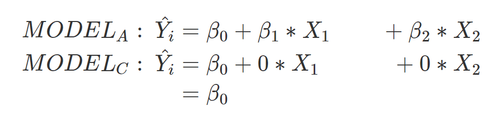

Wie du siehst, umfasst das erweiterte Modell (Model A) zwei Prädiktoren und drei Parameter. Das kompakte Modell umfasst keinen Prädiktor und einen Parameter. Das kompakte Modell repräsentiert daher die Nullhypothese, bei der beide Parameter auf 0 gesetzt sind. Durch dieses Modellpaar können wir testen, ob die Annahme, dass beide Parameter nicht im Zusammenhang zu der abhängigen Variable stehen, inkorrekt ist.

Hypothesen, die auf diesem Modellpaar beruhen, sind allerdings nicht sonderlich aussagekräftig. Zunächst kann es sein, dass nur einer der beiden Prädiktoren signifikant ist und der zweite Prädiktor die abhängige Variable kaum aufklärt. Zweitens ist das Ergebnis nicht eindeutig. Wir erfahren aus den Ergebnissen nicht, ob der eine oder der andere oder beide Prädiktoren einen signifkanten Effekt auf die abhängige Variable hat. Dieses Problem wird umso größer, je mehr Prädiktoren im erweiterten Modell sind. Kurzum, der allgemeine *F*-Test kann zwar mit Jamovi und anderen Softwares berechnet werden, er gibt uns allerdings nicht die Informationen, die wir erfahren möchten. 

Rechnen wir diesen Test, erhalten wir folgendes Ergebnis:

+--------------------------------------------------+----------+----------+----------+---------+---------+-------------------+
| **Source**                                       | ***SS*** | ***df*** | ***MS*** | ***F*** | ***p*** | ***PRE / R^2^***\ |
+==================================================+==========+==========+==========+=========+=========+===================+
| Reduktion der Fehler durch das erweiterte Modell | 0.145    | 2        | 0.0726   | 2.95    | 0.058   | 0.068\            |
+--------------------------------------------------+----------+----------+----------+---------+---------+-------------------+
| Error\                                           | 1.99     | 81\      | 0.0245   | \-      | \-      | \-                |
+--------------------------------------------------+----------+----------+----------+---------+---------+-------------------+
| Total Error                                      | 2.136    | \-       | \-       | \-      | \-      | \-                |
+--------------------------------------------------+----------+----------+----------+---------+---------+-------------------+

Wir erhalten ein nicht-signifikantes Ergebnis. Wir behalten demnach die Annahme, dass der Zusammenhang aller Prädiktoren mit der abhängigen Variable gleich ist.

### **Angepasstes  *R^2^ (adjusted R^2^)***

Sobald wir mehrere Prädiktoren in eine multiple Regression hinzu nehmen, sollten wir vorsichtig sein, *R^2^* zu interpretieren. Denn, mit jedem Parameter, den wir in die multiple Regression hinzufügen, verbessert sich *R^2^* automatisch. Ein trickreiche Forscherin könnte daher künstlich ein hohes *R^2^* schaffen, indem sie viele Parameter in das Modell hinzufügt. Um diesem Trick zu entgehen, müssen wir einen Weg finden, ein *R^2^* zu finden, welches unabhängig der Anzahl der weiteren Parameter des erweiterten Modells ist. Folgende Formel ermöglicht diese Anpassung:

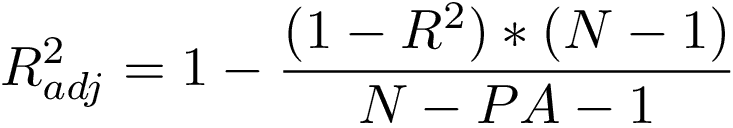\

\
Berechnen wir das angepasste *R^2^* erhalten wir einen Wert von 4.5%.

Das angepasste *R^2^* ist daher kleiner als *R^2^.* Es ist allerdings dem herkömmlichen *R^2^* vorzuziehen, da es für die Anzahl der weiteren Parameter kontrolliert. Wenn du zukünftig daher eine multiple lineare Regression aufstellst, ist es wichtig das angepasste *R^2^* zu verwenden.

### Der Zusammenhang zwischen der Anzahl der Worte und der Erinnerungsleistung aus dem Vortrag 

Unsere eigentliche Frage allerdings der Zusammenhang der beiden Variablen mit der Erinnerungsleistung aus dem Vortrag. Beginnen wir mit dem Zusammenhang zwischen der Anzahl der Worte und der Erinnerungsleistung. Wir wissen, dass der Parameter *b~1~* für den Zusammenhang zwischen der Variable *wordcount* und der Erinnerungsleistung aus dem Vortrag steht. Indem wir nur diesen Parameter im kompakten Modell auf Null setzen, können wir den Zusammenhang der beiden Variablen testen. Wir werden immer wieder in diesem Kurs so vorgehen: Parameter kodieren unsere Fragestellungen an den Datensatz. Bei der einfachen und multiplen Regression kodieren die Parameter den Zusammenhang zweier Variablen. Die Nullhypothese nimmt an, dass dieser Zusammenhang 0 beträgt, daher setzen wir den Parameter im kompakten Modell auf 0. Tun wir dies, erhalten wir folgendes Modellpaar:

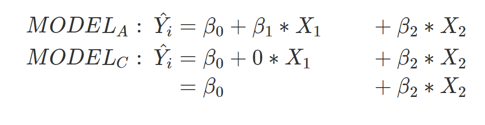

Mit diesen Modellen können wir als nächstes die Kennwerte berechnen, um heraus zu finden, ob wir die Nullhypothese ablehnen oder nicht. In folgender R-Datei habe ich dir die einzelnen Schritte zur Berechnung der Werte aufgeschrieben. Du musst nicht alle Befehle dieser Datei kennen, aber ich lade dich ein, die Berechnung von F einmal selbst durchzuführen und die Schritte nachzuvollziehen:

TODO: Einfügen test_wordcount.R

TODO: Einfügen Video

Zusammengefasst lauten die Ergebnisse des Tests folgendermaßen:

+--------------------------------------------------+----------+----------+----------+---------+---------+-------------------+
| **Source**                                       | ***SS*** | ***df*** | ***MS*** | ***F*** | ***p*** | ***PRE / R^2^***\ |
+==================================================+==========+==========+==========+=========+=========+===================+
| Reduktion der Fehler durch das erweiterte Modell | 0.1346   | 1        | 0.13     | 5.48    | 0.022   | 0.063\            |
+--------------------------------------------------+----------+----------+----------+---------+---------+-------------------+
| Error\                                           | 1.99     | 81\      | 0.0245   | \-      | \-      | \-                |
+--------------------------------------------------+----------+----------+----------+---------+---------+-------------------+
| Total Error                                      | 2.125    | \-       | \-       | \-      | \-      | \-                |
+--------------------------------------------------+----------+----------+----------+---------+---------+-------------------+

Aufgrund des signifikanten Ergebnisses gehen wir nun davon aus, dass die Annahme, dass die beiden Variablen nicht miteinander korrelieren, falsch ist. Wir entscheiden uns daher gegen die Nullhypothese.

### t-Test als Alternative 

Wie immer können wir bei einem erweiterten Modell, welches einen Parameter mehr hat als das kompakte Modell einen *t*-Test berechnen. *t* ist die Wurzel aus *F*, daher beträgt *t* 2.34. Der p-Wert ändert sich durch diese Umstellung nicht, da wir eine ungerichtete Hypothese haben; es gibt einen Zusammenhang, wir sagen nicht, in welche Richtung der Zusammenhang liegt. Wir können daher das Ergebnis berichten:

> "Um zu testen, ob die Anzahl der Worte in der Mitschrift mit der Erinnerungsleistung des Vortrags im Zusammenhang steht, wurde eine multiple lineare Regression mit der Anzahl der Worte als unabhängige und dem Erinnerungsleistungstest als abhängige Variable gerechnet. Wir fanden einen signifikanten Zusammenhang, *t*(81) = 2.34, *p* = .022, *R^2^ **=*** 0.63."

### Der Zusammenhang zwischen der Anzahl der Worte und der Erinnerungsleistung aus dem Vortrag 

Als nächstes möchten wir heraus finden, ob die wörtliche Überlapppung in den Texten in einem negativen Zusammenhang mit der Erinnerungsleistung im Test steht. Wir sind davon ausgegangen, dass Lernende durch das wörtliche Abschreiben des Vortrags wenige Elaborations- und Organisationsstrategien verwenden und daher weniger von der Mitschrift profitieren sollten als Lernende, die wenig wörtlich mitschreiben.

Um diese Hypothese zu testen, setzen wir im kompakten Modell den Parameter *β~2~* auf 0:

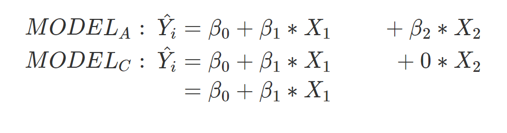

Ist *ß~2~* wirklich 0, sprich gibt es keine Zusammenhang der beiden Variablen, sollten wir in nur 5% der Fälle ein signifikantes Ergebnis bei diesem Test erhalten. Folgende Ergebnisse erhalten wir durch diesen Test:

+--------------------------------------------------+----------+----------+----------+---------+---------+-------------------+
| **Source**                                       | ***SS*** | ***df*** | ***MS*** | ***F*** | ***p*** | ***PRE / R^2^***\ |
+==================================================+==========+==========+==========+=========+=========+===================+
| Reduktion der Fehler durch das erweiterte Modell | 0.035    | 1        | 0.035    | 1.43    | 0.2348  | 0.017\            |
+--------------------------------------------------+----------+----------+----------+---------+---------+-------------------+
| Error\                                           | 1.99     | 81\      | 0.0245   | \-      | \-      | \-                |
+--------------------------------------------------+----------+----------+----------+---------+---------+-------------------+
| Total Error                                      | 2.026    | \-       | \-       | \-      | \-      | \-                |
+--------------------------------------------------+----------+----------+----------+---------+---------+-------------------+

Das Ergebnis zeigt uns, dass unsere Annahme inkorrekt ist. Der *p*-Wert ist nicht signifikant und liegt bei 23.48%. Dieses Ergebnis ist unter Annahme der Nullhypothese durchaus vorstellbar.

Aber: Der *F*-Test testet immer ungerichtet, unsere Hypothese ist allerdings gerichet. Wir sind davon ausgegangen, dass die Erinnerungsleistung sinkt, je mehr ich aus dem Vortrag wörtlich abschreibe. Wir erwarten daher eine gerichtete negative Korrelation. Das heißt, wir müssen den *p*-Wert entsprechend anpassen. Um zu verstehen wie, müssen wir zunächst den empirischen *t*-Wert ermitteln. Dieser beträgt 1.19 und ist die Wurzel aus dem *F*-Wert. Der *t*-Wert liegt rechts des Gipfels der *t*-Verteilung:

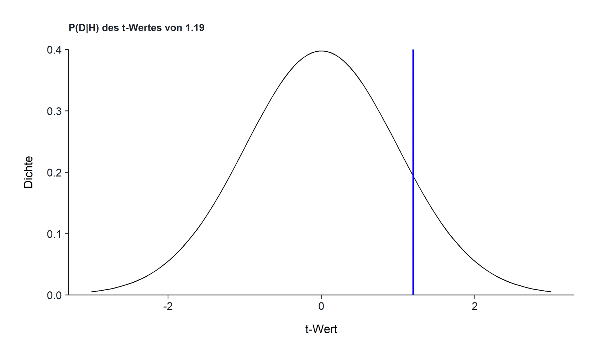

Testen wir ungerichtet, messen wir die Fläche links des negativen Wertes und rechts des positiven Wertes berechnen:

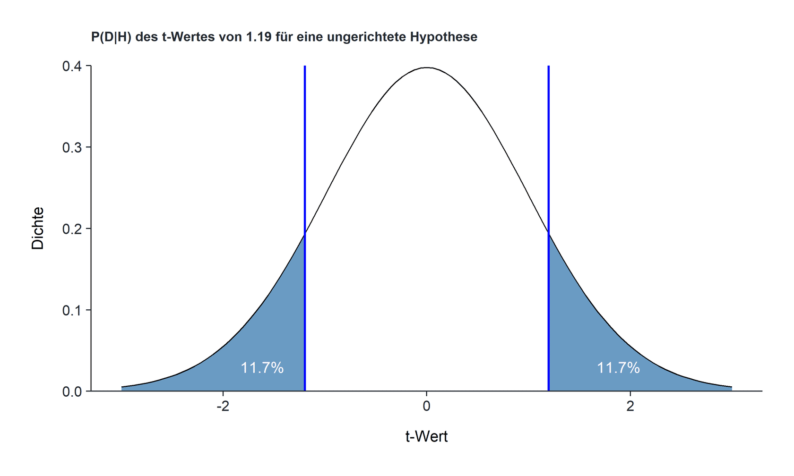

Wenn du beide Wahrscheinlichkeiten zusammen rechnest, erhältst du den *p*-Wert, welchen wir beim *F*-Test erhalten haben: *p* = .234 oder 23.4% (11.7% \* 2). Im Bilde des *t*-Tests haben wir daher eine ungerichtete Hypothese getestet. Allerdings sind wird davon ausgegangen, dass der Korrelationskoeffizient *negativ* ist (je mehr Überlappung, desto geringer die Erinnerungsleistung). Wir müssen daher die Wahrscheinlichkeit links des empirischen *t*-Wertes abtragen:

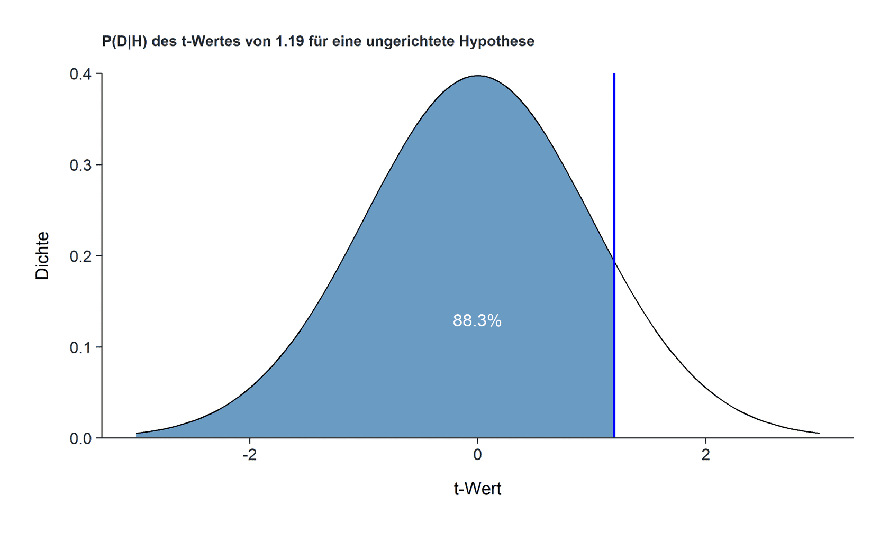

Wir sind davon ausgegangen, dass der Korrelationskoeffizient kleiner als 0 ist, daher müssen wir die Fläche links des empirischen *t*-Wertes abtragen. Und diese Wahrscheinlichkeit beträgt 88.3%. Jamovi und andere statistische Softwares haben nicht immer eine Funktion Korrelationen gerichtet zu testen. Du erkennst daher an diesem Beispiel, dass wir in der Auswertung statistischer Ergebnisse nicht blind den Ergebnissen der Tests folgen sollten, sondern unsere Ergebnisse immer mit unseren Hypothesen abgleichen müssen.

### Konfidenzintervalle 

Unsere beiden Tests konnten uns zeigen, ob wir uns auf Grundlage der Daten für die Null- oder Alternativhypothese entscheiden sollen. In anderen Worten, der *F*-Test oder der *t*-Test zeigt uns, wie wir handeln sollen. Die Ergebnisse der Tests deuten darauf hin, dass wir annehmen sollten, dass die Anzahl der Worte der Mitschrift in einem Zusammenhang mit der Erinnerungsleistung aus dem Vortrag steht und dass die wörtliche Überlappung in der Mitschrift in keinem Zusammenhang mit der Erinnerungsleistung aus dem Vortrag steht.

Eine weitere Frage ist, wie groß der Zusammenhang in der Population ist? Diese Frage können wir ansatzsweise mit Konfidenzintervallen beantworten. Wie bereits im letzten Modul gezeigt, besagt ein Konfidenzintervall, wie oft sich ein Populationsparameter im Schnitt innerhalb eines Intervalls befindet. Je größer die Stichprobe, desto enger wird das Intervall. Bei einem 95%-igen Konfidenzintervall beispielsweise befindet sich im Schnitt der wahre Populationsparameter in 95 von 100 Fällen innerhalb des Intervalls. Ein Konfidenzintervall gibt einen starken Hinweis, wie groß beispielsweise eine Korrelation zwischen zwei Variablen ausfällt. Berechnen wir die Konfidenzintervalle für die beiden Parameter der letzten beiden Tests als nächstes.

### Berechnung des standardisierten Konfidenzintervalls für den Parameter der Anzahl der Worte in der Mitschrift

Beginnen wir mit dem Parameter für die Anzahl der Worte in der Mitschrift. Wir haben vorhin heraus gefunden, dass es einen signifikanten Zusammenhang zwischen der Anzahl der Worte in der Mitschrift und der Erinnerungsleistung aus dem Vortrag gibt. Als nächstes können wir uns fragen, wie groß der Korrelationskoeffizient der beiden Variablen vermutlich ist. Diesen können wir berechnen, indem wir die abhängige Variable und die unabhängigen Variablen z-standardisieren und danach folgende Formel anwenden:

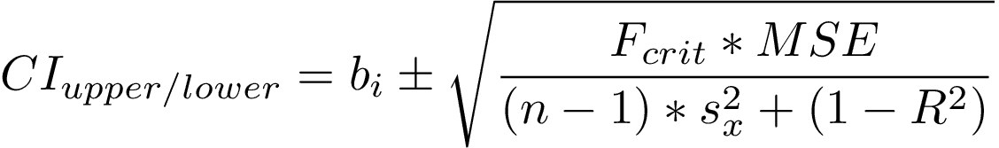

Im nächsten Video siehst du, wie die Konfidenzintervalle in R berechnet werden können. Dieses Beispiel dient dir dazu, die einzelnen Schritte in der Berechnung nachzuvollziehen. Du musst nicht in der Lage sein, selbst eine solche Berechnung in R durchzuführen. Es hilft allerdings hoffentlich deinem Verständnis für die Berechnung des Konfidenzintervalls.

TODO: Einfügen Datei ci_berechnen_multiple_regression.R

TODO: Einfügen Video

Aus dem Konfidenzintervall erkennen wir im Übrigen auch, ob der Test signifikant ist. Sobald das Konfidenzintervall den Wert 0 nicht schneidet, erhalten wir ein signifikantes Ergebnis. Dies ist in unserem Fall gegeben. Noch einmal grafisch können wir den Koeffizienten wie folgt angeben. Achte allerdings darauf, dass wir keine Gewissheit darüber haben, dass der wahre Korrelationskoeffizient innerhalb dieses Intervalls steckt. Es ist nur sehr wahrscheinlich.

Wir könnten das gleiche für den anderen Parameter des Prädiktors machen. Dies überlasse ich allerdings dir. Die Lösung findest du in der nächsten Datei:

TODO: Einfügen Datei ci_overlap.R

### Zusammenfassung 

Wir haben in diesem Submodul drei Fragestellungen der multiplen linearen Regression getestet. Zunächst haben wir einen allgemeinen *F*-Test mit einem Freiheitsgrad von 2 gerechnet und erkannt, dass dieser Test uns keine hilfreichen Informationen zu unseren Hypothesen gibt. Im Anschluss haben wir zwei Tests gerechnet, bei denen wir getestet haben, ob die Anzahl der Worte und die Überlappung in der Mitschrift mit der Erinnerungsleistung aus dem Vortrag korreliert. Wir haben erkannt, dass wir für beide Tests ebenso einen *t*-Test berechnen können, da bei beiden Modellpaaren das erweiterte Modell einen Parameter mehr hat als das kompakte Modell. Ebenso haben wir gezeigt, dass wir bei der Interpretation des *p*-Wertes immer die Hypothese im Hinterkopf behalten müssen, um den p-Wert korrekt zu ermitteln. Am Ende des Submoduls haben wir gezeigt, wie standardisierte Konfidenzintervalle bei der multiplen Regression berechnet werden.

## Berechnung in Jamovi 

In folgendem Video siehst du, wie die multiple Regression in Jamovi und R berechnet werden kann:

TODO: Einfügen Video

Eine weitere Möglichkeit, die multiple Regression in R zu berechnen ist die Funktion [lm](https://www.rdocumentation.org/packages/stats/versions/3.6.2/topics/lm):

TODO: Einfügen Video
