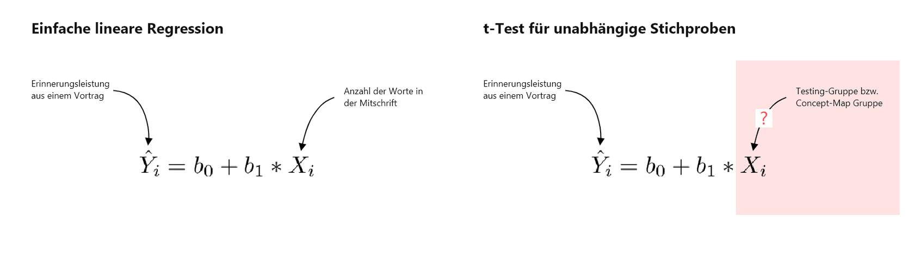
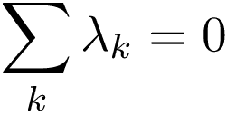
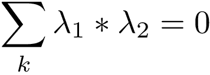

# Einfaktorielle Varianzanalyse

## Einführung

Bisher haben wir drei verschiedene Testverfahren kennen gelernt: Der *t*-Test für eine Stichprobe, die einfache lineare Regression und die multiple lineare Regression. Durch diese drei Testsverfahren können wir bereits eine Fülle an bildungswissenschaftlich relevanten Fragen beantworten. Zum Beispiel:

-   Haben Gymnasiasten einen höheren Intelligenzquotienten als 100?

-   Verringert sich das Stressempfinden von Studierenden, wenn sie mehr meditieren?

-   Gibt es einen Zusammenhang zwischen der Zeit, die Studierende lernen und ihren Noten in Klausuren?

Unser Werkzeugkasten ermöglicht es uns allerdings bisher nicht, Gruppenunterschiede zu testen. Beispielsweise können wir bisher keine Unterschiedshypothesen testen. In diesem Modul werden wir daher folgenden beiden Fragestellungen testen:

> **Lernen Studierende mehr, wenn sie ihr Wissen [testen ](https://dorsch.hogrefe.com/stichwort/testungseffekt)anstatt eine [Concept-Map](https://dorsch.hogrefe.com/stichwort/lernen-mit-concept-maps) zu erstellen?**
>
> **Lernen Studierende, die während eines Vortrags handschriftlich mitschreiben mehr als Studierende, die mit einem Laptop bzw. einem E-Writer mitschreiben?**

Um solche Fragestellungen statistisch zu testen, müssen wir uns überlegen, wie wir diese Gruppenunterschiede durch die Parameter in unseren statistischen Modellen kodieren können. Wir haben beispielsweise gesehen, dass *b~1~* bei der einfachen linearen Regression den Zusammenhang zwischen zwei Variablen kodiert. Wir haben ebenso gesehen, dass wir bei der linearen und multiplen Regression Prädiktoren eingeführt haben (*X~i~*), für welche wir die Werte einer metrischen Variable eingesetzt haben. Um nun Gruppenunterschiede statistisch zu testen, müssen wir zwei Probleme lösen:

1.  Wir müssen einen Weg finden, Mittelwertsunterschiede von Gruppen als Parameter zu kodieren (z.B. *b~1~*).

2.  Wir müssen einen Weg finden, kategoriale Variablen (handschriftliche Mitschrift vs. Mitschrift mit dem Laptop) in eine numerische Form zu bringen, die wir für *X~i~* einfügen können (z.B. handschriftliche Mitschrift = 1, Mitschrift mit dem Laptop = -1). Das heißt, *X~i~* ist im Gegensatz zur linearen und multiplen Regression nicht mehr kontinuierlich, sondern diskret skaliert.

Um diese beiden Probleme zu lösen, werden wir sogenannte Kontrastkodierungen kennen lernen, welche uns ermöglichen, spezifische Gruppenunterschiede zu testen. Zum Beispiel werden wir am Ende des Moduls in der Lage sein, zu testen, ob Studierende, die handschriftlich mitschreiben mehr lernen als Studierende, die mit dem Laptop oder mit einem E-Writer mitschreiben.

Wir werden in diesem Modul zwei verschiedene Tests kennen lernen, die allerdings das gleiche Verfahren anwenden, welches wir bisher kennen gelernt haben. Genauer werden wir den ***t*****-Test für unabhängige Stichproben** und die **einfaktorielle Varianzanalyse** kennen lernen. Für beide Verfahren werden wir *F*-Tests berechnen. Der Unterschied zwischen dem *t*-Test für unabhängige Stichproben und der einfaktoriellen Varianzanalyse liegt darin, dass sie sich darin unterscheiden, wie viel Gruppen man miteinander vergleicht. Beim *t*-Test für unabhängige Stichproben werden zwei Gruppen miteinander verglichen, bei der einfaktoriellen Varianzanalyse mehr als zwei Gruppen. Sobald du allerdings die Kontrastkodierung verstehst, wirst du sehen, dass beide Tests ähnlich statistisch modelliert werden.

### Datensätze dieses Moduls 

Wir werden in diesem Modul zwei verschiedene Datensätze verwenden. Bei beiden Datensätzen handelt es sich um Replikationsstudien bekannter Studien.

### ***t*****-Test für unabhängige Stichproben: Buttrick et al. (2018)**

Zunächst werden wir uns mit der Studie von [Buttrick et al. (2018) ](https://osf.io/2h3g6/)beschäftigen. Buttrick und Kolleg\*innen replizierten eine sehr bekannte Studie von [Karpicke und Blunt (2011)](https://science.sciencemag.org/content/sci/330/6002/335.full.pdf). In dieser Studie wurde unter anderem untersucht, ob das Testen von Wissen, das heißt der freie Abruf von Wissen, für das Erlernen konzeptuellen Wissens lernförderlicher ist als das Erstellen von Concept Maps. Diese Studie war der Beginn einer intensiven Diskussion zur Frage, ob der Testing-Effekt nicht nur für einfaches Lernmaterial wie Wortpaarliste, sondern auch für komplexes Lernmaterial funktioniert (z.B. konzeptuelles Wissen). Beispielsweise kritisierten [van Gog und Sweller (2015)](https://repub.eur.nl/pub/92178/), dass der Testing-Effekt bei komplexem Lernmaterial nicht zu finden ist. [Karpicke und Aue (2015)](https://www.infona.pl/resource/bwmeta1.element.springer-27c4b436-8913-3d02-b003-c3e50ac8e537) verteidigten ihre Position anschließend mit dem Argument, dass die Studien von van Gog und Sweller methodologisch mangelhaft waren. Wir werden in diesem Modul den *t*-Test für unabhängige Stichproben verwenden, um die Ergebnisse von Buttrick et al. zu berechnen und die Frage beantworten, ob das Testen von Wissen zu einer besseren Erinnerungsleistung bei konzeptuellen Wissen ist als die Erstellung von Concept Maps.\

Die Prozedur des Experiments von Buttrick et al. (2018) sah folgendermaßen aus: Die Versuchspersonen wurden in Kleingruppen (1 bis 4 Personen) getestet und lasen einen kurzen Text zum Thema Seeotter. Sie hatten fünf Minuten Zeit, den Text zu studieren. Die Versuchspersonen wurden anschließend willkürlich in zwei Gruppen eingeteilt (Concept Map Gruppe vs. Testing Gruppe). Die Versuchspersonen in der Concept-Map Gruppe hatten anschließend 25 Minuten Zeit mit dem Text eine Concept-Map zu erstellen. Diejenigen Versuchspersonen in der Concept-Map Gruppe hatten 10 Minuten Zeit so viel aus dem Text aufzuschreiben, wie sie sich erinnern konnten. Anschließend bekamen sie 5 Minuten Zeit, den Text erneut zu studieren und erhielten erneut 10 Minuten, sich an die Inhalte des Textes frei zu erinnern. Eine Woche später erhielten die Versuchspersonen einen Follow-Up Test, welcher 14 Faktenfragen und zwei Inferenzfragen zum Thema des Textes beinhaltete. Beide Fragen testeten nach Aussage der Autoren konzeptuelles Wissen.

Den Datenatz der Replikationsstudie von Buttrick et al. (2018) findest du hier:

TODO: Einfügen Datei buttrick.csv

Für diese Studie interessieren uns folgende Variablen:

-   **condition**: Diese Variable kodiert, ob Studierende entweder eine Concept Map erstellt haben (Concept) oder ihr Wissen getestet haben (Retrieval). condition ist die unabhängige Variable.

-   **ts_avg**: Diese Variable kodiert, wie viele richtige Antworten die Versuchspersonen bei den 16 Fragen des Abschlusstests in Prozent korrekt beantwortet haben. ts_avg ist die abhängige Variable.

#### **Einfaktorielle Varianzanalyse: Morehead, Dunlosky und Rawson (2014)**

Für das Verfahren der einfaktoriellen Varianzanalyse werden wir erneut die Replikationsstudie von [Morehead, Dunlosky und Rawson (2014)](https://link.springer.com/article/10.1007/s10648-019-09468-2) verwenden. Zur Erinnerung, in dieser Studie wiederholten Morehead et al. eine Studie, die ursprünglich von [Mueller und Oppenheimer (2014)](https://journals.sagepub.com/doi/full/10.1177/0956797614524581) durchgeführt wurde. In beiden Studien wurde untersucht, ob die Mitschrift eines Vortrags mit verschiedenen Medien einen Einfluss auf die Erinnerungsleistung hat. Wir werden diese Replikationsstudie verwenden, um heraus zu finden, ob die handschriftliche Mitschrift während eines Vortrags lernförderlicher ist als die Mitschrift mit dem Laptop beziehungsweise einem E-Writer.

Die Prodezur der Studie von Morhead et al. (2014) verlief wie folgt: Studierende sahen sich einen von fünf TED-Talks an, welche im Schnitt 17 Minuten dauerten. Versuchspersonen wurden willkürlich in einer der folgenden Gruppen eingeteilt. Entweder wurden die Versuchspersonen gebeten, während des Vortrags die Inhalte des Vortrags per Hand mitzuschreiben. Eine andere Gruppe wurde gebeten, die Inhalte des Vortrags mit dem Laptop mitzuschreiben. Eine dritte Gruppe wurde gebeten, die Inhalte des Vortrags mit einem E-Writer aufzuschreiben. Anschließend erhielten die Versuchspersonen für 30 Minuten eine Aufgabe, die nichts mit dem Experiment zu tun hatte. Anschließend füllten die Versuchspersonen einen Test aus, welcher aus Faktenfragen und konzeptuellen Fragen bestand. Zwei Tage später wurden die gleichen Fragen erneut abgefragt.

Der Datensatz dieses Experiments befindet sich hier:

TODO: Einfügen morehead_experiment1.csv

Für diese Studie interessieren uns folgende Variablen:

-   **method**: Die Versuchsgruppe, in die die Versuchspersonen eingeordnet wurden: eWriter, laptop oder longhand.

-   **test2tot**: Prozentueller Anteil der korrekten Fragen des Tests zwei Tage nach dem Aufschreiben der Notizen.

## Kontrastkodierungen 

In der Einführung dieses Moduls haben wir gesagt, dass wir zwei Probleme lösen müssen. Wir müssen kategorielle Werte, wie beispielsweise ob Studierende ihr Wissen getestet haben oder eine Concept-Map erstellt haben, in numerische Werte überführen. Ebenso müssen wir einen Weg finden, die Parameter in unseren statistischen Modellen als spezifische Hypothesen zu kodieren. Die Lösung dieser beider Probleme sind Kontrastkodierungen.

### **Bei *k* Gruppen braucht man *k* - 1 Prädiktoren**

Für Kontrastkodierungen gilt, dass wir bei einem *t*-Test für unabhängige Stichproben bzw. einer einfaktoriellen Varianzanalyse für *k* Gruppen *k* - 1 Prädiktoren benötigen. Wenn ich beispielsweise testen möchte, ob Probanden, die sich ihr Wissen testen, mehr konzeptuelles Wissen erwerben als Studierende, die Concept-Maps anfertigen, bräuche ich einen Prädiktor (2 -1 = 1) im erweiterten Modell. Würde ich untersuchen, ob Studierende, die bei einem Vortrag handschriftlich mitschreiben, mehr lernen als Studierende, die mit dem Laptop oder einem E-Writer mitschreiben, bräuchte ich zwei Prädiktoren (3 - 1 = 2).

### **Kategoriale Variablen in numerische Werte überführen**

Während wir bei der einfachen linearen Regression für die Prädiktoren *X~i~* die Werte der unabhängigen Variablen einfügen können (siehe Bild links), können wir die Gruppen, welche in der Regel als Text in Variablen gespeichert sind (*Concept* und *Retrieval*) nicht direkt für *X~i~* eintragen (siehe Bild rechts), da diese Gruppen nicht numerisch vorliegen.

Wie wir Gruppen in numerische Werte überführen, entscheidet darüber, welche Hypothesen wir mit den Modellpaaren testen können. Nehmen wir beispielsweise die Frage, ob Studierende, die ihr Wissen testen, mehr konzeptuelles Wissen erwerben als Studierende, die eine Concept-Map anfertigen. Da wir zwei Gruppen haben, müssten wir *einen* Kontrast für den Parameter *X~1~* definieren (2 -1 = 1). Beispielsweise könnten wir der Testing-Gruppe eine 1 und der Concept Map Gruppe eine -1 zuordnen.

| **Gruppe**  | ***X~1~*** |
|-------------|------------|
| Testing     | 1          |
| Concept Map | -1         |

Die Werte dieses Kontrasts würden wir für *X~1~* einfügen. *b~1~* kodiert als Folge den Mittelwertsunterschied beider Gruppen. Indem wir nun *X~1~* im kompakten Modell auf 0 setzen, können wir testen, ob dieser Mittelwertsunterschied 0 beträgt:

In der unteren Tabelle siehst du nun eine Reihe an Kontrasten, die du für verschiedene spezifische Hypothesen verwenden kannst. Wir werden diese Kontraste einzeln durchgehen und an Beispielen zeigen, welche Fragestellungen mit ihnen beantwortet werden können. Das Ziel dieser Ausführungen ist, dass du lernst, wie statistische Modelle mit kategorialen Prädiktoren erstellt werden. In den nächsten Modulen wirst du sehen, wie wir diese Kontraste nutzen, um Hypothesen zu testen.

Die folgenden Kontraste werden alle von Jamovi unterstützt. Die Tabelle enthält sowohl den Namen des Kontrasts, die Hypothese, welche man mit den Kontrasten testen kann und die Bedeutung der Regressionskoeffizienten des erweiterten Modells. Ebenso zeigt die Tabelle an, ob Kontraste orthogonal sind. Wir werden bei den Difference- bzw. Reverse-Helmert Kontrasten erklären, was damit gemeint ist.

| Kontrast                                 | Hypothese                                                                            | Bedeutung *b~0~*                          | Bedeutung *b~i~*                                                                          | orthogonal |
|:-----------------------------------------|:-------------------------------------------------------------------------------------|-------------------------------------------|-------------------------------------------------------------------------------------------|------------|
| Deviation- oder Sum-Kontrast             | Vergleicht den Mittelwert einer Gruppe gegen den Mittelwert aller Gruppen.           | Mittelwert aller Gruppen                  | Die Abweichung des Mittelwerts einer Gruppe vom Mittelwert der Mittelwerte aller Gruppen. | nein       |
| Dummy- oder Simple-Kontrast              | Vergleicht den Mittelwert einer Gruppe durch den Mittelwert einer Referenzgruppe.    | Mittelwert einer Referenzgruppe           | Die Abweichung des Mittelwerts einer Gruppe vom Mittelwert der Referenzgruppe.            | nein       |
| Difference-oder Reverse-Helmert Kontrast | Vergleicht den Mittelwert einer Gruppe mit dem Mittelwert der vorherigen Gruppen.    | Mittelwert des Mittelwerts aller Gruppen. | Die Differenz der Mittelwerte zweier oder mehrerer Gruppen.                               | ja         |
| Helmert-Kontrast                         | Vergleicht den Mittelwert einer Gruppe mit dem Mittelwert der nachfolgenden Gruppen. | Mittelwert des Mittelwerts aller Gruppen. | Die Differenz der Mittelwerte zweier oder mehrerer Gruppen.                               | ja         |

Im Folgenden gehen wir die einzelnen Kontraste einzeln durch, um zu erklären, für welche Hypothesen sie genutzt werden können. Für alle Beispiele werden wir die Studie von Morehead und Kollegen verwenden.

### **Deviation- oder Sum-Kontrast**

Diese Kontraste eignen sich dazu, zu testen, ob sich ein Mittelwert einer Gruppe vom Mittelwert aller Gruppen unterscheidet. Du wirst eine solche Kontrastkodierung selten verwenden, da wir in der Regel daran interessiert sind, spezifische Gruppenunterschiede zu testen.

+-------------------------------+---------------------------------------------------------------------------+---------------------------+-------------------------------------------------------------------------------------------+----------------+
| **Kontrast**                  | **Hypothese**                                                             | **Bedeutung *b~0~*\       | **Bedeutung *b~i~***                                                                      | **orthogonal** |
|                               |                                                                           | **                        |                                                                                           |                |
+:==============================+:==========================================================================+===========================+===========================================================================================+================+
| Deviation- oder Sum-Kontrast\ | Vergleicht den Mittelwert einer Gruppe gegen den Mittelwert aller Gruppen | Mittelwert aller Gruppen\ | Die Abweichung des Mittelwerts einer Gruppe vom Mittelwert der Mittelwerte aller Gruppen. | nein           |
+-------------------------------+---------------------------------------------------------------------------+---------------------------+-------------------------------------------------------------------------------------------+----------------+

Nehmen wir folgendes Beispiel: Du möchtest heraus finden, ob Studierende, die per Hand mitschreiben, sich an mehr oder weniger aus einem Vortrag erinnern als die Studierenden aller Gruppen zusammen. Um diese Hypothese zu testen, könntest du folgende Kontraste aufstellen:

+------------+------------+---------------+
| **Gruppe** | ***X~1~*** | ***X~2~*****\ |
|            |            | **            |
+============+============+===============+
| per Hand\  | -1         | -1            |
+------------+------------+---------------+
| Laptop     | 1          | 0             |
+------------+------------+---------------+
| E-Writer   | 0          | 1             |
+------------+------------+---------------+

Nun bist du vermutlich geneigt zu denken, dass man mit diesem Kontrast testet, ob Studierende, die mit dem Laptop mitschrieben sich besser an den Vortrag erinnern konnten als Studierende, die per Hand mitschrieben. Dem ist allerdings nicht so. Der Grund hierfür ist, dass diese Kontrastgewichte nicht orthogonal sind (wir kommen gleich darauf zu sprechen). 

Deviation- oder Sum-Kontraste erkennst du daran, dass die erste Zeile der Kontrastegewichte auf -1 gesetzt wird und für die Gruppe, die mit allen Gruppen verglichen werden soll eine 1 gesetzt wird. Alle anderen Gruppen werden auf 0 gesetzt. Das bedeutet, durch *X~2~* testen wir, ob die Studierende mit E-Writern sich besser oder schlechter an den Vortrag erinnern konnten als alle Gruppen zusammen. 

Berechnen wir das erweiterte Modell auf Grundlage dieser Kontrastgewichte, erhalten wir dieses Modell:

Du siehst, dass das Modell drei Parameter und zwei Prädiktoren hat. *b~1~* kodiert den Mittelwertsunterschied zwischen der Laptopgruppe mit allen anderen Gruppen. *b~2~* kodiert den Mitelwertsunterschied zwischen der E-Writer Gruppe mit allen anderen Gruppen. Beweisen können wir dies dadurch, indem wir uns die Mittelwerte der Gruppen ansehen:

+----------------------------------------+---------+
| **Gruppen**\                           | ***M*** |
+========================================+=========+
| per Hand\                              | 0.269   |
+----------------------------------------+---------+
| Laptop                                 | 0.2333  |
+----------------------------------------+---------+
| E-Writer                               | 0.250   |
+----------------------------------------+---------+
| Mittelwerte aller Mittelwerte (*b~0~)* | 0.2508  |
+----------------------------------------+---------+

*b~0~* ist offensichtlich der Mittelwert aller Mittelwerte (0.2508). *b~1~* wiederum ist die Differenz des Mittelwerts der Laptopgruppe vom Gruppenmittelwert: 0.2333- 0.2508 = -0.0175. *b~2~* wiederum ist die Differenz des Mittelwerte der E-Writer Gruppe vom Gruppenmittelwert: 0.250 - 0.2508 = 0.00085. Wir haben damit gezeigt, dass die Parameter spezifische Gruppenunterschiede testen. Indem wir die Prädiktoren dieser Parameter im kompakten Modell auf 0 setzten, können wir ebendiese Hypothesen durch unseren bekannten *F*-Test bzw. *t*-Test testen.

### **Dummy- oder Simple-Kontrast**

Dummy-Kontraste sind Kontraste, bei denen die Kontrastgewichte lediglich auf 0 und 1 gesetzt werden. Sie können verwendet werden, um Mittelwertsunterschiede zwischen einer Referenzgruppe und allen anderen Gruppen zu testen.

+-----------------------------+----------------------------------------------------------------------------------+---------------------------------+---------------------------------------------------------------------------------+----------------+
| **Kontrast**                | **Hypothese**                                                                    | **Bedeutung *b~0~*\             | **Bedeutung *b~i~***                                                            | **orthogonal** |
|                             |                                                                                  | **                              |                                                                                 |                |
+:============================+:=================================================================================+=================================+=================================================================================+================+
| Dummy- oder Simple-Kontrast | Vergleicht den Mittelwert einer Gruppe durch den Mittelwert einer Referengruppe. | Mittelwert einer Referenzgruppe | Die Abweichung des Mittelwerts einer Gruppe vom Mittelwert der Referenzgruppe.\ | nein           |
+-----------------------------+----------------------------------------------------------------------------------+---------------------------------+---------------------------------------------------------------------------------+----------------+

Für die Referenzgruppe werden in einer Dummy-Kodierung alle Kontrastgewichte auf 0 gesetzt. Für alle Gruppen, die mit dieser Referenzgruppe verglichen werden sollen, wird pro Kontrast eine 1 eingesetzt. In folgendem Beispiel wird jede Gruppe mit der Referenzgruppe derjenigen Studierenden verglichen, die per Hand mitgeschrieben haben.

+------------+------------+---------------+
| **Gruppe** | ***X~1~*** | ***X~2~*****\ |
|            |            | **            |
+============+============+===============+
| per Hand\  | 0          | 0             |
+------------+------------+---------------+
| Laptop     | 1          | 0             |
+------------+------------+---------------+
| E-Writer   | 0          | 1             |
+------------+------------+---------------+

Berechnet man auf Grundlage dieser Kontraste das erweiterte Modell erhält man folgendes Modell:

Ein Blick auf die untere Tabelle verrät uns, dass *b~0~* nichts anderes ist als der Mittelwert der Gruppe, welche per Hand mitgeschrieben hat. *b~1~* kodiert den Mittelwertsunterschied zwischen der Laptopgruppe und der Gruppe, die per Hand mitgeschrieben hat: 0.2333 - 0.269 = -0.036. *b~2~* kodiert den Mittelwertsunterschied der E-Book Gruppe und der Gruppe, die per Hand mitgeschrieben hab: 0.250 - 0.269 = -0.019.

+-------------------------------+---------+
| **Gruppen**\                  | ***M*** |
+===============================+=========+
| per Hand\                     | 0.269   |
+-------------------------------+---------+
| Laptop                        | 0.2333  |
+-------------------------------+---------+
| E-Writer                      | 0.250   |
+-------------------------------+---------+
| Mittelwerte aller Mittelwerte | 0.2508  |
+-------------------------------+---------+

Durch die Wahl dieser Dummy-Kodierung können wir durch unser Verfahren daher zwei Hypothesen testen: Ob sich die Mittelwerte zwischen der Gruppen Laptop und E-Writer vom Mittelwert der händischen Gruppe unterscheidet. Wir testen diese beiden Hypothesen, indem wir den Prädiktor des jeweiligen Parameters im kompakten Modell auf 0 setzen.

### **Difference-oder Reverse-Helmert Kontrast**

Der dritte Kontrast ermöglicht es uns ebenso Mittelwertsunterschiede einzelner Gruppen zu testen. Er ermöglicht es uns aber ebenso eine Gruppe mit mehreren anderen Gruppen zu vergleichen. Dies ist bei einer Dummykodierung und einer Differenzkodierung nicht möglich. Beispielsweise können wir einen Reverse-Helmert-Kontrast verwenden, um zu testen, ob sich die e-Writer Gruppe an mehr oder weniger aus dem Vortrag erinnert als die anderen beiden Gruppen.

+------------------------------------------+------------------------------------------------------------------------------------+--------------------------------------------+-------------------------------------------------------------+----------------+
| **Kontrast**                             | **Hypothese**                                                                      | **Bedeutung *b~0~*\                        | **Bedeutung *b~i~***                                        | **orthogonal** |
|                                          |                                                                                    | **                                         |                                                             |                |
+:=========================================+:===================================================================================+============================================+=============================================================+================+
| Difference-oder Reverse-Helmert Kontrast | Vergleicht den Mittelwert einer Gruppe mit dem Mittelwert der vorherigen Gruppen.\ | Mittelwert des Mittelwerts aller Gruppen.\ | Die Differenz der Mittelwerte zweier oder mehrerer Gruppen. | ja             |
+------------------------------------------+------------------------------------------------------------------------------------+--------------------------------------------+-------------------------------------------------------------+----------------+

In der folgenden Tabelle siehst du einen Reverse-Helmert-Kontrast. Bisher konnten wir aus Kontrastgewichten, die für die einzelnen Prädiktoren eingesetzt werden nicht erahnen, welche Hypothesen mit ihnen getestet werden können. Mit einem Reverse-Helmert-Kontrast allerdings schon. Beispielsweise testen wir bei *X~1~*, ob der Mittelwertunterschied der Laptopgruppe unterschiedlich vom Mittelwert der händischen Gruppe ist. Mit *X~2~* testen wir, ob der Mittelwert der E-Writer Gruppe unterschiedlich vom Mittelwert der anderen beiden Gruppen ist.

+------------+------------+---------------+
| **Gruppe** | ***X~1~*** | ***X~2~*****\ |
|            |            | **            |
+============+============+===============+
| per Hand\  | -1         | -1            |
+------------+------------+---------------+
| Laptop     | 1          | -1            |
+------------+------------+---------------+
| E-Writer   | 0          | 2             |
+------------+------------+---------------+

Der Grund, dass diese Kontrastkodierung der einzelnen Prädiktoren interpretierbar sind, liegt darin, dass diese Kontraste orthogonal sind. Orthogonale Kontraste folgen zwei Regeln:

### **Erste Regel: Bei orthogonalen Kontrasten muss die Summe der Kontrastgewichte pro Prädiktor 0 ergeben**

Die erste Regel lautet, dass die Summe der Kontrastgewichte für jeden Prädiktor 0 ergeben muss:

In unserer Reverse-Helmert-Kodierung gilt daher, dass die Kontrastgewichte für *X~1~* und *X~2~* 0 ergibt:

+------------+------------+---------------+
| **Gruppe** | ***X~1~*** | ***X~2~*****\ |
|            |            | **            |
+============+============+===============+
| per Hand\  | -1         | -1            |
+------------+------------+---------------+
| Laptop     | 1          | -1\           |
+------------+------------+---------------+
| E-Writer   | 0          | 2             |
+------------+------------+---------------+
| *Summe:*   | *0*        | 0             |
+------------+------------+---------------+

### **Zweite Regel: Bei mehr als zwei Gruppen muss das Produkt der Kontrastgewichte der Prädiktoren bei orthogonalen Kontrasten 0 ergeben.**

Da wir zwei Prädiktoren haben, müssen wir das Produkt der Kontrastgewichte dieser Prädiktoren berechnen und prüfen, ob deren Summe 0 ergibt.

In der unteren Tabelle siehst du, wie dieses Produkt berechnet wird. Du erkennst, dass die Summe des Produktes der beiden Kontraste 0 ergibt:

+------------+------------+---------------+-----------------------+
| **Gruppe** | ***X~1~*** | ***X~2~*****\ | ***X~1~ \* X~2~*****\ |
|            |            | **            | **                    |
+============+============+===============+=======================+
| per Hand\  | -1         | -1            | (-1) \* (-1) = 1      |
+------------+------------+---------------+-----------------------+
| Laptop     | 1          | -1\           | 1 \* (-1) = -1\       |
+------------+------------+---------------+-----------------------+
| E-Writer   | 0          | 2             | 0 \* 2 = 0            |
+------------+------------+---------------+-----------------------+
| *Summe:*   | *0*        | 0             | 0                     |
+------------+------------+---------------+-----------------------+

Nun, stell dir eine andere Reverse-Helmert-Kodierung vor, welche für vier Gruppen definiert wird. Um einen orthogonalen Kontrast zu erzielen, müssten die Summe der Produkte *aller* Kontraste 0 ergeben:

+------------+------------+---------------+---------------+-----------------------+-----------------------+-----------------------+
| **Gruppe** | ***X~1~*** | ***X~2~*****\ | ***X~3~*****\ | ***X~1~ \* X~2~*****\ | ***X~1~ \* X~3~*****\ | ***X~2~ \* X~3~*****\ |
|            |            | **            | **            | **                    | **                    | **                    |
+============+============+===============+===============+=======================+=======================+=======================+
| Gruppe 1\  | 1          | 1\            | 1             | 1                     | 1                     | 1                     |
+------------+------------+---------------+---------------+-----------------------+-----------------------+-----------------------+
| Gruppe 2   | 1          | 1\            | -1            | 1                     | -1\                   | -1                    |
+------------+------------+---------------+---------------+-----------------------+-----------------------+-----------------------+
| Gruppe 3   | 1          | -2            | 0             | -2                    | 0                     | 0                     |
+------------+------------+---------------+---------------+-----------------------+-----------------------+-----------------------+
| Gruppe 4   | -3         | 0             | 0             | 0                     | 0                     | 0                     |
+------------+------------+---------------+---------------+-----------------------+-----------------------+-----------------------+
| *Summe:*   | *0*        | 0             | 0             | 0                     | 0                     | 0                     |
+------------+------------+---------------+---------------+-----------------------+-----------------------+-----------------------+

### **Alternative Berechnung der Kontrastgewichte bei Reverse-Helmert-Kontrasten**

Wir könnten an dieser Stelle bereits das Modell auf Grundlage dieser Kontraste aufstellen. Allerdings wäre hierdurch die Interpretation der Parameter schwieriger. Damit die Parameter spezifische Mittelwertsunterschiede kodieren, müssen wir die einzelnen Kontraste durch die Anzahl der Gruppen teilen, die miteinander verglichen werden. Zum Beispiel werden im ersten Kontrast für *X~1~* zwei Gruppen miteinander verglichen. Daher wird jedes Kontrastgewicht durch 2 geteilt. Im Prädiktor *X~2~* wiederum wird die E-Writer Gruppe mit den anderen beiden Gruppen verglichen. Da wir für diesen Vergleich alle Gruppen betrachten, werden die Kontrastgewichte durch 3 geteilt.

+------------+------------+---------------+
| **Gruppe** | ***X~1~*** | ***X~2~*****\ |
|            |            | **            |
+============+============+===============+
| per Hand\  | -1 / 2     | -1 / 3        |
+------------+------------+---------------+
| Laptop     | 1 / 2      | -1 / 3        |
+------------+------------+---------------+
| E-Writer   | 0          | 2 / 3         |
+------------+------------+---------------+

Verwenden wir dieses Set an Kontrasten, erhalten wir folgendes Modell:

Mit Blick auf die untere Tabelle sehen wir erneut, dass *b~0~* den Mittelwert der Gruppenmittelwerte kodiert. *b~1~* kodiert den Mittelwertsunterschied der Laptopgruppe und der Gruppe, die per Hand mitgeschrieben hat: 0.2333 - 0.269 = -0.0357 (mit kleinen Rundungsfehlern). *b~2~* kodiert den Mittelwertsunterschied zwischen der E-Writer Gruppe und den anderen beiden Gruppen: 0.250 - ((0.2692308+ 0.2333) / 2) = -0.00127.

+-------------------------------+---------+
| **Gruppen**\                  | ***M*** |
+===============================+=========+
| per Hand\                     | 0.269   |
+-------------------------------+---------+
| Laptop                        | 0.2333  |
+-------------------------------+---------+
| E-Writer                      | 0.250   |
+-------------------------------+---------+
| Mittelwerte aller Mittelwerte | 0.2508  |
+-------------------------------+---------+

Wir haben damit erneut gezeigt, dass die Parameter für Mittelwertsunterschiede in den Gruppen stehen. Mit der richtigen Wahl der Reverse-Helmert-Kontrasten können wir entscheiden, welche Gruppen wir miteinander vergleichen.

### **Helmert-Kontrast**

Helmert-Kontraste sind fast identisch mit Reverse-Helmert-Kontrasten, nur dass sie sozusagen spiegelverkehrt geschrieben werden. Für die Wahl der Hypothesen und die Interpretation der Ergebnisse machte es keinen Unterschied ob man Helmert- oder Reverse-Helmert-Kontraste verwendet.

+------------------+--------------------------------------------------------------------------------------+--------------------------------------------+--------------------------------------------------------------+----------------+
| **Kontrast**     | **Hypothese**                                                                        | **Bedeutung *b~0~*\                        | **Bedeutung *b~i~***                                         | **orthogonal** |
|                  |                                                                                      | **                                         |                                                              |                |
+:=================+:=====================================================================================+============================================+==============================================================+================+
| Helmert-Kontrast | Vergleicht den Mittelwert einer Gruppe mit dem Mittelwert der nachfolgenden Gruppen. | Mittelwert des Mittelwerts aller Gruppen.\ | Die Differenz der Mittelwerte zweier oder mehrerer Gruppen.\ | ja             |
+------------------+--------------------------------------------------------------------------------------+--------------------------------------------+--------------------------------------------------------------+----------------+

In der unteren Tabelle siehst du eine Helmert-Kontrastkodierung. Im Unterschied zur Reverse-Helmert-Kodierung wird die obere Gruppe mit restlichen Gruppen verglichen. Bei der Reverse-Helmert-Kodierung wird die untere Gruppe mit den restlichen Gruppen weiter oben in der Tabelle verglichen:

+------------+------------+---------------+
| **Gruppe** | ***X~1~*** | ***X~2~*****\ |
|            |            | **            |
+============+============+===============+
| per Hand\  | 2 / 3      | 0             |
+------------+------------+---------------+
| Laptop     | -1 / 3     | 1 / 2         |
+------------+------------+---------------+
| E-Writer   | -1 / 3     | -1 / 2        |
+------------+------------+---------------+

Erneut können wir zeigen, dass wir durch diese Kodierung die in der Tabelle beschriebenen Mittelwertsunterschiede testen können:

*b~0~* kodiert erneut den Mittelwert der Gruppenmittelwerte. *b~1~* kodiert den Mittelwertsunterschied der Gruppe, die per Hand mitschreibt und den anderen beiden Gruppen: 0.269 - ((0.23333+ 0.250) / 2) = 0.027. *b~2~* kodiert den Mittelwertsunterschied zwischen der Laptopgruppe und der E-Writer-Gruppe: 0.2333 - 0.250 = -0.0167.

+-------------------------------+---------+
| **Gruppen**\                  | ***M*** |
+===============================+=========+
| per Hand\                     | 0.269   |
+-------------------------------+---------+
| Laptop                        | 0.2333  |
+-------------------------------+---------+
| E-Writer                      | 0.250   |
+-------------------------------+---------+
| Mittelwerte aller Mittelwerte | 0.2508  |
+-------------------------------+---------+

### Zusammenfassung

Wir haben in diesem Submodul gelernt, wie wir Gruppen als numerische Werte kodieren können. Dabei sind wir verschiedene Kontrastkodierungssysteme durchgegangen. Durch die Wahl der Kontrastekodierung stellen wir unterschiedliche statistische Modelle auf, mit denen wir unterschiedliche Hypothesen testen können. In diesem Submodul haben wir darauf verzichtet, zu zeigen, wie diese Parameter aus den Modellen berechnet werden. Das Prinzip bleibt allerdings das gleiche. Wir suchen das Modell, welches die geringste quadrierte Abweichung der tatsächlichen Werte von den vorhergesagten Werten hat (Ordinal Least Squares Methode). Auf Grundlage dieser berechneten Parameter haben gesehen, dass bei Helmert- bzw. Reverse-Helmert-Kontrasten die Parameter spezifische Mittelwertsunterschiede der Gruppen kodieren. Dieser Tatsache machen wir uns im nächsten Submodul zu Nutze, um sowohl einen *t*-Test für unabhängige Stichproben als auch eine einfaktorielle Varianzanalyse zu berechnen.

-   Welch-Test nicht vergessen
