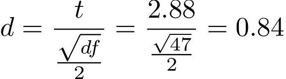

# Einfaktorielle Varianzanalyse

## Einführung

Bisher haben wir drei verschiedene Testverfahren kennen gelernt: Der *t*-Test für eine Stichprobe, die einfache lineare Regression und die multiple lineare Regression. Durch diese drei Testsverfahren können wir bereits eine Fülle an bildungswissenschaftlich relevanten Fragen beantworten. Zum Beispiel:

-   Haben Gymnasiasten einen höheren Intelligenzquotienten als 100?

-   Verringert sich das Stressempfinden von Studierenden, wenn sie mehr meditieren?

-   Gibt es einen Zusammenhang zwischen der Zeit, die Studierende lernen und ihren Noten in Klausuren?

Unser Werkzeugkasten ermöglicht es uns allerdings bisher nicht, Gruppenunterschiede zu testen. Beispielsweise können wir bisher keine Unterschiedshypothesen testen. In diesem Modul werden wir daher folgenden beiden Fragestellungen testen:

> **Lernen Studierende mehr, wenn sie ihr Wissen [testen ](https://dorsch.hogrefe.com/stichwort/testungseffekt)anstatt eine [Concept-Map](https://dorsch.hogrefe.com/stichwort/lernen-mit-concept-maps) zu erstellen?**
>
> **Lernen Studierende, die während eines Vortrags handschriftlich mitschreiben mehr als Studierende, die mit einem Laptop bzw. einem E-Writer mitschreiben?**

Um solche Fragestellungen statistisch zu testen, müssen wir uns überlegen, wie wir diese Gruppenunterschiede durch die Parameter in unseren statistischen Modellen kodieren können. Wir haben beispielsweise gesehen, dass *b~1~* bei der einfachen linearen Regression den Zusammenhang zwischen zwei Variablen kodiert. Wir haben ebenso gesehen, dass wir bei der linearen und multiplen Regression Prädiktoren eingeführt haben (*X~i~*), für welche wir die Werte einer metrischen Variable eingesetzt haben. Um nun Gruppenunterschiede statistisch zu testen, müssen wir zwei Probleme lösen:

1.  Wir müssen einen Weg finden, Mittelwertsunterschiede von Gruppen als Parameter zu kodieren (z.B. *b~1~*).

2.  Wir müssen einen Weg finden, kategoriale Variablen (handschriftliche Mitschrift vs. Mitschrift mit dem Laptop) in eine numerische Form zu bringen, die wir für *X~i~* einfügen können (z.B. handschriftliche Mitschrift = 1, Mitschrift mit dem Laptop = -1). Das heißt, *X~i~* ist im Gegensatz zur linearen und multiplen Regression nicht mehr kontinuierlich, sondern diskret skaliert.

Um diese beiden Probleme zu lösen, werden wir sogenannte Kontrastkodierungen kennen lernen, welche uns ermöglichen, spezifische Gruppenunterschiede zu testen. Zum Beispiel werden wir am Ende des Moduls in der Lage sein, zu testen, ob Studierende, die handschriftlich mitschreiben mehr lernen als Studierende, die mit dem Laptop oder mit einem E-Writer mitschreiben.

Wir werden in diesem Modul zwei verschiedene Tests kennen lernen, die allerdings das gleiche Verfahren anwenden, welches wir bisher kennen gelernt haben. Genauer werden wir den ***t*****-Test für unabhängige Stichproben** und die **einfaktorielle Varianzanalyse** kennen lernen. Für beide Verfahren werden wir *F*-Tests berechnen. Der Unterschied zwischen dem *t*-Test für unabhängige Stichproben und der einfaktoriellen Varianzanalyse liegt darin, dass sie sich darin unterscheiden, wie viel Gruppen man miteinander vergleicht. Beim *t*-Test für unabhängige Stichproben werden zwei Gruppen miteinander verglichen, bei der einfaktoriellen Varianzanalyse mehr als zwei Gruppen. Sobald du allerdings die Kontrastkodierung verstehst, wirst du sehen, dass beide Tests ähnlich statistisch modelliert werden.

### Datensätze dieses Moduls

Wir werden in diesem Modul zwei verschiedene Datensätze verwenden. Bei beiden Datensätzen handelt es sich um Replikationsstudien bekannter Studien.

### ***t*****-Test für unabhängige Stichproben: Buttrick et al. (2018)**

Zunächst werden wir uns mit der Studie von [Buttrick et al. (2018) ](https://osf.io/2h3g6/)beschäftigen. Buttrick und Kolleg\*innen replizierten eine sehr bekannte Studie von [Karpicke und Blunt (2011)](https://science.sciencemag.org/content/sci/330/6002/335.full.pdf). In dieser Studie wurde unter anderem untersucht, ob das Testen von Wissen, das heißt der freie Abruf von Wissen, für das Erlernen konzeptuellen Wissens lernförderlicher ist als das Erstellen von Concept Maps. Diese Studie war der Beginn einer intensiven Diskussion zur Frage, ob der Testing-Effekt nicht nur für einfaches Lernmaterial wie Wortpaarliste, sondern auch für komplexes Lernmaterial funktioniert (z.B. konzeptuelles Wissen). Beispielsweise kritisierten [van Gog und Sweller (2015)](https://repub.eur.nl/pub/92178/), dass der Testing-Effekt bei komplexem Lernmaterial nicht zu finden ist. [Karpicke und Aue (2015)](https://www.infona.pl/resource/bwmeta1.element.springer-27c4b436-8913-3d02-b003-c3e50ac8e537) verteidigten ihre Position anschließend mit dem Argument, dass die Studien von van Gog und Sweller methodologisch mangelhaft waren. Wir werden in diesem Modul den *t*-Test für unabhängige Stichproben verwenden, um die Ergebnisse von Buttrick et al. zu berechnen und die Frage beantworten, ob das Testen von Wissen zu einer besseren Erinnerungsleistung bei konzeptuellen Wissen ist als die Erstellung von Concept Maps.\

Die Prozedur des Experiments von Buttrick et al. (2018) sah folgendermaßen aus: Die Versuchspersonen wurden in Kleingruppen (1 bis 4 Personen) getestet und lasen einen kurzen Text zum Thema Seeotter. Sie hatten fünf Minuten Zeit, den Text zu studieren. Die Versuchspersonen wurden anschließend willkürlich in zwei Gruppen eingeteilt (Concept Map Gruppe vs. Testing Gruppe). Die Versuchspersonen in der Concept-Map Gruppe hatten anschließend 25 Minuten Zeit mit dem Text eine Concept-Map zu erstellen. Diejenigen Versuchspersonen in der Concept-Map Gruppe hatten 10 Minuten Zeit so viel aus dem Text aufzuschreiben, wie sie sich erinnern konnten. Anschließend bekamen sie 5 Minuten Zeit, den Text erneut zu studieren und erhielten erneut 10 Minuten, sich an die Inhalte des Textes frei zu erinnern. Eine Woche später erhielten die Versuchspersonen einen Follow-Up Test, welcher 14 Faktenfragen und zwei Inferenzfragen zum Thema des Textes beinhaltete. Beide Fragen testeten nach Aussage der Autoren konzeptuelles Wissen.

Den Datenatz der Replikationsstudie von Buttrick et al. (2018) findest du hier:

TODO: Einfügen Datei buttrick.csv

Für diese Studie interessieren uns folgende Variablen:

-   **condition**: Diese Variable kodiert, ob Studierende entweder eine Concept Map erstellt haben (Concept) oder ihr Wissen getestet haben (Retrieval). condition ist die unabhängige Variable.

-   **ts_avg**: Diese Variable kodiert, wie viele richtige Antworten die Versuchspersonen bei den 16 Fragen des Abschlusstests in Prozent korrekt beantwortet haben. ts_avg ist die abhängige Variable.

#### **Einfaktorielle Varianzanalyse: Morehead, Dunlosky und Rawson (2014)**

Für das Verfahren der einfaktoriellen Varianzanalyse werden wir erneut die Replikationsstudie von [Morehead, Dunlosky und Rawson (2014)](https://link.springer.com/article/10.1007/s10648-019-09468-2) verwenden. Zur Erinnerung, in dieser Studie wiederholten Morehead et al. eine Studie, die ursprünglich von [Mueller und Oppenheimer (2014)](https://journals.sagepub.com/doi/full/10.1177/0956797614524581) durchgeführt wurde. In beiden Studien wurde untersucht, ob die Mitschrift eines Vortrags mit verschiedenen Medien einen Einfluss auf die Erinnerungsleistung hat. Wir werden diese Replikationsstudie verwenden, um heraus zu finden, ob die handschriftliche Mitschrift während eines Vortrags lernförderlicher ist als die Mitschrift mit dem Laptop beziehungsweise einem E-Writer.

Die Prodezur der Studie von Morhead et al. (2014) verlief wie folgt: Studierende sahen sich einen von fünf TED-Talks an, welche im Schnitt 17 Minuten dauerten. Versuchspersonen wurden willkürlich in einer der folgenden Gruppen eingeteilt. Entweder wurden die Versuchspersonen gebeten, während des Vortrags die Inhalte des Vortrags per Hand mitzuschreiben. Eine andere Gruppe wurde gebeten, die Inhalte des Vortrags mit dem Laptop mitzuschreiben. Eine dritte Gruppe wurde gebeten, die Inhalte des Vortrags mit einem E-Writer aufzuschreiben. Anschließend erhielten die Versuchspersonen für 30 Minuten eine Aufgabe, die nichts mit dem Experiment zu tun hatte. Anschließend füllten die Versuchspersonen einen Test aus, welcher aus Faktenfragen und konzeptuellen Fragen bestand. Zwei Tage später wurden die gleichen Fragen erneut abgefragt.

Der Datensatz dieses Experiments befindet sich hier:

TODO: Einfügen morehead_experiment1.csv

Für diese Studie interessieren uns folgende Variablen:

-   **method**: Die Versuchsgruppe, in die die Versuchspersonen eingeordnet wurden: eWriter, laptop oder longhand.

-   **test2tot**: Prozentueller Anteil der korrekten Fragen des Tests zwei Tage nach dem Aufschreiben der Notizen.

## Kontrastkodierungen

In der Einführung dieses Moduls haben wir gesagt, dass wir zwei Probleme lösen müssen. Wir müssen kategorielle Werte, wie beispielsweise ob Studierende ihr Wissen getestet haben oder eine Concept-Map erstellt haben, in numerische Werte überführen. Ebenso müssen wir einen Weg finden, die Parameter in unseren statistischen Modellen als spezifische Hypothesen zu kodieren. Die Lösung dieser beider Probleme sind Kontrastkodierungen.

### **Bei *k* Gruppen braucht man *k* - 1 Prädiktoren**

Für Kontrastkodierungen gilt, dass wir bei einem *t*-Test für unabhängige Stichproben bzw. einer einfaktoriellen Varianzanalyse für *k* Gruppen *k* - 1 Prädiktoren benötigen. Wenn ich beispielsweise testen möchte, ob Probanden, die sich ihr Wissen testen, mehr konzeptuelles Wissen erwerben als Studierende, die Concept-Maps anfertigen, bräuche ich einen Prädiktor (2 -1 = 1) im erweiterten Modell. Würde ich untersuchen, ob Studierende, die bei einem Vortrag handschriftlich mitschreiben, mehr lernen als Studierende, die mit dem Laptop oder einem E-Writer mitschreiben, bräuchte ich zwei Prädiktoren (3 - 1 = 2).

### **Kategoriale Variablen in numerische Werte überführen**

Während wir bei der einfachen linearen Regression für die Prädiktoren *X~i~* die Werte der unabhängigen Variablen einfügen können (siehe Bild links), können wir die Gruppen, welche in der Regel als Text in Variablen gespeichert sind (*Concept* und *Retrieval*) nicht direkt für *X~i~* eintragen (siehe Bild rechts), da diese Gruppen nicht numerisch vorliegen.

Wie wir Gruppen in numerische Werte überführen, entscheidet darüber, welche Hypothesen wir mit den Modellpaaren testen können. Nehmen wir beispielsweise die Frage, ob Studierende, die ihr Wissen testen, mehr konzeptuelles Wissen erwerben als Studierende, die eine Concept-Map anfertigen. Da wir zwei Gruppen haben, müssten wir *einen* Kontrast für den Parameter *X~1~* definieren (2 -1 = 1). Beispielsweise könnten wir der Testing-Gruppe eine 1 und der Concept Map Gruppe eine -1 zuordnen.

| **Gruppe**  | ***X~1~*** |
|-------------|------------|
| Testing     | 1          |
| Concept Map | -1         |

Die Werte dieses Kontrasts würden wir für *X~1~* einfügen. *b~1~* kodiert als Folge den Mittelwertsunterschied beider Gruppen. Indem wir nun *X~1~* im kompakten Modell auf 0 setzen, können wir testen, ob dieser Mittelwertsunterschied 0 beträgt:

In der unteren Tabelle siehst du nun eine Reihe an Kontrasten, die du für verschiedene spezifische Hypothesen verwenden kannst. Wir werden diese Kontraste einzeln durchgehen und an Beispielen zeigen, welche Fragestellungen mit ihnen beantwortet werden können. Das Ziel dieser Ausführungen ist, dass du lernst, wie statistische Modelle mit kategorialen Prädiktoren erstellt werden. In den nächsten Modulen wirst du sehen, wie wir diese Kontraste nutzen, um Hypothesen zu testen.

Die folgenden Kontraste werden alle von Jamovi unterstützt. Die Tabelle enthält sowohl den Namen des Kontrasts, die Hypothese, welche man mit den Kontrasten testen kann und die Bedeutung der Regressionskoeffizienten des erweiterten Modells. Ebenso zeigt die Tabelle an, ob Kontraste orthogonal sind. Wir werden bei den Difference- bzw. Reverse-Helmert Kontrasten erklären, was damit gemeint ist.

| Kontrast                                 | Hypothese                                                                            | Bedeutung *b~0~*                          | Bedeutung *b~i~*                                                                          | orthogonal |
|:-----------------------------------------|:-------------------------------------------------------------------------------------|-------------------------------------------|-------------------------------------------------------------------------------------------|------------|
| Deviation- oder Sum-Kontrast             | Vergleicht den Mittelwert einer Gruppe gegen den Mittelwert aller Gruppen.           | Mittelwert aller Gruppen                  | Die Abweichung des Mittelwerts einer Gruppe vom Mittelwert der Mittelwerte aller Gruppen. | nein       |
| Dummy- oder Simple-Kontrast              | Vergleicht den Mittelwert einer Gruppe durch den Mittelwert einer Referenzgruppe.    | Mittelwert einer Referenzgruppe           | Die Abweichung des Mittelwerts einer Gruppe vom Mittelwert der Referenzgruppe.            | nein       |
| Difference-oder Reverse-Helmert Kontrast | Vergleicht den Mittelwert einer Gruppe mit dem Mittelwert der vorherigen Gruppen.    | Mittelwert des Mittelwerts aller Gruppen. | Die Differenz der Mittelwerte zweier oder mehrerer Gruppen.                               | ja         |
| Helmert-Kontrast                         | Vergleicht den Mittelwert einer Gruppe mit dem Mittelwert der nachfolgenden Gruppen. | Mittelwert des Mittelwerts aller Gruppen. | Die Differenz der Mittelwerte zweier oder mehrerer Gruppen.                               | ja         |

Im Folgenden gehen wir die einzelnen Kontraste einzeln durch, um zu erklären, für welche Hypothesen sie genutzt werden können. Für alle Beispiele werden wir die Studie von Morehead und Kollegen verwenden.

### **Deviation- oder Sum-Kontrast**

Diese Kontraste eignen sich dazu, zu testen, ob sich ein Mittelwert einer Gruppe vom Mittelwert aller Gruppen unterscheidet. Du wirst eine solche Kontrastkodierung selten verwenden, da wir in der Regel daran interessiert sind, spezifische Gruppenunterschiede zu testen.

+-------------------------------+---------------------------------------------------------------------------+---------------------------+-------------------------------------------------------------------------------------------+----------------+
| **Kontrast**                  | **Hypothese**                                                             | **Bedeutung *b~0~*\       | **Bedeutung *b~i~***                                                                      | **orthogonal** |
|                               |                                                                           | **                        |                                                                                           |                |
+:==============================+:==========================================================================+===========================+===========================================================================================+================+
| Deviation- oder Sum-Kontrast\ | Vergleicht den Mittelwert einer Gruppe gegen den Mittelwert aller Gruppen | Mittelwert aller Gruppen\ | Die Abweichung des Mittelwerts einer Gruppe vom Mittelwert der Mittelwerte aller Gruppen. | nein           |
+-------------------------------+---------------------------------------------------------------------------+---------------------------+-------------------------------------------------------------------------------------------+----------------+

Nehmen wir folgendes Beispiel: Du möchtest heraus finden, ob Studierende, die per Hand mitschreiben, sich an mehr oder weniger aus einem Vortrag erinnern als die Studierenden aller Gruppen zusammen. Um diese Hypothese zu testen, könntest du folgende Kontraste aufstellen:

+------------+------------+---------------+
| **Gruppe** | ***X~1~*** | ***X~2~*****\ |
|            |            | **            |
+============+============+===============+
| per Hand\  | -1         | -1            |
+------------+------------+---------------+
| Laptop     | 1          | 0             |
+------------+------------+---------------+
| E-Writer   | 0          | 1             |
+------------+------------+---------------+

Nun bist du vermutlich geneigt zu denken, dass man mit diesem Kontrast testet, ob Studierende, die mit dem Laptop mitschrieben sich besser an den Vortrag erinnern konnten als Studierende, die per Hand mitschrieben. Dem ist allerdings nicht so. Der Grund hierfür ist, dass diese Kontrastgewichte nicht orthogonal sind (wir kommen gleich darauf zu sprechen). 

Deviation- oder Sum-Kontraste erkennst du daran, dass die erste Zeile der Kontrastegewichte auf -1 gesetzt wird und für die Gruppe, die mit allen Gruppen verglichen werden soll eine 1 gesetzt wird. Alle anderen Gruppen werden auf 0 gesetzt. Das bedeutet, durch *X~2~* testen wir, ob die Studierende mit E-Writern sich besser oder schlechter an den Vortrag erinnern konnten als alle Gruppen zusammen. 

Berechnen wir das erweiterte Modell auf Grundlage dieser Kontrastgewichte, erhalten wir dieses Modell:

Du siehst, dass das Modell drei Parameter und zwei Prädiktoren hat. *b~1~* kodiert den Mittelwertsunterschied zwischen der Laptopgruppe mit allen anderen Gruppen. *b~2~* kodiert den Mitelwertsunterschied zwischen der E-Writer Gruppe mit allen anderen Gruppen. Beweisen können wir dies dadurch, indem wir uns die Mittelwerte der Gruppen ansehen:

+----------------------------------------+---------+
| **Gruppen**\\                          | ***M*** |
+========================================+=========+
| per Hand\                              | 0.269   |
+----------------------------------------+---------+
| Laptop                                 | 0.2333  |
+----------------------------------------+---------+
| E-Writer                               | 0.250   |
+----------------------------------------+---------+
| Mittelwerte aller Mittelwerte (*b~0~)* | 0.2508  |
+----------------------------------------+---------+

*b~0~* ist offensichtlich der Mittelwert aller Mittelwerte (0.2508). *b~1~* wiederum ist die Differenz des Mittelwerts der Laptopgruppe vom Gruppenmittelwert: 0.2333- 0.2508 = -0.0175. *b~2~* wiederum ist die Differenz des Mittelwerte der E-Writer Gruppe vom Gruppenmittelwert: 0.250 - 0.2508 = 0.00085. Wir haben damit gezeigt, dass die Parameter spezifische Gruppenunterschiede testen. Indem wir die Prädiktoren dieser Parameter im kompakten Modell auf 0 setzten, können wir ebendiese Hypothesen durch unseren bekannten *F*-Test bzw. *t*-Test testen.

### **Dummy- oder Simple-Kontrast**

Dummy-Kontraste sind Kontraste, bei denen die Kontrastgewichte lediglich auf 0 und 1 gesetzt werden. Sie können verwendet werden, um Mittelwertsunterschiede zwischen einer Referenzgruppe und allen anderen Gruppen zu testen.

+-----------------------------+----------------------------------------------------------------------------------+---------------------------------+---------------------------------------------------------------------------------+----------------+
| **Kontrast**                | **Hypothese**                                                                    | **Bedeutung *b~0~*\             | **Bedeutung *b~i~***                                                            | **orthogonal** |
|                             |                                                                                  | **                              |                                                                                 |                |
+:============================+:=================================================================================+=================================+=================================================================================+================+
| Dummy- oder Simple-Kontrast | Vergleicht den Mittelwert einer Gruppe durch den Mittelwert einer Referengruppe. | Mittelwert einer Referenzgruppe | Die Abweichung des Mittelwerts einer Gruppe vom Mittelwert der Referenzgruppe.\ | nein           |
+-----------------------------+----------------------------------------------------------------------------------+---------------------------------+---------------------------------------------------------------------------------+----------------+

Für die Referenzgruppe werden in einer Dummy-Kodierung alle Kontrastgewichte auf 0 gesetzt. Für alle Gruppen, die mit dieser Referenzgruppe verglichen werden sollen, wird pro Kontrast eine 1 eingesetzt. In folgendem Beispiel wird jede Gruppe mit der Referenzgruppe derjenigen Studierenden verglichen, die per Hand mitgeschrieben haben.

+------------+------------+---------------+
| **Gruppe** | ***X~1~*** | ***X~2~*****\ |
|            |            | **            |
+============+============+===============+
| per Hand\  | 0          | 0             |
+------------+------------+---------------+
| Laptop     | 1          | 0             |
+------------+------------+---------------+
| E-Writer   | 0          | 1             |
+------------+------------+---------------+

Berechnet man auf Grundlage dieser Kontraste das erweiterte Modell erhält man folgendes Modell:

Ein Blick auf die untere Tabelle verrät uns, dass *b~0~* nichts anderes ist als der Mittelwert der Gruppe, welche per Hand mitgeschrieben hat. *b~1~* kodiert den Mittelwertsunterschied zwischen der Laptopgruppe und der Gruppe, die per Hand mitgeschrieben hat: 0.2333 - 0.269 = -0.036. *b~2~* kodiert den Mittelwertsunterschied der E-Book Gruppe und der Gruppe, die per Hand mitgeschrieben hab: 0.250 - 0.269 = -0.019.

+-------------------------------+---------+
| **Gruppen**\\                 | ***M*** |
+===============================+=========+
| per Hand\                     | 0.269   |
+-------------------------------+---------+
| Laptop                        | 0.2333  |
+-------------------------------+---------+
| E-Writer                      | 0.250   |
+-------------------------------+---------+
| Mittelwerte aller Mittelwerte | 0.2508  |
+-------------------------------+---------+

Durch die Wahl dieser Dummy-Kodierung können wir durch unser Verfahren daher zwei Hypothesen testen: Ob sich die Mittelwerte zwischen der Gruppen Laptop und E-Writer vom Mittelwert der händischen Gruppe unterscheidet. Wir testen diese beiden Hypothesen, indem wir den Prädiktor des jeweiligen Parameters im kompakten Modell auf 0 setzen.

### **Difference-oder Reverse-Helmert Kontrast**

Der dritte Kontrast ermöglicht es uns ebenso Mittelwertsunterschiede einzelner Gruppen zu testen. Er ermöglicht es uns aber ebenso eine Gruppe mit mehreren anderen Gruppen zu vergleichen. Dies ist bei einer Dummykodierung und einer Differenzkodierung nicht möglich. Beispielsweise können wir einen Reverse-Helmert-Kontrast verwenden, um zu testen, ob sich die e-Writer Gruppe an mehr oder weniger aus dem Vortrag erinnert als die anderen beiden Gruppen.

+------------------------------------------+------------------------------------------------------------------------------------+--------------------------------------------+-------------------------------------------------------------+----------------+
| **Kontrast**                             | **Hypothese**                                                                      | **Bedeutung *b~0~*\                        | **Bedeutung *b~i~***                                        | **orthogonal** |
|                                          |                                                                                    | **                                         |                                                             |                |
+:=========================================+:===================================================================================+============================================+=============================================================+================+
| Difference-oder Reverse-Helmert Kontrast | Vergleicht den Mittelwert einer Gruppe mit dem Mittelwert der vorherigen Gruppen.\ | Mittelwert des Mittelwerts aller Gruppen.\ | Die Differenz der Mittelwerte zweier oder mehrerer Gruppen. | ja             |
+------------------------------------------+------------------------------------------------------------------------------------+--------------------------------------------+-------------------------------------------------------------+----------------+

In der folgenden Tabelle siehst du einen Reverse-Helmert-Kontrast. Bisher konnten wir aus Kontrastgewichten, die für die einzelnen Prädiktoren eingesetzt werden nicht erahnen, welche Hypothesen mit ihnen getestet werden können. Mit einem Reverse-Helmert-Kontrast allerdings schon. Beispielsweise testen wir bei *X~1~*, ob der Mittelwertunterschied der Laptopgruppe unterschiedlich vom Mittelwert der händischen Gruppe ist. Mit *X~2~* testen wir, ob der Mittelwert der E-Writer Gruppe unterschiedlich vom Mittelwert der anderen beiden Gruppen ist.

+------------+------------+---------------+
| **Gruppe** | ***X~1~*** | ***X~2~*****\ |
|            |            | **            |
+============+============+===============+
| per Hand\  | -1         | -1            |
+------------+------------+---------------+
| Laptop     | 1          | -1            |
+------------+------------+---------------+
| E-Writer   | 0          | 2             |
+------------+------------+---------------+

Der Grund, dass diese Kontrastkodierung der einzelnen Prädiktoren interpretierbar sind, liegt darin, dass diese Kontraste orthogonal sind. Orthogonale Kontraste folgen zwei Regeln:

### **Erste Regel: Bei orthogonalen Kontrasten muss die Summe der Kontrastgewichte pro Prädiktor 0 ergeben**

Die erste Regel lautet, dass die Summe der Kontrastgewichte für jeden Prädiktor 0 ergeben muss:

In unserer Reverse-Helmert-Kodierung gilt daher, dass die Kontrastgewichte für *X~1~* und *X~2~* 0 ergibt:

+------------+------------+---------------+
| **Gruppe** | ***X~1~*** | ***X~2~*****\ |
|            |            | **            |
+============+============+===============+
| per Hand\  | -1         | -1            |
+------------+------------+---------------+
| Laptop     | 1          | -1\           |
+------------+------------+---------------+
| E-Writer   | 0          | 2             |
+------------+------------+---------------+
| *Summe:*   | *0*        | 0             |
+------------+------------+---------------+

### **Zweite Regel: Bei mehr als zwei Gruppen muss das Produkt der Kontrastgewichte der Prädiktoren bei orthogonalen Kontrasten 0 ergeben.**

Da wir zwei Prädiktoren haben, müssen wir das Produkt der Kontrastgewichte dieser Prädiktoren berechnen und prüfen, ob deren Summe 0 ergibt.

In der unteren Tabelle siehst du, wie dieses Produkt berechnet wird. Du erkennst, dass die Summe des Produktes der beiden Kontraste 0 ergibt:

+------------+------------+---------------+-----------------------+
| **Gruppe** | ***X~1~*** | ***X~2~*****\ | ***X~1~ \* X~2~*****\ |
|            |            | **            | **                    |
+============+============+===============+=======================+
| per Hand\  | -1         | -1            | (-1) \* (-1) = 1      |
+------------+------------+---------------+-----------------------+
| Laptop     | 1          | -1\           | 1 \* (-1) = -1\       |
+------------+------------+---------------+-----------------------+
| E-Writer   | 0          | 2             | 0 \* 2 = 0            |
+------------+------------+---------------+-----------------------+
| *Summe:*   | *0*        | 0             | 0                     |
+------------+------------+---------------+-----------------------+

Nun, stell dir eine andere Reverse-Helmert-Kodierung vor, welche für vier Gruppen definiert wird. Um einen orthogonalen Kontrast zu erzielen, müssten die Summe der Produkte *aller* Kontraste 0 ergeben:

+------------+------------+---------------+---------------+-----------------------+-----------------------+-----------------------+
| **Gruppe** | ***X~1~*** | ***X~2~*****\ | ***X~3~*****\ | ***X~1~ \* X~2~*****\ | ***X~1~ \* X~3~*****\ | ***X~2~ \* X~3~*****\ |
|            |            | **            | **            | **                    | **                    | **                    |
+============+============+===============+===============+=======================+=======================+=======================+
| Gruppe 1\  | 1          | 1\            | 1             | 1                     | 1                     | 1                     |
+------------+------------+---------------+---------------+-----------------------+-----------------------+-----------------------+
| Gruppe 2   | 1          | 1\            | -1            | 1                     | -1\                   | -1                    |
+------------+------------+---------------+---------------+-----------------------+-----------------------+-----------------------+
| Gruppe 3   | 1          | -2            | 0             | -2                    | 0                     | 0                     |
+------------+------------+---------------+---------------+-----------------------+-----------------------+-----------------------+
| Gruppe 4   | -3         | 0             | 0             | 0                     | 0                     | 0                     |
+------------+------------+---------------+---------------+-----------------------+-----------------------+-----------------------+
| *Summe:*   | *0*        | 0             | 0             | 0                     | 0                     | 0                     |
+------------+------------+---------------+---------------+-----------------------+-----------------------+-----------------------+

### **Alternative Berechnung der Kontrastgewichte bei Reverse-Helmert-Kontrasten**

Wir könnten an dieser Stelle bereits das Modell auf Grundlage dieser Kontraste aufstellen. Allerdings wäre hierdurch die Interpretation der Parameter schwieriger. Damit die Parameter spezifische Mittelwertsunterschiede kodieren, müssen wir die einzelnen Kontraste durch die Anzahl der Gruppen teilen, die miteinander verglichen werden. Zum Beispiel werden im ersten Kontrast für *X~1~* zwei Gruppen miteinander verglichen. Daher wird jedes Kontrastgewicht durch 2 geteilt. Im Prädiktor *X~2~* wiederum wird die E-Writer Gruppe mit den anderen beiden Gruppen verglichen. Da wir für diesen Vergleich alle Gruppen betrachten, werden die Kontrastgewichte durch 3 geteilt.

+------------+------------+---------------+
| **Gruppe** | ***X~1~*** | ***X~2~*****\ |
|            |            | **            |
+============+============+===============+
| per Hand\  | -1 / 2     | -1 / 3        |
+------------+------------+---------------+
| Laptop     | 1 / 2      | -1 / 3        |
+------------+------------+---------------+
| E-Writer   | 0          | 2 / 3         |
+------------+------------+---------------+

Verwenden wir dieses Set an Kontrasten, erhalten wir folgendes Modell:

Mit Blick auf die untere Tabelle sehen wir erneut, dass *b~0~* den Mittelwert der Gruppenmittelwerte kodiert. *b~1~* kodiert den Mittelwertsunterschied der Laptopgruppe und der Gruppe, die per Hand mitgeschrieben hat: 0.2333 - 0.269 = -0.0357 (mit kleinen Rundungsfehlern). *b~2~* kodiert den Mittelwertsunterschied zwischen der E-Writer Gruppe und den anderen beiden Gruppen: 0.250 - ((0.2692308+ 0.2333) / 2) = -0.00127.

+-------------------------------+---------+
| **Gruppen**\\                 | ***M*** |
+===============================+=========+
| per Hand\                     | 0.269   |
+-------------------------------+---------+
| Laptop                        | 0.2333  |
+-------------------------------+---------+
| E-Writer                      | 0.250   |
+-------------------------------+---------+
| Mittelwerte aller Mittelwerte | 0.2508  |
+-------------------------------+---------+

Wir haben damit erneut gezeigt, dass die Parameter für Mittelwertsunterschiede in den Gruppen stehen. Mit der richtigen Wahl der Reverse-Helmert-Kontrasten können wir entscheiden, welche Gruppen wir miteinander vergleichen.

### **Helmert-Kontrast**

Helmert-Kontraste sind fast identisch mit Reverse-Helmert-Kontrasten, nur dass sie sozusagen spiegelverkehrt geschrieben werden. Für die Wahl der Hypothesen und die Interpretation der Ergebnisse machte es keinen Unterschied ob man Helmert- oder Reverse-Helmert-Kontraste verwendet.

+------------------+--------------------------------------------------------------------------------------+--------------------------------------------+--------------------------------------------------------------+----------------+
| **Kontrast**     | **Hypothese**                                                                        | **Bedeutung *b~0~*\                        | **Bedeutung *b~i~***                                         | **orthogonal** |
|                  |                                                                                      | **                                         |                                                              |                |
+:=================+:=====================================================================================+============================================+==============================================================+================+
| Helmert-Kontrast | Vergleicht den Mittelwert einer Gruppe mit dem Mittelwert der nachfolgenden Gruppen. | Mittelwert des Mittelwerts aller Gruppen.\ | Die Differenz der Mittelwerte zweier oder mehrerer Gruppen.\ | ja             |
+------------------+--------------------------------------------------------------------------------------+--------------------------------------------+--------------------------------------------------------------+----------------+

In der unteren Tabelle siehst du eine Helmert-Kontrastkodierung. Im Unterschied zur Reverse-Helmert-Kodierung wird die obere Gruppe mit restlichen Gruppen verglichen. Bei der Reverse-Helmert-Kodierung wird die untere Gruppe mit den restlichen Gruppen weiter oben in der Tabelle verglichen:

+------------+------------+---------------+
| **Gruppe** | ***X~1~*** | ***X~2~*****\ |
|            |            | **            |
+============+============+===============+
| per Hand\  | 2 / 3      | 0             |
+------------+------------+---------------+
| Laptop     | -1 / 3     | 1 / 2         |
+------------+------------+---------------+
| E-Writer   | -1 / 3     | -1 / 2        |
+------------+------------+---------------+

Erneut können wir zeigen, dass wir durch diese Kodierung die in der Tabelle beschriebenen Mittelwertsunterschiede testen können:

*b~0~* kodiert erneut den Mittelwert der Gruppenmittelwerte. *b~1~* kodiert den Mittelwertsunterschied der Gruppe, die per Hand mitschreibt und den anderen beiden Gruppen: 0.269 - ((0.23333+ 0.250) / 2) = 0.027. *b~2~* kodiert den Mittelwertsunterschied zwischen der Laptopgruppe und der E-Writer-Gruppe: 0.2333 - 0.250 = -0.0167.

+-------------------------------+---------+
| **Gruppen**\\                 | ***M*** |
+===============================+=========+
| per Hand\                     | 0.269   |
+-------------------------------+---------+
| Laptop                        | 0.2333  |
+-------------------------------+---------+
| E-Writer                      | 0.250   |
+-------------------------------+---------+
| Mittelwerte aller Mittelwerte | 0.2508  |
+-------------------------------+---------+

### Zusammenfassung

Wir haben in diesem Submodul gelernt, wie wir Gruppen als numerische Werte kodieren können. Dabei sind wir verschiedene Kontrastkodierungssysteme durchgegangen. Durch die Wahl der Kontrastekodierung stellen wir unterschiedliche statistische Modelle auf, mit denen wir unterschiedliche Hypothesen testen können. In diesem Submodul haben wir darauf verzichtet, zu zeigen, wie diese Parameter aus den Modellen berechnet werden. Das Prinzip bleibt allerdings das gleiche. Wir suchen das Modell, welches die geringste quadrierte Abweichung der tatsächlichen Werte von den vorhergesagten Werten hat (Ordinal Least Squares Methode). Auf Grundlage dieser berechneten Parameter haben gesehen, dass bei Helmert- bzw. Reverse-Helmert-Kontrasten die Parameter spezifische Mittelwertsunterschiede der Gruppen kodieren. Dieser Tatsache machen wir uns im nächsten Submodul zu Nutze, um sowohl einen *t*-Test für unabhängige Stichproben als auch eine einfaktorielle Varianzanalyse zu berechnen.

## t-Test für unabhängige Stichproben

Das Ziel dieses Submoduls ist folgende Forschungsfrage zu beantworten: Lernen Studierende, die ihr Wissen testen, mehr konzeptuelles Wissen als Studierende, die eine Concept-Map anfertigen. Zur Erinnerung, [Buttrick et al. (2018)](https://osf.io/2h3g6/) replizierten eine Studie von [Karpicke und Blunt (2011)](https://science.sciencemag.org/content/331/6018/772.abstract), welche genau dies herausgefunden hatte. Den vollständigen Bericht der Studie von Buttrick et al. findest du in der unteren Datei:

\
TODO: Karpicke & Blunt (2011) - Replication Report.pdf

Karpicke berichten folgendes Ergebnis zu dieser Forschungsfrage:

> "The hypothesis that retrieval practice would lead to better recall one week later than concept-mapping was supported by the data. Those assigned to retrieval practice (*n* = 23) recalled more in the one-week follow-up test than those assigned to concept-mapping (*n* = 26): Retrieval *M* = 62.3% recalled, *SD* = 19%; Concept-Mapping *M* = 46.9% recalled, *SD* = 19%; *t*(48)=2.88, *p* = 0.006, *r* = 0.39 [95% CI: 0.11, 0.71]."
>
> Buttrick et al. (2018, S. 4)

Wir werden in diesem Submodul zeigen, wie dieses Ergebnis zu Stande kommt, das heißt, wie es mit unserem bekannten Verfahren des Hypothesentestens berechnet werden kann.

### **Aufstellen der Kontrastkodierung**

Beginnen wir damit, die Kontraste zu kodieren. Wir wissen, dass wir zwei Gruppenmittelwerte miteinander vergleichen möchten, die Gruppe der Studierenden, die eine Concept-Map anfertigt mit der Gruppe der Studierenden, die ihr Wissen testet. Da wir zwei Gruppen haben, benötigen wir lediglich einen Prädiktor in unserem erweiterten Modell (*k* - 1 = 2 - 1 = 1). Wenngleich wir im letzten Submodul mehrere Kodierungssysteme kennen gelernt haben, haben wir bei zwei Gruppen nicht viele Möglichkeiten. Entweder verwenden wir eine Dummy-Kodierung mit einer 0 und einer 1, oder wir verwenden eine Helmert-Kodierung, bei der wir die Kodierung auf -1 und 1 setzen. Beide Kodierungen führen zu den gleichen Ergebnissen. Folgendermaßen könnten wir unsere Hypothese kodieren:

| **Gruppe**  | ***X~1~***\\ |
|-------------|--------------|
| Concept Map | -1 / 2       |
| Testing     | 1 / 2        |

Diese Konstrastkodierung führt dazu, dass der Parameter *b~1~* die Mittelwertsdifferenz der beiden Gruppen kodiert. Indem wir *b~1~* im kompakten Modell auf 0 setzen, können wir testen, ob die Mittelwerte der beiden Gruppen gleich sind. Dies können wir tun, da eine 0 hieße, dass es keine Differenz zwischen den Mittelwerten der beiden Gruppen gibt.

### Aufstellen des statistischen Hypothesenpaares

Wir können den Mittelwertsunterschied der beiden Gruppen durch folgendes Modellpaar testen:

\

Wie du siehst, umfasst das erweiterte Modell zwei Parameter und einen Prädiktor. Das kompakte Modell umfasst nur einen Parameter, da dort der Parameter *b~1~* auf 0 gesetzt wurde. Im kompakten Modell kodiert *b~0~* den Mittelwert der abhängigen Variable. Dies ist in unserem Fall das konzeptuelle Wissen, welches die Studierenden zum Thema Seeotter hatten.

### **Berechnung der Sum of Squares und der Kennwerte**

Nun, da wir das erweiterte und das kompakte Modell kennen, können wir sowohl die Sum of Squares als auch die zentralen Kennwerte berechnen. Es stellt sich heraus, dass der *F*-Wert bei 8.33 liegt für einen solchen Mittelwertsunterschied dieser beiden Gruppen unter der Annahme, dass die Gruppen sich nicht im Mittelwert unterscheiden bei 0.6% liegt. Wir haben damit ein signifikantes Ergebnis.

+--------------------------------------------------+----------+----------+----------+---------+---------+-----------+
| **Source**                                       | ***SS*** | ***df*** | ***MS*** | ***F*** | ***p*** | ***PRE*** |
+==================================================+==========+==========+==========+=========+=========+===========+
| Reduktion der Fehler durch das erweiterte Modell | 0.290    | 1        | 0.290    | 8.33    | .006\   | 0.15\     |
+--------------------------------------------------+----------+----------+----------+---------+---------+-----------+
| Error                                            | 1.638    | 47       | 0.035\   | \-      | \-      | \-        |
+--------------------------------------------------+----------+----------+----------+---------+---------+-----------+
| Total Error\                                     | 1.928    | 48\      | \-       | \-      | \-      | \-        |
+--------------------------------------------------+----------+----------+----------+---------+---------+-----------+

Falls du diese Zahlen nachrechnen möchtest und sehen möchtest, wie ich auf dieses Ergebnis gekommen bin, schau dir die folgende R-Datei an. Dort sind alle Schritte in R nachgerechnet.

TODO: Einfügen Datei buttrick_anova_in_r.R

Nun Buttrick et al. (2018) berichten statt einem *F*-Test einen *t*-Test. Damit meinen sie einen *t*-Test für unabhängige Stichproben: *t*(48) = 2.88, *p* = .006, *r* = 0.39 [95% CI: 0.11, 0.71]. Dieser wird eingesetzt, wenn man die Mittelwerte zweier Gruppen vergleichen möchte. Ebenso berichten sie die Effektgröße *r* = 0.39 als auch ein Konfidenzintervall für die Effektgröße. Zunächst können wir den *t*-Wert berechnen, indem wir die Wurzel auf *F* ziehen. Die Wurzel aus 8.33 ist in der Tat 2.88. Als nächstes berichten Buttrick et al. die gleiche Wahrscheinlichkeit von *p* = .006. Da unser *F*-Test die gleiche Wahrscheinlichkeit ergibt, wissen wir, dass Buttrick et al. *ungerichtet* getestet haben. Sie haben daher getestet, ob Studierende, die sich testen *mehr* oder *weniger* konzeptuelles Wissen erwerben als Studierende, die Concept-Maps erstellen. In der *t*-Verteilung dargestellt, haben sie folgenden beiden Flächen abgetragen:

Wäre ihre Hypothese gewesen, dass Studierende, die sich testen, *mehr* konzeptuelles Wissen erwerben als Studierende, die eine Concept-Map anfertigen, hätten sie gerichtet getestet. In diesem Fall hätten sie nur die Fläche rechts des empirischen *t*-Wertes abtragen müssen.

Hierdurch hätte sich die Wahrscheinlichkeit für einen solchen *t*-Wert unter Annahme der Nullhypothese halbiert (von .006 auf 0.0029). 

Ebenso berichten Buttrick et al. eine Effektgröße von *r* = 0.39. Für *t*-Tests ist es in der Regel üblicher eine Effektgröße von Cohen's *d* anzugeben. [Rosnow und Rosenthal (2003)](https://psycnet.apa.org/journals/met/1/4/331.html?uid=1996-06601-001) berichten folgende Formel zur Berechnung der Effektgröße *r* bei einem *t*-Test für unabhängige Stichproben:

*t* kennzeichnet den empirischen *t*-Wert und *df* die Freiheitsgrade des erweiterten Modells. Setzen wir diese Werte in die Formel ein, erhalten wir das gleiche Ergebnis wie Buttrick et al. (2018):

Wir hätten es uns aber auch einfacher machen können, indem wir *r* aus der Wurzel aus *PRE* berechnen. Erinnere dich aus dem Modul zur einfachen linearen Regression, dass *PRE* auch als *R^2^* bezeichnet wird und das Quadrat des Korrelationskoeffizienten *r* ist. Wenn wir daher die Wurzel aus PRE ziehen, sollten wir *r* erhalten:

Und so ist es auch. Der Vollständigkeit halber können wir zudem noch die Effektgröße Cohen's *d* berechnen. Du hast bereits gesehen, dass wir *r* dem *t*-Wert und den Freiheitsgraden des erweiterten Modells berechnen können. Ebenso können wir aus diesen beiden Werte durch folgende Formel Cohen's *d* bei einem *t*-Test für unabhängige Stichproben berechnen:

Mehr Informationen zur Umrechnung von Effektgrößen findest du [hier](https://www.psychometrica.de/effect_size.html).

### Zusammenfassung

Entscheidend für uns ist an dieser Stelle, dass wir gezeigt haben, dass wir den *t*-Test für unabhängige Stichproben durch unser gängiges Verfahren berechnen konnten. Ein entscheidender Schritt dorthin war die Aufstellung eines Kontrastes, der es ermöglicht die Gruppenzugehörigkeit in numerische Werte zu überführen. Durch die Wahl eines Helmert-Kontrasts konnten wir das erweiterte Modell so aufstellen, dass der Parameter *b~1~* für den Mittelwertsunterschied der beiden Gruppen steht. Zum Schluss haben wir gezeigt, dass der *t*-Wert die Wurzel aus dem *F*-Wert ist und dass man Effektgrößen mit verschiedenen Formeln umrechnen kann.

## Einfaktorielle Varianzanalyse (ANOVA)

Das Ziel dieses Submoduls ist folgende Forschungsfrage zu beantworten: Macht es für die Erinnerungsleistung aus einem Vortrag einen Unterschied, mit welchem Medium Studierende während des Vortrags mitschreiben. Genauer möchten wir in diesem Submodul mit Hilfe des Datensatzes von [Morehead et al. (2014)](https://link.springer.com/article/10.1007/s10648-019-09468-2) klären, ob Studierende, die während einem Vortrag per Hand mitschreiben mehr aus einem Vortrag behalten als Studierende, die mit einem Laptop beziehungsweise einem E-Writer mitschreiben. Morehead et al. (2014) haben diese Fragestellung zwar nicht in dieser Form explizit in ihrem Artikel gestellt, da sie eine sogenannte mehrfaktorielle Varianzanalyse berechnet haben, allerdings zweckentfremden wir den Datensatz in diesem Fall für unsere Fragestellung, da wir bisher noch nichts über die mehrfaktorielle Varianzanalyse erfahren haben.

Wir werden erneut folgendes Prozedere verwenden: Zunächst überlegen wir uns die Kontrastkodierung für unsere Gruppen. Anschließend berechnen wir das erweiterte und kompakte Modell auf Grundlage dieser Kontrastkodierung. Anschließend berechnen wir zwei Tests. Einen allgemeinen *F*-Test mit einem Freiheitsgrad von 2, mit welchem wir prüfen, ob es überhaupt Mittelwertsunterschiede zwischen den drei Gruppen gibt. Dieser Test wird allerdings nicht unsere eigentliche Fragestellung beantworten. Daher testen wir als nächstes einen spezifischen Kontrast, der prüft, ob Studierende, die während einem Vortrag per Hand mitschreiben mehr aus einem Vortrag behalten als Studierende, die mit einem Laptop beziehungsweise einem E-Writer mitschreiben.

### **Aufstellen der Kontrastkodierung**

Beginnen wir erneut damit, die Kontraste zu definieren. Und verwenden wir erneut einen Helmert-Kontrast, welcher uns ermöglicht, die Parameter des erweiterten Modells als Mittelwertsunterschiede der Gruppen darzustellen. Da wir drei Gruppen haben, benötigen wir in unserem erweiterten Modell zwei Prädiktoren und drei Parameter. Folgende Kontrastkodierung kodiert unsere Fragestellung (siehe *X~1~*):

+------------+------------+------------+
| **Gruppe** | ***X~1~*** | ***X~2~*** |
+============+============+============+
| per Hand   | 2 / 3      | 0          |
+------------+------------+------------+
| Laptop     | -1 / 3     | 1 / 2      |
+------------+------------+------------+
| E-Writer\  | -1 / 3     | -1 / 2     |
+------------+------------+------------+

Diese Konstrastkodierung führt dazu, dass der Parameter *b~1~* die Mittelwertsdifferenz der Gruppe der Studierenden, welche per Hand schreiben und der anderen beiden Gruppen kodiert. Wir werden gleich zeigen, dass das stimmt. Der zweite Kontrast führt dazu, dass *b~2~* die Mittelwertsdifferenz der Laptopgruppe und der E-Writer-Gruppe kodiert.

### Allgemeiner F-Test

Wir haben zu Beginn dieses Submoduls gesagt, dass wir zwei *F*-Tests berichten. Zunächst berechnen wir einen allgemeinen *F*-Test, durch welchen wir prüfen können, ob sich irgendwelche Mittelwerte zwischen den drei Gruppen unterscheiden. Dieser Test heißt allgemein, da der Freiheitsgrad des erweiterten Modells größer als 1 ist. Immer wenn dies der Fall ist, ist eine Interpretation der Ergebnisse schwierig. Beispielsweise können wir auf Grundlage dieses Ergebnisses nicht herausfinden, welche Gruppen sich voneinander unterscheiden. Dennoch, der allgemeine *F*-Test wird durch alle gängigen Softwares berichtet und wir sollten daher wissen, welche Fragestellung er testet.

#### **Aufstellen des Hypothesenpaares**

Bei dem allgemeinen *F*-Test prüfen wir, ob es irgendwelche Mittelwertsunterschiede zwischen den drei Gruppen gibt. Hierzu setzen wir sowohl die Parameter *b~1~* und *b~2~* im kompakten Modell auf 0:

Da wir einen Helmert-Kontrast verwenden, wissen wir, dass *b~0~* im erweiterten Modell den Mittelwert der drei Gruppenmittelwerte kodiert. *b~1~* kodiert den Mittelwertsunterschied zwischen den Studierenden, die per Hand mitschrieben und den Studierenden, die mit einem E-Writer bzw. einem Laptop mitschrieben. *b*~2~ kodiert den Mittelwertsunterschied zwischen diejenigen Studierenen, die mit dem Laptop mitschrieben und diejenigen Studierenden, die mit einem E-Writer mitschrieben. 

*b~0~* im kompakten Modell kodiert den Mittelwert der abhängigen Variable. In unserem Fall ist die abhängige Variable das konzeptuelle Wissen der Studierenden aus dem Vortrag.

Folgende Modelle erhalten wir:

Ein Blick auf die Mittelwerte der Gruppen zeigt uns, dass die Parameter in der Tat die Mittelwertsunterschiede der Gruppen kodieren. Beispielsweise liegt *b~1~* bei 0.028. Dies ist der Mittelwertsunterschied der per Hand-Gruppe und den restlichen beiden Gruppen: 0.269 - ((0.25 + 0.233) / 2) = 0.028.

#### Berechnung der Kennwerte

Nun, da wir das Modellpaar kennen, können wir den F-Wert berechnen:

+--------------------------------------------------+----------+----------+----------+---------+---------+-----------+
| **Source**\\                                     | ***SS*** | ***df*** | ***MS*** | ***F*** | ***p*** | ***PRE*** |
+==================================================+==========+==========+==========+=========+=========+===========+
| Reduktion der Fehler durch das erweiterte Modell | 0.017    | 2        | 0.0085   | 0.386   | 0.68    | 0.01\     |
+--------------------------------------------------+----------+----------+----------+---------+---------+-----------+
| Error                                            | 1.770    | 80       | 0.022    | \-      | \-      | \-        |
+--------------------------------------------------+----------+----------+----------+---------+---------+-----------+
| Total Error                                      | 1.787\   | 82       | \-       | \-      | \-      | \-        |
+--------------------------------------------------+----------+----------+----------+---------+---------+-----------+

Die genauen Schritte zur Berechnung dieser Kennwerte kannst du erneut in folgendem R-Skript nachrechnen. Ich erwarte nicht, dass du das Skript komplett verstehst. Es ist eher für interessierte Studierende gedacht, die wissen wollen, wie die Kennwerte berechnet werden.

TODO: Einfügen Datei morehead_allgemeiner_f\_test.R

Wir erhalten ein nicht-signifkantes Ergebnis. Das heißt, der Mittelwertsunterschied, welchen wir in unserer Stichprobe erhalten haben, ist nicht sonderlich unwahrscheinlich, wenn wir annehmen, dass es in Wirklichkeit keinen Mittelwertsunterschied zwischen den Gruppen gibt. Wir bleiben daher bei der Nullhypothese, dass es keinen Mittelwertsunterschied zwischen den drei Gruppen gibt.

### Testen der spezifischen Hypothese

Der allgemeine *F*-Test wird von fast allen Softwares berichtet, er beantwortet allerdings nicht unsere Fragestellung. Wir wollten wissen, ob Studierende, die per Hand mitschreiben mehr aus einem Vortrag lernen als Studierende, die mit einem technischen Gerät mitschreiben (Laptop oder E-Writer). Es kann der Fall eintreten, dass der allgemeine *F*-Test keine Signifikanz zeigt, ein spezifischer Kontrast aber schon. Prüfen wir daher diese Hypothese mit Hilfe einer Kontrastanalyse.

#### **Aufstellen des statistischen Modellpaares**

Beginnen wir mit den beiden Modellen. Das erweiterte Modell ist das gleiche Modell wie beim allgemeinen *F*-Test. Die beiden Parameter *b~1~* und *b~2~* kodieren die im Helmert-Kontrast kodierten Kontraste. Im kompakten Modell nehmen wir an, dass der Mittelwertsunterschied zwischen den Studierenden, die per Hand mitschreiben mit den Studierenden, die mit einem technischen Gerät mitschreiben gleich ist. Wir berechnen daher ein Modell, bei dem *b~1~* auf 0 gesetzt wird.

Folgende Modelle erhalten wir (siehe Bild unten). Wie du siehst, sind die Werte bei *b~0~* und *b~2~* zwischen beiden Modellen unterschiedlich. Dies ist dadurch zu erklären, dass wir die Parameter für jedes Modell eigens berechnen. Die Zahlen ändern sich allerdings nur minimal, da wir orthogonale Kontraste berechnet haben.

#### Berechnung der Kennwerte

Nun, da wir die Modelle berechnet haben, können wir die Kennwerte berechnen und berichten:

+--------------------------------------------------+----------+----------+----------+---------+---------+-----------+
| **Source**\\                                     | ***SS*** | ***df*** | ***MS*** | ***F*** | ***p*** | ***PRE*** |
+==================================================+==========+==========+==========+=========+=========+===========+
| Reduktion der Fehler durch das erweiterte Modell | 0.013    | 1        | 0.014    | 0.61    | 0.436   | 0.008\    |
+--------------------------------------------------+----------+----------+----------+---------+---------+-----------+
| Error                                            | 1.770    | 80       | 0.022    | \-      | \-      | \-        |
+--------------------------------------------------+----------+----------+----------+---------+---------+-----------+
| Total Error                                      | 1.784\   | 81       | \-       | \-      | \-      | \-        |
+--------------------------------------------------+----------+----------+----------+---------+---------+-----------+

Erneut findest du anbei das R-Skript, mit denen ich diese Kennwerte berechnet habe:

TODO: Einfügen Datei morehead_spezifischer_test.R

Wir erhalten erneut ein nicht-signifikantes Ergebnis. Dies bedeutet, dass wir weiter davon ausgehen, dass Studierende, die per Hand bei einem Vortrag mitschreiben sich an genauso viel aus dem Vortrag erinnern wie Studierende, die mit einem technischen Gerät mitschreiben.

Zum Schluss müssen wir noch eine Korrektur vornehmen: Wir wollten wissen, ob Studierende, die per Hand mitschreiben *mehr* aus einem Vortrag lernen als Studierende, die mit einem technischen Gerät mitschreiben. Der *F*-Test testet allredings ungerichtet, weshalb wir in unserem Fall den *p*-Wert halbieren müssen. Das können wir, da die Mittelwerte der Gruppen hypothesenkonform sind. Das heißt, die Differenz des Mittelwerts der Studierenden, die per Hand mitgeschrieben haben ist um 0.02758 größer als der Studierenden, die mit einem technischen Gerät mitgeschrieben haben. Der korrekte *p*-Wert lautet daher *p* = .218.

### Zusammenfassung

Wir haben in diesem Modul gezeigt, wie und was wir mit einer einfaktoriellen Varianzanalyse berechnen. Dabei haben wir gesehen, dass der *t*-Test für unabhängige Stichproben und die einfaktorielle Varianzanalyse sich nur in der Anzahl der Parameter im erweiterten Modell unterscheiden. Beim *t*-Test für unabhängige Stichproben hat das erweiterte Modell zwei Parameter und maximal einen Kontrast. Bei einer einfaktoriellen Varianzanalyse gibt es unendliche viele Möglichkeiten in der Anzahl der Parameter. Beide Tests verwenden allerdings die gleiche Prozedur, welche wir bereits kennen.

## Post-Hoc Analysen

In den letzten beiden Submodulen haben wir Hypothesen getestet. Das heißt, wir hatten Annahmen, die wir statistisch geprüft haben. Das Gegenteil dieser Vorgehensweise sind sogenannte Post-Hoc Tests oder explorative Tests. Manchmal haben wir keine konkrete Hypothese und möchten alle Gruppenvergleiche in einer einfaktoriellen Varianzanalyse testen. Dies schafft allerdings das Problem der Alpha-Fehler Kumulierung.

### Alpha-Fehler Kumulierung

Wir wissen aus dem Modul zum statistischen Hypothesentesten, dass wir bei einem Alpha-Niveau von 5% in 5% der Fälle die Nullhypothese fälschlicherweise ablehnen. Beispielsweise könnte es sein, dass Studierende, die per Hand mitschreiben tatsächlich mehr aus einem Vortrag lernen als Studierende, die mit einem technischen Gerät mitschreiben. Je mehr Tests wir allerdings rechnen, desto höher wird die Wahrscheinlichkeit, dass wir einen Alpha-Fehler erhalten. Wir können diese Wahrscheinlichkeit berechnen. Im folgenden siehst du, wie diese sogenannte Family-Wise-Error-Rate berechnet wird:

\

α steht für das Alpha-Niveau und *c* für die Anzahl der Tests. Nehmen wir an, du hast zu Beginn deiner Studie keine Hypothesen und vergleichst 3 Gruppen nach ihrer Signifikanz. Beispielsweise jene drei Gruppen aus unserem letzten Submodul (Mitschrift per Hand, Laptop und E-Writer). In diesem Fall läge die Wahrscheinlichkeit für einen Alpha-Fehler (sofern die Nullhypothese stimmt) bei 14.3%. Bei 10 Tests wiederum läge diese Wahrscheinlichkeit bei 40%. Bei 20 Tests wiederum bei 64%. Grafisch dargestellt siehst du, dass bei 80 Tests die Chance für einen Alpha-Fehler bei fast 100% liegt.

### **Bedeutung der Alpha-Fehler Kumulierung für die statistische Praxis**

Stell dir folgenden ethisch-fragwürdigen Forscher mit dem Namen Professor Müller vor: Professur Müller möchte auf jeden Fall zeigen, dass er signifikante Ergebnisse in einem Experiment gefunden hast. Zwar weißt du mittlerweile, dass die Signifikanz nicht mit der praktischen Bedeutsamkeit gleichzusetzen ist, allerdings glaubt Professor Müller dennoch, signifikanz bedeutet wichtig. Herr Müller hatte eine Hypothese, die er anhand von 5 Gruppen und einer einfaktoriellen Varianzanalyse getestet hat. Er erhielt ein nicht-signifikantes Ergebnis und war enttäuscht. Er will jedoch etwas "rausbekommen". Daher vergleicht er einfach alle Mittelwertsvergleiche durch *t*-Tests. Bei fünf Tests liegt die Wahrscheinlichkeit für einen Alpha-Fehler bei 22,6%. Tatsächlich findet er ein signifikantes Ergebnis und schreibt seinen Artikel so um als hätte er von Beginn an, an diesen Mittelwertsunterschied geglaubt.

Dieses Verfahren wird auch als [Harking ](https://journals.sagepub.com/doi/pdf/10.1207/s15327957pspr0203_4)bezeichnet (Hypothesizing after the results are known). Harking geschieht, wenn Wissenschaftler\*innen explorative Analysen als Hypothesen ausgeben, die sie von Anfang an aufgestellt haben. Harking ist problematisch, da es dazu führt, dass mehr Alpha-Fehler als Effekte berichtet werden als wenn Wissenschaftler\*innen bei ihren Hypothesen bleiben, die sie vor einem Experiment aufgestellt haben. Und eine Methode hierfür ist, bei einer einfaktoriellen Varianzanalyse alle Gruppenvergleiche zu rechnen und nur die signifikanten zu berichten. In anderen Worten, eine explorative Analyse wird als Hypothese ausgegeben (siehe auch [Gernsbacher, 2018)](https://journals.sagepub.com/doi/abs/10.1177/2515245918754485). Wir sollten daher bei explorativen Analysen immer sogenannte Post-Hoc Tests (explorative Analysen) die Alpha-Fehler-Kumulierung kontrollieren. Es gibt viele Tests, die uns das ermöglichen. Wir lernen an dieser Stelle die bekannteste kennen: Die Bonferroni-Korrektur.

### Bonferroni-Korrektur

Die einfachste Methode, um sicher zu stellen, dass sich die Alpha-Fehler nicht mit der Anzahl der Tests kumulieren ist die Bonferroni-Korrektur. Bei der Bonferroni-Korrektur wird der Alpha-Fehler durch die Anzahl der Tests geteilt:

Wenn du beispielsweise drei Gruppenvergleiche explorativ testest, teilst du das Alpha-Niveau von 0.05 durch 3. Dadurch entscheidest du dich für ein signifikantes Ereignis nur dann, wenn *p* für jeden Test unter den Wert 0.0167 fällt. 

Die Bonferroni-Korrektur hat den Nachteil, dass sie sehr konservativ ist und zu einer geringeren Power führt (siehe [VanderWeele & Mathur, 2019](https://academic.oup.com/aje/article/188/3/617/5193218)). Falls also ein Effekt vorliegt, verringert sich durch dieses Korrekturverfahren die Wahrscheinlichkeit, dass wir diesen Effekt finden. Dies ist dadurch zu erklären, dass wir die Nullhypothese erst ablehnen, wenn der empirische *p*-Wert unter dem korrigiertem kritischen *p*-Wert fällt.

In Jamovi wird die Bonferroni-Korrektur nicht dadurch angegeben, dass der kritische *p*-Wert adjustiert wird, sondern, indem der empirische *p*-Wert angepasst wird. Dies geschieht, indem der empirische *p*-Wert mal der Anzahl der Tests gerechnet wird. Erhält man aus drei Tests beispielsweise die *p*-Werte .03, .01 und .02, dann werden diese jeweils mal drei gerechnet: .09, .03, .06.

### Zusammenfassung und weitere Korrekturmethoden

Es gibt eine ganze Reihe weiterer Korrekturverfahren, die wir in diesem Seminar nicht beantworten werden. Mehr Informationen zu diesen Testverfahren kannst du bei [Shaffer (1995)](https://www.annualreviews.org/doi/pdf/10.1146/annurev.ps.46.020195.003021) finden. Für unsere Zwecke ist es wichtig zu wissen, dass der Alpha-Fehler bei einer Reihe explorativer Tests kontrolliert werden sollte. Ansonsten läuft man Gefahr, zu oft Alpha-Fehler zu machen.

## Berechnung in Jamovi

In den folgenden Videos erkläre ich dir, wie die drei Tests dieses Moduls in Jamovi berechnet werden.

### t-Test für unabhängige Stichproben

TODO: Einfügen Video

### einfaktorielle Varianzanalyse

TODO: Einfügen Video

### Kontrastanalyse

TODO: Einfügen Video

TODO: Stand vorher schon drin:

-   Welch-Test nicht vergessen
