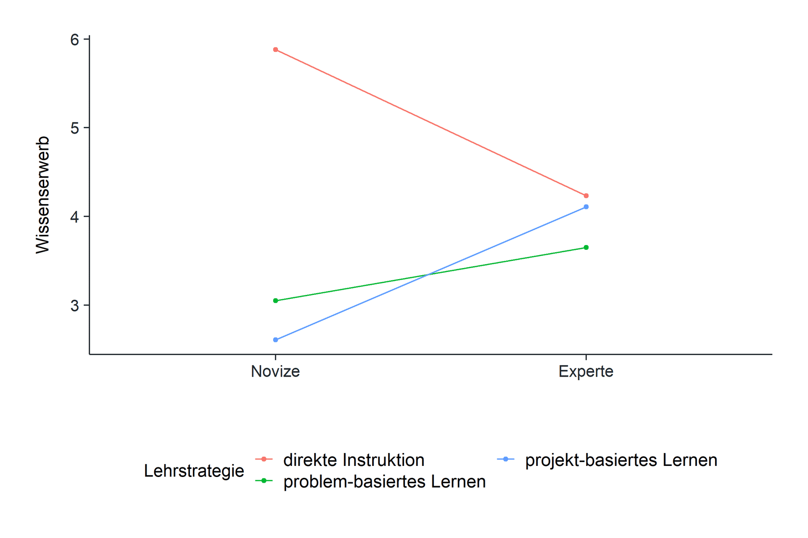
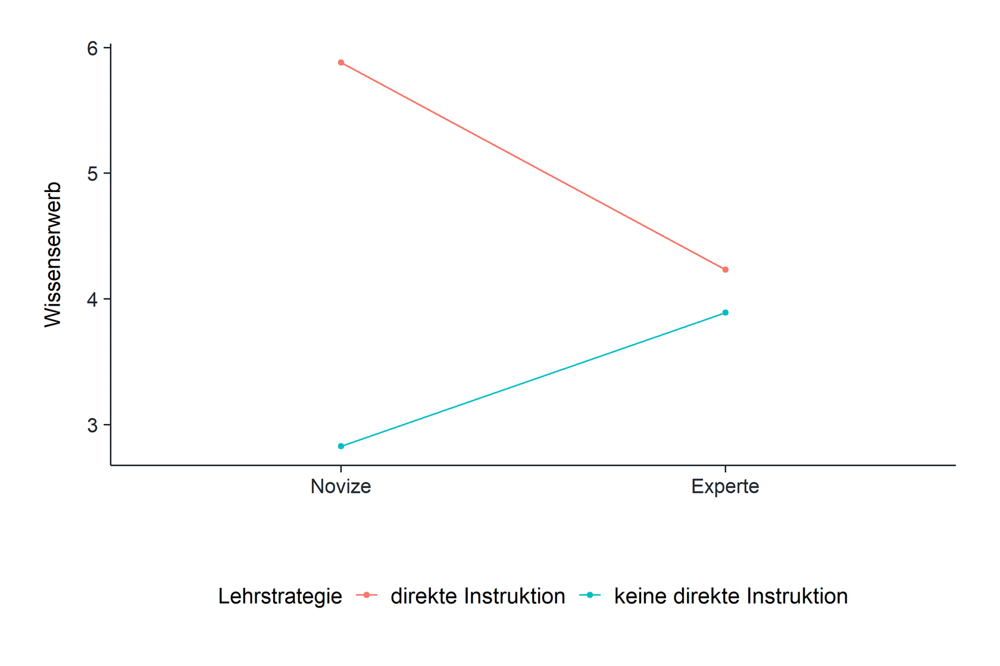
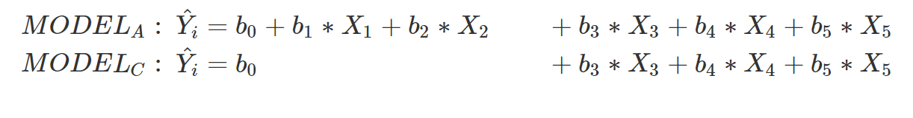
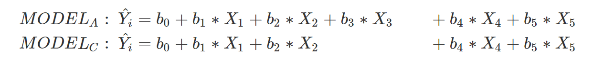
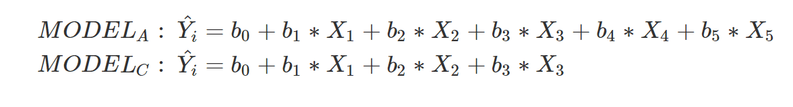
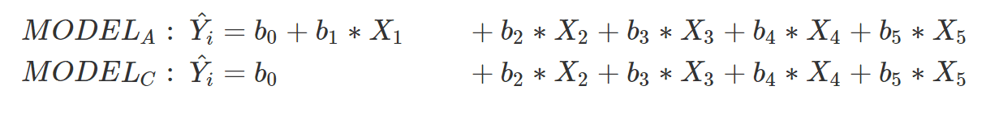

# Mehrfaktorielle Varianzanalyse

## Einführung

Stell dir folgendes Szenario vor: Du hast kürzlich einen Artikel über den [Expertise-Reversal Effect ](https://www.igi-global.com/chapter/expertise-reversal-effect/25732)gelesen. In diesem Artikel wird erläutert, dass manche Lernstrategien für Menschen mit geringem Vorwissen  in einem Thema effektiver sind als für Menschen mit hohem Vorwissen. Eine Woche später sitzt du in einem Seminar über Lehrstrategien. Deine Dozentin stellt dir drei verschiedene Lehrstrategien vor. Problembasiertes Lernen, projektbasiertes Lernen und die direkte Instruktion. Beim Problembasiertes Lernen werden Lernende angeleitet, Probleme in Kleingruppen gemeinsam zu lösen. Das Lehrarrangement ist so gestaltet, dass die Lehrkraft minimal instruiiert und den Lernenden Ressourcen an die Hand gibt, mit denen sie die Probleme selbstständig lösen können ([Hmelo-Silver, 2004](https://link.springer.com/article/10.1023/B:EDPR.0000034022.16470.f3)). Projektbasiertes Lernen hat einen ähnlichen Ansatz, nur dass dort anstatt Probleme gelöst, Projekt entwickelt werden ([Barron et al., 1998](https://www.tandfonline.com/doi/pdf/10.1080/10508406.1998.9672056)). Bei der direkten Instruktion ist das Lehrarrangement sehr stark strukturiert, indem die Lehrkraft Kurzvorträge hält, den Lernenden geeignete Übungen und Feedback über diese Übungen gibt ([Magliaro et al., 2005](https://idp.springer.com/authorize/casa?redirect_uri=https://link.springer.com/content/pdf/10.1007/BF02504684.pdf&casa_token=ncmTmVyuUXoAAAAA:kCuPDmzPRbwu9gxX6xBb1rZtMyB_PprxXVmmTyiYPeRgGavyrsZKjBQ6eHmqLxU9wkdh13-8gemuYf30kQ)). Nach dem Seminar überlegst du, ob die Idee des Expertise-Reversal Effects und der drei Lehrstrategien nicht miteinander kombiniert werden könnte. Du glaubst, dass Noviz\*innen, also Menschen mit geringem Vorwissen in einem Thema, mehr von der direkten Instruktion und weniger von projekt- und problemorientierten Lernstrategien profitieren als Expert\*innen. Der Grund für diese Hypothese ist, dass projekt- und problembasiertes Lernen die Noviz\*innen überfordern könnte, da diese Lernenden nicht genug Vorwissen haben, um komplexen Probleme/Projekte zu lösen. Die direkte Instruktion sollte allerdings für Noviz\*innen hilfreich sein, da sie sozusagen "an die Hand genommen" werden und dadurch ein gutes Verständnis des Lernstoffs aufbauen können. Du entscheidest dich, diese Hypothese in deiner Bachelorarbeit zu testen.

> **Die Fragestellung dieses Moduls lautet: Ist direkte Instruktion effektiver als problem- bzw. projektbasiertes Lernen und ist dieser Effekt abhängig vom Vorwissen der Lernenden?**

### Mehrfaktorielle Varianzanalyse

Mit den bisherigen Testverfahren kannst du diese Hypothese allerdings noch nicht testen. Bisher haben wir lediglich die einfaktorielle Varianzanalyse kennen gelernt, mit der wir Gruppenunterschiede eines *Faktors* prüfen können. Ein Faktor ist eine kategoriale Variable, welche verschiedene Ausprägungen hat. Beispielsweise hatten wir im letzten Modul den Faktor Lernstrategie (Concept Map vs. Retrieval Practice) oder Mitschrift (per Hand, per Laptop, per E-Writer) in der einfaktoriellen Varianzanalyse verwendet. Und daher kommt auch der Begriff ein*faktoriell.* Bei der einfaktoriellen Varianzanalyse verwenden wir nur einen Faktor. Um allerdings deine Hypothese zu prüfen, benötigen wir einen weiteren Faktor (Lehrstrategie und Expertise). In diesem Modul werden wir daher lernen, wie eine mehrfaktorielle Varianzanalyse berechnet wird, indem wir deine Hypothese testen.

### Datensatz

In deiner Bachelorarbeit bist du folgendermaßen vorgegangen: Du hast zunächst Versuchspersonen akquiriert, welche ein unterschiedliches Vorwissen zum Thema natürliche Selektion hatten. Hierzu hast du fortgeschrittene Biologiestudierende (mindestens 5. Fachsemester) und Studienbeginnende des Fachs Biologie rekrutiert. Insgesamt konntest du 76 Personen für dein Experiment gewinnen. Alle Versuchspersonen kamen für zwei Tage in dein Labor. Jede Versuchsperson wurde randomisiert in die drei Lehrgruppen eingeteilt. Zu Beginn des Experiments wurde das Vorwissen der Versuchspersonen zum Thema natürliche Selektion erhoben. Anschließend nahmen die Versuchspersonen pro Tag für vier Stunden an einer Simulation teil, bei der sie in ihrem Lehrsetting unterrichtet wurden. Versuchspersonen in der projekt- und problemorientierten Lernumgebung interagierten in dieser Simulation mit digitalen Kommiliton\*innen, mit welchen sie das Projekt umsetzten bzw. das Problem lösten. Versuchspersonen mit der direkten Instruktion erhielten eine Lernumgebung mit den gleichen Inhalten, allerdings wurden sie von einer digitalen Lehrkraft unterrichtet. Eine Woche nach dem letzten Lehrtag kamen die Versuchspersonen erneut in das Labor und ihr Wissen über natürliche Selektion wurde erneut geprüft.

Den Datensatz für dieses Modul findest du hier:

TODO: Einfügen Datei expert_study.csv

Der Datensatz umfasst folgende sieben Variablen. Wir interessieren uns in diesem Modul für die Variablen expertise, method und improvement:

-   **id**: Die ID der Versuchsperson

-   **expertise**: Ein Faktor, welcher kodiert, ob die Person eine Expertin / ein Experte oder eine Novizin / ein Novize ist.

-   **age**: Das Alter der Person

-   **method**: Ein Faktor, welcher die Lehrstrategie kodiert, welche die Person bekommen hat (direkte Instruktion, problembasiertes Lernen, projektbasiertes Lernen)

-   **test_prior**: Das Vorwissen der Testperson zum Thema natürliche Selektion

-   **test_delay**: Das Wissen zum Thema natürliche Selektion der Person eine Woche nach dem Ende der Lehrsituation

-   **improvement**: Die Differenz zwischen dem Wissen am Ende des Experiments (test_delay) und dem Wissen vor dem Experiment (test_prior). Höhere Werte bedeuten, dass die Person mehr Wissen erworben hat.

## Mehrfaktorielle Versuchsdesigns

Hörst du Wissenschaftler\*innen zu, sprechen sie manchmal von einem *2x2* (zwei mal zwei), *2x3* oder auch einem *3x3* Design. Was sie damit meinen ist, dass das Versuchsdesign mehrere Faktoren beeinhaltet, die verschiedene Ausprägungen haben.

### Einfaktorielle Designs

Versuchen wir uns dieser Idee anzunäheren und beginnen wir mit einem *2 Design*. In diesem Design gibt es nur einen Faktor, welcher allerdings verschiedene Ausprägungen hat. Zum Beispiel haben wir im letzten Modul getestet, ob Studierende, die sich testen ( (Retrieval Practice), mehr konzeptuelles Wissen erlernen als Studierende, die eine Concept Map erstellen:

| **Faktor Lernstrategie:** | Retrieval Practice | Concept Map |
|---------------------------|:------------------:|:-----------:|

Ein solches Design nennen wir einfaktorielles Design. Wir könnten auch sagen, es ist ein *2 Design*. Im letzten Modul haben wir ebenso die Hypothese getestet, ob sich Studierende, die per Hand mitschreiben, sich mehr an die Inhalte aus einem Vortrag erinnern als Studierende, die mit einem Laptop oder E-Writer mitschreiben:

+------------------------+----------+-------------+--------------+
| **Faktor Mitschrift:** | per Hand | per Laptop\ | per E-Writer |
+------------------------+----------+-------------+--------------+

+========================+:========:+:===========:+==============+ +------------------------+----------+-------------+--------------+

Dieses Design könnn wir als *3 Design* bezeichnen, da der eine Faktor drei Ausprägungen hat.

### Zweifaktorielles Design

Nun, in unserer Fragestellung haben wir zwei Faktoren, das Vorwissen und die Lehrstrategie. Daher sprechen wir von einem zweifaktoriellen Design. Grafisch können wir diese Faktoren wie folgt darstellen:

+---------+---------------------------+---------------------------+---------------------+
| **-**   | projektbasiertes Lernen\\ | problembasiertes Lernen\\ | direkte Instruktion |
+=========+:=========================:+:=========================:+:===================:+
| Experte | \-                        | \-                        | \-                  |
+---------+---------------------------+---------------------------+---------------------+
| Novize\ | \-                        | \-                        | \-                  |
+---------+---------------------------+---------------------------+---------------------+

Ein solches Design nennt man *3x2 Design*, da es zwei Faktoren umfasst und diese Faktoren drei und zwei Ausprägungen haben. Der Faktor Lehrsetting hat drei Ausprägungen (projektbasiertes Lernen, problembasiertes Lernen, direkte Instruktion) und der Faktor Vorwissen hat zwei Ausprägungen (Experte, Novize). 

Ein weiteres zweifaktorielles Design könnte wie folgt aussehen:

+-------------------------+------------------+------------+
| **-**                   | Schweinebraten\\ | Eiscreme\\ |
+=========================+:================:+:==========:+
| Schokoladensauße\       | \-               | \-         |
+-------------------------+------------------+------------+
| keine Schokoladensauße\ | \-               | \-         |
+-------------------------+------------------+------------+

Ein solches Design nennt man *2x2 Design*. Der erste Faktor Essen kodiert, ob Versuchspersonen einen Schweinebraten oder eine Eiscreme essen. Der zweite Faktor Sauße kodiert, ob Versuchspersonen auf diesem Essen Schokoladensauße erhalten oder nicht. Mit einem solchen Design könnte man beispielsweise testen, ob der positive Effekt von Schokoladensauße auf Essen nur für Eiscreme und nicht für Schweinebraten gilt. Man würde erwarten, dass Schokosauße auf Schweinebraten nicht schmeckt, während Schokosauße auf Eiscreme durchaus lecker schmeckt.

### Dreifaktorielles Design

Wir könnten diese Idee unendlich weiter spinnen. Beispielsweise in einem dreifaktoriellen Design. Ein *2x3x2 Design* beispielsweise könnte folgendermaßen aussehen: Der erste Faktor kodiert, ob eine Person schon einmal einen Workshop zum Thema Moderation teilgenommen hat oder nicht (2 Ausprägungen). Der zweite Faktor kodiert, welches Training zum Thema Moderation eine Person bekommt (3 Ausprägungen). Der dritte Faktor kodiert, ob der Workshop in zwei Tage aufgeteilt wurde oder nicht (2 Ausprägungen). Ein solches Design ist durchaus komplexer als ein zwei faktorielles Design. Man könnte damit beispielsweise testen, ob die zeitliche Verteilung eines Workshops nur effektiv für Menschen ist, welche ein bestimmtes Training bekommen und gleichzeitig nur für Menschen effektiv ist, die bereits an einem Training teilgenommen haben. Wir werden in diesem Modul auf ein solches Design verzichten und ein klassisches zweifaktorielles Design berechnen.

### Allgemeines zu mehrfaktoriellen Designs

In jedem mehrfaktoriellen Design werden Versuchspersonen in der Regel in Gruppen eingeteilt. Beispielsweise werden bei einem 2x3 Design, Versuchspersonen in sechs Gruppen eingeteilt. Dies gilt allerdings nur, wenn die Versuchspersonen nicht mehrmals getestet werden, sprich wenn es kein [Within-Design](https://www.nngroup.com/articles/between-within-subjects/#:~:text=Between%2Dsubjects%20(or%20between%2D,%2C%20all%20the%20user%20interfaces).) ist. In diesem Kurs testen wir nur Hypothesen, in denen Personen nicht mehrmals getestet wurden, sondern in denen Personen in Gruppen aufgeteilt werden. Ein solches Design nennt man Between-Subjects Design. Genauer würden wir sagen, dass wir in diesem Modul ein *2x3 Between-Subjects Design* testen. Die Anzahl der Gruppen in jedem Between-Subjects Design können wir berechnen, indem wir die Anzahl der Ausprägungen pro Faktor multiplizieren:

| **Design**   | **Anzahl Gruppen** |
|--------------|--------------------|
| 3 Design     | 3                  |
| 2x2 Design   | 4                  |
| 2x3 Design   | 6                  |
| 3x3 Design   | 9                  |
| 2x3x2 Design | 12                 |

Für unser Experiment musst du daher die Versuchspersonen in sechs Gruppen aufteilen. Im nächsten Schritt müssen wir diese Gruppen in numerische Werte überführen und eine Kontrastkodierung bestimmten, um die statistischen Modelle aufzustellen.

## Kontrastkodierung

Das Ziel dieses Submoduls ist es, unsere Alternativhypothese in ein statistisches Modell zu überführen. Hierfür müssen wir zunächst eine Kontrastkodierung wählen, durch die Parameter unseres Modells die Gruppenunterschiede kodieren, welche wir später testen möchten. Beispielsweise werden wir in diesem Modul verstehen, wie die Kontrastkodierung aussehen muss, um zu testen, ob der Effekt der direkten Instruktion im Vergleich zu den anderen beiden Lehrsettings zwischen Expert\*innen und Noviz\*innen unterschiedlich ist. Man nennt diese Methode Interaktion. Beginnen wir mit der Kontrastkodierung, die wir schon kennen.

### Konstrastkodierung Lehrstrategie

In deiner Hypothese gehst du davon aus, dass die direkte Instruktion lernwirksamer ist als problem- bzw. projektbasiertes Lernen. Da der Faktor Lehrstrategie drei Ausprägungen umfasst, benötigst du *k - 1 = 3 - 1 = 2* Prädiktoren, um diesen Faktor im erweiterten Modell zu kodieren. Mit folgender Kontrastkodierung kannst du diese erste Hypothese später testen:

| **Ausprägungen des Faktors** | ***X~1~*** | ***X~2~*** |
|------------------------------|------------|------------|
| direkte Instruktion          | 2 /3       | 0          |
| problembasiertes Lernen      | -1 / 3     | 1 / 2      |
| projektbasiertes Lernen      | -1 / 3     | -1 / 2     |

Du siehst, dass wir für diesen Faktor eine Helmert-Kodierung verwendet haben. Durch die Helmert-Kodierung wird der Parameter *b~1~* den Mittelwertsunterschied zwischen der Gruppe der direkten Instruktion und den anderen beiden Gruppen kodieren. Der Parameter *b~2~* wird den Mittelwertsunterschied zwischen der Gruppe, welche problembasiertes Lernen und der Gruppe, die projektbasiertes Lernen erhält, kodieren.

### Konstrastkodierung Expert\*innen

Weiterhin möchtest du den Mittelwertsunterschied zwischen Expert\*innen und Noviz\*innen kodieren. Da du später wissen möchtest, ob die direkte Instruktion nur für Noviz\*innen und nicht für Expert\*innen wirksam ist, benötigst du eine Kodierung, die den Mittelwertsunterschied von Expert\*innen und Noviz\*innen unterscheidet. Hierfür verwenden wir erneut eine Helmert-Kodierung. Du hast zwei Ausprägungen, daher benötigst du lediglich einen Prädiktor, um diesen Unterschied zu kodieren:

| **Ausprägungen des Faktors** | ***X~3~*** |
|------------------------------|------------|
| Expert\*innen                | 1 / 2      |
| Noviz\*innen                 | -1 / 2     |

### Kodierung der Interaktion

Nun, deine zentrale Fragestellung ist, ob der positive Effekt der direkten Instruktion für Noviz\*innen zu finden ist und bei Expert\*innen ausbleibt. Mit der bisherigen Kontrastkodierung würden wir den einzelnen Gruppen folgende Kontrastgewichte pro Prädiktor zuordnen:

+-----------------------------------------+-----------------------------------------+-----------------------------------------+---------------------------------------+
| **Gruppe**                              | ***X~1~***\                             | ***X~2~***\                             | ***X~3~*****\                         |
|                                         | ~***(direkt. Inst. vs. prob/proj)***~\\ | ~***(problem- vs. projektbasiert)***~\\ | ~*(Expert\*innen vs. Noviz\*innen)*~\ |
|                                         |                                         |                                         | **                                    |
+=========================================+=========================================+=========================================+=======================================+
| Expert\*innen - direkte Instruktion\    | 2 / 3                                   | 0                                       | 1 /2\                                 |
+-----------------------------------------+-----------------------------------------+-----------------------------------------+---------------------------------------+
| Expert\*innen - problembasiertes Leren\ | -1 / 3                                  | 1 / 2                                   | 1 /2                                  |
+-----------------------------------------+-----------------------------------------+-----------------------------------------+---------------------------------------+
| Expert\*innen - projektbasiertes Lernen | -1 / 3                                  | \- 1 / 2                                | 1 /2                                  |
+-----------------------------------------+-----------------------------------------+-----------------------------------------+---------------------------------------+
| Noviz\*innen - direkte Instruktion\     | 2 /3\                                   | 0                                       | -1 / 2                                |
+-----------------------------------------+-----------------------------------------+-----------------------------------------+---------------------------------------+
| Noviz\*innen - problembasiertes Leren\  | -1 / 3\                                 | 1 / 2\                                  | -1 / 2\                               |
+-----------------------------------------+-----------------------------------------+-----------------------------------------+---------------------------------------+
| Noviz\*innen - projektbasiertes Lernen\ | -1 / 3\                                 | \- 1 / 2\                               | -1 / 2                                |
+-----------------------------------------+-----------------------------------------+-----------------------------------------+---------------------------------------+

Bei einer Expertin beispielsweise, die die direkte Instruktion bekommt, würden wir für *X~1~ 2/3*, für *X~2~ 0* und für *X~3~ 1/2* einsetzen. Du siehst anhand der Tabelle ebenso, welche Hypothese wir mit jedem der drei Prädiktoren testen können. Mit Hilfe von *X~1~* beispielsweise können wir testen, ob Versuchspersonen, die direkte Instruktion bekommen, besser abschneiden als Versuchspersonen, die die anderen beiden Strategien erhalten. Ebenso kannst du erkennen, dass wir mit Hilfe von *X~3~* kodieren können, ob sich der Wissenserwerb zwischen den Expert\*innen und den Noviz\*innen unterscheidet. Nun, deine Fragestellung ist allerdings, ob der Effekt, den wir mit *X~1~* kodieren, abhängig vom Effekt ist, den wir mit *X~3~* kodieren? Wir können eine solche *Interaktion* testen, indem wir die Kodierungen der einzelnen Prädiktoren miteinander multiplizieren:

+-----------------------------------------+-----------------------------------------+-----------------------------------------+---------------------------------------+-------------------------------+------------------------------+
| **Gruppe**                              | ***X~1~***\                             | ***X~2~***\                             | ***X~3~*****\                         | ***X~4~*****\                 | ***X~5~*****\                |
|                                         | ~***(direkt. Inst. vs. prob/proj)***~\\ | ~***(problem- vs. projektbasiert)***~\\ | ~*(Expert\*innen vs. Noviz\*innen)*~\ | ~*(X1 abhängig von X3)*~\     | ~*(X2 abhängig von X3)*~**   |
|                                         |                                         |                                         | **                                    | **                            |                              |
+=========================================+=========================================+=========================================+=======================================+===============================+==============================+
| Expert\*innen - direkte Instruktion\    | 2 / 3                                   | 0                                       | 1 /2\                                 | (2 / 3) \* (1 / 2) = 0.33\    | 0 \* (1 / 2) = 0\            |
+-----------------------------------------+-----------------------------------------+-----------------------------------------+---------------------------------------+-------------------------------+------------------------------+
| Expert\*innen - problembasiertes Leren\ | -1 / 3                                  | 1 / 2                                   | 1 /2                                  | (-1 / 3) \* (1 / 2) = -0.167\ | (1 /2 ) \* (1 / 2) = 0.25    |
+-----------------------------------------+-----------------------------------------+-----------------------------------------+---------------------------------------+-------------------------------+------------------------------+
| Expert\*innen - projektbasiertes Lernen | -1 / 3                                  | \- 1 / 2                                | 1 /2                                  | (-1 / 3) \* (-1 / 2) = 0.167\ | (-1 /2 ) \* (1 / 2) = -0.25\ |
+-----------------------------------------+-----------------------------------------+-----------------------------------------+---------------------------------------+-------------------------------+------------------------------+
| Noviz\*innen - direkte Instruktion\     | 2 /3\                                   | 0                                       | -1 / 2                                | (2 / 3) \* 0 = 0\             | 0 \* (-1 / 2) = 0\           |
+-----------------------------------------+-----------------------------------------+-----------------------------------------+---------------------------------------+-------------------------------+------------------------------+
| Noviz\*innen - problembasiertes Leren\  | -1 / 3\                                 | 1 / 2\                                  | -1 / 2\                               | (-1 / 3) \* (-1 / 2) = 0.167\ | (1 /2 ) \* (-1 / 2) = -0.25\ |
+-----------------------------------------+-----------------------------------------+-----------------------------------------+---------------------------------------+-------------------------------+------------------------------+
| Noviz\*innen - projektbasiertes Lernen\ | -1 / 3\                                 | \- 1 / 2\                               | -1 / 2\                               | (-1 / 3) \* (-1 / 2) = 0.167\ | (-1 /2 ) \* (-1 / 2) = 0.25  |
+-----------------------------------------+-----------------------------------------+-----------------------------------------+---------------------------------------+-------------------------------+------------------------------+

Nun, diese Tabelle ist auf den ersten Blick vermutlich verwirrend. Was haben wir hier gemacht? Formal haben wir nichts anderes gemacht, als die Kodierungen für die Prädiktoren zwischen den Gruppen miteinander multipliziert. Man nennt ein solches Verfahren eine Interaktion. Genauer haben wir *X~1~* mit *X~3~* und *X~2~* mit *X~3~* multipliziert. Da wir fünf Prädiktoren haben, ergibt sich daraus folgendes erweitertes Modell:

Die Parameter in diesem Modell haben nun folgende Bedeutung:

-   *b~0~*: Der Mittelwert der Mittelwert der aller Gruppen (siehe sechs Gruppen in der oberen Tabelle)\*\

    -   

-   *b~1~*: Der Mittelwertsunterschied zwischen den Gruppen, welche die direkte Instruktion erhalten haben, und den anderen beiden Lehrstrategiegruppen.

-   *b~2~*: Der Mittelwertsunterschied zwischen den Gruppen, welche problembasiertes Lernen erhalten haben, und den Gruppen, welche projektbasiertes Lernen erhalten haben.

-   *b~3~*: Der Mittelwertsunterschied zwischen den Expertengruppen und den Novizengruppen

-   *b~4~*: Differenz der Mittelwertsunterschiede der direkten Instruktion und den anderen beiden Lehrstrategien zwischen den Expert\*innen und den Noviz\*innen? In anderen Worten: Ist der Mittelwertsunterschied, der in *b~0~* kodiert ist, zwischen Expert\*innen und Noviz\*innen gleich? Oder, profitieren Noviz\*innen mehr von der direkten Instruktion als Expert\*innen ?

-   *b~5~*: Differenz der Mittelwertsunterschiede des problembasierten Lernens und des projektbasierten Lernens zwischen den Expert\*innen und den Noviz\*innen? In anderen Worten: Ist der Mittelwertsunterschied, der in *b~1~* kodiert ist zwischen Expert\*innen und Noviz\*innen gleich? Oder, profitieren Noviz\*innen mehr von problembasiertem Lernen als von projektbasiertem Lernen als Expert\*innen?

Insbesondere die letzten beiden Parameter sind nun interessant. Um diese besser zu verstehen, schauen wir uns ein Liniendiagramm der Mittelwert der sechs Gruppen an:

Und schauen wir *b~4~ genauer an~.~* Dieser Parameter zeigt die Differenz zwischen dem Mittelwertsunterschied der direkten Instruktion und den anderen beiden Lehrstrategien bei den Noviz\*innen und dem Mittelwertsunterschied der direkten Instruktion und den anderen beiden Lehrstrategien bei den Expert\*innen an. In der Grafik erkennst du bereits, dass Noviz\*innen mehr von der direkten Instruktion profitiert haben als von den anderen beiden Lehrstrategien. Bei den Expert\*innen war dies nicht der Fall, da die Mittelwerte aller Lehrstrategiegruppen sehr nah beieinander liegen. Wir können dies noch genauer zeigen, indem wir nur die beiden Lehrstrategien betrachten:

Schätzen wir einmal die Mittelwertsunterschiede zwischen beiden Gruppen. Bei den Noviz\*innen lag der Wissenserwerb derjenigen, welche die direkte Instruktion bekommen haben, bei etwa 5.9. Der Mittelwert der anderen beiden Lehrstrategien der Noviz\*innen lag bei etwa 2.8. Bei den Expert\*innen lag der Wissenserwerb derjenigen, welche die direkte Instruktion bekommen haben, bei etwa 4.2. Der Mittelwert der anderen beiden Lehrstrategien der Expert\*innen lag bei etwa 3.9. Berechnen wir die Differenz dieser Werte zwischen den beiden Gruppen:

+---------------+-------------------------+-------------------------------+-----------------+
| **-**         | **direkte Instruktion** | **keine direkte Instruktion** | **Differenz**\\ |
+===============+=========================+===============================+=================+
| Noviz\*innen  | 5.9                     | 2.8                           | 3.1             |
+---------------+-------------------------+-------------------------------+-----------------+
| Expert\*innen | 4.2                     | 3.9                           | 0.3             |
+---------------+-------------------------+-------------------------------+-----------------+
| Differenz\    | 5.9 - 4.2 = 1.9         | 2.8 - 3.9 = -1.1              | **2.8**         |
+---------------+-------------------------+-------------------------------+-----------------+

Uns interessiert insbesondere die grüne Zelle. Dies ist der Mittelwertsunterschied der beiden Mittelwertsunterschiede voneinander. Die direkte Instruktion bei den Noviz\*innen im Vergleich zu den anderen beiden Lehrstrategien war demnach um 2.8 Punkte höher als bei den Expert\*innen. Und genau dies drückt der Parameter *b~4~* nun durch unsere Interaktion aus. 

Das erweiterte Modell, welches sich aus unserer Kontrastkodierung ergibt, sieht wie folgt aus:

Wie du siehst, liegt *b~4~* bei 2.70. Der kleine Unterschied von 2.8 zu 2.7 liegt an Rundungsfehlern. Der Parameter der anderen Interaktion liegt bei 0.90. Mit diesem Modell sind wir nun in der Lage, folgende Hypothesen zu testen, indem wir einzelne Parameter auf 0 schalten:

-   *b~1~* (1.703) auf 0: Ist die direkte Instruktion lernförderlicher als die anderen beiden Lehrstrategien?

-   *b~2~* (-0.008) auf 0: Ist problembasiertes Lernen lernförderlicher als projektbasiertes Lernen?

-   *b~3~* (-0.15) auf 0: Ist der Wissenserwerb bei Expert\*innen höher/unterschiedlich als bei Noviz\*innen?

-   *b~4~* (2.70) auf 0: Ist der Effekt der direkten Instruktion bei den Noviz\*innen größer/unterschiedlich als bei den Expert\*innen?

-   *b~5~* (0.90) auf 0: Ist der Effekt des problembasierten Lernens gegenüber dem projektbasierten Lernen bei den Noviz\*innen größer/unterschiedlich als bei den Expert\*innen?

Wir werden im folgenden einzelne dieser Parameter auf 0 schalten und demnach verschiede Hypothesen testen. Dabei werden wir sowohl Haupteffekte, Interaktionen, Simple Effects als auch Kontraste testen. Bei jedem dieser Verfahren werden wir andere Parameter auf 0 schalten.

### Zusammenfassung

In diesem Submodul haben wir gezeigt, wie man mehrere Faktoren als Konstrastkodierung in ein erweitertes Modell integrieren kann. Dabei haben wir festgestellt, dass wir für jeden einzelnen Faktor die gleiche Kontrastkodierung verwenden können, welche wir im letzten Modul kennen gelernt haben. Ebenso konnten wir zeigen, dass wir durch die Multiplikation der Kontraste sogenannte Interaktionen berechnen können. Interaktionen ermöglichen uns, zu überprüfen, wie unterschiedlich bestimmte Mittelwertsunterschiede zwischen den Ausprägungen eines anderen Faktors sind. Durch dieses Verfahren können wir unseren statistischen Werkzeugkasten erweitern, indem wir spezifischere Hypothesen testen können. Dies werden wir nachfolgend tun.

## Statistisches Hypothesentesten: Haupteffekte

In der mehrfaktoriellen Varianzanalyse wird meist zwischen Haupteffekten und Interaktionen unterschieden. Ein Haupteffekt prüft, ob es Gruppenunterschiede *innerhalb* eines Faktors gibt. In unserem Beispiel haben wir zwei Faktoren (Lehrstrategien und Expertise). Das heißt, wir können zwei Haupteffekte berechnen. Haupteffekte sind demnach von der Logik nichts anderes als die einfaktorielle Varianzanalyse, allerdings in einem Modell, welches mehrere Faktoren umfasst.

### Haupteffekt des Faktors Lehrstrategie

Beginnen wir mit dem ersten Faktor. Im letzten Submodul haben wir das erweiterte Modell aufgestellt, mit Hilfe dessen wir unsere Hypothesen testen können. Nun geht es darum, ein kompaktes Modell zu wählen, welches es uns ermöglicht, diese Hypothesen zu testen und die Wahrscheinlichkeit für den entsprechenden *F*-Wert zu berechnen. Für den Haupteffekt müssen wir immer alle Parameter eines Faktors im kompakten Modell auf 0 setzen. Da wir drei Gruppen des Faktors Lehrstrategie haben, wird dieser Faktor durch zwei Prädiktoren kodiert. Daher müssen wir die Parameter, die die Gruppenunterschiede der Lehrstrategien kodieren, auf 0 setzen:

Durch diese Modelle können wir nun testen, ob es Mittelwertsunterschiede zwischen den drei Lehrstrategiegruppen gibt. Wohlgemerkt sagt uns dieser Test nicht, welche Gruppen sich voneinander unterscheiden. Wir wissen aber, dass wir den Gruppenunterschied zwischen der direkten Instruktion und den anderen beiden Lehrstrategien testen könnten, wenn wir nur *b~1~* auf 0 setzen. Hier sind die Ergebnisse des Hauptfaktors Lehrstrategie:

+-------------------------------------------------+-----------+-------------+----------+---------+---------+-----------+
| **Source**                                      | ***SS***  | ***df***    | ***MS*** | ***F*** | ***p*** | ***PRE*** |
+=================================================+===========+=============+==========+=========+=========+===========+
| Reduktion der Fehler durch das erweiterte Model | 49.68     | 6 - 4 = 2\  | 24.84    | 4.62    | .013    | 0.117     |
+-------------------------------------------------+-----------+-------------+----------+---------+---------+-----------+
| Error                                           | 376.329   | 76 - 6 = 70 | 5.38     | \-      | \-      | \-        |
+-------------------------------------------------+-----------+-------------+----------+---------+---------+-----------+
| Total Error\                                    | 426.0085\ | 76 - 4 = 72 | \-       | \-      | \-      | \-        |
+-------------------------------------------------+-----------+-------------+----------+---------+---------+-----------+

Mehrere Dinge sind hier wichtig. Zunächst sind die Freiheitsgrade der Modelle etwas schwieriger zu berechnen. Das erweiterte Modell hat sechs Parameter und 76 Datenpunkte (Versuchspersonen). Daher können in dieses Modell noch 70 Parameter hinzugefügt werden. Im kompakten Modell sind es zwei Parameter mehr, die hinzufügt werden können, da es zwei Parameter weniger hat als das erweiterte Modell.  *PRE* liegt bei 0.117. Damit sagen wir, dass das erweiterte Modell 11.7% der Fehler des kompakten Modells erklärt (bzw. der Varianz erklärt). Ansonsten erkennen wir, dass es einen signifikanten Effekt gibt. Das heißt, wir lehnen die Annahme ab, dass sich die drei Gruppenmittelwerte nicht voneinander unterscheiden.

Wenn du die Ergebnisse händisch in R nachrechnen möchtest, findest du das Skript hier:

TODO: Einfügen Datei haupteffekt_lehrstrategien.R

### Haupteffekt des Faktors Expertise

Ganz ähnlich können wir vorgehen, um zu überprüfen, ob der Wissenserwerb der Expert\*innen größer war als der Wissenserwerb der Noviz\*innen. In diesem Fall müssen wir nur den Parameter b3 auf 0 setzen, da bei zwei Gruppen ein Prädiktor genügt, um den Gruppenunterschied dieser beiden Gruppen zu kodieren:

Ein *F*-Test mit diesem Modellpaar ergibt folgendes Ergebnis:

+-------------------------------------------------+----------+-------------+----------+---------+---------+-----------+
| **Source**                                      | ***SS*** | ***df***    | ***MS*** | ***F*** | ***p*** | ***PRE*** |
+=================================================+==========+=============+==========+=========+=========+===========+
| Reduktion der Fehler durch das erweiterte Model | 0.43     | 6 - 5 = 1\  | 0.43     | 0.08    | .79     | 0.001     |
+-------------------------------------------------+----------+-------------+----------+---------+---------+-----------+
| Error                                           | 376.329  | 76 - 6 = 70 | 5.38     | \-      | \-      | \-        |
+-------------------------------------------------+----------+-------------+----------+---------+---------+-----------+
| Total Error\                                    | 376.76\  | 76 - 5 = 71 | \-       | \-      | \-      | \-        |
+-------------------------------------------------+----------+-------------+----------+---------+---------+-----------+

Wir finden einen nicht-signifikanten Effekt. Das heißt, wir gehen weiterhin davon aus, dass der Wissenserwerb (unsere abhängige Variable) sich nicht zwischen den Expert\*innen und Noviz\*innen unterscheidet. Der Effekt ist zudem minimal, da das erweiterte Modell nur 0.1% der Varianz im kompakten Modell aufklärt.

Wenn du die Ergebnisse händisch in R nachrechnen möchtest, findest du das Skript hier:

TODO: Einfügen Datei haupteffekt_expertise.R

### Zusammenfassung

In diesem Submodul haben wir die Haupteffekte der mehrfaktoriellen Varianzanalyse berechnet. Wir haben gesehen, dass wir für jeden Faktor einen Haupteffekt berechnen können. Bei einem Haupteffekt werden zudem alle Parameter eines Faktors auf 0 gesetzt. Dies hat zur Folge, dass bei mehr als zwei Gruppen innerhalb eines Faktors keine Aussagen über die spezifischen Mittelwertsunterschiede gemacht werden können. Wir haben zudem heraus gefunden, dass die Annahme direkte Instruktion ist genauso lehrreich wie problem- oder projektbasiertes Lernen unhaltbar ist. Wir haben ebenso heraus gefunden, dass der Wissenszuwachs bei Expert\*innen und Noviz\*innen gleich war. Als nächstes berechnen wir den Interaktionseffekt.

## Statistisches Hypothesentesten: Interaktionseffekt

Fragen wir uns nun, ob der Effekt der Lehrstrategie (zwischen den drei Gruppen) abhängig von der Expertise der Personen ist. Wir werden im Übrigen in diesem Submodul unsere Fragestellung noch nicht zufriedenstellend beantworten können. Dies liegt darin, dass wir in diesem Submodul die Interaktion der beiden Haupteffekte testen. Hierdurch kommen wir zwar der Antwort unserer Fragestellung näher, es ist allerdings nicht die Antwort, welche wir schlussendlich wissen wollen. In zwei Submodulen werden wir eine schlauere Antwort erhalten. Beginnen wir aber mit dem Interaktionseffekt.

Bei einem Interaktionseffekt prüfen wir in der Regel die Interaktion aller Faktoren miteinandern. Im statistischen Modell gesprochen, schalten wir daher alle Interaktionen auf 0:

> **Der Interaktionseffekt** beantwortet die Frage, ob ein Effekt von den Ausprägungen eines anderen Faktors abhängig ist.

Wie du erkennst, haben wir die Parameter *b~4~* und *b~5~* auf 0 geschaltet. Mit dem zugehörigen *F*-Test prüfen wir, ob der Haupteffekt der Lehrstrategie abhängig ist von der Expertise der Personen. Wir wissen aber auch, dass der Haupteffekt nur sagt, dass sich Gruppen voneinander unterscheiden, nicht, welche Gruppen sich voneinander unterscheiden. Bei einem signifikanten Effekt können wir daher lediglich sagen, dass es beispielsweise bei den Noviz\*innen einen Effekt der Lehrstrategien gibt, nicht aber bei den Expert\*innen. Testen wir diese Annahme:

| **Source**                                      | ***SS*** | ***df***\\  | ***MS*** | ***F*** | ***p*** | ***PRE*** |
|-------------------------------------------------|----------|-------------|----------|---------|---------|-----------|
| Reduktion der Fehler durch das erweiterte Model | 33.90    | 6 - 4 = 2   | 16.95    | 3.15    | 0.049   | 0.08      |
| Error                                           | 376.33   | 76 - 6 = 70 | 5.38     | \-      | \-      | \-        |
| Total Error                                     | 410.23   | 76 - 4 = 72 | \-       | \-      | \-      | \-        |

Tatsächlich, wir finden einen signifikanten Effekt. Der Effekt der Lehrstrategie ist von der Expertise der Personen abhängig. Du siehst allerdings auch, dass der *p*-Wert gerade unter dem Alpha-Niveau liegt. Läge der p-Wert bei 0.051, würden wir die Nullhypothese annehmen. Da der *p*-Wert allerdings drei Nachkommastellen kleiner ist, lehnen wir die Nullhypothese ab. Wenn dir das spitzfindig erscheint, ist dem auch so. Beachte allerdings, dass wir eine Hypothese nicht mit einem Test widerlegen können. Wiederholen wir viele dieser Tests werden wir mit der Dauer die richtigen Entscheidungen treffen (sofern der Test richtig konstruiert ist; z.B. wenn er eine ausreichend große Power hat). Dabei kann es durchaus sein, dass wir wie in diesem Beispiel eine knappe Entscheidung treffen müssen. Egal wie der *p*-Wert ausfällt, wir treffen die Entscheidung auf der Grundlage unseres Alpha-Niveaus. Daher lehnen wir in diesem Fall die Nullhypothese ab. Im Übrigen versuchen Wissenschaftler\*innen häufig verzweifelt, dennoch von einem signifikanten Effekt zu sprechen, wenn der *p*-Wert bei 0.051 oder ähnlich liegt. Eine amüsante Liste, welche Ausdrücke Wissenschaftler\*innen dafür verwenden, findest du [hier](https://mchankins.wordpress.com/2013/04/21/still-not-significant-2/). Diese Versuche sind allerdings fehl am Platz und sollten nicht praktiziert werden.

Wenn du die Berechnungen in R nachvollziehen möchtest, schau dir das folgende Skript an:

TODO: Einfügen Datei interaktionseffekt.R

### Zusammenfassung

Wir haben nun gezeigt, wie wir den Interaktionseffekt bei einer mehrfaktoriellen Varianzanalyse berechnen können. Die Logik ist wie immer die gleiche wie bei jedem anderen Test. Wir setzen bestimmte Parameter auf 0 und berechnen aus den beiden Modellen einen *F*-Test. Wir mussten bei diesem Test allerdings feststellen, dass wir unsere Hypothese noch nicht zufriedenstellend beantworten können. In zwei Submodulen werden wir erfahren, wie dies geht. Im nächsten Submodul zeigen wir erstmal, wie wir mit signifikanten Interaktionseffekten umgehen.

## Statistisches Hypothesentesten: Simple Effects

Du hast einen signifikanten Interaktionseffekt gefunden, was nun? Wir wollten ursprünglich wissen, ob der Effekt der direkten Instruktion abhängig ist von der Expertise der Lernenden. Diese Hypothese werden wir durch Simple Effects nicht prüfen können, wir werden allerdings folgende Frage beantworten können: Unterscheidet sich die Lernwirksamkeit der drei Lehrstrategien bei den Expert\*innen und unterscheidet sich die Lernwirksamkeit der drei Lehrstrategien bei den Noviz\*innen? Du siehst, dass wir zwei Fragestellungen testen. Dies tun wir, indem wir zwei *F*-Tests für jeweils nur eine Ausprägung des Faktors Expertise machen. Das heißt, wir rechnen zwei einfaktorielle Varianzanalysen. Eine für die Noviz\*innen und eine für die Expert\*innen. Ist der Effekt bei den Noviz\*innen signifikant und nicht bei den Expert\*innen, können wir sagen, dass bestimmte Lehrstrategien bei den Noviz\*innen wirksamer sind als andere und dass die Wahl der Lehrstrategie bei den Expert\*innen keinen Unterschied macht.

### Simple Effekt der Noviz\*innen

Berechnen wir daher den ersten Simple Effekt. Wir filtern hierzu den Datensatz um alle Personen, die Noviz\*innen sind. Hierdurch haben wir nicht mehr 76 Personen, sondern 43 Personen im Datensatz. Danach berechnen wir eine einfaktorielle Varianzanalyse, wie wir sie im vorherigen Modul kennen gelernt haben:

Der zugehörige *F*-Test ergibt folgendes Ergebnis:

+-------------------------------------------------+----------+--------------+----------+---------+---------+-----------+
| **Source**                                      | ***SS*** | ***df***     | ***MS*** | ***F*** | ***p*** | ***PRE*** |
+=================================================+==========+==============+==========+=========+=========+===========+
| Reduktion der Fehler durch das erweiterte Model | 92.32    | 3 - 1 = 2    | 46.16    | 10.64   | \< .001 | 0.347     |
+-------------------------------------------------+----------+--------------+----------+---------+---------+-----------+
| Error                                           | 173.53   | 43 - 3 = 40\ | 4.34     | \-      | \-      | \-        |
+-------------------------------------------------+----------+--------------+----------+---------+---------+-----------+
| Total Error\                                    | 265.85   | 43 - 1 = 42  | \-       | \-      | \-      | \-        |
+-------------------------------------------------+----------+--------------+----------+---------+---------+-----------+

Wir finden einen signifikanten Effekt. Das heißt, wir gehen davon aus, dass die Lehrstrategien bei den Noviz\*innen unterschiedlich wirksam sind.

In folgendem Skript kannst du die einzelnen Berechnungen in R nachvollziehen, wenn du möchtest:

TODO: Einfügen Datei simple_effect_novizen.R

### Simple Effect der Expert\*innen

Ganz ähnlich gehen wir nun für die Expert\*innen vor. Wir filtern zunächst den Datensatz um alle Personen, die Expert\*innen sind. Dieser Datensatz umfasst 33 Personen. Das Modellpaar ist das gleiche wie beim Simple Effekt der Noviz\*innen. Folgendes Ergebnis erhalten wir auf Grundlage der Daten und des Modellpaares:

+-------------------------------------------------+----------+--------------+----------+---------+---------+-----------+
| **Source**                                      | ***SS*** | ***df***     | ***MS*** | ***F*** | ***p*** | ***PRE*** |
+=================================================+==========+==============+==========+=========+=========+===========+
| Reduktion der Fehler durch das erweiterte Model | 2.00     | 3 - 1 = 2    | 1.00     | 0.148   | 0.863   | 0.009     |
+-------------------------------------------------+----------+--------------+----------+---------+---------+-----------+
| Error                                           | 202.80   | 33 - 3 = 30\ | 6.76     | \-      | \-      | \-        |
+-------------------------------------------------+----------+--------------+----------+---------+---------+-----------+
| Total Error\                                    | 204.80   | 33 - 1 = 32  | \-       | \-      | \-      | \-        |
+-------------------------------------------------+----------+--------------+----------+---------+---------+-----------+

Nun sehen wir, dass es keinen signifikanten Effekt gibt. Die Wahl der Lernstrategie beeinflusst bei Expert\*innen den Wissenszuwachs nicht. Der Effekt ist zudem minimal (0.9% der Varianz wird aufgeklärt).

In folgendem Skript kannst du die einzelnen Berechnungen in R nachvollziehen, wenn du möchtest:

TODO: Einfügen Datei simple_effect_experts.R

### Zusammenfassung

Wir haben nun die signifikante Interaktion aus dem vorherigen Modul aufgelöst, indem wir gezeigt haben, dass es einen signifkanten Effekt bei den Noviz\*innen, aber nicht bei den Expert\*innen gibt. Anscheinend wirken manche Lernstrategien bei den Noviz\*innen besser als andere. Wie bereits eingangs beschrieben, beantwortet selbst diese Analyse unsere Fragestellung nicht. Wir wollten wissen, ob die direkte Instruktion (im Vergleich zu den anderen beiden Lernstrategien) bei den Noviz\*innen wirksamer ist als bei den Expert\*innen. Dies können wir abschließend im nächsten Submodul beantworten, indem wir eine Kontrastanalyse mit Hilfe nur einer Interaktion berechnen.

## Statistisches Hypothesentesten: Spezifischer Interaktionskontrast

Erinnern wir uns an die zu Beginn des Moduls gestellte Fragestellung:

> **Die Fragestellung dieses Moduls lautet: Ist direkte Instruktion effektiver als problem- bzw. projektbasiertes Lernen und ist dieser Effekt abhängig vom Vorwissen der Lernenden?**

Ehrlich gesagt, haben wir weder die erste noch die zweite Frage bisher beantwortet. Der Haupteffekt der Lehrstrategie konnte uns zeigen, dass die Wahl der Lehrstrategie einen Unterschied auf den Wissenszuwachs hat. Allerdings wissen wir nicht, welche Lehrstrategie welchen Unterschied macht. Ebenso konnten wir zwar einen Interaktionseffekt finden, wir wissen allerdings nicht, ob nun die direkte Instruktion bei den Noviz\*innen im Vergleich zu den Expert\*innen besser wirkt. Wir werden daher jetzt diese beiden Fragestellungen testen, indem wir spezifische Kontraste rechnen. Wir sprechen immer von spezifischen Kontrasten, wenn das erweiterte Modell genau einen Freiheitsgrad mehr hat als das kompakte Modell. Beginnen wir mit der ersten Frage: Ist die direkte Instruktion lernwirksamer als problem- bzw. projektbasiertes Lernen?

### direkte Instruktion vs. problem- bzw. projektbasiertes Lernen

Als wir das erweiterte Modell aufgestellt haben, hatten wir eine Helmert-Kontrastkodierung für den Faktor Lehrstrategie gewählt, bei der der Parameter *b~1~* für den Mittelwertsunterschied zwischen der direkten Instruktion und den anderen beiden Lehrstrategiegruppen steht. Durch diese clevere Konstruktion der Kontraste können wir *b~1~* auf 0 setzen und testen, ob die Lehrstrategie direkte Instruktion lernwirksamer ist als die andere beiden Lehrstrategien. Das tun wir, indem wir prüfen, wie wahrscheinlich es ist, dass die Mittelwerte sich so weit voneinander unterschieden, wenn es in Wirklichkeit keinen Unterschied macht, welche Lehrstrategie benutzt wird. Dementprechend sehen unsere Modellpaare wie folgt aus:

