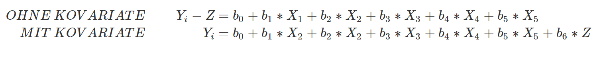

# ANCOVA

## Einführung 

Bisher haben wir Hypothesen getestet, in deren Modellen entweder nur kontinuierliche oder nur diskrete Prädiktoren eingesetzt wurden. Bei der linearen Regression haben wir kontinuierliche Prädiktoren verwendet, bei der ein- und mehrfaktoriellen Varianzanalyse diskrete Prädiktoren. Dies wird sich in diesem Modul ändern. Unser Ziel in diesem Modul ist es, die gleiche Fragestellung aus dem letzten Modul zu beantworten, nur diesmal, indem wir ein erweitertes Modell verwenden, das sowohl diskrete als auch kontinuierliche Prädiktoren umfasst. Solche Modelle werden als Kovarianzanalysen (ANCOVAs) bezeichnet. Übersetzt können wir eine ANCOVA auch als eine Varianzanalyse mit Kovariaten (stetig skalierte Variablen) bezeichnen. Erinnern wir uns erneut an die Fragestellung aus dem letzten Modul:

> **Ist direkte Instruktion effektiver als problem- bzw. projektbasiertes Lernen und ist dieser Effekt abhängig vom Vorwissen der Lernenden?**

Ein Grund dafür, dass wir die gleiche Fragestellung mit einem anderen Modell testen werden, ist, dass wir durch die mehrfaktorielle Varianzanalyse nicht erfahren können, wie stark der Zusammenhang zwischen dem Vorwissen (Kovariate) der Lernenden und dem Wissen eine Woche nach dem Training ist. Eine der zentralsten Kenntnisse der Lehr- und Lernforschung ist, dass Vorwissen der wichtigste Prädiktor für Lernen ist. Je mehr ich schon über ein Thema weiß, desto besser kann ich mir neues Wissen zu diesem Thema aneignen. Wir konnten diesen Zusammenhang allerdings im letzten Modul nicht testen, da wir als abhängige Variable den Wissenserwerb vor und nach dem Training verwendet haben. Vermutlich gibt es jedoch einen starken Zusammenhang zwischen dem, was eine Person bereits über natürliche Selektion weiß, und dem was die gleiche Person eine Woche später darüber weiß. Wir werden in diesem Modul daher das Wissen vor dem Training in das erweiterte Modell als Kovariate einbauen und das Wissen eine Woche nach dem Training als abhängige Variable verwenden.

Ein weiterer Grund für die Verwendung der Kovarianzanalyse (ANCOVA) ist, dass wir dadurch eine höhere Power haben, unter der Bedingung, dass es keinen Zusammenhang zwischen der Kovariate (hier Vorwissen - stetig skaliert) und den Versuchsbedingungen (hier Lehrstrategiemethode) gibt. Eine höhere Power bedeutet, dass wir mit einer größeren Wahrscheinlichkeit einen Effekt finden werden, sofern er existiert. In der Regel möchten wir eine hohe Power erzielen.

### Datensatz 

Der Datensatz für dieses Modul ist genau der gleiche wie im letzten Modul:

TODO: Einfügen Datei expert_study.csv

Wir werden in diesem Modul die Variablen method, test_prior, test_delay und expertise verwenden. Unsere abhängige Variable ist die Variable test_delay, die Kovariate wird die Variable test_prior sein.

-   **id**: Die ID der Versuchsperson

-   **expertise**: Ein Faktor, welcher kodiert, ob die Person eine Expertin / ein Experte oder eine Novizin / ein Novize ist.

-   **age**: Das Alter der Person

-   **method**: Ein Faktor, welcher die Lehrstrategie kodiert, welche die Person bekommen hat.

-   **test_prior (Kovariate - stetig skaliert)**: Das Vorwissen der Testperson zum Thema natürliche Selektion

-   **test_delay**: Das Wissen zum Thema natürliche Selektion der Person eine Woche nach dem Ende der Lehrsituation

-   **improvement**: Die Differenz zwischen dem Wissen am Ende des Experiments (test_delay) und dem Wissen vor dem Experiment (test_prior). Höhere Werte bedeuten, dass die Person mehr Wissen erworben hat.

## Post- und Pre Werte vs. Differenzmaße

In diesem Submodul möchte ich zeigen, dass wir die gleiche Fragestellung aus dem letzten Modul mit zwei verschiedenen erweiterten Modellen beantworten können. Wir werden ebenso klären, weshalb man überhaupt eine Kovarianzanalyse berechnen sollte.

### Modell mit Differenzmaß als abhängige Variable (ohne Kovariate) 

Beginnen wir mit unserem erweiterten Modell aus dem letzten Modul. Das Modell umfasste sechs Parameter und fünf Prädiktoren. Wir hatten das Modell so gewählt, dass die Parameter für spezifische Gruppenunterschiede stehen. Beispielsweise haben wir *X~1~* so kodiert, dass *b~1~* für den Mittelwertsunterschied zwischen der direkten Instruktion und den anderen beiden Lehrstrategien steht. Ebenso haben wir *X~4~* so kodiert, dass *b~4~* für die Frage steht, ob der Effekt von *b~1~* für Expert\*innen und Noviz\*innen gleich ist.

Das Modell ist im oberen Bild so notiert, dass die abhängige Variable der geschätzte Wert des Modells ist. Wir können das Modell umschreiben, so dass die abhängige Variable der tatsächliche Wert ist, sprich der tatsächliche Wissenswerb der Proband\*innen:

Du kannst erkennen, dass wir das Dach auf der abhängigen Variable entfernt haben und zudem einen Fehlerterm am Ende des Modells hinzugefügt haben (*e~i~*). *Y~i~* steht hier für den Wissenswerb der Proband\*innen. Wir könnten diesen alternativ auch als die Differenz zwischen dem Vorwissen und dem Wissen eine Woche nach dem Training angeben. Wir bezeichnen *Z~i~* im unteren Bild zukünftig als die **Kovariate**. Die Kovariate ist in unserem Fall das Vorwissen der Proband\*innen vor dem Training:

Nun haben wir eine akkuratere Darstellung der abhängigen Variable. Es ist ein Differenzmaß aus zwei Werten: Dem Vorwissen und dem Wissen eine Woche nach dem Training. Ein positiver Wert bedeutet, dass die Proband\*innen etwas dazu gelernt haben, ein negativer, dass die Proband\*innen nach dem Training weniger wissen als vor dem Training. Mit diesem erweiterten Modell haben wir im letzten Modul folgende Ergebnisse erzielt:

+-----------------------------------------------+----------+----------+----------+---------+---------+--------------+
| ***Source***                                  | ***SS*** | ***df*** | ***MS*** | ***F*** | ***p*** | ***PRE*****\ |
|                                               |          |          |          |         |         | **           |
+:==============================================+=========:+=========:+=========:+========:+========:+=============:+
| Model                                         | 94.600   | 5        | 18.92    | 3.52    | .007    | .20          |
+-----------------------------------------------+----------+----------+----------+---------+---------+--------------+
| Lehrstrategie                                 | 49.679   | 2        | 24.84    | 4.62    | .013    | .12          |
+-----------------------------------------------+----------+----------+----------+---------+---------+--------------+
| Expertise                                     | 0.428    | 1        | 0.428\   | 0.08    | .779    | .00          |
+-----------------------------------------------+----------+----------+----------+---------+---------+--------------+
| Lehrstrategie\*Expertise                      | 33.904   | 2        | 16.952\  | 3.1532  | .049    | .08          |
+-----------------------------------------------+----------+----------+----------+---------+---------+--------------+
| direkte Instruktion vs. problem- bzw. projekt | 49.67    | 1        | 49.67    | 9.24    | .003    | .12          |
+-----------------------------------------------+----------+----------+----------+---------+---------+--------------+
| Interaktion direkte Instruktion und Expertise | 31.18    | 1        | 31.18    | 5.80    | .019    | .08          |
+-----------------------------------------------+----------+----------+----------+---------+---------+--------------+
| Error                                         | 376.329  | 70       | 5.376    | \-      | \-      | \-           |
+-----------------------------------------------+----------+----------+----------+---------+---------+--------------+
| Total                                         | 40.929   | 75       | \-       | \-      | \-      | \-           |
+-----------------------------------------------+----------+----------+----------+---------+---------+--------------+

Ein Ergebnis unserer Tests war, dass es eine signifikante Interaktion der Lehrstrategie und der Expertise gibt. Ebenso haben wir heraus gefunden, dass es einen signifikanten Effekt der direkten Instruktion gibt. Das heißt, die direkte Instruktion schien lernförderlicher zu sein als die anderen beiden Lehrstrategien. Dieser Effekt wiederum interagiert mit dem Vorwissen der Lernenden. Bei Noviz\*innen finden wir den Effekt der direkten Instruktion, bei Expert\*innen nicht. Du könntest nun zufrieden sein und diese Ergebnisse in deiner Bachelorarbeit berichten. Allerdings solltest du wissen, welche Auswirkungen es hat, Differenzmaße zu verwenden und keine Kovariate zu verwenden, um die gleichen Hypothesen zu testen.

### Kovarianzanalysen haben unter bestimmten Bedingungen mehr Power 

Zu Beginn des Kurses hatten wir gesagt, dass wir wenn möglich eine hohe Power (\> 80%) erzielen möchten. Das heißt, wir möchten wenn möglich eine hohe Wahrscheinlichkeit bei einem Test erzielen, ein signifikantes Ergebnis zu erhalten. Sofern der Effekt natürlich auch existiert. Die Power können wir manipulieren, indem wir die Stichprobengröße anpassen. In unserem Fall können wir die Power allerdings auch erhöhen, indem wir das Vorwissen als Kovariate in das erweiterte Modell einfügen und als abhängige Variable das Wissen über natürliche Selektion eine Woche nach dem Training definieren. 

Nicht jede Kovarianzanalyse hat allerdings eine höhere Power. Entscheidend ist, dass die Ausprägungen des Faktors Lehrstrategie nicht mit dem Vorwissen korrelieren. Bei einem Experiment, in welchem Proband\*innen randomisiert den Versuchsgruppen zugeordnet werden, ist dies meistens gegeben. In unserem Experiment beispielsweise haben wir zunächst das Vorwissen der Lernenden getestet und die Proband\*innen *danach* willkürlich in eine der drei Versuchsgruppen eingeteilt. Wenn wir daher eine einfaktorielle Varianzanalyse der Versuchsgruppen mit dem Vorwissen als abhängige Variable berechnen, erhalten wir keinen signifikanten Effekt. Dies bedeutet, dass die Gruppen sich nicht im Vorwissen unterscheiden:

| *Source* |   *SS* | *df* | *MS* |   *F* | *p* | *PRE* |
|:---------|-------:|-----:|-----:|------:|----:|------:|
| Model    |   81.2 |    2 | 40.6 | 0.619 | .54 | 0.017 |
| Error    | 4789.8 |   73 | 65.6 |    \- |  \- |    \- |
| Total    |   4871 |   75 |   \- |    \- |  \- |    \- |

Dieses signifikante Ergebnis bedeutet zudem, dass das Vorwissen und die Gruppenzugehörigkeit eine geringe gemeinsame Varianz des kompakten Modells aufklären und damit eine der Bedingungen erfüllen, die zu einer höheren Power führt.

Eine zweite Bedingung für höhere Power ist, dass die Kovariate hoch mit der abhängigen Variable korreliert. Dies können wir annehmen, da das Vorwissen in der Regel hoch prädiktiv für weitere Lernerfahrungen ist. Um sicher zu sein, berechnen wir eine einfache lineare Regression zwischen dem Vorwissen und dem Wissen eine Woche nach dem Training und schauen uns das Ergebnis an:

| *Source* | *SS* | *df* |  *MS* | *F* |     *p* | *PRE* |
|:---------|-----:|-----:|------:|----:|--------:|------:|
| Model    | 4316 |    1 |  4316 | 703 | \< .001 |  .905 |
| Error    |  454 |   74 | 6.135 |  \- |      \- |    \- |
| Total    | 4770 |   75 |    \- |  \- |      \- |    \- |

Wir klären unglaubliche 91% der Varianz des kompakten Modells auf. Das heißt, das Vorwissen erklärt den Lernzuwachs der Personen fast vollständig.

### Weitere Gründe, Kovariaten in ein Modell zu integrieren 

Unser Argument war gerade, dass wir bei einem Experiment, in dem wir die Gruppenzugehörigkeit randomisieren, eine höhere Power haben. Es können allerdings noch weitere Argumente für eine Kovarianzanalyse gemacht werden. Beispielsweise bei einem quasi-experimentellen Design. 

Bei einem quasi-experimentellem Design werden Gruppen Proband\*innen nicht willkürlich zugeordnet, sondern die Gruppen gibt es bereits vor einem Experiment. Stell dir beispielsweise vor, du testest, ob sich Republikaner\*innen und Demokrat\*innen in der Frage unterscheiden, wie viel Einfluss der Staat auf die Gesundheitsversorgung der Bevölkerung haben sollte. Beide Gruppen gibt es bereits vor der Erhebung der Daten. Ebenso könntest du vergleichen, wie viele Stunden Menschen mit Abitur und Menschen mit einem Werkrealschulabschluss pro Woche lesen. Erneut handelt es sich um natürliche Gruppen, die vor der Datenerhebung existierten. Solche Gruppen unterscheiden sich häufig ebenso in anderen Variablen, die einen Einfluss auf die abhängige Variable haben können. Beispielsweise gibt es vermutlich einen hohen Zusammenhang zwischen der Zustimmung zu der Frage, ob der Staat eine verpflichtende Gesundheitsversorgung umsetzt und der persönlichen Kranheitsgeschichte einer Person. Sprich, wer bereits öfters auf die Gesundheitsversorgung angewiesen war, befürwortet eine stärkere staatliche Versorgung der Gesundheit der Bevölkerung. Eine Kovarianzanalyse, in der Republikaner\*innen mit Demokrat\*innen verglichen werden, ermöglicht in diesem Fall den Effekt der politischen Zugehörigkeit für die persönliche Krankheitsgeschichte zu *kontrollieren*. Mit einem solchen Test könnten wir prüfen, ob die Zustimmung einer gesetzlichen Krankenversicherung von der politischen Zugehörigkeit abhängt, wenn Personen sich nicht in ihrer Krankheitsgeschichte unterscheiden. Kontrollieren bedeutet daher, dass wir einen Prädiktor in Abhängigkeit eines anderen Prädiktors interpretieren: Wenn sich Personen nicht in ihrer Krankheitsgeschichte unterscheiden, dannn erwarten wir folgende Zustimmung zur gesetzlichen Krankenversicherung. Würden wir keine Kovariate einfügen, könnte es sein, dass der Unterschied der politischen Zugehörigkeit durch eine andere Variable erklärt werden kann. Sprich, dass wir einen falschen Inferenzschluss machen. Dies ist nur ein Beispiel und die Möglichkeiten der statistischen Analyse sind ungleich komplizierter als es hier kurz angerissen wurde. Es zeigt aber sehr gut, dass wir bei quasiexperimentellen Designs immer überlegen sollten, welche Kovariaten in ein Modell hinzuzufügen sind.

### Modell der Kovarianzanalyse (mit Kovariate) 

Nun, da wir die Gründe kennen, eine Kovarianzanalyse zu berechnen, können wir uns das erweiterte Modell für unsere Kovarianzanalyse aufstellen. Hierzu bringen wir die Kovariate *Z* von der linken Seite der Gleichung auf die rechte Seite der Gleichung:

Im Vergleich zum vorherigen Modell haben sich ein paar Dinge geändert:

Zunächst hat das erweiterte Modell mit der Kovariate einen Parameter und einen Prädiktor mehr. Hierdurch ändern sich ebenso die Freiheitsgrade in unserem Test. Beispielsweise kann dem erweiterten Modell durch den weiteren Parameter nur noch ein Parameter weniger hinzugefügt werden. Das heißt der Freiheitsgrad des erweiterten Modells reduziert sich um die Zahl 1. Ebenso werden wir durch das erweiterte Modell die Fehler des kompakten Modells besser aufklären können. Wie bereits zu Beginn des Kurses erwähnt, je mehr Parameter wir haben, desto besser können wir die Fehler des kompakten Modells aufklären. Des Weiteren ändern sich die Parameter der beiden Modelle selbst. Ohne die Kovariate stehen die Parameter für die Gruppenmittelwertsunterschiede. Mit der Kovariate stehen die Parameter für die Gruppenmittelwertsunterschiede, allerdings kontrolliert für die Kovariate. Wir würden beispielsweise *b~1~* folgendermaßen interpretieren: Wenn zwei Personen das gleiche Vorwissen haben, beträgt der Mittelwertsunterschied zwischen der direkten Instruktion und den anderen beiden Lehrstrategien *b~1~*. Das heißt, wir können die Parameter nur noch in Abhängigkeit der Kovariate interpretieren.

### Zusammenfassung 

In diesem Submodul haben wir gezeigt, dass wir die mehrfaktorielle Varianzanalyse, welche wir im letzten Modul kennen gelernt haben, auch als Kovarianzanalyse berechnen können. Wir haben zunächst gezeigt, wie das Modell der mehrfaktoriellen Varianzanalyse in ein Modell mit einer Kovariate überführt werden kann. Ebenso haben wir gezeigt, weshalb es Sinn macht, eine Kovarianzanalyse zu berechnen. Zunächst hilft es unter bestimmten Bedingungen, die Power des Tests zu erhöhen, des Weiteren ermöglicht uns eine Kovarianzanalyse, für andere Variablen zu kontrollieren, die mit den Ausprägungen von Gruppen im Zusammenhang stehen können.

## Statistisches Hypothesentesten 

In diesem Modul werden wir die gleichen Fragestellungen testen, die wir im letzten Modul getestet haben. Allerdings diesmal, indem wir eine Kovarianzanalyse berechnen. Im Grunde genommen berechnen wir eine mehrfaktorielle Varianzanalyse mit einem Interaktionseffekt und einer Kovariate. Wir werden dabei nicht jeden einzelnen Test einzeln berechnen, sondern alle Ergebnisse auf einmal präsentieren und genau untersuchen, worin sich die Ergebnisse zwischen der mehrfaktoriellen Varianzanalyse aus dem letzten Modul und der Kovarianzanalyse in diesem Modul unterscheiden.

### Darstellung der Ergebnisse der beiden Tests 

In der folgenden Tabelle siehst du die zentralen Ergebnisse der mehrfaktoriellen Varianzanalyse aus dem letzten Modul und der Kovarianzanalyse, wie wir sie in diesem Modul rechnen. Wir werden die Tabelle gleich im Einzelnen durchgehen. Achte auf die unterschiedlichen Freiheitsgrade und *p*-Werte:

<table><thead><tr class="header"><th style="text-align: left;">
<strong>Source</strong>
</th><th>
<em><strong>SSohne</strong></em>
</th><th>
<em><strong>SSmit</strong></em>
</th><th>
<em><strong>dfohne</strong></em>
</th><th>
<em><strong>dfmit</strong></em>
</th><th>
<em><strong>Fohne</strong></em>
</th><th>
<em><strong>Fmit</strong></em>
</th><th>
<em><strong>pohne</strong></em>
</th><th>
<em><strong>pmit</strong></em>
</th><th>
<em><strong>PREohne</strong></em>
</th><th>
<em><strong>PREmit</strong></em>
</th></tr></thead><tbody><tr class="odd"><td style="text-align: left;">
Model
</td><td>
94.600
</td><td>
4432.6
</td><td>
5
</td><td>
6
</td><td>
3.52 

</td><td>
151.24
</td><td>
.007 

</td><td>
&lt; .001
</td><td>
.20 

</td><td>
.20 

</td></tr><tr class="even"><td style="text-align: left;">
Lehrstrategie
</td><td>
49.679
</td><td>
52.5
</td><td>
2
</td><td>
2
</td><td>
4.62 

</td><td>
5.37
</td><td>
.013 

</td><td>
.007
</td><td>
.12 

</td><td>
.14
</td></tr><tr class="odd"><td style="text-align: left;">
Expertise
</td><td>
0.428 

</td><td>
25.7
</td><td>
1
</td><td>
1
</td><td>
0.08 

</td><td>
5.26
</td><td>
.779 

</td><td>
.025
</td><td>
.00 

</td><td>
.07
</td></tr><tr class="even"><td style="text-align: left;">
Lehrstrategie*Expertise
</td><td>
33.904 

</td><td>
27.6
</td><td>
2
</td><td>
2
</td><td>
3.1532 

</td><td>
2.82
</td><td>
.049 

</td><td>
.07
</td><td>
.08 

</td><td>
.08
</td></tr><tr class="odd"><td style="text-align: left;">
direkte Instruktion vs. problem- bzw. projekt
</td><td>
49.67 

</td><td>
50.6
</td><td>
1
</td><td>
1
</td><td>
9.24 

</td><td>
10.36
</td><td>
.003 

</td><td>
.002 

</td><td>
.12 

</td><td>
.13 

</td></tr><tr class="even"><td style="text-align: left;">
Interaktion direkte Instruktion und Expertise
</td><td>
31.18 

</td><td>
25.1
</td><td>
1
</td><td>
1
</td><td>
5.80 

</td><td>
5.14
</td><td>
.019 

</td><td>
.027
</td><td>
.08 

</td><td>
.07
</td></tr><tr class="odd"><td style="text-align: left;">
Vorwissen 

</td><td>
-
</td><td>
1615.8
</td><td>
-
</td><td>
1
</td><td>
-
</td><td>
330.78
</td><td>
-
</td><td>
&lt; .001
</td><td>
-
</td><td>
.83
</td></tr><tr class="even"><td style="text-align: left;">
Error
</td><td>
376.329 

</td><td>
337.0
</td><td>
70
</td><td>
69
</td><td>
-
</td><td>
-
</td><td>
-
</td><td>
-
</td><td>
-
</td><td>
-
</td></tr><tr class="odd"><td style="text-align: left;">
Total
</td><td>
40.929 

</td><td>
4769.6
</td><td>
75
</td><td>
75
</td><td>
-
</td><td>
-
</td><td>
-
</td><td>
-
</td><td>
-
</td><td>
-
</td></tr></tbody></table>

### Der Effekt der Expertise 

Zunächst müssen wir feststellen, dass wir im letzten Modul keinen Effekt der Expertise hatten, nun allerdings finden wir diesen Effekt (da wir ein signifikanes Ereignis haben):

| Source    | *SS~ohne~* | *SS~mit~* | *df~ohne~* | *df~mit~* | *F~ohne~* | *F~mit~* | *p~ohne~* | *p~mit~* | *PRE~ohne~* | *PRE~mit~* |
|:----------|------------|-----------|------------|-----------|-----------|----------|-----------|----------|-------------|------------|
| Model     | 94.600     | 4432.6    | 5          | 6         | 3.52      | 151.24   | .007      | \< .001  | .20         | .20        |
| Expertise | 0.428      | 25.7      | 1          | 1         | 0.08      | 5.26     | .779      | .025     | .00         | .07        |
| Error     | 376.329    | 337.0     | 70         | 69        | \-        | \-       | \-        | \-       | \-          | \-         |
| Total     | 40.929     | 4769.6    | 75         | 75        | \-        | \-       | \-        | \-       | \-          | \-         |

Zu erklären ist diese Änderung, indem wir uns fragen, was die abhängige Variable ist und welche Hypothesen wir mit den beiden Tests gerechnet haben. Bei der mehrfaktoriellen Varianzanalyse war die abhängige Variable der *Wissenszuwachs* vom Pre- zum Posttest. Dieser war offensichtlich zwischen Noviz\*innen und Expert\*innen gleich. Mit der Kovarianzanalyse allerdings ist die abhängige Variable das Wissen zum Thema natürliche Selektion eine Woche nach dem Training. Das Ergebnis der Kovarianzanalyse sagt uns nun, dass Expert\*innen mehr über natürliche Selektion wissen als Noviz\*innen. Oder anders gesagt, wenn Noviz\*innen und Expert\*innen gleich viel vor dem Training über natürliche Selektion wissen, werden Expert\*innen nach dem Training mehr wissen als Noviz\*innen. Genau dies ist die Bedeutung der Kovariate. Zusammengefasst prüfen wir daher mit der Kovarianzanalyse eine andere Fragestellung als bei der mehrfaktoriellen Varianzanalyse.

### Der Freiheitsgrad des allgemeinen F-Tests erweitert sich um 1 

Du siehst ebenso, dass sich beim allgemeinen Modell, bei dem wir alle Prädiktoren auf 0 setzen, der Freiheitsgrad von 5 (ohne Kovariate) auf 6 (mit Kovariate) steigert:

| Source | *SS~ohne~* | *SS~mit~* | *df~ohne~* | *df~mit~* | *F~ohne~* | *F~mit~* | *p~ohne~* | *p~mit~* | *PRE~ohne~* | *PRE~mit~* |
|:-------|------------|-----------|------------|-----------|-----------|----------|-----------|----------|-------------|------------|
| Model  | 94.600     | 4432.6    | 5          | 6         | 3.52      | 151.24   | .007      | \< .001  | .20         | .20        |
| Error  | 376.329    | 337.0     | 70         | 69        | \-        | \-       | \-        | \-       | \-          | \-         |
| Total  | 40.929     | 4769.6    | 75         | 75        | \-        | \-       | \-        | \-       | \-          | \-         |

Zur Erinnerung, Model meint hier, dass wir das erweiterte Modell mit der Kovariate mit dem einfachsten kompakten Modell vergleichen, bei dem wir nur einen Parameter haben, der für den Mittelwert der abhängigen Variable steht:

Du siehst, dass das erweiterte Modell sieben Parameter hat. Das kompakte Modell hat einen Parameter. Daher hat das erweiterte Modell sechs Parameter mehr als das kompakte Modell. Dieser Test beantwortet unsere Fragestellungen nicht, daher ist er nicht so wichtig. Er zeigt allerdings durch die Freiheitsgrade, dass das zu Grunde liegende Modell anders ist.

### Die p-Werte werden größer bzw. kleiner 

Ebenso kannst du erkennen, dass die *p*-Werte anders sind und dass sich teilweise auch die Signifikanz ändert. Beispielsweise ist sowohl der *p*-Wert der Lehrstrategie, der Expertise und des Effekts der direkten Instruktion kleiner:

<table><thead><tr class="header"><th style="text-align: left;">
<strong>Source</strong>
</th><th>
<em><strong>SSohne</strong></em>
</th><th>
<em><strong>SSmit</strong></em>
</th><th>
<em><strong>dfohne</strong></em>
</th><th>
<em><strong>dfmit</strong></em>
</th><th>
<em><strong>Fohne</strong></em>
</th><th>
<em><strong>Fmit</strong></em>
</th><th>
<em><strong>pohne</strong></em>
</th><th>
<em><strong>pmit</strong></em>
</th><th>
<em><strong>PREohne</strong></em>
</th><th>
<em><strong>PREmit</strong></em>
</th></tr></thead><tbody><tr class="odd"><td style="text-align: left;">
Lehrstrategie
</td><td>
49.679
</td><td>
52.5
</td><td>
2
</td><td>
2
</td><td>
4.62 

</td><td>
5.37
</td><td>
.013 

</td><td>
.007
</td><td>
.12 

</td><td>
.14
</td></tr><tr class="even"><td style="text-align: left;">
Expertise
</td><td>
0.428 

</td><td>
25.7
</td><td>
1
</td><td>
1
</td><td>
0.08 

</td><td>
5.26
</td><td>
.779 

</td><td>
.025
</td><td>
.00 

</td><td>
.07
</td></tr><tr class="odd"><td style="text-align: left;">
Lehrstrategie*Expertise
</td><td>
33.904 

</td><td>
27.6
</td><td>
2
</td><td>
2
</td><td>
3.1532 

</td><td>
2.82
</td><td>
.049 

</td><td>
.07
</td><td>
.08 

</td><td>
.08
</td></tr><tr class="even"><td style="text-align: left;">
direkte Instruktion vs. problem- bzw. projekt
</td><td>
49.67 

</td><td>
50.6
</td><td>
1
</td><td>
1
</td><td>
9.24 

</td><td>
10.36
</td><td>
.003 

</td><td>
.002 

</td><td>
.12 

</td><td>
.13 

</td></tr><tr class="odd"><td style="text-align: left;">
Interaktion direkte Instruktion und Expertise
</td><td>
31.18 

</td><td>
25.1
</td><td>
1
</td><td>
1
</td><td>
5.80 

</td><td>
5.14
</td><td>
.019 

</td><td>
.027
</td><td>
.08 

</td><td>
.07
</td></tr><tr class="even"><td style="text-align: left;">
Error
</td><td>
376.329 

</td><td>
337.0
</td><td>
70
</td><td>
69
</td><td>
-
</td><td>
-
</td><td>
-
</td><td>
-
</td><td>
-
</td><td>
-
</td></tr><tr class="odd"><td style="text-align: left;">
Total
</td><td>
40.929 

</td><td>
4769.6
</td><td>
75
</td><td>
75
</td><td>
-
</td><td>
-
</td><td>
-
</td><td>
-
</td><td>
-
</td><td>
-
</td></tr></tbody></table>

Allerdings findest du auch, dass die Interaktion zwischen Lehrstrategie und Expertise nicht mehr signifikant ist, da sie nun die 5%-Schwelle übersteigt. Der Grund hierfür liegt darin, dass die beiden Interaktionseffekte (*df* = 2) wenige Fehler des kompakten Modells aufklären (27.6 anstatt 33.9) und, dass das erweiterte Modell einen Parameter weniger aufnehmen kann (*df* = 69 anstatt *df* = 70). Ersteres hat zur Folge, dass der F-Wert kleiner wird, zweiteres hat zur Folge, dass wir eine andere *F*-Verteilung zur Prüfung der Hypothese verwenden müssen.

Alle anderen binären statistischen Entscheidungen bleiben allerdings gleich. Das Beispiel zeigt allerdings schon, dass die Entscheidung über eine Kovariate oder ein Differenzmaß bei einer mehrfaktoriellen Varianzanalyse einen Einfluss auf die statistische Entscheidung haben kann. Ohne die Kovariate finden wir eine signifikante Interaktion, mit der Kovariate nicht. Forschende haben dadurch manche Möglichkeiten, die sie darin unterstützen, ein Verfahren zu wählen, welches doch zu einem signifikanten Ergebnis führt (siehe [Kerr, 1998](https://journals.sagepub.com/doi/abs/10.1207/s15327957pspr0203_4?casa_token=N68R6DcJTeQAAAAA:hkubNI-Bls4lkGV2s8VHvm9ei5fXqKrNmGoVfgjy_gNzZlbZgw52DC7olJm1a_G7o2x9nM8OjQkd)). So sollte es allerdings nicht sein. Die Modelle, welche Forschende aufstellen, sollten inhaltlich begründet sein und weniger aufgrund des Wunsches, ein signifikantes Ergebnis zu erzielen.

### Das Vorwissen ist prädiktiv für das Wissen nach dem Training 

Mit der Kovariate können wir zudem eine weitere interessante Frage beantworten: Wie wichtig ist das Vorwissen für das Wissen zum Thema natürliche Selektion nach dem Training? Und die Antwort ist: "Sehr wichtig":

| Source    | *SS~ohne~* | *SS~mit~* | *df~ohne~* | *df~mit~* | *F~ohne~* | *F~mit~* | *p~ohne~* | *p~mit~* | *PRE~ohne~* | *PRE~mit~* |
|:----------|------------|-----------|------------|-----------|-----------|----------|-----------|----------|-------------|------------|
| Vorwissen | \-         | 1615.8    | \-         | 1         | \-        | 330.78   | \-        | \< .001  | \-          | .83        |
| Error     | 376.329    | 337.0     | 70         | 69        | \-        | \-       | \-        | \-       | \-          | \-         |
| Total     | 40.929     | 4769.6    | 75         | 75        | \-        | \-       | \-        | \-       | \-          | \-         |

Wie du siehst, klärt allein der Prädiktor Vorwissen (nur ein Prädiktor!) 83% der Varianz im Test eine Woche nach dem Training auf. Wer sozusagen bereits viel über ein Thema weiß, wird auch eine Woche später sehr viel über dieses Thema wissen. In den Kennwerten gesprochen könnten wir auch sagen: Der Prädiktor Vorwissen ist 330 mal besser in der Lage, die Fehler des kompakten Modells aufzuklären als wir für einen weiteren Prädiktor erwarten würden. Oder: Die Wahrscheinlichkeit, dass wir ein solches Ergebnis erhalten, wenn das Vorwissen keinen Einfluss auf das Wissen eine Woche nach dem Training hat, liegt bei unter 0.00001% (oder sogar noch geringer). Die mehrfaktorielle Varianzanalyse mit einem Differenzmaß als abhängige Variable konnte uns dieses Ergebnis nicht liefern. Eine Kovarianzanalyse allerdings schon.

### Zusammenfassung 

Wir haben in diesem Submodul gesehen, wie sich die statistischen Ergebnisse eines Tests ändern, wenn wir eine Kovarianzanalyse berechnen. Genauer haben wir die Ergebnisse der mehrfaktoriellen Varianzanalyse aus dem letzten Modul mit einer Kovarianzanalyse verglichen. Im Vergleich haben wir heraus gefunden, dass das erweiterte Modell bei einer Kovarianzanalyse einen Parameter und einen Prädiktor mehr hat als das kompakte Modell. Ein weiteres Ergebnis war, dass die Ergebnisse der Tests teilweise andere Hypothesen beantworten. Beispielsweise haben wir am Beispiel des Effekts der Expertise gesehen, dass dieser Test eine andere Fragestellung beantwortet und die dramatische Änderung der statistischen Entscheidung dadurch zu erklären ist. Ebenso haben wir gesehen, dass wir durch eine Kovarianzanalyse den Effekt der Kovariate testen können und dadurch mehr statistische Fragen beantworten können als mit einem Differenzmaß als abhängige Variable.

## Berechnung in Jamovi 

TODO: Einfügen Video 1

TODO: Einfügen Video 2
