--- 
title: "A Minimal Book Example"
author: "Yihui Xie"
date: "`r Sys.Date()`"
site: bookdown::bookdown_site
documentclass: book
bibliography: [book.bib, packages.bib]
biblio-style: apalike
link-citations: yes
description: "This is a minimal example of using the bookdown package to write a book. The output format for this example is bookdown::gitbook."
---
  
# Einführung
  
This is a _sample_ book written in **Markdown**. You can use anything that Pandoc's Markdown supports, e.g., a math equation $a^2 + b^2 = c^2$.

The **bookdown** package can be installed from CRAN or Github:

```{r eval=FALSE}
install.packages("bookdown")
# or the development version
# devtools::install_github("rstudio/bookdown")
```

Remember each Rmd file contains one and only one chapter, and a chapter is defined by the first-level heading `#`.

To compile this example to PDF, you need XeLaTeX. You are recommended to install TinyTeX (which includes XeLaTeX): <https://yihui.org/tinytex/>.

```{r include=FALSE}
# automatically create a bib database for R packages
knitr::write_bib(c(
  .packages(), 'bookdown', 'knitr', 'rmarkdown'
), 'packages.bib')
```

<!--chapter:end:index.Rmd-->

# Über den Kurs {#intro}

* https://www.nationalgeographic.com/science/phenomena/2012/03/10/failed-replication-bargh-psychology-study-doyen/
* https://replicationindex.com/2017/11/28/before-you-know-it-by-john-a-bargh-a-quantitative-book-review/
* http://www.decisionsciencenews.com/2012/10/05/kahneman-on-the-storm-of-doubts-surrounding-social-priming-research/
* https://replicationindex.com/2019/03/17/raudit-bargh/

## Aufbau

* 13 Termine vom 19. April bis zum 24. Juli


### Termine

Mein Teil
* 20. April - Einführung
* 27. April - Grundlagen R und Jamovi
* 03. Mai - Hypothesentesten
* 11. Mai - Statistische Modellierung

Teil der Studierenden (Vignetten für diese Sitzungen)
* 18. Mai - Einfache lineare Regression
* 25. Mai - Pfingstpause
* 01. Juni - Multiple lineare Regression
* 08. Juni - Einfaktorielle Varianzanalyse
* 15. Juni - Mehrfaktorielle Varianzanalyse
* 22. Juni - Ancova
* 29. Juni - Mediation
* 06. Juli - Moderation

Ende
* 13. Juli - Wiederholung und Evaluation
* 20. Juli - Klausur (gleicher Aufbau, gleiche Idee)


### Präsenztermine Aufbau

* 14:15 - 14:25: Einführung
* 14:25 - 15:10: Vorstellung der Studie
* 15:10 bis 15:45: Angeleitete Diskussion


## Didaktische Ideen

* Studien, die untersucht wurden, nachzurechnen und erklären zu können
  * abhängige und unabhnägige Variablen finden können
  * berechnete Modell aufzeichnen können
  * die Parameter der Modelle erklären können
  * statistische Entscheidung bestimmen können
  * gerichte von ungerichteten Hypothesen unterscheiden können
  * die Signifikanz interpretieren können
  * die Effektgröße interpretieren können
  * das Konfidenzintervall interpretieren können
  * die Ergebnisse in R und Jamovi nachrechnen können
  * den Output aufschreiben können
  * wenn - dann Fragen beantworten können (Freiheitsgrade der Forscher)

<!--chapter:end:01-intro.Rmd-->

# Grundlagen R, R-Studio und Jamovi

```{r, echo=FALSE, warning=FALSE, message=FALSE}
library(tidyverse)
human_resources <- read_csv("data/human_resources.csv")
```


## Einführung

In diesem Modul beschäftigen wir uns mit den Softwares, die wir für dieses Semester verwenden werden und wir wiederholen die Inhalte aus dem Seminar Statistik I. Folgende Submodule umfasst dieses Modul:

-   Software des Seminars: In diesem Submodul erfährst du, welche Softwares wir für das Seminar verwenden und wie du diese installierst.
-   Grundlagen R: In diesem Submodul wiederholst du die grundlegenden Befehle in R und lernst, wie du mit R und R-Studio arbeiten kannst.
-   Grundlagen tidyverse: In diesem Submodul lernst du mit der Statistik-Software Jamovi umzugehen. Wir werden Jamovi in diesem Kurs verwenden, um statistische Fragestellungen zu beantworten.
-   Quiz Statistik I: An dieser Stelle wiederholst du zentrale Konzepte aus Statistik I, die Vorraussetzung für dieses Seminar sind.

## Software des Seminars

Wir werden in diesem Kurs drei Softwares verwenden. R, R-Studio und Jamovi. R und R-Studio verwenden wir, um Daten zu bereinigen, deskriptive Daten zu berechnen und die Ergebnisse unserer Tests zu dokumentieren. Jamovi verwenden wir, um statistische Fragestellungen zu beantworten. Beide Softwares lassen sich miteinander integrieren, indem wir Ergebnisse aus Jamovi als Code in R übertragen können. Der Vorteil dieser Übertragung ist, dass du hierdurch keine Befehle in R lernen musst und dadurch ohne große Mühe statistische Testverfahren in R rechnen kannst. In diesem Modul lernst du diejenigen Kentnisse in R und Jamovi, die wir in diesem Seminar immer wieder brauchen.

* [R](https://www.r-project.org/): R ist eine statistische Programmiersprache zur Analyse von Daten. Mit R werden wir in diesem Kurs Daten bereinigen und visualisieren. Datenvisualisierung ist ein zentraler Bestandteil der Datenanalyse, da wir durch Visualisierungen Muster in Daten erkennen können, die aus den Rohdaten schwer zu entnehmen sind. Zudem verwenden wir R für die Dokumentation unserer Ergebnisse. Die Dokumentation ist wichtig, da wir auch Jahre nach unserer Analyse verstehen möchten, wie wir die Daten ausgewertet haben. In SPSS oder Jamovi ist dies deutlich unübersichtlicher.
* [R-Studio](https://rstudio.com/): R-Studio ist eine Entwicklungsumgebung für die Programmiersprache R. Sie umfasst eine grafische Benutzeroberfläche und vereinfacht die Arbeit mit R.
* [Jamovi](https://www.jamovi.org/): Jamovi ist eine Software mit der man die gängigsten statistischen Verfahren in einer grafischen Benutzeroberfläche berechnen kann. In diesem Kurs verwenden wir Jamovi zur Berechnung der Verfahren und werden deren Ergebnisse in R übertragen. Zwar wird in der empirischen Sozialforschung häufig SPSS eingesetzt, allerdings ist SPSS kostenpflichtig und umfasst viele Verfahren, die wir in diesem Kurs nicht benötigen. Jamovi hat den Vorteil, dass es kostenlos ist und eine ähnliche Oberfläche wie SPSS hat. Der Transfer zu SPSS ist daher relativ einfach. Ein weiterer Grund für Jamovi ist, dass es sich sehr einfach mit R integrieren lässt.

## Download der Software

Die drei Softwares sind unter folgenden Links kostenfrei für Mac und Windows zugänglich. Lade dir die Softwares gleich jetzt herunter. Wir werden alle drei Softwares in jedem Modul des Kurses verwenden.

* [R \> 4.0.2](https://ftp.gwdg.de/pub/misc/cran/): Lade R in der Version 4.0.2 oder größer herunter.
* [R-Studio](https://rstudio.com/products/rstudio/download/): Lade die neueste Version von R-Studio herunter.
* [Jamovi 1.2 solid](https://www.jamovi.org/download.html): Lade die Version 1.1.9 solid von Jamovi herunter.

## Warum so viele Softwares?

Es ist heutzutage nicht mehr möglich Statistik ohne Software zu betreiben. Wir werden in diesem Kurs versuchen, diejenigen Softwares zu verwenden, mit denen du am einfachsten Daten analysieren und statistische Verfahren berechnen kannst. Ein paar Fragen könntest du dir an dieser Stelle dennoch stellen:

-   **Warum überhaupt R?** Keine Datenanalyse kommt ohne die Verarbeitung von Daten aus. Stell dir beispielsweise vor du möchtest neue Variablen berechnen bzw. ein Balkendiagramm erstellen. Solche Datenveränderungen und Visualisierungen lassen sich in R sehr elegant mit dem Paket[tidyverse](https://www.tidyverse.org/)umsetzen. Zudem ermöglicht uns das Paket[ggplot2](https://ggplot2.tidyverse.org/) die Visualisierung von Daten. R ist zudem kostenfrei und kann sowohl auf Mac als auch auf Windows installiert werden.
-   **Warum nicht alles in R?** R hat für Beginner eine steile Lernkurve. Viele statistische Verfahren lassen sich direkt in R berechnen (z.B.[psych](https://cran.r-project.org/web/packages/psych/index.html),[car](https://cran.r-project.org/web/packages/car/index.html)), jedoch muss man hierfür häufig mehrere Pakete installieren und diese ebenso anwenden können. Wir vermeiden dies in diesem Kurs, indem wir die Analysen in Jamovi umsetzen.
-   **Warum nicht alles in SPSS?** SPSS ist eine in der Sozialforschung beliebte Software, um statistische Verfahren zu rechnen. SPSS ist allerdings kostenpflichtig. Da es kostenfreie Alternativen gibt, die alle Verfahren dieses Kurses abdecken, rechnen wir mit Jamovi. Wenn man Jamovi verstanden hat, ist der Transfer zu SPSS einfach.

## Grundlagen R

In diesem Submodul lernst du zentrale Befehle in R, welche du immer wieder verwenden wirst. Genauer gehen wir auf folgende Themen ein:

-   Umgang mit R-Studio
-   Pakete installieren und laden
-   Das Arbeitsverzeichnis
-   Datensätze importieren
-   Grundlegende Operatoren
-   Grundlegende Funktionen in R
-   Daten exportieren

### Umgang mit R-Studio

R-Studio ist eine Entwicklungsumgebung für die Programmiersprache R. R-Studio vereinfacht dir die Arbeit mit R, indem es beispielsweise einen Editor integriert, in welchen du R-Code schreiben kannst. R-Studio hat vier zentrale Fenster:

```{r , echo=FALSE, fig.cap="Die vier zentralen Fenster von R-Studio"}
knitr::include_graphics("images/02_grundlagen/rstudio_panels.jpg")
```

-   Im Skript links oben findest du die R-Skripte. Dort speicherst du diejenigen Befehle, welche du auf jeden Fall speichern möchtest. Beispielsweise ein statistisches Verfahren, mit welchem du eine Hypothesen prüfst oder eine Visualisierung, die du erstellt hast.
-   In der Konsole links unten probierst du verschiedene Befehle aus. Die Konsole ist flüchtig und daher kein Ort, um dauerhaft Berechnungen zu sichern. Hierfür verwendest du am besten das Skript.
-   Das Environment und die History im Fenster rechts oben ist für diesen Kurs weniger relevant. Im Environment siehst du, auf welche Variablen und Daten du zugreifen kannst.
-   Rechts unten findest du den Output und die Plots/Visualisierungen. In der Regel schaust du hier deine Visualisierungen an, die du im Skript bzw. in der Konsole erstellst.

### Befehle aus der Konsole ausführen

Befehle lassen sich sowohl in der Konsole als auch im Skript ausführen. Als Faustregel: Die Konsole dient dem Herumspielen mit den Daten, im Skript schreibst du alle Befehle auf, die du gerne behalten möchtest. Nehmen wir an, du möchtest die Zahl 5 mit der Zahl 8 addieren:

```{r}
5 + 8
```

Um den Befehl in der Konsole auszuführen, drückst du die **ENTER-Taste**

Anschließend erhältst du das Ergebnis der Berechnung. Um diesen Output aus der Konsole wieder zu entfernen, kannst du die Tastenkombination **STRG+L** verwenden. Hierdurch verschwindet der Output:

```{r , echo=FALSE}
knitr::include_graphics("images/02_grundlagen/console.png")
```

Wenn du eine Grafik erstellst (den Code musst du an dieser Stelle nicht verstehen), wird der Output in dem Plots Panel angezeigt, ohne dass du in der Konsole einen Output erhältst:

```{r , echo=FALSE}
knitr::include_graphics("images/02_grundlagen/plot.png")
```

### Befehle aus dem Skript ausführen

Genau die gleichen Befehle kannst du aus einem Skript ausführen (Um ein neues Skript zu öffnen drücke **STRG + UMSCHALT + N** auf deiner Tastatur):

```{r , echo=FALSE}
knitr::include_graphics("images/02_grundlagen/befehle_skrip.jpg")
```

Um diesen Befehl auszuführen, musst du Deinen Cursor auf die jeweilige Zeile legen und **STRG+ENTER** drücken (für Mac-Nutzer: command + enter):

```{r , echo=FALSE}
knitr::include_graphics("images/02_grundlagen/befehle_skript1.png")
```

Wenn du ENTER-Taste nicht drückst, springt der Cursor in die nächste Zeile, ohne dass der Befehl ausgeführt wird. Alternativ kannst du die Zeile ausführen, indem du den Button Run drückst:

```{r , echo=FALSE}
knitr::include_graphics("images/02_grundlagen/run.png")
```

Um mehrere Zeilen ausführen, musst du mehrere Zeilen selektieren und STRG+ENTER drücken:

```{r , echo=FALSE}
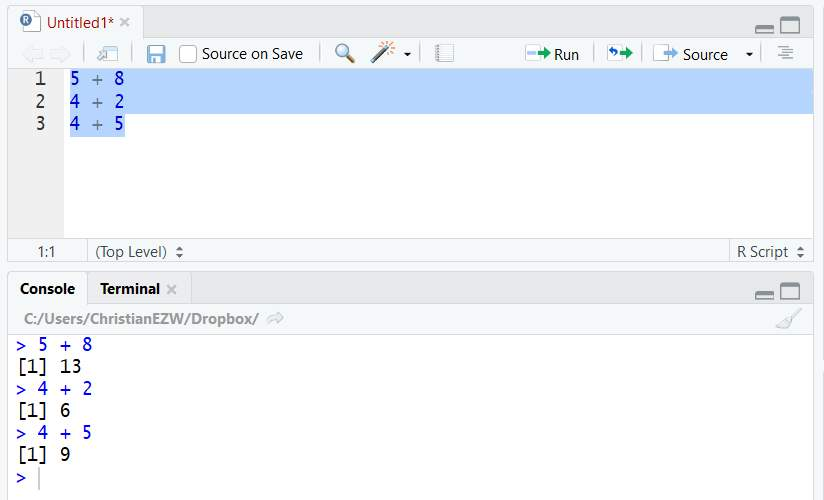
```

### Pakete installieren und laden

Ein Paket ist eine Sammlung an Funktionen und Daten, welche du gebündelt herunterladen kannst. Pakete erweitern die Funktionalität von R. R hat bereits viele Funktionen, die wir für die Datenanalyse verwenden können. Beispielsweise umfasst R die Funktion mean, mit der wir Mittelwerte aus einer Variablen berechnen können. Selbst wenn R hunderte Funktionen hat, die mit R mitgeliefert werden, brauchen wir häufig weitere Funktionen, um unsere Daten zu analysieren. Für diesen Kurs benötigen wir insbesondere Pakete, mit denen wir Daten analysieren, visualisieren und auswerten können. In diesem Kurs verwenden wir folgende Pakete:

-   [tidyverse](https://rise.articulate.com/author/SHojwTyVccfVjJhG_D37L6cXrgxGbnca#/author/details/anYDnxw9kjDldfma4gUcOvsHCpVUSe5-): Tidyverse umfasst eine Vielzahl an Paketen zur Analyse und Verarbeitung von Daten. Die Pakete haben eine einheitliche Philosophie und arbeiten reibungslos miteinander.
-   [jmv \>= 1.2.23](https://cran.r-project.org/web/packages/jmv/index.html): jmv ist ein Paket, welches mit Jamovi zusammen arbeitet und uns ermöglicht, die Analysen, die wir in Jamovi umgesetzt haben, in R zu übertragen.
-   [janitor](https://github.com/sfirke/janitor): Viele Datensätze sind unstrukturiert und enthalten komplexe Variablennamen. Mit dem Paket janitor können wir diese bereinigen.
-   [styler](https://github.com/r-lib/styler): Mit styler können wir unseren Code so formatieren, dass er den Gestaltungsrichtlinien entspricht. Beispielsweise möchten wir nicht, dass eine Zeile Code länger als 80 Zeilen ist. Mit Hilfe von styler können wir solche Fehler durch einen Klick korrigieren.

Du kannst zu jeder Zeit in R-Studio sehen, welche Pakete installiert sind, indem du dir den Package Panel anschaust (rechts unten in R-Studio):

```{r , echo=FALSE}
knitr::include_graphics("images/02_grundlagen/pakete.png")
```

#### Pakete intallieren

Um Pakete zu installieren, kannst du in R-Studio auf Install unter dem Fenster Packages klicken:

```{r , echo=FALSE}
knitr::include_graphics("images/02_grundlagen/install_pakete.png")
```

Trage zunächst das Paket unter Packages ein und drücke anschließend auf Install. Installiere sowohl tidyverse, janitor, jmv als auch styler. Alternativ kannst du direkt den Befehl in die Konsole eingeben, um die Pakete zu installieren (führe die Befehle am besten nacheinander aus):

```{r, eval=FALSE}
install.packages("tidyverse")
# Dann
install.packages("janitor")
# Dann
install.packags("jmv")
# Dann
install.packags("styler")
```

Prüfe anschließend, ob alle Pakete installiert wurden. Suche hierfür die Pakete in dem Panel Packages:

```{r , echo=FALSE}
knitr::include_graphics("images/02_grundlagen/pakete_check.png")
```

#### Pakete laden

Um die Funktionalität eines Paketes verwenden zu können, ist es mit der Installation nicht getan. Wir müssen die Pakete zusätzlich laden. Am besten lädst du die Pakete immer am Anfang deines R-Skripts, indem du folgende Befehl für jedes Paket eingibst:

    >     library(tidyverse)
    >     library(jmv)

Um anschließend zu prüfen, welche Pakete gerade geladen sind, kannst du den Befehl sessionInfo() ausführen:

```{r}
sessionInfo()
```

Unter loaded via namespace kannst du erkennen, welche Pakete installiert sind, aber nicht geladen sind. Unter other attached packages siehst du, welche Pakete geladen sind, beispielsweise jmv. Erst nachdem ein Paket geladen ist, kannst du die Funktionen der Pakete verwenden. Wenn du R-Studio neu startest, muss jedes Paket immer neu geladen werden. Diesen Schritt vergisst man häufig, wodurch Fehler entstehen. Stelle daher immer sicher, dass du die nötigen Pakete lädst, bevor du Funktionen der Pakete verwendest. Um zu prüfen, aus welchem Paket eine Funktion stammt, setze ein Fragezeichen vor die Funktion (siehe nächstes Bild links oben). Anschließend siehst du die Dokumentation dieses Befehls in dem Panel Help:

```{r , echo=FALSE}
knitr::include_graphics("images/02_grundlagen/panel_help.jpg")
```

### Das Arbeitsverzeichnis

Wenn du R öffnest, legt R im Hintergrund immer einen Ordner fest, aus dem du alle Dateien importierst und exportierst. Diesen Ordner nennt man das Arbeitsverzeichnis. Du kannst dir das Arbeitsverzeichnis in R anzeigen lassen, indem du folgenden Befehl in der Konsole ausführst:

```{r}
getwd()
```

Als Output erhältst du das Verzeichnis des Ordners, welcher gerade als Arbeitsverzeichnis bestimmt ist.

Solange du in R nicht mit [Projekten](https://support.rstudio.com/hc/en-us/articles/200526207-Using-Projects) arbeitest, musst du wissen, wo das Arbeitsverzeichnis liegt, um Dateien zu importieren. Wenn du beispielsweise folgenden Befehl verwendest, um die Datei human_resources.csv einzulesen, nimmt R automatisch an, dass sich diese Datei im Arbeitsverzeichnis befindet:

```{r, eval=FALSE}
# Nehmen wir an, dass sich das Arbeitsverzeichnis 
# in folgendem Ordner befindet: 
#    C:/Users/Christian/Dropbox/Lehre
human_resources <- read_csv("human_resources.csv")
```

Der Text zwischen den Anführungszeichen wird auch als relativer Pfad bezeichnet. Liegt die Datei beispielsweise einen Ordner über dem Arbeitsverzeichnis (in unserem Beispiel im Ordner Dropbox), verwenden wir zwei Punkte, um einen Ordner nach oben zu klettern:

```{r, eval=FALSE}
# Nehmen wir an, dass sich das Arbeitsverzeichnis 
# in folgendem Ordner befindet: 
#    C:/Users/Christian/Dropbox/Lehre
human_resources <- read_csv("../human_resources.csv")
```

Nun sucht R die Datei *human_resources.csv* im Ordner Dropbox. Die einfachste Methode, um allerdings eine Datei zu importieren, ist, das Arbeitsverzeichnis dort festzulegen, wo die Datei gespeichert ist. Dies können wir tun, indem wir den Shortcut **Ctrl+ UMSCHALT + H** in R-Studio ausführen. Danach öffnet sich ein Fenster, in dem wir das Arbeitsverzeichnis bestimmen können.

### Datensätze importieren

In diesem Kurs arbeiten wir mit Daten, die in Tabellen angeordnet sind. Häufig liegen Daten als Excel-Dateien vor. Ein gängiges Format, um Daten zu speichern sind allerdings [CSV-Dateien](https://de.wikipedia.org/wiki/CSV_(Dateiformat)). CSV steht für Comma Seperated Values. Dies bedeutet, dass Werte in CSV-Dateien entweder durch ein Komma oder ein Semikolon getrennt sind. In folgendem Beispiel siehst du ein Datensatz mit drei Variablen, die in jeder Reihe durch ein Komma getrennt sind:

```
id,variable1,variable2
ku22su99,2,3
nn08se21,5,6
```

Da CSV-Dateien ein sehr bekanntes Dateiformat für Daten sind, lassen sich CSV-Dateien sowohl in Excel, Jamovi, SPSS, als auch R importieren ([Excel](https://support.microsoft.com/de-de/office/importieren-oder-exportieren-von-textdateien-txt-oder-csv-5250ac4c-663c-47ce-937b-339e391393ba?ui=de-de&rs=de-de&ad=de), [SPSS](https://www.youtube.com/watch?v=-imCiECplPo), [Jamovi](https://www.youtube.com/watch?v=R0uE4LlHeac)). Wir werden in diesem Modul mit dem Datensatz [human_resources.csv](data/human_resources.csv) arbeiten.

Eine CSV-Datei können wir in R importieren, indem wir die Datei in dem *Panel Files* suchen und auf die Datei klicken. Klicke anschließend auf auf *Import Dataset*:

```{r , echo=FALSE}
knitr::include_graphics("images/02_grundlagen/csv_.png")
```

Anschließend siehst du ein neues Fenster, in welchem der Code angezeigt wird, mit dem wir die Daten importieren können. Kopiere am einfachsten die zweite Zeile des Code Preview (gelb markiert) und drücke dann auf Cancel.

Falls die Daten nicht sauber in Spalten angeordnet sind, kannst du unter dem Reiter *Delimiter* die Trennzeichen ändern. Im folgenden Beispiel sind die Trennzeichen in der CSV-Datei Kommas.

```{r , echo=FALSE}
knitr::include_graphics("images/02_grundlagen/table.jpg")
```

Diesen kopierten Code fügst du in dein R-Skript ein. Achte darauf, dass du vorher das Paket tidyverse lädst:

```{r , echo=FALSE, fig.cap="Beispiel für das Laden eines Datensatzes mit dem Paket tidyverse"}
knitr::include_graphics("images/02_grundlagen/load_dataset.jpg")
```

Im nächsten Schritt liest du den Datensatz ein, indem du den Befehl ausführst:

```{r , echo=FALSE}
knitr::include_graphics("images/02_grundlagen/load_data1.png")
```

Die rote Schrift hat keine Bedeutung. Sie zeigt an, welche Variablen der Datensatz umfasst. Um zu prüfen, ob der Datensatz in der Variable gespeichert wurde, gib den Datensatz in der Konsole aus:

```{r , echo=FALSE}
knitr::include_graphics("images/02_grundlagen/enviroment.png")
```

Gleichzeitig kannst du im Panel Environment sehen, ob dein Datensatz geladen wurde:

```{r , echo=FALSE}
knitr::include_graphics("images/02_grundlagen/environment1.png")
```

Der Output zeigt uns an, dass der Datensatz 1470 Reihen und 17 Variablen hat.

### Grundlegende Operatoren in R

#### Rechenoperationen

R umfasst die typischen Rechenoperatoren, die du aus der Schule kennst. Du kannst mit R Plus, Minus oder Geteilt rechnen.

Zahlen voneinander teilen:

```{r}
3 / 9
```

Das Produkt zweier Zahlen berechnen:

```{r}
3 * 4
```

Zwei Zahlen miteinander addieren:

```{r}
3 + 4 
```

Die Zeichen +, -, / oder \* nennen wir Operatoren. Operatoren sind nichts anderes als besondere Symbole, die eine bestimmte Aufgabe haben. Zum Beispiel hat der Operator + die Aufgabe, zwei Zahlen zu addieren. Wir können ebenso mehrere Operatoren miteinander verschachteln:

```{r}
(3 / 9) * 4 + 3
```

#### Der Zuordnungsoperator

Der Zuordnungsoperator \<- wird verwendet, um Variablen zu kreiieren. Variablen kannst du dir wie Boxen bei einem Umzug vorstellen, die etwas enthalten. Jede Box bekommt ein Label, hier einen Variablennamen. Was in der Box steckt, kannst du erfahren, indem du die Box aufmachst, bzw. dir die Variable in R ausgeben lässt. Erstellen wir hierzu eine neue Variable mit dem Namen sum_score:

```{r}
sum_score <- 3 + 4
```

Jede Variable umfasst drei Elemente:

1.  **Der Variablenname**: sum_score beispielsweise. Dieser Name ist willkürlich. Er sollte nicht mit einer Zahl beginnen und kleingeschrieben sein. Trenne mehrere Wörter am besten mit einem Unterstrich (z.B. sum_score).

2.  **Der Zuordnungsoperator \<-:** Achte darauf, dass vor dem \< und hinter dem - ein Leerzeichen steht. Ebenso sollte zwischen Operatoren ein Leerzeichen stehen. Falsch: sum_score\<-3+4, falsch: sum_score \<- 3+4, richtig: sum_score \<- 3 + 4.

3.  **Der Inhalt der Variable:** 3 + 4. Der Inhalt kann im Prinzip alles sein: Text: "Hallo", ein Datensatz: read_csv(...) oder der Output einer Funktion: mean(c(1, 3, 4))

Wenn du eine Variable erstellst, passiert zunächst nichts. R speichert intern das Produkt in der Variable sum_score. Um das Ergebnis der Berechnung zu sehen, führe die Variable in R aus:

```{r}
sum_score
```

Variablennamen sollten immer so geschrieben sein, dass man weiß, was in der Variable steckt:

```{r, eval=FALSE}
x <- 3 + 2 # schlecht
summe_zahlen <- 3 + 2 # besser
```


Trenne einzelne Wörter in der Variable mit einem Unterstrich:

```{r, eval=FALSE}
my_age <- 24  # gut

my.age <- 24 # schlecht
my-age <- 24 # schlecht
my/age <- 24 # schlecht
```

Schreibe Variablen am besten alle Buchstaben des Variablennamen in Kleinschreibung:

```{r, eval=FALSE}
my_age <- 24

# nicht:
My_age <- 24
```

Variablen sollten exakt angegeben werden. Kleinste Fehler führen zu Fehlern. Zum Beispiel macht die Groß- oder Kleinschreibung einen Unterschied:

```{r, eval=FALSE}
my_age <- 24
My_age
# Error: object 'My_age' not found
```

#### Der == Operator

Wir können ebenso prüfen, ob zwei Werte gleich sind, indem wir den == Operator verwenden:

```{r}
3 == 4
```

Oder:

```{r}
3 == 3
```

Oder:

```{r}
3 == 1 + 2
```

Später werden wir diesen Operator verwenden, um Reihen in einem Datensatz zu filtern. Eine volle Liste der restlichen Operatoren findest du [hier](https://www.statmethods.net/management/operators.html).

### Funktionen

Jede Programmiersprache ist nur so umfangreich, wie viele Funktionen sie hat. Funktionen werden von Menschen geschrieben, deren Ziel es ist, verschiedenste Berechnungen zu automatisieren. Gib zum Beispiel einmal in deine Konsole nur die Funktion mean ein. Was du erhältst ist der Beginn einer Funktion, die Menschen für die Programmiersprache R geschrieben haben. Funktionen haben immer den gleichen Aufbau:

```{r, eval=FALSE}
function_name(argument1 = value1, argument2 = value2)
```

* **function_name**: Dies ist der Name der Funktion. Auch dieser ist wie bei Variablen willkürlich gewählt.
* **argument1**: Funktionen haben immer Argumente. Ein Argument besagt, welche Objekte in eine Funktion gespeist werden. Stell dir Funktionen wie eine Fabrik vor, die etwas herstellt. Jede Fabrik benötigt Rohmaterial mit dem Produkte erzeugt werden. Argumente sind äquivalent zu Rohmaterialien. Sie werden in die Funktion gespeist und in der Funktion verarbeitet.
* **value1**: Jedes dieser Rohmaterialien hat bestimmte Werte. Beispielsweise kann value1 eine Zahl (3) oder ein Text sein ("Hallo"). Wir werden später andere Datentypen kennen lernen, die ebenso in Funktionen gespeist werden können (z.B. Vektoren oder Dataframes - mehr dazu gleich).

Beispielsweise umfasst R die Funktion sqrt mit der wir die Wurzel einer Zahl berechnen können:

```{r}
sqrt(9)
```

Mit Hilfe des ? Zeichens können wir die Funktion näher betrachten und uns ansehen, welche Argumente eine Funktion annimmt:

```{r , echo=FALSE}
knitr::include_graphics("images/02_grundlagen/funktion.png")
```

Die Funktion sqrt hat demnach nur ein Argument mit dem Namen x. x kann sowohl eine einzelne Zahl als auch mehrere Zahlen sein. Wir müssen das Argument nicht immer angeben. Wir hätten die Funktion daher auch so formulieren können:

```{r}
sqrt(x = 9)
```

Achte darauf, dass jede Funktion mit einer Klammer schließt. Tust du dies nicht, denkt R, dass dein Befehl noch nicht zu Ende ist und zeigt Dir dies mit einem + an:

```
sqrt(9
+
```

Eine andere Funktion heißt sum. Mit sum kannst du mehrere Zahlen miteinander addieren:

```{r}
sum(3, 4, 5)
```

Wenn du dir die Funktion unter der Hilfe mit ?sum anschaust, erkennst du, dass die Funktion unendlich viele Argumente hat. Dies wird mit einem ... gekennzeichnet:

```{r , echo=FALSE}
knitr::include_graphics("images/02_grundlagen/sum.png")
```

Wir könnten daher ebenso die Summe von fünf Zahlen zusammen rechnen:

```{r}
sum(1, 2, 3, 4, 5)
```

Lade als nächstes das Paket tidyverse (library(tidyverse)). Das Paket tidyverse umfasst die Funktion select. Mit Hilfe von select werden wir später Variablen aus einem Datensatz selektieren. Wenn du dir die Dokumentation der Funktion mit Hilfe von ?select anschaust, erkennst du, dass die Funktion mehrere Argumente hat:

```{r , echo=FALSE}
knitr::include_graphics("images/02_grundlagen/select.png")
```

Das erste Argument heißt .data. Hierfür fügen wir später den Datensatz ein. Das zweite Argument hat keinen expliziten Namen, sondern umfasst eine mit Komma getrennte Liste an Variablennamen. Schauen wir uns ein Beispiel an. Hierfür laden wir zunächst das Paket tidyverse und den Datensatz *human_resources*:

```{r, eval=FALSE}
library(tidyverse)
human_resources <- read_csv("human_resources.csv")
```

Anschließend können wir die Funktion select ausführen, um verschiede Variablen aus dem Datensatz zu nehmen (Um zu sehen, welche Variablen im Datensatz stecken, gebe colnames(human_resources) in die Konsole ein):

```{r}
select(.data = human_resources, id, age)
```

Du erkennst das erste Argument .data, in welches wir den Datensatz einfügen. Zusätzlich geben wir mehrere Variablennamen ein, indem wir die Variablennamen durch ein Komma trennen. Wir hätten ebenso die Argumente umdrehen können:

```{r}
select(id, age, .data = human_resources)
```

Generell ist es allerdings ratsam, die Reihenfolge der Argumente beizubehalten. Wenn wir dies tun, können wir die Namen der Argumente ignorieren:

```{r}
select(human_resources, id, age)
```

Versuchen wir nochmal von diesem Beispiel zu abstrahieren. Funktionen haben einen Namen und eine umgebende Klammer:

```{r, eval=FALSE}
function_name()
```

Fasst alle Funktionen haben Argumente. Die Anzahl der Argumente ist abhängig von der Funktion. Hier siehst du das Schema einer Funktion mit zwei Argumenten:

```{r, eval=FALSE}
function_name(argument1 = value1, argument2 = value2)
```

Die Reihenfolge der Argumente ist egal, solange wir die Argumente explizit benennen:

```{r, eval=FALSE}
function_name(argument2 = value2, argument1 = value1)
```

Bennenen wir die Argumente nicht, müssen wir die Reihenfolge beachten, die in der Funktion (siehe ?function_name) vorgegeben ist:

```{r, eval=FALSE}
function_name(value1, value2)
```

### Grundlegende Funktionen in R

Es gibt ein paar wenige Befehle, die du immer wieder in R benötigst. Wir werden die Befehle anhand des Datensatzes [human_resources](data/human_resources.csv) kennen lernen.

Zunächst müssen wir tidyverse laden und den Datensatz importieren:

```{r, eval=FALSE}
library(tidyverse)
human_resources <- read_csv("human_resources.csv")
```

Mit [View](https://www.rdocumentation.org/packages/utils/versions/3.6.1/topics/View)kannst du Dir den Datensatz in einem Excel-ähnlichen Format betrachten:

```{r, eval=FALSE}
View(human_resources)
```

```{r , echo=FALSE}
knitr::include_graphics("images/02_grundlagen/view_hr.png")
```

Du kannst dir die Variablennamen mit der Funktion colnames ausgeben lassen:

```{r}
colnames(human_resources)
```

Manchmal möchte man wissen, wie viele Reihen in einem Datensatz stecken. Hierfür kannst du die Funktion [nrow](https://www.rdocumentation.org/packages/base/versions/3.6.1/topics/nrow)verwenden:

```{r}
nrow(human_resources)
```

Genausogut lassen sich die Anzahl der Variablen (bzw. Spalten) in einem Datensatz mit der Funktion [ncol](https://www.rdocumentation.org/packages/base/versions/3.6.1/topics/nrow)ausgeben lassen:

```{r}
ncol(human_resources)
```

Zuletzt benötigen wir noch die Funktion head. Mithilfe von head können wir uns die ersten Reihen eines Datensatzes ansehen:

```{r}
head(human_resources)
```

#### Daten exportieren

Wenn wir Daten importieren möchten, wollen wir sie auch exportieren können. Wir werden in diesem Kurs mehrmals Daten bereinigen und verändern und möchten diese Daten anschließend wieder in einer CSV-Datei speichern. Hierfür benutzen wir die [*write_csv*](https://readr.tidyverse.org/reference/write_delim.html)Funktion. Die Funktion *write_csv* hat zwei wichtige Argumente:

> Achte darauf, dass du die Funktion nur verwenden kannst, wenn du das Paket tidyverse geladen hast.

```{r, eval=FALSE}
write_csv(x, path)
```

* x steht für den Datensatz, den wir der Funktion überführen.
* path steht für den Dateinamen in denen wir die Datei speichern. Achte darauf, diesen Pfad immer mit Anführungsstrichen " zu umrunden.

```{r, eval=FALSE}
write_csv(NAME_GEREINIGER_DATENSATZ, "datensatz_gereinigt.csv")
```

> R speichert die Datei immer in das aktuelle Arbeitsverzeichnis. Diese kannst du verändern, indem du mit dem Shortcut STRG + Umschalt + H (für Mac COMMAND + Umschalt + H) das Arbeitsverzeichnis wechselt. In diesen Ordner wird die Datei anschließend gespeichert.

## Grundlagen tidyverse

Tidyverse ist eine Sammlung an Paketen zur Datenanalyse, welche von [Hadley Wickam](http://hadley.nz/)entwickelt wurde. Hadley Wickam ist Chief Data Scientist bei R-Studio und versucht mit der Entwicklung von tidyverse die Analyse von Daten in R zu vereinfachen. Alle Pakete haben eine einheitliche Philosophie und arbeiten reibungslos miteinander. Da tidyverse aktuell die beste Software zur Datenanalyse in R ist, verwenden wir dieses Paket.

Genauer werden wir in diesem Seminar tidyverse verwenden, um Daten zu bereinigen und zu visualisieren. Denn nicht immer liegen Daten in der Form vor, die wir für die Analyse der Daten benötigen. Bevor wir statistische Fragestellungen mit Jamovi berechnen, werden wir immer auf tidyverse zurück kommen, um unsere Daten in das Format zu bringen, welches wir für unsere Verfahren benötigen. Genauer gehen wir in diesem Seminar auf folgende Funktionen und Operatoren ein, die wir immer wieder verwenden:

* Der Pipe %\>% Operator
* *glimpse:* Variablen in einem Datensatz betrachten
* *count:* Diskrete Variablen zählen
* *select*: Variablen aus einem Datensatz selektieren
* *arrange:* Datensätze nach Variablen sortieren
* *filter:* Reihen aus einem Datensatz filtern
* *mutate:* Neue Variablen erstellen
* Mehrere Befehle nacheinander ausführen

> **Bevor du mit diesem Modul beginnst, stelle sicher, dass du das Paket tidyverse und den Datensatz [human_resources.csv](data/human_resources.csv) geladen hast. Der Datensatz stammt von [dieser Seite](https://www.kaggle.com/pavansubhasht/ibm-hr-analytics-attrition-dataset) und umfasst Daten über die Mitarbeitende einer fiktiven Firma. Unter anderem umfasst der Datensatz das Einkommen der Mitarbeitenden, ihre Entfernung zum Arbeitsort, ihre Position im Unternehmen und ihr Bildungsniveau**

### Der Pipe %\>% Operator

Häufig führen wir nur eine Funktion aus, wenn wir einfache Berechnungen in R umsetzen möchten. Beispielsweise kann man mit einer Zeile den Mittelwert einer Variable berechnen. Was passiert allerdings, wenn wir mehrere Funktionen nacheinander ausführen müssen? Ein Beispiel: Stell Dir vor, du möchtest aus einem Vektor mit Zahlen den Mittelwert berechnen, aus dem Mittelwert anschließend die Wurzel ziehen und diesen Wert mit der Zahl 5 addieren. Dies wäre ein möglicher Lösungsweg:

```{r}
sum(sqrt(mean(c(4, 5, 6))), 5)
```

Dieser Code sieht nicht nur kompliziert aus, er ist es auch. Beispielsweise ist es schwer zu erkennen, welche Klammer zu welcher Funktion gehört. Alternativ könnten wir den Output der Funktionen (z.B. mean(c(4, 5, 6))) in Variablen speichern und die Berechnung sequentiell ausführen:

```{r}
mittelwert <- mean(c(4, 5, 6))
wurzel <- sqrt(mittelwert)
sum(wurzel, 5)
```

Die Lösung ist bereits eleganter aber immer noch nicht perfekt, da wir Variablen erstellen, die wir später nicht mehr benötigen; wir möchten schließlich nur das Ergebnis wissen. Eine Alternative, dieses Problem zu lösen, ist der Pipe-Operator. Unser Problem der verschachtelten Funktionen können wir mit Hilfe des Pipe-Operators folgendermaßen lösen:

```{r}
mean(c(4, 5, 6)) %>%
  sqrt(.) %>%
  sum(., 5)
```

Was ist hier passiert? Die Idee ist folgende: Jede Funktion nimmt Daten auf, verarbeitet diese und gibt diese weiter. Eine Analogie wären Fabriken. Die erste Fabrik fällt Holz und fertigt aus diesem Holz Bretter an. Das Holz ist der Input der Fabrik, Bretter der Output. Diese Bretter werden nun an die nächste Fabrik geschickt, welche anschließend die Bretter schleift. Die geschliffenen Bretter gehen anschließen an die Gitarrenbauerin, die aus ihnen eine Gitarre baut. Das Prinzip ist folgendes: Es gibt eine serielle Verarbeitung der Produkte. Genauso funktioniert der Pipe-Operator. Er übergibt den Output einer Funktion in die nächste Funktion. Hier ein weiteres Beispiel:

```{r}
mean(c(9, 10, 8)) %>%
  sqrt(.)
```

Die Funktion mean(c(9, 10, 8)) berechnet den Mittelwert aus dem Vektor mit den Zahlen 9, 10, 8 (= 9). Diese Zahl 9 wird an die Funktion sqrt übergeben. Du siehst, dass in der Funktion sqrt(.) ein Punkt notiert ist. Dieser Punkt steht für den Output der vorherigen Funktion (hier mean -\> 9). Wir könnten diesen Punkt ebenso weglassen:

```{r}
mean(c(9, 10, 8)) %>% 
  sqrt()
```

Ein anderes Beispiel: Wir berechnen die Summe aus zwei Zahlen mit der Funktion sum. Die erste Zahl der Summe übergeben wir allerdings mithilfe des Pipe-Operators:

```{r}
3 %>% sum(., 3)
```

Alternativ können wir den Punkt . entfernen:

```{r}
3 %>% sum(3)
```

Diese Befehle sind äquivalent zu folgendem Code:

```{r}
sum(3, 3)
```

Der Vorteil des Pipe-Operators wird dir vermutlich erst im Verlaufe des Kurses deutlich, wenn wir mehrere Manipulationen an Daten vornehmen. An dieser Stelle sei gesagt, dass wir den Pipe-Operator immer wieder verwenden werden, da er die Lesbarkeit unseres Codes erhöht. In den nächsten Erklärungen wirst du sehen, weshalb der Operator so wichtig ist.

> Der Pipe Operator ist häufig schwierig mit der Tastatur zu schreiben. In R-Studio gibt es einen Shortcut um den Pipe-Operator einzufügen: Ctrl + Umschalt + M. Dies ist ein Shortcut, den es sich lohnt zu lernen.

### Grundlegende tidyverse-Befehle

Es gibt ein paar Funktionen in der Datenanalyse, die wir immer wieder brauchen. Beispielsweise möchten wir häufig neue Variablen berechnen, bestimmte Reihen aus einem Datensatz filtern oder die Häufigkeit des Vorkommens bestimmter Werte zählen. Wir werden den Rest dieses Submoduls verbringen, diese Befehle kennen zu lernen. Im Verlaufe des Seminars wirst du diese Befehle immer wieder verwenden. Es ist daher ratsam, dass du dir diese Befehle gut einprägst.

#### Glimpse: Variablen in einem Datensatz ansehen

In Excel sieht man die Daten jederzeit, in R nicht. Um einen Datensatz beispielsweise in R zu sehen, musst du ihn über die Konsole ausgeben lassen:

```{r}
human_resources
```

Das funktioniert, allerdings wirst du nicht immer alle Variablen sehen können. Von den 17 Variablen in diesem Datensatz sind 9 nur namentlich erwähnt und du siehst nicht, was in den Variablen steckt. Eine Möglichkeit alle Variablen anzusehen ist die [glimpse-Funktion](https://tibble.tidyverse.org/reference/glimpse.html). Glimpse ordnet die Variablen in Reihen und nicht in Spalten an und erlaubt dir dadurch einen umfassenderen Einblick in die Daten:

```{r}
glimpse(human_resources)
```

Nun siehst du alle 17 Variablen des Datensatzes. Ebenso siehst du, dass der Datensatz 1470 Reihen enthält. Glimpse solltest du immer dann verwenden, wenn du sehen möchtest, welche Variablen ein Datensatz enthält und was in diesen Variablen drinsteckt.

#### ***count:*** **Diskrete Variablen zählen**

Mit Hilfe von [count](https://dplyr.tidyverse.org/reference/tally.html)können wir die Häufigkeit diskreter (nominalskalierter) Daten zählen. Beispielsweise können wir in unserem Datensatz prüfen, wie viele Männer und wie viele Frauen in der Firma arbeiten:

```{r}
human_resources %>% count(gender)
```

Es gibt 588 Frauen und 882 Männer in dem Datensatz. Wie du siehst, habe ich den Pipe-Operator verwendet, um diese Häufigkeiten zu berechnen. In Worten sage ich folgendes: Nimm den Datensatz und übergib ihn als erstes Argument in die Funktion count.

Um zu verstehen, weshalb der Pipe-Operator für die Funktion count funktioniert, müssen wir uns nochmal ansehen, wie Funktionen funktionieren. Funktionen haben häufig Argumente, das heißt sie enthalten Informationen, mit denen sie Berechnungen ausführen. Schauen wir uns die Argumente der count-Funktion an. Wenn du count() in der Konsole tippst, erscheint folgender Hinweis:

```{r , echo=FALSE}
knitr::include_graphics("images/02_grundlagen/count.png")
```

Die ersten beiden Argumente der Funktion sind x und ... x steht für einen Datensatz, die drei Punkte ... für Variablen des Datensatzes (wenn du wissen möchtest, woher ich das weiß tippe ?count in der Konsole und schaube bei Help unter Arguments).

Wir hätten aus diesem Grund ebenso den Datensatz innerhalb der Funktion als Argument übergeben können und zudem die Variablen nennen können, für die wir die einzelnen Ausprägungen (z.B. Mann und Frau) zählen möchten:

```{r}
count(x = human_resources, gender)
```

Wie du siehst, haben wir nun das erste Argument x explizit angegeben. Wir sagen R damit: "Bitte berechne mir die Häufigkeit der Ausprägungen der Variable gender für den Datensatz human_resources."

```{r}
human_resources %>% count(x = ., gender)
```

Da der Pipe-Operator nichts anderes macht als Informationen von einer Funktion oder einem Befehl in eine andere Funktion zu übergeben, können wir nun den Datensatz in die Funktion count übergeben. Was der Pipe-Operator übergibt, wird immer mit einem Punkt (.) gekennzeichnet.

```{r}
human_resources %>% count(., gender)
human_resources %>% count(gender)
```

Da nun x das erste Argument der Funktion count ist, können wir es weglassen und nur den Punkt erwähnen. Ebenso können wir den Punkt weglassen und erhalten dennoch unseren Output.

Die Logik dieses Pipe-Operators gilt für alle nachfolgenden Funktionen. Versuche daher selbst einmal mit dem Pipe-Operator und dem count-Befehl zu spielen, um zu verstehen, wie der Pipe-Operator arbeitet.

Zuletzt können wir mit dem count-Befehl ebenso weitere, komplexere Fragen beantworten. Beispielsweise können wir uns fragen, welche Ausbildung Männer und Frauen haben. Im Datensatz gibt es eine Variable mit dem Namen education, in der der höchste Bildungsabschluss für jeden Mitarbeiter / jede Mitarbeiterin gespeichert ist:

```{r}
human_resources %>% count(gender, education)
```

Beispielsweise kannst du erkennen, dass 22 Frauen einen Doktorabschluss haben. Bei den Männern sind es 26.

Im Grunde könntest du unendlich viele nominalskalierte Variablen in die Funktion count eintragen, allerdings würde dies unübersichtlich werden. In der Regel reichen eine oder zwei Variablen.

#### **select: Variablen aus einem Datensatz selektieren**

Datensätze haben manchmal viele Variablen. Um den Überblick zu behalten, können wir uns mit [select](https://dplyr.tidyverse.org/reference/select.html)nur ein paar wenige Variablen ansehen. Zum Beispiel können wir aus unserem Datensatz nur die Variablen id und age selektieren:

```{r}
human_resources %>% select(id, age)
```

Der Aufbau der select-Funktion ist identisch mit den Funktionen glimpse und count. Das erste Argument ist der Datensatz, dann werden die Variablen aufgelistet, mit der die Funktion rechnen soll.

```{r}
human_resources %>% select(id, age, department)
```

Beispielsweise könnten wir ebenso drei Variablen aus dem Datensatz selektieren.

> Im Übrigen. Wenn du dich fragt, woher man weiß, welche Variablen in einem Dtensatz sind. Mit der glimpse-Funktion kannst du dir die Variablennamen in einem Datensatz immer wieder ansehen.

Manchmal wollen wir allerdings genau das Gegenteil. Variablen aus einem Datensatz entfernen. Dies können wir mit select erreichen, indem wir ein Minus vor die Variable setzen, die wir entfernen möchten:

```{r}
human_resources %>% select(-gender)
```

Oder, stell dir vor, du möchtest mehrere Variablen aus dem Datensatz entfernen, die beieinander liegen. Nehmen wir beispielsweise an, du möchtest die Variablen education bis monthly_income aus dem Datensatz selektieren, welche laut dem glimpse-Befehl hintereinander stehen:

```{r}
glimpse(human_resources)
```

```{r}
human_resources %>% select(education:monthly_income)
```

Um diese Variablen aus dem Datensatz zu selektieren, musst du die erste und die letzte Variable benennen und mit einem Doppelpunkt trennen.

```{r}
human_resources %>% select(-(education:monthly_income))
```

Möchtest du hingegen, dass genau diese Variablen aus dem Datensatz entfernt werden, musst du die Variablen mit einer Klammer umschließen und ein - davor schreiben.

#### arrange: Datensätze nach Variablen sortieren

Stell dir vor, du möchtest wissen, wer die ältesten Mitarbeitende in der Firma sind. In Excel würdest du hierfür den Datensatz nach dem Alter der Mitarbeitenden sortieren. In tidyverse kannst du das gleiche mit der Funktion arrange schaffen: 

```{r}
human_resources %>% arrange(age)
```

Wie du siehst sind die Mitarbeitenden von jung nach alt sortiert. Dich interessieren allerdings die älteren Mitarbeitende. Hierfür müssen wir arrange zusätzlich sagen, dass die Variable von hoch nach niedrig angezeigt wird.

```{r}
human_resources %>% arrange(desc(age))
```

Nun siehst du, dass die ältesten Mitarbeitende 60 Jahre alt sind. Ebenso erkennst du, dass die Mitarbeitende von alt nach jung sortiert sind. 

Wir können aber genausogut zwei Variablen sortieren. Die Reihenfolge der Variablen, die wir in die Funktion arrange eingeben, gibt an, welche Variable zuerst sortiert wird. Zum Beispiel können diejenigen Mitarbeitende innerhalb eines Alters (z.B. alle 60 Jahre alt) nach der Distanz sortieren, die sie zur Arbeit fahren müssen:

```{r}
human_resources %>% arrange(desc(age), distance_from_home)
```

Wie du siehst sind die Mitarbeitende, welche 60 Jahre alt sind, nun danach sortiert, wie weit sie von dem Arbeitsplatz entfernt wohnen. Der Mitarbeiter mit der id 1210 beispielsweise wohnt nur einen Kilometer vom Arbeitsplatz entfernt, die Mitarbeitende mit der id 428 wohnt 28 Kilometer.

#### filter: Reihen aus einem Datensatz filtern

Eine weitere häufige Funktion ist das Filtern von Daten. Stell dir beispielsweise vor, du möchtest alle Männer aus dem Datensatz entfernen. Das heißt, jede Reihe bzw. Person, für die in der Variable gender Male steht, soll aus dem Datensatz entfernt werden. Dies können wir mit [filter](https://dplyr.tidyverse.org/reference/filter.html) erreichen:

```{r}
human_resources %>% filter(gender != "Male")
```

Die Funktion lässt sich am besten verstehen, wenn wir die Operatoren ==, !=, >, < und %in% im einzelnen durchgehen. Beginnen wir mit dem Operator !=. != steht für "ist nicht". In unserem Beispiel haben wir tidyverse gesagt: "Behalte alle Reihen, in der die Variable gender nicht "Male" ist. 

Etwas einfacher sehen wir den gleichen Effekt, wenn wir uns fragen, ob zwei Zahlen gleich oder verschieden ist. Du weißt, dass 3 nicht 4 ist (TRUE). Du weißt ebenso, dass die Aussage 3 ist nicht 3 falsch ist (FALSE). Ebenso würdest du zustimmen, wenn ich sage 4 ist gleich 4 (TRUE). Wenn ich aber sage, dass 3 gleich 4 ist würdest du sagen, dass ist falsch (FALSE). 

```{r}
3 != 4
3 != 3
4 == 4
3 == 4
```

Auf Variablen übertragen fragen wir uns bei der Funktion filter immer, ob die Ausprägung einer Variable gleich oder ungleich eines bestimmten Wertes ist. Diejenigen Berechnungen, die TRUE ergeben, werden behalten, diejenigen, die FALSE ergeben, werden aus dem Datensatz entfernt. Wenn ich demnach sage gender != "Male" entferne ich alle Reihen, in denen die Ausprägung der Variable gender "Male" ist. 

> Wenn du übrigens nicht weißt, welche Ausprägungen es für eine Variable gibt, kannst du diese mit der count-Funktion finden: z.B. count(human_resources, gender)

Mit dem Wissen um TRUE und FALSE können wir komplexere Berechnungen mit filter durchführen. Zum Beispiel möchten wir nur Mitarbeitende in dem Datensatz behalten, die älter als 50 Jahre sind.

```{r}
human_resources %>% filter(age > 50)
```

Wie du siehst, hat der Datensatz nur noch 143 Mitarbeitende. Zwar haben wir in diesem Beispiel nicht den Operator != oder ==, sondern den Operator > verwendet. Dennoch gibt uns die Aussage age > 50 einen wahren Wert (TRUE) oder einen falschen Wert (FALSE) zurück. Wer beispielsweise 30 Jahre alt ist, wird nicht in den Datensatz übernommen (30 > 50 -> FALSE). Eine Mitarbeiterin, die 52 Jahre alt ist, wird in den Datensatz übernommen (52 > 50 -> TRUE).

Manchmal möchten wir allerdings mehrere Zeilen gleichzeitig aus einem Datensatz entfernen beziehungsweise behalten. Stell dir vor, wir möchten alle Mitarbeitende aus dem Datensatz filtern, die über 50 Jahre sind und die weiblich sind. Hierfür haben wir zwei Möglichkeiten:

```{r}
human_resources %>% filter(age > 50 & gender == "Female")
human_resources %>% filter(age > 50, gender == "Female")
```

Einerseits können wir die Aussagen mit einem Komma trennen, andererseits können wir ein & (und) dazwischen setzen. Beide Varianten behalten nur diejenigen Mitarbeiterinnen, die über 50 sind und weiblich sind. 

Das Gegenteil wären Mitarbeitende, die entweder über 50 Jahre alt sind oder weiblich sind. Hierfür verwenden wir den | (oder) Operator:

```{r}
human_resources %>% filter(age > 50 | gender == "Female")
```

Du siehst, dass der Datensatz nun 667 Mitarbeitende enthält. Bei unserem vorherigen und-Befehl waren es 64 Mitarbeitende. 

Stell dir weiterhin vor, du möchtest alle Mitarbeitende aus dem Datensatz filtern, die entweder einen Bachelor- oder Masterabschluss haben. Momentan können wir diese Frage mit dem Oder-Operator (|) beantworten. Es geht allerdings eleganter mit dem %in%-Operator:

```{r}
human_resources %>% filter(education == "Bachelor" | education == "Master")
human_resources %>% filter(education %in% c("Bachelor", "Master"))
```

Beide Befehle kommen zu dem gleichen Ergebnis. Die Variante mit dem %in%-Operator ist allerdings kürzer und daher zu bevorzugen. Diese Variante eignet sich beispielsweise auch, um Probanden mit einer bestimmten ID aus einem Datensatz zu entfernen. 

#### mutate: Neue Variablen berechnen

Manchmal möchten wir neue Variablen aus einem Datensatz berechnen. Stell dir vor, du möchtest das Einkommen der Mitarbeitenden von Dollar in Euro umrechnen. Oder, du möchtest aus dem monatlichen Einkommen der Mitarbeiter, das Jahreseinkommen berechnen. Diese Berechnungen kannst du mit dem [mutate](https://dplyr.tidyverse.org/reference/mutate.html) Befehl umsetzen. Berechnen wir einmal das Jahreseinkommen der Mitarbeitenden:

```{r}
human_resources %>% 
  mutate(
    yearly_income = monthly_income * 12
  )
```

Zunächst musst du den Namen der neuen Variable linksseitig nennen (yearly_income). Anschließend folgt ein =. Hinter dem = schreibst du auf, wie die Variable berechnet wird. In diesem Fall haben wir das monatliche Einkommen mal 12 berechnet, da ein Jahr 12 Monate hat. 

Ein anders Beispiel. Stell dir vor, wir möchten eine Variable erstellen, die anzeigt, ob eine Mitarbeiterin / ein Mitarbeiter mehr oder weniger als das Jahreseinkommen verdient:

```{r}
human_resources %>% 
  mutate(
    yearly_income        = monthly_income * 12,
    salary_above_average = yearly_income > mean(yearly_income)
  )
```

Drei Dinge lernen wir aus diesem Beispiel. 

1. Zunächst siehst du, dass du mehrere neue Variablen gleichzeitig berechnen kannst. In diesem Beispiel haben wir sowohl die Variable yearly_income als auch salary_above_average berechnet. 
2. Ebenso kannst du erkennen, dass wir eine neue Variable direkt verwenden können, um eine weitere Variable zu berechnen. Beispielsweise haben wir die Variable yearly_income im ersten Schritt erzeugt und im zweiten Schritt zur Berechnung der Variable salary_above_average verwendet. 
3. Zuletzt erkennst du, dass wir zur Berechnung der Variable salary_above_average die Funktion mean verwendet haben. Vermutlich ist deine Annahme, dass der Mittelwert nur berechnet werden kann, wenn auch der Datensatz vorher angegeben wird. Zum Beispiel: mean(human_resources$yearly_income). Innerhalb der tidyverse-Funktionen musst du den Datensatz allerdings nie angeben, sondern kannst lediglich die Variablennamen angeben. Aus diesem Grund funktioniert der mean-Befehl an dieser Stelle.

### Mehrere Befehle nacheinander ausführen

Mit diesen Befehlen können wir bereits recht komplexere Operationen an Datensätzen ausführen. Nur, bei einem Befehl bleibt es selten, häufig möchten wir mehrere dieser Befehle nacheinander ausführen. Nur wie?

Der Trick besteht darin, mehrere dieser Befehle mit dem Pipe-Operator zusammen zu führen. Nehmen wir ein Beispiel: Du möchtest aus dem Datensatz alle Frauen filtern und anschließend prüfen, welchen Bildungsabschluss die Frauen in dem Unternehmen haben:

```{r}
human_resources %>% 
  filter(gender == "Female") %>% 
  count(education)
```

Wie du siehst, habe ich zunächst den Datensatz nach den Frauen gefiltert und anschließend gezählt, welcher Bildungsabschluss unter den Frauen wie häufig auftritt. Vlt. möchest du die Häufigkeit zusätzlich sortieren?

```{r}
human_resources %>% 
  filter(gender == "Female") %>% 
  count(education) %>% 
  arrange(desc(n))
```

Wie du siehst, haben wir nun zusätzlich die Funktion arrange verwendet, um die Häufigkeit von hoch nach niedrig zu sortieren. Die meisten Frauen in der Firma haben offensichtlich einen Bachelor-Abschluss. 

Oder, stell dir vor, du möchtest wissen, welche Mitarbeitende besonders weit von der Arbeitsstelle wohnen, um ihnen evtl. die Möglichkeit für zusätzliche Home-Office Tage zu geben. Dabei interessiert dich das Alter der Mitarbeitenden, deren id und deren Distanz zum Arbeitsort:

```{r}
human_resources %>% 
  filter(distance_from_home > 25) %>% 
  select(id, age, distance_from_home)
```

Insgesamt wohnen 25 Mitarbeitende mehr als 25 Kilometer vom Arbeitsort entfernt. Wer wohnt eigentlich am weitesten entfernt?

```{r}
human_resources %>% 
  filter(distance_from_home > 25) %>% 
  select(id, age, distance_from_home) %>% 
  arrange(desc(distance_from_home))
```

Es sind mehrere Personen, mit einer Distanz von 29 Kilometer. Und wie alt ist die älteste Person, die so weit zur Arbeit fahren muss?

```{r}
human_resources %>% 
  filter(distance_from_home > 25) %>% 
  select(id, age, distance_from_home) %>% 
  arrange(desc(distance_from_home), desc(age))
```

57 Jahre alt. Wie du siehst, können wir mit diesen Befehlen bereits sehr schnell Fragen an den Datensatz beantworten. Tidyverse hat noch eine Vielzahl an Funktionen, mit denen wir noch viel komplexere Berechnungen ausführen können (siehe [tidyverse](https://www.tidyverse.org/)). Für diesen Kurs beschränken wir uns auf diese zentralen Funktionen und werden diese immer wieder in diesem Kurs verwenden.

Solange du den Output dieser Funktionen nicht speicherst, geht er verloren. Stell dir vor, du möchtest einen neuen Datensatz speichern, der nur die weiblichen Mitarbeiterinnen enthält. Diese Variante würde zwar die Berechnungen ausführen, allerdings den Datensatz nicht dauerhaft speichern:

```{r}
human_resources %>% 
  filter(gender == "Female")
```

Mit dieser Variante würdest du den neuen Datensatz mit allen weiblichen Mitarbeiterinnen zwar in der Konsole ausgeben. Sobald R-Studio schließt, ist der Datensatz allerdings wieder verloren.

Um den Datensatz dauerhaft zu behalten, hast du zwei Möglichkeiten. Zunächst kannst du den neuen Datensatz als Variable speichern:

```{r}
hr_women <- human_resources %>% 
  filter(gender == "Female")
```

Indem du den Datensatz in einer Variable speicherst, kannst du ihn innerhalb einer R-Session (so lange du R geöffnet hast) aufrufen. Speicherst du den Code in einem Skript, kannst du den Datensatz jedes mal neu berechnen. In der Konsole geht der Code verloren, sobald du R schließt.

Um den Datensatz dauerhaft zu speichern, kannst du ihn als CSV-Datei exportieren (siehe vorheriges Submodul). Hierfür solltest du allerdings wissen, in welchen Order der Datensatz gespeichert wird. Dies kannst du mit getwd() erfahren. Um das Arbeitsverzeichnis zu wechseln, drücke Strg + Umschalt + H auf deiner Tastatur (siehe auch [hier](https://stackoverflow.com/questions/22432344/how-do-you-change-the-default-directory-in-rstudio-or-r)).

```{r, eval=FALSE}
# getwd(), um zu sehen, in welchen Ordner die Daten gespeichert werden 
# Strg + Umschalt + H um das Arbeitsverzeinis zu wechseln
human_resources %>% 
  filter(gender == "Female") %>% 
  write_csv("hr_women.csv")
```

### Weitere Informationen zu den tidyverse Befehlen

Wir haben in diesem Submodul eine Reihe an wichtigen Befehlen kennen gelernt, mit denen wir bereits komplexe Berechnungen in R durchführen können. Nimm dir Zeit, diese Befehle kennen zu lernen, wir werden sie in den Übungen ohnehin mehrmals wiederholen. Solltest du mehr Interesse an tidyverse haben, schau dir folgende Links an:

* [David Robinson Screencasts](https://www.youtube.com/user/safe4democracy/videos)
* [R for Data Science](https://r4ds.had.co.nz/)
* [ModernDive - Statistical Inference via Data Science - Data Wrangling](https://moderndive.com/3-wrangling.html)

## Grundlagen Jamovi

Jamovi ist eine Statistik-Software, die die Vorteile von einem Grafikprogramm und der Flexibilität einer Programmiersprache verbindet. Einerseits ähnelt die Oberfläche von Jamovi der bekannten, aber kostenpflichtigen Statistik-Software SPSS, andererseits ermöglicht Jamovi die Integration der Ergebnisse in R und ist damit die perfekte Schnittstelle für diesen Kurs. Wir werden in diesem Submodul die Grundlagen von Jamovi kennen lernen, um später mit Jamovi statistische Fragestellungen zu beantworten.

> Für dieses Submodul nehme ich an, dass du Jamovi bereits herunter geladen hast und dir ebenso den Datensatz [human_resources.csv](data/human_resources.csv) herunter geladen hast (siehe Datensatz unten dieser Infobox).

### Datensätze mit Jamovi einlesen

Öffnest du Jamovi, siehst du lediglich ein leeres Fenster:

```{r , echo=FALSE}
knitr::include_graphics("images/02_grundlagen/jamovi/01.png")
```

Wir müssen daher zunächst die Daten in Jamovi einfügen. Hierfür klickst du auf Open -> Import und wählst den Datensatz von deinem PC aus.

```{r , echo=FALSE}
knitr::include_graphics("images/02_grundlagen/jamovi/02.png")
```

Im Anschluss solltest du den Datensatz in Jamovi sehen können. 

```{r , echo=FALSE}
knitr::include_graphics("images/02_grundlagen/jamovi/03.png")
```

### Die Benutzeroberfläche von Jamovi

Optisch ähnelt Jamovi Excel oder SPSS und ist daher vermutlich intuitiver zu bedienen als R. Wir werden in diesem Semester daher die bekannten statistischen Verfahren mit Jamovi rechnen und R für die Dokumentation deiner Ergebnisse und verschiedener Berechnungen verwenden. 

Unter Analyse findest du verschiedene Buttons, mit denen du sowohl statistische Verfahren berechnen kannst, als auch deskriptive Daten des Datensatzes berechnen kannst:

```{r , echo=FALSE}
knitr::include_graphics("images/02_grundlagen/jamovi/04.jpg")
```

Diese Bezeichnungen sagen dir vermutlich zu diesem Zeitpunkt nicht viel, das ist auch nicht schlimm, da wir diese Bezeichnungen Stück für Stück in diesem Seminar lernen werden. Im Verlaufe des Semesters werden wir uns ausführlich mit t-Tests, ANOVAs und der Regression beschäftigen.

Unter Data findest du verschiedene Befehle, mit denen du die Daten manipulieren kannst. Wir werden diese Leiste in diesem Seminar kaum benutzen und die Datenmanipulation in R machen.

```{r , echo=FALSE}

```

### Deskriptive Daten mit Jamovi berechnen

Nutzen wir Jamovi, um ein paar Einsichten in unseren Datensatz zu gewinnen. Fragen wir uns beispielsweise, wie viel die Mitarbeitende des Unternehmens im Durchschnitt verdienen. Aus dem letzten Semester weißt du, dass man hierzu den Mittelwert einer Variable berechnen muss. In Jamovi klickst du hierfür auf Exploration und anschließend auf Descriptives:

```{r , echo=FALSE}
knitr::include_graphics("images/02_grundlagen/jamovi/06.jpg")
```

Nun hast du die Möglichkeit eine Variable auszuwählen und verschiedene Maße der zentralen Tendenz und der Streuung zu berechnen. In unserem Fall möchten wir das mittlere Einkommen aller Mitarbeitenden berechnen:

```{r , echo=FALSE}
knitr::include_graphics("images/02_grundlagen/jamovi/07.png")
```

Wie du siehst, habe ich unter Central Tendency Mean ausgewählt und erhalte ein monatliches Bruttoeinkommen von 6503 Euro. 

Wir könnten ebenso untersuchen, wie hoch das mittlere Einkommen für Personen mit verschiedenen Bildungsabschlüssen ist. Also, verdienen Mitarbeitende mit einem Masterabschluss mehr als Mitarbeitende mit einem Bachelorabschluss?

```{r , echo=FALSE}
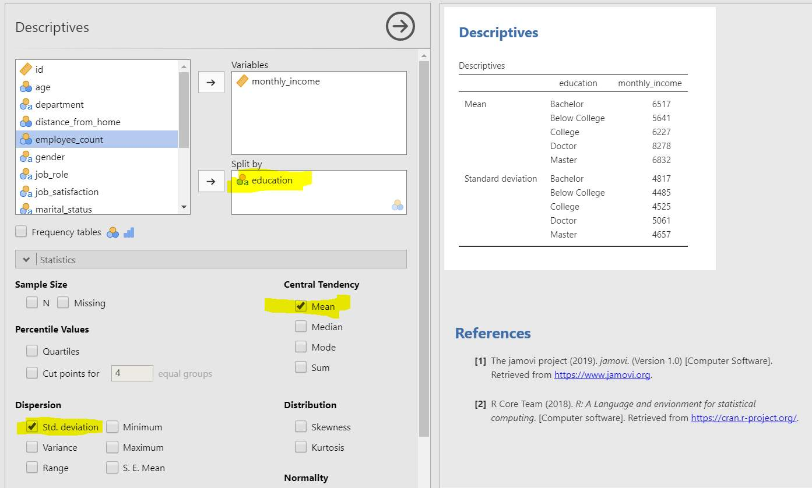
```

Offensichtlich ja. Im Schnitt verdienen Mitarbeidende mit einem Bachelorabschluss 6517 Euro brutto, mit einem Masterabschluss 6832 Euro brutto. Du erkennst im Bild ebenso, dass ich mir die Standardabweichung der Variablen ausgegeben habe. 

Ebenso kannst du dir die Verteilung der Einkommen pro Bildungsabschluss als Visualisierung ausgeben lassen. Hierzu klickst du auf Plots und anschließend auf Histogram:

```{r , echo=FALSE}
knitr::include_graphics("images/02_grundlagen/jamovi/09.jpg")
```

### Jamovi in R exportieren

Ein Trick, den wir über den ganzen Kurz verwenden werden, ist es, den Output von Jamovi in R zu übertragen. Wir machen das, um unsere Berechnungen dauerhaft in einem Skript zu speichern und um somit unsere Ergebnisse zu dokumentieren. 

Um den den Output in R zu übertragen, musst du zunächst auf die drei Punkte rechts oben in Jamovi klicken:

```{r , echo=FALSE}
knitr::include_graphics("images/02_grundlagen/jamovi/10.jpg")
```

Anschließend öffnet sich ein Fenster, in welchem du den Syntax mode aktivierst:

```{r , echo=FALSE}
knitr::include_graphics("images/02_grundlagen/jamovi/11.jpg")
```

Wie du sehen kannst, erstellt Jamovi den Output deiner Berechnungen in Form von R-Code. Diesen R-Code kannst du anschließend kopieren.

```{r , echo=FALSE}
knitr::include_graphics("images/02_grundlagen/jamovi/12.png")
```

Im nächsten Schritt musst du mehrere Dinge beachten. Zunächst musst du sicher stellen, dass das Paket [jmv](https://www.jamovi.org/jmv/) geladen ist (library(jmv)). jmv ist die Schnittstelle zu R. Ist das Paket nicht geladen, wird der Code einen Fehler anzeigen. Ebenso solltest du sicher stellen, dass dein Datensatz importiert ist (siehe Zeile 4 im nächsten Bild). Zuletzt musst du im Jamovi-Code immer den Namen des Datensatzes anpassen (siehe Zeile 8 im nächsten Bild). Ansonsten kann es zu Fehlern kommen.

```{r , echo=FALSE}
knitr::include_graphics("images/02_grundlagen/jamovi/13.png")
```

Wie du siehst, erhälst du den gleichen Output wie in Jamovi. Wann solltest du allerdings den Code von Jamovi in R übertragen? Das R-Skript dient der Dokumentation deiner Berechnungen. Alle Berechnungen, die du daher dauerhaft behalten möchtest, sollten in einem R-Skript gespeichert werden. Alle Berechnungen, die du nur einmal ausprobierst, müssen nicht in das R-Skript. 

### Zusammenfassung

Die eben beschriebenen Schritte wirst du in diesem Semester immer wieder ausführen, bis du sie auswendig kennst. In diesem Submodul hast du einen kurzen Überblick über die Möglichkeiten von Jamovi erhalten und du hast gesehen, wie Daten in Jamovi importiert werden können. Ebenso hast du gelernt, wie man deskriptive Daten in Jamovi berechnet und in R überführt.

## Quiz

Dieses Quiz dient dir zur Auffrischung deines Wissens aus Statistik I und als Grundlage für diesen Kurs. Das Quiz beinhaltet nicht alle Inhalte aus Statistik I, sondern nur diejenigen, welche in diesem Seminar vorausgesetzt werden. Versuche das Quiz ohne begleitendes Material auszufüllen und wenn nötig, wiederhole wichtige Konzepte, solltest du sie noch nicht verstanden haben. 

<!--chapter:end:02-grundlagen_r.Rmd-->

# Statistisches Hypothesentesten

```{r include=FALSE}
source("_theme.R")
library(patchwork)
library(tidyverse)
```


## Einführung

In diesem Modul beginnen wir heraus zu finden, wie wir Fragestellungen in der Sozialwissenschaft beantworten bzw. wie wir Hypothesen testen. Wir werden in diesem Modul lernen, dass wir nie in der Lage sind, Hypothesen zu bestätigen, sondern Hypothesen nur widerlegen können. Bei jedem Test in prüfen wir daher, ob eine Hypothese gegeben den Daten, die wir erheben, unwahrscheinlich ist. Ob wir eine Hypothese widerlegen oder nicht, hängt davon ab wie groß diese Wahrscheinlichkeit ist. Ist die Wahrscheinlichkeit sehr gering, widerlegen wir die Hypothese. Ist die Wahrscheinlichkeit nicht sehr unwahrscheinlich, behalten wir die Hypothese vorerst. Um zu diesen statistischen Entscheidungen zu kommen, verwenden wir Stichprobenkennwertverteilungen. Ebenso wirst du in diesem Modul lernen, dass wir Fehler in diesen Entscheidungen machen. Diese Themen werden wir in diesem Modul kennen lernen, indem wir versuchen werden, folgende Fragestellung zu beantworten:

> Lesen Studenten und Studentinnen mehr als 10 Bücher pro Jahr?

Wir werden diese Fragestellung beantworten, indem wir einen *t*-Test für eine Stichprobe berechnen. Anhand folgende Submodule beantworten wir diese Fragestellung:

-   **Falsifikation als Ziel wissenschaftlichen Fortschritts**: In diesem Submodul lernst du, dass man in der Statistik Hypothesen nur widerlegen und nicht prüfen kann.

-   **Strichprobenkennwertverteilungen:** In diesem Submodul lernst du, was Stichprobenkennwertverteilungen sind.

-   **Prozess des statistischen Hypothesentestens**: In diesem Submodul lernst du, wie wir Fragestellungen in der Sozialforschung statistisch beantworten.

-   **Alpha- und Betafehler und Power:** In diesem Submodul lernst du, welche Fehler wir in statistischen Entscheidungen für oder gegen eine Hypothese machen können.

-   **Die Effektstärke Cohen's *d***: In diesem Submodul lernst du, was eine Effektstärke am Beispiel der Effektstärke Cohen's *d* ist.

-   **Quiz statistisches Hypothesentesten:** In diesem Quiz wiederholst du die Inhalte dieses Moduls.

## Falsifikation als Ziel wissenschaftlichen Fortschritts

### Wissenschaftliche Fragestellungen

Das wichtigste Ziel für Bildungswissenschaftler\*innen ist es, Lernumgebungen zu schaffen, in denen Lernende etwas lernen. Nur, woher wissen wir, wie wir zu diesem Ziel kommen? Meinungen über wirksames Lernen gibt es zur Genüge: Manche denken, man müsse eine Lernumgebung [dem Lerntyp der Lernenden](https://www.iflw.de/blog/lernen/welche-lerntypen-gibt-es/) anpassen. Andere widersprechen dieser Idee und sagen, Lerntypen gibt es nicht ([Pasher et al., 2009](https://journals.sagepub.com/doi/full/10.1111/j.1539-6053.2009.01038.x)). Ebenso gibt es die Meinung, dass Motivation der entscheidende Prädiktor für Lernen ist. Oder stimmt es wirklich, dass es wirksam ist, das Lehrbuch nachts unter das Kopfkissen zu legen? Ist es in der Tat weniger lernförderlich auf dem Laptop einen Text zu lesen als auf einem ausgedruckten Papier? 

Dies sind nur ein paar wenige Fragestellungen, mit denen sich Bildungswissenschaftler\*innen in ihrer täglichen Arbeit beschäftigen. In der praktischen Arbeit, müssen wir als Lernende und Lehrende viele dieser Fragen beantworten, in der Hoffnung, durch unsere Entscheidungen effektiver zu lernen beziehungsweise zu lehren. Nur, welche Entscheidung ist die korrekte? Diese Frage bringt uns an das Herz der Wissenschaft und der Frage, wie wir Dinge in der Welt überhaupt wissen können.

### Logischer Positivismus und die Induktion

Zunächst gehen wir davon aus, dass wir überhaupt im Stande sind, etwas zu wissen. Nicht jede Fragestellung ist nämlich prüfbar. Sollten Esspflanzen genetisch manipuliert werden? Ist die Todesstrafe moralisch vertretbar? Dies sind moralische Fragestellungen, die sich einer klaren Antwort entziehen. Der logische Positivismus stellt sich gegen solche Fragestellungen. Nach dem logischen Positivismus sind wissenschaftliche Fragestellungen nur sinnvoll, solange sie verifizierbar sind. Wenn ich behaupte, dass die Erde einen Durchmesser von 12742 Kilometer hat, kann ich dir die Schritte beschreiben, die mich zu diesem Schluss führen. Die Behauptung, dass Esspflanzen nicht genetisch manipuliert werden sollten, lässt sich zwar begründen, allerdings nicht verifizieren. Es gibt keine eindeutige Antwort auf diese Frage. 

Andere Behauptungen wiederum sind prüfbar. Die Behauptung, mein Neffe kommt aus Österreich, kann ich direkt prüfen. Generelle Behauptungen, wie beispielsweise Lernumgebungen sind wirksamer, wenn sie den Lerntypen der Lernenden angepasst werden, lassen sich hingegen nicht durch eine einzige Beobachtung verifizieren. Vielmehr unterliegen sie dem Problem der Induktion. Induktion ist ein Prozess, bei dem aus einer Fülle an Einzelbeobachtungen allgemeine Schlüsse gezogen werden. Beispielsweise hast du seit deiner Geburt die Beobachtung gemacht, dass die Sonne morgens aufgeht. Du hast daher eine sehr starke Überzeugung darüber, dass auch morgen die Sonne morgens aufgehen wird.

Induktion als Prozess verlangt, dass wir empirische, das heißt, auf Grundlage von Beobachtungen, Aussagen sammeln und durch diese zu Schlussfolgerungen gelangen. Diese empirischen Aussagen helfen uns, in der Idee des logischen Positivismus, unsere Behauptungen zu verifizieren. Der logische Positivismus hat also die Hoffnung, zu sicherem Wissen über die Welt zu gelangen.

### Das Problem der Induktion

Einer der wichtigsten Kritiker des logischen Positivismus war [Karl Popper](https://de.wikipedia.org/wiki/Karl_Popper). Karl Popper lebte zu Beginn des zwanzigsten Jahrhunderts in Wien und war von den damaligen politischen und wissenschaftlichen Einflüssen beeinflusst. Unter anderem erlebte er, wie die Newton'schen Gesetze auf dem Hintergrund der allgemeinen Relativitätstheorie von Einstein bröckelten. Popper hatte ein Problem mit der Idee der Induktion und der Hoffnung, durch die Induktion zu sicheren Wissen zu gelangen. Selbst wenn tausende Beobachtungen zu der Feststellung führen, dass morgen die Sonne aufgeht, können wir uns morgen doch nicht sicher sein, dass sie wirklich aufgeht. Tatsächlich wird die Sonne [in etwa sechs Milliarden Jahren nicht mehr aufgehen](https://www.zeit.de/zeit-wissen/2010/02/Dossier-Kosmos/seite-4). Die scheinbare Sicherheit der Induktion ist demnach keine Sicherheit, da wir nie zu allgemeingültigen Aussagen auf Grundlage der Induktion kommen können.

Ein sehr gutes Beispiel für dieses Phänomen lässt sich in der Debatte finden, ob die Welt in den letzten Jahrzehnten besser geworden ist und dieser Fortschrtt in den nächsten Jahrzehnten anhalten wird. In [Munk Debatte mit Steven Pinker, Matt Ridley, Malcolm Gladwell und Alain de Botton](https://www.youtube.com/watch?v=eUmBWB54riE&t=3811s) beispielsweise gab es zwei Lager. Steven Pinker und Matt Ridley behaupteten, dass die Welt in den letzten Jahrzehnten Fortschritte gemacht hat. Malcom Gladwell und Alain de Botton behaupteten, dass der bisherige Fortschritt kein Garant für die zukünftige Weiterentwicklung der Welt ist. Gladwell beispielsweise behauptete, dass eine gezielte Cyberattacke auf westliche Staaten sehr schnell den Fortschritt der Welt stoppen könnte. Kurzum: Wir können uns unserer bisherigen Erfolge nicht sicher sein und auf Grundlage der hart gewonnenen empirischen Fakten der Vergangenheit keine Garantie für den zukünftigen Fortschritt der Menschheit aussprechen.

Popper sah dieses Problem sehr deutlich in der Physik. Über mehrere Jahrhunderte konnten unzählige empirische Beobachtungen die Theorie von Newton bestätigen. Die Newton'schen Gravitationsgesetze waren ebendas, ein Gesetz. Bis Einstein zeigte, dass die Gesetze für den atomaren und subatomaren Bereich nicht mehr gelten. Die Quantenphysik zeigt uns bis heute, dass wir noch keine allgemeine Erklärung der Physik haben und die Newton'schen Gesetze eben keine Gesetze sind. Popper war daher klar: Wir können nie Klarheit über die Welt gewinnen, geschweige denn eine wahre Theorie der Welt aufstellen. Die Findung von Wahrheit ist nicht das Ziel der Wissenschaft. Die Theorie bleibt immer nur ein aktuelles Bild unseres Denkens oder unsere beste Schätzung. Induktion ist zum Scheitern verurteilt, wenn sie gesichertes Wissen finden möchte.

### Die Rolle der Falsifikation und der kritischen Diskussion

Wenn wir also nicht behaupten können, dass eine Theorie wahr ist, was bleibt übrig? Stell dir erneut die Theorie der Lerntypen vor. Wir können nach Popper die Theorie nicht bestätigen. Was wir allerdings können, ist diese Theorie zu falsifizieren. Der Duden definiert falsifizieren als "[(eine wissenschaftliche Aussage, eine Behauptung) durch empirische Beobachtung, durch einen logischen Beweis widerlegen](https://www.duden.de/rechtschreibung/falsifizieren)". Wir können also feststellen, dass eine Theorie **nicht** stimmt.

Eine Analogie hilft an dieser Stelle: [Norman Borlaug](https://de.wikipedia.org/wiki/Norman_Borlaug) war einer der wichtigsten Figuren der Agrarwissenschaft in der Weltgeschichte. Durch die Züchtung resistenter Weizen- und Maissorten verhinderte er den Tod von Millionen Menschen. Borlaugs Aufgabe war es, Nutzpflanzen zu erzeugen, die gegenüber verschiedenen Schädlingen resistent waren. Beispielsweise fand Borlaug eine resistente Weizensorte, die sowohl schwere Ähren tragen konnte und zudem nicht durch die Schwere der Ähre abknickte. Diese Weizensorte ist analog zu einer wissenschaftlichen Theorie. Immer wieder konnte Borlaug zeigen, dass diese Weizensorte, einen guten Ertrag erwirtschaftete. In anderen Worten, die Weizensorte war der Falsifikation stabil, indem sie immer wieder zeigte, dass sie stabile und ertragreiche Ähren liefert. Andere Weizensorten bestanden den Test der Zeit nicht. Sie knickten ab oder wurden von schädlingen Befallen. Wenn wir die anderen Weizensorten als Theorien verstehen, könnten wir sagen, sie wurden falsifiziert.

Da wir zwar nicht verifzieren, aber falsifizieren können, ist die kritische Diskussion ein Herzstück der Wissenschaft bis heute. "Haben Sie nicht X bedacht" oder "könnte man es nicht so sehen" sind typische Fragen von Wissenschaftler\*innen. Die Fragen drücken genau diese Idee von Popper aus: Finde ich Wege, eine Theorie zu widerlegen. Die Theorie der Lernstile beispielsweise liese sich durch Experimente falsifizieren. Ich könnten Lernende bitten, sich in verschiedene Lerntypen einordnen zu lassen. Nehmen wir einmal zur Einfachhheit visuelle und auditive Lerntypen. Eine Gruppe der visuellen Lernenden erhält visuelles Lernmaterial, die andere Gruppe der visuellen Lernenden auditives Lernmaterial. Ich achte zudem sehr genau darauf, dass die Inhalte der Lernmaterialen gleich sind. Das gleiche mache ich für auditive Lernende. Wenn ich nun feststelle, dass visuelle und auditive Lernende sowohl mit ihrer bevorzugten Darbietungsform als auch mit der nicht-bevorzugten Darbietungsform gleich gut lernen, habe ich die Theorie der Lerntypen widerlegt. Zeigen viele Experimente das gleiche Bild, habe ich gute Evidenz dafür, dass die Theorie der Lerntypen nicht haltbar ist (in der Tat findet man genau diesen Befund in der Forschung, siehe [Pashler et al., 2009](https://journals.sagepub.com/doi/full/10.1111/j.1539-6053.2009.01038.x)).

Eine solche offene kritische Diskussion ist nicht üblich in der Menschheitsgeschichte. [David Deutsch behauptet gar](https://www.youtube.com/watch?v=folTvNDL08A), dass lediglich in der Renaissanz in Florenz, in Plato's Akademie des goldenen Zeitalters in Athen als auch in unserer Zeit eine solche kritische Diskussion möglich war (siehe auch [The Beginning of Infinity](https://www.thebeginningofinfinity.com/)). Wissenschaftliches Arbeiten wie es sich Popper vorstellt, ist daher eine ungewöhnliche und neue Form der Erkenntnisgewinnung. Wir sollten dabei nicht vergessen, dass kritische Diskussion auch eine psychologische Komponente hat. Kritik wird meist persönlich aufgenommen und muss von den Empfängern der Kritik verarbeitet werden. Dabei ist es wichtig zu betonen, dass in der wissenschaftlichen Debatte die Ideen und nicht die Personen kritisiert werden.

### Wissenschaft als Korrektiv des Denkens

Poppers Idee der Falsifikation führt dazu, dass die wesentliche Aufgabe der Wissenschaft darin besteht, Theorien mit der Realität abzugleichen. Und Theorien gibt es zu Hauf. Ebenso sind Theorie nie neutral, sondern gefärbt von den Personen, die die Theorien entwerfen. Allein die Theorien des menschlichen Gedächtnisses sind erkennbar an der Metapher des Computers angelehnt. Das Dreikomponentenmodell von [Atkinson und Shiffrin](https://books.google.de/books?hl=de&lr=&id=SVxyXuG73wwC&oi=fnd&pg=PA89&dq=atkinson+shiffrin+memory+model&ots=CzP8wuMV8s&sig=VGufYpRAq2QCaYgpxvq-zMfF59Q&redir_esc=y#v=onepage&q=atkinson%20shiffrin%20memory%20model&f=false) beispielsweise umfasst mindestens zwei Komponenten, die wir auch in modernen Computern finden. Einen zentralen Kurzzeitspeicher, der Informationen hält, die wir aktuell verarbeiten und eine Langzeitspeicherkomponente, die wir hinzufügen können. Ebenso ist die Idee der Informationsverarbeitung an die Computermetapher angelegt. Kurzum: In welcher Welt wir leben, beeinflusst die Theorien, welche wir aufstellen. Für Popper ist es daher gar nicht so entscheidend, wer die Theorien aufstellt und was die Theorien besagen, vielmehr sollen empirische Beobachtungen die Gültigkeit dieser Theorien prüfen.

Genau weil Theorien subjektiv sind und Menschen gerne recht haben mit ihren Theorien, erlaubt uns die Falsifikation dieser Theorien, unser Denken zu "korrigieren". Gut umgesetzte Experimente können uns vor Augen halten, dass unsere Theorie nicht korrekt ist. Selbst wenn ich ein glühender Verfechter der Lerntypentheorie bin, muss ich feststellen, dass eine Vielzahl an Studien diese Theorie falsifiziert hat. Solange ich den wissenschaftlichen Prozess anerkenne, zwingen mich diese Befunde, meine Annahme über die Lerntheorien zu korrigieren. Ungeachtet dessen, ob ich ein Fan dieser Theorie bin oder nicht. 

**Nur manche Theorien lassen sich nicht falsifizieren**

Selbst wenn es viele Theorien gibt, werden nicht alle den Test der Zeit bestehen. Durch die Falsifikation von Popper werden mit der Zeit, diejenigen Theorien, die sich als falsch erweisen, verschwinden. Nur diejenigen Theorien, die sich nicht falsizieren lassen, bleiben bestehen. Beispielsweise ist die [Cognitive Load Theory](https://www.tandfonline.com/doi/abs/10.1207/s1532690xci0804_5) bis heute nocht nicht umfassend falsifiziert worden.

```{r , echo=FALSE, fig.cap="Illustation verschiedener Theorien, die Aussagen über die Welt machen. Rote Theorien wurden falsifiziert, grüne Theorien noch kaum falzifiziert."}
knitr::include_graphics("images/03_hypothesentesten/theorien.png")
```

Eine Theorie, die sich nicht falsifizieren konnte, ist aber nicht korrekt! Wir können eine Theorie nie prüfen, sondern lediglich widerlegen. Dieser Punkt ist wichtig, da wir wir später feststellen werden, dass die Falsifikation und nicht die Verifikation das Kernelement empirischer Studien sind (mehr dazu im Modul zum statistischen Hypothesentesten).

### Wissenschaftliche und nicht-wissenschaftliche Theorien

Der Unterschied zwischen der Verifikation und der Falsifikation ist sehr deutlich, wenn Menschen im Alltag über Lernen sprechen. Stell dir vor, du sagst einer Freundin, dass massiertes Lernen (oder Bulimielernen) wenig lernförderlich ist. Die Freundin entgegnet dir sofort: "Nein, das kann nicht sein, da ich mich auch Wochen danach an den Lernstoff erinnere". Deine Freundin hat eine rudimentäre Theorie über Lernen, die besagt, dass intensives, kurzes Lernen lernförderlich ist. Sie versucht mit der Aussage ihre Theorie zu verifizieren. Genau das zeichnet wissenschaftliches Denken allerdings nicht aus. Auch aus dem Grund, dass es sehr einfach ist, Dinge zu verifizieren. Wenn ich glaube, dass Gewalttaten in der Regel von Tätern begangen werden, die einen geringen Selbstwert haben, werde ich eine Fülle an Beispielen finden, die diese Theorie bestätigen (siehe [Baumeister, 2000](https://www.abebooks.de/9780805071658/Evil-Human-Violence-Cruelty-Baumeister-0805071652/plp)). Der Mobber / die Mobberin aus meiner Schule beispielsweise, der mit sich nicht zufrieden war. Der Terrorist, der sich geringer als die reichen Westler fühlt. Ebenso werde ich in Fragen der Psychologie viele Bestätigungen subjektiver Theorien finden können. Selbst Theorien, die unserem Weltverständnis völlig entgegen wirken, finden Formen der Verifikation. Daryl Bem beispielsweise, ein bekannter Psychologe, hat [eine Studie veröffentlicht](https://psycnet.apa.org/buy/2011-01894-001), in der er scheinbar zeigen konnte, dass Menschen die Zukunft voraus sagen können. Sogenannte präkognitiven Vorgänge sind nicht mit unserem Verständnis von der Welt vereinbar, dennoch könnte ich diese Studie heranziehen, um dir glaubhaft zu machen, dass es Präkognition gibt.

Nein, nach Popper müssen wissenschaftliche Theorien falsifizierbar sein, um das wissenschaftliche Theorien gelten zu können. Genau deswegen sagt Popper ist die Psychoanalyse keine wissenschaftliche Theorie. Die Psychoanalyse kann nicht widerlegt werden. Jeder Traum beispielsweise kann in verschiedenen Formen erklärt werden. Wenn nun eine Analystin eine Interpretation für den Traum findet und der Patient die Interpretation als korrekt einstuft, liegt der Analyst richtig. Wenn der Patient allerdings die Interpretation vehement ablehnt, kann die Analysten behaupten, dass genau diese Ablehnung ein psychologischer Prozess ist, die Wahrheit der Interpretation zu verdrängen. Die Analystin hat demnach immer recht (es sollte allerdings angemerkt werden, dass es Beispiele gibt, die zeigen, dass die Psychoanalyse falsifzierbar wäre, siehe [Grünbaum, 1984](https://books.google.de/books?hl=de&lr=&id=M6IwDwAAQBAJ&oi=fnd&pg=PR11&dq=gr%C3%BCnbaum+1984+psychoanalysis&ots=n-XhLy100z&sig=DIf5OfclNgqPmHJQfUJXkrZT8-U&redir_esc=y#v=onepage&q=gr%C3%BCnbaum%201984%20psychoanalysis&f=false)). Und genau solche Theorien sind daher keine wissenschaftlichen Theorien. Sie entziehen sich der Falsifikation.

Wissenschaftler\*innen sollten sich daher immer fragen: "Unter welchen Bedingungen muss ich zugeben, dass meine Theorie unhaltbar ist?". Nur dann kann Fortschritt in der Erkenntnisgewinnung erzielt werden.

### Der Grad der Falsifikation

Nehmen wir an, du überlegst dir sehr gut vor einem Experiment, wie deine Theorie falsifiziert werden könnte. Du glaubst, dass es eine Korrelation zwischen der Anzahl der Bücher gibt, die Menschen lesen und dem Umfang des Vokabulars von Menschen gibt. Korrelationen bewegen sich zwischen -1 und 1. Du kommst zu dem Schluss, dass eine Korrelation von 0 deine Theorie falsifizieren würde. Mit diesem Schluss hast du allerdings keinen strengen Test, um deine Hypothese zu prüfen. Warum? Da deine Theorie fasst alle Beobachtungen mit einschließt. Du behauptest, dass es eine Korrelation gibt, nicht welche Korrelation es gibt. Folgende Ergebnisse wären daher mit deiner Theorie konform:

```{r, echo=FALSE, fig.cap="Annahme einer Korrelation > oder < als 0"}
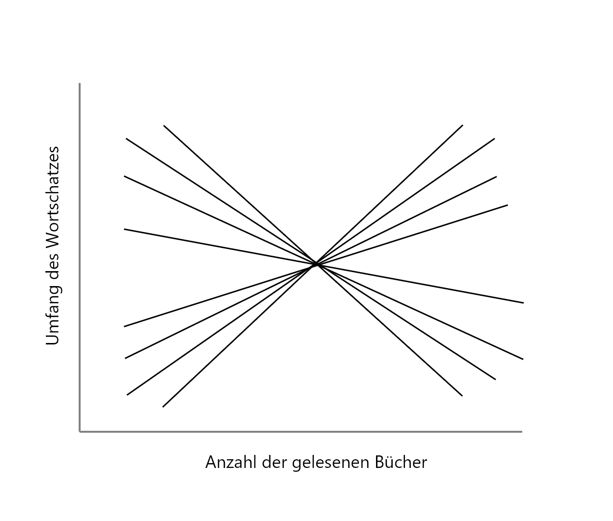
```

**Theorie, dass es eine Korrelation gibt**

Wenn deine Theorie besagt, dass es eine Korrelation zwischen zwei Variablen gibt, sind alle Korrelationen außer 0 mit deiner Theorie konform.

Ein einziger Befund würde deine Theorie falsizifieren: Die Nulkorrelation. In der Praxis tritt eine Korrelation von 0 allerdings so gut wie nie auf, da zwei Variablen immer in einer gewissen Weise miteinander korrelieren:

```{r , echo=FALSE}
knitr::include_graphics("images/03_hypothesentesten/annahme1.png")
```

**Die Nullkorrelation als Falsifikation deiner Hypothese**

Lediglich die rote Korrelation (*r* = 0) würde deine Hypothese falsifizieren. Dein Test wäre daher schwach, da fast alle Beobachtungen konform zu deiner Theorie sind. Der Grad deiner Falsifikation wäre zu klein.

Ein besserer Test wäre es, spezifische Aussagen zu machen. Indem du beispielsweise behauptest, es gibt eine positive Korrelation (bzw. positiver Zusammenhang) zwischen der Anzahl der gelesenen Bücher und dem Umfang des Wortschatzes von Personen gibt, schließt du bereits 50% der Korrelationen aus und erhöhst dadurch die Falsifikation deiner Hypothese:

```{r, echo=FALSE}
knitr::include_graphics("images/03_hypothesentesten/annahme2.png")
```

**Die gerichtete Hypothese ist falsifizierbarer als die ungerichtete Hypothese**

Indem du von einer positiven Korrelation ausgehst, erhöhst du den Grad der Falsifikation, da 50% der Werte deine Theorie falsifizieren würden (*r* \< 0).

Noch besser wäre es, würden wir noch genauere Aussagen über die Korrelation treffen können. Beispielsweise, die Korrelation ist größer als *r* \> .30. Diese Annahme würde 80% der möglichen Korrelationen ausschließen und die Falsifizierbarkeit deiner Annahme noch weiter erhöhen. Die Falsifikation können wir noch weiter steigern, indem wir Aussagen über die Reichweite unserer Theorie treffen. Gehen wir beispielsweise davon aus, dass unsere Korrelation nur für "hohe Literatur" gilt, kann unsere Theorie spezifischer getestet und damit falsifiziert werden. 

In psychologischen Fachartikeln finden wir immer wieder Hypothesen mit einer geringen Falsifizierbarkeit. Wenn ich beispielsweise teste, ob sich zwei Versuchsgruppen voneinander unterscheiden, erlaube ich, dass sowohl Gruppe A als auch Gruppe B höhere Werte haben darf als die andere Gruppe. Wenn ich allerdings sage, dass Gruppe A höhere Werte als Gruppe B haben sollte, habe ich meine Falsifizierbarkeit erhöht. Als geübte Leser\*in wissenschaftlicher Artikel solltest du daher lernen, den Grad der Falsifizierbarkeit einer Hypothese oder einer Theorie einzuschätzen. Ist die Falsifizierbarkeit gering, wird der Artikel weniger gut geeignet sein, eine Theorie zu testen als wenn die Falsifizierbarkeit hoch ist.

### Das Problem der Falsifikation

Falsifikation fördert die kritische Diskussion, sie ist allerdings selbst Gegenstand von Kritik. Wir hatten gesagt, dass Falsifikation durch empirische Beobachtungen geschieht. Widerlegen die Beobachtungen unsere Theorie, müssen wir unsere Theorie auf Dauer überdenken. Allerdings kann man sich diesem Prozess entziehen, indem man die empirische Beobachtung selbst anzweifelt. Nehmen wir die Intelligenz als Beispiel. Stell dir vor, deine Theorie besagt dass Intelligenz den Wohlstand von Menschen vorhersagt. Je intelligenter Personen sind, desto größeren Wohlstand besitzen sie. Intelligenz testest du mit dem [Raven's Progressive Matrices Test](http://eyeonsociety.co.uk/resources/RPMChangeAndStability.pdf). Nun könnte man dich für die Wahl dieses Tests kritisieren. Es kann ja sein, dass dieser Test nur bestimmte Aspekte der Intelligenz testet bzw. nicht Intelligenz, sondern ein anderes Konstrukt testet. Wäre dem so, ist dein Test nicht geeignet, deine Theorie zu falsifizieren. Noch mehr, der Test selbst müsste der Falsifikation stand halten.

Das Beispiel zeigt uns sehr deutlich, dass Wissenschaftler\*innen einen Konsens finden müssen, unter welchen Bedingungen sie Falsifikation erlaubt. Dieser Konsens ist ausgehandelt und ebenso wenig "wahr" wie die Theorie selbst. Vielmehr ist sowohl die Theorie als auch die Methodik zur Beanwortung statistischer Fragestellungen immer Gegenstand eines kritischen Austausches, der nie zu Ende gehen wird.

### Inwieweit sind Theorien der Lehr- und Lernforschung falsifizierbar?

Theorien in der Lehr- und Lernforschung sind meist probabilistisch, das heißt, sie machen Aussagen über eine Population an Menschen und besagen, dass ein Befund wahrscheinlich eintreten wird und nicht auf jeden Fall eintreten wird. Das Gegenstand zur Probabilistik ist der Determinismus. Deterministische Aussagen treffen immer zu. Wenn ich beispielsweise deterministisch behaupten würde, verteiltes Lernen ist lernwirksamer als massiertes Lernen, würde bereits *ein* Gegenbefund, meine Hypothese widerlegen. Theorien der Lehr- und Lernforschung sind allerdings nicht deterministisch, sondern probabilistisch. Du kennst diesen Unterschied aus deinem Alltag. Wenn du behauptest, dass Rauchen krebserregend ist, gibt es immer wieder Personen, die einen Onkel kennen, der zwar ein Leben lang geraucht hat, aber nie Krebs bekommen hat. Diese Kritik ist allerdings unangebracht, da die Aussage probabilistisch gemeint war. Also, Rauchen erhöht die Wahrscheinlichkeit Krebs zu bekommen. Wer raucht muss nicht zwangsläufig Krebs bekommen. 

Wenn nun einzelne empirische Beobachtungen unsere Theorie nicht falsifizieren können, ist die Lehr- und Lernforschung überhaupt eine Wissenschaft? Ja, da nicht einzelne Beobachtungen Theorien der Lehr- und Lernforschung falsifizieren, sondern viele solcher Beobachtungen. Stell dir das Würfeln einer Münze vor. Du gehst davon aus, dass die Münze fair ist, das heißt Kopf und Zahl kommen mit einer Wahrscheinlichkeit von 50% dran. Hättest du diese Annahme widerlegt, wenn deine Münze fünf mal am Stück Kopf ist? Oder 100 mal? Nein, da solche Ereignisse zwar ungewöhnlich, aber nicht unmöglich sind. Wenn nun aber Kopf immer wieder häufiger auftritt, wirst du mit der Zeit genügend Evidenz haben, die Annahme der fairen Münze aufzugeben. 

Genau weil die Falsifikation in der Lehr- und Lernforschung nur über einen längeren Zeitraum und viele Untersuchungen gelingt, können Wissenschaftler\*innen eine Theorie als auch einen Befund gegen diese Theorie akzeptieren. Selbst wenn eine Studie zeigt, dass beispielsweise eine hohe extrinsische Belastung lernförderlich ist, wird diese Studie dich nicht dazu bringen, die Cognitive Load Theory umzuschmeißen. Erst eine Fülle an Untersuchungen, die ebenda zeigen, dass extrinsische Belastungen lernförderlich sind, würden dich an der Theorie zweifeln lassen.

### Zusammenfassung

Wir haben in diesem Submodul gesehen, dass die Falsifikation das Herz des wissenschaftlichen Erkenntnisgewinns ist. Zwar können wir auf Grundlage der Induktion keine Theorien bestätigen, wir können sie allerdings falsifizieren. Präzise Hypothesen erhöhen die Falsifikation und sollten gesucht werden. Sind Aussagen nicht präzise ist es teils nicht mehr möglich, eine Theorie zu falsifizieren. Ebenso haben wir gesehen, dass einzelne empirische Beobachtungen in probabilistischen Disziplinen wie der Lehr- und Lernforschung nicht genügen, um Theorien zu falsifizieren. Erst die Sammlung einer Vielzahl an Evidenz bringt uns dazu, Theorien über Bord zu werfen. Wir werden im nächsten Submodul sehen, dass die Idee der Falsifikation mit den Konzepten des p-Wertes und der Power verknüpft werden kann.

## Stichprobenkennwertverteilungen

In diesem Submodul lernst du, was Stichprobenkennwertverteilungen sind. Dieses Submodul ist Grundlage der nächsten Submodule. Der Zweck von Stichprobenkennwertverteilungen wird sich erst nach den nächsten beiden Submodulen für dich erschließen. Wir müssen allerdings das Konzept gemeinsam verstehen, damit du den nächsten Submodulen folgen kannst. Das Submodul ist wie folgt aufgebaut:

-   Skalenniveaus und diskrete/stetige Verteilungen

-   Was ist eine Stichprobenkennwertverteilung?

-   Normalverteilung

-   Standardnormalverteilung

-   *t*-Verteilung(en)

### Skalenniveaus und diskrete/stetige Verteilungen

#### Skalenniveaus

Stell dir vor, du nimmst an einem Experiment teil, bei dem dein Intelligenzquotient ermittelt wird. Du erhältst einen Wert von 105. Ebenso wirst du bei dem Experiment nach deinem Geschlecht, deinem Alter und deinem höchsten Bildungsabschluss befragt. Die Forschenden sammeln die Werte dieser Variablen bei 40 Versuchspersonen und tragen die Werte in eine Excel-Tabelle ein:

```{r, echo=FALSE}
knitr::include_graphics("images/03_hypothesentesten/skalen.png")
```

Die Excel-Tabelle enthält vier Variablen. Das Geschlecht, das Alter, den Bildungsabschluss und den IQ der Versuchspersonen. Die Variablen haben eine Reihe an Unterschieden. Beispielsweise gibt es zwischen dem Alter zweier Personen unendliche Werte (z.B. zwischen 16 und 40). Zwischen dem Bildungsabschluss zweier Personen wiederum gibt es keine unendlichen Werte (z.B. zwischen Abitur und Werksrealschule). Solche Unterschiede können wir durch Skalenniveaus von Variablen beschreiben:

* **Nominalskalierte Variablen** haben keine Werte zwischen Ausprägungen. Beispielsweise kommt man entweder aus Bayern oder aus Hessen. Einen Wert dazwischen gibt es nicht.
* **Ordinalskalierte Variablen** haben eine Hierarchie von niedrig zu hoch oder von einfach zu schwer. Das Bildungsniveau ist ein klassisches Beispiel für eine ordinalskalierte Variable. Abitur wird als höher eingeschätzt als eine mittlere Reife.
* **Intervallskallierte Variablen** haben Werte zwischen Ausprägungen. Beispielsweise gibt es unendlich viele Werte zwischen einem Intelligenzquotienten von 100 und 110. Intervallskalierte haben allerdings keinen Nullpunkt. Zum Beispiel gibt es keinen Intelligenzquotienten von 0.
* **Verhältnisskalierte Variablen** haben ebenso unendlich viele Ausprägungen zwischen Variablen und ebenso einen Nullpunkt. Das Alter ist ein Beispiel für eine verhältnisskalierte Variable.

#### Diskrete und stetige Verteilungen

Diskrete Wahrscheinlichkeiten zeichnen sich dadurch aus, dass sie auf Grundlage von nominalskalierten und ordinalskalierten Daten berechnet werden. Beispielsweise können wir die Wahrscheinlichkeit berechnen, beim Würfeln die Augenzahl 5 zu würfen (1/6). Die Augenzahl ist eine ordinalskalierte Variable. Wir werden allerdings in diesem Kurs wenige Hypothesen auf Grundlage diskreter Stichprobenkennwertverteilungen testen. Relevant sind diskrete Stichprobenkennwertverteilungen, wenn du beispielsweise testen möchtest, ob in einer Gruppe mehr Frauen als Männer sind.

Im Unterschied dazu werden stetige Wahrscheinlichkeiten bei Variablen berechnet, die **metrisch** (intervallskaliert oder verhälnisskaliert) vorliegen. Beispielsweise können wir die Wahrscheinlichkeit berechnen, größer als 1,80 Meter zu sein. Die Wahrscheinlichkeit einzelner Ereignisse, z.B. die Größe 182,331243433454 cm geht gegen Null, da es unendliche viele Ausprägungen zwischen Variablen gibt. Beispiele für stetige Verteilungen sind die Normalverteilung, die Standardnormalverteilung und die t-Verteilung, welche wir gleich kennen lernen werden.

### Was ist eine Stichprobenkennwertverteilung?

Der Begriff Stichprobenkennwertverteilung umfasst drei Unterbegriffe: Stichprobe, Kennwert und Verteilung. Gehen wir die drei Begriffe zunächst durch:

1.  **Stichprobe**: Eine Stichprobe ist eine Teilmenge aus einer Grundgesamtheit. Zum Beispiel werden Wahlvorhersagen werden auf Grundlage von Stichproben gezogen, da es mühselig wäre, alle Menschen einer Population (die Grundgesamtheit) zu befragen. Daher erheben wir immer nur einen kleinen Anteil der Population und versuchen auf Grundlage dieser Stichprobe auf die Population zu schließen.

2.  **Kennwert**: Statistische Kennwerte fassen Datenpunkte zusammen. Du kennst bereits mehrere dieser Kennwerte: Der Mittelwert, die Standardabweichung, die Varianz oder der z-Wert. Der Mittelwert gibt den typischen Wert einer Verteilung an, die Varianz gibt an, wie weit Werte um einen Mittelwert streuen.

3.  **Verteilung**: Eine Verteilung ist eine grafische Darstellung des Auftretens einzelner Ausprägung einer Variable. Beispielsweise kennst du unimodale Verteilungen mit nur einem Gipfel, bimodale Verteilungen mit zwei Gipfeln und stetige Verteilungen.

> Eine Stichprobenkennwertverteilung ist eine grafische Verteilung von Kennwerten, die aus mehreren Stichproben gewonnen werden.

Aus dieser Definition können wir ein paar Beispiele für Stichprobenkennwertverteilungen finden: 

-   Die Verteilung von Mittelwerten, die aus mehreren Stichproben berechnet werden.

-   Die Verteilung von Mittelwertsdifferenzen, die aus mehreren Stichproben berechnet werden.

-   Die Verteilung von Varianzen, die aus mehreren Stichproben berechnet werden.

#### Simulation einer Stichprobenkennwertverteilung des Mittelwerts

Um Stichprobenkennwertverteilungen besser zu verstehen, hilft es diese zu simulieren. Stell dir vor, du ziehst eine Stichprobe von 20 Personen aus der Grundgesamtheit aller Menschen in Deutschland. Jede Person lässt du einen Intelligenztest durchführen. Aus den Intelligenzquotienten der zwanzig Personen erstellst du ein Histogram:

```{r, echo=FALSE, fig.cap="Verteilung des Intelligenzquotienten der 20 Personen. Mittelwert in blau gekennzeichnet"}
iq <- tibble(
  # skew = c(seq(-30, 0, 0.1), rep(0, 700)),
  iq = rnorm(20000, mean = 100, sd = 15),
)

set.seed(23)

iq_sample <- iq %>% 
  sample_n(20)

mean_iq <- mean(iq_sample$iq)


iq_sample %>% 
  sample_n(20) %>% 
  ggplot(aes(iq)) + 
    geom_histogram(color = "white", binwidth = 3) +
    geom_vline(xintercept = mean_iq, color = "steelblue", size = 2) +
    labs(
      x = "IQ",
      y = "Häufigkeit"
    ) +
    scale_y_continuous(expand = expansion(mult = c(0, 0)))
```

Der Mittelwert deiner Stichproben, sprich dein Kennwert, beträgt $94.62$. Stell dir als nächstes vor, du wiederholst dieses Vorgehen und ermittelst erneut den Mittelwert aus einer neuen Stichprobe. Stell dir vor, du hast Superkräfte und bist in der Lage insgesamt 10.000 Mittelwerte als Kennwerte zu ermitteln. So würden sich deine Mittelwerte über die Zeit verteilen:

```{r, echo=FALSE, warning=FALSE, cache=TRUE}
get_distribution <- function(n, data) {
  ggplot(tibble(diff = data), aes(diff)) +
    geom_histogram(color = "white",
                   alpha = .9,
                   binwidth = 1) +
    scale_y_continuous(expand = expansion(mult = c(0, 0))) +
    labs(
      x = "Mittelwerte IQ",
      y = "Häufigkeit",
      title = paste("Verteilung des Mittelwerts bei\n",
                    n, "Stichproben")
    ) +
    xlim(80, 120)
}


ten_differences <- c(1:10) %>% map_dbl(~ iq %>% sample_n(20) %>% {mean(.$iq)})

hundred_differences <- c(1:100) %>% map_dbl(~ iq %>% sample_n(20) %>% {mean(.$iq)})

thousand_differences <- c(1:1000) %>% map_dbl(~ iq %>% sample_n(20) %>% {mean(.$iq)})

ten_thousand_differences <- c(1:10000) %>% map_dbl(~ iq %>% sample_n(20) %>% {mean(.$iq)})
  
ten <- get_distribution(10, ten_differences)
hundred <- get_distribution(100, hundred_differences)
thousand <- get_distribution(1000, thousand_differences)
ten_thousand <- get_distribution(10000, ten_thousand_differences)


(ten + hundred) / (thousand + ten_thousand)

```

Drei Dinge fallen uns auf:

1.  Erstens, je mehr Kennwerte ich sammle, desto unimodaler wird die Verteilung. Bei einer Kennwertgröße von 10000 Stichproben (Kennwerten) erhalte ich eine fast perfekt unimodale Verteilung. Dieses Phänomen wird als [zentrales Grenzwerttheorem](https://de.wikipedia.org/wiki/Zentraler_Grenzwertsatz) bezeichnet.
2.  Zweitens, die Kennwerte streuen. Selbst wenn der wahre Mittelwert der Population bei 100 liegt, erhalten wir deskriptive Unterschiede des Kennwerts in den Stichproben. Beispielsweise einen Mittelwert von 95.
3.  Drittens sehen wir, dass manche Mittelwerte wahrscheinlicher sind als andere. Ein Mittelwerte von etwa 100 ist sehr wahrscheinlich, ein Mittelwerte von etwa 90 ist sehr unwahrscheinlich.
Eine solche Verteilung bezeichnen wir als Stichprobenkennwertverteilung. Stichprobenkennwertverteilungen visualisieren die Verteilung von Kennwerten aus Stichproben. In unserem Fall visualisieren wir die Verteilung von Mittelwerten aus einer Population aus 10.000 Stichproben mit 20 Personen.

#### **Visualisierung der Stichprobenkennwertverteilung des Mittelwerts bei 10000 Kennwerten und variierenden Stichprobengrößen**

Versuchen wir etwas anderes als nächstes. Stell dir vor, du bestimmst erneut 10.000 Mittelwerte aus der Population. Nur diesmal variierst du, wie viele Versuchspersonen pro Experiment getestet werden. Genauer testest du jeweils 20, 50, 100 und 500 Personen pro Erhebung. Im Folgenden siehst du, wie sich die Kennwerte in diesen vier Versuchsreihen verteilen würden:


```{r, echo=FALSE, warning=FALSE, cache=TRUE}
get_distribution <- function(n, data) {
  ggplot(tibble(diff = data), aes(diff)) +
    geom_histogram(color = "white",
                   alpha = .9,
                   binwidth = 1) +
    scale_y_continuous(expand = expansion(mult = c(0, 0))) +
    labs(
      x = "Mittelwerte IQ",
      y = "Häufigkeit",
      title = paste("Verteilung des Mittelwerte bei 1000\nKennwerten und einer Stichprobengröße von\n",
                    n, "Personen")
    ) +
    xlim(80, 120)
}

ten_differences <- c(1:1000) %>% map_dbl(~ iq %>% sample_n(20) %>% {mean(.$iq)})

hundred_differences <- c(1:1000) %>% map_dbl(~ iq %>% sample_n(50) %>% {mean(.$iq)})

thousand_differences <- c(1:1000) %>% map_dbl(~ iq %>% sample_n(100) %>% {mean(.$iq)})

ten_thousand_differences <- c(1:1000) %>% map_dbl(~ iq %>% sample_n(500) %>% {mean(.$iq)})
  
ten <- get_distribution(20, ten_differences)
hundred <- get_distribution(50, hundred_differences)
thousand <- get_distribution(100, thousand_differences)
ten_thousand <- get_distribution(500, ten_thousand_differences)


(ten + hundred) / (thousand + ten_thousand)

```

Offensichtlich wird die Verteilung steiler, wenn du mehr Versuchspersonen pro Erhebung verwendest. Warum?  Erstens bist du mit einer größeren Stichprobe eher in der Lage, den exakten Mittelwert der Population zu ermitteln. Stell dir ein Extrem vor: Du erhebst aus den 82 Millionen Menschen in Deutschland 81 Millionen Menschen. Der Mittelwert der Intelligenz dieser riesigen Stichprobe wird ziemlich sicher ähnlich zu dem Mittelwert der Population sein. Wenn du allerdings nur 100 Personen testest, wirst du vermutlich einen Mittelwert finden, der stärker von dem Populationsmittelwert abweicht. Die zweite Antwort erklärt sich durch das Konzept des Standardfehlers:

#### Der Standardfehler

Der Standardfehler ist definiert als die Standardabweichung einer Stichprobenkennwertverteilung. Die Standardabweichung kennst du bereits:

$$
sd = \sqrt{\frac{\sum_{i=1}^{n} (x_i - \bar{x})^2}{n - 1}}
$$

**Formel des Standardabweichung**

Der **Standardabweichung** ist ein Maß der Streuung. Er ist ein standardisierter Wert, der angibt, wie stark Werte in einer Verteilung voneinander streuen. Je größer die Standardabweichung, desto größer ist die Streuung einer Variable. Die Standardabweichung wird sowohl mit *s* als auch mit *sd* gekennzeichnet.

Du kennst die Standardabweichung vermutlich mit einem *n* im Nenner. Dies ist korrekt, sofern man die Standardabweichung einer Stichprobe angeben möchte. Will man hingegen die Standardaweichung der Variable in der Population messen, verwendet man *n - 1*. Dies wird auch als [Bessel's correction](https://en.wikipedia.org/wiki/Bessel%27s_correction) bezeichnet.

Der **Standardfehler** ist eine besondere Form der Standardabweichung. Er gibt an, wie stark die Kennwerte in einer Stichprobenkennwertverteilung streuen. Nehmen wir unser Intelligenzbeispiel erneut zur Hand:

```{r,echo=FALSE}
thousand
```

Das Bild stellt die Stichprobenkennwertverteilung der Mittelwerte der Intelligenzquotienten bei einer Stichprobengröße von 100 und 10.000 Erhebungen dar. Du siehst, dass es eine Verteilung ist, sprich, es herrscht eine Streuung in den Werten. Diese Streuung beschreiben wir durch den Standardfehler.

Es gibt zwei Formeln, um den Standardfehler für eine Stichprobenkennwertverteilung zu beschreiben. Eine, die exakt ist und nur zu berechnen ist, wenn man die Standardabweichung der Population kennt und eine, die auf Grundlage der Standardabweichung der Stichprobe geschätzt wird. Beginnen wir mit der exakten Formel:

$$
se = \frac{\sigma}{\sqrt{n}}
$$

**Exakter Standardfehler**

Im Zähler steht die Standardabweichung der Variable in der Population. Diesen Werten nennt man Sigma. Im Nenner steht die Wurzel aus der Stichprobengröße. Mit dieser Formel verstehst du nun, warum in unserer vorherigen Simulation der Standardfehler mit steigender Stichprobengröße immer kleiner wurde. Nehmen wir an, Sigma ist 2 und deine Stichprobengröße sind 10 Personen. Dann wäre der Standardfehler: 2 / Wurzel aus 10 = 0.63. Erhebst du hingegen 50 Personen, wäre der Standardfehler: 2 / Wurzel aus 50 = 0.28. Du siehst daran, dass der Standardfehler eine Funktion der Stichprobengröße ist. Mit steigender Stichprobe sinkt der Standardfehler, sprich die Strichprobenkennwertverteilung des Mittelwertes wird schmaler.

$$
se = \frac{s}{\sqrt{n}}
$$

**Geschätzer Standardfehler**

Wir kennen allerdings fast nie die Standardabweichung einer Variable in der Population. Da wir fast nie die gesamte Population erheben können und somit auch nicht die Standardabweichung der Population kennen, ziehen wir die Standardabweichung der Stichprobe zur Hilfe, indem wir den Standardfehler auf Grundlage der Standardabweichung der Stichprobe (*s*) schätzen. Dieser Wert wird nicht exakt gleich sein mit dem echten Wert, allerdings eine gute Annährung.

#### Unterschied Populationsverteilung und Stichprobenkennwertverteilung

Vergleicht man die Verteilung des Intelligenzquotienten in der Population mit einer der vorherigen Stichprobenverteilungen dieser Variablen, fällt einem ein Unterschied auf:

```{r, echo=FALSE}
ggplot() +
  geom_histogram(data = iq,
                 aes(x = iq),
                 fill = "#2563eb",
                 color = "white",
                   alpha = .9,
                   binwidth = 1) +
  geom_histogram(data = tibble(iq = thousand_differences),
                 aes(x = iq),
                 fill = "#f59e0b",
                 color = "white",
                   alpha = .9,
                   binwidth = 1) +
  scale_y_continuous(expand = expansion(mult = c(0, 0))) +
  labs(
    x = "IQ",
    y = "Häufigkeit"
  )
```
Die Streuung in der Variable ist immer größer als die Streuung in der Stichprobenkennwertverteilung. Im linken Bild ist orange die Stichprobenkennwertverteilung und blau die Populationsverteilung dargestellt. Wie du siehst ist die Streuung in der Populationsverteilung größer.

Wir haben nun etabliert was eine Stichprobenkennwertverteilung ist. Im nächsten Schritt lernen wir ein paar bekannte Stichprobenverteilungen kennen: Die Normalverteilung und die Standardnormalverteilung.

### Normalverteilung

Die wohl bekanntesten Verteilungen sind die Normalverteilung und die Standardnormalverteilung/z-Verteilung. Beide Verteilungen sind unimodal, das heißt sie haben nur einen Gipfel und beide Verteilung haben die Eigenschaft, dass ihre Fläche genau 1 ist. Dieser Eigenschaft machen wir uns später zunutze, um Wahrscheinlichkeiten zu berechnen.

Obwohl wir später weder eine Normalverteilung noch eine Standardnormalverteilung zur Prüfung von Hypothesen verwenden, ist es sinnvoll, diese zunächst zu behandeln. Erstens, da wir auf Grundlage dieser Verteilungen bereits die Idee der Wahrscheinlichkeitsrechnung vorweg nehmen können, die wir später benötigen, um unsere Hypothesen zu testen. Zudem stehen diese Verteilungen in Beziehungen zueinander. Beispielsweise werden wir feststellen, dass die *t*-Verteilung eine besondere Form der Standardnormalverteilung ist.

Normalverteilungen treten häufig in der Natur auf. Beispielsweise entspricht die Intelligenz von Personen in der Regel einer Normalverteilung. Ebenso entspricht die Größe von Personen oder der Blutdruck von Personen einer Normalverteilung. Normalverteilungen sehen ungefähr so aus. Achte darauf, dass wir von mehreren Verteilungen sprechen.

```{r, echo=FALSE, fig.cap="Beispiele für Normalverteilungen"}
ggplot() +
  xlim(-30, 50) +
  stat_function(
    fun = dnorm,
    geom = "line",
    args = list(mean = 0, sd = 5)
  ) +
  stat_function(
    fun = dnorm,
    geom = "line",
    args = list(mean = 0, sd = 10)
  ) +
  stat_function(
    fun = dnorm,
    geom = "line",
    args = list(mean = 10, sd = 10)
  ) +
  labs(
    x = "Variable",
    y = "Dichte"
  ) +
  scale_y_continuous(expand = expansion(mult = c(0, 0)))
```

Normalverteilungen zeichnen sich durch folgende Eigenschaften aus:

* Sie sind unimodal, dass heißt, sie haben nur einen Gipfel.
* Zudem sind Normalverteilungen immer symmetrisch um das Zentrum der Verteilung. Da die Normalverteilung symmetrisch ist, ist der Mittelwert, der Median und der Modus immer gleich.

Eine weitere interessante Eigenschaft der Normalverteilung ist, dass die die Fläche der Verteilung links und rechts um den Mittelwert bei einer Standardabweichung genau 68% beträgt. Bei zwei Standardabweichungen um den Mittelwert beträgt die Fläche \~ 95% und bei drei Standardabweichungen um den Mittelwert \~ 97.5%:

```{r eval=FALSE, include=FALSE}
ggplot() +
  xlim(-5, 5) +
  stat_function(
    fun = dnorm,
    geom = "area",
    fill = "#60a5fa",
    xlim = c(-pnorm(1), pnorm(1))
  ) +
  stat_function(
    fun = dnorm,
    geom = "area",
    fill = "#93c5fd",
    xlim = c(-pnorm(2), -pnorm(1))
  ) +
  # stat_function(
  #   fun = dnorm,
  #   geom = "area",
  #   fill = "#93c5fd",
  #   xlim = c(qnorm(.025), qnorm(.32))
  # ) +
  # stat_function(
  #   fun = dnorm,
  #   geom = "area",
  #   fill = "#bfdbfe",
  #   xlim = c(-5, qnorm(.025))
  # ) +
  # stat_function(
  #   fun = dnorm,
  #   geom = "area",
  #   fill = "#bfdbfe",
  #   xlim = c(qnorm(.975), 5)
  # ) +
  stat_function(
    fun = dnorm,
    geom = "line",
  ) +
  labs(
    x = "Kennwert",
    y = "Dichte"
  ) +
  scale_y_continuous(expand = expansion(mult = c(0, 0)))
```
```{r, echo=FALSE}
knitr::include_graphics("images/03_hypothesentesten/normalver.png")
```

### Standardnormalverteilung

Die Standardnormalverteilung ist eine besondere Normalverteilung, für die Folgendes gilt: Der Mittelwert der Standardnormalverteilung ist immer 0 und die Standardabweichung der Standardnormalverteilung ist immer 1. Die Standardnormalverteilung wird auch z-Verteilung genannt, Kennwerte in der Standardnormalverteilung werden als z-Werte dargestellt.

```{r, echo=FALSE, fig.cap="Darstellung der Standardnormalverteilung"}
ggplot() + 
  stat_function(
    fun = dnorm,
    geom = "line"
  ) +
  xlim(-5, 5) +
  labs(
    x = "z-Wert",
    y = "Dichte"
  ) +
  scale_y_continuous(expand = expansion(mult = c(0, 0)))
```

#### Wahrscheinlichkeitsberechungen auf Grundlage der Standardnormalverteilung

Du fragst dich an dieser Stelle vielleicht was wir mit diesen Verteilungen anfangen sollen? Um eine Antwort auf diese Frage zu bekommen, stell dir folgendes Szenario vor: Du möchtest wissen, ob du und deine vier Freunde intelligenter im Vergleich zur Gesamtbevölkerung seid? Du weißt, dass der Mittelwert der Population 100 ist, da dieser immer fest definiert wird. Die Standardabweichung der Intelligenzverteilung in der Population beträgt 15. Nun stellt ihr fest, dass ihr im Schnitt einen Intelligenzquotienten von 110 habt, also höher als der Durchschnitt. Die Frage ist, wie viel intelligenter seid ihr als die Gesamtbevölkerung? Hierzu können wir euren Mittelwert der Intelligenz zunächst in einen z-Wert umrechnen:

$$
z = \frac{\bar{x} - \mu}{se} = \frac{110 - 100}{15 / \sqrt{5}} = 1.49
$$

Mit dieser Berechnung versuchen wir den Mittelwert deiner Stichprobe zu standardisieren. Achte darauf, dass wir nicht den z-Wert einer Person anhand der der Populationsvariable berechnen, sondern deiner Stichprobe. Daher teilen wir durch den Standardfehler und nicht durch die Standardabweichung. Unser z-Wert ergibt 1.49. Das heißt, die Intelligenz euer Gruppe ist 1.49 Standardabweichungen größer als im Durchschnitt.

Diesen z-Wert können wir nun an der Standardnormalverteilung abtragen, um heraus zu finden, wie wahrscheinlich es ist bei der Größe eurer Stichprobe einen so hohen Intelligenzquotienten zu erhalten. Es stellt sich heraus, dass ein solcher Intelligenzmittelwert oder größer bei einer Stichprobe von 5 Personen in nur 6.81% der Fälle auftritt. Sprich, euer Mittelwert ist relativ unwahrscheinlich, wenn man annimmt, dass der Mittelwert der Stichprobenkennwertverteilung der Intelligenz 100 beträgt.

```{r, echo=FALSE}
knitr::include_graphics("images/03_hypothesentesten/kurve.png")
```


Wir könnten uns ebenso fragen, wie wahrscheinlich es ist, einen Mittelwert kleiner als 110 bei einer Stichprobengröße von 5 Personen zu erhalten? Hierfür müssten wir die Fläche links des z-Wertes abtragen:

```{r, echo=FALSE}
knitr::include_graphics("images/03_hypothesentesten/kurve1.png")
```

Wie du siehst, ist diese Wahrscheinlichkeit das Komplement der anderen Wahrscheinlichkeit. Die Wahrscheinlichkeit für einen z-Wert kleiner als 1.49 liegt bei 93.19%. Rechnen wir beide Wahrscheinlichkeiten zusammen, erhalten wir 100%: 93.19 + 6.81 = 100%.

### Zentrale Eigenschaften der Wahrscheinlichkeitsrechung

Versuchen wir an dieser Stelle einen allgemeineren Blick auf die Berechnungen von Wahrscheinlichkeiten durch Stichprobenkennwertverteilungen zu werfen.

-   Die Wahrscheinlichkeit für ein einziges Ereignis in einer stetigen Stichprobenkennwertverteilung liegt bei 0%. Ein z-Wert von exakt 1.49 beispielsweise tritt nie auf, da es unendlich viele Nachkommastellen gibt.
-   Die Wahrscheinlichkeit für irgendein Ereignis beträgt 100%. Wir haben eben gesehen, dass beide Wahrscheinlichkeiten 100% ergeben. Damit haben wir gezeigt, dass die Fläche unter einer Stichprobenkennwertverteilung immer 100% oder 1 beträgt.
-   Wir berechnen die Fläche unter einer Stichprobenkennwertverteilung durch ein Integral.

Diese drei Regel gelten für alle Stichprobenkennwertverteilungen. Sie erlauben uns später Aussagen über die Wahrscheinlichkeiten von Ereignissen zu geben. Üben wir diesen Idee als nächstes an ein zwei Beispielen:

Wie wahrscheinlich ist es einen z-Wert kleiner als 0 zu erhalten? (10%/50%/100%)

```{r, echo=FALSE, fig.cap="Lösung: 50%"}
knitr::include_graphics("images/03_hypothesentesten/kurve2.png")
```

Wie wahrscheinlich ist es einen z-Wert zwischen -1 und 2 zu erhalten? (22%/82%/42%/12%)

```{r, echo=FALSE, fig.cap="Lösung: 82%"}
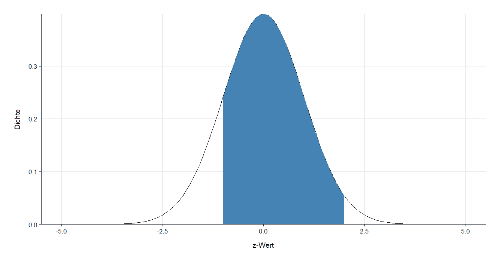
```


### t-Verteilung(en)

Eine besondere Gruppe an Stichprobenkennwertverteilung, die mit der Standardnormalverteilung verwandt sind, nennt man *t*-Verteilungen. **Wir verwenden eine *t*-Verteilung anstatt einer Standardnormalverteilung zur Überprüfung von Hypothesen, wenn wir die Standardabweichung der Population nicht kennen.** Dies ist meistens der Fall, daher werden in der Sozialforschung selten die Populationsparameter kennen (z.B. Mittelwert und Standardabweichung). Während es nur eine Standardnormalverteilung gibt, gibt es mehrere *t*-Verteilungen. Die *t*-Verteilungen ergeben sich aus der Größe der Stichprobe. Im Folgenden siehst du verschiedene *t*-Verteilungen, welche sich offensichtlich in ihrer Breite und Höhe unterscheiden:

```{r, echo=FALSE, fig.cap="Lösung: 82%"}
knitr::include_graphics("images/03_hypothesentesten/kurve4.png")
```

#### Simulation einer t-Verteilung auf Grundlage einer Stichprobe

Eine logische und berechtigte Frage ist, wie kommt man zu einer solchen *t*-Verteilung? Stell dir erneut vor, du möchtest überprüfen, wie wahrscheinlich es ist, in einer Gruppe von 5 Personen einen Intelligenzquotienten von 110 zu erhalten? **Diesmal kennst du allerdings nicht die Standardabweichung der Intelligenz in der Population**. Um den Mittelwert des Intelligenzquotienten eurer Gruppe zu standardisieren, musst du daher den Standardfehler auf Grundlage der Stichprobenstandardabweichung schätzen:

$$
t_{df} = \frac{\bar{x} - \mu}{se} = \frac{\bar{x} - \mu}{s / \sqrt{n}}
$$

Der einzige Unterschied in der Berechnung des z-Wertes und des *t*-Wertes ist, dass du anstatt der Standardabweichung der Population die Standardabweichung der Stichprobe verwendest. Alle anderen Werte sind äquivalent zum z-Wert.

Stell dir als nächstes folgende Simulation vor: Du ziehst 10 mal, 100 mal, 1000 mal und 10.000 mal eine Stichprobe mit 10 Personen aus der Population, berechnest ihren durchschnittlichen Intelligenzquotienten und rechnest diesen Mittelwert in einen *t*-Wert um. Deine t-Werte würden sich wie folgt verteilen:

```{r, echo=FALSE, cache=TRUE}
pop <- rnorm(50000, mean = 6, sd = 2.1)

get_t <- function() {
  sample1 <- sample(pop, 10)
  # sample2 <- sample(pop, 20)
  
  t <- (mean(sample1) - 6) / (sd(sample1) / sqrt(10))
  
  t
}


ten_differences <- c(1:10) %>% 
  map_dbl(~ get_t())

hundred_differences <- c(1:100) %>% 
  map_dbl(~ get_t())

thousand_differences <- c(1:1000) %>% 
  map_dbl(~ get_t())

ten_thousand_differences <- c(1:10000) %>% 
  map_dbl(~ get_t())


get_distribution_t <- function(n, data) {
  ggplot(tibble(diff = data), aes(diff)) +
    geom_histogram(color = "white",
                   alpha = .7,
                   aes(y = ..density..),
                   binwidth = 0.1) +
    stat_function(fun = dt, geom = "line",
                  args = list(
                    df = 18
                  )) +
    scale_y_continuous(expand = expansion(mult = c(0, 0))) +
    labs(
      x = "t-Wert",
      y = "Dichte",
      title = paste("Verteilung der t-Werte \nbei",
                    n, "Stichproben")
    ) +
    xlim(-5, 5)
}


ten <- get_distribution_t(10, ten_differences)
hundred <- get_distribution_t(100, hundred_differences)
thousand <- get_distribution_t(1000, thousand_differences)
ten_thousand <- get_distribution_t(10000, ten_thousand_differences)

(ten + hundred) / (thousand + ten_thousand)
```

Du siehst an der Simulation, dass sich die *t*-Werte auf deiner Simulation mit steigener Stichprobengröße einer *t*-Verteilung annähern. In anderen Worten, *t*-Verteilungen stellen nichts anderes dar als die *t*-standardisierte Verteilung von Mittelwerten aus einer Population. Um zu verstehen, weshalb wir bei einer Stichprobe von 10 Personen gerade diese *t*-Verteilung verwenden, vergleichen wir die simulierte *t*-Verteilung bei 10.000 Stichproben mit einer *t*-Verteilung, welche aus einer Stichprobe mit 30 Personen:

```{r,  echo=FALSE, warning=FALSE, fig.cap="Vergleich der t-Verteilung mit einer Stichprobe von 10 (schwarz) und 30 Personen (blau)"}
ggplot(tibble(diff = ten_thousand_differences), aes(diff)) +
    geom_histogram(color = "white",
                   alpha = .7,
                   aes(y = ..density..),
                   binwidth = 0.1) +
    stat_function(fun = dt, geom = "line",
                  color = "black",
                  args = list(
                    df = 9
                  )) +
    stat_function(fun = dt, geom = "line",
                  color = "steelblue",
                  args = list(
                    df = 29
                  )) +
    scale_y_continuous(expand = expansion(mult = c(0, 0))) +
    labs(
      x = "t-Werte",
      y = "Dichte",
    ) +
    xlim(-5, 5)
```
Wie du siehst, sind beide *t*-Verteilungen relativ ähnlich. Allerdings ist die *t*-Verteilung bei einer Stichprobe von 10 Personen (blau) etwas breiter als die *t*-Verteilung bei einer Stichprobe von 30 Personen (schwarz). Die passendere Verteilung ist offensichtlich die *t*-Verteilung mit 10 Personen, wenn auch nur minimal. Um daher die Wahrscheinlichkeit von Mittelwerten auf Grundlage einer *t*-Verteilung korrekt zu bestimmen, ist es notwendig, dass man die richtige *t*-Verteilung in Abhängigkeit der Stichprobengröße bestimmt.

#### Simulation einer t-Verteilung auf Grundlage von zwei Stichproben

Wir haben gerade gesehen, dass wir t-Verteilungen und Standardnormalverteilungen verwenden können, um die Wahrscheinlichkeit einzelner Mittelwerte anhand eines Populationsmittelwertes zu testen. Zum Beispiel, indem wir fragen, wie wahrscheinlich es ist, einen Intelligenzquotienten größer als 110 in einer Stichprobe zu erhalten.

*t*-Verteilungen können wir allerdings auch verwenden, um heraus zu finden, wie wahrscheinlich der Abstand zweier Stichprobenmittelwerte ist. Zum Beispiel könnten wir uns fragen, wie wahrscheinlich es ist, dass sich der Intelligenzquotient zweier Stichproben um 20 Punkte unterscheidet. Um diese Frage zu beantworten, können wir erneut t-Verteilungen verwenden. **Wir müssen allerdings die *t*-Werte anders berechnen**.

Stell dir dazu vor, du ziehst zwei Stichproben aus der Population und berechnest den Intelligenzquotienten dieser beider Gruppen. Der *t*-Wert bei zwei Stichproben ist nichts anderes als der standardisierte Mittelwertsunterschied dieser Stichproben. Standardisiert anhand des Standardfehlers.

$$
t_{df} = \frac{\bar{x}_1 - \bar{x}_2}{se} = \frac{\bar{x}_1 - \bar{x}_2}{\sqrt{\frac{s^2_1}{N_1} + \frac{s^2_2}{N_2}}}
$$

Erneut ziehen wir 10 mal, 100 mal, 1000 mal und 10.000 zwei Stichproben mit je 10 Personen aus der Population. Danach berechnen wir den *t*-Wert dieser Stichprobenpaaren und visualisieren diese t-Werte als Histogramme:

```{r, echo=FALSE, cache=FALSE}
pop <- rnorm(50000, mean = 100, sd = 15)

get_t <- function() {
  sample1 <- sample(pop, 10)
  sample2 <- sample(pop, 10)
  
  t <- (mean(sample1) - mean(sample2)) / 
    sqrt((var(sample1) / 10) + (var(sample2) / 10))
  
  t
}


ten_differences <- c(1:10) %>% 
  map_dbl(~ get_t())

hundred_differences <- c(1:100) %>% 
  map_dbl(~ get_t())

thousand_differences <- c(1:1000) %>% 
  map_dbl(~ get_t())

ten_thousand_differences <- c(1:10000) %>% 
  map_dbl(~ get_t())


get_distribution_t <- function(n, data) {
  ggplot(tibble(diff = data), aes(diff)) +
    geom_histogram(color = "white",
                   alpha = .7,
                   aes(y = ..density..),
                   binwidth = 0.1) +
    stat_function(fun = dt, geom = "line",
                  args = list(
                    df = 8
                  )) +
    scale_y_continuous(expand = expansion(mult = c(0, 0))) +
    labs(
      x = "t-Wert",
      y = "Dichte",
      title = paste("Verteilung der t-Werte aus zwei Mittelwerten\nbei",
                    n, "Stichproben")
    ) +
    xlim(-5, 5)
}


ten <- get_distribution_t(10, ten_differences)
hundred <- get_distribution_t(100, hundred_differences)
thousand <- get_distribution_t(1000, thousand_differences)
ten_thousand <- get_distribution_t(10000, ten_thousand_differences)

(ten + hundred) / (thousand + ten_thousand)
```

Erneut erkennst du anhand der Simulation, dass sich die *t*-Werte bei zwei Stichproben einer *t*-Verteilung annähern. Diese Verteilung zeigt uns, wie wahrscheinlich zwei Mittelwerte voneinander entfernt liegen, **sofern sie aus der gleichen Population stammen**. Zum Beispiel können wir aufgrund dieser Verteilung berechnen, wie wahrscheinlich es ist, dass der Intelligenzquotienten aus zwei Stichproben mehr als eine Standardabweichug voneinander abweichen. Wir können dies berechnen, indem wir die Fläche rechts und links des *t*-Wertes -1 und 1 abtragen und zusammen zählen:

```{r, echo=FALSE, fig.cap="Lösung: 82%"}
knitr::include_graphics("images/03_hypothesentesten/kruve6.png")
```

Wie du siehst, liegt die Wahrscheinlichkeit bei etwa 33%. Es ist also nicht äußerst unwahrscheinlich, aber auch nicht sehr wahrscheinlich, einen solch großen Unterschied aus einer Population zu finden.

### Zusammenfassung

In diesem Submodul haben wir gelernt, was Stichprobenkennwertverteilungen sind. Zunächst haben wir gelernt, dass Variablen in unterschiedlichen Skalenniveaus vorliegen können. Liegen Variablen als nominalskalierte oder ordinalskalierte Verteilungen dar, können wir sie durch diskrete Verteilungen darstellen. Liegen Variablen metrisch vor (intervall- oder verhältnisskaliert), können wir sie durch stetige Verteilungen darstellen. Diese stetigen Verteilungen bildeten den Rest dieses Submoduls. Wir haben gesehen, dass Stichprobenkennwertverteilungen genau das sind, was das Wort andeutet: Die Verteilung von Kennwerten aus Stichproben. Dabei haben wir erkannt, dass die Stichprobenkennwertverteilung des Mittelwerts immer eine Normalverteilung annimmt (zentrales Grenzwerttheorem). Die Standardnormalverteilung ist eine besondere Form der Normalverteilung, da sie immer einen Mittelwert von 0 und eine Standardabweichung von 1 hat. Wir haben ebenso gelernt, dass wir die Wahrscheinlichkeit von Kennwerten in stetigen Verteilungen wie der Standardnormalverteilung anhand des Integrals unter der Fläche der Verteilungen berechnen können. Diese Berechnungen sind Kern des restlichen Seminars, da wir durch Stichprobenkennwertverteilungen Hypothesen testen können. Zuletzt haben wir die *t*-Verteilungen kennen gelernt. *t*-Verteilungen sind eine besondere Form der Standardnormalverteilungen, in denen der Standardfehler der t-Werte anders berechnet wird als der Standardfehler der z-Werte. Im nächsten Modul werden wir sehen, wie Stichprobenkennwertverteilungen genutzt werden, um Hypothesen zu testen.

## Prozesse des statistischen Hypothesentestens

In diesem Submodul wirst du verstehen, wie Stichprobenkennwertverteilungen verwendet werden um Hypothesen in der Bildungsforschung zu testen. Wir werden hierzu jeden einzelnen Schritt von der Hypothese bis zu der statistischen Entscheidung kennen lernen. Dieses Verfahren wird uns das ganze Semester begleiten, indem wir für jede Hypothese den gleichen Prozess durchlaufen. Folgende Inhalte behandelt dieses Submodul:

-   Überblick über den Prozess des statistischen Hypothesentestens

-   Hypothesenpaar aufstellen

-   Statistische Modellierung des Hypothesenpaares

-   Kennwerte berechnen

-   Wahrscheinlichkeit des Kennwertes unter der H~0~: *P*(D\|H~0~)

-   Statistische Entscheidungen

-   Ausführliches Beispiel: *t*-test für eine Stichprobe

-   Zusammenfassung


```{r, echo=FALSE, fig.cap="Lösung: 82%"}
knitr::include_graphics("images/03_hypothesentesten/ablauf.png")
```

### Überblick über den Prozess des statistischen Hypothesentestens

Beginnen wir mit einem Überblick über den Prozess des statistischen Hypothesentestens (siehe Bild oben). Am Anfang eines jeden Experiments steht die Hypothese. Genauer ein Hypothesenpaar. Schau dir beispielsweise folgende drei Hypothesen aus drei verschiedenen Fachartikeln an:

Stull & Mayer (2017): In der folgenden Studie haben sich die Wissenschaftler gefragt, ob Lernende aus Lehrbüchern mehr lernen, wenn sie Grafiken teilweise selbst erstellen oder wenn die Grafiken vorgegeben werden.

[Stull, A. T., & Mayer, R. E. (2007). Learning by doing versus learning by viewing: Three experimental comparisons of learner-generated versus author-provided graphic organizers. Journal of Educational Psychology, 99(4), 808-820. https://doi.org/10.1037/0022-0663.99.4.808](https://psycnet.apa.org/record/2007-17712-009?doi=1)

"The purpose of Experiment 1 was to test whether students better understand a scientific passage when they are asked to generate graphic organizers (following pretraining in how to genreate hierarchies, list, flowcharts, and matrices) in spaces in the margin or when the passage contains author-provided graphic organizers."


Müller & Oppenheimer (2014): In dieser Studie hatten die Wissenschaftler die Hypothese, dass es lernwirksamer ist in einer Vorlesung per Hand als mit dem Laptop mitzuschreiben.

[Mueller, P. A., & Oppenheimer, D. M. (2014). The pen is mightier than the keyboard: Advantages of longhand over laptop note taking. Psychological Science, 25(6), 1159-1168. \<https://doi.org/10.1177/0956797614524581\>](https://journals.sagepub.com/doi/full/10.1177/0956797614524581)

"Thus, we conducted three experiments to investigate whether taking notes on a laptop versus writing long-hand affects academic performance, and to explore the potential mechanism of verbatim overlap as a proxy for depth of processing."

Hoggerheide et al. (2019): In dieser Studie untersuchten die Wissenschaftler\*innen, ob es lernwirksamer ist, anderen etwas zu erklären, als Lernmaterial wiederholt zu lernen.

[Hoogerheide, V., Renkl, A., Fiorella, L., Paas, F., & van Gog, T. (2019). Enhancing example-based learning: Teaching on video increases arousal and improves problem-solving performance. Journal of Educational Psychology, 111(1), 45--56. \<https://doi.org/10.1037/edu0000272\>](https://psycnet.apa.org/record/2018-14245-001)

"The main purpose of the present study was to investigate the hypothesis that after an initial acquisition phase consisting of studying two worked examples and solving a practice problem, teaching the content of another example on video (teaching condition) would improve learning (as measured by performance on isomorphic and transfer test problems) compared with studying that example(control condition)."

Müller und Oppenheimer (2014) beispielsweise glaubten, dass es lernwirksamer ist, Informationen aus einer Vorlesung mit der Hand aufzuschreiben als mit einem Laptop. Die Hypothese, welche man testen bzw. falsifizieren möchte, nennt man **Alternativhypothese**. Die **Nullhypothese** ist das Gegenstück der Alternativhypothese. Am Beispiel von Müller und Oppenheimer (2014) wäre die Nullhypothese, dass das Medium mit welchem man mitschreibt, keinen Einfluss auf das Lernen hat. Die Null- und Alternativhypothese bezeichnen wir als **Hypothesenpaar**.

Dieses Hypothesenpaar übersetzen wir als nächstes in statistische Modelle. Wir werden statistische Modell im nächsten Modul kennen lernen. Im Kern übersetzen wir bei der statistischen Modellierung unsere sprachlichen Hypothesen in eine mathematische Form.

```{r, echo=FALSE}
knitr::include_graphics("images/03_hypothesentesten/ablauf1.png")
```

Im Anschluss bestimmen wir Kennwerte auf Grundlage der statistischen Modellierung. Mit Kennwerten meinen wir *t*-Werte, *z*-Werte als auch *F*-Werte. Im letzten Submodul haben wir beispielsweise gesehen, dass der *t*-Wert genutzt werden kann, um heraus zu finden wie wahrscheinlich ein Mittelwert gegeben eines bestimmten Populationsmittelwerts ist.

Diese Kennwerte tragen wir an ihren Stichprobenkennwertverteilungen ab (z.B. *t*-Verteilung). Stichprobenkennwertverteilungen geben an, wie sich Kennwerte verteilen, wenn die Nullhypothese korrekt ist. Zum Beispiel: Wie würden sich die Mittelwerte zweier Stichproben unterscheiden, wenn Studierende, die per Hand schreiben genau so gut lernen wie Studierende, die mit dem Laptop mitschreiben. Dieser Schritt ist wird häufig von Studierenden missverstanden. **Wir bestimmen immer wie wahrscheinlich die Daten unter Annahme der Nullhypothese sind (P(D\|H)), nicht wie wahrscheinlich die Alternativhypothese gegeben der Daten ist (P(H\|D)).** Wir kommen gleich ausführlicher auf diese Idee zu sprechen. 

Zuletzt treffen wir eine statistische Entscheidung auf Grundlage dieser Wahrscheinlichkeit. Ist die Wahrscheinlichkeit für einen Kennwert sehr gering unter Annahme der Nullhypothese (ermittelt anhand der Stichprobenkennwertverteilung) entscheiden wir uns gegen die Nullhypothese. Ist die Wahrscheinlichkeit für einen Kennwert oder größer groß, entscheiden wir uns für die Nullhypothese. An dieser Stelle kommt die Idee der Falsifikation zum Tragen. Die Entscheidung betrifft vordergründig der Ablehnung einer Hypothese. Beispielsweise könnten wir auf Grundlage eines Experiments die Alternativhypothese ablehnen. Wir können die Alternativhypothese allerdings nie annehmen.

Zuletzt berichten wir den Prozess des statistischen Hypothesentestens, indem wir den Kennwert, die Wahrscheinlichkeit für den Kennwert und unsere statistische Entscheidung berichten. Als nächstes besprechen wir diese Schritte ausführlicher.

### Hypothesenpaar aufstellen

Beginnen wir mit einer Hypothese. Nehmen wir an, du glaubst an die [Lerntypentheorie](https://de.wikipedia.org/wiki/Lerntyp). Du behauptest, dass Lernende, die von sich behaupten visuell bzw. auditiv zu lernen mit ihrem präferiertem Medium besser lernen als mit ihrem nicht-präferiertem Medium. Zwar stellst du nur eine Hypothese auf (die Unterschiedshypothese), du nimmst allerdings implizit zwei Hypothesen an: Eine **Nullhypothese (H0)**, die von keinem Unterschied zwischen den beiden Gruppen ausgeht und eine **Alternativhypothese (H1)**, die von einem Unterschied ausgeht. Vor dem Experiment weißt du nicht, welche der Hypothesen korrekt ist.

Solche Hypothesenpaare sind immer der erste Schritt beim statistischen Hypothesentesten. Die Alternativhypothese ist diejenige Hypothese, von der du glaubst, dass sie der Falsifikation stand hält. Die Nullhypothese ist diejenige Hypothese, welche die Alternativhypothese falsifzieren würde.

Es gibt verschiedene Typen an Hypothesen:

> **Unterschiedshypothese:** Mit einer Unterschiedshypothese testest du in der Regel, ob sich Gruppen in einer Variable voneinander unterscheiden. Beispielsweise, lernen Lernende, die mehr als 7 Stunden schlafen mehr als Lernende die weniger als 7 Stunden schlafen. Oder, ist es wirksamer per Hand oder mit dem Laptop in einer Vorlesung mitzuschreiben. In der Mitte des Seminars werden wir vor allem Unterschiedshypothesen prüfen.

> **Zusammenhangshypothese:** Mit einer Zusammenhangshypothese testest du, ob mehrere Variablen in einer Beziehung miteinander stehen. Zum Beispiel: Führt eine höhere Motivation zu mehr Lernen? Oder, steigt der Verkauf von Eis mit dem Anstieg der Temperatur? Zusammenhangshypothesen lernen wir in den nächsten Modulen kennen.

> **Veränderungshypothese:** Mit einer Verändurungshypothese testest du, ob sich eine Variable über die Zeit verändert. Zum Beispiel: Verringert Entspannungstraining über die Zeit die Aggression von Menschen? Oder, kann man sich durch wiederholtes Meditieren besser konzentrieren. Wir prüfen in diesem Seminar allerdings keine Veränderungshypothesen.

Für jede Art von Hypothese wird eine Null- und Alternativhypothese aufgestellt. Nimmst du beispielsweise an, dass eine höhere Motivation zu mehr Lernen führt (Alternativhypothese), stellst du ebenso die Nullhypothese auf, dass Motivation und Lernen in keinem Zusammenhang zueinander stehen.

#### Eigenschaften von Hypothese

Für jede Hypothese gilt, dass sie allgemeingültig und probabilistisch ist.

**Allgemeingültig** bedeutet, dass Hypothesen Aussagen über eine Population treffen, nicht über eine Stichprobe. Wenn ich beispielsweise in einem Experiment heraus finde, dass das Mitschreiben mit der Hand lernwirksamer ist als das Mitschreiben mit dem Laptop, treffe ich eine Aussage über eine gesamte Population und nicht über die Stichprobe. Stichproben beschreibt man anhand deskriptiver Daten. Aussagen über die Population macht man anhand der Inferenzstatistik, welche wir in diesem Kurs kennen lernen.

Ebenso sind Hypothesen **probabilistisch**. Das bedeutet, wir machen Aussagen über die Tendenz von Gruppen, aber nicht über Einzelwerte von Gruppen. Beispielsweise kann ich auf Grundlage von Experimenten behaupten, dass es lernwirksamer per Hand als mit dem Laptop mitzuschreiben. Ich sage damit allerdings nicht, dass es ausgeschlossen ist, dass eine Perosn, die per Laptop schreibt mehr lernt als eine Person, die mit per Hand schreibt. Dieser Unterschied tritt häufig in der Kommunikation mit statistischen Laien auf. Du sagst zum Beispiel, dass langes Schlafen dem Lernen hilft, deine Freundin kennt aber den Onkel Harald, der nur fünf Stunden schläft und trotzdem gut lernt. Onkel Harald ist allerdings ein Einzelfall und kann durchaus trotz wenig Schlaf gut lernen. Onkel Harald falsifiziert in anderen Worten deine Hypothese nicht.

### Statistische Modellierung des Hypothesenpaares

Sobald wir unser Hypothesenpaar bestimmt haben, müssen wir diese Hypothesen statistisch modellieren. Wir werden im nächsten Modul die statistische Modellierung ausführlicher besprechen, an dieser Stelle genügt ein kleines Beispiel, um die statistische Modellierung im Groben zu verstehen.

```{r, echo=FALSE}
knitr::include_graphics("images/03_hypothesentesten/ablauf2.png")
```

Stell dir vor, du glaubst, dass Studierende im Schnitt mehr als 10 Bücher pro Jahr lesen. Deine Null- und Alternativhypothese würde in diesem Fall wie folgt lauten:

-   **Nullhypothese**: Der Populationsmittelwert ist gleich 10 Bücher pro Jahr
-   **Alternativhypothese**: Der Populationsmittelwert ist größer als 10 Bücher pro Jahr

Statistisch können wir diese beiden Hypothesen wie folgt darstellen:

* Nullhypothese: Der Mittelwert der Variable entspricht 10:$\mu = 10$.
* Alternativhypothese: Der Mittelwert der Variable ist größer als 10: $\mu > 10$

Ein statistisches Modell wird nun genutzt, um Werte vorherzusagen. Für jedes Hypothesenpaar erstellen wir zwei Modelle: Das kompakte Modell ($MODEL_A$) und das erweiterte Modell ($MODEL_C$).

$$
MODEL_A : \hat{Y} = \mu
$$
$$
MODEL_C : \hat{Y} = 10
$$
-   **Kompaktes Modell ($MODEL_C$):** In unserem Fall besagt das kompakte Modell: Die Anzahl der Bücher für jede Person beträgt 10. Diese Annahme entspricht unserer Nullhypothese (H~0~). Y-Dach steht für den Wert, welchen das Modell vorhersagt.
-   **Erweitertes Modell ($MODEL_A$)**: Das Modell für die Alternativhypothese müsste lauten: Die Anzahl der Bücher entspricht dem Mittelwert der Population (μ). Wir gehen davon aus, dass dieser Mittelwert größer als 10 ist. In der Grafik ist der Populationsmittelwert durch das Symbol μ (ausgesprochen mü) gekennzeichnet.

### Kennwerte berechnen

Auf Grundlage dieser beiden Modelle berechnen wir als nächstes Kennwerte. In diesem Kurs werden wir vor allem *t*- und *F*-Werte kennen lernen. Im Verlauf des Kurses werden wir sehen, dass *t*- und *F*-Werte miteinander verwandt sind. Wir werden daher vor allem *F*-Werte berechnen. Folgende Verallgemeinerung können wir an dieser Stelle bezüglich der Kennwerte treffen:

-   ***t*****-Wert**: Wie viele Standardabweichungen sind zwei Werte (z.B. Mittelwerte) voneinander entfernt? Zum Beispiel: Wie viele Standardabweichung sind zwei Mittelwerte voneinander entfernt? Wie viele Standardabweichungen ist ein Korrelationskoeffizient von 0 entfernt? Wie viele Standardabweichung lesen Studierende mehr als 10 Bücher?
-   ***F*****-Wert**: Das kompakte Modell macht Fehler in seiner Vorhersagen. Das erweiterte Modell kann bessere Vorhersagen machen, da es Informationen aus mehr Variablen umfasst als das kompakte Modell. Der *F*-Wert gibt an, wie viel besser diese zusätzlichen Variablen die abhängige Variable aufklären als willkürliche andere Variablen. Wenn du diese Ausführungen an der Stelle nicht verstehst, nicht schlimm, wir werden es ausführlich in den nächsten Kapitel aufbauen.

### **Wahrscheinlichkeit des Kennwertes unter der H0: $P(D|H_0)$**

Als nächstes überprüfen wir wie wahrscheinlich solche Kennwerte sind, unter der Annahme, dass die Nullhypothese korrekt ist. Diese Wahrscheinlichkeit bezeichnen wir als $P(D|H_0)$. Zum Beispiel: Wie wahrscheinlich ist es, dass sich zwei Gruppen um zwei Standardardabweichungen unterscheiden, wenn beide Gruppen aus der gleichen Population stammen? Oder, wie wahrscheinlich ist es, dass der Korrelationskoeffizient zweier Variablen bei *r* = .80 liegt, wenn diese beiden Variablen in Wirklichkeit gar nicht miteinander korrelieren? Oder, wie wahrscheinlich ist es, dass der Intelligenzquotient einer Stichprobe 120 beträgt, während der echte Populationsmittelwert bei 100 liegt?

In anderen Worten, wir fragen uns immer, ob die Kennwerte unter Annahme der Nullhypothese wahrscheinlich oder unwahrscheinlich sind. Genau diese Feststellung ist mit der Idee der Falsifikation vereinbar. Indem wir sagen, dass ein Kennwert unwahrscheinlich ist, können wir eine Hypothese teilweise falsifizieren. Das heißt aber auch, dass wir keine Aussagen darüber machen, wie wahrscheinlich die Hypothese gegeben den Daten ist: $P(H|D)$. Warum? Da $P(H|D)$ die inverse Wahrscheinlichkeit von $P(D|H)$ ist. Dieser Unterschied wird von Forschenden und Studenten häufig verwechselt. Um zu akzeptieren, dass diese beiden Wahrscheinlichkeiten invers sind, ein Beispiel: Wie hoch ist die Wahrscheinlichkeit innerhalb von zwei Jahren zu sterben, wenn Menschen von einem Krokodil der Kopf abgerissen wird: *P*('in zwei Jahren sterben' \| 'Kopf von Krokodil abgebissen')? Diese Wahrscheinlichkeit liegt bei 1. Jede Person, der der Kopf von einem Krokodil abgebissen wird, stribt sofort. Wie hoch ist wiederum die Wahrscheinlichkeit, dass man von einem Krokodil den Kopf abgerissen bekommen hat, gegeben dass man innerhalb der letzten zwei Jahre gestorben ist: *P*( 'Kopf von Krokodil abgebissen'\|'in den letzten zwei Jahren gestorben')? Du siehst also, dass diese Wahrscheinlichkeiten unterschiedlich sind. Wir sollten daher beide voneinander unterscheiden. In der Statistik fragen wir uns immer, wie wahrscheinlich die Daten unter Annahme der Nullhypothese sind: $P(D|H_0)$.

> $P(D|H_0)$ bezeichnet die **Wahrscheinlichkeit eines Kennwertes unter Annahme der Nullhypothese. $P(D|H_0)$ wird auch als **p-Wert** bezeichnet.

### Statistische Entscheidungen

Zu Beginn dieses Moduls haben wir gesagt, dass die Falsifikation das Herzstück der Statistik ist. Wir können keine Hypothesen bestätigen, sie allerdings widerlegen. Genau das machen wir durch statistische Entscheidungen. Genauer lehnen wir die Nullhypothese ab, wenn der Kennwert unter Annahme der Nullhypothese sehr unwahrscheinlich ist. Ebenso lehnen wir die Alternativhypothese ab, wenn der Kennwert unter Annahme der der Nullhypothese wahrscheinlich ist. Diese Form einer binären Entscheidungen geht auf die Statistiker, [Jerzy Neyman](https://de.wikipedia.org/wiki/Jerzy_Neyman) und [Egon Pearson](https://de.wikipedia.org/wiki/Egon_Pearson) zurück. Sie sagten, dass man die Nullhypothese bei einer Wahrscheinlichkeit von unter 5% ablehnen (**das Alpha-Niveau**) sollte und die Nullhypothese bei einer Wahrscheinlichkeit von über 5% vorläufig annehmen sollte:

```{r, echo=FALSE}
knitr::include_graphics("images/03_hypothesentesten/binaer.png")
```

Bei einer Wahrscheinlichkeit eines Kennwertes unter 5% spricht man von einem **signifikanten Ereignis**. Warum 5%? Der 5% Werte oder das **Alpha-Niveau** wurde willkürlich von [Sir Ronald Fisher](https://de.wikipedia.org/wiki/Ronald_Aylmer_Fisher) gewählt. **Signifikanz bedeutet allerdings nicht, dass ein Ergebnis bedeutsam ist, sondern, dass ein Ereignis unter Annahme der Nullhypothese unwahrscheinlich ist.**

> **Signifikant** bedeutet, dass ein Kennwert unter Annahme der Nullhypothese **unwahrscheinlich** ist; **nicht**, dass ein Ergebnis bedeutsam ist.

Die Entscheidung für oder gegen die Nullhypothese hilft der Theoriebildung folgendermaßen: Stell dir vor, es werden 100 Experimente zu der Frage durchgeführt, ob die Mitschrift per Hand lernwirksamer ist als die Mitschrift mit dem Laptop. In 80 Experimenten entscheiden sich die Forschenden dafür, die Nullhypothese abzulehnen. Das heißt, in 80% der Fälle lehnen die Forschenden die Aussage ab, dass es keinen Unterschied zwischen diesen beiden Gruppen gibt. Diese Vielzahl an Experimenten deuten also darauf hin, dass die Mitschrift per Hand in der Tat lernwirksamer ist as die Mitschrift mit dem Laptop. Damit haben die Forschenden relativ überzeugend die Hypothese falsifiziert, dass beide Techniken äquivalent sind.

Dieses Beispiel zeigt uns, dass statistische Entscheidungen auf lange Sicht helfen, eine Theorie zu falsifizieren. Im Grunde versuchen wir bei jedem Experiment einen Test zu entwickeln, der uns hilft dieser Schlussfolgerung näher zu kommen. Die Erkenntnis liegt bei diesem Vorgehen nicht in einem Experiment, sondern in vielen Experimenten. Daher wir diese Art der Statistik auch als [Frequentistischer Wahrscheinlichkeitsbegriff](https://de.wikipedia.org/wiki/Frequentistischer_Wahrscheinlichkeitsbegriff) bezeichnet. Dieser Ansatz eignet sich, wenn wir für unser Handeln Entscheidungen treffen müssen. Zum Beispiel, sollten Lernende mit ihrem präferiertem Lernmaterial lernen oder nicht? Ist es besser einen Text wiederholt zu lesen, oder sein Wissen frei abzufragen? Stellen wir beispielsweise wiederholt fest, dass die die Annahme wiederholtes Lesen sei gleich effektiv wie die freie Wissensabfrage widerlegt wird, können wir auf Dauer eine Entscheidung treffen, Lernende zu empfehlen, eine bestimmte Lerntechnik einer anderen vorzuziehen. Der frequentistische Wahrscheinlichkeitsbegriff entwickelt Erkentnisse daher erst nach einer Fülle an Experimenten.

### Ausführliches Beispiel: t-Test für eine Stichprobe

Stell dir vor, du glaubst, dass Studierende pro Jahr mehr als 10 Bücher lesen. Um deine Hypothese zu prüfen, befragst du 30 Studierende willkürlich an deiner Universität, wie viel Bücher sie im letzten Jahr gelesen haben. Im Schnitt stellst du fest, dass deine Stichprobe 12.45 Bücher (Mittelwert) im letzten Jahr gelesen hat:

```{r, echo=FALSE}
knitr::include_graphics("images/03_hypothesentesten/buecher.png")
```

Deskriptiv sind es also bereits mehr als 10 Bücher. Allerdings weißt du nicht, ob das unwahrscheinlich mehr Bücher sind als man unter der Nullhypothese (10 Bücher pro Jahr) annehmen würde. Folgendes Hypothesenpaar stellst du auf:

-   **Nullhypothese**: Die Studierenden lesen 10 Bücher pro Jahr
-   **Alternativhypothese**: Die Studierenden lesen mehr als 10 Bücher pro Jahr

Die Frage lautet nun, kannst du deine Nullhypothese falsifizieren? In anderen Worten, ist es unwahrscheinlich, dass die Studierenden 12.45 Bücher pro Jahr lesen, wenn sie in Wirklichkeit im Mittel 10 Bücher pro Jahr lesen?

$$
H_0 : \hat{Y}_i = 10
$$

$$
H_0 : \hat{Y}_i > 10
$$

**Statistische Modellierung deiner Hypothese**

Deine Null- und Alternativhypothese lassen sich wie folgt modellieren. Das Modell der Nullhypothese (bzw. das kompakte Modell) nimmt an, dass Studierende im Schnitt 10 Bücher pro Jahr lesen. Das heißt, das Modell schätzt für jede Person, dass er oder sie 10 Bücher pro Jahr liest. Das Modell der Alternativhypothese (bzw. das erweiterte Modell) sagt voraus, dass eine Person mehr als 10 Bücher pro Jahr liest. Du erwartest daher, dass der Populationsmittelwert größer als 10 ist.

$$
t_{df} = \frac{\bar{x} - 10}{s / \sqrt{n}} = \frac{12.45 - 10}{2.73 / \sqrt{30}} = 4.92
$$

**Bestimmung des Kennwertes**

Im nächsten Schritt bestimmst du den Kennwert. Für den *t*-Test mit einer Stichprobe können wir einen *t*-Wert berechnen. Der *t*-Wert gibt uns an, wie viele Standardabweichungen der *t*-Wert vom Mittelwert der Nullhypothese entfernt liegt. Wir erhalten einen empirischen *t*-Wert von 4.92.

Grafisch können wir den (empirischen) *t*-Wert in der *t*-Verteilung darstellen:

```{r, echo=FALSE}
knitr::include_graphics("images/03_hypothesentesten/kurve6.png")
```

**Wahrscheinlichkeit des Kennwertes unter der Nullhypothese: P(D\|H~0~)**

Als nächstes fragen wir uns, wie wahrscheinlich der *t*-Wert ist, wenn in Wirklichkeit Studierende 10 Bücher pro Jahr lesen. Erinnere dich, dass die *t*-Verteilung die Verteilung von Mittelwerten aus Stichproben beschreibt, die aus einer Population gewonnen werden, in denen die Nullhypothese gilt (Studierende lesen 10 Bücher pro Jahr).

Zunächst siehst du, dass der *t*-Wert weit vom Gipfel der *t*-Verteilung entfernt liegt. Damit wissen wir, dass der von uns gefundene empirische *t*-Wert (4.92) sehr unwahrscheinlich ist, wenn der Mittelwert der Population bei 10 liegt. Genauer ist die Wahrscheinlichkeit für einen solchen empirischen *t*-Wert geringer als 1%.\
Da dieser empirische *t*-Wert innerhalb des kritischen Bereichs (blau dargestellt) liegt, sprechen wir von einem **signifikanten Ereignis**.

**Statistische Entscheidung**

Da es sich um ein signifikantes Ereignis handelt, lehnen wir die Nullhypothese zu Gunsten der Alternativhypothese ab. Wir entscheiden uns demnach auf Grundlage unseres Experiments dafür, die Annahme, dass Studierende 10 Bücher pro Jahr lesen, inkorrekt ist.

**Ergebnis berichten**

Zuletzt berichten wir unser Ergebnis. Hierfür formulieren wir folgenden Textabschnitt:

> "Um zu prüfen, ob Studierende pro Jahr mehr als 10 Bücher pro Jahr lesen, wurde ein *t*-Test für eine Stichprobe berechnet. Der *t*-Test ergab einen signifikanten Effekt, *t*(29) = 4.91, *p* \< .001, *d* = 0.90 (großer Effekt), was darauf hinweist, dass Studierende mehr als 10 Bücher pro Jahr lesen."

Wie die Ergebnisse berichtet werden, lernen wir im Verlaufe des Seminars ausführlich kennen.

### Zusammenfassung

```{r, echo=FALSE}
knitr::include_graphics("images/03_hypothesentesten/ablauf.png")
```

In diesem Submodul haben wir gelernt, wie man von einer Hypothese zu einem Ergebnis in einer Studie kommt. Dieser Prozess umfasst verschiedene Schritte, die wir in diesem Kurs immer wieder wiederholen werden. Zu Beginn einer jeden Forschungsfrage steht eine Hypothese, die wir als Hypothesenpaar formulieren. Dieses Hypothesenpaar werden wir statistisch modellieren. Dieser Schritt ist an dieser Stelle vermutlich noch unklar, er wird dir allerdings klarer, wenn wir uns mit dem *F*-Wert beschäftigen, da der *F*-Wert aus diesen statistischen Modellen berechnet wird. Sobald wir den Kennwert haben, berechnen wir die Wahrscheinlichkeit für den Kennwert unter der Nullhypothese. Kennwerte machen Aussagen über unsere Hypothesen. Ein *t*-Wert beispielsweise kann eine Aussage über den Mittelwertsunterschied zwischen Gruppen machen. Ein *t*-Wert kann aber auch sagen, wie viele Standardabweichung eine Korrelation von 0 entfernt ist. Indem wir die Wahrscheinlichkeit dieser Kennwerte unter der Nullhypothese berechnen, geben wir an, wie unwahrscheinlich ein Mittelwertsunterschied oder ein standardsierter Unterschied eine Korrelation von 0 ist, wenn es zum Beispiel keinen Mittelwertsunterschied zwischen Gruppen gibt oder wenn es keine Korrelation zwischen zwei Variablen gibt. Auf Grundlage dieser Wahrscheinlichkeit treffen wir eine binäre statistische Entscheidung: Wir lehnen die Nullhypothese ab oder behalten sie. Liegt die Wahrscheinlichkeit für den Kennwert unter 5%, lehnen wir die Nullhypothese ab, liegt die Wahrscheinlichkeit über 5%, akzeptieren wir die Nullhypothese vorläufig. Am Ende dieses Prozess berichten wir das Ergebnis des Tests.

## Alpha- und Betafehler und Power

In diesem Submodul lernen wir weitere wichtige Begriffe der Statistik kennen, die wir im Verlaufe des ganzen Kurses verwenden werden. Wir werden in diesem Submodul lernen, dass die statistischen Entscheidungen, welche wir auf Grundlage des *p*-Wertes ermitteln, falsch sein können und, dass wir diese Entscheidungen nur auf dem Hintergrund der Power einer Studie interpretiert sollten. Genauer werden wir lernen, dass wir die Stichprobengröße vor einem Experiment mit Bedacht wählen sollten, um in der langen Sicht zu richtigen Entscheidungen zu kommen.

### Alpha- und Betafehler

In unserem letzten Modul haben wir gezeigt, dass wir in der Statistik binäre Entscheidungen treffen. Entweder lehnen wir die Nullhypothese ab oder wir behalten sie vorläufig. Ist die Wahrscheinlichkeit eines Kennwertes unter Annahme der Nullhypothese geringer als 5% lehnen wir die Nullhypothese ab, ist die Wahrscheinlichkeit unter Annahme der Nullhypothese höher, akzeptieren wir die Nullhypothese vorläufig. Dieser 5%-Wert ist ein Beispiel für ein **Alpha-Niveau**. Das Alpha-Niveau gibt an, unter welcher Wahrscheinlichkeit wir die Nullhypothese verwerfen, unter der Bedingung, dass es keinen Effekt in der Population gibt.

Grafisch dargestellt können wir das Alpha-Niveau bei einer gerichteten und ungerichteten Hypothese an einer *t*-Verteilung darstellen. Im unteren Bild siehst du links eine gerichtete Hypothese (M1 \> M2), im rechten Bild eine ungerichtete Hypothese (M1 = M2). Wie du siehst, wird das Alpha-Niveau bei einer ungerichteten Hypothese auf zwei Seiten geteilt. Der Kennwert könnte entweder unwahrscheinlich kleiner oder größer gegeben der Nullhypothese sein. Die Summe der beiden Flächen ergibt wiederum 5% (2.5% + 2.5%). Bei der gerichteten Hypothese tragen wir das Alpha-Niveau auf nur einer Seite der *t*-Verteilung ab. In diesem Fall gehen wir davon aus, dass der Mittelwert M1 größer ist als der Mittelwert M2. Daher tragen wir das Alpha-Niveau rechts vom Mittelwert der *t*-Verteilung ab.

```{r, echo=FALSE}
knitr::include_graphics("images/03_hypothesentesten/kurve7.png")
```

Was passiert nun, wenn die Nullhypothese in der Population korrekt ist, aber unser Kennwert innerhalb des Alpha-Niveaus fällt? In diesem Fall entscheiden wir uns gegen die Nullhypothese und machen damit einen statistischen Fehler. Wir entscheiden uns gegen die Nullhypothese obwohl die Nullhypothese korrekt ist. Diesen Fehler nennen wir **Alpha-Fehler.** Das Gegenstück zum Alpha-Fehler ist der Beta-Fehler. Der Beta-Fehler tritt auf, wenn wir uns für die Nullhypothese entscheiden, diese allerdings inkorrekt ist.

```{r, echo=FALSE}
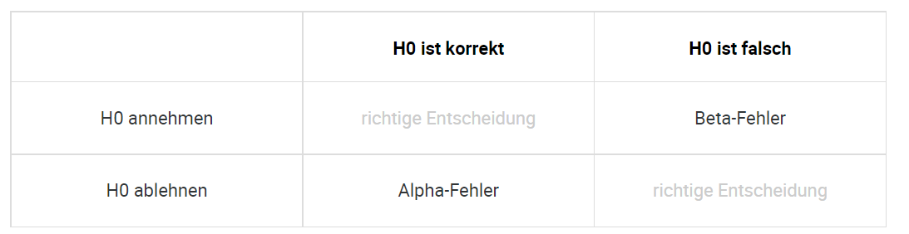
```

### Die Welt der Nullhypothese: Der Alpha-Fehler

Um diese beiden Fehler besser zu verstehen, gehen wir von zwei Welten aus. In der einen Welt ist die Nullhypothese korrekt (z.B. es gibt keinen Mittelwertsunterschied zwischen zwei Gruppen). In der anderen Welt ist die Nullhypothese falsch (z.B. es gibt einen Mittelwertsunterschied). Die Welt, in der wir uns gerade befinden, stelle ich als durchängige Verteilung dar. Die andere Welt, stelle ich als gestrichelte Verteilung dar.

```{r, echo=FALSE}
knitr::include_graphics("images/03_hypothesentesten/kurve8.png")
```

In der Welt der Nullhypothese (leicht graue Verteilung mit durchgängigem Rand) führt jeder empirisch ermittelte *t*-Wert, der innerhalb des blauen Bereichs fällt zu einer fälschlichen Ablehnung der Nullhypothese. In anderen Worten, immer wenn der empirische *t*-Wert in den blauen Bereich fällt, begehen wir einen Alpha-Fehler. Da wir das Alpha-Niveau vorab bestimmt haben, wissen wir, dass wir in 5% der Fälle einen solchen Fehler machen, selbst wenn die Nullhypothese korrekt ist. Oder, in 95% der Fälle treffen wir auf lange Sicht die richtige Entscheidung, wenn die Nullhypothese korrekt ist. Sagen wir beispielsweise du wiederholst ein Experiment 100 mal. Stimmt deine Nullhypothese, solltest du in etwa 95 Fällen kein signifikantes Ergebnis erhalten. In etwa 5 Fällen allerdings solltest du ein signifikantes Ergebnis erhalten und damit einen Alpha-Fehler begehen. Alpha-Fehler sind demnach nicht vermeidbar, selbst wenn die Nullhypothese korrekt ist.

Wir können den Alpha-Fehler aber auch in einer anderen Art und Weise visualisieren. Stell dir vor, es gibt keinen Unterschied zwischen den Gruppen und du wiederholst das gleiche Experiment in vier Versuchsreihen 20000 mal. Die vier Versuchsreihen unterscheiden sich in ihrer Stichprobengröße. Du führst je eine Reihe mit 5, 10, 50 und 200 Versuchspersonen pro Experiment durch. Im Folgenden siehst du wie sich die p-Werte bei diesen vier Versuchsreihen in den 20000 Experimenten verteilen. Auf der x-Achse siehst du die p-Werte auf der y-Achse die Häufigkeit dieser p-Werte.

```{r, echo=FALSE}
knitr::include_graphics("images/03_hypothesentesten/alpha.png")
```

Wie du erkennst, sehen die Verteilungen gleich aus. Sie sind stetig. Die Botschaft dieser Visualisierung ist, dass der Alpha-Fehler von der Stichprobengröße unabhängig ist. In der Welt der Nullhypothese machen wir immer mit einer Wahrscheinlichkeit von 5% einen Alpha-Fehler. Egal, wie groß die Stichprobe ist.

### Die Welt der Alternativhypothese: Beta-Fehler

In der Welt der Alternativhypothese gehen wir davon aus, dass die Nullhypothese inkorrekt ist. Das heißt, wir nehmen beispielsweise an, dass es einen Mittelwertsunterschied zwischen zwei Gruppen gib (beispielsweise einen Mittelwertsunterschied von 1 bei einer Standardabweichung von 2.1 zwischen zwei Gruppen in der Population). Auch in dieser Welt können wir einen Fehler machen. Diesen Fehler nennen wir **Beta-Fehler**. Der Beta-Fehler tritt auf, wenn wir die Nullhypothese annehmen, obwohl sie inkorrekt ist. Oder, wenn wir die Alternativhypothese ablehnen, obwohl sie korrekt ist.

```{r, echo=FALSE}
knitr::include_graphics("images/03_hypothesentesten/beta.png")
```

In der obigen Visualisierung ist der Betafehler geringer als 50% (braune Fläche) aber nicht viel geringer (daran zu erkennen, dass die braune Fläche nahe am Gipfel der Verteilung liegt). Ein solches Experiment wäre nicht sonderlich sensitiv. Gäbe es einen Mittelwertsunterschied in der Population und würden wir diesen Effekt mit einer kleinen Stichprobe (\~ 20 Versuchspersonen) testen, würden wir in \~40% der Fälle eine falsche statistische Entscheidung treffen, selbst wenn unsere Alternativhypothese korrekt ist. Als Folge könnte es beispielsweise sein, dass wir eine Lernmethode nicht empfehlen, obwohl diese wirksam ist.

In der Regel möchten wir, dass der Beta-Fehler geringer als 20% ist. Das heißt, wir wollen sicher stellen, dass wir auf lange Sicht nicht zu oft eine falsche statistische Entscheidung treffen, sofern unsere Alternativhypothese korrekt ist. Nur, wir machen wir das? Indem wir die Größe der Stichprobe bestimmen.

In der folgenden Visualisierung siehst du den Beta-Fehler unter vier Bedingungen. Stell dir wieder ein einziges Experiment vor. In diesem Experiment möchtest du testen, ob visuell Lernende besser mit visuellem als mit auditivem Lernmaterial lernen. Du glaubst, Lernende, die sich als visuelle Lerner bezeichnen lernen mehr durch visuelles als mitauditivem Lernmaterial. Gehen wir weiterhin davon aus, dass der wirkliche Mittelwertsunterschied dieser beiden Gruppen in der Population 1 Punkt beträgt (gemessen durch den Test des Experiments). Zudem liegt die Standardabweichung der beiden Gruppen bei 2.1. Stell dir nun vor, du wiederholst das Experiment mit 5, 10, 50 und 200 Versuchspersonen. In der Visualisierung siehst du in braun die Wahrscheinlichkeit mit der du bei diesen vier Experimenten einen Beta-Fehler machen würdest.

```{r, echo=FALSE}
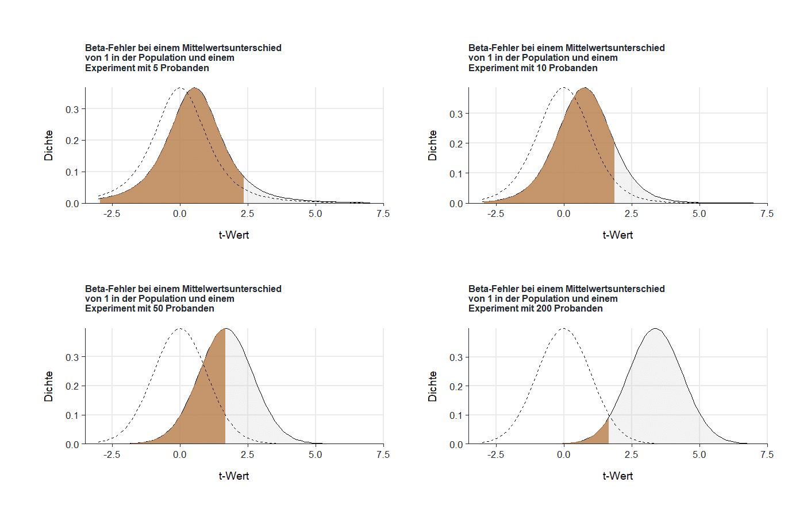
```

Offensichtlich ändert sich die Wahrscheinlichkeit für einen Beta-Fehler abhängig der Stichprobe. Je größer die Stichprobe ist, desto unwahrscheinlicher tritt ein Beta-Fehler auf. Bei 5 Versuchspersonen machst du mit ziemlicher Sicherheit einen Beta-Fehler, selbst wenn es einen Unterschied zwischen den Gruppen in der Population gibt. Liegt die Stichprobengröße bei 200 Versuchspersonen wirst du selten einen Beta-Fehler machen.

Die gleiche Botschaft können wir durch eine *p*-Wert-Verteilung darstellen. Erneut simulieren wir 20.000 Experimente mit unterschiedlichen Stichproben. Du siehst, dass sich die Verteilung der *p*-Werte ändert, sofern die Alternativhypothese korrekt ist bzw. ein Effekt in der Population besteht. Mit steigender Stichprobengröße verringert sich der Beta-Fehler (daran zu erkennen, dass es weniger Balken rechts des roten Strichs gibt):

```{r, echo=FALSE}
knitr::include_graphics("images/03_hypothesentesten/beta2.png")
```

Zur besseren Verständlichkeit können wir beide Visualisierungen miteinander kombinieren und zeigen, dass die Beta-Fehler in der *t*-Verteilung äquivalent zu den Beta-Fehlern in der *p*-Verteilung sind:

```{r, echo=FALSE}
knitr::include_graphics("images/03_hypothesentesten/beta3.png")
```

### Vergleich von Alpha- und Betafehler

Sowohl in der Welt der Nullhypothese als auch in der Welt der Alternativhypothese können wir statistische Fehlentscheidungen treffen. Wir nennen diese Fehlentscheidungen Alpha- und Beta-Fehler. Die beiden Fehler werden als Wahrscheinlichkeiten angegeben und geben uns Hinweise darauf, mit welcher Wahrscheinlichkeit wir falsche statistische Entscheidungen treffen. Welche Welt die korrekte ist, wissen wir meist nicht. Wir führen Studien durch, um diese Frage zu beantworten. Wiederholen wir viele Studien mit dem gleichen Versuchsaufbau werden wir auf lange Sicht mit einer bestimmten Wahrscheinlichkeit Fehler machen.

Wir haben gesehen, dass die Wahrscheinlichkeit für einen Alpha-Fehler immer bei 5% liegt. Die Wahrscheinlichkeit für einen Beta-Fehler varriiert abhängig der Stichprobe. Je größer die Stichprobe, desto kleiner die Wahrscheinlichkeit für einen Beta-Fehler. Für uns als Wissenschaftler\*innen bedeutet dies, dass wir die Stichprobengröße bei einem Experiment mit Bedacht wählen sollten, da wir ansonsten Gefahr laufen, zu häufig einen Beta-Fehler zu machen. Stell dir vor, du führst ein aufwändiges Experiment durch, welches allerdings mit einer Wahrscheinlichkeit von 80% einen Beta-Fehler macht (das weißt du natürlich vorher nicht). In nur 20% der Fälle würdest du korrekt schließen, dass es einen Effekt gibt. In den meisten Fällen würdest du allerdings fälschlicherweise annehmen, dass es keinen Effekt gibt.

### Power (Teststärke)

Power oder Teststärke ist das Gegenstück zum Beta-Fehler. Liegt der Beta-Fehler bei 40%, liegt die Power bei 60%. Liegt der Beta-Fehler bei 20%, liegt die Power bei 80%. Kurzum, Power errechnet sich durch 100%- Beta-Fehler.

In der folgenden Visualisierung beispielsweise siehst du in grün dargestellt die Power eines Experiments. Die rechte Verteilung stellt die Alternativhypothese dar, die linke die Nullhypothese. Du kannst aus der Visualisierung erkennen, dass die Power dieser Studie unter 50% liegt. In anderen Worten, sollte es einen Effekt in der Population geben, wirst du diesen mit einer Wahrscheinlichkeit geringer als 50% in einem Experiment finden. Deine Studie hätte eine geringe Power.

```{r, echo=FALSE}
knitr::include_graphics("images/03_hypothesentesten/power.png")
```

> **Power** ist die Wahrscheinlichkeit mit der wir bei **Korrektheit der Alternativhypothese** ein **signifikantes Ergebnis** erziehen

Ganz ähnlich wie bei dem Beta-Fehler können wir uns ansehen, wie sich die Power mit steigender Stichprobengröße verändert. Hierfür visualisieren wir uns die Power erneut mit einer Stichprobe von 5, 10, 50 und 200 Personen pro Gruppe:

```{r, echo=FALSE}
knitr::include_graphics("images/03_hypothesentesten/power1.png")
```

Du siehst, dass die Power mit steigender Stichprobengröße steigt. In anderen Worten, je mehr Versuchspersonen du bei einem Experiment erhebst, desto wahrscheinlicher erhältst du ein signifikantes Ergebnis. Erneut erkennen wir also, dass die Power keine feste Größe wie der Alpha-Fehler ist, sondern von der Stichprobengröße in einem Experiment abhängt. Da die Power varriabel ist, sollten wir uns Gedanken machen, wie groß die Power sein sollte.

In der Regel versucht man in einer Studie eine **hohe** Power zu erzielen. Eine Richtgröße ist eine Power von über 80%. Wir wollen Experimente erstellen, in denen wir - bei einem bestehenden Effekt - mit einer Wahrscheinlichkeit von über 80% die richtige statistische Entscheidung fällen. Nämlich, dass wir die Nullhypothese ablehnen, da sie inkorrekt ist. Im Umkehrschluss bedeutet dies, dass jeder Effekt bei genügend großer Stichprobe signifikant wird. Selbst wenn es einen minimalen Effekt zwischen zwei Gruppen gibt, kannst du mit einer großen Stichprobe zeigen, dass der Unterschied zwischen den Gruppen signifikant ist. Aus diesem Grund sollte die Stichprobengröße bei einem Experiment nicht willkürlich gewählt werden. Ist deine Power zu klein, hast du geringe Chance, einen Effekt zu erzielen. Wir lernen mit geringer Power quasi gar nichts, da unser Test nicht sensitiv genug ist, einen Effekt zu finden. Liegt deine Power bei 100%, wirst du selbst bei trivialen Unterschieden zu signifikanten Ergebnissen kommen.

### Power-Analysen: Ein Exkurs

Gehen wir zurück zu unserem ursprünglichen Experiment. Du hast geglaubt, dass visuelle Lernende besser mit visuellem als mit auditivem Lernmaterial lernen. Um diese Hypothese zu prüfen, entscheidest du dich pro Gruppe (visuelle Lerner mit visuellem Material und visuelle Lerner mit auditivem Material) 20 Personen zu testen, ohne vorab eine Power-Analyse zu machen. Was du nicht weißt, ist, dass der Effekt sehr sehr klein ist. Genauer gibt es folgende Kennwerte in der Population: Würde man alle Lernende die Tests durchführen lassen, würde die Gruppe mit dem präferiertem Lernmaterial 6.1 Punkte bei einer Standardabweichung von 1.6 bekommen und die Gruppe mit dem nicht-präferiertem Lernmaterial 6.0 Punkte bei einer Standardabweichung von 1.6. Die Frage ist nun, wie hoch ist deine Power bei einer Stichprobengröße von 20 Personen pro Gruppe?

Ein cleveres Tool für die Analyse von Power ist [G\*Power](https://www.psychologie.hhu.de/arbeitsgruppen/allgemeine-psychologie-und-arbeitspsychologie/gpower.html). G\*Power wird von zahlreichen Wissenschaftlern verwendet, um **vor** einem Experiment die Stichprobengröße für das Experiment zu bestimmen. Zunächst ermittelst du die Größe des Effekts durch G\*Power:

```{r, echo=FALSE}
knitr::include_graphics("images/03_hypothesentesten/effekt.jpg")
```

**Größe des Effekts bestimmen**

Du erkennst, dass auf der rechten Seite die deskriptiven Daten der Population eingegeben werden. G\*Power sagt dir, dass in der Population ein Effekt von *d* = 0.06 besteht. Wir bezeichnen einen solchen Effekt als klein. Der Effekt ist so klein, dass man davon ausgehen kann, dass die Gruppen faktisch identisch sind.

```{r, echo=FALSE}
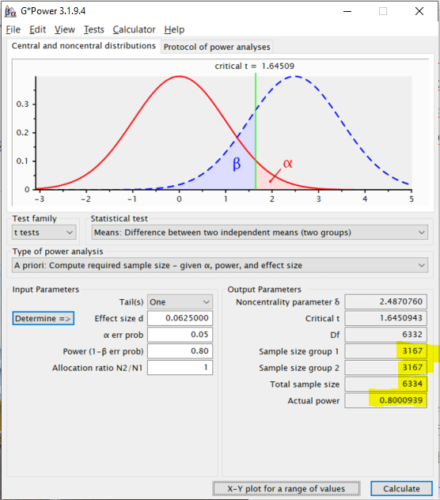
```

**Stichprobengröße für eine Power von 80%**

G\*Power sagt uns nun, dass wir 6334 Versuchspersonen erheben müssten, um eine Power von 80% zu erzielen. Der Effekt ist so klein, dass wir eben erst mit ganz vielen Versuchspersonen zu signifikanten Ergebnissen kommen würden. Das heißt, euer Experiment mit 20 Personen wird sogut wie nie einen signifikanten Effekt erzielen. Ihr werdet fast immer nicht-signifikante Ergebnisse erzielen. Das liegt daran, dass ihr entweder einen zu großen Effekt erwartet oder eine zu kleine Stichprobe für den minimalen Effekt gewählt habt.

```{r, echo=FALSE}
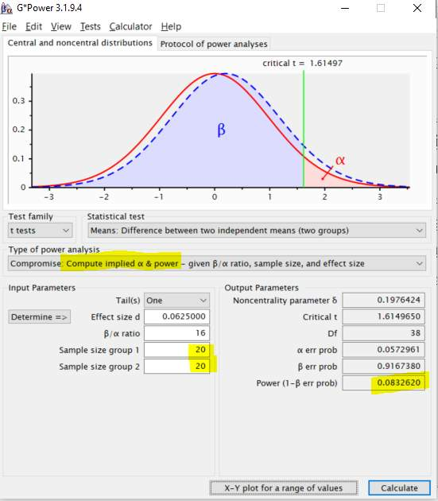
```

**Power bei einer Stichprobe von insgesamt 40 Versuchspersonen**

Wir können ebenso die tatsächliche Power deines Experiments bestimmen. Diese liegt bei 20 Personen pro Gruppe bei 8%. Somit wirst du in nur 8% der Fälle (solltet ihr das Experiment häufig wiederholen) ein signifikantes Ergebnis erzielen. Du wirst demnach mit ziemlicher Sicherheit zu dem Schluss kommen, dass es keinen Unterschied zwischen den Gruppen gibt. Dies Feststellung ist auch korrekt, da der Unterschied minimal und damit zu vernachlässigen ist.

### Zusammenfassung

In diesem Submodul haben wir uns ausführlicher mit Fehlschlüssen in statistischen Entscheidungen befasst. Aus dem letzten Submodul haben wir erfahren, dass wir in der Statistik binäre Entscheidungen treffen. Wir entscheiden uns für oder gegen die Nullhypothese. In diesem Submodul haben wir gelernt, dass wir für diese beiden Entscheidungen Fehler machen können. (1) Wir können uns gegen die Nullhypothese entscheiden, obwohl diese korrekt ist (Alpha-Fehler); und (2) wir können uns für die Nullhypothese entscheiden, obwohl sie inkorrekt ist (Beta-Fehler). Der Alpha-Fehler ist fixiert, das heißt er wird per Konvention auf einen bestimmten Wert definiert. In der Lehr- und Lernforschung verwendet man ein Alpha-Niveau von 5%. Der Beta-Fehler ist varriabel und hängt unter anderem von der Stichprobengröße ab. Beide Fehler werden als Wahrscheinlichkeiten angegeben. Wiederholt man das gleiche Experiment hunderte Male, wird man diese Wahrscheinlichkeiten erhalten. Das Gegenstück vom Beta-Fehler ist die Power. Die Power kennzeichnet die Wahrscheinlichkeit ein signifikantes Ergebnis zu erzielen. In der Regel versucht man durch die richtige Wahl der Stichprobengröße die Power auf über 80% zu halten.

## Die Effektstärke Cohen's d

### Was sagen uns Signifikanztests?

Bevor wir das Modul abschließen, ist es noch wichtig, dass wir den Begriff der Effektstärken und insbesondere die Effektstärke Cohen's *d* kennen lernen. Wir haben mittlerweile etabliert, dass wir bei dem statistischen Hypothesentesten prüfen, ob ein Kennwert unter der Annahme der Nullhypothese unwahrscheinlich ist. Dieser Prozess hilft uns auf die lange Sicht, Entscheidungen zu treffen. Zum Beispiel, ob wir eine Lernmethode einer anderen bevorzugen sollen. Oder, ob zwei Variablen miteinander korrelieren (z.B. Rauchen und Lungenkrebs). Das bedeutet Signifikanztests zeigen uns, wie wir handeln sollen.

> **Signifikanztests** geben an, wie wir **handeln** sollten; **Effektstärken** zeigen, wie groß ein Effekt ist und ob er **praktisch nützlich** ist.

### Was sagen uns Effektstärken?

Effektstärken wiederum beantworten uns eine andere Frage. Effektstärken geben uns an, wie groß ein Effekt ist. Beispielsweise mag es sein, dass eine Lernmethode effektiver ist als eine andere, aber wie viel effektiver ist sie? Ebenso mag es sein, dass zwei Variablen miteinander korrelieren, aber wie hoch korrelieren diese beiden Variablen miteinander? Während uns Signifikanztests auf Dauer helfen, Entscheidungen zu treffen, helfen uns Effektstärken einzuschätzen, ob Entscheidungen praktisch nützlich sind. Stell dir beispielsweise vor, du findest dass eine Lernmethode A minimal besser ist als eine andere Lernmethode B. Lernmethode A ist allerdings deutlich teurer. In diesem Fall macht es viellicht Sinn trotz des minimalen Vorteils der Lernmethode A, sich für Lernmethode B zu entscheiden. Andererseits kann es sein, dass ein Deliktinterventionsprogramm bei Jugendlichen minimal wirksam ist (siehe [Wilson et al., 2003](https://journals.sagepub.com/doi/abs/10.1177/1049731502238754)). Wenn aber nur 3 aus 100 Jugendlichen aufgrund dieses Programms keine Straftat begehen, werden weniger Menschen verletzt, oder gar umgebracht. Der geringe Effekt hat demnach eine praktische Bedeutsamkeit, da selbst der minimal Effekt fundamentale Auswirkungen auf wenige Menschen hat.

Wir werden in diesem Kurs verschiedene Effektstärken kennen lernen (PRE, R-Quadrat, Eta-Quadrat, partielles Eta-Quadrat und Cohen's *d*). Da wir bisher lediglich Tests kennen gelernt haben, mit der man Mittelwertsunterschiede zwischen einer Gruppe und einem festen Wert bzw. zwischen zwei Gruppen testen kann, beschäftigen wir uns in diesem Submodul mit der Effektstärke Cohen's *d*, welche für solche Mittelwertsunterschiede verwendet wird.

### Cohen's d

Cohen's *d* gibt an, wie viele Standardabweichungen zwei Mittelwerte voneinander entfernt liegen. Die Formel für Cohen's *d* lautet wie folgt:

$$
d = \frac{\bar{x}_1 - \bar{x}_2}{s}
$$
#### Cohens' d bei nur einer Stichprobe

Stell dir beispielsweise vor, du möchtest die Effektstärke bei einem *t*-Test für eine Stichprobe testen. In diesem Fall hast du nur eine Stichprobe und damit auch nur einen Mittelwert. Im letzten Modul beispielsweise haben wir getestet, ob Studierende mehr als 10 Bücher pro Jahr lesen. Der Mittelwert der Stichprobe betrug 12.49. Nehmen wir nun an, dass die Standardabweichung der Stichprobe der 30 Studierenden bei 3 lag.

$$
d = \frac{\bar{x}_1 - \bar{x}_2}{s} = \frac{12.49 - 10}{2.74} = 0.90
$$
In diesem Fall berechnet sich Cohen's *d* wie folgt: Du ziehst den erwarteten Mittelwert (10 von deinem empirischen Mittelwert ab. Diese Differenz teilst du durch die Standardaweichung deiner Stichprobe. Cohen's d beträgt demnach 0.90.

#### Cohens' d bei zwei Stichproben

Stell dir nun vor, du vergleichst den Mittelwert von zwei Gruppen miteinander. Du möchtest wissen, ob Studierende, die eine Concept-Map erstellen mehr lernen als Studierende, die einen Text erneut lesen. Dein Test hat maximal 10 Punkte. Folgende deskriptive Daten erhälst du:

c_map_vergleich

```{r, echo=FALSE}
knitr::include_graphics("images/03_hypothesentesten/c_map_vergleich.png")
```

Cohen's *d* berechnet sich nun aus dem Mittelwertsunterschied dieser beiden Gruppen durch die gepoolte Standardabweichung der beiden Gruppen. Die gepoolte Standardabweichung berechnet sich wie folgt:

$$
s_{pooled} = \sqrt{\frac{(n_1 - 1) * s^2_1 + (n_2 - 1) * s^2_2}{(n_1 + n_2 - 2)}} = \sqrt{\frac{(22 - 1) * 1.8^2 + (20 - 1) * 2.1^2}{(22 + 20 - 2)}} = 1.95
$$
**Gepoolte Standardabweichung**

Die genaue Berechnung der gepoolten Standardabweichung ist an dieser Stelle nicht so wichtig. Entscheidend ist, was dieser Wert bedeutet. Die gepoolte Standardabweichung ist eine Art Mittelwert der Standardabweichungen der beiden Gruppen. Der Mittelwert ist an die Stichprobengröße der Stichproben adjustiert. Du siehst, dass die gepoolte Standardabweichung bei diesem Beispiel 1.95 beträgt.

$$
d = \frac{\bar{x}_1 - \bar{x}_2}{s_{pooled}} = \frac{12.53 - 10}{1.95} = 1.21
$$
**Cohen's d zwei Stichproben**

Cohen's *d* berechnet sich nun aus dem Mittelwertsunterschied der beiden Gruppen und der gepoolten Standardabweichung. Du siehst, dass wir in diesem Fall ein Cohen's *d* von 1.21 erhalten.

### Einordnung der Größe von Cohen's d

Jede Effektsgröße wird normalerweise in Größen eingeteilt. Man spricht dann von einem kleinen, mittleren und großen Effekt. Folgende Einteilung hat sich für Cohen's *d* etabliert.

```{r, echo=FALSE}
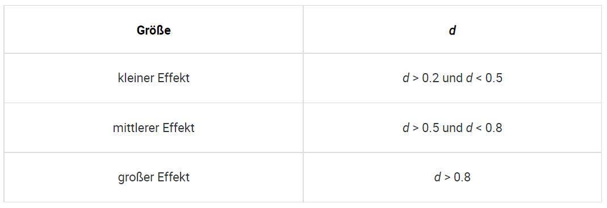
```

Unser obiger Effekt von 1.21 kann daher als großer Effekt bezeichnet werden. Zwar werden Effekte häufig mit der praktischen Bedeutsamkeit gleichgesetzt, allerdings sollte die Effektstärke immer auf dem Hintergrund der jeweiligen Disziplin gedeutet werden.

<!--chapter:end:03-hypothesentesten_i.Rmd-->

# Statistische Modellierung

```{r include=FALSE}
source("_theme.R")
library(patchwork)
library(tidyverse)
library(ggtext)
```

## Einführung

Dieses Modul beschäftigt sich ausführlicher mit der statistischen
Modellierung im Prozess des statistischen Hypothesentestens. Du wirst in
diesem Modul lernen, wie du die Null- und Alternativhypothese in
mathematische Modelle übertragen kannst und wie diese Modelle genutzt
werden, um Hypothesen zu testen. Erneut werden wir uns mit Konzepten
beschäftigen, die uns das ganze Semester begleiten werden. Je solider
dieses Fundament sitzt, desto einfacher werden für dich die nächsten
Module. Und erneut testen wir in diesem Modul die Fragestellung aus dem
letzten Modul:

> Lesen Studierende mehr als 10 Bücher pro Jahr?

Genauer werden wir in diesem Modul den *t*-Test für eine Stichprobe,
welche wir im vorherigen Modul berechnet haben, anhand der statistischen
Modellierung durchführen. In diesem Modul werden wir zeigen, wie wir
diese Hypothese statistisch modellieren können und anhand des *F*-Wertes
prüfen können. Im Verlaufe dieses Prozesses werden wir uns mit folgenden
zentralen Konzepten beschäftigen:

-   **Statistische Modelle**: Wie können sprachliche Hypothesen in
    mathematische Modelle übertragen werden?

-   **Freiheitsgrade**: Wir werden lernen, dass Freiheitsgrade anzeigen,
    wie viele Parameter noch in ein Modell hinzugefügt werden können.

-   **Fehler in Modellen**: Wir werden die Konzepte $SSE_A$, $SSE_C$ und
    SSR einführen, welche die Fehler beschreiben, die unsere Modelle
    noch in der Vorhersage der wahren Werte machen. Wir werden lernen,
    dass wir Fehler quadrieren, da dies vorteilhafte Eigenschaften hat.

-   **PRE (Proportional Reduction in Error)**: PRE ist ein Maß der
    Effektstärke. Wir werden lernen, dass PRE angibt, wie viele Prozent
    der Fehler des kompakten statistischen Modells das erweiterte Modell
    vorhersagt.

-   ***F*****-Wert**: Der *F*-Wert ist eine Erweiterung von PRE und gibt
    an, wie viel besser die Parameter des erweiterten Modells im
    Vergleich zu willkürlichen Parametern sind, die keinen Beitrag zur
    Vorhersage der abhängigen Variable leisten.

-   **Äquivalenz F und *t***: Wir werden lernen, dass der *F*-Wert und
    der *t*-Wert nah verwandt sind und am Beispiel des *t*-Test für eine
    Stichprobe diese Äquivalenz aufzeigen.

-   **Tabelle der Ergebnisse**: Wir werden lernen, wie all diese
    zentralen Konzepte in der Regel tabellarisch in Statistiksoftwares
    ausgegeben werden. Dies hilft uns später, den Output von Jamovi bzw.
    anderen Softwares besser zu verstehen.

-   **Notation statistische Modelle**: Zum Schluss werden wir das
    Vokabular der statistischen Modellierung vertiefen, indem wir
    lernen, welche Symbole für was stehen.

## Übersicht statistische Modellierung und Prozess des statistischen Hypothesentestens

In drei Videos versuche ich, dir zwei zentrale Ideen dieses Kurses zu
erklären: Wie wir Hypothesen statistisch modellieren und wir diese
Modelle nutzen, um Hypothesen zu testen.

### Statistische Modellierung


Find the pdf of this video [here](pdfs/statistical_models.pdf)


Find the pdf of this video
[here](pdfs/statistisches_hypothenthesten.pdf)

## Statistische Modellierung der Null- und Alternativhypothese

### Fragestellung dieses Moduls

Im letzten Modul hatten wir die Fragestellung getestet, ob Studierende
mehr als 10 Bücher pro Jahr lesen. Hierzu hatten wir 30 Studierende
willkürlich gefragt, wie viele Bücher sie letztes Jahr gelesen haben.
Wir fanden einen signifkanten Effekt und konnten damit zeigen, dass die
Annahme, Studierende lesen 10 Bücher pro Jahr gegeben der Daten sehr
unwahrscheinlich ist. Daher hatten wir die Nullhypothese abgelehnt. In
diesem Modul wiederholen wir den gleichen Test, nur dass wir diesemal
statistische Modelle verwenden, um die Hypothese zu beantworten. Am Ende
des Moduls werden wir zeigen, dass wir mit diesem Verfahren zu den
gleichen Ergebnissen wie mit dem *t*-Test für eine Stichprobe kommen.
Zur Erinnerung, dies war das Ergebnis unseres Tests:

> "Um zu prüfen, ob Studierende pro Jahr mehr als 10 Bücher pro Jahr
> lesen, wurde ein *t*-Test für eine Stichprobe berechnet. Der *t*-Test
> ergab einen signifikanten Effekt, *t*(**29**) = 4.91, *p* \< .001, *d*
> = 0.90 (großer Effekt), was darauf hinweist, dass Studierende mehr als
> 10 Bücher pro Jahr lesen."

Achte darauf, dass wir momentan noch nicht wissen, was die Zahl 29 in
diesem Output bedeutet. Wir werden am Ende dieses Submoduls nochmal
darauf zu sprechen kommen.

### Null- und Alternativhypothese der Fragestellung

Zu Beginn eines jeden statistischen Tests müssen wir eine Null- und
Alternativhypothese aufstellen. Bei unserer Hypothese handelt es sich
zunächst um eine *Unterschiedshypothese*. Wir glauben, dass Studierende
mehr als 10 Bücher pro Jahr lesen. Die Null- und Alternativhypothese
lauten folgendermaßen:

-   **Nullhypothese**: Der Populationsmittelwert ist *gleich* 10 Bücher
    pro Jahr

-   **Alternativhypothese**: Der Populationsmittelwert ist *größer als*
    10 Bücher pro Jahr

```{r , echo=FALSE}
knitr::include_graphics("images/04_statistische_modellierung/ablauf.png")
```

### DATA = MODEL + ERROR

Die statistische Modellierung kann in einem Satz zusammen gefasst
werden: DATA = MODEL + ERROR. In anderen Worten, die wahren Werte
setzten sich immer aus unserem mathematischen Modell und den Fehlern,
die dieses Model macht, zusammen.

Mit **DATA** bezeichnen wir die **abhängige Variable**, jene Werte, die
wir vorhersagen möchten. Mit **MODEL** bezeichnen wir das mathematische
Modell auf Grundlage dessen wir die abhängige Variable vorhersagen
möchten.

Da mathematische Modelle nie perfekt sind, gibt es immer Fehler in der
Vorhersage. Diese Fehler nennen wir **ERROR**. Wenige Studierende lesen
exakt 10 Bücher pro Jahr. In anderen Worten ist die abhängige Variable
immer die Kombination aus einem mathematischen Modell und dem Fehler,
den wir mit diesem Modell machen.

### Statistische Modellierung der Null- und Alternativhypothese

Das Ziel der statistischen Modellierung ist es, das sprachliche
Hypothesenpaar in ein mathematisches Hypothesenpaar zu überführen.
Beginnen wir mit der Frage, wie das kompakte und das erweiterte Modell
statistisch modelliert werden.

> Wir nennen das statistische Modell der **Nullhypothese** das
> **kompakte Modell** und das statistische Modell der
> **Alternativhypothese** das **erweiterte Modell.**

#### **Statistisches Modell der Nullhypothese: Das kompakte Modelle**

Die Nullhypothese besagt, dass Studierende pro Jahr 10 Bücher lesen. Wir
werden im Folgenden verschiedene Möglichkeiten beschreiben, diese
Nullhypothese als kompaktes Modell statistisch darzustellen:

$$
\hat{Y}_i = 10
$$ 

**Geschätze Anzahl der Bücher pro Jahr**

Dieses Modell gibt an, dass jede Person pro Jahr 10 Bücher liest. Das
*Y* mit dem Dach kennzeichnet einen *geschätzten Wert*. Wir nennen
diesen Wert **abhängige Variable**. Das statistische Modell ist rechts
des = Zeichens. Unser Modell besagt, dass jede Person exakt 10 Bücher
pro Jahr liest.

$$
Y_i = 10 + \epsilon_i
$$

**Tatsächliche Anzahl der Bücher pro Jahr**

Dieses Modell gibt an, wie viele Bücher jede Person pro Jahr
*tatsächlich* liest. Achte darauf, dass die abhängige Variable kein Dach
mehr hat. Damit sagen wir, dass dies der reale Wert der Anzahl der
Bücher ist. Den realen Wert können wir nur korrekt schätzen, da wir ɛ
(Epsilon) am Ende des Modells hinzufügen. ɛ steht für den Fehler
(ERROR), den wir in der Schätzung der Anzahl der Bücher für jede Person
machen. Wenn zum Beispiel Hans 12 Bücher pro Jahr liest, müsste ɛ den
Wert 2 haben, damit wir für Hans exakt 12 Bücher pro Jahr vorhersagen.

$$
Y_i = B_0 + \epsilon_i
$$

**Tatsächliche Anzahl der Bücher pro Jahr**

Dieses Modell ist äquivalent zum vorherigen, nur dass wir anstatt von 10
$B_0$ schreiben. Ein großes $B$ steht immer für Werte, welche wir nicht
auf Grundlage der Daten berechnen, sondern vorgeben. Die Aussage dieses
Modells bleibt die gleiche: Der reale Wert setzt sich aus dem Modell und
dem Fehler zusammen, den wir mit dem Modell machen.

$$
B_0 = \beta_0
$$ 

**Annahme** $B_0$ und $\beta_0$

Bei der Nullhypothese nehmen wir an, dass der vorgegebene Wert 10 oder
$B_0$ dem Populationsmittelwert $\beta_0$ entspricht. In anderen Worten,
wir glauben bei der Nullhypothese, dass alle Studierenden (die
Population) im Schnitt 10 Bücher pro Jahr lesen. $\beta$ steht daher
immer für Kennwerte der Population. In diesem Fall den Gruppenmittelwert
der Population.

#### **Statistisches Modell der Alternativhypothese: Das erweiterte Modelle**

Die Alternativhypothese besagt, dass Studierende mehr als 10 Bücher pro
Jahr lesen. Wie viel mehr? Das sagt uns der Mittelwert der Stichprobe.

$$
\hat{Y}_i = 12.45
$$ 

**Geschätzte Anzahl der Bücher auf Grundlage des erweiterten Modells**

Das erweiterte Modell schätzt, dass jede Person 12.45 Bücher pro Jahr
liest. 12.45, da dies der Mittelwert der Stichprobe der 30 Studierenden
ist. Erneut ist dieses Modell natürlich nicht absolut genau, da manche
Personen mehr oder weniger Bücher lesen. Genau deswegen sprechen wir von
$\hat{Y}$, um zu sagen, dass die abhängige Variable auf Grundlage des
Modells geschätzt wird.

$$
\hat{Y}_i = b_0
$$ 

**Geschätzte Anzahl der Bücher auf Grundlage des erweiterten Modells**

Dieses Modell ist exakt gleich zum vorherigen Modell. Nur, in diesem
Fall sprechen wir von $b_0$ und nicht von 12.45. Ein kleines $b$ steht
immer für **Parameter**, die wir auf Grundlage der Daten schätzen. In
unserem Fall ist der Parameter der Mittelwert der Stichprobe.

$$
Y_i = b_0 + \epsilon_i
$$ 

**Tatsächliche Anzahl der Bücher auf Grundlage des erweiterten Modells**

Dieses Modell gibt die tatsächliche Anzahl der Bücher an, die jede
Person pro Jahr gelesen hat. Du siehst, dass $Y$ kein Dach mehr hat und
dass wir einen Fehlerterm hinzugefügt haben ($e_i$). Wir verwenden ein
kleines $e$ bei Fehlern, wenn wir die Fehler auf Grundlage unserer
geschätzten und nicht der wahren Parameter verwenden. In unserem Fall
haben wir $b_0$ geschätzt und verwenden daher $e_i$.

### Freiheitsgrade

An dieser Stelle müssen wir einen neuen Begriff einführen. Den Begriff
der Freiheitsgrade. Um zu verstehen, was ein Freiheitsgrad ist, müssen
wir zwei Feststellungen treffen:

#### **1. Feststellung: Jedes Modell kann so viele Parameter aufnehmen, wie es Datenpunkte gibt**

Ein **Parameter** ist ein Koeffizient in einem statistischen Modell,
welchen wir auf Grundlage der Daten schätzen und in die Modelle
integrieren. Zum Beispiel:

$$
Y_i = \beta_0 + \epsilon_0
$$ 

Dieses Modell hat beispielsweise **einen Parameter** $\beta_0$. **Wir kürzen die Parameter des erweiterten Modells ab sofort mit** $PA$ ab. In unserem Beispiel steht $\beta_0$ für die Anzahl der Bücher, die die Population der Studierenden pro Jahr liest. Als **Faustregel: Alle Koeffizenten, die entweder mit einem** $\beta$ oder einem kleinen $b$ geschrieben werden, sind Parameter. Alle Koeffizienten, die mit einem großen $B$ geschrieben werden, sind keine Parameter.

$$
Y_i = B_0 + \epsilon_0
$$ 

Zum Vergleich: Das kompakte Modell, welches wir aus unserer Nullhypothese generiert haben, hat keine Parameter, da wir $B_0$ nicht schätzen, sondern vorgegeben haben. **Wir kürzen die Parameter des kompakten Modells ab sofort mit** $PC$ ab.

Nun, da wir wissen was Parameter sind, können wir zu unserer ersten Feststellung kommen: Es können nur so viele Parameter in ein Modell integriert werden, wie es Datenpunkte gibt. In unserem Fall haben wir 30 Datenpunkt bzw. Personen in den Daten. Das größtmöglichste Modell hätte daher maximal 30 Parameter. Warum? Da wir durch ein solches Modell die abhängige Variable perfekt vorhersagen könnten (wie das geht, besprechen wir an dieser Stelle nicht; die Lösung wäre, indem wir eine Dummykodierung verwenden - siehe einfaktorielle Varianzanalyse).

#### **2. Feststellung: Wir können nur so viele Parameter hinzufügen, bis die maximale Anzahl an Parametern ausgeschöpft ist.**

Stell dir dazu erneut unsere Modelle bei 30 Versuchspersonen vor:

$$
Y_i = \beta_0 + \epsilon_0
$$

**Erweitertes Modell**

Das Modell hat **einen Parameter** bei 30 Versuchspersonen. Das
bedeutet, wir können noch 29 Parameter hinzufügen.

$$
Y_i = B_0 + \epsilon_0
$$ 

**Kompaktes Modell**

Das kompakte Modell hat **keine Parameter** bei 30 Versuchspersonen. Das bedeutet, wir können noch 30 Parameter hinzufügen.

Wir haben gezeigt, dass das erweiterte Modell einen Parameter mehr hat als das kompakte Modell. Das wird im folgenden immer der Fall sein. Daher gilt:

> Das **erweiterte Modell** heißt erweitertes Modell, da es **mehr
> Parameter** hat als das **kompakte Modell**.

Fassen wir dieses Ergebnis zusammen:

```{r , echo=FALSE}
knitr::include_graphics("images/04_statistische_modellierung/summary.png")
```

> Die **Anzahl der Parameter**, welche wir **noch** in ein Modell
> **integrieren können**, nennen wir **Freiheitsgrade**. Freiheitsgrade
> sind daher immer **abhängig** von der Anzahl der **Datenpunkte** in
> einem Datensatz.

Nun können wir auflösen, was die **Zahl 29** in unserem Output bedeutet.
Die Zahl 29 steht innerhalb der Klammer des *t*-Wertes. Die Zahl steht
für den Freiheitsgrad des erweiterten Modells. Bei einem *t*-Test
berichten wir immer nur den Freiheitsgrad des erweiterten Modells.
Später bei dem *F*-Test, werden wir zwei Freiheitgrade in der Klammer
berichten.

> "Um zu prüfen, ob Studierende pro Jahr mehr als 10 Bücher pro Jahr
> lesen, wurde ein *t*-Test für eine Stichprobe berechnet. Der *t*-Test
> ergab einen signifikanten Effekt, *t*(**29**) = 4.91, *p* \< .001, *d*
> = 0.90 (großer Effekt), was darauf hinweist, dass Studierende mehr als
> 10 Bücher pro Jahr lesen."

### Zusammenfassung

Wir haben nun etabliert, in welchen unterschiedlichen Formen
statistische Modelle aufgeschrieben werden können. Wir haben gelernt,
dass die Nullhypothese in ein kompaktes Modell und die
Alternativhypothese in ein erweitertes Modell übersetzt wird. Das
erweiterte Modell heißt so, da es immer mehr Parameter hat als das
kompakte Modell. Ebenso haben wir erfahren, dass der Begriff
Freiheitsgrad angibt, wie viele Parameter noch in ein Modell hinzufügt
werden können. Im nächsten Submodul werden wir diese beiden Modelle
visualisieren und was man in diesen Modellen unter Fehlern versteht.

## Fehler in statistischen Modellen: SSE_A, SSE_C, SSR und PRE

Wir haben im letzten Modul bereits angedeutet, dass unsere Modelle nicht
perfekt sind. Wenn wir vorhersagen, dass alle Studierende 10 Bücher pro
Jahr liest, werden wir selten richtig liegen. Manche werden mehr lesen,
manche werden weniger lesen. Ebenso haben wir gelernt, dass jedes Modell
in der Formel DATA = MODEL + ERROR beschrieben werden kann. In diesem
Submodul werden wir uns genauer mit dem Begriff des ERRORs
auseinandersetzen und lernen, dass wir die Fehler berechnen, indem wir
die quadrierte Abweichung der Fehler berechnen.

### Fehler im kompakten Modell

Beginnen wir mit einer Visualisierung. In der folgenden Visualisierung
siehst du für alle Studierende, wie akkurat das kompakte Modell die
Anzahl der gelesenen Bücher geschätzt hat. Für die Studentin mit der ID
2 beispielsweise hat das kompakte Modell 10 Bücher geschätzt, die
Studentin hat aber in Wirklichkeit 15 Bücher gelesen (siehe y-Achse).

```{r, echo=FALSE, fig.cap="Die ID der Personen wird sowohl durch die x-Achse als auch durch die Zahl über jeder einzelnen Visualisierungen dargestellt."}
set.seed(34)
book_pop <- tibble(books = rnorm(30, mean = 12.5, sd = 2.80))
 
book_models <- book_pop %>% 
  rownames_to_column(var = "id") %>% 
  mutate(
    compact = 10,
    augmented = mean(book_pop$books),
    id = id %>% as.numeric
  )

# errors_compact_simple ---------------------------------------------------
book_models %>% 
  ggplot(aes(id, books)) + 
  facet_wrap(vars(id)) +
  geom_point(data = book_models %>% 
               rename(id_two = id), aes(id_two, books),
             color = "grey90") +
  geom_point(color = "steelblue") + 
  geom_hline(yintercept = 10, color = "steelblue") +
  # geom_hline(yintercept = mean(book_pop$books), color = "orange") +
  geom_segment(aes(x = id, xend = id,
                   y = 10, yend = books),
            color = "steelblue", alpha = .6) +
  # geom_rect(aes(xmin = id, xmax = id + books - augmented,
  #               ymin = augmented, ymax = books),
  #           fill = "orange", alpha = .6) +
  scale_x_continuous(breaks = seq(1, 30, by = 5)) +
  scale_y_continuous(breaks = seq(0, 20, by = 5)) +
  theme(
    panel.grid = element_blank()
  ) +
  coord_fixed() +
  labs(
    title = "Einfache Fehler des kompakten Modells",
    subtitle = str_wrap(paste("Die blauen Strich kennzeichnen die Fehler",
                              "des kompakten Modells für jeden Probanden",
                              "der Studie. Je länger der Strich ist, desto",
                              "größer ist der Fehler in der Vorhersage.",
                              "Die blaue horizontale Linie ist das",
                              "kompakte Modell."), 70),
    x = "ID der Person",
    y = "Anzahl der gelesenen Bücher"
  )
```

Das Problem mit einem solchen Fehlerterm ist allerdings, dass sich
positive und negative Werte aufheben können. Stell dir vor, es gibt nur
zwei Versuchspersonen. Der Fehler der ersten Person ist 10 und der
Fehler der zweiten Person ist -10. Die Summe dieser beiden Fehler wäre
0. Dieser Art von Fehler ist daher nicht zufriedenstellend. 

Stattdessen werden wir die quadrierte Abweichung der geschätzten und der
realen Werte berechnen. Grafisch können wir uns die quadrierte
Abweichung wie folgt vorstellen:

```{r, echo=FALSE}
book_models %>% 
  ggplot(aes(id, books)) + 
  facet_wrap(vars(id)) +
  geom_point(data = book_models %>% 
               rename(id_two = id), aes(id_two, books),
             color = "grey90") +
  geom_point(color = "steelblue") + 
  geom_hline(yintercept = 10, color = "steelblue") +
  # geom_hline(yintercept = mean(book_pop$books), color = "orange") +
  geom_rect(aes(xmin = id, xmax = id + books - 10,
                ymin = 10, ymax = books),
            fill = "steelblue", alpha = .6) +
  # geom_rect(aes(xmin = id, xmax = id + books - augmented,
  #               ymin = augmented, ymax = books),
  #           fill = "orange", alpha = .6) +
  scale_x_continuous(breaks = seq(1, 30, by = 5)) +
  scale_y_continuous(breaks = seq(0, 20, by = 5)) +
  theme(
    panel.grid = element_blank()
    # strip.background = element_rect(fill = "grey90")
  ) +
  coord_fixed() +
  labs(
    title = "Quadrierte Fehler des kompakten Modells",
    subtitle = str_wrap(paste("Die blauen Quadrate kennzeichnen die Fehler",
                              "des kompakten Modells für jeden Probanden",
                              "der Studie. Je größer das Quadrat ist, desto",
                              "größer ist der Fehler in der Vorhersage.",
                              "Die blaue horizontale Linie ist das",
                              "kompakte Modell."), 70),
    x = "ID der Person",
    y = "Anzahl der gelesenen Bücher"
  )
```

Du siehst anhand der Visualisierung, dass wir im kompakten Modell die
Anzahl der gelesenen Bücher im Schnitt unterschätzen (das kompakte
Modell liegt meist unter den realen Punkten). Bei Person 22
beispielsweise ist der quadrierte Fehler am größten (das Quadrat ist am
größten). Für andere Personen schätzen wir die Anzahl der gelesenen
Bücher hingegen perfekt. Person 27 beispielsweise liest 10 Bücher pro
Jahr, genauso viele, wie wir vorhergesagt haben.

$$
SSE_C = \sum_{i = 1}^n (Y_i - \hat{Y}_{i_c})^2
$$

$SSE_C$

Die Fehler des kompakten Modells definieren wir daher als die Summe der
quadrierten Abweichungen der realen Werte von den geschätzten Werten des
kompakten Modells. Im Bilde der obigen Visualisierung gesprochen,
summieren wir die Fläche der blauen Quadrate (der Fehler) auf.

### Fehler im erweiterten Modell

Das Gegenstück der Fehler im kompakten Modell ist der Fehler im
erweiterten Modell. Erinnere dich, dass das erweiterte Modell
vorhergesagt hat, dass jede studierende Person jeweils 12.45 Bücher pro
Jahr liest. Im unteren Bild haben wir dieses Modell als orangene Linie
dargestellt. Die real gelesenen Bücher pro Person sind als orangener
Punkt dargestellt. Die orangenen Flächen kennzeichnen die quadrierten
Fehler für jede Person:

```{r echo=FALSE}
book_models %>% 
  ggplot(aes(id, books)) + 
  facet_wrap(vars(id)) +
  geom_point(data = book_models %>% 
               rename(id_two = id), aes(id_two, books),
             color = "grey90") +
  geom_point(color = "orange") + 
  geom_hline(yintercept = mean(book_pop$books), color = "orange") +
  geom_rect(aes(xmin = id, xmax = id + books - augmented,
                ymin = augmented, ymax = books),
            fill = "orange", alpha = .6) +
  scale_x_continuous(breaks = seq(1, 30, by = 5)) +
  scale_y_continuous(breaks = seq(0, 20, by = 5)) +
  theme(
    panel.grid = element_blank()
    # strip.background = element_rect(fill = "grey90")
  ) +
  coord_fixed() +
  labs(
    title = "Quadrierte Fehler des erweiterten Modells",
    subtitle = str_wrap(paste("Die orangenen Quadrate kennzeichnen die Fehler",
                              "des erweiterten Modells für jeden Probanden",
                              "der Studie. Je größer das Quadrat ist, desto",
                              "größer ist der Fehler in der Vorhersage.",
                              "Die orangene horizontale Linie ist das",
                              "erweiterte Modell."), 70),
    x = "ID der Person",
    y = "Anzahl der gelesenen Bücher"
  )
```

Wie du siehst, macht auch das erweiterte Modell Fehler. Die Berechnung
der Fehler des erweiterten Modells ist ähnlich zur der Berechnung der
Fehler des kompakten Modells:

$$
SSE_A = \sum_{i = 1}^n (Y_i - \hat{Y}_{i_a})^2
$$

Die Fehler des erweiterten Modells definieren wir daher als die Summe
der quadrierten Abweichungen der realen Werte von den geschätzten Werten
des erweiterten Modells. Im Bilde der obigen Visualisierung
gesprochen,summieren wir die Fläche der orangenen Quadrate (der Fehler)
auf.

### $SSR$: Reduktion des Fehlers

Legen wir nun beide Fehler übereinander und vergleichen diese
miteinander. Uns fällt auf, dass das kompakte Modell größere Fehler
macht als das erweiterte Modell. Beispielsweise ist der Fehler im
kompakten Modell bei Person 2, 7, 9, 12 und 14 größer als im erweiterten
Modell (die blauen Quadrate sind größer als die orangenen Quadrate).

```{r, echo=FALSE}
book_models %>% 
  ggplot(aes(id, books)) + 
  facet_wrap(vars(id)) +
  geom_point(data = book_models %>% 
               rename(id_two = id), aes(id_two, books),
             color = "grey90") +
  geom_point() + 
  geom_hline(yintercept = mean(book_pop$books), color = "orange") +
  geom_rect(aes(xmin = id, xmax = id + books - augmented,
                ymin = augmented, ymax = books),
            fill = "orange", alpha = .6) +
  geom_hline(yintercept = 10, color = "steelblue") +
  # geom_hline(yintercept = mean(book_pop$books), color = "orange") +
  geom_rect(aes(xmin = id, xmax = id + books - 10,
                ymin = 10, ymax = books),
            fill = "steelblue", alpha = .6) +
  scale_x_continuous(breaks = seq(1, 30, by = 5)) +
  scale_y_continuous(breaks = seq(0, 20, by = 5)) +
  theme(
    panel.grid = element_blank()
    # strip.background = element_rect(fill = "grey90")
  ) +
  coord_fixed() +
  labs(
    title = "Quadrierte Fehler des kompakten und des erweiterten Modells",
    subtitle = str_wrap(paste("Die Visualisierung vergleicht die Fehler",
                              "des kompakten und des erweiterten Modells.",
                              "Das kompakte Modell und seine Fehler sind in",
                              "blau gekennzeichnet. Das erweiterte Modell",
                              "und seine Fehler sind in orange gekennzeichnet.",
                              "Die Visualisierung zeigt, dass die Fehler",
                              "im kompakten Modell im Schnitt größer sind",
                              "als im erweiterten Modell."), 70),
    x = "ID der Person",
    y = "Anzahl der gelesenen Bücher"
  )
```

Tatsächlich wird der Fehler im kompakten Modell immer größer sein als
der Fehler im erweiterten Modell. Dies liegt daran, dass wir mit mehr
Parametern immer eine bessere Vorhersage der abhängigen Variable treffen
können. Da das erweiterte Modell immer mehr Parameter hat als das
kompakte Modell, werden die Fehler des erweiterten Modells immer kleiner
sein als die Fehler des kompakten Modells.

Wir können daher einen neuen Term etablieren: SSR. SSR gibt an, welcher
Anteil der Fehler des kompakten Modells durch das erweiterte Modell
aufgeklärt wurde:

$$
SSR = SSE_C - SSE_A
$$ 

SSR berechnet sich aus der Differenz zwischen den Fehlern des
kompakten Modells und den Fehlern des erweiterten Modells. $SSE_C$ steht
immer vor $SSE_A$, da $SSE_C$ immer größer ist als $SSE_A$.

Je größer SSR ist, desto genauer bildet das erweiterte Modell die echten
Daten ab, oder, desto besser kann das erweiterte Modell die Daten im
Vergleich zum kompakten Modell vorhersagen. Beachte allerdings, dass bei
gleichem SSR ein erweitertetes Modell mit wenigen Parametern
beeindruckender ist als ein erweitertes Modell mit vielen Parametern.
Wir wissen, das mehr Parameter zu einer besseren Vorhersage der
abhängigen Variable führen. Wenn also ein Modell mit einem weiteren
Parameter die Fehler gleich stark reduziert wie ein Modell mit fünf
weiteren Parametern, werden wir das erweiterte Modell mit weniger
Parametern bevorzugen, da es einfacher ist als das komplexere Modell.

### PRE (Proportional Reduction in Error)

Als nächstes lernen wir den Begriff PRE kennen, welcher uns im Verlaufe
des Seminars in anderen Worten immer wieder über den Weg laufen wird.
PRE steht für Proportional Reduction in Error und ist ein Maß, welches
angibt, wie viel Prozent der Fehler des kompakten Modells durch das
erweiterte Modell aufgeklärt werden. Beispielsweise könnte PRE den Wert
.80 annehmen. Dieser Wert würde bedeutet, dass das erweiterte Modell 80%
der Fehler des kompakten Modells reduziert. Berechnet wird PRE wie
folgt:

$$
PRE = \frac{SSE_C - SSE_A}{SSE_C} = \frac{SSR}{SSE_C}
$$

PRE berechnet sich aus dem Quotienten aus SSR und $SSE_C$. In anderen
Worten standardisieren wir die Fehler, des erweiterten Modell durch die
Fehler des kompakten Modells.

Zwei Dinge sind bei der Berechnung von PRE wichtig. Erstens, wir müssen
$SSE_A$ von $SSE_C$ abziehen und nicht umgekehrt, da wir wissen, dass
der Fehler des erweiterten Modells immer kleiner ist als der Fehler des
kompakten Modells (da das erweiterte Modell mehr Parameter als das
kompakte Modell hat), ansonsten würden wir einen negativen Wert
erhalten. Zweitens teilen wir das Resultat aus der Subtraktion von
$SSE_A$ − $SSE_C$ durch $SSE_C$, um ein relatives Maß zu erhalten.
Relativ abhängig vom kompakten Modell.

PRE kann Werte zwischen 0 und 1 annehmen. 1 würde bedeuten, dass das
erweiterte Modell alle Fehler des kompakten Modells erklärt. Nicht jedes
PRE ist jedoch gleich beeindruckend. Nehmen wir an, du erhältst ein PRE
von .02. Das erweiterte Modell hat fünf Parameter mehr als das kompakte
Modell. Welches Modell ist nun besser? Wir gehen davon aus, dass das
Modell, welches mit den wenigsten Parametern ähnliche Ergebnisse erzielt
und daher sparsamer ist, besser ist. Aus diesem Grund würden wir in
diesem Beispiel sagen, dass das kompakte Modell besser ist, schließlich
hat es deutlich weniger Parameter als das erweitertes Modell und wir
erhalten ein geringes PRE. Nur, ab welchem Wert ist PRE groß genug oder
klein genug? Dies hängt von mehreren Faktoren ab. Wenn PRE substantiell
durch nur einen Parameter reduziert wird, ist dies besser, als wenn PRE
durch mehrere Parameter reduziert wird. Schließlich suchen wir sparsame
Modelle mit wenigen Parametern.

### Tabellarische Darstellung der Ergebnisse

Fassen wir zum Schluss dieses Submoduls unsere Ergebnisse zusammen. Ich
habe die Werte für dich berechnet. In der ersten Spalte stehen die drei
verschiedenen Arten von Fehlern. SSR steht für die Fehler des kompakten
Modells, welche durch das erweiterte Modell reduziert werden. Ebenso
gibt es die Fehler, die das erweiterte Modell noch macht, $SSE_A$. Zum
Schluss, die Fehler, die das kompakte Modell macht. Zudem haben wir
einen Freiheitsgrad, der sich aus PA - PC berechnet. Dieser Wert gibt
an, wie viele Parameter das erweiterte Modell mehr hat als das kompakte
Modell. PRE beläuft sich bei unserem Beispiel auf 0.45. Das heißt, das
erweiterte Modell klärt 45% der Fehler im kompakten Modell auf.

```{r , echo=FALSE}
knitr::include_graphics("images/04_statistische_modellierung/summary_errors.png")
```

## Zusammenfassung

In diesem Submodul haben wir die Begriffe $SSE_C$, $SSE_A$, SSR und PRE
etabliert. Fortan bezeichnen wir mit diesen Begriffen die Fehler, welche
das kompakte und das erweiterte Modell machen. Mit SSR bezeichnen wir
die Reduzierung der Fehler des kompakten Modells durch das erweiterte
Modell.

## F-Wert und F-Verteilungen

Im letzten Modul haben wir verschiedene Fehler des kompakten und
erweiterten Modells kennen gelernt. In unserem Prozess des statistischen
Hypothesentestens müssen wir als nächstes einen Kennwert aus diesen
Modellen berechnen. Wir werden fortan $F$- und $t$-Werte für unsere
Hypothesen berechnen und sehen, dass beide äquivalent zueinander sind.
In diesem Submodul werden unsere bisherige Bücherhypothese anhand der
F-Verteilung prüfen. Das heißt, wir vollziehen den kompletten Prozess
des statistischen Hypothesentestens und treffen eine statistische
Entscheidung für oder gegen die Nullhypothese.

```{r , echo=FALSE}
knitr::include_graphics("images/04_statistische_modellierung/ablauf.png")
```

### Die Größe der Fehler abhängig der Parameter des Modells

Bisher haben wir die quadrierten Fehler des kompakten Modells ($SSE_C$)
und die quadrierten Fehler des erweiterten Modells ($SSE_A$)
beschrieben. Zudem haben wir SSR als ein Maß definiert, welches angibt,
wie viel Fehler des kompakten Modells durch das erweiterte Modell
aufgeklärt werden.

Versuchen wir ein Gedankenexperiment. Stell dir vor, dein erweitertes
Modell hat fünf Parameter mehr als das kompakte Modell und es reduziert
die Fehler des kompakten Modells um den Wert 30. Stell dir ebenso ein
erweitertes Modell mit nur einem weiteren Parameter als das kompakte
Modell vor und stell dir vor, dass dieses Modell ebenso die Fehler des
kompakten Modells um den Wert 30 reduziert. Welches Modell würden wir
bevorzugen? Das sparsamere Modell mit nur einem Parameter mehr. Dieser
eine Parameter ermöglicht eine deutlich bessere Vorhersage als das
Modell mit den fünf weiteren Parametern. Wie beeindruckend die
Fehlerreduktion ist hängt daher von der Anzahl der Parameter ab, die das
erweiterte Modell zusätzlich hat.

Aus diesem Grund ist es sinnvoll, SSR nach der Anzahl der Parameter zu
standardisieren. Diesen Fehlerterm nennen wir MSR:

$$
MSR = \frac{SSR}{PA - PC}
$$ 

MSR gibt an, wie viele Fehler die zusätzlichen Parameter des
erweiterten Modells im Schnitt von den Fehlern des kompakten Modells
aufklären. Bei nur einem SSR von 30 beispielsweise und nur einem
Parameter beläuft sich MSR auf 30. Bei fünf weiteren Parametern auf 30/5
= 6. Die durchschnittliche Fehlerreduktion bei dem erweiterten Modell
mit nur einem weiteren Parameter ist daher größer als mit dem erweiterte
Modell mit fünf weiteren Parametern.

$$
MSR = \frac{180.63}{1} = 180.63
$$

In unserer Bücherstudie belief sich SSR auf 180.63. Das erweiterte
Modell hatte einen Parameter mehr als das kompakte Modell (1). Das
heißt, dieser weitere Parameter klärte den Wert 180.63 der Fehler im
kompakten Modell auf.

MSR sagt uns also, wie viele Fehler die zusätzlichen Parameter im
Durchschnitt reduzieren. Wir haben allerdings noch die restlichen Fehler
des erweiterten Modells ($SSE_A$). Auch diesen Fehler können wir
standarisieren. Wir tun dies, indem wir $SSE_A$ durch die Anzahl der
Parameter teilen, die wir noch in das erweiterte Modell hinzufügen
können.

$$
MSE = \frac{SSE_A}{n - PA}
$$ 

MSE gibt uns folgende Aussage: Wie viele Fehler klären die restlichen
Parameter, die wir noch in das erweiterte Modell hinzufügen können,
durchschnittlich auf?

$$
MSE = \frac{217.38}{29} = 7.5
$$ 

Unser bisheriges erweitertes Modell hatte noch 29 Parameter, die wir
in das Modell hinzufügen können. $SSE_A$ belief sich auf **217.38**. MSE
läge daher bei **7.5**. Das heißt, bei einem willkürlichen weiteren
Parameter würden wir erwarten, dass dieser den Wert 7.5 der Fehler im
kompakten Modell aufklärt.

### Der F-Wert

Nun kommen wir zu unserem eigentlichen Kennwert, dem *F*-Wert. Der
*F*-Wert hat folgende Definition:

**Definition F-Wert:**

> Wie viel besser klären die **zusätzlichen** **Parameter** des
> erweiterten Modells die Fehler des kompakten Modells auf als
> **willkürliche Parameter**, die noch in das erweiterte Modell
> hinzugefügt werden können.

Lass uns diese Definition Stück für Stück aufschlüsseln. Zunächst müssen
wir uns die Formel des *F*-Wertes ansehen:

$$
F = \frac{SSR / (PA - PC)}{SSE_A / (n - PA)}
$$ 

$$
F = \frac{180.63}{7.5} = 24.01
$$ 

In unserem Beispiel klärt der zusätzliche Parameter des erweiterten
Modells die Fehler des kompakten Modells 24 mal besser auf als
willkürliche Parameter. Das heißt, der Parameter ermöglicht eine
deutlich bessere Vorhersage als wir für irgendeinen Parameter erwarten
würden.

$$
F = \frac{MSR}{MSE}
$$ 

Der *F*-Wert ergibt sich aus dem Quotienten von MSR und MSE. In
anderen Worten, wie gut ist dieser Parameter im Vergleich zu anderen
willkürlichen Parametern? Ein Wert über eins sagt uns, dass dieser
Parameter mehr Fehler aufklären als willkürliche Parameter. Ein Wert
geringer als 1 sagt uns, dass diese Parameter weniger Fehler aufklären
als willkürliche Parameter.

Zusammengefasst können wir die Ergebnisse in einer Tabelle festhalten:

```{r , echo=FALSE}
knitr::include_graphics("images/04_statistische_modellierung/summary_f.png")
```

### F-Verteilung

Um diesen Wert von einer anderen Sichtweise zu verstehen, lass uns
zurück zu unserer Hypothese gehen. Unsere Nullhypothese besagt, dass
Studierende im Schnitt 10 Bücher pro Jahr lesen. Versuchen wir an dieser
Stelle eine Simulation. Stell dir vor, es gibt wirklich keinen Effekt
und Studierende lesen 10 Bücher pro Jahr. Dein erweitertes Modell würde
in diesem Fall in den meisten Fällen *b~0~* um die 10 bestimmen
(ungefähr der Mittelwert der Population). In diesem Fall wäre dein
erweitertes Modell fast identisch mit dem kompakten Modell. Das
erweiterte Modell sollte von daher die Fehler des kompakten Modells
nicht viel besser aufklären können als das kompakte Modell. In jedem
Fall wird es die Fehler besser aufklären können, da das erweiterte
Modell einen Parameter mehr hat als das kompakte Modell. Wir würden
allerdings keinen großen *F*-Wert erwarten. Aus folgendem Grund:

Der *F*-Wert kann auch folgendermaßen verstanden werden: **Wie ist das
Verhältnis zwischen den Fehlern, die das erweiterte Modell aufklären
konnte und den Fehlern, die noch bleiben?** Da beide Modelle in unserem
Gedankenspiel fast identisch sind, sollte dieses Verhältnis gering sein.
Das erweiterte Modell wird, da es fast identisch ist, die Fehler des
kompakten Modells nicht deutlich aufklären. Und genau das zeigt sich,
wenn wir *F*-Werte simulieren.

Bleiben wir bei der Idee, dass es keinen Effekt gibt: Wir wiederholen
die gleiche Studie (wir befragen 30 Studierende danach, wie viel Bücher
sie pro Jahr lesen) unterschiedlich oft. 10 mal, 100 mal, 1000 mal und
10000 mal. Jedes Mal berechnen wir den *F*-Wert. Folgende Verteilungen
ergeben sich daraus:

```{r eval=FALSE, echo=FALSE, fig.height=10, fig.width=12, warning=FALSE, cache=TRUE, include=FALSE}
get_f_value <- function(sample_size = n) {
  sample <- sample_n(book_pop, sample_size)
  
  errors <- sample %>% 
    mutate(
      error_c = (books - 10)**2,
      error_a = (books - mean(books))**2
    )
  
  sse_c <- sum(errors$error_c)
  sse_a <- sum(errors$error_a)
  ssr <- sse_c - sse_a
  
  mse <- sse_a / (sample_size - 1)
  msr <- ssr / 1
  msr / mse
}


plot_f_value_distribution <- function(nSims, sample_size, width) {
  # Get p-values
  f_values <- c(1:nSims) %>% 
    map_dbl(~ get_f_value(sample_size))
  
  # p-distribution
  ggplot(NULL, aes(x = f_values)) +
    geom_histogram(binwidth = .05, fill = "grey80",
                   color = "black", boundary = 0,
                   aes(y = ..density..)) +
    stat_function(data = data.frame(), fun = df, 
                  geom = "line",
                  args = list(
                    df1 = 1,
                    df2 = sample_size - 1
                  )) +
    labs(
      title = paste0("F-Wert Verteilung mit ",
                     nSims, " Studien und df1 = 1 und df2 = ", sample_size - 1),
      x = "F-Wert",
      y = "Dichte"
    ) +
    scale_y_continuous(expand = c(0, 0)) +
    scale_x_continuous(expand = c(0, 0), limits = c(0, width),
                       breaks = seq(0, width, by = 1)) +
    theme(
      plot.margin = unit(rep(1.2, 4), "cm"),
      axis.title.x = element_text(margin = margin(t = 10)),
      axis.title.y = element_text(margin = margin(r = 10))
    )
}


f_10 <- plot_f_value_distribution(10, 30, 6)
f_100 <- plot_f_value_distribution(100, 30, 6)
f_1000 <- plot_f_value_distribution(1000, 30, 6)
f_5000 <- plot_f_value_distribution(5000, 30, 6)

(f_10 + f_100) / (f_1000 + f_5000)
```

```{r , echo=FALSE}
knitr::include_graphics("images/04_statistische_modellierung/verteilung.png")
```

Du siehst, dass wir mit steigender Anzahl an Studierenden eine
rechtschiefe Verteilung erhalten. Diese Verteilung nennen wir
*F*-Verteilung. Die *F*-Verteilung zeigt uns an, wie das Verhältnis
zwischen den aufgeklärten Fehlern und den übrigen Fehlern im kompakten
Modell wäre, sollte die Nullhypothese stimmen. Du siehst an der
Verteilung, dass wir in der Regel Werte zwischen 0 und 1 erwarten
würden. Das heißt, der zusätzliche Parameter im erweiterten Modell
sollte meist nicht besser sein als ein Parameter, der keinen Beitrag zur
Fehleraufklärung leistet. Ganz selten erhalten wir *F*-Wete größer als 4
oder 5. In anderen Worten, *F*-Werte über 5 sind sehr ungewöhnlich, die
Parameter leisten einen besseren Beitrag zur Fehlerreduktion als wir
erwarten würden.

### Beispiele F-Verteilungen

Ganz ähnlich zu der *t*-Verteilung gibt es unterschiedliche
*F*-Verteilungen. Wie die *F*-Verteilung aussieht, hängt mit den beiden
Freiheitsgraden des kompakten und des erweiterten Modells zusammen. In
der nächsten Visualisierung siehst du beispielsweise drei verschiedene
*F*-Verteilungen, welche sich in ihren Freiheitsgraden unterscheiden:

```{r, echo=FALSE, fig.width = 10, fig.height=6}
ggplot(NULL) +
  stat_function(fun = df,
                geom = "line",
                color = "#e66101",
                args = list(
                  df1 = 3,
                  df2 = 19
                )) +
  stat_function(fun = df, 
                geom = "line",
                color = "#fdb863",
                args = list(
                  df1 = 1,
                  df2 = 99
                )) +
  stat_function(fun = df, 
                geom = "line",
                color = "#533c99",
                args = list(
                  df1 = 5,
                  df2 = 50
                )) +
  annotate("text", label = "df1 = 3\ndf2 = 19", 
           color = "#fdb863", size = 5, x = 0.2, y = 1.2,
           hjust = 0) +
  annotate("text", label = "df1 = 1\ndf2 = 99", 
           color = "#e66101", size = 5, x = 0.2, y = 0.2,
           hjust = 0) +
  annotate("text", label = "df1 = 5\ndf2 = 50",
           color = "#533c99", size = 5, x = 0.9, y = 0.7,
           hjust = 0) +
  scale_y_continuous(expand = c(0, 0)) +
  scale_x_continuous(expand = c(0, 0), limits = c(0, 5)) +
  theme(
    panel.grid = element_blank(),
    plot.subtitle = element_markdown()
  ) +
  labs(
    x = "F-Wert",
    y = "Dichte",
    title = "Beispiele verschiedener F-Verteilungen",
    subtitle = ""
  )
```

Wie du siehst, sind alle Verteilungen rechtsschief, das heißt, *F*-Werte
über 4 sind in der Regel sehr selten. Wie diese *F*-Verteilungen
aussehen, ist für diesen Kurs nicht so wichtig, entscheidend ist
allerdings, dass du verstehst, dass diese *F*-Verteilungen eine
Stichprobenkennwertverteilung darstellen, anhand derer wir die
Wahrscheinlichkeit des *F*-Wertes unter Annahme der Nullhypothese testen
können.

### **Ermittlung von** $P(D|H_0$ auf Grundlage von *F*

Wir haben nun unseren Kennwert *F*. Als nächstes müssen wir uns fragen,
wie wahrscheinlich dieser *F*-Wert unter Annahme der Nullhypothese (10
Bücher pro Jahr) ist. Unser *F*-Wert beträgt 24.01.

```{r , echo=FALSE}
knitr::include_graphics("images/04_statistische_modellierung/ablauf.png")
```

Wenn wir nun unseren empirischen *F*-Wert in der *F*-Verteilung
abtragen, sehen wir, dass ein solcher *F*-Wert unter der Annahme der
Nullhypothese äußerst unwahrscheinlich ist. Wir sprechen daher von einem
signifikanten Ereignis und lehnen die Nullhypothese ab.

```{r , echo=FALSE}
knitr::include_graphics("images/04_statistische_modellierung/kritischf.png")
```

Die Wahrscheinlichkeit für einen solchen Kennwert ist verschwindent
gering. Erinnere dich daran, dass wir die Wahrscheinlichkeit als die
Fläche unter dem Kennwert und größer als dem Kennwert berechnet haben.
In unserem Fall ist diese Wahrscheinlichkeit deutlich unter 1%. Der
p-Wert ist daher \< .001. Auf Grundlage dieses Ergebnisses lehnen wir
daher die Annahme ab, dass Studierende 10 Bücher pro Jahr lesen.
Vermutlich lesen sie mehr.

An dieser Stelle führen wir einen weiteren neuen Begriff ein:
Eta-Quadrat ($\eta^2$). Eta-Quadrat ist ein Effektstärkenmaß und ist
identisch mit PRE:

$$
PRE = \eta^2 = \frac{SSR}{SSE_C}
$$ 

In unserem Fall belief sich PRE auf 0.45. Das heißt, das erweiterte
Modell war in der Lage, 45% der Fehler im kompaten Modell aufzuklären.

### Tabellarische Darstellung der Ergebnisse

Wir sind damit an das Ende unseres Tests gekommen. Begonnen haben wir
mit der Frage, ob Studierende mehr als 10 Bücher pro Jahr lesen. Mit
Hilfe der statistischen Modellierung haben wir den *F*-Wert berechnet
und sind zu dem Schluss gekommen, dass der Kennwert unter der
Nullhypothese sehr unwahrscheinlich und damit signifikant ist. Wir
verwerfen daher die Nullhypothese und gehen davon aus, dass Studierende
mehr als 10 Bücher pro Jahr lesen. Fassen wir die Ergebnisse in einer
Tabelle zusammen:

```{r , echo=FALSE}
knitr::include_graphics("images/04_statistische_modellierung/summary_pre.png")
```

### Zusammenfassung

Wir haben in diesem Submodul den *F*-Wert und die *F*-Verteilung kennen
gelernt. Fortan werden wir für alle Hypothesen einen *F*-Test rechnen
und die gleichen Berechnungen mit ein paar Unterschieden ausführen. Den
F-Wert haben wir in diesem Submodul als einen Wert kennen gelernt, der
das Verhältnis zwischen den aufklärten Fehlern durch die weiteren
Parameter und den restlichen Fehlern des kompakten Modells angibt. Hohe
*F*-Werte sind unter der Annahme der Nullhypothese unwahrscheinlich.
*F*-Werte unter 1 bedeuten, dass die zusätzlichen Parameter nicht viel
besser sind als willkürliche Parameter, die keinen wesentlichen Beitrag
zur Fehlerreduzierung leisten. Im nächsten Submodul werden wir zeigen,
dass der *F*-Wert und der *t*-Wert äquivalent sind.

## Äquivalenz F und t

In diesem Submodul werden wir zeigen, dass der *F*- und der *t*-Wert
äquivalent sind. Genauer werden wir zeigen, dass der *t*-Wert die Wurzel
aus dem *F*-Wert ist. Für uns bedeutet dies, dass wir herkömmliche
*t*-Tests immer als *F*-Tests darstellen können und damit den Prozess
des statistischen Hypothesentestens, welchen wir in diesem Modul kennen
gelernt haben, auch für Fragestellungen verwenden können, die
herkömmlicherweise durch einen *t*-Test gelöst werden. Ebenso werden wir
zeigen, wie man einen *F*-Test berichtet.

### Ergebnis des bisherigen t-Tests für eine Stichprobe

Beginnen wir dazu mit dem Ergebnis des *t*-Tests für eine Stichprobe,
welchen wir im vorherigen Modul berechnet haben:

> "Um zu prüfen, ob Studierende pro Jahr mehr als 10 Bücher pro Jahr
> lesen, wurde ein *t*-Test für eine Stichprobe berechnet. Der *t*-Test
> ergab einen signifikanten Effekt, *t*(29) = 4.91, *p* \< .001, *d* =
> 0.90 (großer Effekt), was darauf hinweist, dass Studierende mehr als
> 10 Bücher pro Jahr lesen."

Würden wir die gleiche Hypothese in Jamovi rechnen, bekämen wir
folgendes Ergebnis:

```{r , echo=FALSE}
knitr::include_graphics("images/04_statistische_modellierung/sample.png")
```

Bei dem Bericht des Ergebnisses haben wir demnach die Informationen aus
Jamovi in einer bestimmten Schreibweise übertragen. Genauer haben wir
den *t*-Test folgendermaßen berichtet:

$$
t(df_2) = T_{WERT}, p = P_{WERT}, d = D_{WERT}
$$ 

Zunächst schreiben wir ein *t* und in Klammern die restlichen
Parameter, die das erweiterte Modell noch aufnehmen kann (df~2~).
Anschließend schreiben wir die Wahrscheinlichkeit für diesen *t*-Wert
unter der Nullhypothese auf (P~WERT~). Dann berichten wir die
Effektgröße Cohen's *d* (D~WERT~). Zudem werden sowohl der Buchstabe
*t*, *p* als auch *d* kursiv geschrieben.

Du siehst demnach, dass wir damals bei dem *t*-Test für eine Stichprobe
bereits Informationen verwendet haben, die wir in diesem Modul gelernt
haben. Genauer berichten wir bei dem *t*-Test immer die Freiheitsgrade
des erweiterten Modells, das heißt die Anzahl der Parameter, die das
erweiterte Modell noch aufnehmen kann. Zudem ist der *t*-Wert mit dem
*F*-Wert verwandt.

### t ist die Wurzel aus F

Unser *F*-Test aus dem letzten Submodul hat folgende Ergebnisse
erbracht. Zusätzlich habe ich der Tabelle den *t*-Wert und die
Effektgröße Cohen's *d* hinzugefügt. Ich will deine Aufmerksamkeit auf
die Spalten *F* und *t* lenken.

+----------------------+---------+----+----+----+-----+---+----+----+
| **Source**           | **Sum   | ** | ** | *  | *   | * | *  | *  |
|                      | of      | *d | *M | ** | **t | * | ** | ** |
|                      | Sq      | f* | S* | F* | *** | * | PR | d* |
|                      | uares** | ** | ** | ** | **\ | p | E* | ** |
|                      |         |    |    |    | **  | * | ** |    |
|                      |         |    |    |    |     | * |    |    |
|                      |         |    |    |    |     | * |    |    |
+======================+=========+====+====+====+=====+===+====+====+
| Reduktion der Fehler | 180.63  | 1  | 1  | ** | **  | \ | 0. | 0  |
| durch erweitertes    |         |    | 8. | 24 | 4.9 | < | 45 | .8 |
| Modell               |         |    | 26 | .1 | 1** | . | 0\ | 96 |
|                      |         |    |    | ** |     | 0 |    |    |
|                      |         |    |    |    |     | 0 |    |    |
|                      |         |    |    |    |     | 1 |    |    |
+----------------------+---------+----+----+----+-----+---+----+----+
| Restliche Fehler des | 217.38  | 29 | 7  | \- | \-  | # | \- | \- |
| erweiterten Modells  |         |    | .5 |    |     | # |    |    |
|                      |         |    |    |    |     |   |    |    |
+----------------------+---------+----+----+----+-----+---+----+----+
| Fehler kompaktes     | 389.00  | 30 | \- | \- | \-  | \ | \- | \- |
| Modell\              |         |    |    |    |     | - |    |    |
+----------------------+---------+----+----+----+-----+---+----+----+

$$
t = \sqrt{F} = \sqrt{24.1} = 4.91
$$

Der *F*-Wert ist 24.1 und der *t*-Wert ist 4.91. Der *t*-Wert ist
demnach nichts anderes als die Wurzel aus dem *F*-Wert. Wir haben damit
gezeigt, dass *F* und *t* direkt miteinander verwandt sind.

Ob wir nun einen *F*-Test oder einen *t*-Test berechnen, macht für die
Ergebnisse keinen Unterschied. Außer mit einer kleinen Ausnahme, zu der
wir jetzt zu sprechen kommen.

### **Der *F*-Test testet ungerichtet**

Hypothesen können entweder gerichtet oder ungerichtet getestet werden.
Unsere Bücherhypothese war gerichtet, das heißt wir nahmen an, dass
Studierende **mehr** als 10 Bücher pro Jahr lesen. Stellen wir uns
ausnahmsweise vor, der empirische *t*-Wert lag bei dem Wert 2:

```{r, echo=FALSE}
ggplot(NULL) +
  stat_function(fun = dt, geom = "area",
                xlim = c(2, 3),
                fill = "steelblue",
                alpha = .8,
                args = list(
                  df = 29 
                )) +
  stat_function(fun = dt, geom = "line",
                args = list(
                  df = 29
                )) +
  # annotate("segment", x = 1.52, xend = 1.52, y = 0, yend = 0.4,
           # color = "blue", size = 1) +
  annotate("text", label = paste(round(dt(2, 29) * 100, 2), "%"), x = 2.4, y = 0.02,
           color = "white",
           size = 4,
           hjust = 1) +
  xlim(-3, 3) +
  theme(
    panel.grid = element_blank()
  ) +
  scale_y_continuous(expand = expansion(mult = c(0, 0))) +
  labs(
    x = "t-Wert",
    y = "Dichte",
    title = "P(D|H0) bei df von 29 und einem empirischen t-Wert von 2\nbei einer gerichteten Hypothese"
  )
```

Die Wahrscheinlichkeit für ein *t*-Wert größer als 2 liegt bei 5.69%.
Allerdings bei einer gerichteten Hypothese. Hätten wir ungerichtet
getestet und wäre der empirische *t*-Wert bei 2, müssten wir auch die
andere Annahme hinzufügen, dass Studierende weniger als 10 Bücher pro
Jahr lesen:

```{r, echo=FALSE}
ggplot(NULL) +
  stat_function(fun = dt, geom = "area",
                xlim = c(2, 3),
                fill = "steelblue",
                alpha = .8,
                args = list(
                  df = 29 
                )) +
  stat_function(fun = dt, geom = "line",
                args = list(
                  df = 29
                )) +
  stat_function(fun = dt, geom = "area",
                xlim = c(-3, -2),
                fill = "steelblue",
                alpha = .8,
                args = list(
                  df = 29 
                )) +
  # annotate("segment", x = 1.52, xend = 1.52, y = 0, yend = 0.4,
  # color = "blue", size = 1) +
  annotate("text", label = paste(round(dt(2, 29) * 100, 2), "%"), x = 2.4, y = 0.02,
           color = "white",
           size = 4,
           hjust = 1) +
  annotate("text", label = paste(round(dt(2, 29) * 100, 2), "%"), x = -2.1, y = 0.02,
           color = "white",
           size = 4,
           hjust = 1) +
  xlim(-3, 3) +
  theme(
    panel.grid = element_blank()
  ) +
  scale_y_continuous(expand = expansion(mult = c(0, 0))) +
  labs(
    x = "t-Wert",
    y = "Dichte",
    title = "P(D|H0) bei df von 29 und einem empirischen t-Wert von 2\nbei einer ungerichteten Hypothese"
  )
```

In diesem Fall läge die Wahrscheinlichkeit für $P|H_0$ bei 5.69 \* 2 =
11.38%. Während wir nun bei einem *t*-Test gerichtet als auch
ungerichtet testen können, testet der *F*-Test immer nur ungerichtet.
Das heißt, der *p*-Wert, welchen wir durch unseren *F*-Test erhalten
haben, gibt uns an, wie wahrscheinlich es ist, dass Studierende mehr
oder weniger als 10 Bücher pro Jahr lesen, sollte es stimmen, dass
Studierende im Schnitt nur 10 Bücher pro Jahr lesen. Wir können den
*p*-Wert bei einem F-Test teilen, wenn folgende Bedingung vorherrscht:

Der Mittelwert der Stichprobe ist größer als der angenommene Mittelwert.
Da der Mittelwert der Stichprobe bei 12.45 lag und wir einen Mittelwert
von 10 angenommen haben, dürfen wir den *p*-Wert teilen.

Achte daher bei jedem F-Test darauf, ob du eine gerichtete oder
ungerichtete Hypothese testest. *F*-Tests berichten dir Jamovi und SPSS
immer ungerichtete Hypothesen. Es ist allerdings legitim, bei einer
gerichteten Hypothese unter bestimmten Bedinungen den *p*-Wert bei einem
*F*-Test zu teilen.

### **F-Tests berichten**

Zuletzt wollen wir noch lernen, wie der *F*-Test in Fachartikeln
berichtet wird. Formulieren wir dazu ein Beispiel für unseren Test aus:

> "Um zu prüfen, ob Studierende pro Jahr mehr als 10 Bücher pro Jahr
> lesen, wurde ein *t*-Test für eine Stichprobe berechnet. Der *F*-Test
> ergab einen signifikanten Effekt, *F*(1, 29) = 24.1, *p* \< .001, *d*
> = 0.89 (großer Effekt), was darauf hinweist, dass Studierende mehr als
> 10 Bücher pro Jahr lesen."

> Avani Sadana

Du siehst, dass wir bei einem *F*-Test sowohl den Unterschied in den
Parametern des kompakten und des erweiterten Modells angeben als auch
den Freiheitsgrad des erweiterten Modells angeben. Allgemein können wir
die Schreibweise wie folgt darstellen:

$$
F(df_1, df_2) = F_{WERT}, p = p_{WERT}, \eta^2 = ETA^2_{WERT}
$$

### Zusammenfassung

In diesem Submodul haben wir gezeigt, dass wir für jeden *t*-Test auch
einen *F*-Test rechnen können und dass beide Kennwerte miteinander
verwandt sind. Genauer haben wir festgestellt, dass der *t-*Wert die
Wurzel des *F*-Wertes ist. Wir können daher jeden *t*-Test in eine
*F*-Test übersetzen. Fortan werden wir allerdings hauptsächlich
*F*-Tests zur Überprüfung von Hypothesen verwenden.

## Notation statistische Modelle

Dieses Submodul fasst die wesentlichen Notationen der statistischen
Modelle zusammen. Verwende diese Seite als Nachschlagewerk, wenn wir in
den nächsten Wochen immer statistische Modellpaare aufstellen.

* $Y_i$: Steht für den Einzelwert von DATA, den Werten, welche wir vorhersagen, beziehungsweise den Werte unserer abhängigen Variable. Das kleine *i* steht für das Untersuchungsobjekt, welches wir gerade betrachten. In der Regel sind das einzelne Menschen beziehungsweise Probanden.
* $\hat{Y}_i$: Steht für unseren auf Grundlage des Modells vorhergesagten Werte. Der reale Wert setzt sich aus der Schätzung und dem Fehler zusammen.
* $X_{ij}$: Steht für die Variablen, welche wir in unser Modell hinzufügen. *i* steht für das Untersuchungsobjekt, *j* steht für die Nummer der Variable (wir werden später mehrere dieser Variablen in unseren Modellen haben).
* $\beta_i$: Steht für die Parameter unseres Modells, welche wir finden möchten. Wir werden diese Werte allerdings nie exakt bestimmen können, da wir nie Daten von ganzen Populationen haben. Als Faustregel gilt: Sobald ein Epsilon in der Gleichung enthalten ist, spricht man von Parametern, die in der Population gelten.
* $b_i$: Stehen für die Parameter, welche man auf Grundlage der Stichproben berechnet. Beispielsweise schätzt man den Mittelwert der Population auf Grundlage des Mittelwerts einer Stichprobe.
* $B_0$: Steht für keinen Parameter, sondern für einen Koeffizienten in einem Modell, den wir a-priori annehmen. Zum Beispiel, dass Studierende im Schnitt 10 Bücher pro Jahr lesen.
* $e_i$: Stehen für die Fehler, die wir aus dem Modell berechnen. *e* wird also immer im Zusammenhang mit *b* verwendet und nie mit β und wird immer im Zusammenhang mit Stichproben verwendet.
* $\epsilon_i$: Steht für den Fehler, der sich ergibt, wenn man *β~i~* kennt. Da sich $beta_i$ von $b_i$ unterscheidet, unterscheidet sich auch *e* von ɛ . ɛ wird immer verwendet, wenn wir von der Population sprechen.
* $\mu$: Mittelwert der Population
* $\bar{X}$: Mittelwert der Stichprobe
* $\sigma$: Standardabweichung der Population
* $s$: Standardabweichung der Stichprobe

## Berechnung in Jamovi

In diesem Submodul zeige ich dir, wie du einen *t*-Test für eine
Stichprobe in Jamovi und R berechnen kannst. Den Datensatz findest du
[hier](data/books.csv):


<!--chapter:end:04-statistische_modellierung.Rmd-->

# Einfache lineare Regression

## Einführung

In diesem Modul beschäftigen wir uns mit der Frage, wie wir Zusammenhangshypothesen testen können. Genauer werden wir in diesem Modul folgende Fragestellung zu beantworten versuchen:

> **Erinnern sich Studierende mehr an die Inhalte eines Vortrages, je mehr Worte sie während des Vortrags mitschreiben?**

Solche eine Zusammenhangshypothese können wir anhand eines erweiterten Modells testen, dass wir gemeinhin als **einfache lineare Regression** bezeichnen. Eine Besonderheit dieser Modelle zum bisherigen Modell des *t*-Tests für eine Stichprobe ist, dass dieses Modell einen **Prädiktor** umfasst. Prädiktoren sind Variablen, die wir in die statistischen Modelle einfügen und uns individuelle Informationen über Versuchspersonengeben. In unserem Beispiel ist der Prädiktor die Anzahl der Wörter, die Studierende in ihren Notizen während der Vorlesung aufschreiben. Der restliche Verlauf des statistischen Hypothesentestens bleibt so, wie wir es in den letzten beiden Modulen kennen gelernt haben.

### **Datensatz dieses Moduls**

Wir werden in diesem Modul einen echten Datensatz verwenden, der in der Studie von [Morehead, Dunlosky und Rawson (2014) ](https://link.springer.com/article/10.1007/s10648-019-09468-2)erhoben wurde. In dieser Studie wiederholten Morehead und Kollegen eine Studie, die ursprünglich von [Mueller und Oppenheimer (2014)](https://journals.sagepub.com/doi/abs/10.1177/0956797614524581) durchgeführt wurde. In beiden Studien wurde untersucht, ob die Mitschrift einer Vorlesung mit verschiedenen Medien einen Einfluss auf die Erinnerungsleistung von Studierenden hat. Mueller und Oppenheimer führten die erste Studie durch und fanden, dass Studierende, die Notizen mit dem Laptop anfertigten, ein geringeres konzeptuelles Wissen erwarben als Studierende, die die Mitschrift per Hand anfertigten. Ebenso schrieben Studierende, die per Laptop mitschrieben, mehr wörtliche Zitate aus der Vorlesung auf als Studierende, die per Hand mitschrieben. 

Morehead und Kollegen wollten diese Hypothese genauer prüfen und führten eine [Replikation ](https://dorsch.hogrefe.com/stichwort/replikationsstudie)dieser Studie durch. In dieser Studie prüften sie die Studierenden nicht nur direkt nachdem sie die Notizen aufschrieben, sie testeten die Studierenden ebenso zwei Tage später, um zu testen, ob der Effekte des Schreibmediums von Dauer ist. Ebenso liesen sie Studierende mit einem digitalen Medium (eWriter) schreiben, welches Mueller und Oppenheimer nicht prüften. Ihre Ergebnisse zeigten, dass das Medium keinen Einfluss auf die Erinnerungsleistung der Studierenden hatte. Damit stellten sie die von Mueller und Oppenheimer gefunden Ergebnisse in Frage und erweiterten die Diskussion um den Einfluss von Schreibmedien auf das Lernen.

### **Hypothese und Datensatz dieses Moduls**

Wir werden in diesem Modul die Daten der Studie von Morehead und Kollegen verwenden, um heraus zu finden, ob Studierende mehr aus einer Vorlesung lernen, je mehr sie während der Vorlesung mitschreiben. Morehead und Kollegen haben die Ergebnisse in ihrer Studie [online auf der Plattform OSF](https://osf.io/dyga5/) zur Verfügung gestellt. In diesem Datensatz gibt es zwei Variablen, die wir für dieses Modul verwenden werden:

-   **wordcount**: Die Anzahl der Wörter der Mitschrift der Studierenden.

-   **test1tot**: Prozentueller Anteil der korrekten Fragen des Tests direkt nach dem Aufschreiben der Notizen.

Den folgenden Datensatz habe ich für unsere Zwecke aus dem originalen Datensatz von Morehead und Kollegen ein wenig gereinigt. Beispielsweise umfasst der Datensatz nur die Daten des ersten Experiments von Morehead und Kollegen. Ebenso umfasst der Datensatz nur Versuchspersonen, die Notizen während des Betrachtens der Vorlesungen angefertigt haben und Versuchspersonen, die sowohl den sofortigen als auch den Tests zwei Tage nach dem Experiment durchführten. Insgesamt gibt es 84 Versuchspersonenin dem Datensatz. Lade dir den Datensatz am besten direkt herunter. Wir werden später in Jamovi die Ergebnisse unserer Tests mit diesem Datensatz berechnen.

TODO: Einfügen Datei morehead_experiment1.csv

Der Datensatz umfasst zudem sehr viele Variablen. Wenn du einen Überblick haben möchtest (ich erwarte das nicht von dir in diesem Modul), schau dir folgende Datei mit den Variablen im Detail an.

TODO: Einfügen Doc variablen.docx

Im folgenden Modul werden wir die Fragestellung ausführlich testen und die uns bekannten Methoden verwenden, um diese Hypothese zu testen.

## Das statistische Modell der einfachen linearen Regression

### Darstellung der Regressionsgeraden der einfachen linearen Regression

Beginnen wir mit einem Streudiagram. In folgendem Bild siehst du ein Streudiagram, bei dem auf der x-Achse die Anzahl der Wörter abgetragen sind, die die Studierenden in der Vorlesung mitgeschrieben haben und bei der auf der y-Achse die Anzahl der Punkte im Test direkt nach der Mitschrift der Vorlesung dargestellt sind.


Wie würdest du den Zusammenhang dieser beiden Variablen beschreiben? Ich erkenne beispielsweise einen leichten Trend, dass Studierende, die mehr schreiben, besser im Test abschneiden. Ich erkenne diesen Trend, da es wenige Studierende gibt, die viel schreiben und schlecht im Test abschneiden. Es gibt hingegen deutlich mehr Studierende, die wenig mitschreiben und wenig Punkte im Test hatten. 

Eine Möglichkeit, diesen Zusammenhang mathematisch zu beschreiben, ist die Regressionsgerade. Diese sieht in unserem Fall so aus:


Die Regressionsgerade stellt grafisch dar, was wir gerade sprachlich versucht haben zu beschreiben. Sie beschreibt den Zusammenhang zweier Variablen x und y. In diesem Fall ist die Steigung der Geraden positiv. Die Regressionsgerade zeigt damit an, dass Studierende *besser* im Test abschnitten, je *mehr* Wörter sie mitschreiben. Allerdings nur bedingt. Erstens ist die Vorhersage der Punktzahl auf Grundlage der Anzahl der Wörter nicht perfekt. Fast alle Punkte liegen **nicht** auf der Regressionsgerade. Eine Regressionsgerade stellt nämlich nie einen deterministischen ("so wird es auf jeden Fall sein"), sondern einen probabilistischen Zusammenhang ("so wird es wahrscheinlich sein") dar.

### Vorhersagen auf Grundlage der Regressionsgeraden

Alle statistischen Modelle, so auch die Regressionsgerade, erlauben uns Vorhersagen für abhängige Variablen (das Kriterium) zu machen. Beispielsweise können wir auf Grundlage der Anzahl der Wörter, die eine Studentin während einer Vorlesung aufschreibt vorher sagen, wie gut diese Person in einem Test abschneiden wird. Nehmen wir einmal an, eine Studentin schreibt 200 Wörter während der Vorlesung auf. Unser Modell besagt, dass diese Studentin 31.1% der Punkte im Test erreichen wird. Um diese Vorhersage zu erhalten, suchen wir uns der x-Achse den Wert 200 und schauen, auf welcher Höhe die Gerade an dieser Stelle auf der y-Achse liegt:


Wird diese Person wirklich 31.1% der Punkte im Test erreichen? Nein, da es ein probabilistisches Modell ist. Genau deswegen sprechen wir von einem Modell. Wir versuchen damit, die Daten so gut wir können zu beschreiben.

### **Vergleich des Modells der einfachen linearen Regression mit dem Mittelwert der abhängigen Variable als Modell**

Vergleichen wir als nächstes das Modell der einfachen linearen Regression mit dem erweiterten Modell, welches wir im letzten Modul beim *t*-Test für eine Stichprobe kennen gelernt haben. Erinnere dich, dass das erweiterte Modell beim *t*-Test für eine Stichprobe die abhängige Variable einer Person auf Grundlage des Mittelwerts dieser abhängigen Variable vorhergesagt hat.


Du siehst, dass beide Modelle unterschiedliche Vorhersagen bei einer Person machen, die 200 Wörter während der Vorlesung mitgeschrieben hat. Das Modell der einfachen linearen Regression sagt voraus, dass eine solche Person 31.1% der Punkte erreichen wird, das Modell mit dem Mittelwert der abhängigen Variable sagt voraus, dass eine solche Person 27.9% der Punkte erreichen wird. Dieses Beispiel zeigt, dass die Wahl des Modells zu unterschiedlichen Vorhersagen führt. Ich zeige dir diesen Vergleich, da wir ihn im nächsten Submodul benötigen werden. Genauer werden wir im nächsten Modul sehen, dass wir zum Testen von Zusammenhangshypothesen das Modell der einfachen linearen Regression als erweitertes Modell und das Modell des Mittelwerts der abhängigen Variable als kompaktes Modell verwenden werden.

### **Statistisches Modell der einfachen linearen Regression**

Bisher haben wir das Modell der einfachen linearen Regression grafisch als Linie dargestellt. Als nächstes werden wir diese Linie als statistisches Modell darstellen. Und so sieht das Modell für unsere Daten aus:


Um das Modell zu verstehen, beginnen wir mit dem **Prädiktor** *X~i~*: Und wir stellen uns erneut unsere Studentin vor, die 200 Wörter während der Vorlesung aufgeschrieben hat. Für diese Studentin würden wir für den **Prädiktor** *X~i~* die Zahl 200 einsetzen. Für diese Studentin würden wir eine Punktzahl von ungefähr 31% vorhersagen.

Wir haben eben einen neuen Begriff etabliert: Den Begriff **Prädiktor**. Auch dieser Begriff wird uns immer wieder begegnen, wir müssen ihn zudem vom Begriff des Parameters unterscheiden.

> **Parameter** (bzw. Koeffizienten) werden in statistischen Modellen als *ß* oder *b* dargestellt. Sie werden auf Grundlage der Daten berechnet. **Prädiktoren** werden in statistischen Modellen als *X* dargestellt und werden auch als **unabhängige Variablen** bezeichnet.

Das Modell der einfachen linearen Regression hat daher einen Prädiktor und zwei Parameter. Nun, da wir Prädiktoren von Parametern unterscheiden können, müssen wir die beiden anderen Parameter im Modell der einfachen linearen Regression verstehen.


**Allgemeine Darstellung des Modells**

Die beiden Parameter im Modell nennen wir *b~0~* und *b~1~*. Da es kleine *b*s sind, meinen wir damit die Parameter, die wir auf Grundlage unserer Daten ermittelt haben. Nicht die Parameter, die sich aus der gesamten Population ergeben. Achte ebenso darauf, dass wir bei diesem Modell ein *Y* mit einem Dach verwenden. Damit meinen wir die Werte, welche wir auf Grundlage des Modells schätzen. Nicht die tatsächlichen Werte einer jeden Person.

Beginnen wir mit dem Parameter *b~1~. b~1~* bezeichnen wir als Steigungskoeffizienten. Dieser Parameter gibt an, wie steil die Regressionsgerade ist. In unserem berechneten Modell beläuft sich der Steigungskoeffizient auf 0.0005387. Das bedeutet, für jedes weitere Wort, welches eine Person aufschreibt, sollte diese Person 0.05% mehr Punkte im Test erhalten (0.05%, da der Wert 0.0005387 mal 100 berechnet werden muss, um Prozente zu erhalten). Grafisch können wir uns diese Steigung folgendermaßen vorstellen (siehe nächste Grafik). Schreibt eine Person 100 Worte mehr im Test, erwarten wir, dass diese Person 5.387% mehr Punkte im Test erhält. 5.387%, da wir 0.0005387 mal 100 rechnen müssen (= 0.05387) um den prozentuellen Anteil zu erhalten und nochmal mal 100 rechnen müssen um die Prozentangabe zu erhalten (=5.387%).


*b*~0~ wiederum kennzeichnet den y-Achsenabschnitt. Der y-Achsenabschnitt ist die Stelle, bei welcher die y-Achse durch die Regressionsgerade abgeschnitten wird. Bei unserer Regressionsgerade liegt dieser Wert bei 0.2037:


Wir haben damit etabliert, wie das statistische Modell der einfachen linearen Regression aussieht. Das Modell umfasst einen Prädiktor (*X~i~*) und zwei Parameter (*b*~0~ und *b*~1~). Dieses Modell können wir als Gerade darstellen.

### **Berechnung der Regressionsgeraden**

Nun, warum ist diese blaue Gerade die "richtige" Regressionsgerade? Ich hätte unendlich viele solcher Regressionsgeraden wählen können. Beispielsweise folgende:


Manche der roten Geraden bilden die Daten besser ab als andere. Dennoch, die blaue Gerade ist die "beste", da sie eine Eigenschaft hat, die die anderen Geraden nicht haben: Die blaue Regresssionsgerade minimiert die quadrierten Abweichungen der einzelnen Punkte von der Regressionsgerade.


**Ordinal Least Squares**

In einer Formel dargestellt, suchen wir daher diejenige Gerade, welche die quadrierten Fehler zwischen dem echten Wert (*Y~i~*) und dem vorhergesagten Wert (*Y*-Dach*i*) maximal minimiert. Wir nennen diesen Prozess [Ordinal Least Squares](https://en.wikipedia.org/wiki/Ordinary_least_squares) Methode.

Die beste Regressionsgeraden sagt *Y*~i~ allerdings nicht perfekt voraus. Es ist schlicht die beste aller möglichen Regressionsgeraden. 

Es gibt nun verschiedene Methoden, diese beste Gerade zu finden. Nehmen wir zwei. Wir können die Gerade entweder in R berechnen oder anhand der Korrelation und der Standardabweichungen der beiden Variablen berechnen. In R können wir die Funktion lm verwenden, um die Gerade direkt zu erhalten:


Linksder Tilde \~ tragen wir die abhängige Variable ein, rechts der Tilde den Prädiktor. Zusätzlich müssen wir angeben, aus welchem Datensatz wir die Variablen ziehen. Wie du siehst, erhält man mit der Funktion das gleiche Modell, welches wir weiter oben beschrieben haben.

Eine weitere Möglichkeit zur Berechnung der Parameter bei einer einfachen linearen Regression liefern folgende Formeln:

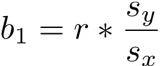

*b~1~* können wir berechnen, indem wir den Quotienten der Standardaweichung der abhängigen Variable (*s~y~*) und der unabhängigen Variable (*s~x~*) mit der Korrelation der beiden Variablen (*r*) multiplizieren.

*b~1~* können wir anhand dieser Formel beispielsweise selbst in R berechnen:

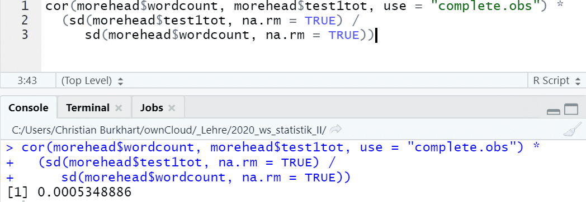


*b~0~* können wir berechnen, indem wir das Produkt aus b1 und dem Mittelwert des Prädiktors von dem Mittelwert der abhängigen Variable abziehen.

Erneut können wir den Koeffizienten in R berechnen und erhalten das gleiche Ergebnis, das wir weiter oben dargestellt haben:


### Zusammenfassung

In diesem Submodul haben wir gezeigt, wie das statistische Modell der einfachen linearen Regression aussieht und wie es berechnet wird. Das Modell kann als Gerade in einem Koordinatensystem dargestellt werden. Die Koeffizienten oder Parameter des Modells kennzeichnen den y-Achsenabschnitt und die Steigung der Gerade (auch Intercept genannt). Der erste Parameter *b~0~* kennzeichnet die Stelle, an der die Regressionsgrade die y-Achse schneidet. Der Parameter *b~1~* kennzeichnet die Steigung der Regressionsgeraden. *X~i~* im Modell kennzeichnet die unabhängige Variable oder das Kriterium, die wir in das Modell für jeden Datenpunkt einfügen. Die Regressionsgerade wird ermittelt, indem man diejenige Gerade findet, welche die geringsten Quadrierten Abweichungen der echten Punkte und der vorhergesagten Punkte hat. Diese Methode nennt man Ordinal Least Squares Methode. Zuletzt haben wir gesehen, wie diese Parameter berechnet werden können. Als nächstes werden wir statistische Hypothesen auf Grundlage dieses Modells testen.

## Statistisches Hypothesentesten

In diesem Modul werden wir die Fragestellung prüfen, ob Studierende, die mehr in einer Vorlesung aufschreiben, auch mehr aus dieser Vorlesung lernen. Wir werden hierfür den Datensatz von [Morehead, Dunlosky und Rawson (2014)](https://link.springer.com/article/10.1007/s10648-019-09468-2) verwenden, wie wir ihn zu Beginn dieses Moduls vorgestellt haben. Der Datensatz umfasst Daten von 84 Studierenden. Folgendermaßen werden wir vorgehen: Wir werden zunächst anhand einer Poweranalyse untersuchen, wie sensitiv unser Test ist, sprich, welche Effekte wir überhaupt durch die Größe unserer Stichprobe finden können. Anschließend werden wir unsere Hypothese statistisch modellieren und ein kompaktes und erweitertes Modell aufstellen. Von dort werden wir den empirischen *F*-Wert berechnen und prüfen, ob wir die Nullhypothese auf Grundlage der Daten ablehnen oder nicht. In diesem Zug werden wir ebenso zeigen, dass wir diese Fragestellung mit einem *t*-Test prüfen können und erklären warum. Zuletzt zeigen wir, wie die Ergebnisse des Tests in einem Fachartikel berichtet werden können.

### Poweranalyse

Mit Power haben wir die Wahrscheinlichkeit bezeichnet, mit der wir bei einem Test die Nullhypothese korrekterweise ablehnen werden, sollte die Alternativhypothese gelten. Wir haben ebenso gesagt, dass wir in der Regel versuchen, eine Power größer als 80% in einem Test zu erzielen. Das bedeutet, sollte die Alternativhypothese stimmen, möchten wir in 80% der Fälle die richtige statistische Entscheidung treffen und die Nullhypothese zu Gunsten der Alternativhypothese ablehnen. In der Regel überlegen wir uns daher auf Grundlage vorheriger Forschung, welchen Effekt wir erwarten und bestimmen anschließend die Größe der Stichprobe. In unserem Fall ist die Stichprobengröße bereits bestimmt (84 Studierende). Wir können allerdings die Fragestellung umdrehen und uns überlegen, für welche Effekte, sprich Korrelationskoeffizienten, wir eine Power von 80% erreichen werden. Hierdurch können wir herausfinden, wie sensitiv unser Test ist, um bestimmte Zusammenhänge zwischen zwei Variablen zu prüfen. Ein Test der nämlich eine zu geringe Power hat, kann uns keine Aufschlüsse über unsere Hypothesen geben.

### Poweranalyse mit G\*Power

In G\*Power können wir die Sensitivität unseres Tests bestimmen, indem wir unter Test *Family: Exact*, unter *Statistical Test Correlation: Bivariate normal model* und unter *Type of Power analysis: Sensitivity* eingeben. Folgendermaßen sieht die Eingabe in G\*Power aus:


Das Ergebnis dieser Poweranalyse sagt uns nun folgendes: Nur bei einem Korrelationskoeffizienten von *r* = .268 oder größer in der Population werden wir bei einer Stichprobengröße von 84 Personen eine Power von 80% erzielen. In anderen Worten, ist der Korrelationskoeffizient in der Population geringer als *r* = .268, schwindet unsere Power zunehmend. Bei einem Korrelationskoeffizienten von *r* = .11 beispielsweise in der Population würden wir lediglich eine Power von 46% erzielen. Unsere Studie wäre in diesem Fall nicht sensitiv genug, den Effekt durch unser Verfahren des frequentistischen Wahrscheinlichkeitsbegriffs zu finden. Oder, wir könnten aus unserem Test nichts über die Gültigkeit unserer Nullhypothese lernen. Das heißt wiederum, dass unser Test mit 84 Personen nur zur Erkenntnisgewinnung hilfreich ist, sofern der Korrelationskoeffizient der beiden Variablen in der Population größer als .268 ist. Das allerdings wissen wir nicht.

### **Statistische Modellierung der Hypothesen**

Bevor wir unsere Fragestellung statistisch testen, beginnen wir mit einer Grafik. Im folgenden siehst du die statistischen Verfahren, die wir in diesem Kurs kennenlernen werden. Bisher haben wir den *t*-Test für eine Stichprobe kennengelernt. Die Grafik besagt, dass das statistische Modell (sprich das erweiterte Modell) bei diesem Test keine Prädiktoren umfasst (*X*). Ebenso kannst du erkennen, dass wir bei der einfachen linearen Regression ein erweitertes Modell mit einem kontinuierlichem Prädiktor definieren. Kontinuierlich bedeutet, dass wir für *X* in dem Modell metrische (intervall- und verhältnisskalierte) Variablen einsetzen. In unserem Fall wird *X* die Anzahl der Wörter sein, die die Studierenden während der Vorlesung aufschreiben.


Das erweiterte Modell bei der einfachen linearen Regression haben wir im letzten Submodul bereits beschrieben. Wiederholen wir es an dieser Stelle erneut.


**Erweitertes Modell (augmented)**

Das erweiterte Modell, welches wir annehmen, umfasst einen Prädiktor *X~i~* und zwei Parameter (hier Populationsparameter *ß~0~* und *ß~1~*). Genauer beschreibt der Parameter *ß~1~* denZusammenhang der beiden Variablen.


**Kompaktes Modell (compact)**

Das kompakte Modell der Nullhypothese umfasst keinen Prädiktor. Wir nennen es Nullhypothese, da die Parameter, die wir prüfen möchten, in dem dazugehörigen Modell auf Null gesetzt werden. In diesem Fall nehmen wir im kompakten Modell an, dass die Korrelation der beiden Variablen, welche durch *ß~1~* kodiert ist, 0 beträgt. Das kompakte Modell schätzt daher die abhängige Variable auf Grundlage des Mittelwerts der abhängigen Variable (*ß~0~*).

Um diesen Vergleich noch einmal genauer darzustellen, vergleichen wir das erweiterte und das kompakte Modell grafisch. Links siehst du das aus den Daten berechnete erweiterte Modell in blau dargestellt. Rechts siehst du das berechnete kompakte Modell in blau dargestellt. Du siehst, dass wir für jeden Wert *X* im kompakten Modell die gleiche Vorhersage für *Y* machen. Diese Idee ist konform mit unserem oben dargestellten kompakten Modell, da wir dort den Prädiktor *X* aus der Gleichung entfernt haben, indem wir *ß~1~* auf 0 gesetzt haben.


Eine solche horizontale Linie, wie sie durch das kompakte Modell dargestellt ist, beschreibt eine nicht-existierende Korrelation zwischen zwei Variablen. Schau dir dazu [folgende Simulation von Kristoffer Magnussen](https://rpsychologist.com/d3/correlation/) an.


Besteht eine Korrelation von 0 zwischen zwei Variablen, ist die abhängige Variable unbeeinflusst vom Prädiktor X. Oder, das Wissen um die unabhängige Variable gibt uns keine Informationen über die abhängige Variable. Oder: Wie viel Worte einer Person in einer Vorlesung mitschreibt, hat keinen Einfluss auf das Abschneiden im späteren Test dieser Person.

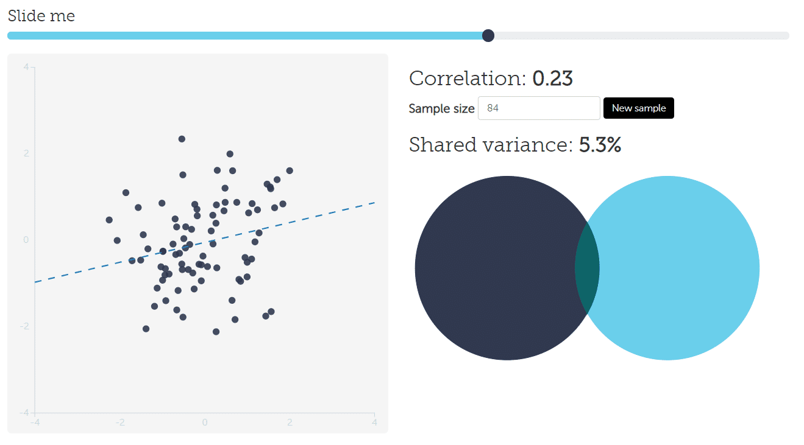

Besteht jedoch eine Korrelation zwischen zwei Variablen, sprich ist der Steigungskoeffizient nicht null, gibt uns die unabhängige Variable *X* Informationen über die abhängige Variable *Y*. In unserem Fall zeigt die Korrelation der beiden Variablen, dass das Abschneiden in dem Test teils durch die Anzahl der Wörter, die Studierende bei einer Vorlesung mitschreiben, erklärt werden kann. Wir werden später erklären, wofür die Prozentzahl 5.3 in der Grafik links steht.

Wir haben nun auf verschiedenen Wegen gezeigt, dass das kompakte Modell und das erweiterte Modell unsere Annahmen über die Null- und Alternativhypothese darstellen. Wir haben damit einen formalen Weg gefunden, unsere Hypothesen in statistische Modelle zu übertragen. Als nächstes können wir den empirischen *F*-Wert berechnen, auf Grundlage dessen wir unsere Hypothese testen.

### **Empirischer *F*-Wert ermitteln**

Als nächstes werden wir den empirischen *F*-Wert ermitteln. Der *F*-Wert wird uns zeigen, wie viel besser der Parameter *b~1~* ist als willkürliche weitere Parameter, die keinen substantiellen Beitrag leisten, *Y* aufzuklären. Hierzu müssen wir die entsprechenden Werte in der folgenden Tabelle finden. Beginnen wir mit den Freiheitsgraden der beiden Modelle. Das erweiterte Modell hat insgesamt 2 Parameter bei 84 Datenpunkten. Das heißt, in dieses Modell können noch 84 - 2 = 82 Parameter hinzugefügt werden. Das kompakte Modell hat insgesamt 1 Parameter bei 84 Datenpunkten (*df*~2~). Das heißt, in das kompakte Modell können noch 84 - 1  = 83 Parameter hinzugefügt werden. Zuletzt können wir feststellen, dass das erweiterte Modell einen Parameter mehr hat als das kompakte Modell (*df*~1~).

+-----------------------------------------------+--------------------+------------------------------+----------+---------+---------+---------+
| **Source**                                    | **Sum of Squares** | ***df***                     | ***MS*** | ***F*** | ***p*** | **PRE** |
+===============================================+====================+==============================+==========+=========+=========+=========+
| Reduktion der Fehler durch erweitertes Modell | \-                 | df~1~ = PA - PC = 1          | \-       | \-      | \-      | \-      |
+-----------------------------------------------+--------------------+------------------------------+----------+---------+---------+---------+
| Restliche Fehler des erweiterten Modells      | \-                 | df~2~ = n - PA = 84 - 2 = 82 | \-       | \-      | \-      | \-      |
+-----------------------------------------------+--------------------+------------------------------+----------+---------+---------+---------+
| Fehler kompaktes Modell\                      | \-                 | n - PC = 84 - 1 = 83\        | \-       | \-      | \-      | \-      |
+-----------------------------------------------+--------------------+------------------------------+----------+---------+---------+---------+

Als nächstes müssen wir die Fehler in beiden Modellen ermitteln und berechnen, wie viel mehr Fehler das kompakte Modell im Vergleich zum erweiterten Modell macht. Beginnen wir mit SSE~C~ und SSE~A~. 

### ***SSE~C~***

Zunächst müssen wir die Fehler ermitteln, die das kompakte Modell macht. Im nächsten Bild sind diese Fehler als Quadrate für jede Person dargestellt. Die Summe dieser Quadrate kennzeichnet *SSE~C~*.


Die Summe dieser Quadrate und damit die Fehler dieses kompakten Modells belaufen sich auf *SSE~C~ =* 2.136042.

### ***SSE~A~***

Ebenso macht das erweiterte Modell Fehler. Da das erweiterte Modell allerdings einen Prädiktor mehr hat als das kompakte Modell, wird dieses Modell insgesamt weniger Fehler machen als das kompakte Modell. Visuell können wir uns die Fehler erneut als den quadrierten Abstand der realen Werte von den vorhergesagten Werten des Modells vorstellen:


Die Fehler belaufen sich auf ingesamt 2.026016 und sind damit wie erwartet kleiner als beim kompakten Modell.

### ***SSR, PRE*** **und tabellarische Darstellung**

Für *SSR* ergibt sich daher folgender Wert:

\

Das erweiterte Modell reduziert daher 0.11 der Fehler des kompakten Modells. Nun, da wir *SSR* kennen, können wir ebenso berechnen, wie viel Prozent der Fehler des kompakten Modells das erweiterte Modell reduziert:


*PRE* liegt bei 5.15%. Das bedeutet, das erweiterte Modell reduziert 5.15% der Fehler des kompakten Modells. Beachte, dass *PRE* im Kontext der einfachen und multiplen linearen Regression auch als *R*^2^ bezeichnet wird. In der Berechnung ist es allerdings nichts anderes als *PRE*. Ebenso werden wir später sehen, dass die Effektgröße *η*^2^ nichts anderes ist als *PRE*.

Unsere Ergebnisse können wir nun tabellarisch zusammenfassen:

+-----------------------------------------------+--------------------+--------+--------+-------+-------+---------+
| **Source**                                    | **Sum of Squares** | **df** | **MS** | **F** | **p** | **PRE** |
+===============================================+====================+========+========+=======+=======+=========+
| Reduktion der Fehler durch erweitertes Modell | 0.11               | 1      | \-     | \-    | \-    | 0.0515\ |
+-----------------------------------------------+--------------------+--------+--------+-------+-------+---------+
| Restliche Fehler des erweiterten Modells      | 2.026              | 82     | \-     | \-    | \-    | \-      |
+-----------------------------------------------+--------------------+--------+--------+-------+-------+---------+
| Fehler kompaktes Modell\                      | 2.136              | 83\    | \-     | \-    | \-    | \-      |
+-----------------------------------------------+--------------------+--------+--------+-------+-------+---------+

### ***F*****-Wert und Wahrscheinlichkeit für *F* berechnen**

Nun, da wir die Fehlerwerte kennen, sind wir im Stande *MSR*, *MSE* und *F* zu berechnen. Erneut fragen wir uns, wie viel besser unser Parameter *b*~1~ ist als ein willkürlicher Parameter, welchen wir noch in das erweiterte Modell hinzufügen könnten?


Es zeigt sich, dass der Parameter *b*~1~, welcher für den Zusammenhang der beiden Variablen steht, 4.45 mal besser ist als wir bei einem willkürlichen Parameter erwarten würden. Als Faustregel gilt, liegt der empirische F-Wert zwischen 4 und 5, wird der Test in der Regel signifikant. Prüfen wir dies als nächstes:

In R können wir die Wahrscheinlichkeit für diesen Kennwert relativ schnell durch die Funktion [pf](https://stat.ethz.ch/R-manual/R-patched/library/stats/html/Fdist.html) ermitteln. Wir müssen hierfür lediglich den empirischen *F*-Wert sowie die beiden Freiheitsgrade eingeben. Um die Fläche rechts des empirischen *F*-Wertes zu erhalten, müssen wir das Ganze von 1 abziehen:

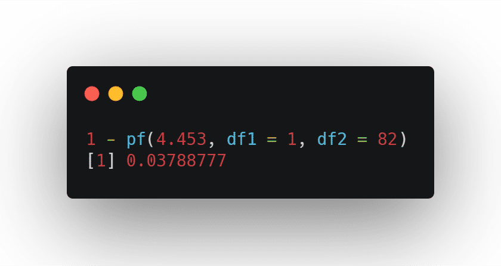

Wir sehen, dass die Wahrscheinlichkeit für einen solchen Kennwert bei 3.78% liegt. Wir erhalten damit ein signifikantes Ergebnis. Die Annahme, dass es keinen Zusammenhang zwischen diesen beiden Variablen gibt, muss daher widerlegt werden. Wir müssen in anbetracht von *R*^2^ allerdings auch sagen, dass der Effekt der Anzahl der Wörter auf die Lernleistung relativ gering ist. Er klärt lediglich 5% der Varianz im kompakten Modell auf. Es müssen daher andere Faktoren deutlich besser die Leistung in dem Test erklären können als lediglich die Anzahl der Worte in der Mitschrift. Fassen wir die Ergebnisse zusammen:

+-----------------------------------------------+--------------------+----------+----------+---------+---------+------------------+
| **Source**                                    | **Sum of Squares** | ***df*** | ***MS*** | ***F*** | ***p*** | ***PRE / R^2^*** |
+===============================================+====================+==========+==========+=========+=========+==================+
| Reduktion der Fehler durch erweitertes Modell | 0.11               | 1        | 0.11     | 4.45    | .038    | 0.0515\          |
+-----------------------------------------------+--------------------+----------+----------+---------+---------+------------------+
| Restliche Fehler des erweiterten Modells      | 2.026              | 82       | 0.0247   | \-      | \-      | \-               |
+-----------------------------------------------+--------------------+----------+----------+---------+---------+------------------+
| Fehler kompaktes Modell\                      | 2.136              | 83\      | \-       | \-      | \-      | \-               |
+-----------------------------------------------+--------------------+----------+----------+---------+---------+------------------+

### **Äquivalenz zum *t*-Test**

Selten wird bei einer Korrelation ein *F*-Test berichtet. Viel häufiger ist der *t*-Test. Wir wissen allerdings jetzt, dass der *F*-Test und der *t*-Test die gleichen Ergebnisse liefern (zumindest für ungerichtete Hypothesen). Nichtsdestotroz sollten wir dies an dieser Stelle noch einmal zeigen.


**t-Wert auf Grundlage von F ermitteln**

Zunächst ist der *t*-Wert nichts anderes als die Wurzel aus *F*. Der *t*-Wert ist daher 2.11.

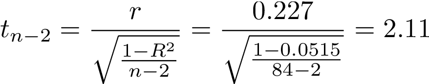

**t-Wert auf Grundlage des Korrelationskoeffizienten der beiden Variablen**

Ebenso können wir die Korrelation der beiden Variablen verwenden und erhalten den gleichen *t*-Wert.

### **Effektgröße Cohen's *d* berechnen**

Wir haben bereits mit *R*^2^ eine Effektgröße kennen gelernt, die wir für diesen Test berichten können. Allerdings wird bei einem *t*-Test eher die Effektgröße Cohen's *d* berichtet. Wir haben die Formel für Cohen's *d* bereits in vorherigen Modul kennen gelernt. Allerdings ist diese Formel geeignet, um Cohen's *d* aus Mittelwerten zu ermitteln. Für die einfache lineare Regression kann folgende Formel verwendet werden (siehe [Rosnow et al., 2003](https://psycnet.apa.org/doiLanding?doi=10.1037/h0087427)):


Wie du siehst, berechnet sich Cohen's *d* aus dem empirischen *t*-Wert und dem Quotienten aus der Wurzel des Freiheitsgrades des erweiterten Modells und der Zahl 2. In unserem Fall handelt es sich bei uns um einen kleinen Effekt (siehe auch [hier](https://www.psychometrica.de/effect_size.html)).

### Ergebnis berichten

Nun haben wir alle Ergebnisse zusammen und können die Ergebnisse unseres Tests berichten:

> "Um unsere Hypothese zu prüfen, wurde eine einfache lineare Regression berechnet. Als abhängige Variable wurde die Punktzahl der Probanden im Test direkt nach der Mitschrift und als unabhängige Variable die Anzahl der Wörter in der Mitschrift verwendet. Wir fanden eine signifikante Korrelation, *t*(82) = 2.11, *p* = .038, *d* = 0.47 (kleiner Effekt), was darauf hindeutet, dass die Anzahl der Wörter in einem positiven Zusammenhang mit der Punktzahl im Test steht."

### Zusammenfassung

Wir haben in diesem Submodul statistisch getestet, ob zwei Variablen miteinander korrelieren. Zunächst haben wir die Sensitivität unseres Tests gegeben der Stichprobe von 84 Probanden ermittelt. Wir fanden dabei heraus, dass wir bei dieser Stichprobengröße erst eine Power von 80% erzielen, wenn die wahre Korrelation der beiden Variablen bei 0.268 liegt. Danach haben wir unseren *F*-Test berechnet und herausgefunden, dass die Korrelation der beiden Variablen signifikant ist. Das bedeutet, die Annahme, beide Variablen korrelieren nicht miteinander, ist unter Anbetracht unserer Daten nicht zu halten. Wir verwerfen in diesem Fall die Nullhypothese. Zuletzt haben wir gezeigt, dass der *F*-Test auch als *t*-Test dargestellt werden kann und gezeigt, wie wir die Ergebnisse des Tests in einem Fachartikel berichten können.

## Konfidenzintervalle bei der einfachen linearen Regression

Signifikanztest erlauben uns Aussagen darüber, wie unwahrscheinlich bestimmte Daten unter Annahme der Nullhypothese sind: P(D\|H0). Finden wir in vielen Experimenten häufig, dass ein Ergebnis unter Annahme der Nullhypothese unwahrscheinlich ist, haben wir guten Grund zu denken, dass beispielsweise zwei Variablen miteinander korrelieren. Was wir allerdings meist wissen möchten ist, wie stark diese Werte miteinander korrelieren? Konfidenzintervalle helfen uns, dieser Frage näher zu kommen und erweitern damit unseren statistischen Werkzeugkasten. Folgende Information liefert uns ein Konfidenzintervall:

> In 95 von 100 Fällen befindet sich der **wahre Populationsparameter** innerhalb des Konfidenzintervalls.

Konfidenzintervalle sagen damit **nicht**, dass sich der Populationsparameter zu 95% innerhalb des Konfidenzintervalls befinden. Diese Wahrscheinlichkeit ist entweder 0 oder 1. Zudem habe ich gerade willkürlich bestimmt, dass der Wert 95% festgeschrieben wird. Genausogut gibt es 99%ige oder 90%ige Konfidenzintervalle.

### **Simulation von Konfidenzintervallen**

Versuchen wir Konfidenzintervalle an einem Beispiel genauer zu beschreiben. In der nächsten Visualisierung siehst du 100 Konfidenzintervalle. Stell dir vor, wir wiederholen die gleiche Studie, welche wir in diesem Modul untersucht haben, 100 mal. Jedes Mal werden wir ein leicht anderes erweitertes und kompaktes Modell erhalten. Für jede Studie werden wir zudem ein anderes Konfidenzintervall erhalten. In der folgenden Visualisierung sind die Konfidenzintervalle als schwarze und rote Striche gekennzeichnet. Der blaue vertikale Strich kennzeichnet den wahren Populationsparameter *ß~1~*. Zudem liegt die wahre Korrelation der beiden Variablen bei *r* = 0.27. Bei einem 95%-igen Konfidenzintervall sollten wir in 95% der Fälle erwarten, dass der wahre Populationsparameter innerhalb des Intervalls liegt. In 5% der Fälle allerdings erwarten wir, dass der Populationsparameter außerhalb des Intervalls liegt. Rote Striche kennzeichnen daher Konfidenzintervalle, bei denen der wahre Populationsparameter nicht im Konfidenzintervall liegt. Sobald zudem einer der schwarzen Linien die schwarze gestrichelete Linie beim Wert 0 umschließt, begehen wir einen Betafehler und nehmen fälschlicherweise die Nullhypothese an. Beginnen wir mit einer Simulation von 100 Studien mit je einer Stichprobengröße von 84 Personen:

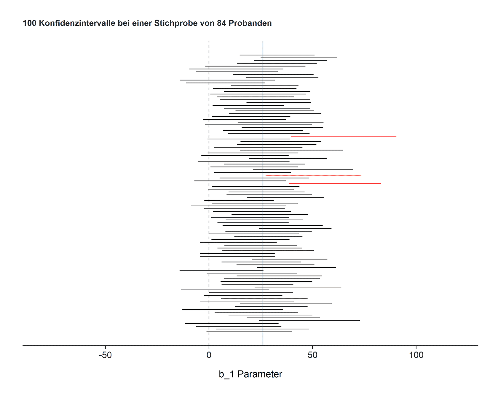

Folgendes erkennen wir aus der Simulation. In drei Fällen liegt der wahre Populationsparameter außerhalb des Konfidenzintervalls. Würden wir unendlich viele Studien erhalten, würde dies in 5% der Fälle passieren. In unserer Simulation tritt dies in 3% der Fälle auf. Wir sehen zudem, dass wir in 25 von 100 Fällen einen Beta-Fehler begehen, da das Konfidenzintervall den Wert 0 umschließt. Auf Grundlage dieser Simulation müssten wir daher davon ausgehen, dass unsere Studie mit 84 Probanden eine Power von etwa 75% hat. 

Variieren wir als nächstes die Stichprobengröße, um zu sehen, wie sich die Konfidenzintervalle mit einer unterschiedlichen Stichprobengröße verändern. Und simulieren wir eine Stichprobe von 30, 100, 200 und 300 Probanden:

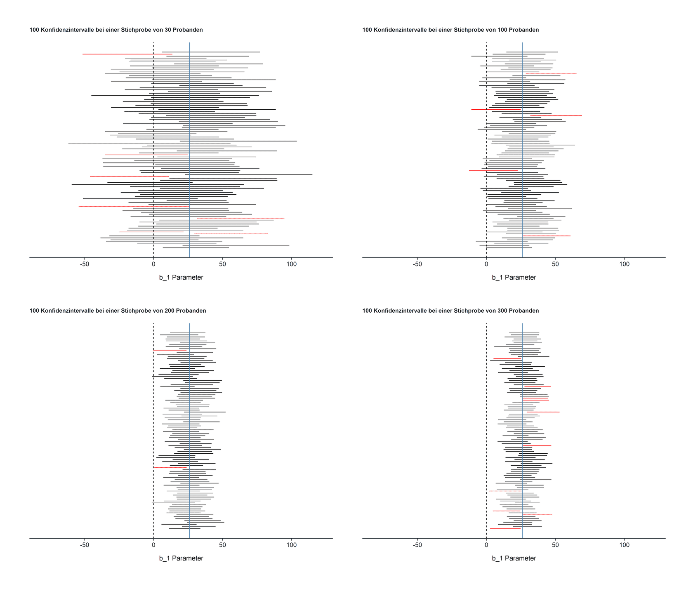

Je größer die Stichprobe wird, desto schmaller wird das Konfidenzintervall. Das heißt, mit steigender Stichprobengröße können wir den wahren Populationsparameter genauer erahnen. Zudem sehen wir, dass wir mit steigender Stichprobengröße weniger Beta-Fehler machen, sprich eine größere Power erhalten. Das sehen wir, da die Konfidenzintervalle mit steigender Stichprobengröße immer seltener den Wert 0 (keine Korrelation der beiden Variablen) schneiden. Bei einer Stichprobengröße von 300 und einem wahren Korrelationskoeffizient von *r* = 0.27 hätten wir damit fast eine Power von 100%. Ebenso sehen wir, dass bei einem 95%-igen Konfidenzintervall der wahre Populationsparameter in der Tat in etwa 95% der Fälle innerhalb des Intervalls liegt. Insgesamt haben wir 400 Konfidenzintervalle in dieser Simulation berechnet. In 24 der Fälle liegt der Populationsparameter außerhalb des Konfidenzintervalls. Das entspricht 6% der Fälle und kommt der 5%-Marke sehr nahe.

### **Berechnung des Konfidenzintervalls bei der einfachen linearen Regression**

Berechnet wird das Konfidenzintervall bei einer einfachen linearen Regression durch folgende Formel:

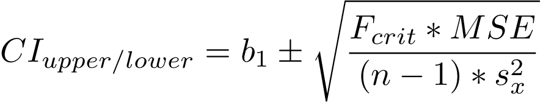

Wir erhalten durch die Formel das untere und obere Ende des Konfidenzintervalls (upper/lower). Zum Verständnis der Formel, hilft es, die einzelnen Komponenten zu klären:

-   *b*~1~: Der Steigungskoeffizient der unabhängigen Variable *x*~1~

-   *F~crit~*: Der kritische *F*-Wert, welcher zu einem signifikanten Ergebnis führt. Diesen kann man mit der Funktion qf in R berechnen: qf(0.95, df1 = 1, df2 = 84) = 3.95

-   *MSE*: Die Fehler des erweiterten Modells, die die weiteren Parameter des erweiterten Modells durchschnittlich aufklären

-   *n*: Die Anzahl der Untersuchungsobjekte

-   *s*~x~^2^: Die Varianz der unabhängigen Variable *X*

Setzen wir diese Werte in die Formel ein, erhalten wir folgende Konfidenzintervalle:


Wir haben daher eine starke Annahme, dass der wahre Populationsparameter *ß~1~* zwischen den Werten 0.0000309 und 0.0010 liegt. Da das Konfidenzintervall den Wert 0 nicht schneidet, wissen wir zudem, dass das Ergebnis unseres Tests signifikant ist.

Da *b~1~* nichts anderes ist als der Steigungskoeffizient der einfachen linearen Regression, können wir das Konfidenzintervall ebenso grafisch darstellen. Im folgenden ist in grau das obere und untere Konfidenzintervall dargestellt.


Die Visualisierung zeigt uns damit, in welchem Bereich sich der Zusammenhang in der Population vermutlich befinden wird.

### **Standardisiertes Konfidenzintervall**

Wie aber können wir diese Werte interpretieren? Die haben keinen Bezug zu Werten, die wir kennen. Um daher das Konfidenzintervall besser zu verstehen, können wir die abhängige und unabhängige Variable z-standardisieren.


Indem wir die beiden Variablen standardisieren, erhalten wir folgendes erweitertes Modell. Der Koeffizient *b~1~* ist hierdurch der Korrelationskoeffizient der beiden Variablen.

Ein Konfidenzintervall von *b~1~* hilft uns daher zu sagen, was der wahre Korrelationskoeffizient in der Population ist. Berechnen wir erneut einen *F*-Test mit den standardisierten Daten, erhalten wir folgenden Korrelationskoeffizienten:


Die Korrelation der beiden Variablen bewegt sich daher vermutlich zwischen *r* = 0.013 und *r* = 0.441. Die Spannweite des Konfidenzintervalls ist noch relativ weit. Würden wir allerdings deutlich mehr Probanden erheben, würde sich die Breite des Konfidenzintervalls schmälern und wir könnten eine besser Aussage über *ß~1~* treffen.

### Zusammenfassung

In diesem Submodul haben wir zum ersten Mal Konfidenzintervalle kennengelernt. Wir haben gelernt, dass Konfidenzintervalle Aussagen über den wahren Populationsparameter machen können. Bei einem 95%-igen Konfidenzintervall liegt in 95% der Fälle der wahre Populationsparameter innerhalb des Intervalls. Ebenso haben wir gesehen, dass Konfidenzintervalle genutzt werden können, um Hypothesen zu testen. Liegt wie in unserem Fall der Wert 0 innerhalb des Intervalls, handelt es sich um ein nicht-signifikantes Ereignis. Konfidenzintervalle liefern daher die gleichen Informationen wie der *F*-Test. Dann haben wir gesehen, wie ein Konfidenzintervall bei einer einfachen linearen Regression berechnet werden kann. Wir haben ebenso gesehen, dass wir durch die Standardisierung der Variablen heraus finden können, in welchem Bereich die wahre Korrelation der beiden Variablen vermutlich liegt.

## Berechnung in Jamovi

Zum Ende des Moduls zeige ich dir, wie die einfache lineare Regression in Jamovi berechnet wird. Du wirst gleich sehen, dass alle Ergebnisse in Jamovi identisch mit den Werten sind, die wir in diesem Modul berechnet haben. Falls du den Datensatz nochmal brauchst, du findest ihn hier:

TODO: Einfügen Datei morehead_experiment1.csv

TODO: Einfügen Video

## Weitere Ressourcen

-   <https://www.r-bloggers.com/2020/12/robust-regression/>

<!--chapter:end:05-einfache_lineare_regression.Rmd-->

# Multiple lineare Regression

## Einführung

Im letzten Modul haben wir herausgefunden, dass sich Studierende besser an die Inhalte eines Vortrags erinnern können, je mehr sie während des Vortrags mitschreiben. Wir haben allerdings auch heraus gefunden, dass der Effekt klein ist, da er nur 5% der Varianz in der Erinnerungsfähigkeit aufklären konnte. Nun möchten wir zwei Zusammenhangsypothesen testen. Du hast beobachtet, dass viele deiner Kommilitonen eine wortwörtliche Mitschrift des Vortrags anfertigen. Sie kopieren sozusagen die Worte der Professorin exakt so ab wie die Professorin spricht. Du hast allerdings gehört, dass Organisations- und Elaborationsstrategien hilfreich sind, um sich viel aus einer Vorlesung zu merken. Indem man zum Beispiel das neue Wissen mit dem bestehenden Wissen verbinden (Elaboration) oder die Konzepte für sich strukturiert (Organisation). Du glaubst daher, dass die wörtliche Überlappung der Mitschrift einen negativen Einfluss auf die Erinnerungsfähigkeit aus der Vorlesung haben sollte. Oder in anderen Worten, je mehr Überlappung es gibt, desto schlechter sollten Studierende bei einem späteren Test abschneiden. Nun könntest du erneut eine einfache lineare Regression mit der Überlappung als Prädiktor testen. Besser wäre es jedoch beide Fragestellungen gleichzeitig in einem Modell zu kodieren und zu testen. Und dies sind die Fragestellungen, die wir in diesem Modul testen werden:

> **Lernen Studierende mehr aus einem Vortrag je mehr Worte sie während dem Vortrag aufschreiben *und* je weniger sie den Wortlaut der vortragenden Person in ihrer Mitschrift übernehmen?**

Die Lösung, um diese beiden Fragestellungen statistisch zu modellieren, ist die **multiple lineare Regression**. Die multiple lineare Regression ist sehr ähnlich zur einfachen linearen Regression, allerdings mit ein paar zentralen Besonderheiten. Wir werden beispielsweise sehen, dass die Koeffizienten bei einer multiplen linearen Regression eine andere Bedeutung haben. Ebenso werden wir sehen, dass wir bei einer multiplen linearen Regression mehrere *F*-Tests berechnen müssen. Bei der einfachen linearen Regression mussten wir nur einen *F*-Test berechnen. 

Erneut verwenden wir in diesem Modul die Studie von [Morehead, Dunlosky und Rawson (2014)](https://link.springer.com/article/10.1007/s10648-019-09468-2) aus dem letzten Modul. Diesmal interessieren uns drei Variablen des Datensatzes:

-   **wordcount**: Die Anzahl der Wörter der Mitschrift der Studierenden.

-   **overlap**: Anteil wörtliche Überlappung zwischen Notizen und dem Vortrag

-   **test1tot**: Prozentueller Anteil der korrekten Fragen des Tests direkt nach dem Aufschreiben der Notizen.

Den Datensatz findest du hier:

TODO: Einfügen Datei morehead_experiment1.csv

Die Erklärung der Variablen findest du hier:

TODO: Einfügen Doc variablen.dox

## Statistisches Modell der multiplen Regression

Im letzten Modul haben wir das Modell der einfachen linearen Regression kennen gelernt. Der Parameter *ß~1~* des Modells kodierte die Korrelation der abhängigen und unabhängigen Variable. Zudem hatte das Modell einen metrischen Prädiktor *X~1.~*


Durch dieses Modell können wir prüfen, ob zwei Variablen miteinander korrelieren. Zum Beispiel hat die Lernzeit von Schülerinnen und Schülern einen Einfluss auf deren Schulnote? Haben intelligente Eltern intelligente Kinder? Sind Studierende, die mehr schlafen, weniger gestresst? 

Oder: Lernen Studierende weniger aus einem Vortrag, je mehr sie wörtlich aus dem Vortrag mitschreiben? Beziehungsweise, lernen Studierende mehr aus einem Vortrag, je mehr sie während des Vortrags mitschreiben? Um diese beiden Fragestellungen zu beantworten, könnten wir zwei einfache Regressionsmodelle berechnen. Die multiple lineare Regression erlaubt uns allerdings beide Fragestellungen gleichzeitig zu testen, indem wir *mehrere* metrische Prädiktoren in das Modell einfügen. Im Prinzip könnten wir unendlich viele Prädiktoren in das Modell einpflegen. Im nächsten Bild siehst du allgemeine Formel der multiplen linearen Regression:


*Y~i~* steht erneut für die abhängige Variable und *ϵ~i~* steht für die Fehler, welche unser Modell nicht erklären kann. *X~i~* steht für die Werte unserer metrischen abhängigen Variablen, beispielsweise Anzahl der Wörter in der Mitschrift. *β~i~* steht für die partiellen Regressionskoeffizienten. Wir werden später ausführlich darüber reden, weshalb diese Koeffizienten partiell heißen. Für jetzt genügt es zu wissen, dass diese partiellen Regressionskoeffizienten von den anderen Prädiktoren abhängig sind und sich abhängig davon ändern, welche und wie viele andere Parameter im Modell sind. 

Nun möchten wir zwei Zusammenhänge testen: Steht die wörtliche Überlappung und die Anzahl der Wörter in einem Zusammenhang mit der Erinnerungsfähigkeit aus dem Vortrag? Um diese Fragestellungen zu testen, benötigen wir eine multiple lineare Regression mit zwei Prädiktoren.


*X1* steht für die Variable *wordcount* und gibt die Anzahl der Wörter in der Mitschrift an. *X2* steht für die Variable *overlap* und gibt die wörtliche Überlappung der Mitschrift mit dem Vortrag an.

Im Unterschied zur einfachen lineraen Regression können wir uns dieses Modell nicht mehr als Linie vorstellen. Bei zwei Prädiktoren kann man das Modell hingegen als eine Fläche darstellen. Bei mehr als zwei Prädiktoren lässt sich die multiple lineare Regression nicht mehr grafisch darstellen.

### Berechnung des Modells

Für die Berechnung der Regressionskoeffizienten gilt erneut, dass wir das Modell mit den Parametern suchen, welches die quadrierten Fehler maximal reduziert:


Ich werde an dieser Stelle nicht erklären, wie diese Koeffizienten berechnet werden, da wir hierfür Verfahren der linearen Algebra verwenden müssten (wenn es dich interessiert, wie es funktioniert, schaue [hier](https://medium.com/@andrew.chamberlain/the-linear-algebra-view-of-least-squares-regression-f67044b7f39b)). Eines sollten wir an dieser Stelle nochmal klären: Egal, welches statistische Modell wir in diesem Kurs formulieren werden, *Y*-Dach steht in der Formel immer für dieses Modell. Wir könnten die Logik der Ordinal-Least-Squares Methode daher ebenso wie folgt für unser Zwei-Prädiktor-Modell formulieren:


In anderen Worten fragen wir uns erneut, welche unterschiedlichen Vorhersagen macht unser Modell im Vergleich zu den tatsächlichen Daten der abhängigen Variable. Das Modell, welches auf Grundlage der zwei Prädiktoren die besten Vorhersagen macht, ist folgendes:


Du kannst du Parameter des Modells sehr schnell berechnen, indem du folgendem Code in R folgst:


Wir haben nun etabliert, was die multiple Regression von der einfachen linearen Regression unterscheidet. Als nächstes werden wir heraus finden, wie wir die Koeffzienten dieses Modells interpretieren können.

## Partielle Regressionskoeffizienten

### ***b~1~*** **der einfachen Regression ist nicht *b~1~* der multiplen Regression mit dem gleichen Prädiktor**

Würden wir der Logik der einfachen linearen Regression aus dem letzten Modul folgen, müssten wir die Parameter in unserem Modell der multiplen linearen Regression in etwa wie folgt interpretieren: Durch jedes weitere Wort in der Mitschrift steigt die Punktzahl in dem Test um 0.00061 Prozenpunkte. Und, durch jedes Prozent weitere Überlappung der Mitschrift mit dem Vortrag steigt die Erinnerungsleistung aus dem Vortrag um 0.061134%.


Diese Interpretation der Parameter ist allerdings **falsch**. Der Grund hierfür ist, dass die Parameter oder Koeffizienten bei der multiplen linearen Regression *partiell* sind. Nun was heißt das? Stell dir vor, du möchtest den Parameter der Variable *wordcount* interpretieren*.* Bei einer einfachen linearen Regression erhältst du für den Parameter *b~1~* den Wert 0.0005387:


Wie du siehst, bekommst du bei der einfachen linearen Regression den Parameter 0.0005387 und bei der multiplen linearen Regression den Parameter 0.00061. Offensichtlich sind beide Parameter unterschiedlich. Die Interpretation, dass die Punktzahl bei jedem weiteren Wort um 0.00053% steigt, gilt daher nicht mehr für die multiple lineare Regression.

### Bedeutung **von *b~1~*** und ***b~2~*** bei der multiplen linearen Regression

Was bedeutet dann allerdings *b~1~* in der multiplen linearen Regression? Wir müssen die Regressionskoeffizienten bei der multiplen linearen Regression immer in Abhängigkeit der anderen Prädiktoren interpretieren. Für *b~1~* gilt folgende Aussage:

> Für jedes ***Wort***, welches eine Studentin **in Anbetracht der Überlappung ihrer Mitschrift** mehr schreibt, erwarten wir, dass diese Studentin **0.00061 Prozentpunkte** besser im Test abschneidet **als man für die Überlappung ihrer Mitschrift erwarten würde**.

Stellen wir uns zum besseren Verständnis eine Studentin mit dem Namen Simone vor. Simone hat 40 Worte aufgeschrieben und 18% ihrer Mitschrift ist identisch mit dem Vortrag. In der folgenden Visualisierung siehst du den Regressionskoeffizienten *b~1~* der multiplen linearen Regression als einfache lineare Regression dargestellt. Die Visualisierung sagt folgendes: Simone schreibt in etwa 37 Worte weniger auf *als man für die Überlappung in ihrem Text erwarten würde*. Ebenso schneidet Simone in etwa um 8%-Punkte besser ab *als man für die Überlappung in ihrem Text erwarten würde*. Achte darauf, dass sowohl die unabhängige Variable (Anzahl der Worte) als auch die abhängige Variable (Prozentzahl im Test) in Abhängigkeit des anderen Prädiktors definiert wird.


Der Regressionskoeffizient *b~1~* der multiplen linearen Regression ist demnach nichts anderes als der Steigungskoeffizient einer linearen Regression welche das Verhältnis zwischen der Anzahl der Worte in der Mitschrift und der Punktzahl im Test in Abhängigkeit davon angibt, was man in Anbetracht der Überlappung der Mitschrift erwarten würde. 

Ebenso müssen wir *b~2~* in Abhängigkeit der anderen Variable definieren. Diese würden wir wie folgt definieren: Für jedes Prozent Überlappung, welches eine Studentin in Anbetracht der Worte ihrer Mitschrift mehr hat, erwarten wir, dass diese Studentin 0.061134 Prozentpunkte besser abschneidet als man für die Anzahl der Wörter in der Mitschrift erwarten würde.

### Zusammenfassung

Wir haben in diesem Submodul gezeigt, dass der Regressionskoeffizient einer einfachen linearen Regression bei dem gleichen Prädiktor nicht mit dem Regressionskoeffizient einer multiplen linearen Regression gleichzusetzen ist. Dies liegt darin, dass Prädiktoren in der Regel miteinander korrelieren und daher einen Teil der Varianz in der abhängigen Variable gemeinsam aufklären. Was wir in der multiplen linearen Regression erhalten sind partielle Regressionskoeffizienten. Das bedeutet, die Regressionskoeffizienten in der multiplen linearen Regression werden immer in Abhängigkeit des anderen Prädiktors definiert. Im statistischen Sprachgebrauch würden wir auch sagen, wir *kontrollieren für einen anderen Prädiktor*. Das heißt, wir fragen uns, welchen Einfluss ein Prädiktor auf die abhängige Variable hat, wenn der andere Prädiktor gleich gehalten wird. Für die Interpretation der statistischen Tests macht diese veränderte Definition der Koeffizienten keinen Unterschied. Indem wir die Prädiktoren bei der Nullhypothese auf Null setzen, können wir immer noch den Zusammenhang zweier Variablen testen.

## Statistisches Hypothesentesten

Nun, da wir wissen, wie das statistische Modell der multiplen linearen Regression aussieht, können wir Hypothesen mit Hilfe dieses Modells testen. **Genauer werden wir in diesem Submodul drei Hypothesen testen**. Zunächst werden wir testen, ob beide Prädiktoren des Modells die Fehler des kompakten Modells besser aufklären als man erwarten würde, wenn weitere Prädiktoren keinen substantiellen Beitrag zur Fehlerreduktion des kompakten Modells leisten. Ebenso werden wir sehen, dass wir die Effektgröße *R^2^* bei einem Test, welcher mehr als einen Prädiktor mehr hat als das kompakte Modelle, anpassen müssen. Der allgemeine F-Test gibt uns allerdings keine Antwort auf unsere eigentliche Frage: Gibt es einen Zusammenhang der beiden Variablen mit dem Erinnerungsvermögen aus dem Vortrag? Daher werden wir zwei weitere Tests rechnen, bei denen wir jeweils einen Prädiktor des erweiterten Modells auf 0 schalten. Indem wir nur einen Prädiktor auf 0 schalten und da die Parameter den Zusammenhang der beiden Variablen kodieren, können wir mit diesen Tests prüfen, ob die Anzahl der Worte bzw. die wörtliche Überlappung in der Mitschrift mit der Erinnerungsleistung im Test im Zusammenhang steht. Wir werden ebenso sehen, dass wir für diese beiden Tests einen *t*-Test rechnen können, da in beiden Tests das erweiterte Modell genau einen Parameter mehr hat als das kompakte Modell (das ist eine Grundbedingung für den *t*-Test).

### **Allgemeiner *F*-Test für beide Prädiktoren**

Beginnen wir mit einem Test, welcher die folgenden beiden Modelle miteinander testet. Wir bezeichnen diesen Test als allgemeinen *F*-Test, da dieser Test prüft, ob die weiteren *beiden* Parameter des erweiterten Modells die Fehler des kompakten Modells substantiell reduzieren. Wir werden durch diesen Test allerdings nicht den Einfluss einzelner Parameter auf die abhängige Variable testen können.


Wie du siehst, umfasst das erweiterte Modell (Model A) zwei Prädiktoren und drei Parameter. Das kompakte Modell umfasst keinen Prädiktor und einen Parameter. Das kompakte Modell repräsentiert daher die Nullhypothese, bei der beide Parameter auf 0 gesetzt sind. Durch dieses Modellpaar können wir testen, ob die Annahme, dass beide Parameter nicht im Zusammenhang zu der abhängigen Variable stehen, inkorrekt ist.


Hypothesen, die auf diesem Modellpaar beruhen, sind allerdings nicht sonderlich aussagekräftig. Zunächst kann es sein, dass nur einer der beiden Prädiktoren signifikant ist und der zweite Prädiktor die abhängige Variable kaum aufklärt. Zweitens ist das Ergebnis nicht eindeutig. Wir erfahren aus den Ergebnissen nicht, ob der eine oder der andere oder beide Prädiktoren einen signifkanten Effekt auf die abhängige Variable hat. Dieses Problem wird umso größer, je mehr Prädiktoren im erweiterten Modell sind. Kurzum, der allgemeine *F*-Test kann zwar mit Jamovi und anderen Softwares berechnet werden, er gibt uns allerdings nicht die Informationen, die wir erfahren möchten. 

Rechnen wir diesen Test, erhalten wir folgendes Ergebnis:

+--------------------------------------------------+----------+----------+----------+---------+---------+--------------------+
| **Source**                                       | ***SS*** | ***df*** | ***MS*** | ***F*** | ***p*** | ***PRE / R^2^***\\ |
+==================================================+==========+==========+==========+=========+=========+====================+
| Reduktion der Fehler durch das erweiterte Modell | 0.145    | 2        | 0.0726   | 2.95    | 0.058   | 0.068\             |
+--------------------------------------------------+----------+----------+----------+---------+---------+--------------------+
| Error\                                           | 1.99     | 81\      | 0.0245   | \-      | \-      | \-                 |
+--------------------------------------------------+----------+----------+----------+---------+---------+--------------------+
| Total Error                                      | 2.136    | \-       | \-       | \-      | \-      | \-                 |
+--------------------------------------------------+----------+----------+----------+---------+---------+--------------------+

Wir erhalten ein nicht-signifikantes Ergebnis. Wir behalten demnach die Annahme, dass der Zusammenhang aller Prädiktoren mit der abhängigen Variable gleich ist.

### **Angepasstes *R^2^ (adjusted R^2^)***

Sobald wir mehrere Prädiktoren in eine multiple Regression hinzu nehmen, sollten wir vorsichtig sein, *R^2^* zu interpretieren. Denn, mit jedem Parameter, den wir in die multiple Regression hinzufügen, verbessert sich *R^2^* automatisch. Ein trickreiche Forscherin könnte daher künstlich ein hohes *R^2^* schaffen, indem sie viele Parameter in das Modell hinzufügt. Um diesem Trick zu entgehen, müssen wir einen Weg finden, ein *R^2^* zu finden, welches unabhängig der Anzahl der weiteren Parameter des erweiterten Modells ist. Folgende Formel ermöglicht diese Anpassung:

\

\
Berechnen wir das angepasste *R^2^* erhalten wir einen Wert von 4.5%.


Das angepasste *R^2^* ist daher kleiner als *R^2^.* Es ist allerdings dem herkömmlichen *R^2^* vorzuziehen, da es für die Anzahl der weiteren Parameter kontrolliert. Wenn du zukünftig daher eine multiple lineare Regression aufstellst, ist es wichtig das angepasste *R^2^* zu verwenden.

### Der Zusammenhang zwischen der Anzahl der Worte und der Erinnerungsleistung aus dem Vortrag

Unsere eigentliche Frage allerdings der Zusammenhang der beiden Variablen mit der Erinnerungsleistung aus dem Vortrag. Beginnen wir mit dem Zusammenhang zwischen der Anzahl der Worte und der Erinnerungsleistung. Wir wissen, dass der Parameter *b~1~* für den Zusammenhang zwischen der Variable *wordcount* und der Erinnerungsleistung aus dem Vortrag steht. Indem wir nur diesen Parameter im kompakten Modell auf Null setzen, können wir den Zusammenhang der beiden Variablen testen. Wir werden immer wieder in diesem Kurs so vorgehen: Parameter kodieren unsere Fragestellungen an den Datensatz. Bei der einfachen und multiplen Regression kodieren die Parameter den Zusammenhang zweier Variablen. Die Nullhypothese nimmt an, dass dieser Zusammenhang 0 beträgt, daher setzen wir den Parameter im kompakten Modell auf 0. Tun wir dies, erhalten wir folgendes Modellpaar:


Mit diesen Modellen können wir als nächstes die Kennwerte berechnen, um heraus zu finden, ob wir die Nullhypothese ablehnen oder nicht. In folgender R-Datei habe ich dir die einzelnen Schritte zur Berechnung der Werte aufgeschrieben. Du musst nicht alle Befehle dieser Datei kennen, aber ich lade dich ein, die Berechnung von F einmal selbst durchzuführen und die Schritte nachzuvollziehen:

TODO: Einfügen test_wordcount.R

TODO: Einfügen Video

Zusammengefasst lauten die Ergebnisse des Tests folgendermaßen:

+--------------------------------------------------+----------+----------+----------+---------+---------+--------------------+
| **Source**                                       | ***SS*** | ***df*** | ***MS*** | ***F*** | ***p*** | ***PRE / R^2^***\\ |
+==================================================+==========+==========+==========+=========+=========+====================+
| Reduktion der Fehler durch das erweiterte Modell | 0.1346   | 1        | 0.13     | 5.48    | 0.022   | 0.063\             |
+--------------------------------------------------+----------+----------+----------+---------+---------+--------------------+
| Error\                                           | 1.99     | 81\      | 0.0245   | \-      | \-      | \-                 |
+--------------------------------------------------+----------+----------+----------+---------+---------+--------------------+
| Total Error                                      | 2.125    | \-       | \-       | \-      | \-      | \-                 |
+--------------------------------------------------+----------+----------+----------+---------+---------+--------------------+

Aufgrund des signifikanten Ergebnisses gehen wir nun davon aus, dass die Annahme, dass die beiden Variablen nicht miteinander korrelieren, falsch ist. Wir entscheiden uns daher gegen die Nullhypothese.

### t-Test als Alternative

Wie immer können wir bei einem erweiterten Modell, welches einen Parameter mehr hat als das kompakte Modell einen *t*-Test berechnen. *t* ist die Wurzel aus *F*, daher beträgt *t* 2.34. Der p-Wert ändert sich durch diese Umstellung nicht, da wir eine ungerichtete Hypothese haben; es gibt einen Zusammenhang, wir sagen nicht, in welche Richtung der Zusammenhang liegt. Wir können daher das Ergebnis berichten:

> "Um zu testen, ob die Anzahl der Worte in der Mitschrift mit der Erinnerungsleistung des Vortrags im Zusammenhang steht, wurde eine multiple lineare Regression mit der Anzahl der Worte als unabhängige und dem Erinnerungsleistungstest als abhängige Variable gerechnet. Wir fanden einen signifikanten Zusammenhang, *t*(81) = 2.34, *p* = .022, *R^2^**=*** 0.63."

### Der Zusammenhang zwischen der Anzahl der Worte und der Erinnerungsleistung aus dem Vortrag

Als nächstes möchten wir heraus finden, ob die wörtliche Überlapppung in den Texten in einem negativen Zusammenhang mit der Erinnerungsleistung im Test steht. Wir sind davon ausgegangen, dass Lernende durch das wörtliche Abschreiben des Vortrags wenige Elaborations- und Organisationsstrategien verwenden und daher weniger von der Mitschrift profitieren sollten als Lernende, die wenig wörtlich mitschreiben.

Um diese Hypothese zu testen, setzen wir im kompakten Modell den Parameter *β~2~* auf 0:


Ist *ß~2~* wirklich 0, sprich gibt es keine Zusammenhang der beiden Variablen, sollten wir in nur 5% der Fälle ein signifikantes Ergebnis bei diesem Test erhalten. Folgende Ergebnisse erhalten wir durch diesen Test:

+--------------------------------------------------+----------+----------+----------+---------+---------+--------------------+
| **Source**                                       | ***SS*** | ***df*** | ***MS*** | ***F*** | ***p*** | ***PRE / R^2^***\\ |
+==================================================+==========+==========+==========+=========+=========+====================+
| Reduktion der Fehler durch das erweiterte Modell | 0.035    | 1        | 0.035    | 1.43    | 0.2348  | 0.017\             |
+--------------------------------------------------+----------+----------+----------+---------+---------+--------------------+
| Error\                                           | 1.99     | 81\      | 0.0245   | \-      | \-      | \-                 |
+--------------------------------------------------+----------+----------+----------+---------+---------+--------------------+
| Total Error                                      | 2.026    | \-       | \-       | \-      | \-      | \-                 |
+--------------------------------------------------+----------+----------+----------+---------+---------+--------------------+

Das Ergebnis zeigt uns, dass unsere Annahme inkorrekt ist. Der *p*-Wert ist nicht signifikant und liegt bei 23.48%. Dieses Ergebnis ist unter Annahme der Nullhypothese durchaus vorstellbar.

Aber: Der *F*-Test testet immer ungerichtet, unsere Hypothese ist allerdings gerichet. Wir sind davon ausgegangen, dass die Erinnerungsleistung sinkt, je mehr ich aus dem Vortrag wörtlich abschreibe. Wir erwarten daher eine gerichtete negative Korrelation. Das heißt, wir müssen den *p*-Wert entsprechend anpassen. Um zu verstehen wie, müssen wir zunächst den empirischen *t*-Wert ermitteln. Dieser beträgt 1.19 und ist die Wurzel aus dem *F*-Wert. Der *t*-Wert liegt rechts des Gipfels der *t*-Verteilung:


Testen wir ungerichtet, messen wir die Fläche links des negativen Wertes und rechts des positiven Wertes berechnen:

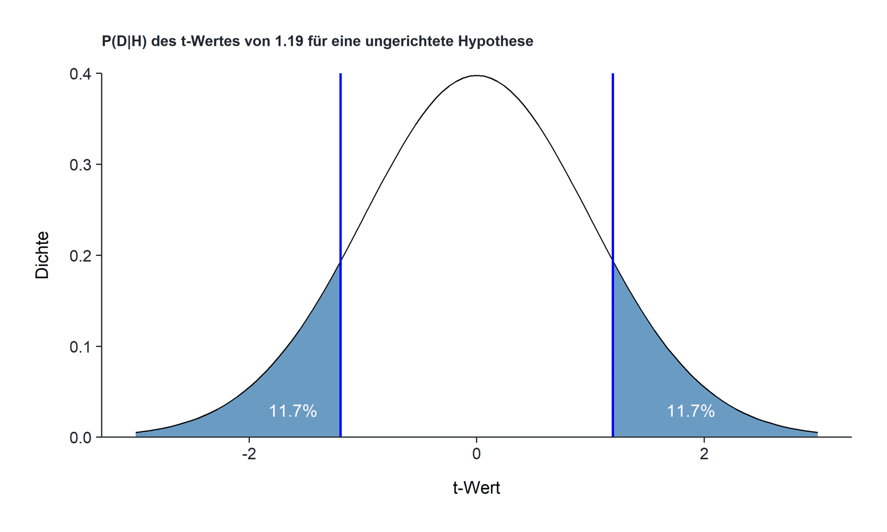

Wenn du beide Wahrscheinlichkeiten zusammen rechnest, erhältst du den *p*-Wert, welchen wir beim *F*-Test erhalten haben: *p* = .234 oder 23.4% (11.7% \* 2). Im Bilde des *t*-Tests haben wir daher eine ungerichtete Hypothese getestet. Allerdings sind wird davon ausgegangen, dass der Korrelationskoeffizient *negativ* ist (je mehr Überlappung, desto geringer die Erinnerungsleistung). Wir müssen daher die Wahrscheinlichkeit links des empirischen *t*-Wertes abtragen:


Wir sind davon ausgegangen, dass der Korrelationskoeffizient kleiner als 0 ist, daher müssen wir die Fläche links des empirischen *t*-Wertes abtragen. Und diese Wahrscheinlichkeit beträgt 88.3%. Jamovi und andere statistische Softwares haben nicht immer eine Funktion Korrelationen gerichtet zu testen. Du erkennst daher an diesem Beispiel, dass wir in der Auswertung statistischer Ergebnisse nicht blind den Ergebnissen der Tests folgen sollten, sondern unsere Ergebnisse immer mit unseren Hypothesen abgleichen müssen.

### Konfidenzintervalle

Unsere beiden Tests konnten uns zeigen, ob wir uns auf Grundlage der Daten für die Null- oder Alternativhypothese entscheiden sollen. In anderen Worten, der *F*-Test oder der *t*-Test zeigt uns, wie wir handeln sollen. Die Ergebnisse der Tests deuten darauf hin, dass wir annehmen sollten, dass die Anzahl der Worte der Mitschrift in einem Zusammenhang mit der Erinnerungsleistung aus dem Vortrag steht und dass die wörtliche Überlappung in der Mitschrift in keinem Zusammenhang mit der Erinnerungsleistung aus dem Vortrag steht.

Eine weitere Frage ist, wie groß der Zusammenhang in der Population ist? Diese Frage können wir ansatzsweise mit Konfidenzintervallen beantworten. Wie bereits im letzten Modul gezeigt, besagt ein Konfidenzintervall, wie oft sich ein Populationsparameter im Schnitt innerhalb eines Intervalls befindet. Je größer die Stichprobe, desto enger wird das Intervall. Bei einem 95%-igen Konfidenzintervall beispielsweise befindet sich im Schnitt der wahre Populationsparameter in 95 von 100 Fällen innerhalb des Intervalls. Ein Konfidenzintervall gibt einen starken Hinweis, wie groß beispielsweise eine Korrelation zwischen zwei Variablen ausfällt. Berechnen wir die Konfidenzintervalle für die beiden Parameter der letzten beiden Tests als nächstes.

### Berechnung des standardisierten Konfidenzintervalls für den Parameter der Anzahl der Worte in der Mitschrift

Beginnen wir mit dem Parameter für die Anzahl der Worte in der Mitschrift. Wir haben vorhin heraus gefunden, dass es einen signifikanten Zusammenhang zwischen der Anzahl der Worte in der Mitschrift und der Erinnerungsleistung aus dem Vortrag gibt. Als nächstes können wir uns fragen, wie groß der Korrelationskoeffizient der beiden Variablen vermutlich ist. Diesen können wir berechnen, indem wir die abhängige Variable und die unabhängigen Variablen z-standardisieren und danach folgende Formel anwenden:


Im nächsten Video siehst du, wie die Konfidenzintervalle in R berechnet werden können. Dieses Beispiel dient dir dazu, die einzelnen Schritte in der Berechnung nachzuvollziehen. Du musst nicht in der Lage sein, selbst eine solche Berechnung in R durchzuführen. Es hilft allerdings hoffentlich deinem Verständnis für die Berechnung des Konfidenzintervalls.

TODO: Einfügen Datei ci_berechnen_multiple_regression.R

TODO: Einfügen Video

Aus dem Konfidenzintervall erkennen wir im Übrigen auch, ob der Test signifikant ist. Sobald das Konfidenzintervall den Wert 0 nicht schneidet, erhalten wir ein signifikantes Ergebnis. Dies ist in unserem Fall gegeben. Noch einmal grafisch können wir den Koeffizienten wie folgt angeben. Achte allerdings darauf, dass wir keine Gewissheit darüber haben, dass der wahre Korrelationskoeffizient innerhalb dieses Intervalls steckt. Es ist nur sehr wahrscheinlich.


Wir könnten das gleiche für den anderen Parameter des Prädiktors machen. Dies überlasse ich allerdings dir. Die Lösung findest du in der nächsten Datei:

TODO: Einfügen Datei ci_overlap.R

### Zusammenfassung

Wir haben in diesem Submodul drei Fragestellungen der multiplen linearen Regression getestet. Zunächst haben wir einen allgemeinen *F*-Test mit einem Freiheitsgrad von 2 gerechnet und erkannt, dass dieser Test uns keine hilfreichen Informationen zu unseren Hypothesen gibt. Im Anschluss haben wir zwei Tests gerechnet, bei denen wir getestet haben, ob die Anzahl der Worte und die Überlappung in der Mitschrift mit der Erinnerungsleistung aus dem Vortrag korreliert. Wir haben erkannt, dass wir für beide Tests ebenso einen *t*-Test berechnen können, da bei beiden Modellpaaren das erweiterte Modell einen Parameter mehr hat als das kompakte Modell. Ebenso haben wir gezeigt, dass wir bei der Interpretation des *p*-Wertes immer die Hypothese im Hinterkopf behalten müssen, um den p-Wert korrekt zu ermitteln. Am Ende des Submoduls haben wir gezeigt, wie standardisierte Konfidenzintervalle bei der multiplen Regression berechnet werden.

## Berechnung in Jamovi

In folgendem Video siehst du, wie die multiple Regression in Jamovi und R berechnet werden kann:

TODO: Einfügen Video

Eine weitere Möglichkeit, die multiple Regression in R zu berechnen ist die Funktion [lm](https://www.rdocumentation.org/packages/stats/versions/3.6.2/topics/lm):

TODO: Einfügen Video

<!--chapter:end:06-multiple_lineare_regression.Rmd-->

# Einfaktorielle Varianzanalyse

## Einführung

Bisher haben wir drei verschiedene Testverfahren kennen gelernt: Der *t*-Test für eine Stichprobe, die einfache lineare Regression und die multiple lineare Regression. Durch diese drei Testsverfahren können wir bereits eine Fülle an bildungswissenschaftlich relevanten Fragen beantworten. Zum Beispiel:

-   Haben Gymnasiasten einen höheren Intelligenzquotienten als 100?

-   Verringert sich das Stressempfinden von Studierenden, wenn sie mehr meditieren?

-   Gibt es einen Zusammenhang zwischen der Zeit, die Studierende lernen und ihren Noten in Klausuren?

Unser Werkzeugkasten ermöglicht es uns allerdings bisher nicht, Gruppenunterschiede zu testen. Beispielsweise können wir bisher keine Unterschiedshypothesen testen. In diesem Modul werden wir daher folgenden beiden Fragestellungen testen:

> **Lernen Studierende mehr, wenn sie ihr Wissen [testen ](https://dorsch.hogrefe.com/stichwort/testungseffekt)anstatt eine [Concept-Map](https://dorsch.hogrefe.com/stichwort/lernen-mit-concept-maps) zu erstellen?**
>
> **Lernen Studierende, die während eines Vortrags handschriftlich mitschreiben mehr als Studierende, die mit einem Laptop bzw. einem E-Writer mitschreiben?**

Um solche Fragestellungen statistisch zu testen, müssen wir uns überlegen, wie wir diese Gruppenunterschiede durch die Parameter in unseren statistischen Modellen kodieren können. Wir haben beispielsweise gesehen, dass *b~1~* bei der einfachen linearen Regression den Zusammenhang zwischen zwei Variablen kodiert. Wir haben ebenso gesehen, dass wir bei der linearen und multiplen Regression Prädiktoren eingeführt haben (*X~i~*), für welche wir die Werte einer metrischen Variable eingesetzt haben. Um nun Gruppenunterschiede statistisch zu testen, müssen wir zwei Probleme lösen:

1.  Wir müssen einen Weg finden, Mittelwertsunterschiede von Gruppen als Parameter zu kodieren (z.B. *b~1~*).

2.  Wir müssen einen Weg finden, kategoriale Variablen (handschriftliche Mitschrift vs. Mitschrift mit dem Laptop) in eine numerische Form zu bringen, die wir für *X~i~* einfügen können (z.B. handschriftliche Mitschrift = 1, Mitschrift mit dem Laptop = -1). Das heißt, *X~i~* ist im Gegensatz zur linearen und multiplen Regression nicht mehr kontinuierlich, sondern diskret skaliert.

Um diese beiden Probleme zu lösen, werden wir sogenannte Kontrastkodierungen kennen lernen, welche uns ermöglichen, spezifische Gruppenunterschiede zu testen. Zum Beispiel werden wir am Ende des Moduls in der Lage sein, zu testen, ob Studierende, die handschriftlich mitschreiben mehr lernen als Studierende, die mit dem Laptop oder mit einem E-Writer mitschreiben.

Wir werden in diesem Modul zwei verschiedene Tests kennen lernen, die allerdings das gleiche Verfahren anwenden, welches wir bisher kennen gelernt haben. Genauer werden wir den ***t*****-Test für unabhängige Stichproben** und die **einfaktorielle Varianzanalyse** kennen lernen. Für beide Verfahren werden wir *F*-Tests berechnen. Der Unterschied zwischen dem *t*-Test für unabhängige Stichproben und der einfaktoriellen Varianzanalyse liegt darin, dass sie sich darin unterscheiden, wie viel Gruppen man miteinander vergleicht. Beim *t*-Test für unabhängige Stichproben werden zwei Gruppen miteinander verglichen, bei der einfaktoriellen Varianzanalyse mehr als zwei Gruppen. Sobald du allerdings die Kontrastkodierung verstehst, wirst du sehen, dass beide Tests ähnlich statistisch modelliert werden.

### Datensätze dieses Moduls

Wir werden in diesem Modul zwei verschiedene Datensätze verwenden. Bei beiden Datensätzen handelt es sich um Replikationsstudien bekannter Studien.

### ***t*****-Test für unabhängige Stichproben: Buttrick et al. (2018)**

Zunächst werden wir uns mit der Studie von [Buttrick et al. (2018) ](https://osf.io/2h3g6/)beschäftigen. Buttrick und Kolleg\*innen replizierten eine sehr bekannte Studie von [Karpicke und Blunt (2011)](https://science.sciencemag.org/content/sci/330/6002/335.full.pdf). In dieser Studie wurde unter anderem untersucht, ob das Testen von Wissen, das heißt der freie Abruf von Wissen, für das Erlernen konzeptuellen Wissens lernförderlicher ist als das Erstellen von Concept Maps. Diese Studie war der Beginn einer intensiven Diskussion zur Frage, ob der Testing-Effekt nicht nur für einfaches Lernmaterial wie Wortpaarliste, sondern auch für komplexes Lernmaterial funktioniert (z.B. konzeptuelles Wissen). Beispielsweise kritisierten [van Gog und Sweller (2015)](https://repub.eur.nl/pub/92178/), dass der Testing-Effekt bei komplexem Lernmaterial nicht zu finden ist. [Karpicke und Aue (2015)](https://www.infona.pl/resource/bwmeta1.element.springer-27c4b436-8913-3d02-b003-c3e50ac8e537) verteidigten ihre Position anschließend mit dem Argument, dass die Studien von van Gog und Sweller methodologisch mangelhaft waren. Wir werden in diesem Modul den *t*-Test für unabhängige Stichproben verwenden, um die Ergebnisse von Buttrick et al. zu berechnen und die Frage beantworten, ob das Testen von Wissen zu einer besseren Erinnerungsleistung bei konzeptuellen Wissen ist als die Erstellung von Concept Maps.\

Die Prozedur des Experiments von Buttrick et al. (2018) sah folgendermaßen aus: Die Versuchspersonen wurden in Kleingruppen (1 bis 4 Personen) getestet und lasen einen kurzen Text zum Thema Seeotter. Sie hatten fünf Minuten Zeit, den Text zu studieren. Die Versuchspersonen wurden anschließend willkürlich in zwei Gruppen eingeteilt (Concept Map Gruppe vs. Testing Gruppe). Die Versuchspersonen in der Concept-Map Gruppe hatten anschließend 25 Minuten Zeit mit dem Text eine Concept-Map zu erstellen. Diejenigen Versuchspersonen in der Concept-Map Gruppe hatten 10 Minuten Zeit so viel aus dem Text aufzuschreiben, wie sie sich erinnern konnten. Anschließend bekamen sie 5 Minuten Zeit, den Text erneut zu studieren und erhielten erneut 10 Minuten, sich an die Inhalte des Textes frei zu erinnern. Eine Woche später erhielten die Versuchspersonen einen Follow-Up Test, welcher 14 Faktenfragen und zwei Inferenzfragen zum Thema des Textes beinhaltete. Beide Fragen testeten nach Aussage der Autoren konzeptuelles Wissen.

Den Datenatz der Replikationsstudie von Buttrick et al. (2018) findest du hier:

TODO: Einfügen Datei buttrick.csv

Für diese Studie interessieren uns folgende Variablen:

-   **condition**: Diese Variable kodiert, ob Studierende entweder eine Concept Map erstellt haben (Concept) oder ihr Wissen getestet haben (Retrieval). condition ist die unabhängige Variable.

-   **ts_avg**: Diese Variable kodiert, wie viele richtige Antworten die Versuchspersonen bei den 16 Fragen des Abschlusstests in Prozent korrekt beantwortet haben. ts_avg ist die abhängige Variable.

#### **Einfaktorielle Varianzanalyse: Morehead, Dunlosky und Rawson (2014)**

Für das Verfahren der einfaktoriellen Varianzanalyse werden wir erneut die Replikationsstudie von [Morehead, Dunlosky und Rawson (2014)](https://link.springer.com/article/10.1007/s10648-019-09468-2) verwenden. Zur Erinnerung, in dieser Studie wiederholten Morehead et al. eine Studie, die ursprünglich von [Mueller und Oppenheimer (2014)](https://journals.sagepub.com/doi/full/10.1177/0956797614524581) durchgeführt wurde. In beiden Studien wurde untersucht, ob die Mitschrift eines Vortrags mit verschiedenen Medien einen Einfluss auf die Erinnerungsleistung hat. Wir werden diese Replikationsstudie verwenden, um heraus zu finden, ob die handschriftliche Mitschrift während eines Vortrags lernförderlicher ist als die Mitschrift mit dem Laptop beziehungsweise einem E-Writer.

Die Prodezur der Studie von Morhead et al. (2014) verlief wie folgt: Studierende sahen sich einen von fünf TED-Talks an, welche im Schnitt 17 Minuten dauerten. Versuchspersonen wurden willkürlich in einer der folgenden Gruppen eingeteilt. Entweder wurden die Versuchspersonen gebeten, während des Vortrags die Inhalte des Vortrags per Hand mitzuschreiben. Eine andere Gruppe wurde gebeten, die Inhalte des Vortrags mit dem Laptop mitzuschreiben. Eine dritte Gruppe wurde gebeten, die Inhalte des Vortrags mit einem E-Writer aufzuschreiben. Anschließend erhielten die Versuchspersonen für 30 Minuten eine Aufgabe, die nichts mit dem Experiment zu tun hatte. Anschließend füllten die Versuchspersonen einen Test aus, welcher aus Faktenfragen und konzeptuellen Fragen bestand. Zwei Tage später wurden die gleichen Fragen erneut abgefragt.

Der Datensatz dieses Experiments befindet sich hier:

TODO: Einfügen morehead_experiment1.csv

Für diese Studie interessieren uns folgende Variablen:

-   **method**: Die Versuchsgruppe, in die die Versuchspersonen eingeordnet wurden: eWriter, laptop oder longhand.

-   **test2tot**: Prozentueller Anteil der korrekten Fragen des Tests zwei Tage nach dem Aufschreiben der Notizen.

## Kontrastkodierungen

In der Einführung dieses Moduls haben wir gesagt, dass wir zwei Probleme lösen müssen. Wir müssen kategorielle Werte, wie beispielsweise ob Studierende ihr Wissen getestet haben oder eine Concept-Map erstellt haben, in numerische Werte überführen. Ebenso müssen wir einen Weg finden, die Parameter in unseren statistischen Modellen als spezifische Hypothesen zu kodieren. Die Lösung dieser beider Probleme sind Kontrastkodierungen.

### **Bei *k* Gruppen braucht man *k* - 1 Prädiktoren**

Für Kontrastkodierungen gilt, dass wir bei einem *t*-Test für unabhängige Stichproben bzw. einer einfaktoriellen Varianzanalyse für *k* Gruppen *k* - 1 Prädiktoren benötigen. Wenn ich beispielsweise testen möchte, ob Probanden, die sich ihr Wissen testen, mehr konzeptuelles Wissen erwerben als Studierende, die Concept-Maps anfertigen, bräuche ich einen Prädiktor (2 -1 = 1) im erweiterten Modell. Würde ich untersuchen, ob Studierende, die bei einem Vortrag handschriftlich mitschreiben, mehr lernen als Studierende, die mit dem Laptop oder einem E-Writer mitschreiben, bräuchte ich zwei Prädiktoren (3 - 1 = 2).

### **Kategoriale Variablen in numerische Werte überführen**

Während wir bei der einfachen linearen Regression für die Prädiktoren *X~i~* die Werte der unabhängigen Variablen einfügen können (siehe Bild links), können wir die Gruppen, welche in der Regel als Text in Variablen gespeichert sind (*Concept* und *Retrieval*) nicht direkt für *X~i~* eintragen (siehe Bild rechts), da diese Gruppen nicht numerisch vorliegen.


Wie wir Gruppen in numerische Werte überführen, entscheidet darüber, welche Hypothesen wir mit den Modellpaaren testen können. Nehmen wir beispielsweise die Frage, ob Studierende, die ihr Wissen testen, mehr konzeptuelles Wissen erwerben als Studierende, die eine Concept-Map anfertigen. Da wir zwei Gruppen haben, müssten wir *einen* Kontrast für den Parameter *X~1~* definieren (2 -1 = 1). Beispielsweise könnten wir der Testing-Gruppe eine 1 und der Concept Map Gruppe eine -1 zuordnen.

| **Gruppe**  | ***X~1~*** |
|-------------|------------|
| Testing     | 1          |
| Concept Map | -1         |

Die Werte dieses Kontrasts würden wir für *X~1~* einfügen. *b~1~* kodiert als Folge den Mittelwertsunterschied beider Gruppen. Indem wir nun *X~1~* im kompakten Modell auf 0 setzen, können wir testen, ob dieser Mittelwertsunterschied 0 beträgt:


In der unteren Tabelle siehst du nun eine Reihe an Kontrasten, die du für verschiedene spezifische Hypothesen verwenden kannst. Wir werden diese Kontraste einzeln durchgehen und an Beispielen zeigen, welche Fragestellungen mit ihnen beantwortet werden können. Das Ziel dieser Ausführungen ist, dass du lernst, wie statistische Modelle mit kategorialen Prädiktoren erstellt werden. In den nächsten Modulen wirst du sehen, wie wir diese Kontraste nutzen, um Hypothesen zu testen.

Die folgenden Kontraste werden alle von Jamovi unterstützt. Die Tabelle enthält sowohl den Namen des Kontrasts, die Hypothese, welche man mit den Kontrasten testen kann und die Bedeutung der Regressionskoeffizienten des erweiterten Modells. Ebenso zeigt die Tabelle an, ob Kontraste orthogonal sind. Wir werden bei den Difference- bzw. Reverse-Helmert Kontrasten erklären, was damit gemeint ist.

| Kontrast                                 | Hypothese                                                                            | Bedeutung *b~0~*                          | Bedeutung *b~i~*                                                                          | orthogonal |
|:-----------------------------------------|:-------------------------------------------------------------------------------------|-------------------------------------------|-------------------------------------------------------------------------------------------|------------|
| Deviation- oder Sum-Kontrast             | Vergleicht den Mittelwert einer Gruppe gegen den Mittelwert aller Gruppen.           | Mittelwert aller Gruppen                  | Die Abweichung des Mittelwerts einer Gruppe vom Mittelwert der Mittelwerte aller Gruppen. | nein       |
| Dummy- oder Simple-Kontrast              | Vergleicht den Mittelwert einer Gruppe durch den Mittelwert einer Referenzgruppe.    | Mittelwert einer Referenzgruppe           | Die Abweichung des Mittelwerts einer Gruppe vom Mittelwert der Referenzgruppe.            | nein       |
| Difference-oder Reverse-Helmert Kontrast | Vergleicht den Mittelwert einer Gruppe mit dem Mittelwert der vorherigen Gruppen.    | Mittelwert des Mittelwerts aller Gruppen. | Die Differenz der Mittelwerte zweier oder mehrerer Gruppen.                               | ja         |
| Helmert-Kontrast                         | Vergleicht den Mittelwert einer Gruppe mit dem Mittelwert der nachfolgenden Gruppen. | Mittelwert des Mittelwerts aller Gruppen. | Die Differenz der Mittelwerte zweier oder mehrerer Gruppen.                               | ja         |

Im Folgenden gehen wir die einzelnen Kontraste einzeln durch, um zu erklären, für welche Hypothesen sie genutzt werden können. Für alle Beispiele werden wir die Studie von Morehead und Kollegen verwenden.

### **Deviation- oder Sum-Kontrast**

Diese Kontraste eignen sich dazu, zu testen, ob sich ein Mittelwert einer Gruppe vom Mittelwert aller Gruppen unterscheidet. Du wirst eine solche Kontrastkodierung selten verwenden, da wir in der Regel daran interessiert sind, spezifische Gruppenunterschiede zu testen.

+-------------------------------+---------------------------------------------------------------------------+---------------------------+-------------------------------------------------------------------------------------------+----------------+
| **Kontrast**                  | **Hypothese**                                                             | **Bedeutung *b~0~*\       | **Bedeutung *b~i~***                                                                      | **orthogonal** |
|                               |                                                                           | **                        |                                                                                           |                |
+:==============================+:==========================================================================+===========================+===========================================================================================+================+
| Deviation- oder Sum-Kontrast\ | Vergleicht den Mittelwert einer Gruppe gegen den Mittelwert aller Gruppen | Mittelwert aller Gruppen\ | Die Abweichung des Mittelwerts einer Gruppe vom Mittelwert der Mittelwerte aller Gruppen. | nein           |
+-------------------------------+---------------------------------------------------------------------------+---------------------------+-------------------------------------------------------------------------------------------+----------------+

Nehmen wir folgendes Beispiel: Du möchtest heraus finden, ob Studierende, die per Hand mitschreiben, sich an mehr oder weniger aus einem Vortrag erinnern als die Studierenden aller Gruppen zusammen. Um diese Hypothese zu testen, könntest du folgende Kontraste aufstellen:

+------------+------------+---------------+
| **Gruppe** | ***X~1~*** | ***X~2~*****\ |
|            |            | **            |
+============+============+===============+
| per Hand\  | -1         | -1            |
+------------+------------+---------------+
| Laptop     | 1          | 0             |
+------------+------------+---------------+
| E-Writer   | 0          | 1             |
+------------+------------+---------------+

Nun bist du vermutlich geneigt zu denken, dass man mit diesem Kontrast testet, ob Studierende, die mit dem Laptop mitschrieben sich besser an den Vortrag erinnern konnten als Studierende, die per Hand mitschrieben. Dem ist allerdings nicht so. Der Grund hierfür ist, dass diese Kontrastgewichte nicht orthogonal sind (wir kommen gleich darauf zu sprechen). 

Deviation- oder Sum-Kontraste erkennst du daran, dass die erste Zeile der Kontrastegewichte auf -1 gesetzt wird und für die Gruppe, die mit allen Gruppen verglichen werden soll eine 1 gesetzt wird. Alle anderen Gruppen werden auf 0 gesetzt. Das bedeutet, durch *X~2~* testen wir, ob die Studierende mit E-Writern sich besser oder schlechter an den Vortrag erinnern konnten als alle Gruppen zusammen. 

Berechnen wir das erweiterte Modell auf Grundlage dieser Kontrastgewichte, erhalten wir dieses Modell:


Du siehst, dass das Modell drei Parameter und zwei Prädiktoren hat. *b~1~* kodiert den Mittelwertsunterschied zwischen der Laptopgruppe mit allen anderen Gruppen. *b~2~* kodiert den Mitelwertsunterschied zwischen der E-Writer Gruppe mit allen anderen Gruppen. Beweisen können wir dies dadurch, indem wir uns die Mittelwerte der Gruppen ansehen:

+----------------------------------------+---------+
| **Gruppen**\\                          | ***M*** |
+========================================+=========+
| per Hand\                              | 0.269   |
+----------------------------------------+---------+
| Laptop                                 | 0.2333  |
+----------------------------------------+---------+
| E-Writer                               | 0.250   |
+----------------------------------------+---------+
| Mittelwerte aller Mittelwerte (*b~0~)* | 0.2508  |
+----------------------------------------+---------+

*b~0~* ist offensichtlich der Mittelwert aller Mittelwerte (0.2508). *b~1~* wiederum ist die Differenz des Mittelwerts der Laptopgruppe vom Gruppenmittelwert: 0.2333- 0.2508 = -0.0175. *b~2~* wiederum ist die Differenz des Mittelwerte der E-Writer Gruppe vom Gruppenmittelwert: 0.250 - 0.2508 = 0.00085. Wir haben damit gezeigt, dass die Parameter spezifische Gruppenunterschiede testen. Indem wir die Prädiktoren dieser Parameter im kompakten Modell auf 0 setzten, können wir ebendiese Hypothesen durch unseren bekannten *F*-Test bzw. *t*-Test testen.

### **Dummy- oder Simple-Kontrast**

Dummy-Kontraste sind Kontraste, bei denen die Kontrastgewichte lediglich auf 0 und 1 gesetzt werden. Sie können verwendet werden, um Mittelwertsunterschiede zwischen einer Referenzgruppe und allen anderen Gruppen zu testen.

+-----------------------------+----------------------------------------------------------------------------------+---------------------------------+---------------------------------------------------------------------------------+----------------+
| **Kontrast**                | **Hypothese**                                                                    | **Bedeutung *b~0~*\             | **Bedeutung *b~i~***                                                            | **orthogonal** |
|                             |                                                                                  | **                              |                                                                                 |                |
+:============================+:=================================================================================+=================================+=================================================================================+================+
| Dummy- oder Simple-Kontrast | Vergleicht den Mittelwert einer Gruppe durch den Mittelwert einer Referengruppe. | Mittelwert einer Referenzgruppe | Die Abweichung des Mittelwerts einer Gruppe vom Mittelwert der Referenzgruppe.\ | nein           |
+-----------------------------+----------------------------------------------------------------------------------+---------------------------------+---------------------------------------------------------------------------------+----------------+

Für die Referenzgruppe werden in einer Dummy-Kodierung alle Kontrastgewichte auf 0 gesetzt. Für alle Gruppen, die mit dieser Referenzgruppe verglichen werden sollen, wird pro Kontrast eine 1 eingesetzt. In folgendem Beispiel wird jede Gruppe mit der Referenzgruppe derjenigen Studierenden verglichen, die per Hand mitgeschrieben haben.

+------------+------------+---------------+
| **Gruppe** | ***X~1~*** | ***X~2~*****\ |
|            |            | **            |
+============+============+===============+
| per Hand\  | 0          | 0             |
+------------+------------+---------------+
| Laptop     | 1          | 0             |
+------------+------------+---------------+
| E-Writer   | 0          | 1             |
+------------+------------+---------------+

Berechnet man auf Grundlage dieser Kontraste das erweiterte Modell erhält man folgendes Modell:


Ein Blick auf die untere Tabelle verrät uns, dass *b~0~* nichts anderes ist als der Mittelwert der Gruppe, welche per Hand mitgeschrieben hat. *b~1~* kodiert den Mittelwertsunterschied zwischen der Laptopgruppe und der Gruppe, die per Hand mitgeschrieben hat: 0.2333 - 0.269 = -0.036. *b~2~* kodiert den Mittelwertsunterschied der E-Book Gruppe und der Gruppe, die per Hand mitgeschrieben hab: 0.250 - 0.269 = -0.019.

+-------------------------------+---------+
| **Gruppen**\\                 | ***M*** |
+===============================+=========+
| per Hand\                     | 0.269   |
+-------------------------------+---------+
| Laptop                        | 0.2333  |
+-------------------------------+---------+
| E-Writer                      | 0.250   |
+-------------------------------+---------+
| Mittelwerte aller Mittelwerte | 0.2508  |
+-------------------------------+---------+

Durch die Wahl dieser Dummy-Kodierung können wir durch unser Verfahren daher zwei Hypothesen testen: Ob sich die Mittelwerte zwischen der Gruppen Laptop und E-Writer vom Mittelwert der händischen Gruppe unterscheidet. Wir testen diese beiden Hypothesen, indem wir den Prädiktor des jeweiligen Parameters im kompakten Modell auf 0 setzen.

### **Difference-oder Reverse-Helmert Kontrast**

Der dritte Kontrast ermöglicht es uns ebenso Mittelwertsunterschiede einzelner Gruppen zu testen. Er ermöglicht es uns aber ebenso eine Gruppe mit mehreren anderen Gruppen zu vergleichen. Dies ist bei einer Dummykodierung und einer Differenzkodierung nicht möglich. Beispielsweise können wir einen Reverse-Helmert-Kontrast verwenden, um zu testen, ob sich die e-Writer Gruppe an mehr oder weniger aus dem Vortrag erinnert als die anderen beiden Gruppen.

+------------------------------------------+------------------------------------------------------------------------------------+--------------------------------------------+-------------------------------------------------------------+----------------+
| **Kontrast**                             | **Hypothese**                                                                      | **Bedeutung *b~0~*\                        | **Bedeutung *b~i~***                                        | **orthogonal** |
|                                          |                                                                                    | **                                         |                                                             |                |
+:=========================================+:===================================================================================+============================================+=============================================================+================+
| Difference-oder Reverse-Helmert Kontrast | Vergleicht den Mittelwert einer Gruppe mit dem Mittelwert der vorherigen Gruppen.\ | Mittelwert des Mittelwerts aller Gruppen.\ | Die Differenz der Mittelwerte zweier oder mehrerer Gruppen. | ja             |
+------------------------------------------+------------------------------------------------------------------------------------+--------------------------------------------+-------------------------------------------------------------+----------------+

In der folgenden Tabelle siehst du einen Reverse-Helmert-Kontrast. Bisher konnten wir aus Kontrastgewichten, die für die einzelnen Prädiktoren eingesetzt werden nicht erahnen, welche Hypothesen mit ihnen getestet werden können. Mit einem Reverse-Helmert-Kontrast allerdings schon. Beispielsweise testen wir bei *X~1~*, ob der Mittelwertunterschied der Laptopgruppe unterschiedlich vom Mittelwert der händischen Gruppe ist. Mit *X~2~* testen wir, ob der Mittelwert der E-Writer Gruppe unterschiedlich vom Mittelwert der anderen beiden Gruppen ist.

+------------+------------+---------------+
| **Gruppe** | ***X~1~*** | ***X~2~*****\ |
|            |            | **            |
+============+============+===============+
| per Hand\  | -1         | -1            |
+------------+------------+---------------+
| Laptop     | 1          | -1            |
+------------+------------+---------------+
| E-Writer   | 0          | 2             |
+------------+------------+---------------+

Der Grund, dass diese Kontrastkodierung der einzelnen Prädiktoren interpretierbar sind, liegt darin, dass diese Kontraste orthogonal sind. Orthogonale Kontraste folgen zwei Regeln:

### **Erste Regel: Bei orthogonalen Kontrasten muss die Summe der Kontrastgewichte pro Prädiktor 0 ergeben**

Die erste Regel lautet, dass die Summe der Kontrastgewichte für jeden Prädiktor 0 ergeben muss:


In unserer Reverse-Helmert-Kodierung gilt daher, dass die Kontrastgewichte für *X~1~* und *X~2~* 0 ergibt:

+------------+------------+---------------+
| **Gruppe** | ***X~1~*** | ***X~2~*****\ |
|            |            | **            |
+============+============+===============+
| per Hand\  | -1         | -1            |
+------------+------------+---------------+
| Laptop     | 1          | -1\           |
+------------+------------+---------------+
| E-Writer   | 0          | 2             |
+------------+------------+---------------+
| *Summe:*   | *0*        | 0             |
+------------+------------+---------------+

### **Zweite Regel: Bei mehr als zwei Gruppen muss das Produkt der Kontrastgewichte der Prädiktoren bei orthogonalen Kontrasten 0 ergeben.**

Da wir zwei Prädiktoren haben, müssen wir das Produkt der Kontrastgewichte dieser Prädiktoren berechnen und prüfen, ob deren Summe 0 ergibt.


In der unteren Tabelle siehst du, wie dieses Produkt berechnet wird. Du erkennst, dass die Summe des Produktes der beiden Kontraste 0 ergibt:

+------------+------------+---------------+-----------------------+
| **Gruppe** | ***X~1~*** | ***X~2~*****\ | ***X~1~ \* X~2~*****\ |
|            |            | **            | **                    |
+============+============+===============+=======================+
| per Hand\  | -1         | -1            | (-1) \* (-1) = 1      |
+------------+------------+---------------+-----------------------+
| Laptop     | 1          | -1\           | 1 \* (-1) = -1\       |
+------------+------------+---------------+-----------------------+
| E-Writer   | 0          | 2             | 0 \* 2 = 0            |
+------------+------------+---------------+-----------------------+
| *Summe:*   | *0*        | 0             | 0                     |
+------------+------------+---------------+-----------------------+

Nun, stell dir eine andere Reverse-Helmert-Kodierung vor, welche für vier Gruppen definiert wird. Um einen orthogonalen Kontrast zu erzielen, müssten die Summe der Produkte *aller* Kontraste 0 ergeben:

+------------+------------+---------------+---------------+-----------------------+-----------------------+-----------------------+
| **Gruppe** | ***X~1~*** | ***X~2~*****\ | ***X~3~*****\ | ***X~1~ \* X~2~*****\ | ***X~1~ \* X~3~*****\ | ***X~2~ \* X~3~*****\ |
|            |            | **            | **            | **                    | **                    | **                    |
+============+============+===============+===============+=======================+=======================+=======================+
| Gruppe 1\  | 1          | 1\            | 1             | 1                     | 1                     | 1                     |
+------------+------------+---------------+---------------+-----------------------+-----------------------+-----------------------+
| Gruppe 2   | 1          | 1\            | -1            | 1                     | -1\                   | -1                    |
+------------+------------+---------------+---------------+-----------------------+-----------------------+-----------------------+
| Gruppe 3   | 1          | -2            | 0             | -2                    | 0                     | 0                     |
+------------+------------+---------------+---------------+-----------------------+-----------------------+-----------------------+
| Gruppe 4   | -3         | 0             | 0             | 0                     | 0                     | 0                     |
+------------+------------+---------------+---------------+-----------------------+-----------------------+-----------------------+
| *Summe:*   | *0*        | 0             | 0             | 0                     | 0                     | 0                     |
+------------+------------+---------------+---------------+-----------------------+-----------------------+-----------------------+

### **Alternative Berechnung der Kontrastgewichte bei Reverse-Helmert-Kontrasten**

Wir könnten an dieser Stelle bereits das Modell auf Grundlage dieser Kontraste aufstellen. Allerdings wäre hierdurch die Interpretation der Parameter schwieriger. Damit die Parameter spezifische Mittelwertsunterschiede kodieren, müssen wir die einzelnen Kontraste durch die Anzahl der Gruppen teilen, die miteinander verglichen werden. Zum Beispiel werden im ersten Kontrast für *X~1~* zwei Gruppen miteinander verglichen. Daher wird jedes Kontrastgewicht durch 2 geteilt. Im Prädiktor *X~2~* wiederum wird die E-Writer Gruppe mit den anderen beiden Gruppen verglichen. Da wir für diesen Vergleich alle Gruppen betrachten, werden die Kontrastgewichte durch 3 geteilt.

+------------+------------+---------------+
| **Gruppe** | ***X~1~*** | ***X~2~*****\ |
|            |            | **            |
+============+============+===============+
| per Hand\  | -1 / 2     | -1 / 3        |
+------------+------------+---------------+
| Laptop     | 1 / 2      | -1 / 3        |
+------------+------------+---------------+
| E-Writer   | 0          | 2 / 3         |
+------------+------------+---------------+

Verwenden wir dieses Set an Kontrasten, erhalten wir folgendes Modell:


Mit Blick auf die untere Tabelle sehen wir erneut, dass *b~0~* den Mittelwert der Gruppenmittelwerte kodiert. *b~1~* kodiert den Mittelwertsunterschied der Laptopgruppe und der Gruppe, die per Hand mitgeschrieben hat: 0.2333 - 0.269 = -0.0357 (mit kleinen Rundungsfehlern). *b~2~* kodiert den Mittelwertsunterschied zwischen der E-Writer Gruppe und den anderen beiden Gruppen: 0.250 - ((0.2692308+ 0.2333) / 2) = -0.00127.

+-------------------------------+---------+
| **Gruppen**\\                 | ***M*** |
+===============================+=========+
| per Hand\                     | 0.269   |
+-------------------------------+---------+
| Laptop                        | 0.2333  |
+-------------------------------+---------+
| E-Writer                      | 0.250   |
+-------------------------------+---------+
| Mittelwerte aller Mittelwerte | 0.2508  |
+-------------------------------+---------+

Wir haben damit erneut gezeigt, dass die Parameter für Mittelwertsunterschiede in den Gruppen stehen. Mit der richtigen Wahl der Reverse-Helmert-Kontrasten können wir entscheiden, welche Gruppen wir miteinander vergleichen.

### **Helmert-Kontrast**

Helmert-Kontraste sind fast identisch mit Reverse-Helmert-Kontrasten, nur dass sie sozusagen spiegelverkehrt geschrieben werden. Für die Wahl der Hypothesen und die Interpretation der Ergebnisse machte es keinen Unterschied ob man Helmert- oder Reverse-Helmert-Kontraste verwendet.

+------------------+--------------------------------------------------------------------------------------+--------------------------------------------+--------------------------------------------------------------+----------------+
| **Kontrast**     | **Hypothese**                                                                        | **Bedeutung *b~0~*\                        | **Bedeutung *b~i~***                                         | **orthogonal** |
|                  |                                                                                      | **                                         |                                                              |                |
+:=================+:=====================================================================================+============================================+==============================================================+================+
| Helmert-Kontrast | Vergleicht den Mittelwert einer Gruppe mit dem Mittelwert der nachfolgenden Gruppen. | Mittelwert des Mittelwerts aller Gruppen.\ | Die Differenz der Mittelwerte zweier oder mehrerer Gruppen.\ | ja             |
+------------------+--------------------------------------------------------------------------------------+--------------------------------------------+--------------------------------------------------------------+----------------+

In der unteren Tabelle siehst du eine Helmert-Kontrastkodierung. Im Unterschied zur Reverse-Helmert-Kodierung wird die obere Gruppe mit restlichen Gruppen verglichen. Bei der Reverse-Helmert-Kodierung wird die untere Gruppe mit den restlichen Gruppen weiter oben in der Tabelle verglichen:

+------------+------------+---------------+
| **Gruppe** | ***X~1~*** | ***X~2~*****\ |
|            |            | **            |
+============+============+===============+
| per Hand\  | 2 / 3      | 0             |
+------------+------------+---------------+
| Laptop     | -1 / 3     | 1 / 2         |
+------------+------------+---------------+
| E-Writer   | -1 / 3     | -1 / 2        |
+------------+------------+---------------+

Erneut können wir zeigen, dass wir durch diese Kodierung die in der Tabelle beschriebenen Mittelwertsunterschiede testen können:


*b~0~* kodiert erneut den Mittelwert der Gruppenmittelwerte. *b~1~* kodiert den Mittelwertsunterschied der Gruppe, die per Hand mitschreibt und den anderen beiden Gruppen: 0.269 - ((0.23333+ 0.250) / 2) = 0.027. *b~2~* kodiert den Mittelwertsunterschied zwischen der Laptopgruppe und der E-Writer-Gruppe: 0.2333 - 0.250 = -0.0167.

+-------------------------------+---------+
| **Gruppen**\\                 | ***M*** |
+===============================+=========+
| per Hand\                     | 0.269   |
+-------------------------------+---------+
| Laptop                        | 0.2333  |
+-------------------------------+---------+
| E-Writer                      | 0.250   |
+-------------------------------+---------+
| Mittelwerte aller Mittelwerte | 0.2508  |
+-------------------------------+---------+

### Zusammenfassung

Wir haben in diesem Submodul gelernt, wie wir Gruppen als numerische Werte kodieren können. Dabei sind wir verschiedene Kontrastkodierungssysteme durchgegangen. Durch die Wahl der Kontrastekodierung stellen wir unterschiedliche statistische Modelle auf, mit denen wir unterschiedliche Hypothesen testen können. In diesem Submodul haben wir darauf verzichtet, zu zeigen, wie diese Parameter aus den Modellen berechnet werden. Das Prinzip bleibt allerdings das gleiche. Wir suchen das Modell, welches die geringste quadrierte Abweichung der tatsächlichen Werte von den vorhergesagten Werten hat (Ordinal Least Squares Methode). Auf Grundlage dieser berechneten Parameter haben gesehen, dass bei Helmert- bzw. Reverse-Helmert-Kontrasten die Parameter spezifische Mittelwertsunterschiede der Gruppen kodieren. Dieser Tatsache machen wir uns im nächsten Submodul zu Nutze, um sowohl einen *t*-Test für unabhängige Stichproben als auch eine einfaktorielle Varianzanalyse zu berechnen.

## t-Test für unabhängige Stichproben

Das Ziel dieses Submoduls ist folgende Forschungsfrage zu beantworten: Lernen Studierende, die ihr Wissen testen, mehr konzeptuelles Wissen als Studierende, die eine Concept-Map anfertigen. Zur Erinnerung, [Buttrick et al. (2018)](https://osf.io/2h3g6/) replizierten eine Studie von [Karpicke und Blunt (2011)](https://science.sciencemag.org/content/331/6018/772.abstract), welche genau dies herausgefunden hatte. Den vollständigen Bericht der Studie von Buttrick et al. findest du in der unteren Datei:

\
TODO: Karpicke & Blunt (2011) - Replication Report.pdf

Karpicke berichten folgendes Ergebnis zu dieser Forschungsfrage:

> "The hypothesis that retrieval practice would lead to better recall one week later than concept-mapping was supported by the data. Those assigned to retrieval practice (*n* = 23) recalled more in the one-week follow-up test than those assigned to concept-mapping (*n* = 26): Retrieval *M* = 62.3% recalled, *SD* = 19%; Concept-Mapping *M* = 46.9% recalled, *SD* = 19%; *t*(48)=2.88, *p* = 0.006, *r* = 0.39 [95% CI: 0.11, 0.71]."
>
> Buttrick et al. (2018, S. 4)

Wir werden in diesem Submodul zeigen, wie dieses Ergebnis zu Stande kommt, das heißt, wie es mit unserem bekannten Verfahren des Hypothesentestens berechnet werden kann.

### **Aufstellen der Kontrastkodierung**

Beginnen wir damit, die Kontraste zu kodieren. Wir wissen, dass wir zwei Gruppenmittelwerte miteinander vergleichen möchten, die Gruppe der Studierenden, die eine Concept-Map anfertigt mit der Gruppe der Studierenden, die ihr Wissen testet. Da wir zwei Gruppen haben, benötigen wir lediglich einen Prädiktor in unserem erweiterten Modell (*k* - 1 = 2 - 1 = 1). Wenngleich wir im letzten Submodul mehrere Kodierungssysteme kennen gelernt haben, haben wir bei zwei Gruppen nicht viele Möglichkeiten. Entweder verwenden wir eine Dummy-Kodierung mit einer 0 und einer 1, oder wir verwenden eine Helmert-Kodierung, bei der wir die Kodierung auf -1 und 1 setzen. Beide Kodierungen führen zu den gleichen Ergebnissen. Folgendermaßen könnten wir unsere Hypothese kodieren:

| **Gruppe**  | ***X~1~***\\ |
|-------------|--------------|
| Concept Map | -1 / 2       |
| Testing     | 1 / 2        |

Diese Konstrastkodierung führt dazu, dass der Parameter *b~1~* die Mittelwertsdifferenz der beiden Gruppen kodiert. Indem wir *b~1~* im kompakten Modell auf 0 setzen, können wir testen, ob die Mittelwerte der beiden Gruppen gleich sind. Dies können wir tun, da eine 0 hieße, dass es keine Differenz zwischen den Mittelwerten der beiden Gruppen gibt.

### Aufstellen des statistischen Hypothesenpaares

Wir können den Mittelwertsunterschied der beiden Gruppen durch folgendes Modellpaar testen:

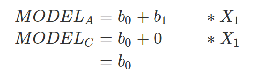\

Wie du siehst, umfasst das erweiterte Modell zwei Parameter und einen Prädiktor. Das kompakte Modell umfasst nur einen Parameter, da dort der Parameter *b~1~* auf 0 gesetzt wurde. Im kompakten Modell kodiert *b~0~* den Mittelwert der abhängigen Variable. Dies ist in unserem Fall das konzeptuelle Wissen, welches die Studierenden zum Thema Seeotter hatten.

### **Berechnung der Sum of Squares und der Kennwerte**

Nun, da wir das erweiterte und das kompakte Modell kennen, können wir sowohl die Sum of Squares als auch die zentralen Kennwerte berechnen. Es stellt sich heraus, dass der *F*-Wert bei 8.33 liegt für einen solchen Mittelwertsunterschied dieser beiden Gruppen unter der Annahme, dass die Gruppen sich nicht im Mittelwert unterscheiden bei 0.6% liegt. Wir haben damit ein signifikantes Ergebnis.

+--------------------------------------------------+----------+----------+----------+---------+---------+-----------+
| **Source**                                       | ***SS*** | ***df*** | ***MS*** | ***F*** | ***p*** | ***PRE*** |
+==================================================+==========+==========+==========+=========+=========+===========+
| Reduktion der Fehler durch das erweiterte Modell | 0.290    | 1        | 0.290    | 8.33    | .006\   | 0.15\     |
+--------------------------------------------------+----------+----------+----------+---------+---------+-----------+
| Error                                            | 1.638    | 47       | 0.035\   | \-      | \-      | \-        |
+--------------------------------------------------+----------+----------+----------+---------+---------+-----------+
| Total Error\                                     | 1.928    | 48\      | \-       | \-      | \-      | \-        |
+--------------------------------------------------+----------+----------+----------+---------+---------+-----------+

Falls du diese Zahlen nachrechnen möchtest und sehen möchtest, wie ich auf dieses Ergebnis gekommen bin, schau dir die folgende R-Datei an. Dort sind alle Schritte in R nachgerechnet.

TODO: Einfügen Datei buttrick_anova_in_r.R

Nun Buttrick et al. (2018) berichten statt einem *F*-Test einen *t*-Test. Damit meinen sie einen *t*-Test für unabhängige Stichproben: *t*(48) = 2.88, *p* = .006, *r* = 0.39 [95% CI: 0.11, 0.71]. Dieser wird eingesetzt, wenn man die Mittelwerte zweier Gruppen vergleichen möchte. Ebenso berichten sie die Effektgröße *r* = 0.39 als auch ein Konfidenzintervall für die Effektgröße. Zunächst können wir den *t*-Wert berechnen, indem wir die Wurzel auf *F* ziehen. Die Wurzel aus 8.33 ist in der Tat 2.88. Als nächstes berichten Buttrick et al. die gleiche Wahrscheinlichkeit von *p* = .006. Da unser *F*-Test die gleiche Wahrscheinlichkeit ergibt, wissen wir, dass Buttrick et al. *ungerichtet* getestet haben. Sie haben daher getestet, ob Studierende, die sich testen *mehr* oder *weniger* konzeptuelles Wissen erwerben als Studierende, die Concept-Maps erstellen. In der *t*-Verteilung dargestellt, haben sie folgenden beiden Flächen abgetragen:

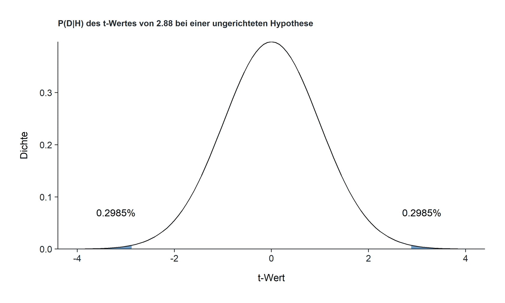

Wäre ihre Hypothese gewesen, dass Studierende, die sich testen, *mehr* konzeptuelles Wissen erwerben als Studierende, die eine Concept-Map anfertigen, hätten sie gerichtet getestet. In diesem Fall hätten sie nur die Fläche rechts des empirischen *t*-Wertes abtragen müssen.


Hierdurch hätte sich die Wahrscheinlichkeit für einen solchen *t*-Wert unter Annahme der Nullhypothese halbiert (von .006 auf 0.0029). 

Ebenso berichten Buttrick et al. eine Effektgröße von *r* = 0.39. Für *t*-Tests ist es in der Regel üblicher eine Effektgröße von Cohen's *d* anzugeben. [Rosnow und Rosenthal (2003)](https://psycnet.apa.org/journals/met/1/4/331.html?uid=1996-06601-001) berichten folgende Formel zur Berechnung der Effektgröße *r* bei einem *t*-Test für unabhängige Stichproben:


*t* kennzeichnet den empirischen *t*-Wert und *df* die Freiheitsgrade des erweiterten Modells. Setzen wir diese Werte in die Formel ein, erhalten wir das gleiche Ergebnis wie Buttrick et al. (2018):

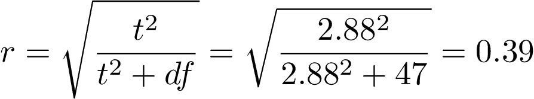

Wir hätten es uns aber auch einfacher machen können, indem wir *r* aus der Wurzel aus *PRE* berechnen. Erinnere dich aus dem Modul zur einfachen linearen Regression, dass *PRE* auch als *R^2^* bezeichnet wird und das Quadrat des Korrelationskoeffizienten *r* ist. Wenn wir daher die Wurzel aus PRE ziehen, sollten wir *r* erhalten:


Und so ist es auch. Der Vollständigkeit halber können wir zudem noch die Effektgröße Cohen's *d* berechnen. Du hast bereits gesehen, dass wir *r* dem *t*-Wert und den Freiheitsgraden des erweiterten Modells berechnen können. Ebenso können wir aus diesen beiden Werte durch folgende Formel Cohen's *d* bei einem *t*-Test für unabhängige Stichproben berechnen:


Mehr Informationen zur Umrechnung von Effektgrößen findest du [hier](https://www.psychometrica.de/effect_size.html).

### Zusammenfassung

Entscheidend für uns ist an dieser Stelle, dass wir gezeigt haben, dass wir den *t*-Test für unabhängige Stichproben durch unser gängiges Verfahren berechnen konnten. Ein entscheidender Schritt dorthin war die Aufstellung eines Kontrastes, der es ermöglicht die Gruppenzugehörigkeit in numerische Werte zu überführen. Durch die Wahl eines Helmert-Kontrasts konnten wir das erweiterte Modell so aufstellen, dass der Parameter *b~1~* für den Mittelwertsunterschied der beiden Gruppen steht. Zum Schluss haben wir gezeigt, dass der *t*-Wert die Wurzel aus dem *F*-Wert ist und dass man Effektgrößen mit verschiedenen Formeln umrechnen kann.

## Einfaktorielle Varianzanalyse (ANOVA)

Das Ziel dieses Submoduls ist folgende Forschungsfrage zu beantworten: Macht es für die Erinnerungsleistung aus einem Vortrag einen Unterschied, mit welchem Medium Studierende während des Vortrags mitschreiben. Genauer möchten wir in diesem Submodul mit Hilfe des Datensatzes von [Morehead et al. (2014)](https://link.springer.com/article/10.1007/s10648-019-09468-2) klären, ob Studierende, die während einem Vortrag per Hand mitschreiben mehr aus einem Vortrag behalten als Studierende, die mit einem Laptop beziehungsweise einem E-Writer mitschreiben. Morehead et al. (2014) haben diese Fragestellung zwar nicht in dieser Form explizit in ihrem Artikel gestellt, da sie eine sogenannte mehrfaktorielle Varianzanalyse berechnet haben, allerdings zweckentfremden wir den Datensatz in diesem Fall für unsere Fragestellung, da wir bisher noch nichts über die mehrfaktorielle Varianzanalyse erfahren haben.

Wir werden erneut folgendes Prozedere verwenden: Zunächst überlegen wir uns die Kontrastkodierung für unsere Gruppen. Anschließend berechnen wir das erweiterte und kompakte Modell auf Grundlage dieser Kontrastkodierung. Anschließend berechnen wir zwei Tests. Einen allgemeinen *F*-Test mit einem Freiheitsgrad von 2, mit welchem wir prüfen, ob es überhaupt Mittelwertsunterschiede zwischen den drei Gruppen gibt. Dieser Test wird allerdings nicht unsere eigentliche Fragestellung beantworten. Daher testen wir als nächstes einen spezifischen Kontrast, der prüft, ob Studierende, die während einem Vortrag per Hand mitschreiben mehr aus einem Vortrag behalten als Studierende, die mit einem Laptop beziehungsweise einem E-Writer mitschreiben.

### **Aufstellen der Kontrastkodierung**

Beginnen wir erneut damit, die Kontraste zu definieren. Und verwenden wir erneut einen Helmert-Kontrast, welcher uns ermöglicht, die Parameter des erweiterten Modells als Mittelwertsunterschiede der Gruppen darzustellen. Da wir drei Gruppen haben, benötigen wir in unserem erweiterten Modell zwei Prädiktoren und drei Parameter. Folgende Kontrastkodierung kodiert unsere Fragestellung (siehe *X~1~*):

+------------+------------+------------+
| **Gruppe** | ***X~1~*** | ***X~2~*** |
+============+============+============+
| per Hand   | 2 / 3      | 0          |
+------------+------------+------------+
| Laptop     | -1 / 3     | 1 / 2      |
+------------+------------+------------+
| E-Writer\  | -1 / 3     | -1 / 2     |
+------------+------------+------------+

Diese Konstrastkodierung führt dazu, dass der Parameter *b~1~* die Mittelwertsdifferenz der Gruppe der Studierenden, welche per Hand schreiben und der anderen beiden Gruppen kodiert. Wir werden gleich zeigen, dass das stimmt. Der zweite Kontrast führt dazu, dass *b~2~* die Mittelwertsdifferenz der Laptopgruppe und der E-Writer-Gruppe kodiert.

### Allgemeiner F-Test

Wir haben zu Beginn dieses Submoduls gesagt, dass wir zwei *F*-Tests berichten. Zunächst berechnen wir einen allgemeinen *F*-Test, durch welchen wir prüfen können, ob sich irgendwelche Mittelwerte zwischen den drei Gruppen unterscheiden. Dieser Test heißt allgemein, da der Freiheitsgrad des erweiterten Modells größer als 1 ist. Immer wenn dies der Fall ist, ist eine Interpretation der Ergebnisse schwierig. Beispielsweise können wir auf Grundlage dieses Ergebnisses nicht herausfinden, welche Gruppen sich voneinander unterscheiden. Dennoch, der allgemeine *F*-Test wird durch alle gängigen Softwares berichtet und wir sollten daher wissen, welche Fragestellung er testet.

#### **Aufstellen des Hypothesenpaares**

Bei dem allgemeinen *F*-Test prüfen wir, ob es irgendwelche Mittelwertsunterschiede zwischen den drei Gruppen gibt. Hierzu setzen wir sowohl die Parameter *b~1~* und *b~2~* im kompakten Modell auf 0:


Da wir einen Helmert-Kontrast verwenden, wissen wir, dass *b~0~* im erweiterten Modell den Mittelwert der drei Gruppenmittelwerte kodiert. *b~1~* kodiert den Mittelwertsunterschied zwischen den Studierenden, die per Hand mitschrieben und den Studierenden, die mit einem E-Writer bzw. einem Laptop mitschrieben. *b*~2~ kodiert den Mittelwertsunterschied zwischen diejenigen Studierenen, die mit dem Laptop mitschrieben und diejenigen Studierenden, die mit einem E-Writer mitschrieben. 

*b~0~* im kompakten Modell kodiert den Mittelwert der abhängigen Variable. In unserem Fall ist die abhängige Variable das konzeptuelle Wissen der Studierenden aus dem Vortrag.

Folgende Modelle erhalten wir:


Ein Blick auf die Mittelwerte der Gruppen zeigt uns, dass die Parameter in der Tat die Mittelwertsunterschiede der Gruppen kodieren. Beispielsweise liegt *b~1~* bei 0.028. Dies ist der Mittelwertsunterschied der per Hand-Gruppe und den restlichen beiden Gruppen: 0.269 - ((0.25 + 0.233) / 2) = 0.028.


#### Berechnung der Kennwerte

Nun, da wir das Modellpaar kennen, können wir den F-Wert berechnen:

+--------------------------------------------------+----------+----------+----------+---------+---------+-----------+
| **Source**\\                                     | ***SS*** | ***df*** | ***MS*** | ***F*** | ***p*** | ***PRE*** |
+==================================================+==========+==========+==========+=========+=========+===========+
| Reduktion der Fehler durch das erweiterte Modell | 0.017    | 2        | 0.0085   | 0.386   | 0.68    | 0.01\     |
+--------------------------------------------------+----------+----------+----------+---------+---------+-----------+
| Error                                            | 1.770    | 80       | 0.022    | \-      | \-      | \-        |
+--------------------------------------------------+----------+----------+----------+---------+---------+-----------+
| Total Error                                      | 1.787\   | 82       | \-       | \-      | \-      | \-        |
+--------------------------------------------------+----------+----------+----------+---------+---------+-----------+

Die genauen Schritte zur Berechnung dieser Kennwerte kannst du erneut in folgendem R-Skript nachrechnen. Ich erwarte nicht, dass du das Skript komplett verstehst. Es ist eher für interessierte Studierende gedacht, die wissen wollen, wie die Kennwerte berechnet werden.

TODO: Einfügen Datei morehead_allgemeiner_f\_test.R

Wir erhalten ein nicht-signifkantes Ergebnis. Das heißt, der Mittelwertsunterschied, welchen wir in unserer Stichprobe erhalten haben, ist nicht sonderlich unwahrscheinlich, wenn wir annehmen, dass es in Wirklichkeit keinen Mittelwertsunterschied zwischen den Gruppen gibt. Wir bleiben daher bei der Nullhypothese, dass es keinen Mittelwertsunterschied zwischen den drei Gruppen gibt.

### Testen der spezifischen Hypothese

Der allgemeine *F*-Test wird von fast allen Softwares berichtet, er beantwortet allerdings nicht unsere Fragestellung. Wir wollten wissen, ob Studierende, die per Hand mitschreiben mehr aus einem Vortrag lernen als Studierende, die mit einem technischen Gerät mitschreiben (Laptop oder E-Writer). Es kann der Fall eintreten, dass der allgemeine *F*-Test keine Signifikanz zeigt, ein spezifischer Kontrast aber schon. Prüfen wir daher diese Hypothese mit Hilfe einer Kontrastanalyse.

#### **Aufstellen des statistischen Modellpaares**

Beginnen wir mit den beiden Modellen. Das erweiterte Modell ist das gleiche Modell wie beim allgemeinen *F*-Test. Die beiden Parameter *b~1~* und *b~2~* kodieren die im Helmert-Kontrast kodierten Kontraste. Im kompakten Modell nehmen wir an, dass der Mittelwertsunterschied zwischen den Studierenden, die per Hand mitschreiben mit den Studierenden, die mit einem technischen Gerät mitschreiben gleich ist. Wir berechnen daher ein Modell, bei dem *b~1~* auf 0 gesetzt wird.

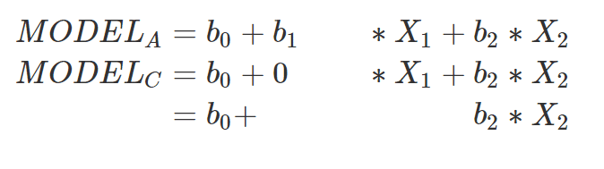

Folgende Modelle erhalten wir (siehe Bild unten). Wie du siehst, sind die Werte bei *b~0~* und *b~2~* zwischen beiden Modellen unterschiedlich. Dies ist dadurch zu erklären, dass wir die Parameter für jedes Modell eigens berechnen. Die Zahlen ändern sich allerdings nur minimal, da wir orthogonale Kontraste berechnet haben.

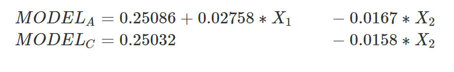

#### Berechnung der Kennwerte

Nun, da wir die Modelle berechnet haben, können wir die Kennwerte berechnen und berichten:

+--------------------------------------------------+----------+----------+----------+---------+---------+-----------+
| **Source**\\                                     | ***SS*** | ***df*** | ***MS*** | ***F*** | ***p*** | ***PRE*** |
+==================================================+==========+==========+==========+=========+=========+===========+
| Reduktion der Fehler durch das erweiterte Modell | 0.013    | 1        | 0.014    | 0.61    | 0.436   | 0.008\    |
+--------------------------------------------------+----------+----------+----------+---------+---------+-----------+
| Error                                            | 1.770    | 80       | 0.022    | \-      | \-      | \-        |
+--------------------------------------------------+----------+----------+----------+---------+---------+-----------+
| Total Error                                      | 1.784\   | 81       | \-       | \-      | \-      | \-        |
+--------------------------------------------------+----------+----------+----------+---------+---------+-----------+

Erneut findest du anbei das R-Skript, mit denen ich diese Kennwerte berechnet habe:

TODO: Einfügen Datei morehead_spezifischer_test.R

Wir erhalten erneut ein nicht-signifikantes Ergebnis. Dies bedeutet, dass wir weiter davon ausgehen, dass Studierende, die per Hand bei einem Vortrag mitschreiben sich an genauso viel aus dem Vortrag erinnern wie Studierende, die mit einem technischen Gerät mitschreiben.

Zum Schluss müssen wir noch eine Korrektur vornehmen: Wir wollten wissen, ob Studierende, die per Hand mitschreiben *mehr* aus einem Vortrag lernen als Studierende, die mit einem technischen Gerät mitschreiben. Der *F*-Test testet allredings ungerichtet, weshalb wir in unserem Fall den *p*-Wert halbieren müssen. Das können wir, da die Mittelwerte der Gruppen hypothesenkonform sind. Das heißt, die Differenz des Mittelwerts der Studierenden, die per Hand mitgeschrieben haben ist um 0.02758 größer als der Studierenden, die mit einem technischen Gerät mitgeschrieben haben. Der korrekte *p*-Wert lautet daher *p* = .218.

### Zusammenfassung

Wir haben in diesem Modul gezeigt, wie und was wir mit einer einfaktoriellen Varianzanalyse berechnen. Dabei haben wir gesehen, dass der *t*-Test für unabhängige Stichproben und die einfaktorielle Varianzanalyse sich nur in der Anzahl der Parameter im erweiterten Modell unterscheiden. Beim *t*-Test für unabhängige Stichproben hat das erweiterte Modell zwei Parameter und maximal einen Kontrast. Bei einer einfaktoriellen Varianzanalyse gibt es unendliche viele Möglichkeiten in der Anzahl der Parameter. Beide Tests verwenden allerdings die gleiche Prozedur, welche wir bereits kennen.

## Post-Hoc Analysen

In den letzten beiden Submodulen haben wir Hypothesen getestet. Das heißt, wir hatten Annahmen, die wir statistisch geprüft haben. Das Gegenteil dieser Vorgehensweise sind sogenannte Post-Hoc Tests oder explorative Tests. Manchmal haben wir keine konkrete Hypothese und möchten alle Gruppenvergleiche in einer einfaktoriellen Varianzanalyse testen. Dies schafft allerdings das Problem der Alpha-Fehler Kumulierung.

### Alpha-Fehler Kumulierung

Wir wissen aus dem Modul zum statistischen Hypothesentesten, dass wir bei einem Alpha-Niveau von 5% in 5% der Fälle die Nullhypothese fälschlicherweise ablehnen. Beispielsweise könnte es sein, dass Studierende, die per Hand mitschreiben tatsächlich mehr aus einem Vortrag lernen als Studierende, die mit einem technischen Gerät mitschreiben. Je mehr Tests wir allerdings rechnen, desto höher wird die Wahrscheinlichkeit, dass wir einen Alpha-Fehler erhalten. Wir können diese Wahrscheinlichkeit berechnen. Im folgenden siehst du, wie diese sogenannte Family-Wise-Error-Rate berechnet wird:

\

α steht für das Alpha-Niveau und *c* für die Anzahl der Tests. Nehmen wir an, du hast zu Beginn deiner Studie keine Hypothesen und vergleichst 3 Gruppen nach ihrer Signifikanz. Beispielsweise jene drei Gruppen aus unserem letzten Submodul (Mitschrift per Hand, Laptop und E-Writer). In diesem Fall läge die Wahrscheinlichkeit für einen Alpha-Fehler (sofern die Nullhypothese stimmt) bei 14.3%. Bei 10 Tests wiederum läge diese Wahrscheinlichkeit bei 40%. Bei 20 Tests wiederum bei 64%. Grafisch dargestellt siehst du, dass bei 80 Tests die Chance für einen Alpha-Fehler bei fast 100% liegt.

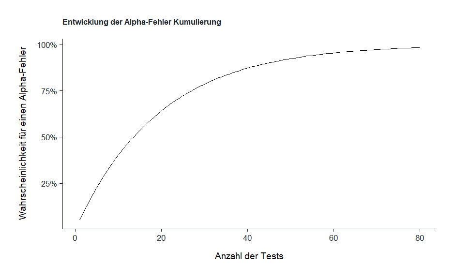

### **Bedeutung der Alpha-Fehler Kumulierung für die statistische Praxis**

Stell dir folgenden ethisch-fragwürdigen Forscher mit dem Namen Professor Müller vor: Professur Müller möchte auf jeden Fall zeigen, dass er signifikante Ergebnisse in einem Experiment gefunden hast. Zwar weißt du mittlerweile, dass die Signifikanz nicht mit der praktischen Bedeutsamkeit gleichzusetzen ist, allerdings glaubt Professor Müller dennoch, signifikanz bedeutet wichtig. Herr Müller hatte eine Hypothese, die er anhand von 5 Gruppen und einer einfaktoriellen Varianzanalyse getestet hat. Er erhielt ein nicht-signifikantes Ergebnis und war enttäuscht. Er will jedoch etwas "rausbekommen". Daher vergleicht er einfach alle Mittelwertsvergleiche durch *t*-Tests. Bei fünf Tests liegt die Wahrscheinlichkeit für einen Alpha-Fehler bei 22,6%. Tatsächlich findet er ein signifikantes Ergebnis und schreibt seinen Artikel so um als hätte er von Beginn an, an diesen Mittelwertsunterschied geglaubt.

Dieses Verfahren wird auch als [Harking ](https://journals.sagepub.com/doi/pdf/10.1207/s15327957pspr0203_4)bezeichnet (Hypothesizing after the results are known). Harking geschieht, wenn Wissenschaftler\*innen explorative Analysen als Hypothesen ausgeben, die sie von Anfang an aufgestellt haben. Harking ist problematisch, da es dazu führt, dass mehr Alpha-Fehler als Effekte berichtet werden als wenn Wissenschaftler\*innen bei ihren Hypothesen bleiben, die sie vor einem Experiment aufgestellt haben. Und eine Methode hierfür ist, bei einer einfaktoriellen Varianzanalyse alle Gruppenvergleiche zu rechnen und nur die signifikanten zu berichten. In anderen Worten, eine explorative Analyse wird als Hypothese ausgegeben (siehe auch [Gernsbacher, 2018)](https://journals.sagepub.com/doi/abs/10.1177/2515245918754485). Wir sollten daher bei explorativen Analysen immer sogenannte Post-Hoc Tests (explorative Analysen) die Alpha-Fehler-Kumulierung kontrollieren. Es gibt viele Tests, die uns das ermöglichen. Wir lernen an dieser Stelle die bekannteste kennen: Die Bonferroni-Korrektur.

### Bonferroni-Korrektur

Die einfachste Methode, um sicher zu stellen, dass sich die Alpha-Fehler nicht mit der Anzahl der Tests kumulieren ist die Bonferroni-Korrektur. Bei der Bonferroni-Korrektur wird der Alpha-Fehler durch die Anzahl der Tests geteilt:


Wenn du beispielsweise drei Gruppenvergleiche explorativ testest, teilst du das Alpha-Niveau von 0.05 durch 3. Dadurch entscheidest du dich für ein signifikantes Ereignis nur dann, wenn *p* für jeden Test unter den Wert 0.0167 fällt. 

Die Bonferroni-Korrektur hat den Nachteil, dass sie sehr konservativ ist und zu einer geringeren Power führt (siehe [VanderWeele & Mathur, 2019](https://academic.oup.com/aje/article/188/3/617/5193218)). Falls also ein Effekt vorliegt, verringert sich durch dieses Korrekturverfahren die Wahrscheinlichkeit, dass wir diesen Effekt finden. Dies ist dadurch zu erklären, dass wir die Nullhypothese erst ablehnen, wenn der empirische *p*-Wert unter dem korrigiertem kritischen *p*-Wert fällt.

In Jamovi wird die Bonferroni-Korrektur nicht dadurch angegeben, dass der kritische *p*-Wert adjustiert wird, sondern, indem der empirische *p*-Wert angepasst wird. Dies geschieht, indem der empirische *p*-Wert mal der Anzahl der Tests gerechnet wird. Erhält man aus drei Tests beispielsweise die *p*-Werte .03, .01 und .02, dann werden diese jeweils mal drei gerechnet: .09, .03, .06.

### Zusammenfassung und weitere Korrekturmethoden

Es gibt eine ganze Reihe weiterer Korrekturverfahren, die wir in diesem Seminar nicht beantworten werden. Mehr Informationen zu diesen Testverfahren kannst du bei [Shaffer (1995)](https://www.annualreviews.org/doi/pdf/10.1146/annurev.ps.46.020195.003021) finden. Für unsere Zwecke ist es wichtig zu wissen, dass der Alpha-Fehler bei einer Reihe explorativer Tests kontrolliert werden sollte. Ansonsten läuft man Gefahr, zu oft Alpha-Fehler zu machen.

## Berechnung in Jamovi

In den folgenden Videos erkläre ich dir, wie die drei Tests dieses Moduls in Jamovi berechnet werden.

### t-Test für unabhängige Stichproben

TODO: Einfügen Video

### einfaktorielle Varianzanalyse

TODO: Einfügen Video

### Kontrastanalyse

TODO: Einfügen Video

TODO: Stand vorher schon drin:

-   Welch-Test nicht vergessen

<!--chapter:end:07-einfaktorielle_varianzanalyse.Rmd-->

# tatusMehrfaktorielle Varianzanalyse

## Einführung

Stell dir folgendes Szenario vor: Du hast kürzlich einen Artikel über den [Expertise-Reversal Effect ](https://www.igi-global.com/chapter/expertise-reversal-effect/25732)gelesen. In diesem Artikel wird erläutert, dass manche Lernstrategien für Menschen mit geringem Vorwissen  in einem Thema effektiver sind als für Menschen mit hohem Vorwissen. Eine Woche später sitzt du in einem Seminar über Lehrstrategien. Deine Dozentin stellt dir drei verschiedene Lehrstrategien vor. Problembasiertes Lernen, projektbasiertes Lernen und die direkte Instruktion. Beim Problembasiertes Lernen werden Lernende angeleitet, Probleme in Kleingruppen gemeinsam zu lösen. Das Lehrarrangement ist so gestaltet, dass die Lehrkraft minimal instruiiert und den Lernenden Ressourcen an die Hand gibt, mit denen sie die Probleme selbstständig lösen können ([Hmelo-Silver, 2004](https://link.springer.com/article/10.1023/B:EDPR.0000034022.16470.f3)). Projektbasiertes Lernen hat einen ähnlichen Ansatz, nur dass dort anstatt Probleme gelöst, Projekt entwickelt werden ([Barron et al., 1998](https://www.tandfonline.com/doi/pdf/10.1080/10508406.1998.9672056)). Bei der direkten Instruktion ist das Lehrarrangement sehr stark strukturiert, indem die Lehrkraft Kurzvorträge hält, den Lernenden geeignete Übungen und Feedback über diese Übungen gibt ([Magliaro et al., 2005](https://idp.springer.com/authorize/casa?redirect_uri=https://link.springer.com/content/pdf/10.1007/BF02504684.pdf&casa_token=ncmTmVyuUXoAAAAA:kCuPDmzPRbwu9gxX6xBb1rZtMyB_PprxXVmmTyiYPeRgGavyrsZKjBQ6eHmqLxU9wkdh13-8gemuYf30kQ)). Nach dem Seminar überlegst du, ob die Idee des Expertise-Reversal Effects und der drei Lehrstrategien nicht miteinander kombiniert werden könnte. Du glaubst, dass Noviz\*innen, also Menschen mit geringem Vorwissen in einem Thema, mehr von der direkten Instruktion und weniger von projekt- und problemorientierten Lernstrategien profitieren als Expert\*innen. Der Grund für diese Hypothese ist, dass projekt- und problembasiertes Lernen die Noviz\*innen überfordern könnte, da diese Lernenden nicht genug Vorwissen haben, um komplexen Probleme/Projekte zu lösen. Die direkte Instruktion sollte allerdings für Noviz\*innen hilfreich sein, da sie sozusagen "an die Hand genommen" werden und dadurch ein gutes Verständnis des Lernstoffs aufbauen können. Du entscheidest dich, diese Hypothese in deiner Bachelorarbeit zu testen.

> **Die Fragestellung dieses Moduls lautet: Ist direkte Instruktion effektiver als problem- bzw. projektbasiertes Lernen und ist dieser Effekt abhängig vom Vorwissen der Lernenden?**

### Mehrfaktorielle Varianzanalyse

Mit den bisherigen Testverfahren kannst du diese Hypothese allerdings noch nicht testen. Bisher haben wir lediglich die einfaktorielle Varianzanalyse kennen gelernt, mit der wir Gruppenunterschiede eines *Faktors* prüfen können. Ein Faktor ist eine kategoriale Variable, welche verschiedene Ausprägungen hat. Beispielsweise hatten wir im letzten Modul den Faktor Lernstrategie (Concept Map vs. Retrieval Practice) oder Mitschrift (per Hand, per Laptop, per E-Writer) in der einfaktoriellen Varianzanalyse verwendet. Und daher kommt auch der Begriff ein*faktoriell.* Bei der einfaktoriellen Varianzanalyse verwenden wir nur einen Faktor. Um allerdings deine Hypothese zu prüfen, benötigen wir einen weiteren Faktor (Lehrstrategie und Expertise). In diesem Modul werden wir daher lernen, wie eine mehrfaktorielle Varianzanalyse berechnet wird, indem wir deine Hypothese testen.

### Datensatz

In deiner Bachelorarbeit bist du folgendermaßen vorgegangen: Du hast zunächst Versuchspersonen akquiriert, welche ein unterschiedliches Vorwissen zum Thema natürliche Selektion hatten. Hierzu hast du fortgeschrittene Biologiestudierende (mindestens 5. Fachsemester) und Studienbeginnende des Fachs Biologie rekrutiert. Insgesamt konntest du 76 Personen für dein Experiment gewinnen. Alle Versuchspersonen kamen für zwei Tage in dein Labor. Jede Versuchsperson wurde randomisiert in die drei Lehrgruppen eingeteilt. Zu Beginn des Experiments wurde das Vorwissen der Versuchspersonen zum Thema natürliche Selektion erhoben. Anschließend nahmen die Versuchspersonen pro Tag für vier Stunden an einer Simulation teil, bei der sie in ihrem Lehrsetting unterrichtet wurden. Versuchspersonen in der projekt- und problemorientierten Lernumgebung interagierten in dieser Simulation mit digitalen Kommiliton\*innen, mit welchen sie das Projekt umsetzten bzw. das Problem lösten. Versuchspersonen mit der direkten Instruktion erhielten eine Lernumgebung mit den gleichen Inhalten, allerdings wurden sie von einer digitalen Lehrkraft unterrichtet. Eine Woche nach dem letzten Lehrtag kamen die Versuchspersonen erneut in das Labor und ihr Wissen über natürliche Selektion wurde erneut geprüft.

Den Datensatz für dieses Modul findest du hier:

TODO: Einfügen Datei expert_study.csv

Der Datensatz umfasst folgende sieben Variablen. Wir interessieren uns in diesem Modul für die Variablen expertise, method und improvement:

-   **id**: Die ID der Versuchsperson

-   **expertise**: Ein Faktor, welcher kodiert, ob die Person eine Expertin / ein Experte oder eine Novizin / ein Novize ist.

-   **age**: Das Alter der Person

-   **method**: Ein Faktor, welcher die Lehrstrategie kodiert, welche die Person bekommen hat (direkte Instruktion, problembasiertes Lernen, projektbasiertes Lernen)

-   **test_prior**: Das Vorwissen der Testperson zum Thema natürliche Selektion

-   **test_delay**: Das Wissen zum Thema natürliche Selektion der Person eine Woche nach dem Ende der Lehrsituation

-   **improvement**: Die Differenz zwischen dem Wissen am Ende des Experiments (test_delay) und dem Wissen vor dem Experiment (test_prior). Höhere Werte bedeuten, dass die Person mehr Wissen erworben hat.

## Mehrfaktorielle Versuchsdesigns

Hörst du Wissenschaftler\*innen zu, sprechen sie manchmal von einem *2x2* (zwei mal zwei), *2x3* oder auch einem *3x3* Design. Was sie damit meinen ist, dass das Versuchsdesign mehrere Faktoren beeinhaltet, die verschiedene Ausprägungen haben.

### Einfaktorielle Designs

Versuchen wir uns dieser Idee anzunäheren und beginnen wir mit einem *2 Design*. In diesem Design gibt es nur einen Faktor, welcher allerdings verschiedene Ausprägungen hat. Zum Beispiel haben wir im letzten Modul getestet, ob Studierende, die sich testen ( (Retrieval Practice), mehr konzeptuelles Wissen erlernen als Studierende, die eine Concept Map erstellen:

| **Faktor Lernstrategie:** | Retrieval Practice | Concept Map |
|---------------------------|:------------------:|:-----------:|

Ein solches Design nennen wir einfaktorielles Design. Wir könnten auch sagen, es ist ein *2 Design*. Im letzten Modul haben wir ebenso die Hypothese getestet, ob sich Studierende, die per Hand mitschreiben, sich mehr an die Inhalte aus einem Vortrag erinnern als Studierende, die mit einem Laptop oder E-Writer mitschreiben:

+------------------------+----------+-------------+--------------+
| **Faktor Mitschrift:** | per Hand | per Laptop\ | per E-Writer |
+------------------------+----------+-------------+--------------+

+========================+:========:+:===========:+==============+ +------------------------+----------+-------------+--------------+

Dieses Design könnn wir als *3 Design* bezeichnen, da der eine Faktor drei Ausprägungen hat.

### Zweifaktorielles Design

Nun, in unserer Fragestellung haben wir zwei Faktoren, das Vorwissen und die Lehrstrategie. Daher sprechen wir von einem zweifaktoriellen Design. Grafisch können wir diese Faktoren wie folgt darstellen:

+---------+---------------------------+---------------------------+---------------------+
| **-**   | projektbasiertes Lernen\\ | problembasiertes Lernen\\ | direkte Instruktion |
+=========+:=========================:+:=========================:+:===================:+
| Experte | \-                        | \-                        | \-                  |
+---------+---------------------------+---------------------------+---------------------+
| Novize\ | \-                        | \-                        | \-                  |
+---------+---------------------------+---------------------------+---------------------+

Ein solches Design nennt man *3x2 Design*, da es zwei Faktoren umfasst und diese Faktoren drei und zwei Ausprägungen haben. Der Faktor Lehrsetting hat drei Ausprägungen (projektbasiertes Lernen, problembasiertes Lernen, direkte Instruktion) und der Faktor Vorwissen hat zwei Ausprägungen (Experte, Novize). 

Ein weiteres zweifaktorielles Design könnte wie folgt aussehen:

+-------------------------+------------------+------------+
| **-**                   | Schweinebraten\\ | Eiscreme\\ |
+=========================+:================:+:==========:+
| Schokoladensauße\       | \-               | \-         |
+-------------------------+------------------+------------+
| keine Schokoladensauße\ | \-               | \-         |
+-------------------------+------------------+------------+

Ein solches Design nennt man *2x2 Design*. Der erste Faktor Essen kodiert, ob Versuchspersonen einen Schweinebraten oder eine Eiscreme essen. Der zweite Faktor Sauße kodiert, ob Versuchspersonen auf diesem Essen Schokoladensauße erhalten oder nicht. Mit einem solchen Design könnte man beispielsweise testen, ob der positive Effekt von Schokoladensauße auf Essen nur für Eiscreme und nicht für Schweinebraten gilt. Man würde erwarten, dass Schokosauße auf Schweinebraten nicht schmeckt, während Schokosauße auf Eiscreme durchaus lecker schmeckt.

### Dreifaktorielles Design

Wir könnten diese Idee unendlich weiter spinnen. Beispielsweise in einem dreifaktoriellen Design. Ein *2x3x2 Design* beispielsweise könnte folgendermaßen aussehen: Der erste Faktor kodiert, ob eine Person schon einmal einen Workshop zum Thema Moderation teilgenommen hat oder nicht (2 Ausprägungen). Der zweite Faktor kodiert, welches Training zum Thema Moderation eine Person bekommt (3 Ausprägungen). Der dritte Faktor kodiert, ob der Workshop in zwei Tage aufgeteilt wurde oder nicht (2 Ausprägungen). Ein solches Design ist durchaus komplexer als ein zwei faktorielles Design. Man könnte damit beispielsweise testen, ob die zeitliche Verteilung eines Workshops nur effektiv für Menschen ist, welche ein bestimmtes Training bekommen und gleichzeitig nur für Menschen effektiv ist, die bereits an einem Training teilgenommen haben. Wir werden in diesem Modul auf ein solches Design verzichten und ein klassisches zweifaktorielles Design berechnen.

### Allgemeines zu mehrfaktoriellen Designs

In jedem mehrfaktoriellen Design werden Versuchspersonen in der Regel in Gruppen eingeteilt. Beispielsweise werden bei einem 2x3 Design, Versuchspersonen in sechs Gruppen eingeteilt. Dies gilt allerdings nur, wenn die Versuchspersonen nicht mehrmals getestet werden, sprich wenn es kein [Within-Design](https://www.nngroup.com/articles/between-within-subjects/#:~:text=Between%2Dsubjects%20(or%20between%2D,%2C%20all%20the%20user%20interfaces).) ist. In diesem Kurs testen wir nur Hypothesen, in denen Personen nicht mehrmals getestet wurden, sondern in denen Personen in Gruppen aufgeteilt werden. Ein solches Design nennt man Between-Subjects Design. Genauer würden wir sagen, dass wir in diesem Modul ein *2x3 Between-Subjects Design* testen. Die Anzahl der Gruppen in jedem Between-Subjects Design können wir berechnen, indem wir die Anzahl der Ausprägungen pro Faktor multiplizieren:

| **Design**   | **Anzahl Gruppen** |
|--------------|--------------------|
| 3 Design     | 3                  |
| 2x2 Design   | 4                  |
| 2x3 Design   | 6                  |
| 3x3 Design   | 9                  |
| 2x3x2 Design | 12                 |

Für unser Experiment musst du daher die Versuchspersonen in sechs Gruppen aufteilen. Im nächsten Schritt müssen wir diese Gruppen in numerische Werte überführen und eine Kontrastkodierung bestimmten, um die statistischen Modelle aufzustellen.

## Kontrastkodierung

Das Ziel dieses Submoduls ist es, unsere Alternativhypothese in ein statistisches Modell zu überführen. Hierfür müssen wir zunächst eine Kontrastkodierung wählen, durch die Parameter unseres Modells die Gruppenunterschiede kodieren, welche wir später testen möchten. Beispielsweise werden wir in diesem Modul verstehen, wie die Kontrastkodierung aussehen muss, um zu testen, ob der Effekt der direkten Instruktion im Vergleich zu den anderen beiden Lehrsettings zwischen Expert\*innen und Noviz\*innen unterschiedlich ist. Man nennt diese Methode Interaktion. Beginnen wir mit der Kontrastkodierung, die wir schon kennen.

### Konstrastkodierung Lehrstrategie

In deiner Hypothese gehst du davon aus, dass die direkte Instruktion lernwirksamer ist als problem- bzw. projektbasiertes Lernen. Da der Faktor Lehrstrategie drei Ausprägungen umfasst, benötigst du *k - 1 = 3 - 1 = 2* Prädiktoren, um diesen Faktor im erweiterten Modell zu kodieren. Mit folgender Kontrastkodierung kannst du diese erste Hypothese später testen:

| **Ausprägungen des Faktors** | ***X~1~*** | ***X~2~*** |
|------------------------------|------------|------------|
| direkte Instruktion          | 2 /3       | 0          |
| problembasiertes Lernen      | -1 / 3     | 1 / 2      |
| projektbasiertes Lernen      | -1 / 3     | -1 / 2     |

Du siehst, dass wir für diesen Faktor eine Helmert-Kodierung verwendet haben. Durch die Helmert-Kodierung wird der Parameter *b~1~* den Mittelwertsunterschied zwischen der Gruppe der direkten Instruktion und den anderen beiden Gruppen kodieren. Der Parameter *b~2~* wird den Mittelwertsunterschied zwischen der Gruppe, welche problembasiertes Lernen und der Gruppe, die projektbasiertes Lernen erhält, kodieren.

### Konstrastkodierung Expert\*innen

Weiterhin möchtest du den Mittelwertsunterschied zwischen Expert\*innen und Noviz\*innen kodieren. Da du später wissen möchtest, ob die direkte Instruktion nur für Noviz\*innen und nicht für Expert\*innen wirksam ist, benötigst du eine Kodierung, die den Mittelwertsunterschied von Expert\*innen und Noviz\*innen unterscheidet. Hierfür verwenden wir erneut eine Helmert-Kodierung. Du hast zwei Ausprägungen, daher benötigst du lediglich einen Prädiktor, um diesen Unterschied zu kodieren:

| **Ausprägungen des Faktors** | ***X~3~*** |
|------------------------------|------------|
| Expert\*innen                | 1 / 2      |
| Noviz\*innen                 | -1 / 2     |

### Kodierung der Interaktion

Nun, deine zentrale Fragestellung ist, ob der positive Effekt der direkten Instruktion für Noviz\*innen zu finden ist und bei Expert\*innen ausbleibt. Mit der bisherigen Kontrastkodierung würden wir den einzelnen Gruppen folgende Kontrastgewichte pro Prädiktor zuordnen:

+-----------------------------------------+-----------------------------------------+-----------------------------------------+---------------------------------------+
| **Gruppe**                              | ***X~1~***\                             | ***X~2~***\                             | ***X~3~*****\                         |
|                                         | ~***(direkt. Inst. vs. prob/proj)***~\\ | ~***(problem- vs. projektbasiert)***~\\ | ~*(Expert\*innen vs. Noviz\*innen)*~\ |
|                                         |                                         |                                         | **                                    |
+=========================================+=========================================+=========================================+=======================================+
| Expert\*innen - direkte Instruktion\    | 2 / 3                                   | 0                                       | 1 /2\                                 |
+-----------------------------------------+-----------------------------------------+-----------------------------------------+---------------------------------------+
| Expert\*innen - problembasiertes Leren\ | -1 / 3                                  | 1 / 2                                   | 1 /2                                  |
+-----------------------------------------+-----------------------------------------+-----------------------------------------+---------------------------------------+
| Expert\*innen - projektbasiertes Lernen | -1 / 3                                  | \- 1 / 2                                | 1 /2                                  |
+-----------------------------------------+-----------------------------------------+-----------------------------------------+---------------------------------------+
| Noviz\*innen - direkte Instruktion\     | 2 /3\                                   | 0                                       | -1 / 2                                |
+-----------------------------------------+-----------------------------------------+-----------------------------------------+---------------------------------------+
| Noviz\*innen - problembasiertes Leren\  | -1 / 3\                                 | 1 / 2\                                  | -1 / 2\                               |
+-----------------------------------------+-----------------------------------------+-----------------------------------------+---------------------------------------+
| Noviz\*innen - projektbasiertes Lernen\ | -1 / 3\                                 | \- 1 / 2\                               | -1 / 2                                |
+-----------------------------------------+-----------------------------------------+-----------------------------------------+---------------------------------------+

Bei einer Expertin beispielsweise, die die direkte Instruktion bekommt, würden wir für *X~1~ 2/3*, für *X~2~ 0* und für *X~3~ 1/2* einsetzen. Du siehst anhand der Tabelle ebenso, welche Hypothese wir mit jedem der drei Prädiktoren testen können. Mit Hilfe von *X~1~* beispielsweise können wir testen, ob Versuchspersonen, die direkte Instruktion bekommen, besser abschneiden als Versuchspersonen, die die anderen beiden Strategien erhalten. Ebenso kannst du erkennen, dass wir mit Hilfe von *X~3~* kodieren können, ob sich der Wissenserwerb zwischen den Expert\*innen und den Noviz\*innen unterscheidet. Nun, deine Fragestellung ist allerdings, ob der Effekt, den wir mit *X~1~* kodieren, abhängig vom Effekt ist, den wir mit *X~3~* kodieren? Wir können eine solche *Interaktion* testen, indem wir die Kodierungen der einzelnen Prädiktoren miteinander multiplizieren:

+-----------------------------------------+-----------------------------------------+-----------------------------------------+---------------------------------------+-------------------------------+------------------------------+
| **Gruppe**                              | ***X~1~***\                             | ***X~2~***\                             | ***X~3~*****\                         | ***X~4~*****\                 | ***X~5~*****\                |
|                                         | ~***(direkt. Inst. vs. prob/proj)***~\\ | ~***(problem- vs. projektbasiert)***~\\ | ~*(Expert\*innen vs. Noviz\*innen)*~\ | ~*(X1 abhängig von X3)*~\     | ~*(X2 abhängig von X3)*~**   |
|                                         |                                         |                                         | **                                    | **                            |                              |
+=========================================+=========================================+=========================================+=======================================+===============================+==============================+
| Expert\*innen - direkte Instruktion\    | 2 / 3                                   | 0                                       | 1 /2\                                 | (2 / 3) \* (1 / 2) = 0.33\    | 0 \* (1 / 2) = 0\            |
+-----------------------------------------+-----------------------------------------+-----------------------------------------+---------------------------------------+-------------------------------+------------------------------+
| Expert\*innen - problembasiertes Leren\ | -1 / 3                                  | 1 / 2                                   | 1 /2                                  | (-1 / 3) \* (1 / 2) = -0.167\ | (1 /2 ) \* (1 / 2) = 0.25    |
+-----------------------------------------+-----------------------------------------+-----------------------------------------+---------------------------------------+-------------------------------+------------------------------+
| Expert\*innen - projektbasiertes Lernen | -1 / 3                                  | \- 1 / 2                                | 1 /2                                  | (-1 / 3) \* (-1 / 2) = 0.167\ | (-1 /2 ) \* (1 / 2) = -0.25\ |
+-----------------------------------------+-----------------------------------------+-----------------------------------------+---------------------------------------+-------------------------------+------------------------------+
| Noviz\*innen - direkte Instruktion\     | 2 /3\                                   | 0                                       | -1 / 2                                | (2 / 3) \* 0 = 0\             | 0 \* (-1 / 2) = 0\           |
+-----------------------------------------+-----------------------------------------+-----------------------------------------+---------------------------------------+-------------------------------+------------------------------+
| Noviz\*innen - problembasiertes Leren\  | -1 / 3\                                 | 1 / 2\                                  | -1 / 2\                               | (-1 / 3) \* (-1 / 2) = 0.167\ | (1 /2 ) \* (-1 / 2) = -0.25\ |
+-----------------------------------------+-----------------------------------------+-----------------------------------------+---------------------------------------+-------------------------------+------------------------------+
| Noviz\*innen - projektbasiertes Lernen\ | -1 / 3\                                 | \- 1 / 2\                               | -1 / 2\                               | (-1 / 3) \* (-1 / 2) = 0.167\ | (-1 /2 ) \* (-1 / 2) = 0.25  |
+-----------------------------------------+-----------------------------------------+-----------------------------------------+---------------------------------------+-------------------------------+------------------------------+

Nun, diese Tabelle ist auf den ersten Blick vermutlich verwirrend. Was haben wir hier gemacht? Formal haben wir nichts anderes gemacht, als die Kodierungen für die Prädiktoren zwischen den Gruppen miteinander multipliziert. Man nennt ein solches Verfahren eine Interaktion. Genauer haben wir *X~1~* mit *X~3~* und *X~2~* mit *X~3~* multipliziert. Da wir fünf Prädiktoren haben, ergibt sich daraus folgendes erweitertes Modell:


Die Parameter in diesem Modell haben nun folgende Bedeutung:

-   *b~0~*: Der Mittelwert der Mittelwert der aller Gruppen (siehe sechs Gruppen in der oberen Tabelle)\*\

    -   

-   *b~1~*: Der Mittelwertsunterschied zwischen den Gruppen, welche die direkte Instruktion erhalten haben, und den anderen beiden Lehrstrategiegruppen.

-   *b~2~*: Der Mittelwertsunterschied zwischen den Gruppen, welche problembasiertes Lernen erhalten haben, und den Gruppen, welche projektbasiertes Lernen erhalten haben.

-   *b~3~*: Der Mittelwertsunterschied zwischen den Expertengruppen und den Novizengruppen

-   *b~4~*: Differenz der Mittelwertsunterschiede der direkten Instruktion und den anderen beiden Lehrstrategien zwischen den Expert\*innen und den Noviz\*innen? In anderen Worten: Ist der Mittelwertsunterschied, der in *b~0~* kodiert ist, zwischen Expert\*innen und Noviz\*innen gleich? Oder, profitieren Noviz\*innen mehr von der direkten Instruktion als Expert\*innen ?

-   *b~5~*: Differenz der Mittelwertsunterschiede des problembasierten Lernens und des projektbasierten Lernens zwischen den Expert\*innen und den Noviz\*innen? In anderen Worten: Ist der Mittelwertsunterschied, der in *b~1~* kodiert ist zwischen Expert\*innen und Noviz\*innen gleich? Oder, profitieren Noviz\*innen mehr von problembasiertem Lernen als von projektbasiertem Lernen als Expert\*innen?

Insbesondere die letzten beiden Parameter sind nun interessant. Um diese besser zu verstehen, schauen wir uns ein Liniendiagramm der Mittelwert der sechs Gruppen an:

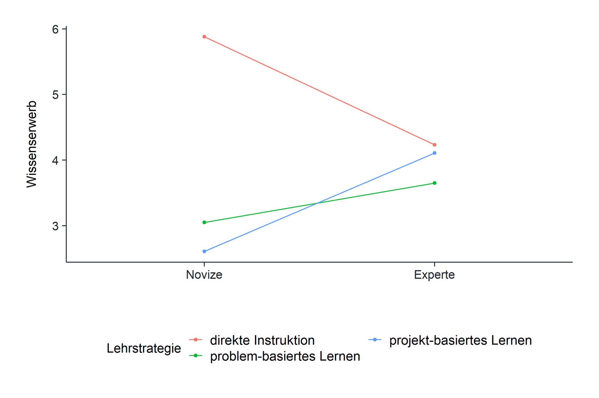

Und schauen wir *b~4~ genauer an~.~* Dieser Parameter zeigt die Differenz zwischen dem Mittelwertsunterschied der direkten Instruktion und den anderen beiden Lehrstrategien bei den Noviz\*innen und dem Mittelwertsunterschied der direkten Instruktion und den anderen beiden Lehrstrategien bei den Expert\*innen an. In der Grafik erkennst du bereits, dass Noviz\*innen mehr von der direkten Instruktion profitiert haben als von den anderen beiden Lehrstrategien. Bei den Expert\*innen war dies nicht der Fall, da die Mittelwerte aller Lehrstrategiegruppen sehr nah beieinander liegen. Wir können dies noch genauer zeigen, indem wir nur die beiden Lehrstrategien betrachten:


Schätzen wir einmal die Mittelwertsunterschiede zwischen beiden Gruppen. Bei den Noviz\*innen lag der Wissenserwerb derjenigen, welche die direkte Instruktion bekommen haben, bei etwa 5.9. Der Mittelwert der anderen beiden Lehrstrategien der Noviz\*innen lag bei etwa 2.8. Bei den Expert\*innen lag der Wissenserwerb derjenigen, welche die direkte Instruktion bekommen haben, bei etwa 4.2. Der Mittelwert der anderen beiden Lehrstrategien der Expert\*innen lag bei etwa 3.9. Berechnen wir die Differenz dieser Werte zwischen den beiden Gruppen:

+---------------+-------------------------+-------------------------------+-----------------+
| **-**         | **direkte Instruktion** | **keine direkte Instruktion** | **Differenz**\\ |
+===============+=========================+===============================+=================+
| Noviz\*innen  | 5.9                     | 2.8                           | 3.1             |
+---------------+-------------------------+-------------------------------+-----------------+
| Expert\*innen | 4.2                     | 3.9                           | 0.3             |
+---------------+-------------------------+-------------------------------+-----------------+
| Differenz\    | 5.9 - 4.2 = 1.9         | 2.8 - 3.9 = -1.1              | **2.8**         |
+---------------+-------------------------+-------------------------------+-----------------+

Uns interessiert insbesondere die grüne Zelle. Dies ist der Mittelwertsunterschied der beiden Mittelwertsunterschiede voneinander. Die direkte Instruktion bei den Noviz\*innen im Vergleich zu den anderen beiden Lehrstrategien war demnach um 2.8 Punkte höher als bei den Expert\*innen. Und genau dies drückt der Parameter *b~4~* nun durch unsere Interaktion aus. 

Das erweiterte Modell, welches sich aus unserer Kontrastkodierung ergibt, sieht wie folgt aus:


Wie du siehst, liegt *b~4~* bei 2.70. Der kleine Unterschied von 2.8 zu 2.7 liegt an Rundungsfehlern. Der Parameter der anderen Interaktion liegt bei 0.90. Mit diesem Modell sind wir nun in der Lage, folgende Hypothesen zu testen, indem wir einzelne Parameter auf 0 schalten:

-   *b~1~* (1.703) auf 0: Ist die direkte Instruktion lernförderlicher als die anderen beiden Lehrstrategien?

-   *b~2~* (-0.008) auf 0: Ist problembasiertes Lernen lernförderlicher als projektbasiertes Lernen?

-   *b~3~* (-0.15) auf 0: Ist der Wissenserwerb bei Expert\*innen höher/unterschiedlich als bei Noviz\*innen?

-   *b~4~* (2.70) auf 0: Ist der Effekt der direkten Instruktion bei den Noviz\*innen größer/unterschiedlich als bei den Expert\*innen?

-   *b~5~* (0.90) auf 0: Ist der Effekt des problembasierten Lernens gegenüber dem projektbasierten Lernen bei den Noviz\*innen größer/unterschiedlich als bei den Expert\*innen?

Wir werden im folgenden einzelne dieser Parameter auf 0 schalten und demnach verschiede Hypothesen testen. Dabei werden wir sowohl Haupteffekte, Interaktionen, Simple Effects als auch Kontraste testen. Bei jedem dieser Verfahren werden wir andere Parameter auf 0 schalten.

### Zusammenfassung

In diesem Submodul haben wir gezeigt, wie man mehrere Faktoren als Konstrastkodierung in ein erweitertes Modell integrieren kann. Dabei haben wir festgestellt, dass wir für jeden einzelnen Faktor die gleiche Kontrastkodierung verwenden können, welche wir im letzten Modul kennen gelernt haben. Ebenso konnten wir zeigen, dass wir durch die Multiplikation der Kontraste sogenannte Interaktionen berechnen können. Interaktionen ermöglichen uns, zu überprüfen, wie unterschiedlich bestimmte Mittelwertsunterschiede zwischen den Ausprägungen eines anderen Faktors sind. Durch dieses Verfahren können wir unseren statistischen Werkzeugkasten erweitern, indem wir spezifischere Hypothesen testen können. Dies werden wir nachfolgend tun.

## Statistisches Hypothesentesten: Haupteffekte

In der mehrfaktoriellen Varianzanalyse wird meist zwischen Haupteffekten und Interaktionen unterschieden. Ein Haupteffekt prüft, ob es Gruppenunterschiede *innerhalb* eines Faktors gibt. In unserem Beispiel haben wir zwei Faktoren (Lehrstrategien und Expertise). Das heißt, wir können zwei Haupteffekte berechnen. Haupteffekte sind demnach von der Logik nichts anderes als die einfaktorielle Varianzanalyse, allerdings in einem Modell, welches mehrere Faktoren umfasst.

### Haupteffekt des Faktors Lehrstrategie

Beginnen wir mit dem ersten Faktor. Im letzten Submodul haben wir das erweiterte Modell aufgestellt, mit Hilfe dessen wir unsere Hypothesen testen können. Nun geht es darum, ein kompaktes Modell zu wählen, welches es uns ermöglicht, diese Hypothesen zu testen und die Wahrscheinlichkeit für den entsprechenden *F*-Wert zu berechnen. Für den Haupteffekt müssen wir immer alle Parameter eines Faktors im kompakten Modell auf 0 setzen. Da wir drei Gruppen des Faktors Lehrstrategie haben, wird dieser Faktor durch zwei Prädiktoren kodiert. Daher müssen wir die Parameter, die die Gruppenunterschiede der Lehrstrategien kodieren, auf 0 setzen:


Durch diese Modelle können wir nun testen, ob es Mittelwertsunterschiede zwischen den drei Lehrstrategiegruppen gibt. Wohlgemerkt sagt uns dieser Test nicht, welche Gruppen sich voneinander unterscheiden. Wir wissen aber, dass wir den Gruppenunterschied zwischen der direkten Instruktion und den anderen beiden Lehrstrategien testen könnten, wenn wir nur *b~1~* auf 0 setzen. Hier sind die Ergebnisse des Hauptfaktors Lehrstrategie:

+-------------------------------------------------+-----------+-------------+----------+---------+---------+-----------+
| **Source**                                      | ***SS***  | ***df***    | ***MS*** | ***F*** | ***p*** | ***PRE*** |
+=================================================+===========+=============+==========+=========+=========+===========+
| Reduktion der Fehler durch das erweiterte Model | 49.68     | 6 - 4 = 2\  | 24.84    | 4.62    | .013    | 0.117     |
+-------------------------------------------------+-----------+-------------+----------+---------+---------+-----------+
| Error                                           | 376.329   | 76 - 6 = 70 | 5.38     | \-      | \-      | \-        |
+-------------------------------------------------+-----------+-------------+----------+---------+---------+-----------+
| Total Error\                                    | 426.0085\ | 76 - 4 = 72 | \-       | \-      | \-      | \-        |
+-------------------------------------------------+-----------+-------------+----------+---------+---------+-----------+

Mehrere Dinge sind hier wichtig. Zunächst sind die Freiheitsgrade der Modelle etwas schwieriger zu berechnen. Das erweiterte Modell hat sechs Parameter und 76 Datenpunkte (Versuchspersonen). Daher können in dieses Modell noch 70 Parameter hinzugefügt werden. Im kompakten Modell sind es zwei Parameter mehr, die hinzufügt werden können, da es zwei Parameter weniger hat als das erweiterte Modell.  *PRE* liegt bei 0.117. Damit sagen wir, dass das erweiterte Modell 11.7% der Fehler des kompakten Modells erklärt (bzw. der Varianz erklärt). Ansonsten erkennen wir, dass es einen signifikanten Effekt gibt. Das heißt, wir lehnen die Annahme ab, dass sich die drei Gruppenmittelwerte nicht voneinander unterscheiden.

Wenn du die Ergebnisse händisch in R nachrechnen möchtest, findest du das Skript hier:

TODO: Einfügen Datei haupteffekt_lehrstrategien.R

### Haupteffekt des Faktors Expertise

Ganz ähnlich können wir vorgehen, um zu überprüfen, ob der Wissenserwerb der Expert\*innen größer war als der Wissenserwerb der Noviz\*innen. In diesem Fall müssen wir nur den Parameter b3 auf 0 setzen, da bei zwei Gruppen ein Prädiktor genügt, um den Gruppenunterschied dieser beiden Gruppen zu kodieren:


Ein *F*-Test mit diesem Modellpaar ergibt folgendes Ergebnis:

+-------------------------------------------------+----------+-------------+----------+---------+---------+-----------+
| **Source**                                      | ***SS*** | ***df***    | ***MS*** | ***F*** | ***p*** | ***PRE*** |
+=================================================+==========+=============+==========+=========+=========+===========+
| Reduktion der Fehler durch das erweiterte Model | 0.43     | 6 - 5 = 1\  | 0.43     | 0.08    | .79     | 0.001     |
+-------------------------------------------------+----------+-------------+----------+---------+---------+-----------+
| Error                                           | 376.329  | 76 - 6 = 70 | 5.38     | \-      | \-      | \-        |
+-------------------------------------------------+----------+-------------+----------+---------+---------+-----------+
| Total Error\                                    | 376.76\  | 76 - 5 = 71 | \-       | \-      | \-      | \-        |
+-------------------------------------------------+----------+-------------+----------+---------+---------+-----------+

Wir finden einen nicht-signifikanten Effekt. Das heißt, wir gehen weiterhin davon aus, dass der Wissenserwerb (unsere abhängige Variable) sich nicht zwischen den Expert\*innen und Noviz\*innen unterscheidet. Der Effekt ist zudem minimal, da das erweiterte Modell nur 0.1% der Varianz im kompakten Modell aufklärt.

Wenn du die Ergebnisse händisch in R nachrechnen möchtest, findest du das Skript hier:

TODO: Einfügen Datei haupteffekt_expertise.R

### Zusammenfassung

In diesem Submodul haben wir die Haupteffekte der mehrfaktoriellen Varianzanalyse berechnet. Wir haben gesehen, dass wir für jeden Faktor einen Haupteffekt berechnen können. Bei einem Haupteffekt werden zudem alle Parameter eines Faktors auf 0 gesetzt. Dies hat zur Folge, dass bei mehr als zwei Gruppen innerhalb eines Faktors keine Aussagen über die spezifischen Mittelwertsunterschiede gemacht werden können. Wir haben zudem heraus gefunden, dass die Annahme direkte Instruktion ist genauso lehrreich wie problem- oder projektbasiertes Lernen unhaltbar ist. Wir haben ebenso heraus gefunden, dass der Wissenszuwachs bei Expert\*innen und Noviz\*innen gleich war. Als nächstes berechnen wir den Interaktionseffekt.

## Statistisches Hypothesentesten: Interaktionseffekt

Fragen wir uns nun, ob der Effekt der Lehrstrategie (zwischen den drei Gruppen) abhängig von der Expertise der Personen ist. Wir werden im Übrigen in diesem Submodul unsere Fragestellung noch nicht zufriedenstellend beantworten können. Dies liegt darin, dass wir in diesem Submodul die Interaktion der beiden Haupteffekte testen. Hierdurch kommen wir zwar der Antwort unserer Fragestellung näher, es ist allerdings nicht die Antwort, welche wir schlussendlich wissen wollen. In zwei Submodulen werden wir eine schlauere Antwort erhalten. Beginnen wir aber mit dem Interaktionseffekt.

Bei einem Interaktionseffekt prüfen wir in der Regel die Interaktion aller Faktoren miteinandern. Im statistischen Modell gesprochen, schalten wir daher alle Interaktionen auf 0:

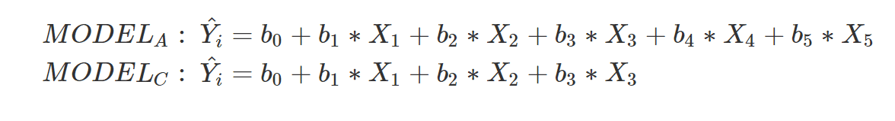

> **Der Interaktionseffekt** beantwortet die Frage, ob ein Effekt von den Ausprägungen eines anderen Faktors abhängig ist.

Wie du erkennst, haben wir die Parameter *b~4~* und *b~5~* auf 0 geschaltet. Mit dem zugehörigen *F*-Test prüfen wir, ob der Haupteffekt der Lehrstrategie abhängig ist von der Expertise der Personen. Wir wissen aber auch, dass der Haupteffekt nur sagt, dass sich Gruppen voneinander unterscheiden, nicht, welche Gruppen sich voneinander unterscheiden. Bei einem signifikanten Effekt können wir daher lediglich sagen, dass es beispielsweise bei den Noviz\*innen einen Effekt der Lehrstrategien gibt, nicht aber bei den Expert\*innen. Testen wir diese Annahme:

+-------------------------------------------------+----------+-------------+----------+---------+---------+-----------+
| **Source**                                      | ***SS*** | ***df***\\  | ***MS*** | ***F*** | ***p*** | ***PRE*** |
+=================================================+==========+=============+==========+=========+=========+===========+
| Reduktion der Fehler durch das erweiterte Model | 33.90    | 6 - 4 = 2   | 16.95    | 3.15    | 0.049   | 0.08      |
+-------------------------------------------------+----------+-------------+----------+---------+---------+-----------+
| Error                                           | 376.33   | 76 - 6 = 70 | 5.38     | \-      | \-      | \-        |
+-------------------------------------------------+----------+-------------+----------+---------+---------+-----------+
| Total Error                                     | 410.23   | 76 - 4 = 72 | \-       | \-      | \-      | \-        |
+-------------------------------------------------+----------+-------------+----------+---------+---------+-----------+

Tatsächlich, wir finden einen signifikanten Effekt. Der Effekt der Lehrstrategie ist von der Expertise der Personen abhängig. Du siehst allerdings auch, dass der *p*-Wert gerade unter dem Alpha-Niveau liegt. Läge der p-Wert bei 0.051, würden wir die Nullhypothese annehmen. Da der *p*-Wert allerdings drei Nachkommastellen kleiner ist, lehnen wir die Nullhypothese ab. Wenn dir das spitzfindig erscheint, ist dem auch so. Beachte allerdings, dass wir eine Hypothese nicht mit einem Test widerlegen können. Wiederholen wir viele dieser Tests werden wir mit der Dauer die richtigen Entscheidungen treffen (sofern der Test richtig konstruiert ist; z.B. wenn er eine ausreichend große Power hat). Dabei kann es durchaus sein, dass wir wie in diesem Beispiel eine knappe Entscheidung treffen müssen. Egal wie der *p*-Wert ausfällt, wir treffen die Entscheidung auf der Grundlage unseres Alpha-Niveaus. Daher lehnen wir in diesem Fall die Nullhypothese ab. Im Übrigen versuchen Wissenschaftler\*innen häufig verzweifelt, dennoch von einem signifikanten Effekt zu sprechen, wenn der *p*-Wert bei 0.051 oder ähnlich liegt. Eine amüsante Liste, welche Ausdrücke Wissenschaftler\*innen dafür verwenden, findest du [hier](https://mchankins.wordpress.com/2013/04/21/still-not-significant-2/). Diese Versuche sind allerdings fehl am Platz und sollten nicht praktiziert werden.

Wenn du die Berechnungen in R nachvollziehen möchtest, schau dir das folgende Skript an:

TODO: Einfügen Datei interaktionseffekt.R

### Zusammenfassung

Wir haben nun gezeigt, wie wir den Interaktionseffekt bei einer mehrfaktoriellen Varianzanalyse berechnen können. Die Logik ist wie immer die gleiche wie bei jedem anderen Test. Wir setzen bestimmte Parameter auf 0 und berechnen aus den beiden Modellen einen *F*-Test. Wir mussten bei diesem Test allerdings feststellen, dass wir unsere Hypothese noch nicht zufriedenstellend beantworten können. In zwei Submodulen werden wir erfahren, wie dies geht. Im nächsten Submodul zeigen wir erstmal, wie wir mit signifikanten Interaktionseffekten umgehen.

## Statistisches Hypothesentesten: Simple Effects

Du hast einen signifikanten Interaktionseffekt gefunden, was nun? Wir wollten ursprünglich wissen, ob der Effekt der direkten Instruktion abhängig ist von der Expertise der Lernenden. Diese Hypothese werden wir durch Simple Effects nicht prüfen können, wir werden allerdings folgende Frage beantworten können: Unterscheidet sich die Lernwirksamkeit der drei Lehrstrategien bei den Expert\*innen und unterscheidet sich die Lernwirksamkeit der drei Lehrstrategien bei den Noviz\*innen? Du siehst, dass wir zwei Fragestellungen testen. Dies tun wir, indem wir zwei *F*-Tests für jeweils nur eine Ausprägung des Faktors Expertise machen. Das heißt, wir rechnen zwei einfaktorielle Varianzanalysen. Eine für die Noviz\*innen und eine für die Expert\*innen. Ist der Effekt bei den Noviz\*innen signifikant und nicht bei den Expert\*innen, können wir sagen, dass bestimmte Lehrstrategien bei den Noviz\*innen wirksamer sind als andere und dass die Wahl der Lehrstrategie bei den Expert\*innen keinen Unterschied macht.

### Simple Effekt der Noviz\*innen

Berechnen wir daher den ersten Simple Effekt. Wir filtern hierzu den Datensatz um alle Personen, die Noviz\*innen sind. Hierdurch haben wir nicht mehr 76 Personen, sondern 43 Personen im Datensatz. Danach berechnen wir eine einfaktorielle Varianzanalyse, wie wir sie im vorherigen Modul kennen gelernt haben:


Der zugehörige *F*-Test ergibt folgendes Ergebnis:

+-------------------------------------------------+----------+--------------+----------+---------+---------+-----------+
| **Source**                                      | ***SS*** | ***df***     | ***MS*** | ***F*** | ***p*** | ***PRE*** |
+=================================================+==========+==============+==========+=========+=========+===========+
| Reduktion der Fehler durch das erweiterte Model | 92.32    | 3 - 1 = 2    | 46.16    | 10.64   | \< .001 | 0.347     |
+-------------------------------------------------+----------+--------------+----------+---------+---------+-----------+
| Error                                           | 173.53   | 43 - 3 = 40\ | 4.34     | \-      | \-      | \-        |
+-------------------------------------------------+----------+--------------+----------+---------+---------+-----------+
| Total Error\                                    | 265.85   | 43 - 1 = 42  | \-       | \-      | \-      | \-        |
+-------------------------------------------------+----------+--------------+----------+---------+---------+-----------+

Wir finden einen signifikanten Effekt. Das heißt, wir gehen davon aus, dass die Lehrstrategien bei den Noviz\*innen unterschiedlich wirksam sind.

In folgendem Skript kannst du die einzelnen Berechnungen in R nachvollziehen, wenn du möchtest:

TODO: Einfügen Datei simple_effect_novizen.R

### Simple Effect der Expert\*innen

Ganz ähnlich gehen wir nun für die Expert\*innen vor. Wir filtern zunächst den Datensatz um alle Personen, die Expert\*innen sind. Dieser Datensatz umfasst 33 Personen. Das Modellpaar ist das gleiche wie beim Simple Effekt der Noviz\*innen. Folgendes Ergebnis erhalten wir auf Grundlage der Daten und des Modellpaares:

+-------------------------------------------------+----------+--------------+----------+---------+---------+-----------+
| **Source**                                      | ***SS*** | ***df***     | ***MS*** | ***F*** | ***p*** | ***PRE*** |
+=================================================+==========+==============+==========+=========+=========+===========+
| Reduktion der Fehler durch das erweiterte Model | 2.00     | 3 - 1 = 2    | 1.00     | 0.148   | 0.863   | 0.009     |
+-------------------------------------------------+----------+--------------+----------+---------+---------+-----------+
| Error                                           | 202.80   | 33 - 3 = 30\ | 6.76     | \-      | \-      | \-        |
+-------------------------------------------------+----------+--------------+----------+---------+---------+-----------+
| Total Error\                                    | 204.80   | 33 - 1 = 32  | \-       | \-      | \-      | \-        |
+-------------------------------------------------+----------+--------------+----------+---------+---------+-----------+

Nun sehen wir, dass es keinen signifikanten Effekt gibt. Die Wahl der Lernstrategie beeinflusst bei Expert\*innen den Wissenszuwachs nicht. Der Effekt ist zudem minimal (0.9% der Varianz wird aufgeklärt).

In folgendem Skript kannst du die einzelnen Berechnungen in R nachvollziehen, wenn du möchtest:

TODO: Einfügen Datei simple_effect_experts.R

### Zusammenfassung

Wir haben nun die signifikante Interaktion aus dem vorherigen Modul aufgelöst, indem wir gezeigt haben, dass es einen signifkanten Effekt bei den Noviz\*innen, aber nicht bei den Expert\*innen gibt. Anscheinend wirken manche Lernstrategien bei den Noviz\*innen besser als andere. Wie bereits eingangs beschrieben, beantwortet selbst diese Analyse unsere Fragestellung nicht. Wir wollten wissen, ob die direkte Instruktion (im Vergleich zu den anderen beiden Lernstrategien) bei den Noviz\*innen wirksamer ist als bei den Expert\*innen. Dies können wir abschließend im nächsten Submodul beantworten, indem wir eine Kontrastanalyse mit Hilfe nur einer Interaktion berechnen.

## Statistisches Hypothesentesten: Spezifischer Interaktionskontrast

Erinnern wir uns an die zu Beginn des Moduls gestellte Fragestellung:

> **Die Fragestellung dieses Moduls lautet: Ist direkte Instruktion effektiver als problem- bzw. projektbasiertes Lernen und ist dieser Effekt abhängig vom Vorwissen der Lernenden?**

Ehrlich gesagt, haben wir weder die erste noch die zweite Frage bisher beantwortet. Der Haupteffekt der Lehrstrategie konnte uns zeigen, dass die Wahl der Lehrstrategie einen Unterschied auf den Wissenszuwachs hat. Allerdings wissen wir nicht, welche Lehrstrategie welchen Unterschied macht. Ebenso konnten wir zwar einen Interaktionseffekt finden, wir wissen allerdings nicht, ob nun die direkte Instruktion bei den Noviz\*innen im Vergleich zu den Expert\*innen besser wirkt. Wir werden daher jetzt diese beiden Fragestellungen testen, indem wir spezifische Kontraste rechnen. Wir sprechen immer von spezifischen Kontrasten, wenn das erweiterte Modell genau einen Freiheitsgrad mehr hat als das kompakte Modell. Beginnen wir mit der ersten Frage: Ist die direkte Instruktion lernwirksamer als problem- bzw. projektbasiertes Lernen?

### direkte Instruktion vs. problem- bzw. projektbasiertes Lernen

Als wir das erweiterte Modell aufgestellt haben, hatten wir eine Helmert-Kontrastkodierung für den Faktor Lehrstrategie gewählt, bei der der Parameter *b~1~* für den Mittelwertsunterschied zwischen der direkten Instruktion und den anderen beiden Lehrstrategiegruppen steht. Durch diese clevere Konstruktion der Kontraste können wir *b~1~* auf 0 setzen und testen, ob die Lehrstrategie direkte Instruktion lernwirksamer ist als die andere beiden Lehrstrategien. Das tun wir, indem wir prüfen, wie wahrscheinlich es ist, dass die Mittelwerte sich so weit voneinander unterschieden, wenn es in Wirklichkeit keinen Unterschied macht, welche Lehrstrategie benutzt wird. Dementprechend sehen unsere Modellpaare wie folgt aus:


Wie immer müssen wir nun lediglich einen *F*-Test berechnen, um unsere Hypothese zu prüfen:

+-------------------------------------------------+----------+-------------+----------+---------+---------+-----------+
| **Source**                                      | ***SS*** | ***df***\   | ***MS*** | ***F*** | ***p*** | ***PRE*** |
+=================================================+==========+=============+==========+=========+=========+===========+
| Reduktion der Fehler durch das erweiterte Model | 49.67\   | 6 - 5 = 1   | 49.67    | 9.24\   | .003\   | 0.12\     |
+-------------------------------------------------+----------+-------------+----------+---------+---------+-----------+
| Error                                           | 376.33   | 76 - 6 = 70 | 5.38     | \-      | \-      | \-        |
+-------------------------------------------------+----------+-------------+----------+---------+---------+-----------+
| Total Error\                                    | 426.001\ | \-          | \-       | \-      | \-      | \-        |
+-------------------------------------------------+----------+-------------+----------+---------+---------+-----------+

Wir finden ein signifikantes Ergebnis. Wir müssen die Annahme, dass die direkte Instruktion gleich lerneffektiv ist wie die anderen beiden Lehrstrategien verwerfen und entscheiden uns daher vorerst für die Annahme, dass die direkte Instruktion lehrwirksamer ist als die anderen beiden Lehrstrategien. Wir sollten allerdings zudem darauf achten, dass wir eine gerichtete Hypothese haben. Wir können daher (auch, da die deskriptiven Daten hypothesenkonform sind), den *p*-Wert teilen.

Wir werden zudem die Ergebnisse später als *t*-Test berichten. Gewöhnlich wird bei einem *t*-Test die Effektgröße Cohen's *d* angegben. Die Formel zur Berechnung von Cohen's *d* bei einer einfaktoriellen und mehrfaktoriellen Varianzanalyse haben wir bereits im letzten Modul kennngelernt:

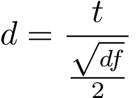

Da der *t*-Wert die Wurzel aus *F* ist, liegt der *t*-Wert bei 3.04. Der Freiheitsgrad des erweiterten Modells liegt bei 70. Daraus ergibt sich folgende Effektgröße:


Ebenso könntest du das *PRE* einfach unter [folgender Webseite](https://www.psychometrica.de/effect_size.html) unter 14. Transformation of the effect sizes eingeben. Wie du sehen wirst, ergibt sich das gleiche Cohen's *d* aus dieser Webseite. Diesen Effekt bezeichnen wir als mittelgroß. 

Das Ergebnis des Tests kannst du hier in R nachrechnen:

TODO: Einfügen specific_constrast_direct_instruction.R

### Die Interaktion des Effekts der direkten Instruktion 

Jetzt kommen wir schlussendlich zu unserer eigentlichen Fragestellung. Wir haben nun heraus gefunden, dass die direkte Instruktion wirksamer ist (zumindest auf Grundlage der Signifikanz) als die anderen beiden Lehrmethoden. Die Frage ist nun, ob dieser Effekt bei Noviz\*innen und nicht bei Expert\*innen zu finden ist. Diese Frage können wir beantworten, indem wir den Parameter *b~4~* im erweiterten Modell auf 0 setzen. Aus dem Beginn dieses Moduls wissen wir noch, dass dieser Parameter die Differenz der Mittelwertsunterschiede zwischen der direkten Instruktion und den anderen beiden Lehrstrategien zwischen den Expert\*innen und Noviz\*innen darstellt. Liegt dieser Parameter bei 0, wirkt die direkte Instruktion bei Expert\*innen genauso gut wie bei Noviz\*innen. Ist dieser Parameter positiv, wirkt die direkte Instruktion bei Noviz\*innen besser als bei Expert\*innen. Wird testen diese Fragestellung mit folgendem Modellpaar:


Der *F*-Test ergibt folgendes Ergebnis:

+-------------------------------------------------+----------+-------------+----------+---------+---------+-----------+
| **Source**                                      | ***SS*** | ***df***\   | ***MS*** | ***F*** | ***p*** | ***PRE*** |
+=================================================+==========+=============+==========+=========+=========+===========+
| Reduktion der Fehler durch das erweiterte Model | 31.18\   | 6 - 5 = 1   | 31.18    | 5.80\   | .019\   | 0.076\    |
+-------------------------------------------------+----------+-------------+----------+---------+---------+-----------+
| Error                                           | 376.33   | 76 - 6 = 70 | 5.38     | \-      | \-      | \-        |
+-------------------------------------------------+----------+-------------+----------+---------+---------+-----------+
| Total Error\                                    | 407.50\  | \-          | \-       | \-      | \-      | \-        |
+-------------------------------------------------+----------+-------------+----------+---------+---------+-----------+

Nun haben wir die Antwort auf unsere Hypothese. Der Effekt der direkten Instruktion ist anscheinend abhängig vom Vorwissen der Personen. Noviz\*innen scheinen mit der direkten Instruktion mehr zu lernen als mit den anderen beiden Lehrstrategien, bei den Expert\*innen scheint die direkte Instruktion gleich effektiv zu sein wie die anderen beiden Lehrstrategien. Der Effekt liegt bei *PRE* = 0.076 oder bei Cohen's *d* = 0.57 (mittlerer Effekt).

Das Ergebnis des Tests kannst du hier in R nachrechnen:

TODO: Einfügen Datei specific_contrast_interaktion.R

### Ergebnisse berichten

Wir haben die Ergebnisse auf unsere Tests berechnet, nun können wir diese berichten:

> "Um zu prüfen, ob die direkte Instruktion lernwirksamer ist als problem- bzw. projektbasiertes Lernen und um zu prüfen, ob der Effekt der direkten Instruktion abhängig vom Vorwissen der Lernenden ist, wurde eine mehrfaktorielle Varianzanalyse gerechnet. Als abhängige Variable wurde der Wissenszuwachs während des Trainings verwendet. Als Faktoren wurden die Lehrstrategien (direkte Instruktion, problembasiertes Lernen und projektbasiertes Lernen) und die Expertise der Lernenden (Expert\*innen und Novize) verwendet. Wir fanden einen signifikanten Haupteffekt der Lehrstrategie, *F*(2, 70) = 4.62, *p* = .013, η^*2*^~p~ = 0.12, und einen signifkanten Interaktionseffekt, *F*(2, 70) = 3.15, *p* = .049, η^*2*^~p~ = 0.08. Spezifische Kontrastanalysen zeigten, dass die direkte Instruktion lernwirksamer war als die anderen beiden Lehrstrategien, *t*(70) = 3.04, *p* = .002, *d* = 0.73 (mittlerer Effekt). Eine weitere Kontrastanalyse ergab einen signifikanten Interaktionseffekt zwischen dem Effekt der direkten Instruktion und der Expertise der Lernenden, *t*(70) = 2.41, *p* = .019, *d* = 0.57 (mittlerer Effekt). Die Ergebnisse deuten darauf hin, dass Noviz\*innen von der direkten Instruktion profitieren, während die Wahl der Lehrstrategie für die Expert\*innen keinen Unterschied macht."

### Zusammenfassung 

Wir haben in diesem Submodul erfolgreich die Hypothese getestet und berichtet, welche wir zu Beginn des Moduls aufgestellt haben. Dabei haben wir heraus gefunden, dass die direkte Instruktion eine besonders wirksame Lehrstrategie für Noviz\*innen ist und die Wahl der Lehrstrategie bei Expert\*innen keinen Einfluss auf den Wissenszuwachs hat. Wir haben insbesondere durch dieses Submodul gesehen, dass Haupteffekte und Interaktionen nicht immer die Fragen beantworten, die wir gerne beantwortet sehen und, dass spezifische Kontraste häufig mehr Aufschluss über unsere Fragen geben. Es ist daher wichtig, sich vor dem Prüfen einer Hypothese bei einer mehrfaktoriellen Varianzanalyse genaue Vorstellungen zu machen, wie die Kodierung gestaltet sein muss, damit man später die eigenen Fragestellungen testen kann.

## Berechnung in Jamovi 

In den folgenden Videos erkläre ich dir, wie man alle Verfahren, die wir in diesem Modul kennen gelernt haben, in Jamovi und R berechnen kannst.

### Haupteffekte 

TODO: Einfügen Video

### Interaktionseffekt

TODO: Einfügen Video

### Simple Effects

TODO: Einfügen Video 1

TODO: Einfügen Video 2

### Spezifische Kontraste

TODO: Einfügen Video 1

TODO: Einfügen Video 2

<!--chapter:end:08-mehrfaktorielle_varianzanalyse.Rmd-->

# ANCOVA

## Einführung 

Bisher haben wir Hypothesen getestet, in deren Modellen entweder nur kontinuierliche oder nur diskrete Prädiktoren eingesetzt wurden. Bei der linearen Regression haben wir kontinuierliche Prädiktoren verwendet, bei der ein- und mehrfaktoriellen Varianzanalyse diskrete Prädiktoren. Dies wird sich in diesem Modul ändern. Unser Ziel in diesem Modul ist es, die gleiche Fragestellung aus dem letzten Modul zu beantworten, nur diesmal, indem wir ein erweitertes Modell verwenden, das sowohl diskrete als auch kontinuierliche Prädiktoren umfasst. Solche Modelle werden als Kovarianzanalysen (ANCOVAs) bezeichnet. Übersetzt können wir eine ANCOVA auch als eine Varianzanalyse mit Kovariaten (stetig skalierte Variablen) bezeichnen. Erinnern wir uns erneut an die Fragestellung aus dem letzten Modul:

> **Ist direkte Instruktion effektiver als problem- bzw. projektbasiertes Lernen und ist dieser Effekt abhängig vom Vorwissen der Lernenden?**

Ein Grund dafür, dass wir die gleiche Fragestellung mit einem anderen Modell testen werden, ist, dass wir durch die mehrfaktorielle Varianzanalyse nicht erfahren können, wie stark der Zusammenhang zwischen dem Vorwissen (Kovariate) der Lernenden und dem Wissen eine Woche nach dem Training ist. Eine der zentralsten Kenntnisse der Lehr- und Lernforschung ist, dass Vorwissen der wichtigste Prädiktor für Lernen ist. Je mehr ich schon über ein Thema weiß, desto besser kann ich mir neues Wissen zu diesem Thema aneignen. Wir konnten diesen Zusammenhang allerdings im letzten Modul nicht testen, da wir als abhängige Variable den Wissenserwerb vor und nach dem Training verwendet haben. Vermutlich gibt es jedoch einen starken Zusammenhang zwischen dem, was eine Person bereits über natürliche Selektion weiß, und dem was die gleiche Person eine Woche später darüber weiß. Wir werden in diesem Modul daher das Wissen vor dem Training in das erweiterte Modell als Kovariate einbauen und das Wissen eine Woche nach dem Training als abhängige Variable verwenden.

Ein weiterer Grund für die Verwendung der Kovarianzanalyse (ANCOVA) ist, dass wir dadurch eine höhere Power haben, unter der Bedingung, dass es keinen Zusammenhang zwischen der Kovariate (hier Vorwissen - stetig skaliert) und den Versuchsbedingungen (hier Lehrstrategiemethode) gibt. Eine höhere Power bedeutet, dass wir mit einer größeren Wahrscheinlichkeit einen Effekt finden werden, sofern er existiert. In der Regel möchten wir eine hohe Power erzielen.

### Datensatz 

Der Datensatz für dieses Modul ist genau der gleiche wie im letzten Modul:

TODO: Einfügen Datei expert_study.csv

Wir werden in diesem Modul die Variablen method, test_prior, test_delay und expertise verwenden. Unsere abhängige Variable ist die Variable test_delay, die Kovariate wird die Variable test_prior sein.

-   **id**: Die ID der Versuchsperson

-   **expertise**: Ein Faktor, welcher kodiert, ob die Person eine Expertin / ein Experte oder eine Novizin / ein Novize ist.

-   **age**: Das Alter der Person

-   **method**: Ein Faktor, welcher die Lehrstrategie kodiert, welche die Person bekommen hat.

-   **test_prior (Kovariate - stetig skaliert)**: Das Vorwissen der Testperson zum Thema natürliche Selektion

-   **test_delay**: Das Wissen zum Thema natürliche Selektion der Person eine Woche nach dem Ende der Lehrsituation

-   **improvement**: Die Differenz zwischen dem Wissen am Ende des Experiments (test_delay) und dem Wissen vor dem Experiment (test_prior). Höhere Werte bedeuten, dass die Person mehr Wissen erworben hat.

## Post- und Pre Werte vs. Differenzmaße

In diesem Submodul möchte ich zeigen, dass wir die gleiche Fragestellung aus dem letzten Modul mit zwei verschiedenen erweiterten Modellen beantworten können. Wir werden ebenso klären, weshalb man überhaupt eine Kovarianzanalyse berechnen sollte.

### Modell mit Differenzmaß als abhängige Variable (ohne Kovariate) 

Beginnen wir mit unserem erweiterten Modell aus dem letzten Modul. Das Modell umfasste sechs Parameter und fünf Prädiktoren. Wir hatten das Modell so gewählt, dass die Parameter für spezifische Gruppenunterschiede stehen. Beispielsweise haben wir *X~1~* so kodiert, dass *b~1~* für den Mittelwertsunterschied zwischen der direkten Instruktion und den anderen beiden Lehrstrategien steht. Ebenso haben wir *X~4~* so kodiert, dass *b~4~* für die Frage steht, ob der Effekt von *b~1~* für Expert\*innen und Noviz\*innen gleich ist.


Das Modell ist im oberen Bild so notiert, dass die abhängige Variable der geschätzte Wert des Modells ist. Wir können das Modell umschreiben, so dass die abhängige Variable der tatsächliche Wert ist, sprich der tatsächliche Wissenswerb der Proband\*innen:


Du kannst erkennen, dass wir das Dach auf der abhängigen Variable entfernt haben und zudem einen Fehlerterm am Ende des Modells hinzugefügt haben (*e~i~*). *Y~i~* steht hier für den Wissenswerb der Proband\*innen. Wir könnten diesen alternativ auch als die Differenz zwischen dem Vorwissen und dem Wissen eine Woche nach dem Training angeben. Wir bezeichnen *Z~i~* im unteren Bild zukünftig als die **Kovariate**. Die Kovariate ist in unserem Fall das Vorwissen der Proband\*innen vor dem Training:


Nun haben wir eine akkuratere Darstellung der abhängigen Variable. Es ist ein Differenzmaß aus zwei Werten: Dem Vorwissen und dem Wissen eine Woche nach dem Training. Ein positiver Wert bedeutet, dass die Proband\*innen etwas dazu gelernt haben, ein negativer, dass die Proband\*innen nach dem Training weniger wissen als vor dem Training. Mit diesem erweiterten Modell haben wir im letzten Modul folgende Ergebnisse erzielt:

+-----------------------------------------------+----------+----------+----------+---------+---------+--------------+
| ***Source***                                  | ***SS*** | ***df*** | ***MS*** | ***F*** | ***p*** | ***PRE*****\ |
|                                               |          |          |          |         |         | **           |
+:==============================================+=========:+=========:+=========:+========:+========:+=============:+
| Model                                         | 94.600   | 5        | 18.92    | 3.52    | .007    | .20          |
+-----------------------------------------------+----------+----------+----------+---------+---------+--------------+
| Lehrstrategie                                 | 49.679   | 2        | 24.84    | 4.62    | .013    | .12          |
+-----------------------------------------------+----------+----------+----------+---------+---------+--------------+
| Expertise                                     | 0.428    | 1        | 0.428\   | 0.08    | .779    | .00          |
+-----------------------------------------------+----------+----------+----------+---------+---------+--------------+
| Lehrstrategie\*Expertise                      | 33.904   | 2        | 16.952\  | 3.1532  | .049    | .08          |
+-----------------------------------------------+----------+----------+----------+---------+---------+--------------+
| direkte Instruktion vs. problem- bzw. projekt | 49.67    | 1        | 49.67    | 9.24    | .003    | .12          |
+-----------------------------------------------+----------+----------+----------+---------+---------+--------------+
| Interaktion direkte Instruktion und Expertise | 31.18    | 1        | 31.18    | 5.80    | .019    | .08          |
+-----------------------------------------------+----------+----------+----------+---------+---------+--------------+
| Error                                         | 376.329  | 70       | 5.376    | \-      | \-      | \-           |
+-----------------------------------------------+----------+----------+----------+---------+---------+--------------+
| Total                                         | 40.929   | 75       | \-       | \-      | \-      | \-           |
+-----------------------------------------------+----------+----------+----------+---------+---------+--------------+

Ein Ergebnis unserer Tests war, dass es eine signifikante Interaktion der Lehrstrategie und der Expertise gibt. Ebenso haben wir heraus gefunden, dass es einen signifikanten Effekt der direkten Instruktion gibt. Das heißt, die direkte Instruktion schien lernförderlicher zu sein als die anderen beiden Lehrstrategien. Dieser Effekt wiederum interagiert mit dem Vorwissen der Lernenden. Bei Noviz\*innen finden wir den Effekt der direkten Instruktion, bei Expert\*innen nicht. Du könntest nun zufrieden sein und diese Ergebnisse in deiner Bachelorarbeit berichten. Allerdings solltest du wissen, welche Auswirkungen es hat, Differenzmaße zu verwenden und keine Kovariate zu verwenden, um die gleichen Hypothesen zu testen.

### Kovarianzanalysen haben unter bestimmten Bedingungen mehr Power 

Zu Beginn des Kurses hatten wir gesagt, dass wir wenn möglich eine hohe Power (\> 80%) erzielen möchten. Das heißt, wir möchten wenn möglich eine hohe Wahrscheinlichkeit bei einem Test erzielen, ein signifikantes Ergebnis zu erhalten. Sofern der Effekt natürlich auch existiert. Die Power können wir manipulieren, indem wir die Stichprobengröße anpassen. In unserem Fall können wir die Power allerdings auch erhöhen, indem wir das Vorwissen als Kovariate in das erweiterte Modell einfügen und als abhängige Variable das Wissen über natürliche Selektion eine Woche nach dem Training definieren.

Nicht jede Kovarianzanalyse hat allerdings eine höhere Power. Entscheidend ist, dass die Ausprägungen des Faktors Lehrstrategie nicht mit dem Vorwissen korrelieren. Bei einem Experiment, in welchem Proband\*innen randomisiert den Versuchsgruppen zugeordnet werden, ist dies meistens gegeben. In unserem Experiment beispielsweise haben wir zunächst das Vorwissen der Lernenden getestet und die Proband\*innen *danach* willkürlich in eine der drei Versuchsgruppen eingeteilt. Wenn wir daher eine einfaktorielle Varianzanalyse der Versuchsgruppen mit dem Vorwissen als abhängige Variable berechnen, erhalten wir keinen signifikanten Effekt. Dies bedeutet, dass die Gruppen sich nicht im Vorwissen unterscheiden:

| *Source* |   *SS* | *df* | *MS* |   *F* | *p* | *PRE* |
|:---------|-------:|-----:|-----:|------:|----:|------:|
| Model    |   81.2 |    2 | 40.6 | 0.619 | .54 | 0.017 |
| Error    | 4789.8 |   73 | 65.6 |    \- |  \- |    \- |
| Total    |   4871 |   75 |   \- |    \- |  \- |    \- |

Dieses signifikante Ergebnis bedeutet zudem, dass das Vorwissen und die Gruppenzugehörigkeit eine geringe gemeinsame Varianz des kompakten Modells aufklären und damit eine der Bedingungen erfüllen, die zu einer höheren Power führt.

Eine zweite Bedingung für höhere Power ist, dass die Kovariate hoch mit der abhängigen Variable korreliert. Dies können wir annehmen, da das Vorwissen in der Regel hoch prädiktiv für weitere Lernerfahrungen ist. Um sicher zu sein, berechnen wir eine einfache lineare Regression zwischen dem Vorwissen und dem Wissen eine Woche nach dem Training und schauen uns das Ergebnis an:

| *Source* | *SS* | *df* |  *MS* | *F* |     *p* | *PRE* |
|:---------|-----:|-----:|------:|----:|--------:|------:|
| Model    | 4316 |    1 |  4316 | 703 | \< .001 |  .905 |
| Error    |  454 |   74 | 6.135 |  \- |      \- |    \- |
| Total    | 4770 |   75 |    \- |  \- |      \- |    \- |

Wir klären unglaubliche 91% der Varianz des kompakten Modells auf. Das heißt, das Vorwissen erklärt den Lernzuwachs der Personen fast vollständig.

### Weitere Gründe, Kovariaten in ein Modell zu integrieren 

Unser Argument war gerade, dass wir bei einem Experiment, in dem wir die Gruppenzugehörigkeit randomisieren, eine höhere Power haben. Es können allerdings noch weitere Argumente für eine Kovarianzanalyse gemacht werden. Beispielsweise bei einem quasi-experimentellen Design. 

Bei einem quasi-experimentellem Design werden Gruppen Proband\*innen nicht willkürlich zugeordnet, sondern die Gruppen gibt es bereits vor einem Experiment. Stell dir beispielsweise vor, du testest, ob sich Republikaner\*innen und Demokrat\*innen in der Frage unterscheiden, wie viel Einfluss der Staat auf die Gesundheitsversorgung der Bevölkerung haben sollte. Beide Gruppen gibt es bereits vor der Erhebung der Daten. Ebenso könntest du vergleichen, wie viele Stunden Menschen mit Abitur und Menschen mit einem Werkrealschulabschluss pro Woche lesen. Erneut handelt es sich um natürliche Gruppen, die vor der Datenerhebung existierten. Solche Gruppen unterscheiden sich häufig ebenso in anderen Variablen, die einen Einfluss auf die abhängige Variable haben können. Beispielsweise gibt es vermutlich einen hohen Zusammenhang zwischen der Zustimmung zu der Frage, ob der Staat eine verpflichtende Gesundheitsversorgung umsetzt und der persönlichen Kranheitsgeschichte einer Person. Sprich, wer bereits öfters auf die Gesundheitsversorgung angewiesen war, befürwortet eine stärkere staatliche Versorgung der Gesundheit der Bevölkerung. Eine Kovarianzanalyse, in der Republikaner\*innen mit Demokrat\*innen verglichen werden, ermöglicht in diesem Fall den Effekt der politischen Zugehörigkeit für die persönliche Krankheitsgeschichte zu *kontrollieren*. Mit einem solchen Test könnten wir prüfen, ob die Zustimmung einer gesetzlichen Krankenversicherung von der politischen Zugehörigkeit abhängt, wenn Personen sich nicht in ihrer Krankheitsgeschichte unterscheiden. Kontrollieren bedeutet daher, dass wir einen Prädiktor in Abhängigkeit eines anderen Prädiktors interpretieren: Wenn sich Personen nicht in ihrer Krankheitsgeschichte unterscheiden, dannn erwarten wir folgende Zustimmung zur gesetzlichen Krankenversicherung. Würden wir keine Kovariate einfügen, könnte es sein, dass der Unterschied der politischen Zugehörigkeit durch eine andere Variable erklärt werden kann. Sprich, dass wir einen falschen Inferenzschluss machen. Dies ist nur ein Beispiel und die Möglichkeiten der statistischen Analyse sind ungleich komplizierter als es hier kurz angerissen wurde. Es zeigt aber sehr gut, dass wir bei quasiexperimentellen Designs immer überlegen sollten, welche Kovariaten in ein Modell hinzuzufügen sind.

### Modell der Kovarianzanalyse (mit Kovariate) 

Nun, da wir die Gründe kennen, eine Kovarianzanalyse zu berechnen, können wir uns das erweiterte Modell für unsere Kovarianzanalyse aufstellen. Hierzu bringen wir die Kovariate *Z* von der linken Seite der Gleichung auf die rechte Seite der Gleichung:


Im Vergleich zum vorherigen Modell haben sich ein paar Dinge geändert:


Zunächst hat das erweiterte Modell mit der Kovariate einen Parameter und einen Prädiktor mehr. Hierdurch ändern sich ebenso die Freiheitsgrade in unserem Test. Beispielsweise kann dem erweiterten Modell durch den weiteren Parameter nur noch ein Parameter weniger hinzugefügt werden. Das heißt der Freiheitsgrad des erweiterten Modells reduziert sich um die Zahl 1. Ebenso werden wir durch das erweiterte Modell die Fehler des kompakten Modells besser aufklären können. Wie bereits zu Beginn des Kurses erwähnt, je mehr Parameter wir haben, desto besser können wir die Fehler des kompakten Modells aufklären. Des Weiteren ändern sich die Parameter der beiden Modelle selbst. Ohne die Kovariate stehen die Parameter für die Gruppenmittelwertsunterschiede. Mit der Kovariate stehen die Parameter für die Gruppenmittelwertsunterschiede, allerdings kontrolliert für die Kovariate. Wir würden beispielsweise *b~1~* folgendermaßen interpretieren: Wenn zwei Personen das gleiche Vorwissen haben, beträgt der Mittelwertsunterschied zwischen der direkten Instruktion und den anderen beiden Lehrstrategien *b~1~*. Das heißt, wir können die Parameter nur noch in Abhängigkeit der Kovariate interpretieren.

### Zusammenfassung 

In diesem Submodul haben wir gezeigt, dass wir die mehrfaktorielle Varianzanalyse, welche wir im letzten Modul kennen gelernt haben, auch als Kovarianzanalyse berechnen können. Wir haben zunächst gezeigt, wie das Modell der mehrfaktoriellen Varianzanalyse in ein Modell mit einer Kovariate überführt werden kann. Ebenso haben wir gezeigt, weshalb es Sinn macht, eine Kovarianzanalyse zu berechnen. Zunächst hilft es unter bestimmten Bedingungen, die Power des Tests zu erhöhen, des Weiteren ermöglicht uns eine Kovarianzanalyse, für andere Variablen zu kontrollieren, die mit den Ausprägungen von Gruppen im Zusammenhang stehen können.

## Statistisches Hypothesentesten 

In diesem Modul werden wir die gleichen Fragestellungen testen, die wir im letzten Modul getestet haben. Allerdings diesmal, indem wir eine Kovarianzanalyse berechnen. Im Grunde genommen berechnen wir eine mehrfaktorielle Varianzanalyse mit einem Interaktionseffekt und einer Kovariate. Wir werden dabei nicht jeden einzelnen Test einzeln berechnen, sondern alle Ergebnisse auf einmal präsentieren und genau untersuchen, worin sich die Ergebnisse zwischen der mehrfaktoriellen Varianzanalyse aus dem letzten Modul und der Kovarianzanalyse in diesem Modul unterscheiden.

### Darstellung der Ergebnisse der beiden Tests 

In der folgenden Tabelle siehst du die zentralen Ergebnisse der mehrfaktoriellen Varianzanalyse aus dem letzten Modul und der Kovarianzanalyse, wie wir sie in diesem Modul rechnen. Wir werden die Tabelle gleich im Einzelnen durchgehen. Achte auf die unterschiedlichen Freiheitsgrade und *p*-Werte:

<table><thead><tr class="header"><th style="text-align: left;"><p><strong>Source</strong></p></th><th><p><em><strong>SS<sub>ohne</sub></strong></em></p></th><th><p><em><strong>SS<sub>mit</sub></strong></em></p></th><th><p><em><strong>df<sub>ohne</sub></strong></em></p></th><th><p><em><strong>df<sub>mit</sub></strong></em></p></th><th><p><em><strong>F<sub>ohne</sub></strong></em></p></th><th><p><em><strong>F<sub>mit</sub></strong></em></p></th><th><p><em><strong>p<sub>ohne</sub></strong></em></p></th><th><p><em><strong>p<sub>mit</sub></strong></em></p></th><th><p><em><strong>PRE<sub>ohne</sub></strong></em></p></th><th><p><em><strong>PRE<sub>mit</sub></strong></em></p></th></tr></thead><tbody><tr class="odd"><td style="text-align: left;"><p>Model</p></td><td><p>94.600</p></td><td><p>4432.6</p></td><td><p>5</p></td><td><p>6</p></td><td><p>3.52<br />
</p></td><td><p>151.24</p></td><td><p>.007<br />
</p></td><td><p>&lt; .001</p></td><td><p>.20<br />
</p></td><td><p>.20<br />
</p></td></tr><tr class="even"><td style="text-align: left;"><p>Lehrstrategie</p></td><td><p>49.679</p></td><td><p>52.5</p></td><td><p>2</p></td><td><p>2</p></td><td><p>4.62<br />
</p></td><td><p>5.37</p></td><td><p>.013<br />
</p></td><td><p>.007</p></td><td><p>.12<br />
</p></td><td><p>.14</p></td></tr><tr class="odd"><td style="text-align: left;"><p>Expertise</p></td><td><p>0.428<br />
</p></td><td><p>25.7</p></td><td><p>1</p></td><td><p>1</p></td><td><p>0.08<br />
</p></td><td><p>5.26</p></td><td><p>.779<br />
</p></td><td><p>.025</p></td><td><p>.00<br />
</p></td><td><p>.07</p></td></tr><tr class="even"><td style="text-align: left;"><p>Lehrstrategie*Expertise</p></td><td><p>33.904<br />
</p></td><td><p>27.6</p></td><td><p>2</p></td><td><p>2</p></td><td><p>3.1532<br />
</p></td><td><p>2.82</p></td><td><p>.049<br />
</p></td><td><p>.07</p></td><td><p>.08<br />
</p></td><td><p>.08</p></td></tr><tr class="odd"><td style="text-align: left;"><p>direkte Instruktion vs. problem- bzw. projekt</p></td><td><p>49.67<br />
</p></td><td><p>50.6</p></td><td><p>1</p></td><td><p>1</p></td><td><p>9.24<br />
</p></td><td><p>10.36</p></td><td><p>.003<br />
</p></td><td><p>.002<br />
</p></td><td><p>.12<br />
</p></td><td><p>.13<br />
</p></td></tr><tr class="even"><td style="text-align: left;"><p>Interaktion direkte Instruktion und Expertise</p></td><td><p>31.18<br />
</p></td><td><p>25.1</p></td><td><p>1</p></td><td><p>1</p></td><td><p>5.80<br />
</p></td><td><p>5.14</p></td><td><p>.019<br />
</p></td><td><p>.027</p></td><td><p>.08<br />
</p></td><td><p>.07</p></td></tr><tr class="odd"><td style="text-align: left;"><p>Vorwissen<br />
</p></td><td><p>-</p></td><td><p>1615.8</p></td><td><p>-</p></td><td><p>1</p></td><td><p>-</p></td><td><p>330.78</p></td><td><p>-</p></td><td><p>&lt; .001</p></td><td><p>-</p></td><td><p>.83</p></td></tr><tr class="even"><td style="text-align: left;"><p>Error</p></td><td><p>376.329<br />
</p></td><td><p>337.0</p></td><td><p>70</p></td><td><p>69</p></td><td><p>-</p></td><td><p>-</p></td><td><p>-</p></td><td><p>-</p></td><td><p>-</p></td><td><p>-</p></td></tr><tr class="odd"><td style="text-align: left;"><p>Total</p></td><td><p>40.929<br />
</p></td><td><p>4769.6</p></td><td><p>75</p></td><td><p>75</p></td><td><p>-</p></td><td><p>-</p></td><td><p>-</p></td><td><p>-</p></td><td><p>-</p></td><td><p>-</p></td></tr></tbody></table>

### Der Effekt der Expertise 

Zunächst müssen wir feststellen, dass wir im letzten Modul keinen Effekt der Expertise hatten, nun allerdings finden wir diesen Effekt (da wir ein signifikanes Ereignis haben):

| Source    | *SS~ohne~* | *SS~mit~* | *df~ohne~* | *df~mit~* | *F~ohne~* | *F~mit~* | *p~ohne~* | *p~mit~* | *PRE~ohne~* | *PRE~mit~* |
|:----------|------------|-----------|------------|-----------|-----------|----------|-----------|----------|-------------|------------|
| Model     | 94.600     | 4432.6    | 5          | 6         | 3.52      | 151.24   | .007      | \< .001  | .20         | .20        |
| Expertise | 0.428      | 25.7      | 1          | 1         | 0.08      | 5.26     | .779      | .025     | .00         | .07        |
| Error     | 376.329    | 337.0     | 70         | 69        | \-        | \-       | \-        | \-       | \-          | \-         |
| Total     | 40.929     | 4769.6    | 75         | 75        | \-        | \-       | \-        | \-       | \-          | \-         |

Zu erklären ist diese Änderung, indem wir uns fragen, was die abhängige Variable ist und welche Hypothesen wir mit den beiden Tests gerechnet haben. Bei der mehrfaktoriellen Varianzanalyse war die abhängige Variable der *Wissenszuwachs* vom Pre- zum Posttest. Dieser war offensichtlich zwischen Noviz\*innen und Expert\*innen gleich. Mit der Kovarianzanalyse allerdings ist die abhängige Variable das Wissen zum Thema natürliche Selektion eine Woche nach dem Training. Das Ergebnis der Kovarianzanalyse sagt uns nun, dass Expert\*innen mehr über natürliche Selektion wissen als Noviz\*innen. Oder anders gesagt, wenn Noviz\*innen und Expert\*innen gleich viel vor dem Training über natürliche Selektion wissen, werden Expert\*innen nach dem Training mehr wissen als Noviz\*innen. Genau dies ist die Bedeutung der Kovariate. Zusammengefasst prüfen wir daher mit der Kovarianzanalyse eine andere Fragestellung als bei der mehrfaktoriellen Varianzanalyse.

### Der Freiheitsgrad des allgemeinen F-Tests erweitert sich um 1 

Du siehst ebenso, dass sich beim allgemeinen Modell, bei dem wir alle Prädiktoren auf 0 setzen, der Freiheitsgrad von 5 (ohne Kovariate) auf 6 (mit Kovariate) steigert:

| Source | *SS~ohne~* | *SS~mit~* | *df~ohne~* | *df~mit~* | *F~ohne~* | *F~mit~* | *p~ohne~* | *p~mit~* | *PRE~ohne~* | *PRE~mit~* |
|:-------|------------|-----------|------------|-----------|-----------|----------|-----------|----------|-------------|------------|
| Model  | 94.600     | 4432.6    | 5          | 6         | 3.52      | 151.24   | .007      | \< .001  | .20         | .20        |
| Error  | 376.329    | 337.0     | 70         | 69        | \-        | \-       | \-        | \-       | \-          | \-         |
| Total  | 40.929     | 4769.6    | 75         | 75        | \-        | \-       | \-        | \-       | \-          | \-         |

Zur Erinnerung, Model meint hier, dass wir das erweiterte Modell mit der Kovariate mit dem einfachsten kompakten Modell vergleichen, bei dem wir nur einen Parameter haben, der für den Mittelwert der abhängigen Variable steht:


Du siehst, dass das erweiterte Modell sieben Parameter hat. Das kompakte Modell hat einen Parameter. Daher hat das erweiterte Modell sechs Parameter mehr als das kompakte Modell. Dieser Test beantwortet unsere Fragestellungen nicht, daher ist er nicht so wichtig. Er zeigt allerdings durch die Freiheitsgrade, dass das zu Grunde liegende Modell anders ist.

### Die p-Werte werden größer bzw. kleiner 

Ebenso kannst du erkennen, dass die *p*-Werte anders sind und dass sich teilweise auch die Signifikanz ändert. Beispielsweise ist sowohl der *p*-Wert der Lehrstrategie, der Expertise und des Effekts der direkten Instruktion kleiner:

<table><thead><tr class="header"><th style="text-align: left;"><p><strong>Source</strong></p></th><th><p><em><strong>SS<sub>ohne</sub></strong></em></p></th><th><p><em><strong>SS<sub>mit</sub></strong></em></p></th><th><p><em><strong>df<sub>ohne</sub></strong></em></p></th><th><p><em><strong>df<sub>mit</sub></strong></em></p></th><th><p><em><strong>F<sub>ohne</sub></strong></em></p></th><th><p><em><strong>F<sub>mit</sub></strong></em></p></th><th><p><em><strong>p<sub>ohne</sub></strong></em></p></th><th><p><em><strong>p<sub>mit</sub></strong></em></p></th><th><p><em><strong>PRE<sub>ohne</sub></strong></em></p></th><th><p><em><strong>PRE<sub>mit</sub></strong></em></p></th></tr></thead><tbody><tr class="odd"><td style="text-align: left;"><p>Lehrstrategie</p></td><td><p>49.679</p></td><td><p>52.5</p></td><td><p>2</p></td><td><p>2</p></td><td><p>4.62<br />
</p></td><td><p>5.37</p></td><td><p>.013<br />
</p></td><td><p>.007</p></td><td><p>.12<br />
</p></td><td><p>.14</p></td></tr><tr class="even"><td style="text-align: left;"><p>Expertise</p></td><td><p>0.428<br />
</p></td><td><p>25.7</p></td><td><p>1</p></td><td><p>1</p></td><td><p>0.08<br />
</p></td><td><p>5.26</p></td><td><p>.779<br />
</p></td><td><p>.025</p></td><td><p>.00<br />
</p></td><td><p>.07</p></td></tr><tr class="odd"><td style="text-align: left;"><p>Lehrstrategie*Expertise</p></td><td><p>33.904<br />
</p></td><td><p>27.6</p></td><td><p>2</p></td><td><p>2</p></td><td><p>3.1532<br />
</p></td><td><p>2.82</p></td><td><p>.049<br />
</p></td><td><p>.07</p></td><td><p>.08<br />
</p></td><td><p>.08</p></td></tr><tr class="even"><td style="text-align: left;"><p>direkte Instruktion vs. problem- bzw. projekt</p></td><td><p>49.67<br />
</p></td><td><p>50.6</p></td><td><p>1</p></td><td><p>1</p></td><td><p>9.24<br />
</p></td><td><p>10.36</p></td><td><p>.003<br />
</p></td><td><p>.002<br />
</p></td><td><p>.12<br />
</p></td><td><p>.13<br />
</p></td></tr><tr class="odd"><td style="text-align: left;"><p>Interaktion direkte Instruktion und Expertise</p></td><td><p>31.18<br />
</p></td><td><p>25.1</p></td><td><p>1</p></td><td><p>1</p></td><td><p>5.80<br />
</p></td><td><p>5.14</p></td><td><p>.019<br />
</p></td><td><p>.027</p></td><td><p>.08<br />
</p></td><td><p>.07</p></td></tr><tr class="even"><td style="text-align: left;"><p>Error</p></td><td><p>376.329<br />
</p></td><td><p>337.0</p></td><td><p>70</p></td><td><p>69</p></td><td><p>-</p></td><td><p>-</p></td><td><p>-</p></td><td><p>-</p></td><td><p>-</p></td><td><p>-</p></td></tr><tr class="odd"><td style="text-align: left;"><p>Total</p></td><td><p>40.929<br />
</p></td><td><p>4769.6</p></td><td><p>75</p></td><td><p>75</p></td><td><p>-</p></td><td><p>-</p></td><td><p>-</p></td><td><p>-</p></td><td><p>-</p></td><td><p>-</p></td></tr></tbody></table>

Allerdings findest du auch, dass die Interaktion zwischen Lehrstrategie und Expertise nicht mehr signifikant ist, da sie nun die 5%-Schwelle übersteigt. Der Grund hierfür liegt darin, dass die beiden Interaktionseffekte (*df* = 2) wenige Fehler des kompakten Modells aufklären (27.6 anstatt 33.9) und, dass das erweiterte Modell einen Parameter weniger aufnehmen kann (*df* = 69 anstatt *df* = 70). Ersteres hat zur Folge, dass der F-Wert kleiner wird, zweiteres hat zur Folge, dass wir eine andere *F*-Verteilung zur Prüfung der Hypothese verwenden müssen.

Alle anderen binären statistischen Entscheidungen bleiben allerdings gleich. Das Beispiel zeigt allerdings schon, dass die Entscheidung über eine Kovariate oder ein Differenzmaß bei einer mehrfaktoriellen Varianzanalyse einen Einfluss auf die statistische Entscheidung haben kann. Ohne die Kovariate finden wir eine signifikante Interaktion, mit der Kovariate nicht. Forschende haben dadurch manche Möglichkeiten, die sie darin unterstützen, ein Verfahren zu wählen, welches doch zu einem signifikanten Ergebnis führt (siehe [Kerr, 1998](https://journals.sagepub.com/doi/abs/10.1207/s15327957pspr0203_4?casa_token=N68R6DcJTeQAAAAA:hkubNI-Bls4lkGV2s8VHvm9ei5fXqKrNmGoVfgjy_gNzZlbZgw52DC7olJm1a_G7o2x9nM8OjQkd)). So sollte es allerdings nicht sein. Die Modelle, welche Forschende aufstellen, sollten inhaltlich begründet sein und weniger aufgrund des Wunsches, ein signifikantes Ergebnis zu erzielen.

### Das Vorwissen ist prädiktiv für das Wissen nach dem Training 

Mit der Kovariate können wir zudem eine weitere interessante Frage beantworten: Wie wichtig ist das Vorwissen für das Wissen zum Thema natürliche Selektion nach dem Training? Und die Antwort ist: "Sehr wichtig":

| Source    | *SS~ohne~* | *SS~mit~* | *df~ohne~* | *df~mit~* | *F~ohne~* | *F~mit~* | *p~ohne~* | *p~mit~* | *PRE~ohne~* | *PRE~mit~* |
|:----------|------------|-----------|------------|-----------|-----------|----------|-----------|----------|-------------|------------|
| Vorwissen | \-         | 1615.8    | \-         | 1         | \-        | 330.78   | \-        | \< .001  | \-          | .83        |
| Error     | 376.329    | 337.0     | 70         | 69        | \-        | \-       | \-        | \-       | \-          | \-         |
| Total     | 40.929     | 4769.6    | 75         | 75        | \-        | \-       | \-        | \-       | \-          | \-         |

Wie du siehst, klärt allein der Prädiktor Vorwissen (nur ein Prädiktor!) 83% der Varianz im Test eine Woche nach dem Training auf. Wer sozusagen bereits viel über ein Thema weiß, wird auch eine Woche später sehr viel über dieses Thema wissen. In den Kennwerten gesprochen könnten wir auch sagen: Der Prädiktor Vorwissen ist 330 mal besser in der Lage, die Fehler des kompakten Modells aufzuklären als wir für einen weiteren Prädiktor erwarten würden. Oder: Die Wahrscheinlichkeit, dass wir ein solches Ergebnis erhalten, wenn das Vorwissen keinen Einfluss auf das Wissen eine Woche nach dem Training hat, liegt bei unter 0.00001% (oder sogar noch geringer). Die mehrfaktorielle Varianzanalyse mit einem Differenzmaß als abhängige Variable konnte uns dieses Ergebnis nicht liefern. Eine Kovarianzanalyse allerdings schon.

### Zusammenfassung 

Wir haben in diesem Submodul gesehen, wie sich die statistischen Ergebnisse eines Tests ändern, wenn wir eine Kovarianzanalyse berechnen. Genauer haben wir die Ergebnisse der mehrfaktoriellen Varianzanalyse aus dem letzten Modul mit einer Kovarianzanalyse verglichen. Im Vergleich haben wir heraus gefunden, dass das erweiterte Modell bei einer Kovarianzanalyse einen Parameter und einen Prädiktor mehr hat als das kompakte Modell. Ein weiteres Ergebnis war, dass die Ergebnisse der Tests teilweise andere Hypothesen beantworten. Beispielsweise haben wir am Beispiel des Effekts der Expertise gesehen, dass dieser Test eine andere Fragestellung beantwortet und die dramatische Änderung der statistischen Entscheidung dadurch zu erklären ist. Ebenso haben wir gesehen, dass wir durch eine Kovarianzanalyse den Effekt der Kovariate testen können und dadurch mehr statistische Fragen beantworten können als mit einem Differenzmaß als abhängige Variable.

## Berechnung in Jamovi 

TODO: Einfügen Video 1

TODO: Einfügen Video 2

<!--chapter:end:09-ancova.Rmd-->

# Mediation


<!--chapter:end:10-mediation.Rmd-->

# Moderation

<!--chapter:end:11-moderation.Rmd-->

# Statistische Voraussetzungen

## Einführung 

Das allgemeine lineare Modell, welches wir in diesem Kurs kennen gelernt haben (kompaktes und erweitertes Modell), ist eine der beliebtesten Methoden in der Sozialforschung, um Hypothesen zu testen. Die Idee des linearen Modells ist allerdings eine menschliche Erfindung und daher nicht perfekt.Beispielsweise hat jeder Test, den wir mit Hilfe des linearen Modells gerechnet haben, bestimmte Annahmen, die wir beachten sollten.

Nehmen wir die Skalierung der abhängigen Variable. In allen Tests dieses Kurses war die abhängige Variable metrisch (intervall- oder verhältnisskaliert) skaliert. Wäre die abhängige Variable diskret skaliert (z.B. Parteizugehörigkeit), könnten wir keines unserer Testverfahren dieses Kurses verwenden. Ebenso könnte es sein, dass die abhängige Variable binär skaliert ist, dass heißt, dass es nur zwei Ausprägungen gibt. Stell dir vor, du möchstest ein Modell aufstellen, dass vorhersagt, ob eine Person den Untergang der Titanic überlebt hat. Solche Fragen lassen sich beispielsweise mit der [logistischen Regression](https://de.wikipedia.org/wiki/Logistische_Regression#:~:text=Unter%20logistischer%20Regression%20oder%20Logit,der%20Verteilung%20abh%C3%A4ngiger%20diskreter%20Variablen.) prüfen, nicht aber mit dem allgemeinen linearen Modell.

Das allgemeine lineare Modell hat allerdings noch weitere Annahmen, die wir zumindest bei jedem Test kennen sollten. Diese Annahmen sind die Linearität des Modells, die Normalverteilung der Residuen, die Homoskedastizität und die Unabhängigkeit der Daten. Sind diese Annahmen nicht getroffen, kann es im schlimmsten Fall sein, dass unsere Ergebnisse verfälscht sind. Beispielsweise, indem die Verletzungen der Annahmen den Beta-Fehler verringern bzw. die Power der Studie reduzieren. Wir werden diese Annahmen in diesem letzten Modul des Kurses besprechen und auch erfahren, wie robust unsere Tests sind, das heißt, wie stark die Ergebnisse der Tests verändert werden, sollten die Annahmen nicht umgesetzt sein.

Bevor wir beginnen, ein kleiner Hinweis: Der Umgang mit Verletzungen der Annahmen wird unter Forschenden unterschiedlich gehandhabt. Manche Forschende wissen nicht, dass diese Annahmen überhaupt existieren, andere sehen es nicht so streng mit den Verletzungen der Annahmen. Andere wiederum nehmen es sehr genau und versuchen, den besten Weg zu finden, wie mit diesen Verletzungen umgegangen wird. Ich werde in diesem Modul keine Position dazu beziehen. Mir ist es wichtig, dass du über die Annahmen Bescheid weißt. Wie mit Verletzungen der Annahmen umgegangen wird, solltest du mit dir oder der Betreuerin / dem Betreuer deiner Forschungsarbeiten besprechen.

## Übersicht der Annahmen des allgemeinen linearen Modells

In der folgenden Tabelle siehst du die Annahmen, welche das allgemeine lineare Modell (alle Modelle, die wir in diesem Kurs kennenlernen werden) annimmt. Für jeden Test ist dargestellt, wie diese Annahmen herkömmlicherweise geprüft werden. Beispielsweise lässt sich die Normalität der Residuen durch den [Shapiro-Wilk Test](https://de.wikipedia.org/wiki/Shapiro-Wilk-Test) bei den meisten Tests prüfen.

| Testverfahren                                                            | Abhängige Variable metrisch skaliert | Linearität                                                    | Normalverteilung der Residuen                     | Homoskedastizität                                         | Unabhängigkeit der Daten                                 |
|--------------------------------------------------------------------------|--------------------------------------|---------------------------------------------------------------|---------------------------------------------------|-----------------------------------------------------------|----------------------------------------------------------|
| \-                                                                       | \-                                   | Die Beziehung zwischen X und dem Mittelwert von Y ist linear. | Für jeden festen Wert von X ist Y normalverteilt. | Die Varianz der Residuen ist für jeden Wert von X gleich. | Die Beobachtungen sind voneinander unabhängig.           |
| *t*-Test für eine Stichprobe                                             | erfüllt                              | \-                                                            | Shapiro-Wilk Test / Q-Q plot                      | \-                                                        | \-                                                       |
| Einfache lineare Regression                                              | erfüllt                              | Sichtung der Daten                                            | Shapiro-Wilk Test / Q-Q plot                      | Residual plots                                            | Durch die Sichtung des experimentellen Designs erkennbar |
| Multiple lineare Regression                                              | erfüllt                              | Sichtung der Daten                                            | Shapiro-Wilk Test / Q-Q plot                      | Residual plots                                            | Durch die Sichtung des experimentellen Designs erkennbar |
| einfaktorielle Varianzanalyse (und *t*-Test für unabhängige Stichproben) | erfüllt                              | \-                                                            | Shapiro-Wilk Test / Q-Q plot                      | Levene's Test                                             | Durch die Sichtung des experimentellen Designs erkennbar |
| mehrfaktorielle Varianzanalyse                                           | erfüllt                              | \-                                                            | Shapiro-Wilk Test / Q-Q plot                      | Levene's Test                                             | Durch die Sichtung des experimentellen Designs erkennbar |
| Kovarianzanalyse (ANCOVA)                                                | erfüllt                              | \-                                                            | Shapiro-Wilk Test / Q-Q plot                      | Levene's Test                                             | Durch die Sichtung des experimentellen Designs erkennbar |

Wie du erkennst, ist die erste Annahme bei allen Tests erfüllt. Dies liegt daran, dass alle unsere Tests auf Grundlage des [allgemeinen linearen Modells](https://de.wikipedia.org/wiki/Allgemeines_lineares_Modell) berechnet werden, welches immer eine metrisch skalierte abhängige Variable umfasst. Die Linearität der Daten prüfen wir in der Regel für die einfache und lineare Regression. Die Linearität bei der einfachen linearen Regression kann man prüfen, indem man sich die Daten grafisch betrachtet. Die Normalität der Residuen kann sowohl durch grafische Plots als auch durch den Shapiro-Wilk Test (und weitere) geprüft werden. Diese Annahme besagt, dass die Fehler der Modelle normalverteilt sind. Homoskedastizität ist eine der schwierigsten Annahmen. Diese Anname besagt, dass die Varianz der Residuen (der Fehler) für jeden Wert *X* in etwa gleich sein sollten. Für die Regressionsanalysen heißt dies, dass die Fehler sich gleichmäßig im Modell verteilen. Für die Varianzanalyse heißt dies, dass die Varianzen der einzelnen Gruppen ähnlich zueinander sind. Geprüft wird diese Annahme häufig durch den Levene Test. Zuletzt nehmen die Tests die Unabhängigkeit der Daten an. Die Unabhängigkeit kann man nur durch die Sichtung des experimentellen Designs prüfen. Wenn du beispielsweise in Schulklassen Daten erhebst, sind diese Daten selten unabhängig, da Schüler\*innen innerhalb einer Klasse mehr Ähnlichkeiten aufweisen als Schüler\*innen zwischen Klassen (indem beispielsweise eine Klasse mehr Wissen über eine Thematik hat als eine andere Klasse). In diesem Kurs haben wir keine Tests kennen gelernt, mit denen Hypothesen mit abhängigen Daten gerechnet werden könnten. Dies wäre für dich ein nächster Schritt, wenn du über die Inhalte dieses Kurses hinaus gehen möchtest (siehe [Repeated Measures Design](https://en.wikipedia.org/wiki/Repeated_measures_design)). Im Folgenden werden wir die einzelnen Testverfahren kennen lernen.

## Linearität 

Beginnen wir mit der Linearität. Und schauen wir uns dazu nochmal das erweiterte Modell der linearen Regression aus diesem Kurs an. In diesem Modell hatten wir die Hypothese aufgestellt, dass es einen positiven Zusammenhang zwischen der Anzahl der Worte in einer Mitschrift von Studierenden und der Erinnerungsleistung aus einem Vortrag gibt. Folgendes Modell hatte sich damals ergeben:


Du siehst, dass das erweiterte Modell (hier blau dargestellt) eine Linie darstellt. Genau dies meinen wir mit Linearität. Wir nehmen an, dass die Daten eine lineare Beziehung haben. Um besser zu verstehen, was eine lineare Beziehung ist, schau dir folgende Datenvisualisierungen an:

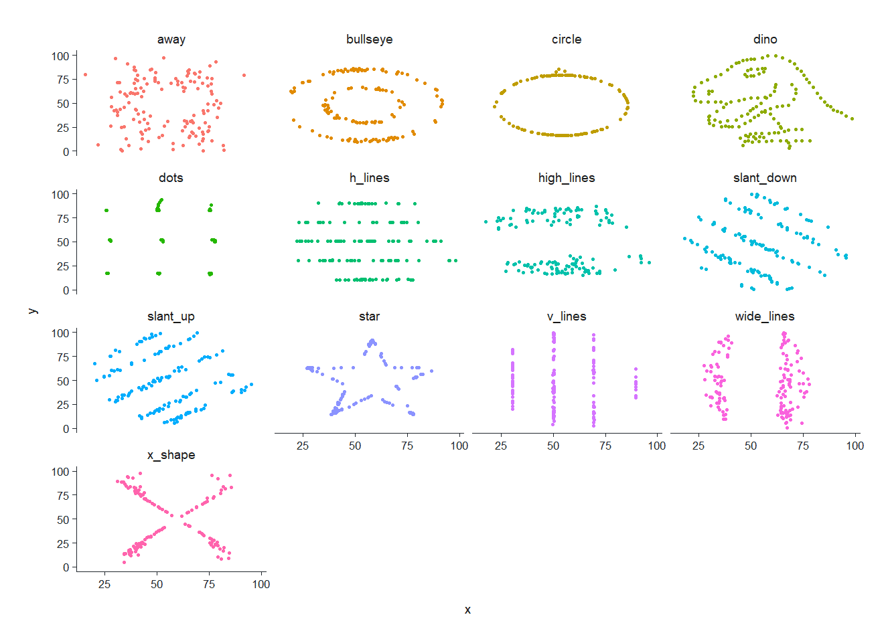

Diese Darstellung ist an das [Anscombe Quartett](https://en.wikipedia.org/wiki/Anscombe%27s_quartet) angelehnt, welches vom Statistiker Francis Anscombe entwickelt wurde. Die Daten selbst stammen von [Albert Cairo](http://www.thefunctionalart.com/2016/08/download-datasaurus-never-trust-summary.html), einem Datenvisualisierer, welcher mit diesen Beispielen zeigen möchte, wie wichtig es ist, Daten zu visualisieren. Uns zeigt diese Darstellung, dass Daten nicht immer linear sind. Allerdings ist dies eine Annahme des allgemeinen linearen Modells. 

Nun, warum ist eine Verletzung dieser Annahme ein Problem? Es ist ein Problem, da das lineare Modell manchmal eine lineare Beziehung annimmt, die nicht linear ist. Nehmen wir einmal den exponentiellen Anstieg der Covid Fälle weltweit. [Exponentiell ](https://www.youtube.com/watch?v=Kas0tIxDvrg)bedeutet, dass für jede Wertsteigerung von *X*, *Y* höher ansteigt. Modelle sollen allerdings immer einen Teil der Wirklichkeit darstellen. Ein lineares Modell stellt in diesem Beispiel diese Wirklichkeit nicht dar und ist daher nicht geeignet, als Modell der Daten zu dienen. 

Für dich als Forscher\*in heißt dies, dass es bei jeder linearen oder multiplen Regression notwendig ist, die Daten zu visualisieren, bevor du einen Test rechnest. Ist die Beziehung zwischen *X* und *Y* offensichtlich nicht linear, ist das allgemeine lineare Modell evtl. nicht passend und du solltest ein anderes Modell verwenden (siehe [hier](https://en.wikipedia.org/wiki/Nonlinear_regression)).

## Normalverteilung der Residuen

Die erste Annahme ist die Normalverteilung der Residuen. Diese Annahme bedeutet, dass die Fehler der Modelle normalverteilt sind:


Wir prüfen demnach, ob die Abstände einer jeden Vorhersage des Modells mit den wahren Werten der Stichprobe eine Normalverteilung darstellen.

### Prüfung der Annahme durch ein Histogramm der Residuen 

Schauen wir uns dazu die Verteilung der Residuen der einfachen linearen Regression zu Beginn des Kurses an. Bei diesem Modell hatten wir den Zusammenhang zwischen der Anzahl der Worte in einer Mitschrift und der Erinnerungsleistung aus einen Vortrag geprüft. Wenn ich die Fehler des erweiterten Modells *e~i~* als Histogramm darstelle, erhalte ich folgendes Ergebnis:


Nun, die Fehler verteilen sich nicht perfekt in einer Normalverteilung. Die Verteilung ist ein wenig rechtsschief, da mehr Werte links der Mitte der Verteilung zu finden sind. Ein Histogramm ist allerdings nur eine Möglichkeit, die Normalverteilung der Residuen zu prüfen. Häufig wird auch der Q-Q Plot verwendet.

### Q-Q Plot 

Die Einzelheiten eines [Q-Q Plots](https://en.wikipedia.org/wiki/Q%E2%80%93Q_plot) sind kompliziert, für dich als Forscher\*in ist zunächst wichtig, wie man mit einem Q-Q Plot umgeht: Je näher die Punkte des Q-Q Plots an der dargestellten Gerade liegen, desto stärker sind die Residuen normalverteilt. In der folgenden Darstellung siehst du den Q-Q Plot für die Daten der einfachen linearen Regression, welche wir weiter oben vorgestellt haben. Wie du siehst, gibt es Abweichungen der Punkte von der Linie, allerdings sind diese Abweichungen nicht erstaunlich groß. Es kann daher argumentiert werden, dass die Annahme der Normalverteilung der Residuen nicht verletzt wurde.

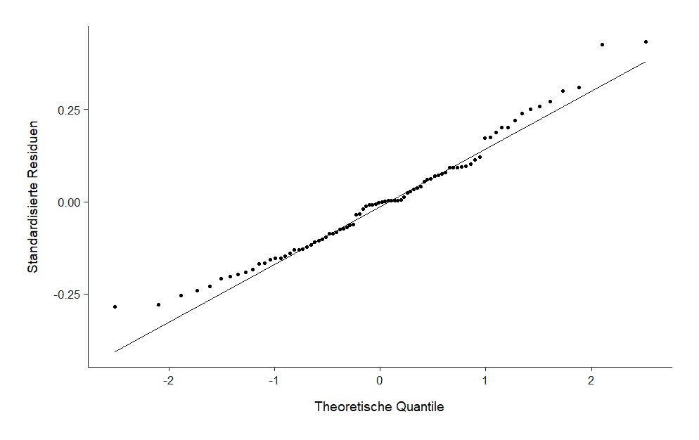

### Was ist mit anderen Testverfahren? 

Wir haben gerade das Beispiel der einfachen linearen Regression verwendet. Das Argument kann jedoch für alle unsere Tests verwendet werden, da wir wissen, dass das erweiterte Modell Vorhersagen macht, die von den realen Werten abweichen. Wir können daher für jeden Test sowohl ein Histogramm als auch ein Q-Q Plot erstellen. Genau deswegen findest du bei der ANOVA in Jamovi ebenso unter Assumption Checks eine Checkbox, bei der du dir einen Q-Q Plot ausgeben lassen kannst. Zum Beispiel haben wir im Modul zur einfaktoriellen Varianzanalyse getestet, ob das Testen von Wissen für den Erwerb konzeptuellen Wissens wirksamer ist als die Erstellung einer Concept-Map. Im folgenden Bild siehst du, dass wir ebenso für diesen Test die Normalität mit Hilfe eines Q-Q Plots testen können.


### Shapiro-Wilk Test 

Ein weiterer Test zur Prüfung der Normalverteilung ist der [Shapiro-Wilk Test](https://www.statisticshowto.com/shapiro-wilk-test/). Allerdings weicht dieser Test ein wenig von der eben vorgestellten Idee der Normalverteilung ab, da er testet, ob die Daten, nicht die Residuen normalverteilt sind. Der Test beantwortet daher eine etwas andere Frage und macht eine Aussage über die Normalverteilung der Daten. Bei einem nicht-signifikanten Ergebnis wird davon ausgegangen, dass die Daten normalverteilt sind. In Jamovi können wir den Shapiro-Wilk Test berechnen, indem wir unter Assumption Checks auf Normality (Shapiro-Wilk) klicken. In den Ergebnissen erhalten wir anschließend das Ergebnis. Im folgenden Bild habe ich den Shapiro-Wilk Test für die Testing-Hypothese (Testing vs. Concept-Map) berechnet. Du siehst, dass das Ergebnis nicht signifikant ist, daher kann von einer Normalverteilung der Daten ausgegangen werden.


### Zusammenfassung 

Die Annahme der Normalverteilung der Residuen geht davon aus, dass die Fehler des erweiterten Modells eine Normalverteilung darstellen. Wir haben drei Wege kennen gelernt, diese Annahme zu prüfen. Die Darstellung der Fehler in einem Histogramm, den Q-Q Plot und den Shapiro-Wilk Test. Am besten schaust du dir sowohl grafische Verfahren an und prüfst die Annahme durch einen Test wie den Shapiro-Wilk Test. Inwieweit Verletzungen der Normalität die Ergebnisse verfälschen, ist eine [umfangreiche Debatte](https://www.researchgate.net/post/How_robust_is_ANOVA_to_deviations_from_normality) (siehe auch [Schmider et al., 2010](https://econtent.hogrefe.com/doi/full/10.1027/1614-2241/a000016) und [diesen Beitrag](https://stats.stackexchange.com/questions/62918/two-way-anova-robustness-against-normality-violations)). Du solltest daher immer abwägen und recherchieren, ob dein Test Gefahr läuft, durch Verletzungen der Annahme der Normalverteilung verfälschte Ergebnisse zu liefern.

## Homoskedastizität 

Eine der kryptischsten Annahmen ist die Homoskedastizität. Der Begriff klingt bereits so neu, dass man sich keine Vorstellung machen kann, was er bedeutet. Machen wir einen Versuch in diesem Submodul. Die Definition der Annahme ist, dass die Varianz der Residuen für jeden Wert von *X* gleich sein soll.

### Residual Plots 

Beginnen wir, uns diese Definition am Beispiel der linearen Regression klar zu machen. Im nächsten Bild siehst du einen sogenannten Residual Plot. In dieser Darstellung ist auf der X-Achse die unabhängige Variabe (Anzahl der Worte der Mitschrift) dargestellt. Auf der Y-Achse sind die Residuen abgetragen. Schau dir beispielsweise den Punkt ganz rechts der X-Achse an. Der Punkt befindet sich auf der Y-Achse auf der Höhe von etwa 0.1. Das heißt, für den Wert X wurde der wahre Wert Y um 0.1 Punkte überschätzt.


Wir können diesen Residual Plot nutzen, um die Homoskedastizität zu prüfen. An dem Plot können wir diese Annahme prüfen, indem wir folgendermaßen vorgehen: Wir fragen uns, ob die Abstände der Punkte zu der Linie für die verschiedenen Werte auf der X-Achse gleichmäßig sind? In der oberen Visalisierung siehst du beispielsweise, dass die Abstände der Residuen zu der Linie für kleine Werte von X weiter sind als für hohe Werte von X. In der Tendenz herrscht daher keine perfekte Homoskedastizität vor. 

Residual plots werden allerdings meist nicht anhand der Werte der Prädiktoren, sondern durch sogenannte Fitted Values dargestellt. Fitted Values sind nichts anderes als die vorhergesagte Werte in einem Modell. In der folgenden Visualisierung siehst du einen Residual Plot, in dem statt des Prädiktors auf der X-Achse die Fitted Values dargestellt sind.

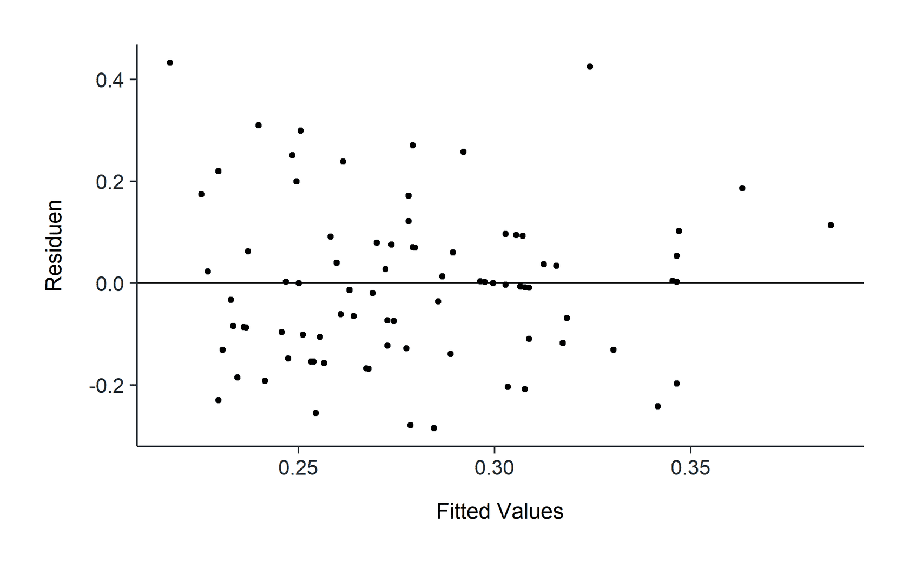

Wie du siehst, sieht diese Darstellung exakt gleich aus wie oben. Dies liegt allerdings daran, dass wir eine einfache lineare Regression verwendet haben. Bei einer einfaktoriellen Varianzanalyse sähe diese Darstellung anders aus. Du solltest daher wenn möglich auf die Fitted Values zurück greifen.

Um ein extremes Beispiel zu sehen, empfehle ich dir [diesen Link](https://socratic.org/questions/what-is-homoskedasticity). Dort wird anhand von zwei Grafiken sehr schnell ersichtlich, wie eine Verletzung der Homoskedastizität aussieht.

### Prüfung der Homoskedastizität durch die Darstellung der Regressionsgerade 

Bei der einfachen linearen Regression können wir diese Annahme zudem prüfen, indem wir uns die Abstände der Punkte von der Regressionsgerade ansehen. Dieses Verfahren ist den Residual Plots sehr ähnlich, nur dass wir die Visualisierung anders betrachten müssen. Wenn du nun diese Darstellung mit dem Residual Plot vergleichst, siehst du in der rechten Hälfte der beiden Visualisierungen, dass die Abstände der Punkte von der Regressionsgerade ähnlich aussehen, und dass diese Abstände auf der rechten Hälfte der X-Achse kleiner sind als auf der linken Hälfte der X-Achse. Grafisch ist der Residual Plot daher nichts anderes als wenn du die Regressionsgerade horizontal richtest und die Daten entsprechend der Regressionsgerade angepasst werden.


### Prüfung der Homoskedastizität durch den Levene-Test 

Bei der einfachen linearen Regression lassen sich sehr einfach grafische Verfahren einsetzen. Bei den Verfahren der Varianzanalsye ist dies etwas schwieriger. Daher gibt es Tests, die prüfen können, ob die Varianzen der Prädiktoren bei unterschiedlichen Ausprägungen ähnlich sind. Gehen wir einen Schritt zurück in die erweiterten Modelle der Varianzanalyse. Bei diesen Modellen mussten wir Gruppen als Kontraste kodieren, indem wir Gruppen in numerische Werte überführt haben. Wenn wir nun sagen, dass die Varianzen der Prädiktoren bei unterschiedlichen Ausprägungen der Prädiktoren gleich sein sollen, meinen wir folgendes: Die Varianzen der Gruppen sollten zwischen den Gruppen gleich sein. Wenn du beispielsweise eine einfaktorielle Varianzanalyse mit zwei Gruppen rechnest (*t*-Test für unabhängige Stichproben), prüfst du für die Feststellung der Homoskedastizität, ob die Varianzen von Gruppe 1 und von Gruppe 2 ähnlich sind. Die Idee bleibt die selbe wie bei der einfachen linearen Regression, nur dass wir bei der Varianzanalyse von den Varianzen der Gruppen und nicht von Ausprägungen der Werte des Prädiktoren denken müssen. Und wir testen diese Annahme mit Hilfe des [Levene-Tests](https://de.wikipedia.org/wiki/Levene-Test).

Der Levene-Test ist erneut ein statistischer Hypothesentest, der folgende Ergebnisse liefert. Ist das Ergebnis signifikant, ist keine Homoskedastizität gegeben. Ist das Ergebnis nicht signfikant, ist Homoskedastizität gegeben. Jamovi erlaubt für jede Varianzanalyse den Levene-Test zu berechnen. Klicke dazu auf Assumption Checks und dann auf Homogeneity tests. In folgendem Beispiel erhalten wir kein signifikantes Ergebnis, daher kann von der Annahme der Homoskedastizität ausgegangen werden.

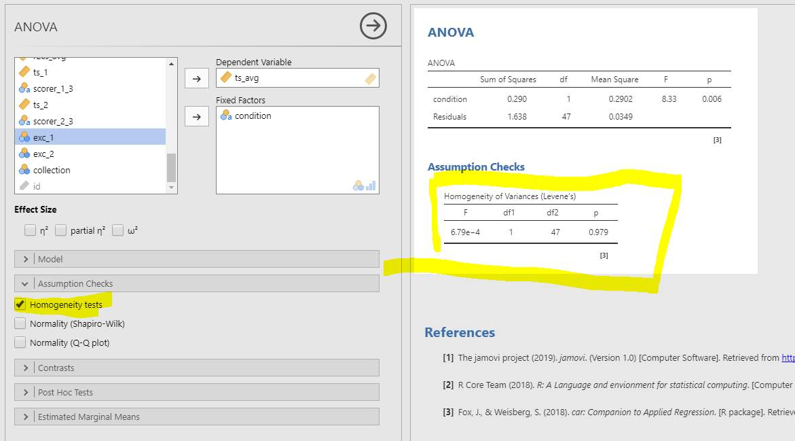

### Zusammenfassung 

Die Homoskedastizität ist eine der weiteren Annahmen des allgemeinen linearen Modells und daher von allen Tests, die wir in diesem Kurs kennen gelernt haben. Die Annahme ist umgesetzt, wenn die Varianz der verschiedenen Ausprägungen der Prädiktoren gleichmäßig ist. Bei der linearen Regression können wir diese Annahme grafisch prüfen, bei der Varianzanalyse können wir den Levene-Test verwenden.

## Unabhängigkeit der Daten 

Alle bisherigen Tests dieses Kurses sind davon ausgegangen, dass unsere Daten unabhängig voneinander sind. Unabhängigkeit tritt immer dann auf, wenn uns das Auftreten eines Wertes *X~i~* keine Aussage über eine andere Ausprägung von *X~i~* macht. Stell dir einen *t*-Test für unabhängige Stichproben vor, bei dem wir *vor* einer Intervention das Vorwissen von zwei Gruppen vergleichen. Die Kenntnis über das Vorwissen einer Person ermöglicht dir nicht, das Vorwissen einer anderen Person vor der Intervention zu bestimmen. Allerdings sind nicht alle Daten immer unabhängig voneinander. Stell dir vor, du möchtest vergleichen, ob Männer und Frauen unterschiedlich zufrieden in ihrer Beziehung sind. Hierzu befragst du sowohl Männer und Frauen aus vier Paaren nach ihrer Beziehungszufriedenheit:

| Paar | Männer | Frauen |
|------|--------|--------|
| 1    | 1      | 1      |
| 2    | 4      | 3      |
| 3    | 6      | 7      |
| 4    | 5      | 6      |

Wenn du nun den Wert eines Partners kennst, erhältst du automatisch Informationen über den Wert des anderen Partners. Da sich Paare zu einem gewissen Teil übereinstimmen, wie zufrieden sie in ihrer Beziehung sind, sind die Daten voneinander abhängig. Ist ein Partner unter dem Mittelwert der abhängigen Variable, wird der Partner oder die Partnerin vermutlich ebenso unter dem Mittelwert sein. Wir nennen diese Art der Abhängigkeit positive Abhängigkeit, da die Daten ähnlich zueinander sind. Eine negative Abhängigkeit würde auftreten, wenn Werte gegensätzlich voneinander abhängig sind. Stell dir zum Beispiel vor, du testest die Breite von Baumkronen. Deine Daten umfassen Baumpaare, die sehr eng beieinander stehen. Wenn nun ein Baum eine sehr breite Krone hat, wird der benachbarte Baum vermutlich eine kleinere Krone haben, da beide um das Sonnenlicht kämpfen. In diesem Fall sprechen wir von einer negativen Abhängigkeit.

Abhängigkeit kann einerseits entstehen, wenn Daten wie in diesen Beispielen gruppiert sind, andererseits tritt Abhängigkeit auf, wenn Daten sequentiell erhoben werden. Stell dir hierzu vor, du erhebst die Cholesterinwerte von Proband\*innen über mehrere Messzeitpunkte, um zu prüfen, ob der Cholesterinspiegel der Personen steigt oder sinkt. Eine Person, die bereits beim ersten Messzeitpunkt einen hohen Cholesterinspiegel hat, wird vermutlich auch beim zweiten Messzeitpunkt einen hohen Cholesterspiegel haben. Genausogut wird eine Person, die einen niedrigen Cholesterinspiegel beim ersten Messzeitpunkt hat, vermutlich auch beim zweiten Messzeitpunkt einen niedrigen Cholesterinspiegel haben. Die Folge ist, dass die Daten abhängig voneinander sind. 

Aus den Daten allein können wir nicht sagen, ob die Abhängigkeit durch eine Gruppierung oder durch sequentielle Messzeitpunkte geschieht. Es ist unser Versuchsdesign, welches uns Hinweise liefert, welche Abhängigkeit vorherrscht. Wir nennen diese zwei Möglichkeiten gekreuzte Daten und genestete Daten.

### Gekreuzte Daten 

Normalerweise treten gekreuzte Daten auf, wenn wir Daten einer Versuchsperson mehrmals erheben. Wir haben gerade eben bereits das Beispiel des Cholesterins kennen gelernt. Der Cholesterinspiegel von Proband\*innen wird mehrmals gemessen. Stell dir ein anderes Beispiel vor: Du möchtest untersuchen, ob eine bestimmte Übung einen Einfluss darauf hat, wie schnell Proband\*innen in einen Meditationszustand kommen. Du gehst davon aus, dass Proband\*innen, die diese Übung über längere Zeit durchführen, schneller in einen Meditationszustand kommen. Alle Proband\*innen führen die Übung über drei Wochen durch. Du testest die Dauer bis die Proband\*innen in den Meditationszustand kommen je einmal wöchentlich. Folgende Ergebnisse erhältst du: 

| ID  | Woche 1 | Woche 2 | Woche 3 |
|-----|---------|---------|---------|
| 1   | 140     | 130     | 100     |
| 2   | 90      | 100     | 70      |
| 3   | 160     | 140     | 120     |
| 4   | 250     | 230     | 210     |
| 5   | 30      | 40      | 20      |
| 6   | 400     | 390     | 340     |

Zunächst kannst du anhand der Tabelle erkennen, dass die Proband\*innen im Schnitt über die Wochen schneller in den Meditationszustand kommen. Die Probandin mit der ID 4 zum Beispiel benötigt am Anfang 250 Sekunden, dann 230 Sekunden, dann 210 Sekunden. Ebenso erkennst du, dass die Daten abhängig voneinander sind. Beispielsweise fällt auf, dass die Werte der Probandin mit der ID 4 relativ hoch bleiben, wenn wir sie mit der Probandin mit der ID 2 vergleichen. Wer bereits lange Zeit beim ersten Messzeitpunkt benötigt, wird auch beim nächsten Messzeitpunkt mehr Zeit benötigen.

Wann sind die Daten allerdings gekreuzt? Wir sprechen von gekreuzten Daten, wenn die Werte einzelner Personen in verschiedenen Ausprägungen eines Faktors vorliegen. In diesem Fall haben wir den Faktor Zeitpunkt mit drei Ausprägungen (Woche 1, Woche 2, Woche 3). Für jede\*n Proband\*in liegt ein Wert in jeder Ausprägung vor. Die Daten wären nicht gekreuzt, wenn Daten nur in einer Ausprägung eines Faktors vorlägen. Stell dir zum Beispiel mehrere Schulklassen vor, die unterschiedliche Lernstrategien erhalten. Schulklasse A, B und C erhalten Lernstrategie *Z u*nd Schulklasse D, E und F erhalten Lernstrategie *Q*. Die Abhängigkeit der Daten entsteht dadurch, dass die Schüler\*innen jeweils in der gleichen Klasse stecken. Diese Daten sind nicht gekreuzt, da die Schüler\*innen nur in je einer Ausprägung des Faktors Schulklasse stecken.

Ein anderes Beispiel: Du möchtest prüfen, ob sich das Verhalten von Schüler\*innen ändert, wenn man ihnen öfter Lob gibt. Bisher hätten wir solche Fragestellungen getestet, indem wir zwei unabhängige Gruppen umgesetzt hätten, welche entweder gelobt werden oder nicht gelobt werden. Durch ein solches Design könnten wir allerdings nicht prüfen, ob Lob über die Zeit zu einer Veränderung des Verhaltens der Schüler\*innen führt. In deinem neuen Design gibst du daher allen Schüler\*innen über fünf Messzeitpunkte Lob. Erneut sind die Daten gekreuzt, da für jede Ausprägung des Faktors Messzeitpunkt ein Datenpunkt je eines Schülers / einer Schülerin steckt. In den Lehrbüchern spricht man dann in der Regel von Messwiederholungsdesigns. Diese sind in der einfachsten Form immer dadurch erkennbar, dass die Daten gekreuzt sind.

### Genestete Daten 

Wir hatten genestete Daten bereits mit unserem Schulklassenbeispiel kennen gelernt. Schüler\*innen innerhalb einer Schulklasse erhalten entweder die Lernstrategie *Q* oder die Lernstrategie *Z*. Genestete Daten zeichnen sich dadurch aus, dass die Proband\*innen bzw. Datenpunkte nur in einer Ausprägung eines Faktors vorliegen. In diesem Fall erhalten die Schüler\*innen der jeweiligen Gruppen nur eine der beiden Lernstrategien. Diese Aussage gilt nur für den Fall, wenn wir entweder gekreuzte oder genestete Daten vorliegen haben. Es gibt auch Designs, die beide Strukturen beinhalten. Über diese Designs werden wir allerdings in diesem Modul nicht sprechen. Um genestete Daten besser zu verstehen, siehst du hier in Beispiel des Lernstrategietrainings:

| \-      | Treatment Q | Treatment Z |
|---------|-------------|-------------|
| y       | Klasse A    | Klasse B    |
| *y~1i~* | 7           | 9           |
| *y~2i~* | 3           | 8           |
| *y~3i~* | 2           | 10          |
| *y~i~*  | 5           | 7           |

In der Tabelle kannst du erkennen, dass die Schüler\*innen innerhalb einer Schule immer nur entweder Treatment *Q* oder Treatment *Z* bekommen. Die Daten sind daher nicht gekreuzt. Allerdings sind die Daten unter dem Faktor der Schulklasse genested, was dazu führst, dass sich Schüler\*innen innerhalb einer Klasse ähnlich sind. Manche Klassen sind im Schnitt besser als die anderen Klassen. Hierdurch wissen wir, dass beispielsweise eine Schülerin aus Klasse A, die sehr gut ist, vermutlich besser sein wird, als eine Schülerin aus Klasse B, die etwas schlechter ist. 

Genestete Daten finden sich sehr häufig in großen Schulstudien, in denen Erhebungen in Klassen erhoben werden. Stell dir beispielsweise die PISA-Studie vor, in der nicht nur Klassen, sondern auch Schulen genested vorliegen können. Die statistischen Verfahren in solchen Designs werden zunehmend komplexer.

### Folgen gekreuzter und genesteter Daten für die Power einer Studie 

Ignoriert man die gekreuzte oder genestete Struktur von Daten, hat dies Einfluss auf den *F*-Wert und damit auch auf die Power einer Studie. Verletzung der Annahme der Unabhängigkeit sind die gravierendsten und sollten auf jeden Fall beachtet werden, wenn man die Daten mit Hilfe verschiedener statistischer Verfahren auswertet. Eine Übersicht der Auswirkungen siehst du in der folgenden Tabelle: 

| \-              | Arten der Abhängigkeit |
|-----------------|------------------------|
| **Gruppe**      | **positiv**            |
| Genestete Daten | *F* zu groß            |
| Gekreuzte Daten | *F* zu klein           |

Stell dir ein Beispiel vor: Du möchtest eine Messwiederholungsanalyse mit gekreuzten Daten rechnen. Innerhalb der Daten herrscht eine positive Abhängigkeit. Beispielsweise indem man die Entwicklung der intrinsischen Motivation von Studierenden über eine längere Zeit testet. Wer am Anfang intrinsisch motiviert ist, wird wohl auch später intrinsisch motiviert sein. Verletzt du nun die Annahme der Abhängigkeit und berechnest statt einer Messwiederholungsanalyse eine einfaktorielle Varianzanalyse, erhältst du in der Regel einen zu kleinen *F*-Wert. Dies bedeutet, du bist mit einer geringeren Wahrscheinlichkeit in der Lage, einen möglichen Effekt zu finden, da deine Power geringer wird. Als Folge könntest du über viele Experimente zu dem Entschluss kommen, dass es zu keiner Veränderung in der intrinsischen Motivation kommt, obwohl dieser Effekt existiert. Du solltest daher von vorneherein überlegen, ob dein Design abhängig oder unabhängig ist. Erst dann kannst du die korrekten Verfahren zum Testen deiner Hypothese auswählen.

### Zusammenfassung 

Wir haben in diesem Modul die Vorraussetzungen der allgemeinen linearen Modelle und damit unserer Testverfahren kennen gelernt. Manchmal werden diese Annahmen verletzt und dann müssen wir uns Gedanken machen, wie wir damit umgehen. Es gibt dabei keine festen Regeln, wie mit Verletzungen der Annahmen umgegangen werden soll. Forschende verfahren sehr unterschiedlich. Manche nehmen es sehr ernst mit den Verletzungen der Annahmen, andere weniger. In jedem Fall solltest du darüber informiert sein, dass es diese Annahmen gibt und dass diese deine Ergebnisse verfälschen können. 

Mit diesem Modul haben wir diesen Kurs abgeschlossen. Du solltest nun in der Lage sein, die meisten statistischen Fragestellungen durch die besprochenen Testverfahren prüfen zu können. Die wichtigste Botschaft dieses Kurses ist, dass wir nie Theorien bestätigen können, sondern nur falsifizeren können. Der Begriff der Signifikanz ist nur ein statistischer Ausdruck für diese Idee. Die andere zentrale Botschaft dieses Kurses ist, dass alle Testverfahren dieses Kurses durch das allgemeine lineare Modell geprüft werden können, indem wir erweiterte und kompakte Modelle aufstellen. Hast du diese Idee einmal verstanden, wirst du erkennen, dass ein *t*-Test für unabhängige Stichproben nur ein Sonderfall der einfaktoriellen Varianzanalyse ist. Und dass die einfache lineare Regression mit der einfaktoriellen Varianzanalyse zu vergleichen ist, nur dass die Prädiktoren anders definiert sind. Ich hoffe, ich konnte dir diese beiden Ideen in diesem Kurs vermitteln.

<!--chapter:end:12-statistische_voraussetzungen.Rmd-->

# Was du sonst noch wissen musst

## Interraterreliabilität

## Cronbach's Alpha and Omega's Alpha

https://www.tandfonline.com/doi/full/10.1080/19312458.2020.1718629

<!--chapter:end:13-the_rest.Rmd-->

`r if (knitr::is_html_output()) '
# References {-}
'`

<!--chapter:end:20-references.Rmd-->

