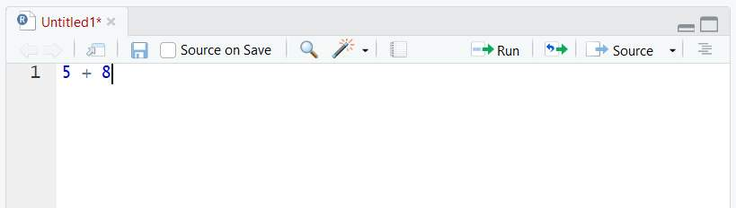
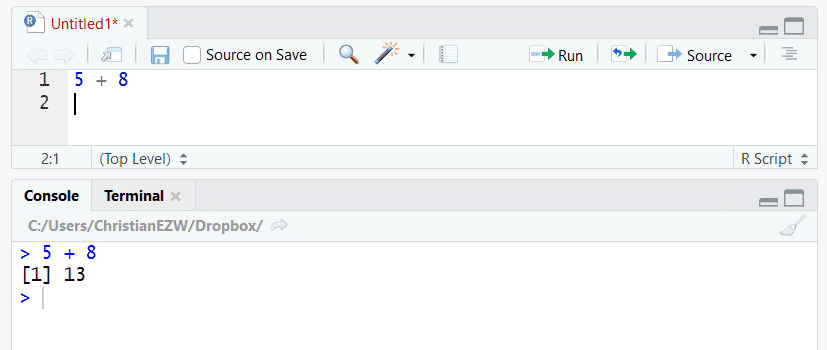
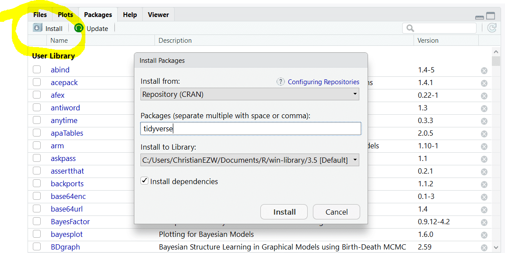
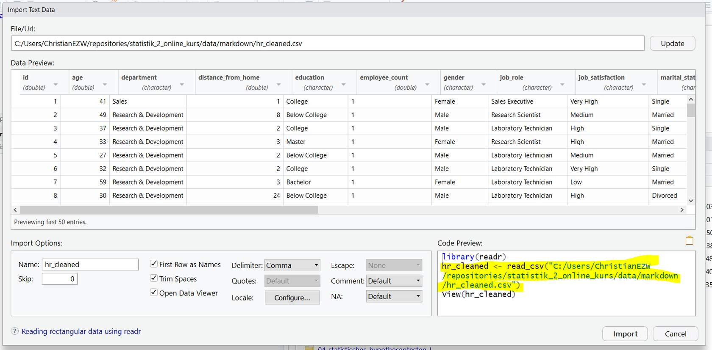
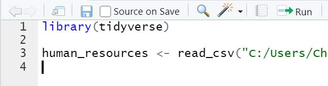
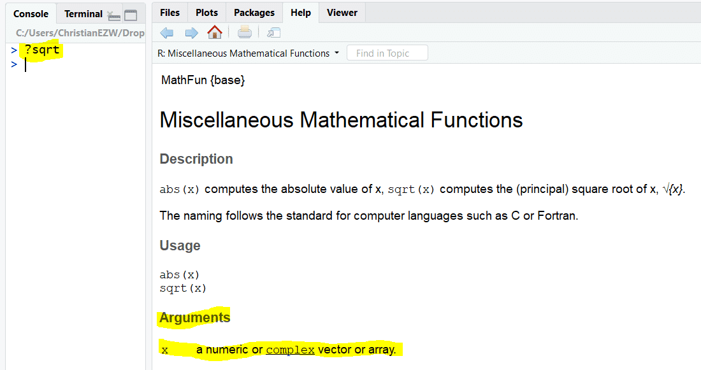
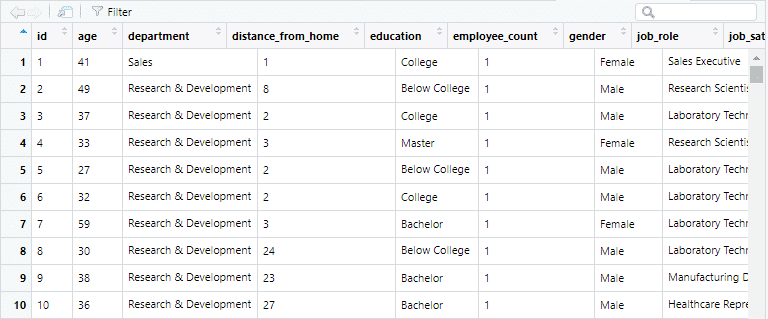
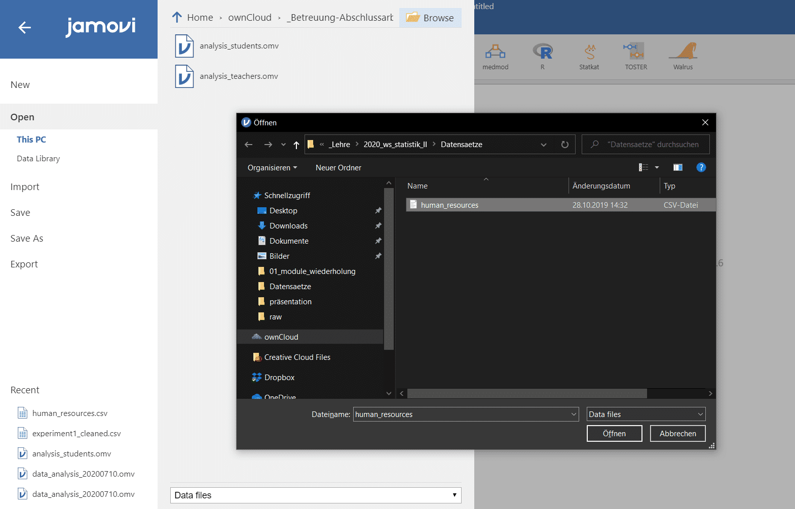
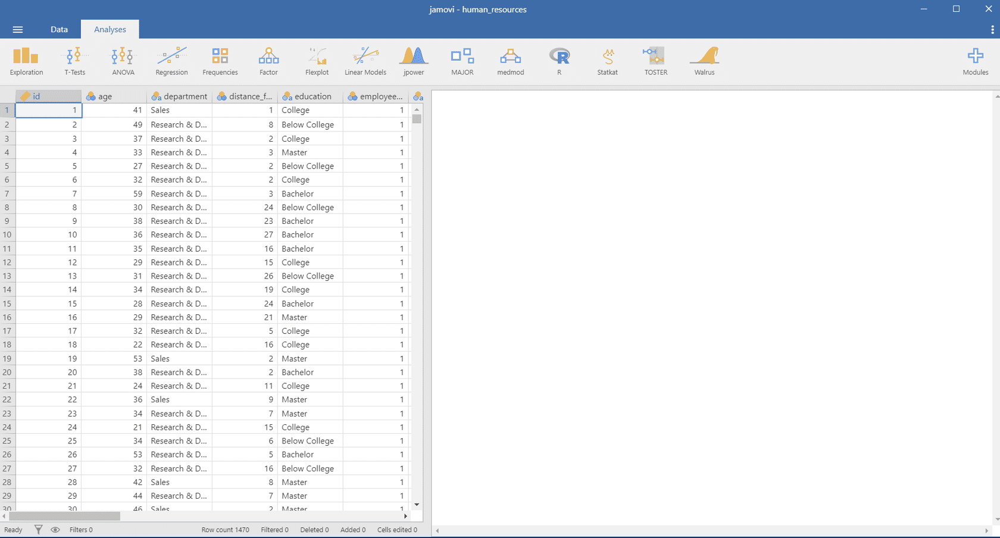
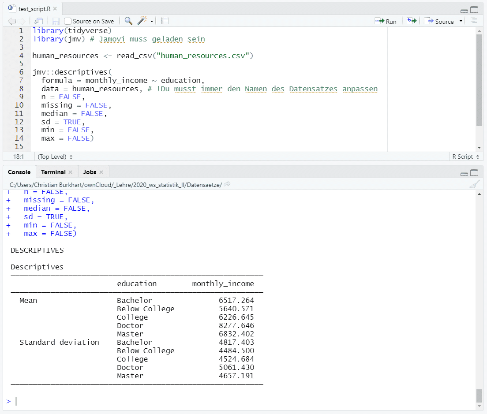

--- 
title: "A Minimal Book Example"
author: "Yihui Xie"
date: "`r Sys.Date()`"
site: bookdown::bookdown_site
documentclass: book
bibliography: [book.bib, packages.bib]
biblio-style: apalike
link-citations: yes
description: "This is a minimal example of using the bookdown package to write a book. The output format for this example is bookdown::gitbook."
---

# Einführung

Placeholder


<!--chapter:end:index.Rmd-->


# Über den Kurs {#intro}

Placeholder


## Aufbau
### Termine
### Präsenztermine Aufbau
## Didaktische Ideen

<!--chapter:end:01-intro.Rmd-->

# Grundlagen R, R-Studio und Jamovi

```{r, echo=FALSE, warning=FALSE, message=FALSE}
library(tidyverse)
library(learnr)
human_resources <- read_csv("data/human_resources.csv")
```


## Einführung

In diesem Modul beschäftigen wir uns mit den Softwares, die wir für dieses Semester verwenden werden und wir wiederholen die Inhalte aus dem Seminar Statistik I. Folgende Submodule umfasst dieses Modul:

-   Software des Seminars: In diesem Submodul erfährst du, welche Softwares wir für das Seminar verwenden und wie du diese installierst.
-   Grundlagen R: In diesem Submodul wiederholst du die grundlegenden Befehle in R und lernst, wie du mit R und R-Studio arbeiten kannst.
-   Grundlagen tidyverse: In diesem Submodul lernst du mit der Statistik-Software Jamovi umzugehen. Wir werden Jamovi in diesem Kurs verwenden, um statistische Fragestellungen zu beantworten.
-   Quiz Statistik I: An dieser Stelle wiederholst du zentrale Konzepte aus Statistik I, die Vorraussetzung für dieses Seminar sind.

## Software des Seminars

Wir werden in diesem Kurs drei Softwares verwenden. R, R-Studio und Jamovi. R und R-Studio verwenden wir, um Daten zu bereinigen, deskriptive Daten zu berechnen und die Ergebnisse unserer Tests zu dokumentieren. Jamovi verwenden wir, um statistische Fragestellungen zu beantworten. Beide Softwares lassen sich miteinander integrieren, indem wir Ergebnisse aus Jamovi als Code in R übertragen können. Der Vorteil dieser Übertragung ist, dass du hierdurch keine Befehle in R lernen musst und dadurch ohne große Mühe statistische Testverfahren in R rechnen kannst. In diesem Modul lernst du diejenigen Kentnisse in R und Jamovi, die wir in diesem Seminar immer wieder brauchen.

* [R](https://www.r-project.org/): R ist eine statistische Programmiersprache zur Analyse von Daten. Mit R werden wir in diesem Kurs Daten bereinigen und visualisieren. Datenvisualisierung ist ein zentraler Bestandteil der Datenanalyse, da wir durch Visualisierungen Muster in Daten erkennen können, die aus den Rohdaten schwer zu entnehmen sind. Zudem verwenden wir R für die Dokumentation unserer Ergebnisse. Die Dokumentation ist wichtig, da wir auch Jahre nach unserer Analyse verstehen möchten, wie wir die Daten ausgewertet haben. In SPSS oder Jamovi ist dies deutlich unübersichtlicher.
* [R-Studio](https://rstudio.com/): R-Studio ist eine Entwicklungsumgebung für die Programmiersprache R. Sie umfasst eine grafische Benutzeroberfläche und vereinfacht die Arbeit mit R.
* [Jamovi](https://www.jamovi.org/): Jamovi ist eine Software mit der man die gängigsten statistischen Verfahren in einer grafischen Benutzeroberfläche berechnen kann. In diesem Kurs verwenden wir Jamovi zur Berechnung der Verfahren und werden deren Ergebnisse in R übertragen. Zwar wird in der empirischen Sozialforschung häufig SPSS eingesetzt, allerdings ist SPSS kostenpflichtig und umfasst viele Verfahren, die wir in diesem Kurs nicht benötigen. Jamovi hat den Vorteil, dass es kostenlos ist und eine ähnliche Oberfläche wie SPSS hat. Der Transfer zu SPSS ist daher relativ einfach. Ein weiterer Grund für Jamovi ist, dass es sich sehr einfach mit R integrieren lässt.

## Download der Software

Die drei Softwares sind unter folgenden Links kostenfrei für Mac und Windows zugänglich. Lade dir die Softwares gleich jetzt herunter. Wir werden alle drei Softwares in jedem Modul des Kurses verwenden.

* [R \> 4.0.2](https://ftp.gwdg.de/pub/misc/cran/): Lade R in der Version 4.0.2 oder größer herunter.
* [R-Studio](https://rstudio.com/products/rstudio/download/): Lade die neueste Version von R-Studio herunter.
* [Jamovi 1.2 solid](https://www.jamovi.org/download.html): Lade die Version 1.1.9 solid von Jamovi herunter.

## Warum so viele Softwares?

Es ist heutzutage nicht mehr möglich Statistik ohne Software zu betreiben. Wir werden in diesem Kurs versuchen, diejenigen Softwares zu verwenden, mit denen du am einfachsten Daten analysieren und statistische Verfahren berechnen kannst. Ein paar Fragen könntest du dir an dieser Stelle dennoch stellen:

-   **Warum überhaupt R?** Keine Datenanalyse kommt ohne die Verarbeitung von Daten aus. Stell dir beispielsweise vor du möchtest neue Variablen berechnen bzw. ein Balkendiagramm erstellen. Solche Datenveränderungen und Visualisierungen lassen sich in R sehr elegant mit dem Paket[tidyverse](https://www.tidyverse.org/)umsetzen. Zudem ermöglicht uns das Paket[ggplot2](https://ggplot2.tidyverse.org/) die Visualisierung von Daten. R ist zudem kostenfrei und kann sowohl auf Mac als auch auf Windows installiert werden.
-   **Warum nicht alles in R?** R hat für Beginner eine steile Lernkurve. Viele statistische Verfahren lassen sich direkt in R berechnen (z.B.[psych](https://cran.r-project.org/web/packages/psych/index.html),[car](https://cran.r-project.org/web/packages/car/index.html)), jedoch muss man hierfür häufig mehrere Pakete installieren und diese ebenso anwenden können. Wir vermeiden dies in diesem Kurs, indem wir die Analysen in Jamovi umsetzen.
-   **Warum nicht alles in SPSS?** SPSS ist eine in der Sozialforschung beliebte Software, um statistische Verfahren zu rechnen. SPSS ist allerdings kostenpflichtig. Da es kostenfreie Alternativen gibt, die alle Verfahren dieses Kurses abdecken, rechnen wir mit Jamovi. Wenn man Jamovi verstanden hat, ist der Transfer zu SPSS einfach.

## Grundlagen R

In diesem Submodul lernst du zentrale Befehle in R, welche du immer wieder verwenden wirst. Genauer gehen wir auf folgende Themen ein:

-   Umgang mit R-Studio
-   Pakete installieren und laden
-   Das Arbeitsverzeichnis
-   Datensätze importieren
-   Grundlegende Operatoren
-   Grundlegende Funktionen in R
-   Daten exportieren

### Umgang mit R-Studio

R-Studio ist eine Entwicklungsumgebung für die Programmiersprache R. R-Studio vereinfacht dir die Arbeit mit R, indem es beispielsweise einen Editor integriert, in welchen du R-Code schreiben kannst. R-Studio hat vier zentrale Fenster:

```{r , echo=FALSE, fig.cap="Die vier zentralen Fenster von R-Studio"}
knitr::include_graphics("images/02_grundlagen/rstudio_panels.jpg")
```

-   Im Skript links oben findest du die R-Skripte. Dort speicherst du diejenigen Befehle, welche du auf jeden Fall speichern möchtest. Beispielsweise ein statistisches Verfahren, mit welchem du eine Hypothesen prüfst oder eine Visualisierung, die du erstellt hast.
-   In der Konsole links unten probierst du verschiedene Befehle aus. Die Konsole ist flüchtig und daher kein Ort, um dauerhaft Berechnungen zu sichern. Hierfür verwendest du am besten das Skript.
-   Das Environment und die History im Fenster rechts oben ist für diesen Kurs weniger relevant. Im Environment siehst du, auf welche Variablen und Daten du zugreifen kannst.
-   Rechts unten findest du den Output und die Plots/Visualisierungen. In der Regel schaust du hier deine Visualisierungen an, die du im Skript bzw. in der Konsole erstellst.

### Befehle aus der Konsole ausführen

Befehle lassen sich sowohl in der Konsole als auch im Skript ausführen. Als Faustregel: Die Konsole dient dem Herumspielen mit den Daten, im Skript schreibst du alle Befehle auf, die du gerne behalten möchtest. Nehmen wir an, du möchtest die Zahl 5 mit der Zahl 8 addieren:

```{r}
5 + 8
```

Um den Befehl in der Konsole auszuführen, drückst du die **ENTER-Taste**

Anschließend erhältst du das Ergebnis der Berechnung. Um diesen Output aus der Konsole wieder zu entfernen, kannst du die Tastenkombination **STRG+L** verwenden. Hierdurch verschwindet der Output:

```{r , echo=FALSE}
knitr::include_graphics("images/02_grundlagen/console.png")
```

Wenn du eine Grafik erstellst (den Code musst du an dieser Stelle nicht verstehen), wird der Output in dem Plots Panel angezeigt, ohne dass du in der Konsole einen Output erhältst:

```{r , echo=FALSE}
knitr::include_graphics("images/02_grundlagen/plot.png")
```

### Befehle aus dem Skript ausführen

Genau die gleichen Befehle kannst du aus einem Skript ausführen (Um ein neues Skript zu öffnen drücke **STRG + UMSCHALT + N** auf deiner Tastatur):

```{r , echo=FALSE}

```

Um diesen Befehl auszuführen, musst du Deinen Cursor auf die jeweilige Zeile legen und **STRG+ENTER** drücken (für Mac-Nutzer: command + enter):

```{r , echo=FALSE}

```

Wenn du ENTER-Taste nicht drückst, springt der Cursor in die nächste Zeile, ohne dass der Befehl ausgeführt wird. Alternativ kannst du die Zeile ausführen, indem du den Button Run drückst:

```{r , echo=FALSE}
knitr::include_graphics("images/02_grundlagen/run.png")
```

Um mehrere Zeilen ausführen, musst du mehrere Zeilen selektieren und STRG+ENTER drücken:

```{r , echo=FALSE}
knitr::include_graphics("images/02_grundlagen/multi_run.jpg")
```

### Pakete installieren und laden

Ein Paket ist eine Sammlung an Funktionen und Daten, welche du gebündelt herunterladen kannst. Pakete erweitern die Funktionalität von R. R hat bereits viele Funktionen, die wir für die Datenanalyse verwenden können. Beispielsweise umfasst R die Funktion mean, mit der wir Mittelwerte aus einer Variablen berechnen können. Selbst wenn R hunderte Funktionen hat, die mit R mitgeliefert werden, brauchen wir häufig weitere Funktionen, um unsere Daten zu analysieren. Für diesen Kurs benötigen wir insbesondere Pakete, mit denen wir Daten analysieren, visualisieren und auswerten können. In diesem Kurs verwenden wir folgende Pakete:

-   [tidyverse](https://rise.articulate.com/author/SHojwTyVccfVjJhG_D37L6cXrgxGbnca#/author/details/anYDnxw9kjDldfma4gUcOvsHCpVUSe5-): Tidyverse umfasst eine Vielzahl an Paketen zur Analyse und Verarbeitung von Daten. Die Pakete haben eine einheitliche Philosophie und arbeiten reibungslos miteinander.
-   [jmv \>= 1.2.23](https://cran.r-project.org/web/packages/jmv/index.html): jmv ist ein Paket, welches mit Jamovi zusammen arbeitet und uns ermöglicht, die Analysen, die wir in Jamovi umgesetzt haben, in R zu übertragen.
-   [janitor](https://github.com/sfirke/janitor): Viele Datensätze sind unstrukturiert und enthalten komplexe Variablennamen. Mit dem Paket janitor können wir diese bereinigen.
-   [styler](https://github.com/r-lib/styler): Mit styler können wir unseren Code so formatieren, dass er den Gestaltungsrichtlinien entspricht. Beispielsweise möchten wir nicht, dass eine Zeile Code länger als 80 Zeilen ist. Mit Hilfe von styler können wir solche Fehler durch einen Klick korrigieren.

Du kannst zu jeder Zeit in R-Studio sehen, welche Pakete installiert sind, indem du dir den Package Panel anschaust (rechts unten in R-Studio):

```{r , echo=FALSE}
knitr::include_graphics("images/02_grundlagen/pakete.png")
```

#### Pakete intallieren

Um Pakete zu installieren, kannst du in R-Studio auf Install unter dem Fenster Packages klicken:

```{r , echo=FALSE}

```

Trage zunächst das Paket unter Packages ein und drücke anschließend auf Install. Installiere sowohl tidyverse, janitor, jmv als auch styler. Alternativ kannst du direkt den Befehl in die Konsole eingeben, um die Pakete zu installieren (führe die Befehle am besten nacheinander aus):

```{r, eval=FALSE}
install.packages("tidyverse")
# Dann
install.packages("janitor")
# Dann
install.packags("jmv")
# Dann
install.packags("styler")
```

Prüfe anschließend, ob alle Pakete installiert wurden. Suche hierfür die Pakete in dem Panel Packages:

```{r , echo=FALSE}
knitr::include_graphics("images/02_grundlagen/pakete_check.png")
```

#### Pakete laden

Um die Funktionalität eines Paketes verwenden zu können, ist es mit der Installation nicht getan. Wir müssen die Pakete zusätzlich laden. Am besten lädst du die Pakete immer am Anfang deines R-Skripts, indem du folgende Befehl für jedes Paket eingibst:

    >     library(tidyverse)
    >     library(jmv)

Um anschließend zu prüfen, welche Pakete gerade geladen sind, kannst du den Befehl sessionInfo() ausführen:

```{r}
sessionInfo()
```

Unter loaded via namespace kannst du erkennen, welche Pakete installiert sind, aber nicht geladen sind. Unter other attached packages siehst du, welche Pakete geladen sind, beispielsweise jmv. Erst nachdem ein Paket geladen ist, kannst du die Funktionen der Pakete verwenden. Wenn du R-Studio neu startest, muss jedes Paket immer neu geladen werden. Diesen Schritt vergisst man häufig, wodurch Fehler entstehen. Stelle daher immer sicher, dass du die nötigen Pakete lädst, bevor du Funktionen der Pakete verwendest. Um zu prüfen, aus welchem Paket eine Funktion stammt, setze ein Fragezeichen vor die Funktion (siehe nächstes Bild links oben). Anschließend siehst du die Dokumentation dieses Befehls in dem Panel Help:

```{r , echo=FALSE}
knitr::include_graphics("images/02_grundlagen/panel_help.jpg")
```

### Das Arbeitsverzeichnis

Wenn du R öffnest, legt R im Hintergrund immer einen Ordner fest, aus dem du alle Dateien importierst und exportierst. Diesen Ordner nennt man das Arbeitsverzeichnis. Du kannst dir das Arbeitsverzeichnis in R anzeigen lassen, indem du folgenden Befehl in der Konsole ausführst:

```{r}
getwd()
```

Als Output erhältst du das Verzeichnis des Ordners, welcher gerade als Arbeitsverzeichnis bestimmt ist.

Solange du in R nicht mit [Projekten](https://support.rstudio.com/hc/en-us/articles/200526207-Using-Projects) arbeitest, musst du wissen, wo das Arbeitsverzeichnis liegt, um Dateien zu importieren. Wenn du beispielsweise folgenden Befehl verwendest, um die Datei human_resources.csv einzulesen, nimmt R automatisch an, dass sich diese Datei im Arbeitsverzeichnis befindet:

```{r, eval=FALSE}
# Nehmen wir an, dass sich das Arbeitsverzeichnis 
# in folgendem Ordner befindet: 
#    C:/Users/Christian/Dropbox/Lehre
human_resources <- read_csv("human_resources.csv")
```

Der Text zwischen den Anführungszeichen wird auch als relativer Pfad bezeichnet. Liegt die Datei beispielsweise einen Ordner über dem Arbeitsverzeichnis (in unserem Beispiel im Ordner Dropbox), verwenden wir zwei Punkte, um einen Ordner nach oben zu klettern:

```{r, eval=FALSE}
# Nehmen wir an, dass sich das Arbeitsverzeichnis 
# in folgendem Ordner befindet: 
#    C:/Users/Christian/Dropbox/Lehre
human_resources <- read_csv("../human_resources.csv")
```

Nun sucht R die Datei *human_resources.csv* im Ordner Dropbox. Die einfachste Methode, um allerdings eine Datei zu importieren, ist, das Arbeitsverzeichnis dort festzulegen, wo die Datei gespeichert ist. Dies können wir tun, indem wir den Shortcut **Ctrl+ UMSCHALT + H** in R-Studio ausführen. Danach öffnet sich ein Fenster, in dem wir das Arbeitsverzeichnis bestimmen können.

### Datensätze importieren

In diesem Kurs arbeiten wir mit Daten, die in Tabellen angeordnet sind. Häufig liegen Daten als Excel-Dateien vor. Ein gängiges Format, um Daten zu speichern sind allerdings [CSV-Dateien](https://de.wikipedia.org/wiki/CSV_(Dateiformat)). CSV steht für Comma Seperated Values. Dies bedeutet, dass Werte in CSV-Dateien entweder durch ein Komma oder ein Semikolon getrennt sind. In folgendem Beispiel siehst du ein Datensatz mit drei Variablen, die in jeder Reihe durch ein Komma getrennt sind:

```
id,variable1,variable2
ku22su99,2,3
nn08se21,5,6
```

Da CSV-Dateien ein sehr bekanntes Dateiformat für Daten sind, lassen sich CSV-Dateien sowohl in Excel, Jamovi, SPSS, als auch R importieren ([Excel](https://support.microsoft.com/de-de/office/importieren-oder-exportieren-von-textdateien-txt-oder-csv-5250ac4c-663c-47ce-937b-339e391393ba?ui=de-de&rs=de-de&ad=de), [SPSS](https://www.youtube.com/watch?v=-imCiECplPo), [Jamovi](https://www.youtube.com/watch?v=R0uE4LlHeac)). Wir werden in diesem Modul mit dem Datensatz [human_resources.csv](data/human_resources.csv) arbeiten.

Eine CSV-Datei können wir in R importieren, indem wir die Datei in dem *Panel Files* suchen und auf die Datei klicken. Klicke anschließend auf auf *Import Dataset*:

```{r , echo=FALSE}
knitr::include_graphics("images/02_grundlagen/csv_.png")
```

Anschließend siehst du ein neues Fenster, in welchem der Code angezeigt wird, mit dem wir die Daten importieren können. Kopiere am einfachsten die zweite Zeile des Code Preview (gelb markiert) und drücke dann auf Cancel.

Falls die Daten nicht sauber in Spalten angeordnet sind, kannst du unter dem Reiter *Delimiter* die Trennzeichen ändern. Im folgenden Beispiel sind die Trennzeichen in der CSV-Datei Kommas.

```{r , echo=FALSE}

```

Diesen kopierten Code fügst du in dein R-Skript ein. Achte darauf, dass du vorher das Paket tidyverse lädst:

```{r , echo=FALSE, fig.cap="Beispiel für das Laden eines Datensatzes mit dem Paket tidyverse"}

```

Im nächsten Schritt liest du den Datensatz ein, indem du den Befehl ausführst:

```{r , echo=FALSE}
knitr::include_graphics("images/02_grundlagen/load_data1.png")
```

Die rote Schrift hat keine Bedeutung. Sie zeigt an, welche Variablen der Datensatz umfasst. Um zu prüfen, ob der Datensatz in der Variable gespeichert wurde, gib den Datensatz in der Konsole aus:

```{r , echo=FALSE}
knitr::include_graphics("images/02_grundlagen/enviroment.png")
```

Gleichzeitig kannst du im Panel Environment sehen, ob dein Datensatz geladen wurde:

```{r , echo=FALSE}
knitr::include_graphics("images/02_grundlagen/environment1.png")
```

Der Output zeigt uns an, dass der Datensatz 1470 Reihen und 17 Variablen hat.

### Grundlegende Operatoren in R

#### Rechenoperationen

R umfasst die typischen Rechenoperatoren, die du aus der Schule kennst. Du kannst mit R Plus, Minus oder Geteilt rechnen.

Zahlen voneinander teilen:

```{r}
3 / 9
```

Das Produkt zweier Zahlen berechnen:

```{r}
3 * 4
```

Zwei Zahlen miteinander addieren:

```{r}
3 + 4 
```

Die Zeichen +, -, / oder \* nennen wir Operatoren. Operatoren sind nichts anderes als besondere Symbole, die eine bestimmte Aufgabe haben. Zum Beispiel hat der Operator + die Aufgabe, zwei Zahlen zu addieren. Wir können ebenso mehrere Operatoren miteinander verschachteln:

```{r}
(3 / 9) * 4 + 3
```

#### Der Zuordnungsoperator

Der Zuordnungsoperator \<- wird verwendet, um Variablen zu kreiieren. Variablen kannst du dir wie Boxen bei einem Umzug vorstellen, die etwas enthalten. Jede Box bekommt ein Label, hier einen Variablennamen. Was in der Box steckt, kannst du erfahren, indem du die Box aufmachst, bzw. dir die Variable in R ausgeben lässt. Erstellen wir hierzu eine neue Variable mit dem Namen sum_score:

```{r}
sum_score <- 3 + 4
```

Jede Variable umfasst drei Elemente:

1.  **Der Variablenname**: sum_score beispielsweise. Dieser Name ist willkürlich. Er sollte nicht mit einer Zahl beginnen und kleingeschrieben sein. Trenne mehrere Wörter am besten mit einem Unterstrich (z.B. sum_score).

2.  **Der Zuordnungsoperator \<-:** Achte darauf, dass vor dem \< und hinter dem - ein Leerzeichen steht. Ebenso sollte zwischen Operatoren ein Leerzeichen stehen. Falsch: sum_score\<-3+4, falsch: sum_score \<- 3+4, richtig: sum_score \<- 3 + 4.

3.  **Der Inhalt der Variable:** 3 + 4. Der Inhalt kann im Prinzip alles sein: Text: "Hallo", ein Datensatz: read_csv(...) oder der Output einer Funktion: mean(c(1, 3, 4))

Wenn du eine Variable erstellst, passiert zunächst nichts. R speichert intern das Produkt in der Variable sum_score. Um das Ergebnis der Berechnung zu sehen, führe die Variable in R aus:

```{r}
sum_score
```

Variablennamen sollten immer so geschrieben sein, dass man weiß, was in der Variable steckt:

```{r, eval=FALSE}
x <- 3 + 2 # schlecht
summe_zahlen <- 3 + 2 # besser
```


Trenne einzelne Wörter in der Variable mit einem Unterstrich:

```{r, eval=FALSE}
my_age <- 24  # gut

my.age <- 24 # schlecht
my-age <- 24 # schlecht
my/age <- 24 # schlecht
```

Schreibe Variablen am besten alle Buchstaben des Variablennamen in Kleinschreibung:

```{r, eval=FALSE}
my_age <- 24

# nicht:
My_age <- 24
```

Variablen sollten exakt angegeben werden. Kleinste Fehler führen zu Fehlern. Zum Beispiel macht die Groß- oder Kleinschreibung einen Unterschied:

```{r, eval=FALSE}
my_age <- 24
My_age
# Error: object 'My_age' not found
```

#### Der == Operator

Wir können ebenso prüfen, ob zwei Werte gleich sind, indem wir den == Operator verwenden:

```{r}
3 == 4
```

Oder:

```{r}
3 == 3
```

Oder:

```{r}
3 == 1 + 2
```

Später werden wir diesen Operator verwenden, um Reihen in einem Datensatz zu filtern. Eine volle Liste der restlichen Operatoren findest du [hier](https://www.statmethods.net/management/operators.html).

### Funktionen

Jede Programmiersprache ist nur so umfangreich, wie viele Funktionen sie hat. Funktionen werden von Menschen geschrieben, deren Ziel es ist, verschiedenste Berechnungen zu automatisieren. Gib zum Beispiel einmal in deine Konsole nur die Funktion mean ein. Was du erhältst ist der Beginn einer Funktion, die Menschen für die Programmiersprache R geschrieben haben. Funktionen haben immer den gleichen Aufbau:

```{r, eval=FALSE}
function_name(argument1 = value1, argument2 = value2)
```

* **function_name**: Dies ist der Name der Funktion. Auch dieser ist wie bei Variablen willkürlich gewählt.
* **argument1**: Funktionen haben immer Argumente. Ein Argument besagt, welche Objekte in eine Funktion gespeist werden. Stell dir Funktionen wie eine Fabrik vor, die etwas herstellt. Jede Fabrik benötigt Rohmaterial mit dem Produkte erzeugt werden. Argumente sind äquivalent zu Rohmaterialien. Sie werden in die Funktion gespeist und in der Funktion verarbeitet.
* **value1**: Jedes dieser Rohmaterialien hat bestimmte Werte. Beispielsweise kann value1 eine Zahl (3) oder ein Text sein ("Hallo"). Wir werden später andere Datentypen kennen lernen, die ebenso in Funktionen gespeist werden können (z.B. Vektoren oder Dataframes - mehr dazu gleich).

Beispielsweise umfasst R die Funktion sqrt mit der wir die Wurzel einer Zahl berechnen können:

```{r}
sqrt(9)
```

Mit Hilfe des ? Zeichens können wir die Funktion näher betrachten und uns ansehen, welche Argumente eine Funktion annimmt:

```{r , echo=FALSE}

```

Die Funktion sqrt hat demnach nur ein Argument mit dem Namen x. x kann sowohl eine einzelne Zahl als auch mehrere Zahlen sein. Wir müssen das Argument nicht immer angeben. Wir hätten die Funktion daher auch so formulieren können:

```{r}
sqrt(x = 9)
```

Achte darauf, dass jede Funktion mit einer Klammer schließt. Tust du dies nicht, denkt R, dass dein Befehl noch nicht zu Ende ist und zeigt Dir dies mit einem + an:

```
sqrt(9
+
```

Eine andere Funktion heißt sum. Mit sum kannst du mehrere Zahlen miteinander addieren:

```{r}
sum(3, 4, 5)
```

Wenn du dir die Funktion unter der Hilfe mit ?sum anschaust, erkennst du, dass die Funktion unendlich viele Argumente hat. Dies wird mit einem ... gekennzeichnet:

```{r , echo=FALSE}
knitr::include_graphics("images/02_grundlagen/sum.png")
```

Wir könnten daher ebenso die Summe von fünf Zahlen zusammen rechnen:

```{r}
sum(1, 2, 3, 4, 5)
```

Lade als nächstes das Paket tidyverse (library(tidyverse)). Das Paket tidyverse umfasst die Funktion select. Mit Hilfe von select werden wir später Variablen aus einem Datensatz selektieren. Wenn du dir die Dokumentation der Funktion mit Hilfe von ?select anschaust, erkennst du, dass die Funktion mehrere Argumente hat:

```{r , echo=FALSE}
knitr::include_graphics("images/02_grundlagen/select.png")
```

Das erste Argument heißt .data. Hierfür fügen wir später den Datensatz ein. Das zweite Argument hat keinen expliziten Namen, sondern umfasst eine mit Komma getrennte Liste an Variablennamen. Schauen wir uns ein Beispiel an. Hierfür laden wir zunächst das Paket tidyverse und den Datensatz *human_resources*:

```{r, eval=FALSE}
library(tidyverse)
human_resources <- read_csv("human_resources.csv")
```

Anschließend können wir die Funktion select ausführen, um verschiede Variablen aus dem Datensatz zu nehmen (Um zu sehen, welche Variablen im Datensatz stecken, gebe colnames(human_resources) in die Konsole ein):

```{r}
select(.data = human_resources, id, age)
```

Du erkennst das erste Argument .data, in welches wir den Datensatz einfügen. Zusätzlich geben wir mehrere Variablennamen ein, indem wir die Variablennamen durch ein Komma trennen. Wir hätten ebenso die Argumente umdrehen können:

```{r}
select(id, age, .data = human_resources)
```

Generell ist es allerdings ratsam, die Reihenfolge der Argumente beizubehalten. Wenn wir dies tun, können wir die Namen der Argumente ignorieren:

```{r}
select(human_resources, id, age)
```

Versuchen wir nochmal von diesem Beispiel zu abstrahieren. Funktionen haben einen Namen und eine umgebende Klammer:

```{r, eval=FALSE}
function_name()
```

Fasst alle Funktionen haben Argumente. Die Anzahl der Argumente ist abhängig von der Funktion. Hier siehst du das Schema einer Funktion mit zwei Argumenten:

```{r, eval=FALSE}
function_name(argument1 = value1, argument2 = value2)
```

Die Reihenfolge der Argumente ist egal, solange wir die Argumente explizit benennen:

```{r, eval=FALSE}
function_name(argument2 = value2, argument1 = value1)
```

Bennenen wir die Argumente nicht, müssen wir die Reihenfolge beachten, die in der Funktion (siehe ?function_name) vorgegeben ist:

```{r, eval=FALSE}
function_name(value1, value2)
```

### Grundlegende Funktionen in R

Es gibt ein paar wenige Befehle, die du immer wieder in R benötigst. Wir werden die Befehle anhand des Datensatzes [human_resources](data/human_resources.csv) kennen lernen.

Zunächst müssen wir tidyverse laden und den Datensatz importieren:

```{r, eval=FALSE}
library(tidyverse)
human_resources <- read_csv("human_resources.csv")
```

Mit [View](https://www.rdocumentation.org/packages/utils/versions/3.6.1/topics/View)kannst du Dir den Datensatz in einem Excel-ähnlichen Format betrachten:

```{r, eval=FALSE}
View(human_resources)
```

```{r , echo=FALSE}

```

Du kannst dir die Variablennamen mit der Funktion colnames ausgeben lassen:

```{r}
colnames(human_resources)
```

Manchmal möchte man wissen, wie viele Reihen in einem Datensatz stecken. Hierfür kannst du die Funktion [nrow](https://www.rdocumentation.org/packages/base/versions/3.6.1/topics/nrow)verwenden:

```{r}
nrow(human_resources)
```

Genausogut lassen sich die Anzahl der Variablen (bzw. Spalten) in einem Datensatz mit der Funktion [ncol](https://www.rdocumentation.org/packages/base/versions/3.6.1/topics/nrow)ausgeben lassen:

```{r}
ncol(human_resources)
```

Zuletzt benötigen wir noch die Funktion head. Mithilfe von head können wir uns die ersten Reihen eines Datensatzes ansehen:

```{r}
head(human_resources)
```

#### Daten exportieren

Wenn wir Daten importieren möchten, wollen wir sie auch exportieren können. Wir werden in diesem Kurs mehrmals Daten bereinigen und verändern und möchten diese Daten anschließend wieder in einer CSV-Datei speichern. Hierfür benutzen wir die [*write_csv*](https://readr.tidyverse.org/reference/write_delim.html)Funktion. Die Funktion *write_csv* hat zwei wichtige Argumente:

> Achte darauf, dass du die Funktion nur verwenden kannst, wenn du das Paket tidyverse geladen hast.

```{r, eval=FALSE}
write_csv(x, path)
```

* x steht für den Datensatz, den wir der Funktion überführen.
* path steht für den Dateinamen in denen wir die Datei speichern. Achte darauf, diesen Pfad immer mit Anführungsstrichen " zu umrunden.

```{r, eval=FALSE}
write_csv(NAME_GEREINIGER_DATENSATZ, "datensatz_gereinigt.csv")
```

> R speichert die Datei immer in das aktuelle Arbeitsverzeichnis. Diese kannst du verändern, indem du mit dem Shortcut STRG + Umschalt + H (für Mac COMMAND + Umschalt + H) das Arbeitsverzeichnis wechselt. In diesen Ordner wird die Datei anschließend gespeichert.

## Grundlagen tidyverse

Tidyverse ist eine Sammlung an Paketen zur Datenanalyse, welche von [Hadley Wickam](http://hadley.nz/)entwickelt wurde. Hadley Wickam ist Chief Data Scientist bei R-Studio und versucht mit der Entwicklung von tidyverse die Analyse von Daten in R zu vereinfachen. Alle Pakete haben eine einheitliche Philosophie und arbeiten reibungslos miteinander. Da tidyverse aktuell die beste Software zur Datenanalyse in R ist, verwenden wir dieses Paket.

Genauer werden wir in diesem Seminar tidyverse verwenden, um Daten zu bereinigen und zu visualisieren. Denn nicht immer liegen Daten in der Form vor, die wir für die Analyse der Daten benötigen. Bevor wir statistische Fragestellungen mit Jamovi berechnen, werden wir immer auf tidyverse zurück kommen, um unsere Daten in das Format zu bringen, welches wir für unsere Verfahren benötigen. Genauer gehen wir in diesem Seminar auf folgende Funktionen und Operatoren ein, die wir immer wieder verwenden:

* Der Pipe %\>% Operator
* *glimpse:* Variablen in einem Datensatz betrachten
* *count:* Diskrete Variablen zählen
* *select*: Variablen aus einem Datensatz selektieren
* *arrange:* Datensätze nach Variablen sortieren
* *filter:* Reihen aus einem Datensatz filtern
* *mutate:* Neue Variablen erstellen
* Mehrere Befehle nacheinander ausführen

> **Bevor du mit diesem Modul beginnst, stelle sicher, dass du das Paket tidyverse und den Datensatz [human_resources.csv](data/human_resources.csv) geladen hast. Der Datensatz stammt von [dieser Seite](https://www.kaggle.com/pavansubhasht/ibm-hr-analytics-attrition-dataset) und umfasst Daten über die Mitarbeitende einer fiktiven Firma. Unter anderem umfasst der Datensatz das Einkommen der Mitarbeitenden, ihre Entfernung zum Arbeitsort, ihre Position im Unternehmen und ihr Bildungsniveau**

### Der Pipe %\>% Operator

Häufig führen wir nur eine Funktion aus, wenn wir einfache Berechnungen in R umsetzen möchten. Beispielsweise kann man mit einer Zeile den Mittelwert einer Variable berechnen. Was passiert allerdings, wenn wir mehrere Funktionen nacheinander ausführen müssen? Ein Beispiel: Stell Dir vor, du möchtest aus einem Vektor mit Zahlen den Mittelwert berechnen, aus dem Mittelwert anschließend die Wurzel ziehen und diesen Wert mit der Zahl 5 addieren. Dies wäre ein möglicher Lösungsweg:

```{r}
sum(sqrt(mean(c(4, 5, 6))), 5)
```

Dieser Code sieht nicht nur kompliziert aus, er ist es auch. Beispielsweise ist es schwer zu erkennen, welche Klammer zu welcher Funktion gehört. Alternativ könnten wir den Output der Funktionen (z.B. mean(c(4, 5, 6))) in Variablen speichern und die Berechnung sequentiell ausführen:

```{r}
mittelwert <- mean(c(4, 5, 6))
wurzel <- sqrt(mittelwert)
sum(wurzel, 5)
```

Die Lösung ist bereits eleganter aber immer noch nicht perfekt, da wir Variablen erstellen, die wir später nicht mehr benötigen; wir möchten schließlich nur das Ergebnis wissen. Eine Alternative, dieses Problem zu lösen, ist der Pipe-Operator. Unser Problem der verschachtelten Funktionen können wir mit Hilfe des Pipe-Operators folgendermaßen lösen:

```{r}
mean(c(4, 5, 6)) %>%
  sqrt(.) %>%
  sum(., 5)
```

Was ist hier passiert? Die Idee ist folgende: Jede Funktion nimmt Daten auf, verarbeitet diese und gibt diese weiter. Eine Analogie wären Fabriken. Die erste Fabrik fällt Holz und fertigt aus diesem Holz Bretter an. Das Holz ist der Input der Fabrik, Bretter der Output. Diese Bretter werden nun an die nächste Fabrik geschickt, welche anschließend die Bretter schleift. Die geschliffenen Bretter gehen anschließen an die Gitarrenbauerin, die aus ihnen eine Gitarre baut. Das Prinzip ist folgendes: Es gibt eine serielle Verarbeitung der Produkte. Genauso funktioniert der Pipe-Operator. Er übergibt den Output einer Funktion in die nächste Funktion. Hier ein weiteres Beispiel:

```{r}
mean(c(9, 10, 8)) %>%
  sqrt(.)
```

Die Funktion mean(c(9, 10, 8)) berechnet den Mittelwert aus dem Vektor mit den Zahlen 9, 10, 8 (= 9). Diese Zahl 9 wird an die Funktion sqrt übergeben. Du siehst, dass in der Funktion sqrt(.) ein Punkt notiert ist. Dieser Punkt steht für den Output der vorherigen Funktion (hier mean -\> 9). Wir könnten diesen Punkt ebenso weglassen:

```{r}
mean(c(9, 10, 8)) %>% 
  sqrt()
```

Ein anderes Beispiel: Wir berechnen die Summe aus zwei Zahlen mit der Funktion sum. Die erste Zahl der Summe übergeben wir allerdings mithilfe des Pipe-Operators:

```{r}
3 %>% sum(., 3)
```

Alternativ können wir den Punkt . entfernen:

```{r}
3 %>% sum(3)
```

Diese Befehle sind äquivalent zu folgendem Code:

```{r}
sum(3, 3)
```

Der Vorteil des Pipe-Operators wird dir vermutlich erst im Verlaufe des Kurses deutlich, wenn wir mehrere Manipulationen an Daten vornehmen. An dieser Stelle sei gesagt, dass wir den Pipe-Operator immer wieder verwenden werden, da er die Lesbarkeit unseres Codes erhöht. In den nächsten Erklärungen wirst du sehen, weshalb der Operator so wichtig ist.

> Der Pipe Operator ist häufig schwierig mit der Tastatur zu schreiben. In R-Studio gibt es einen Shortcut um den Pipe-Operator einzufügen: Ctrl + Umschalt + M. Dies ist ein Shortcut, den es sich lohnt zu lernen.

### Grundlegende tidyverse-Befehle

Es gibt ein paar Funktionen in der Datenanalyse, die wir immer wieder brauchen. Beispielsweise möchten wir häufig neue Variablen berechnen, bestimmte Reihen aus einem Datensatz filtern oder die Häufigkeit des Vorkommens bestimmter Werte zählen. Wir werden den Rest dieses Submoduls verbringen, diese Befehle kennen zu lernen. Im Verlaufe des Seminars wirst du diese Befehle immer wieder verwenden. Es ist daher ratsam, dass du dir diese Befehle gut einprägst.

#### Glimpse: Variablen in einem Datensatz ansehen

In Excel sieht man die Daten jederzeit, in R nicht. Um einen Datensatz beispielsweise in R zu sehen, musst du ihn über die Konsole ausgeben lassen:

```{r}
human_resources
```

Das funktioniert, allerdings wirst du nicht immer alle Variablen sehen können. Von den 17 Variablen in diesem Datensatz sind 9 nur namentlich erwähnt und du siehst nicht, was in den Variablen steckt. Eine Möglichkeit alle Variablen anzusehen ist die [glimpse-Funktion](https://tibble.tidyverse.org/reference/glimpse.html). Glimpse ordnet die Variablen in Reihen und nicht in Spalten an und erlaubt dir dadurch einen umfassenderen Einblick in die Daten:

```{r}
glimpse(human_resources)
```

Nun siehst du alle 17 Variablen des Datensatzes. Ebenso siehst du, dass der Datensatz 1470 Reihen enthält. Glimpse solltest du immer dann verwenden, wenn du sehen möchtest, welche Variablen ein Datensatz enthält und was in diesen Variablen drinsteckt.

#### ***count:*** **Diskrete Variablen zählen**

Mit Hilfe von [count](https://dplyr.tidyverse.org/reference/tally.html)können wir die Häufigkeit diskreter (nominalskalierter) Daten zählen. Beispielsweise können wir in unserem Datensatz prüfen, wie viele Männer und wie viele Frauen in der Firma arbeiten:

```{r}
human_resources %>% count(gender)
```

Es gibt 588 Frauen und 882 Männer in dem Datensatz. Wie du siehst, habe ich den Pipe-Operator verwendet, um diese Häufigkeiten zu berechnen. In Worten sage ich folgendes: Nimm den Datensatz und übergib ihn als erstes Argument in die Funktion count.

Um zu verstehen, weshalb der Pipe-Operator für die Funktion count funktioniert, müssen wir uns nochmal ansehen, wie Funktionen funktionieren. Funktionen haben häufig Argumente, das heißt sie enthalten Informationen, mit denen sie Berechnungen ausführen. Schauen wir uns die Argumente der count-Funktion an. Wenn du count() in der Konsole tippst, erscheint folgender Hinweis:

```{r , echo=FALSE}
knitr::include_graphics("images/02_grundlagen/count.png")
```

Die ersten beiden Argumente der Funktion sind x und ... x steht für einen Datensatz, die drei Punkte ... für Variablen des Datensatzes (wenn du wissen möchtest, woher ich das weiß tippe ?count in der Konsole und schaube bei Help unter Arguments).

Wir hätten aus diesem Grund ebenso den Datensatz innerhalb der Funktion als Argument übergeben können und zudem die Variablen nennen können, für die wir die einzelnen Ausprägungen (z.B. Mann und Frau) zählen möchten:

```{r}
count(x = human_resources, gender)
```

Wie du siehst, haben wir nun das erste Argument x explizit angegeben. Wir sagen R damit: "Bitte berechne mir die Häufigkeit der Ausprägungen der Variable gender für den Datensatz human_resources."

```{r}
human_resources %>% count(x = ., gender)
```

Da der Pipe-Operator nichts anderes macht als Informationen von einer Funktion oder einem Befehl in eine andere Funktion zu übergeben, können wir nun den Datensatz in die Funktion count übergeben. Was der Pipe-Operator übergibt, wird immer mit einem Punkt (.) gekennzeichnet.

```{r}
human_resources %>% count(., gender)
human_resources %>% count(gender)
```

Da nun x das erste Argument der Funktion count ist, können wir es weglassen und nur den Punkt erwähnen. Ebenso können wir den Punkt weglassen und erhalten dennoch unseren Output.

Die Logik dieses Pipe-Operators gilt für alle nachfolgenden Funktionen. Versuche daher selbst einmal mit dem Pipe-Operator und dem count-Befehl zu spielen, um zu verstehen, wie der Pipe-Operator arbeitet.

Zuletzt können wir mit dem count-Befehl ebenso weitere, komplexere Fragen beantworten. Beispielsweise können wir uns fragen, welche Ausbildung Männer und Frauen haben. Im Datensatz gibt es eine Variable mit dem Namen education, in der der höchste Bildungsabschluss für jeden Mitarbeiter / jede Mitarbeiterin gespeichert ist:

```{r}
human_resources %>% count(gender, education)
```

Beispielsweise kannst du erkennen, dass 22 Frauen einen Doktorabschluss haben. Bei den Männern sind es 26.

Im Grunde könntest du unendlich viele nominalskalierte Variablen in die Funktion count eintragen, allerdings würde dies unübersichtlich werden. In der Regel reichen eine oder zwei Variablen.

#### **select: Variablen aus einem Datensatz selektieren**

Datensätze haben manchmal viele Variablen. Um den Überblick zu behalten, können wir uns mit [select](https://dplyr.tidyverse.org/reference/select.html)nur ein paar wenige Variablen ansehen. Zum Beispiel können wir aus unserem Datensatz nur die Variablen id und age selektieren:

```{r}
human_resources %>% select(id, age)
```

Der Aufbau der select-Funktion ist identisch mit den Funktionen glimpse und count. Das erste Argument ist der Datensatz, dann werden die Variablen aufgelistet, mit der die Funktion rechnen soll.

```{r}
human_resources %>% select(id, age, department)
```

Beispielsweise könnten wir ebenso drei Variablen aus dem Datensatz selektieren.

> Im Übrigen. Wenn du dich fragt, woher man weiß, welche Variablen in einem Dtensatz sind. Mit der glimpse-Funktion kannst du dir die Variablennamen in einem Datensatz immer wieder ansehen.

Manchmal wollen wir allerdings genau das Gegenteil. Variablen aus einem Datensatz entfernen. Dies können wir mit select erreichen, indem wir ein Minus vor die Variable setzen, die wir entfernen möchten:

```{r}
human_resources %>% select(-gender)
```

Oder, stell dir vor, du möchtest mehrere Variablen aus dem Datensatz entfernen, die beieinander liegen. Nehmen wir beispielsweise an, du möchtest die Variablen education bis monthly_income aus dem Datensatz selektieren, welche laut dem glimpse-Befehl hintereinander stehen:

```{r}
glimpse(human_resources)
```

```{r}
human_resources %>% select(education:monthly_income)
```

Um diese Variablen aus dem Datensatz zu selektieren, musst du die erste und die letzte Variable benennen und mit einem Doppelpunkt trennen.

```{r}
human_resources %>% select(-(education:monthly_income))
```

Möchtest du hingegen, dass genau diese Variablen aus dem Datensatz entfernt werden, musst du die Variablen mit einer Klammer umschließen und ein - davor schreiben.

#### arrange: Datensätze nach Variablen sortieren

Stell dir vor, du möchtest wissen, wer die ältesten Mitarbeitende in der Firma sind. In Excel würdest du hierfür den Datensatz nach dem Alter der Mitarbeitenden sortieren. In tidyverse kannst du das gleiche mit der Funktion arrange schaffen: 

```{r}
human_resources %>% arrange(age)
```

Wie du siehst sind die Mitarbeitenden von jung nach alt sortiert. Dich interessieren allerdings die älteren Mitarbeitende. Hierfür müssen wir arrange zusätzlich sagen, dass die Variable von hoch nach niedrig angezeigt wird.

```{r}
human_resources %>% arrange(desc(age))
```

Nun siehst du, dass die ältesten Mitarbeitende 60 Jahre alt sind. Ebenso erkennst du, dass die Mitarbeitende von alt nach jung sortiert sind. 

Wir können aber genausogut zwei Variablen sortieren. Die Reihenfolge der Variablen, die wir in die Funktion arrange eingeben, gibt an, welche Variable zuerst sortiert wird. Zum Beispiel können diejenigen Mitarbeitende innerhalb eines Alters (z.B. alle 60 Jahre alt) nach der Distanz sortieren, die sie zur Arbeit fahren müssen:

```{r}
human_resources %>% arrange(desc(age), distance_from_home)
```

Wie du siehst sind die Mitarbeitende, welche 60 Jahre alt sind, nun danach sortiert, wie weit sie von dem Arbeitsplatz entfernt wohnen. Der Mitarbeiter mit der id 1210 beispielsweise wohnt nur einen Kilometer vom Arbeitsplatz entfernt, die Mitarbeitende mit der id 428 wohnt 28 Kilometer.

#### filter: Reihen aus einem Datensatz filtern

Eine weitere häufige Funktion ist das Filtern von Daten. Stell dir beispielsweise vor, du möchtest alle Männer aus dem Datensatz entfernen. Das heißt, jede Reihe bzw. Person, für die in der Variable gender Male steht, soll aus dem Datensatz entfernt werden. Dies können wir mit [filter](https://dplyr.tidyverse.org/reference/filter.html) erreichen:

```{r}
human_resources %>% filter(gender != "Male")
```

Die Funktion lässt sich am besten verstehen, wenn wir die Operatoren ==, !=, >, < und %in% im einzelnen durchgehen. Beginnen wir mit dem Operator !=. != steht für "ist nicht". In unserem Beispiel haben wir tidyverse gesagt: "Behalte alle Reihen, in der die Variable gender nicht "Male" ist. 

Etwas einfacher sehen wir den gleichen Effekt, wenn wir uns fragen, ob zwei Zahlen gleich oder verschieden ist. Du weißt, dass 3 nicht 4 ist (TRUE). Du weißt ebenso, dass die Aussage 3 ist nicht 3 falsch ist (FALSE). Ebenso würdest du zustimmen, wenn ich sage 4 ist gleich 4 (TRUE). Wenn ich aber sage, dass 3 gleich 4 ist würdest du sagen, dass ist falsch (FALSE). 

```{r}
3 != 4
3 != 3
4 == 4
3 == 4
```

Auf Variablen übertragen fragen wir uns bei der Funktion filter immer, ob die Ausprägung einer Variable gleich oder ungleich eines bestimmten Wertes ist. Diejenigen Berechnungen, die TRUE ergeben, werden behalten, diejenigen, die FALSE ergeben, werden aus dem Datensatz entfernt. Wenn ich demnach sage gender != "Male" entferne ich alle Reihen, in denen die Ausprägung der Variable gender "Male" ist. 

> Wenn du übrigens nicht weißt, welche Ausprägungen es für eine Variable gibt, kannst du diese mit der count-Funktion finden: z.B. count(human_resources, gender)

Mit dem Wissen um TRUE und FALSE können wir komplexere Berechnungen mit filter durchführen. Zum Beispiel möchten wir nur Mitarbeitende in dem Datensatz behalten, die älter als 50 Jahre sind.

```{r}
human_resources %>% filter(age > 50)
```

Wie du siehst, hat der Datensatz nur noch 143 Mitarbeitende. Zwar haben wir in diesem Beispiel nicht den Operator != oder ==, sondern den Operator > verwendet. Dennoch gibt uns die Aussage age > 50 einen wahren Wert (TRUE) oder einen falschen Wert (FALSE) zurück. Wer beispielsweise 30 Jahre alt ist, wird nicht in den Datensatz übernommen (30 > 50 -> FALSE). Eine Mitarbeiterin, die 52 Jahre alt ist, wird in den Datensatz übernommen (52 > 50 -> TRUE).

Manchmal möchten wir allerdings mehrere Zeilen gleichzeitig aus einem Datensatz entfernen beziehungsweise behalten. Stell dir vor, wir möchten alle Mitarbeitende aus dem Datensatz filtern, die über 50 Jahre sind und die weiblich sind. Hierfür haben wir zwei Möglichkeiten:

```{r}
human_resources %>% filter(age > 50 & gender == "Female")
human_resources %>% filter(age > 50, gender == "Female")
```

Einerseits können wir die Aussagen mit einem Komma trennen, andererseits können wir ein & (und) dazwischen setzen. Beide Varianten behalten nur diejenigen Mitarbeiterinnen, die über 50 sind und weiblich sind. 

Das Gegenteil wären Mitarbeitende, die entweder über 50 Jahre alt sind oder weiblich sind. Hierfür verwenden wir den | (oder) Operator:

```{r}
human_resources %>% filter(age > 50 | gender == "Female")
```

Du siehst, dass der Datensatz nun 667 Mitarbeitende enthält. Bei unserem vorherigen und-Befehl waren es 64 Mitarbeitende. 

Stell dir weiterhin vor, du möchtest alle Mitarbeitende aus dem Datensatz filtern, die entweder einen Bachelor- oder Masterabschluss haben. Momentan können wir diese Frage mit dem Oder-Operator (|) beantworten. Es geht allerdings eleganter mit dem %in%-Operator:

```{r}
human_resources %>% filter(education == "Bachelor" | education == "Master")
human_resources %>% filter(education %in% c("Bachelor", "Master"))
```

Beide Befehle kommen zu dem gleichen Ergebnis. Die Variante mit dem %in%-Operator ist allerdings kürzer und daher zu bevorzugen. Diese Variante eignet sich beispielsweise auch, um Probanden mit einer bestimmten ID aus einem Datensatz zu entfernen. 

#### mutate: Neue Variablen berechnen

Manchmal möchten wir neue Variablen aus einem Datensatz berechnen. Stell dir vor, du möchtest das Einkommen der Mitarbeitenden von Dollar in Euro umrechnen. Oder, du möchtest aus dem monatlichen Einkommen der Mitarbeiter, das Jahreseinkommen berechnen. Diese Berechnungen kannst du mit dem [mutate](https://dplyr.tidyverse.org/reference/mutate.html) Befehl umsetzen. Berechnen wir einmal das Jahreseinkommen der Mitarbeitenden:

```{r}
human_resources %>% 
  mutate(
    yearly_income = monthly_income * 12
  )
```

Zunächst musst du den Namen der neuen Variable linksseitig nennen (yearly_income). Anschließend folgt ein =. Hinter dem = schreibst du auf, wie die Variable berechnet wird. In diesem Fall haben wir das monatliche Einkommen mal 12 berechnet, da ein Jahr 12 Monate hat. 

Ein anders Beispiel. Stell dir vor, wir möchten eine Variable erstellen, die anzeigt, ob eine Mitarbeiterin / ein Mitarbeiter mehr oder weniger als das Jahreseinkommen verdient:

```{r}
human_resources %>% 
  mutate(
    yearly_income        = monthly_income * 12,
    salary_above_average = yearly_income > mean(yearly_income)
  )
```

Drei Dinge lernen wir aus diesem Beispiel. 

1. Zunächst siehst du, dass du mehrere neue Variablen gleichzeitig berechnen kannst. In diesem Beispiel haben wir sowohl die Variable yearly_income als auch salary_above_average berechnet. 
2. Ebenso kannst du erkennen, dass wir eine neue Variable direkt verwenden können, um eine weitere Variable zu berechnen. Beispielsweise haben wir die Variable yearly_income im ersten Schritt erzeugt und im zweiten Schritt zur Berechnung der Variable salary_above_average verwendet. 
3. Zuletzt erkennst du, dass wir zur Berechnung der Variable salary_above_average die Funktion mean verwendet haben. Vermutlich ist deine Annahme, dass der Mittelwert nur berechnet werden kann, wenn auch der Datensatz vorher angegeben wird. Zum Beispiel: mean(human_resources$yearly_income). Innerhalb der tidyverse-Funktionen musst du den Datensatz allerdings nie angeben, sondern kannst lediglich die Variablennamen angeben. Aus diesem Grund funktioniert der mean-Befehl an dieser Stelle.

### Mehrere Befehle nacheinander ausführen

Mit diesen Befehlen können wir bereits recht komplexere Operationen an Datensätzen ausführen. Nur, bei einem Befehl bleibt es selten, häufig möchten wir mehrere dieser Befehle nacheinander ausführen. Nur wie?

Der Trick besteht darin, mehrere dieser Befehle mit dem Pipe-Operator zusammen zu führen. Nehmen wir ein Beispiel: Du möchtest aus dem Datensatz alle Frauen filtern und anschließend prüfen, welchen Bildungsabschluss die Frauen in dem Unternehmen haben:

```{r}
human_resources %>% 
  filter(gender == "Female") %>% 
  count(education)
```

Wie du siehst, habe ich zunächst den Datensatz nach den Frauen gefiltert und anschließend gezählt, welcher Bildungsabschluss unter den Frauen wie häufig auftritt. Vlt. möchest du die Häufigkeit zusätzlich sortieren?

```{r}
human_resources %>% 
  filter(gender == "Female") %>% 
  count(education) %>% 
  arrange(desc(n))
```

Wie du siehst, haben wir nun zusätzlich die Funktion arrange verwendet, um die Häufigkeit von hoch nach niedrig zu sortieren. Die meisten Frauen in der Firma haben offensichtlich einen Bachelor-Abschluss. 

Oder, stell dir vor, du möchtest wissen, welche Mitarbeitende besonders weit von der Arbeitsstelle wohnen, um ihnen evtl. die Möglichkeit für zusätzliche Home-Office Tage zu geben. Dabei interessiert dich das Alter der Mitarbeitenden, deren id und deren Distanz zum Arbeitsort:

```{r}
human_resources %>% 
  filter(distance_from_home > 25) %>% 
  select(id, age, distance_from_home)
```

Insgesamt wohnen 25 Mitarbeitende mehr als 25 Kilometer vom Arbeitsort entfernt. Wer wohnt eigentlich am weitesten entfernt?

```{r}
human_resources %>% 
  filter(distance_from_home > 25) %>% 
  select(id, age, distance_from_home) %>% 
  arrange(desc(distance_from_home))
```

Es sind mehrere Personen, mit einer Distanz von 29 Kilometer. Und wie alt ist die älteste Person, die so weit zur Arbeit fahren muss?

```{r}
human_resources %>% 
  filter(distance_from_home > 25) %>% 
  select(id, age, distance_from_home) %>% 
  arrange(desc(distance_from_home), desc(age))
```

57 Jahre alt. Wie du siehst, können wir mit diesen Befehlen bereits sehr schnell Fragen an den Datensatz beantworten. Tidyverse hat noch eine Vielzahl an Funktionen, mit denen wir noch viel komplexere Berechnungen ausführen können (siehe [tidyverse](https://www.tidyverse.org/)). Für diesen Kurs beschränken wir uns auf diese zentralen Funktionen und werden diese immer wieder in diesem Kurs verwenden.

Solange du den Output dieser Funktionen nicht speicherst, geht er verloren. Stell dir vor, du möchtest einen neuen Datensatz speichern, der nur die weiblichen Mitarbeiterinnen enthält. Diese Variante würde zwar die Berechnungen ausführen, allerdings den Datensatz nicht dauerhaft speichern:

```{r}
human_resources %>% 
  filter(gender == "Female")
```

Mit dieser Variante würdest du den neuen Datensatz mit allen weiblichen Mitarbeiterinnen zwar in der Konsole ausgeben. Sobald R-Studio schließt, ist der Datensatz allerdings wieder verloren.

Um den Datensatz dauerhaft zu behalten, hast du zwei Möglichkeiten. Zunächst kannst du den neuen Datensatz als Variable speichern:

```{r}
hr_women <- human_resources %>% 
  filter(gender == "Female")
```

Indem du den Datensatz in einer Variable speicherst, kannst du ihn innerhalb einer R-Session (so lange du R geöffnet hast) aufrufen. Speicherst du den Code in einem Skript, kannst du den Datensatz jedes mal neu berechnen. In der Konsole geht der Code verloren, sobald du R schließt.

Um den Datensatz dauerhaft zu speichern, kannst du ihn als CSV-Datei exportieren (siehe vorheriges Submodul). Hierfür solltest du allerdings wissen, in welchen Order der Datensatz gespeichert wird. Dies kannst du mit getwd() erfahren. Um das Arbeitsverzeichnis zu wechseln, drücke Strg + Umschalt + H auf deiner Tastatur (siehe auch [hier](https://stackoverflow.com/questions/22432344/how-do-you-change-the-default-directory-in-rstudio-or-r)).

```{r, eval=FALSE}
# getwd(), um zu sehen, in welchen Ordner die Daten gespeichert werden 
# Strg + Umschalt + H um das Arbeitsverzeinis zu wechseln
human_resources %>% 
  filter(gender == "Female") %>% 
  write_csv("hr_women.csv")
```

### Weitere Informationen zu den tidyverse Befehlen

Wir haben in diesem Submodul eine Reihe an wichtigen Befehlen kennen gelernt, mit denen wir bereits komplexe Berechnungen in R durchführen können. Nimm dir Zeit, diese Befehle kennen zu lernen, wir werden sie in den Übungen ohnehin mehrmals wiederholen. Solltest du mehr Interesse an tidyverse haben, schau dir folgende Links an:

* [David Robinson Screencasts](https://www.youtube.com/user/safe4democracy/videos)
* [R for Data Science](https://r4ds.had.co.nz/)
* [ModernDive - Statistical Inference via Data Science - Data Wrangling](https://moderndive.com/3-wrangling.html)

## Grundlagen Jamovi

Jamovi ist eine Statistik-Software, die die Vorteile von einem Grafikprogramm und der Flexibilität einer Programmiersprache verbindet. Einerseits ähnelt die Oberfläche von Jamovi der bekannten, aber kostenpflichtigen Statistik-Software SPSS, andererseits ermöglicht Jamovi die Integration der Ergebnisse in R und ist damit die perfekte Schnittstelle für diesen Kurs. Wir werden in diesem Submodul die Grundlagen von Jamovi kennen lernen, um später mit Jamovi statistische Fragestellungen zu beantworten.

> Für dieses Submodul nehme ich an, dass du Jamovi bereits herunter geladen hast und dir ebenso den Datensatz [human_resources.csv](data/human_resources.csv) herunter geladen hast (siehe Datensatz unten dieser Infobox).

### Datensätze mit Jamovi einlesen

Öffnest du Jamovi, siehst du lediglich ein leeres Fenster:

```{r , echo=FALSE}
knitr::include_graphics("images/02_grundlagen/jamovi/01.png")
```

Wir müssen daher zunächst die Daten in Jamovi einfügen. Hierfür klickst du auf Open -> Import und wählst den Datensatz von deinem PC aus.

```{r , echo=FALSE}

```

Im Anschluss solltest du den Datensatz in Jamovi sehen können. 

```{r , echo=FALSE}

```

### Die Benutzeroberfläche von Jamovi

Optisch ähnelt Jamovi Excel oder SPSS und ist daher vermutlich intuitiver zu bedienen als R. Wir werden in diesem Semester daher die bekannten statistischen Verfahren mit Jamovi rechnen und R für die Dokumentation deiner Ergebnisse und verschiedener Berechnungen verwenden. 

Unter Analyse findest du verschiedene Buttons, mit denen du sowohl statistische Verfahren berechnen kannst, als auch deskriptive Daten des Datensatzes berechnen kannst:

```{r , echo=FALSE}
knitr::include_graphics("images/02_grundlagen/jamovi/04.jpg")
```

Diese Bezeichnungen sagen dir vermutlich zu diesem Zeitpunkt nicht viel, das ist auch nicht schlimm, da wir diese Bezeichnungen Stück für Stück in diesem Seminar lernen werden. Im Verlaufe des Semesters werden wir uns ausführlich mit t-Tests, ANOVAs und der Regression beschäftigen.

Unter Data findest du verschiedene Befehle, mit denen du die Daten manipulieren kannst. Wir werden diese Leiste in diesem Seminar kaum benutzen und die Datenmanipulation in R machen.

```{r , echo=FALSE}
knitr::include_graphics("images/02_grundlagen/jamovi/05.jpg")
```

### Deskriptive Daten mit Jamovi berechnen

Nutzen wir Jamovi, um ein paar Einsichten in unseren Datensatz zu gewinnen. Fragen wir uns beispielsweise, wie viel die Mitarbeitende des Unternehmens im Durchschnitt verdienen. Aus dem letzten Semester weißt du, dass man hierzu den Mittelwert einer Variable berechnen muss. In Jamovi klickst du hierfür auf Exploration und anschließend auf Descriptives:

```{r , echo=FALSE}
knitr::include_graphics("images/02_grundlagen/jamovi/06.jpg")
```

Nun hast du die Möglichkeit eine Variable auszuwählen und verschiedene Maße der zentralen Tendenz und der Streuung zu berechnen. In unserem Fall möchten wir das mittlere Einkommen aller Mitarbeitenden berechnen:

```{r , echo=FALSE}
knitr::include_graphics("images/02_grundlagen/jamovi/07.png")
```

Wie du siehst, habe ich unter Central Tendency Mean ausgewählt und erhalte ein monatliches Bruttoeinkommen von 6503 Euro. 

Wir könnten ebenso untersuchen, wie hoch das mittlere Einkommen für Personen mit verschiedenen Bildungsabschlüssen ist. Also, verdienen Mitarbeitende mit einem Masterabschluss mehr als Mitarbeitende mit einem Bachelorabschluss?

```{r , echo=FALSE}
knitr::include_graphics("images/02_grundlagen/jamovi/08.jpg")
```

Offensichtlich ja. Im Schnitt verdienen Mitarbeidende mit einem Bachelorabschluss 6517 Euro brutto, mit einem Masterabschluss 6832 Euro brutto. Du erkennst im Bild ebenso, dass ich mir die Standardabweichung der Variablen ausgegeben habe. 

Ebenso kannst du dir die Verteilung der Einkommen pro Bildungsabschluss als Visualisierung ausgeben lassen. Hierzu klickst du auf Plots und anschließend auf Histogram:

```{r , echo=FALSE}
knitr::include_graphics("images/02_grundlagen/jamovi/09.jpg")
```

### Jamovi in R exportieren

Ein Trick, den wir über den ganzen Kurz verwenden werden, ist es, den Output von Jamovi in R zu übertragen. Wir machen das, um unsere Berechnungen dauerhaft in einem Skript zu speichern und um somit unsere Ergebnisse zu dokumentieren. 

Um den den Output in R zu übertragen, musst du zunächst auf die drei Punkte rechts oben in Jamovi klicken:

```{r , echo=FALSE}
knitr::include_graphics("images/02_grundlagen/jamovi/10.jpg")
```

Anschließend öffnet sich ein Fenster, in welchem du den Syntax mode aktivierst:

```{r , echo=FALSE}
knitr::include_graphics("images/02_grundlagen/jamovi/11.jpg")
```

Wie du sehen kannst, erstellt Jamovi den Output deiner Berechnungen in Form von R-Code. Diesen R-Code kannst du anschließend kopieren.

```{r , echo=FALSE}
knitr::include_graphics("images/02_grundlagen/jamovi/12.png")
```

Im nächsten Schritt musst du mehrere Dinge beachten. Zunächst musst du sicher stellen, dass das Paket [jmv](https://www.jamovi.org/jmv/) geladen ist (library(jmv)). jmv ist die Schnittstelle zu R. Ist das Paket nicht geladen, wird der Code einen Fehler anzeigen. Ebenso solltest du sicher stellen, dass dein Datensatz importiert ist (siehe Zeile 4 im nächsten Bild). Zuletzt musst du im Jamovi-Code immer den Namen des Datensatzes anpassen (siehe Zeile 8 im nächsten Bild). Ansonsten kann es zu Fehlern kommen.

```{r , echo=FALSE}

```

Wie du siehst, erhälst du den gleichen Output wie in Jamovi. Wann solltest du allerdings den Code von Jamovi in R übertragen? Das R-Skript dient der Dokumentation deiner Berechnungen. Alle Berechnungen, die du daher dauerhaft behalten möchtest, sollten in einem R-Skript gespeichert werden. Alle Berechnungen, die du nur einmal ausprobierst, müssen nicht in das R-Skript. 

### Zusammenfassung

Die eben beschriebenen Schritte wirst du in diesem Semester immer wieder ausführen, bis du sie auswendig kennst. In diesem Submodul hast du einen kurzen Überblick über die Möglichkeiten von Jamovi erhalten und du hast gesehen, wie Daten in Jamovi importiert werden können. Ebenso hast du gelernt, wie man deskriptive Daten in Jamovi berechnet und in R überführt.

## Quiz

Dieses Quiz dient dir zur Auffrischung deines Wissens aus Statistik I und als Grundlage für diesen Kurs. Das Quiz beinhaltet nicht alle Inhalte aus Statistik I, sondern nur diejenigen, welche in diesem Seminar vorausgesetzt werden. Versuche das Quiz ohne begleitendes Material auszufüllen und wenn nötig, wiederhole wichtige Konzepte, solltest du sie noch nicht verstanden haben. 

```{r letter-a, echo=FALSE}
question("Welcher der folgenden Vektoren ist fehlerhaft?",
  answer("8"),
  answer("14"),
  answer("1", correct = TRUE),
  answer("23")
)
```

<!--chapter:end:02-grundlagen_r.Rmd-->


# Statistisches Hypothesentesten

Placeholder


## Einführung
## Falsifikation als Ziel wissenschaftlichen Fortschritts
### Wissenschaftliche Fragestellungen
### Logischer Positivismus und die Induktion
### Das Problem der Induktion
### Die Rolle der Falsifikation und der kritischen Diskussion
### Wissenschaft als Korrektiv des Denkens
### Wissenschaftliche und nicht-wissenschaftliche Theorien
### Der Grad der Falsifikation
### Das Problem der Falsifikation
### Inwieweit sind Theorien der Lehr- und Lernforschung falsifizierbar?
### Zusammenfassung
## Stichprobenkennwertverteilungen
### Skalenniveaus und diskrete/stetige Verteilungen
#### Skalenniveaus
#### Diskrete und stetige Verteilungen
### Was ist eine Stichprobenkennwertverteilung?
#### Simulation einer Stichprobenkennwertverteilung des Mittelwerts
#### **Visualisierung der Stichprobenkennwertverteilung des Mittelwerts bei 10000 Kennwerten und variierenden Stichprobengrößen**
#### Der Standardfehler
#### Unterschied Populationsverteilung und Stichprobenkennwertverteilung
### Normalverteilung
### Standardnormalverteilung
#### Wahrscheinlichkeitsberechungen auf Grundlage der Standardnormalverteilung
### Zentrale Eigenschaften der Wahrscheinlichkeitsrechung
### t-Verteilung(en)
#### Simulation einer t-Verteilung auf Grundlage einer Stichprobe
#### Simulation einer t-Verteilung auf Grundlage von zwei Stichproben
### Zusammenfassung
## Prozesse des statistischen Hypothesentestens
### Überblick über den Prozess des statistischen Hypothesentestens
### Hypothesenpaar aufstellen
#### Eigenschaften von Hypothese
### Statistische Modellierung des Hypothesenpaares
### Kennwerte berechnen
### **Wahrscheinlichkeit des Kennwertes unter der H0: *P*(D\|H~0~)**
### Statistische Entscheidungen
### Ausführliches Beispiel: t-Test für eine Stichprobe
### Zusammenfassung
## Alpha- und Betafehler und Power
### Alpha- und Betafehler
### Die Welt der Nullhypothese: Der Alpha-Fehler
### Die Welt der Alternativhypothese: Beta-Fehler
### Vergleich von Alpha- und Betafehler
### Power (Teststärke)
### Power-Analysen: Ein Exkurs
### Zusammenfassung
## Die Effektstärke Cohen's d
### Was sagen uns Signifikanztests?
### Was sagen uns Effektstärken?
### Cohen's d
#### Cohens' d bei nur einer Stichprobe
#### Cohens' d bei zwei Stichproben
### Einordnung der Größe von Cohen's d

<!--chapter:end:03-hypothesentesten_i.Rmd-->


# Statistische Modellierung

Placeholder


## Einführung
## Übersicht statistische Modellierung und Prozess des statistischen Hypothesentestens
### Statistische Modellierung
### Statistische Modellierung
## Statistische Modellierung der Null- und Alternativhypothese
### Fragestellung dieses Moduls
### Null- und Alternativhypothese der Fragestellung
### DATA = MODEL + ERROR
### Statistische Modellierung der Null- und Alternativhypothese
#### **Statistisches Modell der Nullhypothese: Das kompakte Modelle**
#### **Statistisches Modell der Alternativhypothese: Das erweiterte Modelle**
### Freiheitsgrade
#### **1. Feststellung: Jedes Modell kann so viele Parameter aufnehmen, wie es Datenpunkte gibt**
#### **2. Feststellung: Wir können nur so viele Parameter hinzufügen, bis die maximale Anzahl an Parametern ausgeschöpft ist.**
### Zusammenfassung
## Fehler in statistischen Modellen: SSE_A, SSE_C, SSR und PRE
### Fehler im kompakten Modell
### Fehler im erweiterten Modell
### SSR: Reduktion des Fehlers
### PRE (Proportional Reduction in Error)
### Tabellarische Darstellung der Ergebnisse
## Zusammenfassung
## F-Wert und F-Verteilungen
### Die Größe der Fehler abhängig der Parameter des Modells
### Der F-Wert
### F-Verteilung
### Beispiele F-Verteilungen
### **Ermittlung von *P*(D\|H~0~) auf Grundlage von *F***
### Tabellarische Darstellung der Ergebnisse
### Zusammenfassung
## Äquivalenz F und t
### Ergebnis des bisherigen t-Tests für eine Stichprobe
### ***t*** **ist die Wurzel aus *F***
### **Der *F*-Test testet ungerichtet**
### **F-Tests berichten**
### **Zusammenfassung**
## Notation statistische Modelle
## Berechnung in Jamovi
## Konfidenzintervalle

<!--chapter:end:04-statistische_modellierung.Rmd-->


# Einfache lineare Regression

Placeholder


## Einführung
### **Datensatz dieses Moduls**
### **Hypothese und Datensatz dieses Moduls**
## Das statistische Modell der einfachen linearen Regression
### Darstellung der Regressionsgeraden der einfachen linearen Regression
### Vorhersagen auf Grundlage der Regressionsgeraden
### **Vergleich des Modells der einfachen linearen Regression mit dem Mittelwert der abhängigen Variable als Modell**
### **Statistisches Modell der einfachen linearen Regression**
### **Berechnung der Regressionsgeraden**
### Zusammenfassung
## Statistisches Hypothesentesten
### Poweranalyse
### Poweranalyse mit G\*Power
### **Statistische Modellierung der Hypothesen**
### **Empirischer *F*-Wert ermitteln**
### ***SSE~C~***
### ***SSE~A~***
### ***SSR, PRE*** **und tabellarische Darstellung**
### ***F*****-Wert und Wahrscheinlichkeit für *F* berechnen**
### **Äquivalenz zum *t*-Test**
### **Effektgröße Cohen's *d* berechnen**
### Ergebnis berichten
### Zusammenfassung
## Konfidenzintervalle bei der einfachen linearen Regression
### **Simulation von Konfidenzintervallen**
### **Berechnung des Konfidenzintervalls bei der einfachen linearen Regression**
### **Standardisiertes Konfidenzintervall**
### Zusammenfassung
## Berechnung in Jamovi
## Weitere Ressourcen

<!--chapter:end:05-einfache_lineare_regression.Rmd-->


# Multiple lineare Regression

Placeholder


## Einführung
## Statistisches Modell der multiplen Regression
### Berechnung des Modells
## Partielle Regressionskoeffizienten
### ***b~1~*** **der einfachen Regression ist nicht *b~1~* der multiplen Regression mit dem gleichen Prädiktor**
### Bedeutung **von *b~1~*** und ***b~2~*** bei der multiplen linearen Regression
### Zusammenfassung
## Statistisches Hypothesentesten
### **Allgemeiner *F*-Test für beide Prädiktoren**
### **Angepasstes *R^2^ (adjusted R^2^)***
### Der Zusammenhang zwischen der Anzahl der Worte und der Erinnerungsleistung aus dem Vortrag
### t-Test als Alternative
### Der Zusammenhang zwischen der Anzahl der Worte und der Erinnerungsleistung aus dem Vortrag
### Konfidenzintervalle
### Berechnung des standardisierten Konfidenzintervalls für den Parameter der Anzahl der Worte in der Mitschrift
### Zusammenfassung
## Berechnung in Jamovi

<!--chapter:end:06-multiple_lineare_regression.Rmd-->


# Einfaktorielle Varianzanalyse

Placeholder


## Einführung
### Datensätze dieses Moduls
### ***t*****-Test für unabhängige Stichproben: Buttrick et al. (2018)**
#### **Einfaktorielle Varianzanalyse: Morehead, Dunlosky und Rawson (2014)**
## Kontrastkodierungen
### **Bei *k* Gruppen braucht man *k* - 1 Prädiktoren**
### **Kategoriale Variablen in numerische Werte überführen**
### **Deviation- oder Sum-Kontrast**
### **Dummy- oder Simple-Kontrast**
### **Difference-oder Reverse-Helmert Kontrast**
### **Erste Regel: Bei orthogonalen Kontrasten muss die Summe der Kontrastgewichte pro Prädiktor 0 ergeben**
### **Zweite Regel: Bei mehr als zwei Gruppen muss das Produkt der Kontrastgewichte der Prädiktoren bei orthogonalen Kontrasten 0 ergeben.**
### **Alternative Berechnung der Kontrastgewichte bei Reverse-Helmert-Kontrasten**
### **Helmert-Kontrast**
### Zusammenfassung
## t-Test für unabhängige Stichproben
### **Aufstellen der Kontrastkodierung**
### Aufstellen des statistischen Hypothesenpaares
### **Berechnung der Sum of Squares und der Kennwerte**
### Zusammenfassung
## Einfaktorielle Varianzanalyse (ANOVA)
### **Aufstellen der Kontrastkodierung**
### Allgemeiner F-Test
#### **Aufstellen des Hypothesenpaares**
#### Berechnung der Kennwerte
### Testen der spezifischen Hypothese
#### **Aufstellen des statistischen Modellpaares**
#### Berechnung der Kennwerte
### Zusammenfassung
## Post-Hoc Analysen
### Alpha-Fehler Kumulierung
### **Bedeutung der Alpha-Fehler Kumulierung für die statistische Praxis**
### Bonferroni-Korrektur
### Zusammenfassung und weitere Korrekturmethoden
## Berechnung in Jamovi
### t-Test für unabhängige Stichproben
### einfaktorielle Varianzanalyse
### Kontrastanalyse

<!--chapter:end:07-einfaktorielle_varianzanalyse.Rmd-->


# tatusMehrfaktorielle Varianzanalyse

Placeholder


## Einführung
### Mehrfaktorielle Varianzanalyse
### Datensatz
## Mehrfaktorielle Versuchsdesigns
### Einfaktorielle Designs
### Zweifaktorielles Design
### Dreifaktorielles Design
### Allgemeines zu mehrfaktoriellen Designs
## Kontrastkodierung
### Konstrastkodierung Lehrstrategie
### Konstrastkodierung Expert\*innen
### Kodierung der Interaktion
### Zusammenfassung
## Statistisches Hypothesentesten: Haupteffekte
### Haupteffekt des Faktors Lehrstrategie
### Haupteffekt des Faktors Expertise
### Zusammenfassung
## Statistisches Hypothesentesten: Interaktionseffekt
### Zusammenfassung
## Statistisches Hypothesentesten: Simple Effects
### Simple Effekt der Noviz\*innen
### Simple Effect der Expert\*innen
### Zusammenfassung
## Statistisches Hypothesentesten: Spezifischer Interaktionskontrast
### direkte Instruktion vs. problem- bzw. projektbasiertes Lernen
### Die Interaktion des Effekts der direkten Instruktion 
### Ergebnisse berichten
### Zusammenfassung 
## Berechnung in Jamovi 
### Haupteffekte 
### Interaktionseffekt
### Simple Effects
### Spezifische Kontraste

<!--chapter:end:08-mehrfaktorielle_varianzanalyse.Rmd-->


# ANCOVA

Placeholder


## Einführung 
### Datensatz 
## Post- und Pre Werte vs. Differenzmaße
### Modell mit Differenzmaß als abhängige Variable (ohne Kovariate) 
### Kovarianzanalysen haben unter bestimmten Bedingungen mehr Power 
### Weitere Gründe, Kovariaten in ein Modell zu integrieren 
### Modell der Kovarianzanalyse (mit Kovariate) 
### Zusammenfassung 
## Statistisches Hypothesentesten 
### Darstellung der Ergebnisse der beiden Tests 
### Der Effekt der Expertise 
### Der Freiheitsgrad des allgemeinen F-Tests erweitert sich um 1 
### Die p-Werte werden größer bzw. kleiner 
### Das Vorwissen ist prädiktiv für das Wissen nach dem Training 
### Zusammenfassung 
## Berechnung in Jamovi 

<!--chapter:end:09-ancova.Rmd-->

# Mediation


<!--chapter:end:10-mediation.Rmd-->

# Moderation

<!--chapter:end:11-moderation.Rmd-->


# Statistische Voraussetzungen

Placeholder


## Einführung 
## Übersicht der Annahmen des allgemeinen linearen Modells
## Linearität 
## Normalverteilung der Residuen
### Prüfung der Annahme durch ein Histogramm der Residuen 
### Q-Q Plot 
### Was ist mit anderen Testverfahren? 
### Shapiro-Wilk Test 
### Zusammenfassung 
## Homoskedastizität 
### Residual Plots 
### Prüfung der Homoskedastizität durch die Darstellung der Regressionsgerade 
### Prüfung der Homoskedastizität durch den Levene-Test 
### Zusammenfassung 
## Unabhängigkeit der Daten 
### Gekreuzte Daten 
### Genestete Daten 
### Folgen gekreuzter und genesteter Daten für die Power einer Studie 
### Zusammenfassung 

<!--chapter:end:12-statistische_voraussetzungen.Rmd-->

# Was du sonst noch wissen musst

## Interraterreliabilität

## Cronbach's Alpha and Omega's Alpha

https://www.tandfonline.com/doi/full/10.1080/19312458.2020.1718629

<!--chapter:end:13-the_rest.Rmd-->

`r if (knitr::is_html_output()) '
# References {-}
'`

<!--chapter:end:20-references.Rmd-->

